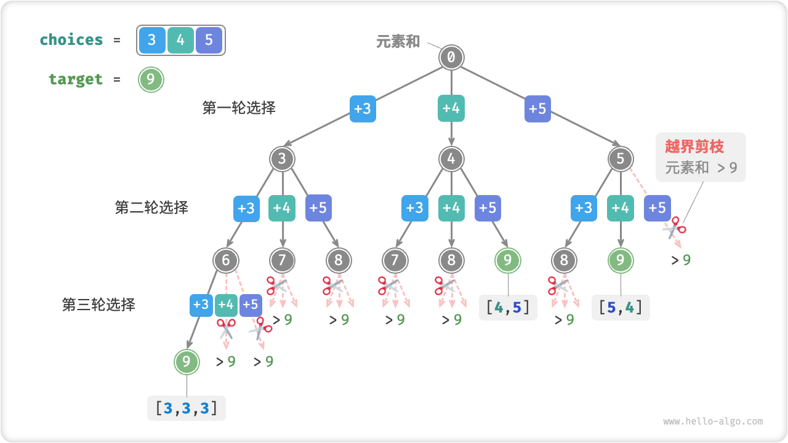

# 13.3 &nbsp; 子集和问题

## 13.3.1 &nbsp; 无重复元素的情况

!!! question

    给定一个正整数数组 `nums` 和一个目标正整数 `target` ，请找出所有可能的组合，使得组合中的元素和等于 `target` 。给定数组无重复元素，每个元素可以被选取多次。请以列表形式返回这些组合，列表中不应包含重复组合。

例如，输入集合 $\{3, 4, 5\}$ 和目标整数 $9$ ，解为 $\{3, 3, 3\}, \{4, 5\}$ 。需要注意以下两点。

- 输入集合中的元素可以被无限次重复选取。
- 子集是不区分元素顺序的，比如 $\{4, 5\}$ 和 $\{5, 4\}$ 是同一个子集。

### 1. &nbsp; 参考全排列解法

类似于全排列问题，我们可以把子集的生成过程想象成一系列选择的结果，并在选择过程中实时更新“元素和”，当元素和等于 `target` 时，就将子集记录至结果列表。

而与全排列问题不同的是，**本题集合中的元素可以被无限次选取**，因此无须借助 `selected` 布尔列表来记录元素是否已被选择。我们可以对全排列代码进行小幅修改，初步得到解题代码。

=== "Python"

    ```python title="subset_sum_i_naive.py"
    def backtrack(
        state: list[int],
        target: int,
        total: int,
        choices: list[int],
        res: list[list[int]],
    ):
        """回溯算法：子集和 I"""
        # 子集和等于 target 时，记录解
        if total == target:
            res.append(list(state))
            return
        # 遍历所有选择
        for i in range(len(choices)):
            # 剪枝：若子集和超过 target ，则跳过该选择
            if total + choices[i] > target:
                continue
            # 尝试：做出选择，更新元素和 total
            state.append(choices[i])
            # 进行下一轮选择
            backtrack(state, target, total + choices[i], choices, res)
            # 回退：撤销选择，恢复到之前的状态
            state.pop()

    def subset_sum_i_naive(nums: list[int], target: int) -> list[list[int]]:
        """求解子集和 I（包含重复子集）"""
        state = []  # 状态（子集）
        total = 0  # 子集和
        res = []  # 结果列表（子集列表）
        backtrack(state, target, total, nums, res)
        return res
    ```

=== "C++"

    ```cpp title="subset_sum_i_naive.cpp"
    /* 回溯算法：子集和 I */
    void backtrack(vector<int> &state, int target, int total, vector<int> &choices, vector<vector<int>> &res) {
        // 子集和等于 target 时，记录解
        if (total == target) {
            res.push_back(state);
            return;
        }
        // 遍历所有选择
        for (size_t i = 0; i < choices.size(); i++) {
            // 剪枝：若子集和超过 target ，则跳过该选择
            if (total + choices[i] > target) {
                continue;
            }
            // 尝试：做出选择，更新元素和 total
            state.push_back(choices[i]);
            // 进行下一轮选择
            backtrack(state, target, total + choices[i], choices, res);
            // 回退：撤销选择，恢复到之前的状态
            state.pop_back();
        }
    }

    /* 求解子集和 I（包含重复子集） */
    vector<vector<int>> subsetSumINaive(vector<int> &nums, int target) {
        vector<int> state;       // 状态（子集）
        int total = 0;           // 子集和
        vector<vector<int>> res; // 结果列表（子集列表）
        backtrack(state, target, total, nums, res);
        return res;
    }
    ```

=== "Java"

    ```java title="subset_sum_i_naive.java"
    /* 回溯算法：子集和 I */
    void backtrack(List<Integer> state, int target, int total, int[] choices, List<List<Integer>> res) {
        // 子集和等于 target 时，记录解
        if (total == target) {
            res.add(new ArrayList<>(state));
            return;
        }
        // 遍历所有选择
        for (int i = 0; i < choices.length; i++) {
            // 剪枝：若子集和超过 target ，则跳过该选择
            if (total + choices[i] > target) {
                continue;
            }
            // 尝试：做出选择，更新元素和 total
            state.add(choices[i]);
            // 进行下一轮选择
            backtrack(state, target, total + choices[i], choices, res);
            // 回退：撤销选择，恢复到之前的状态
            state.remove(state.size() - 1);
        }
    }

    /* 求解子集和 I（包含重复子集） */
    List<List<Integer>> subsetSumINaive(int[] nums, int target) {
        List<Integer> state = new ArrayList<>(); // 状态（子集）
        int total = 0; // 子集和
        List<List<Integer>> res = new ArrayList<>(); // 结果列表（子集列表）
        backtrack(state, target, total, nums, res);
        return res;
    }
    ```

=== "C#"

    ```csharp title="subset_sum_i_naive.cs"
    /* 回溯算法：子集和 I */
    void backtrack(List<int> state, int target, int total, int[] choices, List<List<int>> res) {
        // 子集和等于 target 时，记录解
        if (total == target) {
            res.Add(new List<int>(state));
            return;
        }
        // 遍历所有选择
        for (int i = 0; i < choices.Length; i++) {
            // 剪枝：若子集和超过 target ，则跳过该选择
            if (total + choices[i] > target) {
                continue;
            }
            // 尝试：做出选择，更新元素和 total
            state.Add(choices[i]);
            // 进行下一轮选择
            backtrack(state, target, total + choices[i], choices, res);
            // 回退：撤销选择，恢复到之前的状态
            state.RemoveAt(state.Count - 1);
        }
    }

    /* 求解子集和 I（包含重复子集） */
    List<List<int>> subsetSumINaive(int[] nums, int target) {
        List<int> state = new List<int>(); // 状态（子集）
        int total = 0; // 子集和
        List<List<int>> res = new List<List<int>>(); // 结果列表（子集列表）
        backtrack(state, target, total, nums, res);
        return res;
    }
    ```

=== "Go"

    ```go title="subset_sum_i_naive.go"
    /* 回溯算法：子集和 I */
    func backtrackSubsetSumINaive(total, target int, state, choices *[]int, res *[][]int) {
        // 子集和等于 target 时，记录解
        if target == total {
            newState := append([]int{}, *state...)
            *res = append(*res, newState)
            return
        }
        // 遍历所有选择
        for i := 0; i < len(*choices); i++ {
            // 剪枝：若子集和超过 target ，则跳过该选择
            if total+(*choices)[i] > target {
                continue
            }
            // 尝试：做出选择，更新元素和 total
            *state = append(*state, (*choices)[i])
            // 进行下一轮选择
            backtrackSubsetSumINaive(total+(*choices)[i], target, state, choices, res)
            // 回退：撤销选择，恢复到之前的状态
            *state = (*state)[:len(*state)-1]
        }
    }

    /* 求解子集和 I（包含重复子集） */
    func subsetSumINaive(nums []int, target int) [][]int {
        state := make([]int, 0) // 状态（子集）
        total := 0              // 子集和
        res := make([][]int, 0) // 结果列表（子集列表）
        backtrackSubsetSumINaive(total, target, &state, &nums, &res)
        return res
    }
    ```

=== "Swift"

    ```swift title="subset_sum_i_naive.swift"
    /* 回溯算法：子集和 I */
    func backtrack(state: inout [Int], target: Int, total: Int, choices: [Int], res: inout [[Int]]) {
        // 子集和等于 target 时，记录解
        if total == target {
            res.append(state)
            return
        }
        // 遍历所有选择
        for i in stride(from: 0, to: choices.count, by: 1) {
            // 剪枝：若子集和超过 target ，则跳过该选择
            if total + choices[i] > target {
                continue
            }
            // 尝试：做出选择，更新元素和 total
            state.append(choices[i])
            // 进行下一轮选择
            backtrack(state: &state, target: target, total: total + choices[i], choices: choices, res: &res)
            // 回退：撤销选择，恢复到之前的状态
            state.removeLast()
        }
    }

    /* 求解子集和 I（包含重复子集） */
    func subsetSumINaive(nums: [Int], target: Int) -> [[Int]] {
        var state: [Int] = [] // 状态（子集）
        let total = 0 // 子集和
        var res: [[Int]] = [] // 结果列表（子集列表）
        backtrack(state: &state, target: target, total: total, choices: nums, res: &res)
        return res
    }
    ```

=== "JS"

    ```javascript title="subset_sum_i_naive.js"
    /* 回溯算法：子集和 I */
    function backtrack(state, target, total, choices, res) {
        // 子集和等于 target 时，记录解
        if (total === target) {
            res.push([...state]);
            return;
        }
        // 遍历所有选择
        for (let i = 0; i < choices.length; i++) {
            // 剪枝：若子集和超过 target ，则跳过该选择
            if (total + choices[i] > target) {
                continue;
            }
            // 尝试：做出选择，更新元素和 total
            state.push(choices[i]);
            // 进行下一轮选择
            backtrack(state, target, total + choices[i], choices, res);
            // 回退：撤销选择，恢复到之前的状态
            state.pop();
        }
    }

    /* 求解子集和 I（包含重复子集） */
    function subsetSumINaive(nums, target) {
        const state = []; // 状态（子集）
        const total = 0; // 子集和
        const res = []; // 结果列表（子集列表）
        backtrack(state, target, total, nums, res);
        return res;
    }
    ```

=== "TS"

    ```typescript title="subset_sum_i_naive.ts"
    /* 回溯算法：子集和 I */
    function backtrack(
        state: number[],
        target: number,
        total: number,
        choices: number[],
        res: number[][]
    ): void {
        // 子集和等于 target 时，记录解
        if (total === target) {
            res.push([...state]);
            return;
        }
        // 遍历所有选择
        for (let i = 0; i < choices.length; i++) {
            // 剪枝：若子集和超过 target ，则跳过该选择
            if (total + choices[i] > target) {
                continue;
            }
            // 尝试：做出选择，更新元素和 total
            state.push(choices[i]);
            // 进行下一轮选择
            backtrack(state, target, total + choices[i], choices, res);
            // 回退：撤销选择，恢复到之前的状态
            state.pop();
        }
    }

    /* 求解子集和 I（包含重复子集） */
    function subsetSumINaive(nums: number[], target: number): number[][] {
        const state = []; // 状态（子集）
        const total = 0; // 子集和
        const res = []; // 结果列表（子集列表）
        backtrack(state, target, total, nums, res);
        return res;
    }
    ```

=== "Dart"

    ```dart title="subset_sum_i_naive.dart"
    /* 回溯算法：子集和 I */
    void backtrack(
      List<int> state,
      int target,
      int total,
      List<int> choices,
      List<List<int>> res,
    ) {
      // 子集和等于 target 时，记录解
      if (total == target) {
        res.add(List.from(state));
        return;
      }
      // 遍历所有选择
      for (int i = 0; i < choices.length; i++) {
        // 剪枝：若子集和超过 target ，则跳过该选择
        if (total + choices[i] > target) {
          continue;
        }
        // 尝试：做出选择，更新元素和 total
        state.add(choices[i]);
        // 进行下一轮选择
        backtrack(state, target, total + choices[i], choices, res);
        // 回退：撤销选择，恢复到之前的状态
        state.removeLast();
      }
    }

    /* 求解子集和 I（包含重复子集） */
    List<List<int>> subsetSumINaive(List<int> nums, int target) {
      List<int> state = []; // 状态（子集）
      int total = 0; // 元素和
      List<List<int>> res = []; // 结果列表（子集列表）
      backtrack(state, target, total, nums, res);
      return res;
    }
    ```

=== "Rust"

    ```rust title="subset_sum_i_naive.rs"
    /* 回溯算法：子集和 I */
    fn backtrack(mut state: Vec<i32>, target: i32, total: i32, choices: &[i32], res: &mut Vec<Vec<i32>>) {
        // 子集和等于 target 时，记录解
        if total == target {
            res.push(state);
            return;
        }
        // 遍历所有选择
        for i in 0..choices.len() {
            // 剪枝：若子集和超过 target ，则跳过该选择
            if total + choices[i] > target {
                continue;
            }
            // 尝试：做出选择，更新元素和 total
            state.push(choices[i]);
            // 进行下一轮选择
            backtrack(state.clone(), target, total + choices[i], choices, res);
            // 回退：撤销选择，恢复到之前的状态
            state.pop();
        }
    }

    /* 求解子集和 I（包含重复子集） */
    fn subset_sum_i_naive(nums: &[i32], target: i32) -> Vec<Vec<i32>> {
        let state = Vec::new(); // 状态（子集）
        let total = 0; // 子集和
        let mut res = Vec::new(); // 结果列表（子集列表）
        backtrack(state, target, total, nums, &mut res);
        res
    }
    ```

=== "C"

    ```c title="subset_sum_i_naive.c"
    /* 回溯算法：子集和 I */
    void backtrack(vector *state, int target, int total, vector *choices, vector *res) {
        // 子集和等于 target 时，记录解
        if (total == target) {
            vector *tmpVector = newVector();
            for (int i = 0; i < state->size; i++) {
                vectorPushback(tmpVector, state->data[i], sizeof(int));
            }
            vectorPushback(res, tmpVector, sizeof(vector));
            return;
        }
        // 遍历所有选择
        for (size_t i = 0; i < choices->size; i++) {
            // 剪枝：若子集和超过 target ，则跳过该选择
            if (total + *(int *)(choices->data[i]) > target) {
                continue;
            }
            // 尝试：做出选择，更新元素和 total
            vectorPushback(state, choices->data[i], sizeof(int));
            // 进行下一轮选择
            backtrack(state, target, total + *(int *)(choices->data[i]), choices, res);
            // 回退：撤销选择，恢复到之前的状态
            vectorPopback(state);
        }
    }

    /* 求解子集和 I（包含重复子集） */
    vector *subsetSumINaive(vector *nums, int target) {
        vector *state = newVector(); // 状态（子集）
        int total = 0;               // 子集和
        vector *res = newVector();   // 结果列表（子集列表）
        backtrack(state, target, total, nums, res);
        return res;
    }
    ```

=== "Zig"

    ```zig title="subset_sum_i_naive.zig"
    [class]{}-[func]{backtrack}

    [class]{}-[func]{subsetSumINaive}
    ```

向以上代码输入数组 $[3, 4, 5]$ 和目标元素 $9$ ，输出结果为 $[3, 3, 3], [4, 5], [5, 4]$ 。**虽然成功找出了所有和为 $9$ 的子集，但其中存在重复的子集 $[4, 5]$ 和 $[5, 4]$** 。

这是因为搜索过程是区分选择顺序的，然而子集不区分选择顺序。如图 13-10 所示，先选 $4$ 后选 $5$ 与先选 $5$ 后选 $4$ 是两个不同的分支，但两者对应同一个子集。



<p align="center"> 图 13-10 &nbsp; 子集搜索与越界剪枝 </p>

为了去除重复子集，**一种直接的思路是对结果列表进行去重**。但这个方法效率很低，有两方面原因。

- 当数组元素较多，尤其是当 `target` 较大时，搜索过程会产生大量的重复子集。
- 比较子集（数组）的异同非常耗时，需要先排序数组，再比较数组中每个元素的异同。

### 2. &nbsp; 重复子集剪枝

**我们考虑在搜索过程中通过剪枝进行去重**。观察图 13-11 ，重复子集是在以不同顺序选择数组元素时产生的，例如以下情况。

1. 当第一轮和第二轮分别选择 $3$ 和 $4$ 时，会生成包含这两个元素的所有子集，记为 $[3, 4, \dots]$ 。
2. 之后，当第一轮选择 $4$ 时，**则第二轮应该跳过 $3$** ，因为该选择产生的子集 $[4, 3, \dots]$ 和 `1.` 中生成的子集完全重复。

在搜索中，每一层的选择都是从左到右被逐个尝试的，因此越靠右的分支被剪掉的越多。

1. 前两轮选择 $3$ 和 $5$ ，生成子集 $[3, 5, \dots]$ 。
2. 前两轮选择 $4$ 和 $5$ ，生成子集 $[4, 5, \dots]$ 。
3. 若第一轮选择 $5$ ，**则第二轮应该跳过 $3$ 和 $4$** ，因为子集 $[5, 3, \dots]$ 和 $[5, 4, \dots]$ 与第 `1.` 和 `2.` 步中描述的子集完全重复。


<p align="center"> 图 13-11 &nbsp; 不同选择顺序导致的重复子集 </p>

总结来看，给定输入数组 $[x_1, x_2, \dots, x_n]$ ，设搜索过程中的选择序列为 $[x_{i_1}, x_{i_2}, \dots, x_{i_m}]$ ，则该选择序列需要满足 $i_1 \leq i_2 \leq \dots \leq i_m$ ，**不满足该条件的选择序列都会造成重复，应当剪枝**。

### 3. &nbsp; 代码实现

为实现该剪枝，我们初始化变量 `start` ，用于指示遍历起点。**当做出选择 $x_{i}$ 后，设定下一轮从索引 $i$ 开始遍历**。这样做就可以让选择序列满足 $i_1 \leq i_2 \leq \dots \leq i_m$ ，从而保证子集唯一。

除此之外，我们还对代码进行了以下两项优化。

- 在开启搜索前，先将数组 `nums` 排序。在遍历所有选择时，**当子集和超过 `target` 时直接结束循环**，因为后边的元素更大，其子集和都一定会超过 `target` 。
- 省去元素和变量 `total`，**通过在 `target` 上执行减法来统计元素和**，当 `target` 等于 $0$ 时记录解。

=== "Python"

    ```python title="subset_sum_i.py"
    def backtrack(
        state: list[int], target: int, choices: list[int], start: int, res: list[list[int]]
    ):
        """回溯算法：子集和 I"""
        # 子集和等于 target 时，记录解
        if target == 0:
            res.append(list(state))
            return
        # 遍历所有选择
        # 剪枝二：从 start 开始遍历，避免生成重复子集
        for i in range(start, len(choices)):
            # 剪枝一：若子集和超过 target ，则直接结束循环
            # 这是因为数组已排序，后边元素更大，子集和一定超过 target
            if target - choices[i] < 0:
                break
            # 尝试：做出选择，更新 target, start
            state.append(choices[i])
            # 进行下一轮选择
            backtrack(state, target - choices[i], choices, i, res)
            # 回退：撤销选择，恢复到之前的状态
            state.pop()

    def subset_sum_i(nums: list[int], target: int) -> list[list[int]]:
        """求解子集和 I"""
        state = []  # 状态（子集）
        nums.sort()  # 对 nums 进行排序
        start = 0  # 遍历起始点
        res = []  # 结果列表（子集列表）
        backtrack(state, target, nums, start, res)
        return res
    ```

=== "C++"

    ```cpp title="subset_sum_i.cpp"
    /* 回溯算法：子集和 I */
    void backtrack(vector<int> &state, int target, vector<int> &choices, int start, vector<vector<int>> &res) {
        // 子集和等于 target 时，记录解
        if (target == 0) {
            res.push_back(state);
            return;
        }
        // 遍历所有选择
        // 剪枝二：从 start 开始遍历，避免生成重复子集
        for (int i = start; i < choices.size(); i++) {
            // 剪枝一：若子集和超过 target ，则直接结束循环
            // 这是因为数组已排序，后边元素更大，子集和一定超过 target
            if (target - choices[i] < 0) {
                break;
            }
            // 尝试：做出选择，更新 target, start
            state.push_back(choices[i]);
            // 进行下一轮选择
            backtrack(state, target - choices[i], choices, i, res);
            // 回退：撤销选择，恢复到之前的状态
            state.pop_back();
        }
    }

    /* 求解子集和 I */
    vector<vector<int>> subsetSumI(vector<int> &nums, int target) {
        vector<int> state;              // 状态（子集）
        sort(nums.begin(), nums.end()); // 对 nums 进行排序
        int start = 0;                  // 遍历起始点
        vector<vector<int>> res;        // 结果列表（子集列表）
        backtrack(state, target, nums, start, res);
        return res;
    }
    ```

=== "Java"

    ```java title="subset_sum_i.java"
    /* 回溯算法：子集和 I */
    void backtrack(List<Integer> state, int target, int[] choices, int start, List<List<Integer>> res) {
        // 子集和等于 target 时，记录解
        if (target == 0) {
            res.add(new ArrayList<>(state));
            return;
        }
        // 遍历所有选择
        // 剪枝二：从 start 开始遍历，避免生成重复子集
        for (int i = start; i < choices.length; i++) {
            // 剪枝一：若子集和超过 target ，则直接结束循环
            // 这是因为数组已排序，后边元素更大，子集和一定超过 target
            if (target - choices[i] < 0) {
                break;
            }
            // 尝试：做出选择，更新 target, start
            state.add(choices[i]);
            // 进行下一轮选择
            backtrack(state, target - choices[i], choices, i, res);
            // 回退：撤销选择，恢复到之前的状态
            state.remove(state.size() - 1);
        }
    }

    /* 求解子集和 I */
    List<List<Integer>> subsetSumI(int[] nums, int target) {
        List<Integer> state = new ArrayList<>(); // 状态（子集）
        Arrays.sort(nums); // 对 nums 进行排序
        int start = 0; // 遍历起始点
        List<List<Integer>> res = new ArrayList<>(); // 结果列表（子集列表）
        backtrack(state, target, nums, start, res);
        return res;
    }
    ```

=== "C#"

    ```csharp title="subset_sum_i.cs"
    /* 回溯算法：子集和 I */
    void backtrack(List<int> state, int target, int[] choices, int start, List<List<int>> res) {
        // 子集和等于 target 时，记录解
        if (target == 0) {
            res.Add(new List<int>(state));
            return;
        }
        // 遍历所有选择
        // 剪枝二：从 start 开始遍历，避免生成重复子集
        for (int i = start; i < choices.Length; i++) {
            // 剪枝一：若子集和超过 target ，则直接结束循环
            // 这是因为数组已排序，后边元素更大，子集和一定超过 target
            if (target - choices[i] < 0) {
                break;
            }
            // 尝试：做出选择，更新 target, start
            state.Add(choices[i]);
            // 进行下一轮选择
            backtrack(state, target - choices[i], choices, i, res);
            // 回退：撤销选择，恢复到之前的状态
            state.RemoveAt(state.Count - 1);
        }
    }

    /* 求解子集和 I */
    List<List<int>> subsetSumI(int[] nums, int target) {
        List<int> state = new List<int>(); // 状态（子集）
        Array.Sort(nums); // 对 nums 进行排序
        int start = 0; // 遍历起始点
        List<List<int>> res = new List<List<int>>(); // 结果列表（子集列表）
        backtrack(state, target, nums, start, res);
        return res;
    }
    ```

=== "Go"

    ```go title="subset_sum_i.go"
    /* 回溯算法：子集和 I */
    func backtrackSubsetSumI(start, target int, state, choices *[]int, res *[][]int) {
        // 子集和等于 target 时，记录解
        if target == 0 {
            newState := append([]int{}, *state...)
            *res = append(*res, newState)
            return
        }
        // 遍历所有选择
        // 剪枝二：从 start 开始遍历，避免生成重复子集
        for i := start; i < len(*choices); i++ {
            // 剪枝一：若子集和超过 target ，则直接结束循环
            // 这是因为数组已排序，后边元素更大，子集和一定超过 target
            if target-(*choices)[i] < 0 {
                break
            }
            // 尝试：做出选择，更新 target, start
            *state = append(*state, (*choices)[i])
            // 进行下一轮选择
            backtrackSubsetSumI(i, target-(*choices)[i], state, choices, res)
            // 回退：撤销选择，恢复到之前的状态
            *state = (*state)[:len(*state)-1]
        }
    }

    /* 求解子集和 I */
    func subsetSumI(nums []int, target int) [][]int {
        state := make([]int, 0) // 状态（子集）
        sort.Ints(nums)         // 对 nums 进行排序
        start := 0              // 遍历起始点
        res := make([][]int, 0) // 结果列表（子集列表）
        backtrackSubsetSumI(start, target, &state, &nums, &res)
        return res
    }
    ```

=== "Swift"

    ```swift title="subset_sum_i.swift"
    /* 回溯算法：子集和 I */
    func backtrack(state: inout [Int], target: Int, choices: [Int], start: Int, res: inout [[Int]]) {
        // 子集和等于 target 时，记录解
        if target == 0 {
            res.append(state)
            return
        }
        // 遍历所有选择
        // 剪枝二：从 start 开始遍历，避免生成重复子集
        for i in stride(from: start, to: choices.count, by: 1) {
            // 剪枝一：若子集和超过 target ，则直接结束循环
            // 这是因为数组已排序，后边元素更大，子集和一定超过 target
            if target - choices[i] < 0 {
                break
            }
            // 尝试：做出选择，更新 target, start
            state.append(choices[i])
            // 进行下一轮选择
            backtrack(state: &state, target: target - choices[i], choices: choices, start: i, res: &res)
            // 回退：撤销选择，恢复到之前的状态
            state.removeLast()
        }
    }

    /* 求解子集和 I */
    func subsetSumI(nums: [Int], target: Int) -> [[Int]] {
        var state: [Int] = [] // 状态（子集）
        let nums = nums.sorted() // 对 nums 进行排序
        let start = 0 // 遍历起始点
        var res: [[Int]] = [] // 结果列表（子集列表）
        backtrack(state: &state, target: target, choices: nums, start: start, res: &res)
        return res
    }
    ```

=== "JS"

    ```javascript title="subset_sum_i.js"
    /* 回溯算法：子集和 I */
    function backtrack(state, target, choices, start, res) {
        // 子集和等于 target 时，记录解
        if (target === 0) {
            res.push([...state]);
            return;
        }
        // 遍历所有选择
        // 剪枝二：从 start 开始遍历，避免生成重复子集
        for (let i = start; i < choices.length; i++) {
            // 剪枝一：若子集和超过 target ，则直接结束循环
            // 这是因为数组已排序，后边元素更大，子集和一定超过 target
            if (target - choices[i] < 0) {
                break;
            }
            // 尝试：做出选择，更新 target, start
            state.push(choices[i]);
            // 进行下一轮选择
            backtrack(state, target - choices[i], choices, i, res);
            // 回退：撤销选择，恢复到之前的状态
            state.pop();
        }
    }

    /* 求解子集和 I */
    function subsetSumI(nums, target) {
        const state = []; // 状态（子集）
        nums.sort(); // 对 nums 进行排序
        const start = 0; // 遍历起始点
        const res = []; // 结果列表（子集列表）
        backtrack(state, target, nums, start, res);
        return res;
    }
    ```

=== "TS"

    ```typescript title="subset_sum_i.ts"
    /* 回溯算法：子集和 I */
    function backtrack(
        state: number[],
        target: number,
        choices: number[],
        start: number,
        res: number[][]
    ): void {
        // 子集和等于 target 时，记录解
        if (target === 0) {
            res.push([...state]);
            return;
        }
        // 遍历所有选择
        // 剪枝二：从 start 开始遍历，避免生成重复子集
        for (let i = start; i < choices.length; i++) {
            // 剪枝一：若子集和超过 target ，则直接结束循环
            // 这是因为数组已排序，后边元素更大，子集和一定超过 target
            if (target - choices[i] < 0) {
                break;
            }
            // 尝试：做出选择，更新 target, start
            state.push(choices[i]);
            // 进行下一轮选择
            backtrack(state, target - choices[i], choices, i, res);
            // 回退：撤销选择，恢复到之前的状态
            state.pop();
        }
    }

    /* 求解子集和 I */
    function subsetSumI(nums: number[], target: number): number[][] {
        const state = []; // 状态（子集）
        nums.sort(); // 对 nums 进行排序
        const start = 0; // 遍历起始点
        const res = []; // 结果列表（子集列表）
        backtrack(state, target, nums, start, res);
        return res;
    }
    ```

=== "Dart"

    ```dart title="subset_sum_i.dart"
    /* 回溯算法：子集和 I */
    void backtrack(
      List<int> state,
      int target,
      List<int> choices,
      int start,
      List<List<int>> res,
    ) {
      // 子集和等于 target 时，记录解
      if (target == 0) {
        res.add(List.from(state));
        return;
      }
      // 遍历所有选择
      // 剪枝二：从 start 开始遍历，避免生成重复子集
      for (int i = start; i < choices.length; i++) {
        // 剪枝一：若子集和超过 target ，则直接结束循环
        // 这是因为数组已排序，后边元素更大，子集和一定超过 target
        if (target - choices[i] < 0) {
          break;
        }
        // 尝试：做出选择，更新 target, start
        state.add(choices[i]);
        // 进行下一轮选择
        backtrack(state, target - choices[i], choices, i, res);
        // 回退：撤销选择，恢复到之前的状态
        state.removeLast();
      }
    }

    /* 求解子集和 I */
    List<List<int>> subsetSumI(List<int> nums, int target) {
      List<int> state = []; // 状态（子集）
      nums.sort(); // 对 nums 进行排序
      int start = 0; // 遍历起始点
      List<List<int>> res = []; // 结果列表（子集列表）
      backtrack(state, target, nums, start, res);
      return res;
    }
    ```

=== "Rust"

    ```rust title="subset_sum_i.rs"
    /* 回溯算法：子集和 I */
    fn backtrack(mut state: Vec<i32>, target: i32, choices: &[i32], start: usize, res: &mut Vec<Vec<i32>>) {
        // 子集和等于 target 时，记录解
        if target == 0 {
            res.push(state);
            return;
        }
        // 遍历所有选择
        // 剪枝二：从 start 开始遍历，避免生成重复子集
        for i in start..choices.len() {
            // 剪枝一：若子集和超过 target ，则直接结束循环
            // 这是因为数组已排序，后边元素更大，子集和一定超过 target
            if target - choices[i] < 0 {
                break;
            }
            // 尝试：做出选择，更新 target, start
            state.push(choices[i]);
            // 进行下一轮选择
            backtrack(state.clone(), target - choices[i], choices, i, res);
            // 回退：撤销选择，恢复到之前的状态
            state.pop();
        }
    }

    /* 求解子集和 I */
    fn subset_sum_i(nums: &mut [i32], target: i32) -> Vec<Vec<i32>> {
        let state = Vec::new(); // 状态（子集）
        nums.sort(); // 对 nums 进行排序
        let start = 0; // 遍历起始点
        let mut res = Vec::new(); // 结果列表（子集列表）
        backtrack(state, target, nums, start, &mut res);
        res
    }
    ```

=== "C"

    ```c title="subset_sum_i.c"
    /* 回溯算法：子集和 I */
    void backtrack(vector *state, int target, vector *choices, int start, vector *res) {
        // 子集和等于 target 时，记录解
        if (target == 0) {
            vector *tmpVector = newVector();
            for (int i = 0; i < state->size; i++) {
                vectorPushback(tmpVector, state->data[i], sizeof(int));
            }
            vectorPushback(res, tmpVector, sizeof(vector));
            return;
        }
        // 遍历所有选择
        // 剪枝二：从 start 开始遍历，避免生成重复子集
        for (int i = start; i < choices->size; i++) {
            // 剪枝：若子集和超过 target ，则跳过该选择
            if (target - *(int *)(choices->data[i]) < 0) {
                break;
            }
            // 尝试：做出选择，更新 target, start
            vectorPushback(state, choices->data[i], sizeof(int));
            // 进行下一轮选择
            backtrack(state, target - *(int *)(choices->data[i]), choices, i, res);
            // 回退：撤销选择，恢复到之前的状态
            vectorPopback(state);
        }
    }

    /* 求解子集和 I */
    vector *subsetSumI(vector *nums, int target) {
        vector *state = newVector();                        // 状态（子集）
        qsort(nums->data, nums->size, sizeof(int *), comp); // 对 nums 进行排序
        int start = 0;                                      // 子集和
        vector *res = newVector();                          // 结果列表（子集列表）
        backtrack(state, target, nums, start, res);
        return res;
    }
    ```

=== "Zig"

    ```zig title="subset_sum_i.zig"
    [class]{}-[func]{backtrack}

    [class]{}-[func]{subsetSumI}
    ```

如图 13-12 所示，为将数组 $[3, 4, 5]$ 和目标元素 $9$ 输入到以上代码后的整体回溯过程。


<p align="center"> 图 13-12 &nbsp; 子集和 I 回溯过程 </p>

## 13.3.2 &nbsp; 考虑重复元素的情况

!!! question

    给定一个正整数数组 `nums` 和一个目标正整数 `target` ，请找出所有可能的组合，使得组合中的元素和等于 `target` 。**给定数组可能包含重复元素，每个元素只可被选择一次**。请以列表形式返回这些组合，列表中不应包含重复组合。

相比于上题，**本题的输入数组可能包含重复元素**，这引入了新的问题。例如，给定数组 $[4, \hat{4}, 5]$ 和目标元素 $9$ ，则现有代码的输出结果为 $[4, 5], [\hat{4}, 5]$ ，出现了重复子集。

**造成这种重复的原因是相等元素在某轮中被多次选择**。在图 13-13 中，第一轮共有三个选择，其中两个都为 $4$ ，会产生两个重复的搜索分支，从而输出重复子集；同理，第二轮的两个 $4$ 也会产生重复子集。


<p align="center"> 图 13-13 &nbsp; 相等元素导致的重复子集 </p>

### 1. &nbsp; 相等元素剪枝

为解决此问题，**我们需要限制相等元素在每一轮中只被选择一次**。实现方式比较巧妙：由于数组是已排序的，因此相等元素都是相邻的。这意味着在某轮选择中，若当前元素与其左边元素相等，则说明它已经被选择过，因此直接跳过当前元素。

与此同时，**本题规定中的每个数组元素只能被选择一次**。幸运的是，我们也可以利用变量 `start` 来满足该约束：当做出选择 $x_{i}$ 后，设定下一轮从索引 $i + 1$ 开始向后遍历。这样即能去除重复子集，也能避免重复选择元素。

### 2. &nbsp; 代码实现

=== "Python"

    ```python title="subset_sum_ii.py"
    def backtrack(
        state: list[int], target: int, choices: list[int], start: int, res: list[list[int]]
    ):
        """回溯算法：子集和 II"""
        # 子集和等于 target 时，记录解
        if target == 0:
            res.append(list(state))
            return
        # 遍历所有选择
        # 剪枝二：从 start 开始遍历，避免生成重复子集
        # 剪枝三：从 start 开始遍历，避免重复选择同一元素
        for i in range(start, len(choices)):
            # 剪枝一：若子集和超过 target ，则直接结束循环
            # 这是因为数组已排序，后边元素更大，子集和一定超过 target
            if target - choices[i] < 0:
                break
            # 剪枝四：如果该元素与左边元素相等，说明该搜索分支重复，直接跳过
            if i > start and choices[i] == choices[i - 1]:
                continue
            # 尝试：做出选择，更新 target, start
            state.append(choices[i])
            # 进行下一轮选择
            backtrack(state, target - choices[i], choices, i + 1, res)
            # 回退：撤销选择，恢复到之前的状态
            state.pop()

    def subset_sum_ii(nums: list[int], target: int) -> list[list[int]]:
        """求解子集和 II"""
        state = []  # 状态（子集）
        nums.sort()  # 对 nums 进行排序
        start = 0  # 遍历起始点
        res = []  # 结果列表（子集列表）
        backtrack(state, target, nums, start, res)
        return res
    ```

=== "C++"

    ```cpp title="subset_sum_ii.cpp"
    /* 回溯算法：子集和 II */
    void backtrack(vector<int> &state, int target, vector<int> &choices, int start, vector<vector<int>> &res) {
        // 子集和等于 target 时，记录解
        if (target == 0) {
            res.push_back(state);
            return;
        }
        // 遍历所有选择
        // 剪枝二：从 start 开始遍历，避免生成重复子集
        // 剪枝三：从 start 开始遍历，避免重复选择同一元素
        for (int i = start; i < choices.size(); i++) {
            // 剪枝一：若子集和超过 target ，则直接结束循环
            // 这是因为数组已排序，后边元素更大，子集和一定超过 target
            if (target - choices[i] < 0) {
                break;
            }
            // 剪枝四：如果该元素与左边元素相等，说明该搜索分支重复，直接跳过
            if (i > start && choices[i] == choices[i - 1]) {
                continue;
            }
            // 尝试：做出选择，更新 target, start
            state.push_back(choices[i]);
            // 进行下一轮选择
            backtrack(state, target - choices[i], choices, i + 1, res);
            // 回退：撤销选择，恢复到之前的状态
            state.pop_back();
        }
    }

    /* 求解子集和 II */
    vector<vector<int>> subsetSumII(vector<int> &nums, int target) {
        vector<int> state;              // 状态（子集）
        sort(nums.begin(), nums.end()); // 对 nums 进行排序
        int start = 0;                  // 遍历起始点
        vector<vector<int>> res;        // 结果列表（子集列表）
        backtrack(state, target, nums, start, res);
        return res;
    }
    ```

=== "Java"

    ```java title="subset_sum_ii.java"
    /* 回溯算法：子集和 II */
    void backtrack(List<Integer> state, int target, int[] choices, int start, List<List<Integer>> res) {
        // 子集和等于 target 时，记录解
        if (target == 0) {
            res.add(new ArrayList<>(state));
            return;
        }
        // 遍历所有选择
        // 剪枝二：从 start 开始遍历，避免生成重复子集
        // 剪枝三：从 start 开始遍历，避免重复选择同一元素
        for (int i = start; i < choices.length; i++) {
            // 剪枝一：若子集和超过 target ，则直接结束循环
            // 这是因为数组已排序，后边元素更大，子集和一定超过 target
            if (target - choices[i] < 0) {
                break;
            }
            // 剪枝四：如果该元素与左边元素相等，说明该搜索分支重复，直接跳过
            if (i > start && choices[i] == choices[i - 1]) {
                continue;
            }
            // 尝试：做出选择，更新 target, start
            state.add(choices[i]);
            // 进行下一轮选择
            backtrack(state, target - choices[i], choices, i + 1, res);
            // 回退：撤销选择，恢复到之前的状态
            state.remove(state.size() - 1);
        }
    }

    /* 求解子集和 II */
    List<List<Integer>> subsetSumII(int[] nums, int target) {
        List<Integer> state = new ArrayList<>(); // 状态（子集）
        Arrays.sort(nums); // 对 nums 进行排序
        int start = 0; // 遍历起始点
        List<List<Integer>> res = new ArrayList<>(); // 结果列表（子集列表）
        backtrack(state, target, nums, start, res);
        return res;
    }
    ```

=== "C#"

    ```csharp title="subset_sum_ii.cs"
    /* 回溯算法：子集和 II */
    void backtrack(List<int> state, int target, int[] choices, int start, List<List<int>> res) {
        // 子集和等于 target 时，记录解
        if (target == 0) {
            res.Add(new List<int>(state));
            return;
        }
        // 遍历所有选择
        // 剪枝二：从 start 开始遍历，避免生成重复子集
        // 剪枝三：从 start 开始遍历，避免重复选择同一元素
        for (int i = start; i < choices.Length; i++) {
            // 剪枝一：若子集和超过 target ，则直接结束循环
            // 这是因为数组已排序，后边元素更大，子集和一定超过 target
            if (target - choices[i] < 0) {
                break;
            }
            // 剪枝四：如果该元素与左边元素相等，说明该搜索分支重复，直接跳过
            if (i > start && choices[i] == choices[i - 1]) {
                continue;
            }
            // 尝试：做出选择，更新 target, start
            state.Add(choices[i]);
            // 进行下一轮选择
            backtrack(state, target - choices[i], choices, i + 1, res);
            // 回退：撤销选择，恢复到之前的状态
            state.RemoveAt(state.Count - 1);
        }
    }

    /* 求解子集和 II */
    List<List<int>> subsetSumII(int[] nums, int target) {
        List<int> state = new List<int>(); // 状态（子集）
        Array.Sort(nums); // 对 nums 进行排序
        int start = 0; // 遍历起始点
        List<List<int>> res = new List<List<int>>(); // 结果列表（子集列表）
        backtrack(state, target, nums, start, res);
        return res;
    }
    ```

=== "Go"

    ```go title="subset_sum_ii.go"
    /* 回溯算法：子集和 II */
    func backtrackSubsetSumII(start, target int, state, choices *[]int, res *[][]int) {
        // 子集和等于 target 时，记录解
        if target == 0 {
            newState := append([]int{}, *state...)
            *res = append(*res, newState)
            return
        }
        // 遍历所有选择
        // 剪枝二：从 start 开始遍历，避免生成重复子集
        // 剪枝三：从 start 开始遍历，避免重复选择同一元素
        for i := start; i < len(*choices); i++ {
            // 剪枝一：若子集和超过 target ，则直接结束循环
            // 这是因为数组已排序，后边元素更大，子集和一定超过 target
            if target-(*choices)[i] < 0 {
                break
            }
            // 剪枝四：如果该元素与左边元素相等，说明该搜索分支重复，直接跳过
            if i > start && (*choices)[i] == (*choices)[i-1] {
                continue
            }
            // 尝试：做出选择，更新 target, start
            *state = append(*state, (*choices)[i])
            // 进行下一轮选择
            backtrackSubsetSumII(i+1, target-(*choices)[i], state, choices, res)
            // 回退：撤销选择，恢复到之前的状态
            *state = (*state)[:len(*state)-1]
        }
    }

    /* 求解子集和 II */
    func subsetSumII(nums []int, target int) [][]int {
        state := make([]int, 0) // 状态（子集）
        sort.Ints(nums)         // 对 nums 进行排序
        start := 0              // 遍历起始点
        res := make([][]int, 0) // 结果列表（子集列表）
        backtrackSubsetSumII(start, target, &state, &nums, &res)
        return res
    }
    ```

=== "Swift"

    ```swift title="subset_sum_ii.swift"
    /* 回溯算法：子集和 II */
    func backtrack(state: inout [Int], target: Int, choices: [Int], start: Int, res: inout [[Int]]) {
        // 子集和等于 target 时，记录解
        if target == 0 {
            res.append(state)
            return
        }
        // 遍历所有选择
        // 剪枝二：从 start 开始遍历，避免生成重复子集
        // 剪枝三：从 start 开始遍历，避免重复选择同一元素
        for i in stride(from: start, to: choices.count, by: 1) {
            // 剪枝一：若子集和超过 target ，则直接结束循环
            // 这是因为数组已排序，后边元素更大，子集和一定超过 target
            if target - choices[i] < 0 {
                break
            }
            // 剪枝四：如果该元素与左边元素相等，说明该搜索分支重复，直接跳过
            if i > start, choices[i] == choices[i - 1] {
                continue
            }
            // 尝试：做出选择，更新 target, start
            state.append(choices[i])
            // 进行下一轮选择
            backtrack(state: &state, target: target - choices[i], choices: choices, start: i + 1, res: &res)
            // 回退：撤销选择，恢复到之前的状态
            state.removeLast()
        }
    }

    /* 求解子集和 II */
    func subsetSumII(nums: [Int], target: Int) -> [[Int]] {
        var state: [Int] = [] // 状态（子集）
        let nums = nums.sorted() // 对 nums 进行排序
        let start = 0 // 遍历起始点
        var res: [[Int]] = [] // 结果列表（子集列表）
        backtrack(state: &state, target: target, choices: nums, start: start, res: &res)
        return res
    }
    ```

=== "JS"

    ```javascript title="subset_sum_ii.js"
    /* 回溯算法：子集和 II */
    function backtrack(state, target, choices, start, res) {
        // 子集和等于 target 时，记录解
        if (target === 0) {
            res.push([...state]);
            return;
        }
        // 遍历所有选择
        // 剪枝二：从 start 开始遍历，避免生成重复子集
        // 剪枝三：从 start 开始遍历，避免重复选择同一元素
        for (let i = start; i < choices.length; i++) {
            // 剪枝一：若子集和超过 target ，则直接结束循环
            // 这是因为数组已排序，后边元素更大，子集和一定超过 target
            if (target - choices[i] < 0) {
                break;
            }
            // 剪枝四：如果该元素与左边元素相等，说明该搜索分支重复，直接跳过
            if (i > start && choices[i] === choices[i - 1]) {
                continue;
            }
            // 尝试：做出选择，更新 target, start
            state.push(choices[i]);
            // 进行下一轮选择
            backtrack(state, target - choices[i], choices, i + 1, res);
            // 回退：撤销选择，恢复到之前的状态
            state.pop();
        }
    }

    /* 求解子集和 II */
    function subsetSumII(nums, target) {
        const state = []; // 状态（子集）
        nums.sort(); // 对 nums 进行排序
        const start = 0; // 遍历起始点
        const res = []; // 结果列表（子集列表）
        backtrack(state, target, nums, start, res);
        return res;
    }
    ```

=== "TS"

    ```typescript title="subset_sum_ii.ts"
    /* 回溯算法：子集和 II */
    function backtrack(
        state: number[],
        target: number,
        choices: number[],
        start: number,
        res: number[][]
    ): void {
        // 子集和等于 target 时，记录解
        if (target === 0) {
            res.push([...state]);
            return;
        }
        // 遍历所有选择
        // 剪枝二：从 start 开始遍历，避免生成重复子集
        // 剪枝三：从 start 开始遍历，避免重复选择同一元素
        for (let i = start; i < choices.length; i++) {
            // 剪枝一：若子集和超过 target ，则直接结束循环
            // 这是因为数组已排序，后边元素更大，子集和一定超过 target
            if (target - choices[i] < 0) {
                break;
            }
            // 剪枝四：如果该元素与左边元素相等，说明该搜索分支重复，直接跳过
            if (i > start && choices[i] === choices[i - 1]) {
                continue;
            }
            // 尝试：做出选择，更新 target, start
            state.push(choices[i]);
            // 进行下一轮选择
            backtrack(state, target - choices[i], choices, i + 1, res);
            // 回退：撤销选择，恢复到之前的状态
            state.pop();
        }
    }

    /* 求解子集和 II */
    function subsetSumII(nums: number[], target: number): number[][] {
        const state = []; // 状态（子集）
        nums.sort(); // 对 nums 进行排序
        const start = 0; // 遍历起始点
        const res = []; // 结果列表（子集列表）
        backtrack(state, target, nums, start, res);
        return res;
    }
    ```

=== "Dart"

    ```dart title="subset_sum_ii.dart"
    /* 回溯算法：子集和 II */
    void backtrack(
      List<int> state,
      int target,
      List<int> choices,
      int start,
      List<List<int>> res,
    ) {
      // 子集和等于 target 时，记录解
      if (target == 0) {
        res.add(List.from(state));
        return;
      }
      // 遍历所有选择
      // 剪枝二：从 start 开始遍历，避免生成重复子集
      // 剪枝三：从 start 开始遍历，避免重复选择同一元素
      for (int i = start; i < choices.length; i++) {
        // 剪枝一：若子集和超过 target ，则直接结束循环
        // 这是因为数组已排序，后边元素更大，子集和一定超过 target
        if (target - choices[i] < 0) {
          break;
        }
        // 剪枝四：如果该元素与左边元素相等，说明该搜索分支重复，直接跳过
        if (i > start && choices[i] == choices[i - 1]) {
          continue;
        }
        // 尝试：做出选择，更新 target, start
        state.add(choices[i]);
        // 进行下一轮选择
        backtrack(state, target - choices[i], choices, i + 1, res);
        // 回退：撤销选择，恢复到之前的状态
        state.removeLast();
      }
    }

    /* 求解子集和 II */
    List<List<int>> subsetSumII(List<int> nums, int target) {
      List<int> state = []; // 状态（子集）
      nums.sort(); // 对 nums 进行排序
      int start = 0; // 遍历起始点
      List<List<int>> res = []; // 结果列表（子集列表）
      backtrack(state, target, nums, start, res);
      return res;
    }
    ```

=== "Rust"

    ```rust title="subset_sum_ii.rs"
    /* 回溯算法：子集和 II */
    fn backtrack(mut state: Vec<i32>, target: i32, choices: &[i32], start: usize, res: &mut Vec<Vec<i32>>) {
        // 子集和等于 target 时，记录解
        if target == 0 {
            res.push(state);
            return;
        }
        // 遍历所有选择
        // 剪枝二：从 start 开始遍历，避免生成重复子集
        // 剪枝三：从 start 开始遍历，避免重复选择同一元素
        for i in start..choices.len() {
            // 剪枝一：若子集和超过 target ，则直接结束循环
            // 这是因为数组已排序，后边元素更大，子集和一定超过 target
            if target - choices[i] < 0 {
                break;
            }
            // 剪枝四：如果该元素与左边元素相等，说明该搜索分支重复，直接跳过
            if i > start && choices[i] == choices[i - 1] {
                continue;
            }
            // 尝试：做出选择，更新 target, start
            state.push(choices[i]);
            // 进行下一轮选择
            backtrack(state.clone(), target - choices[i], choices, i, res);
            // 回退：撤销选择，恢复到之前的状态
            state.pop();
        }
    }

    /* 求解子集和 II */
    fn subset_sum_ii(nums: &mut [i32], target: i32) -> Vec<Vec<i32>> {
        let state = Vec::new(); // 状态（子集）
        nums.sort(); // 对 nums 进行排序
        let start = 0; // 遍历起始点
        let mut res = Vec::new(); // 结果列表（子集列表）
        backtrack(state, target, nums, start, &mut res);
        res
    }
    ```

=== "C"

    ```c title="subset_sum_ii.c"
    /* 回溯算法：子集和 II */
    void backtrack(vector *state, int target, vector *choices, int start, vector *res) {
        // 子集和等于 target 时，记录解
        if (target == 0) {
            vector *tmpVector = newVector();
            for (int i = 0; i < state->size; i++) {
                vectorPushback(tmpVector, state->data[i], sizeof(int));
            }
            vectorPushback(res, tmpVector, sizeof(vector));
            return;
        }
        // 遍历所有选择
        // 剪枝二：从 start 开始遍历，避免生成重复子集
        // 剪枝三：从 start 开始遍历，避免重复选择同一元素
        for (int i = start; i < choices->size; i++) {
            // 剪枝一：若子集和超过 target ，则直接结束循环
            // 这是因为数组已排序，后边元素更大，子集和一定超过 target
            if (target - *(int *)(choices->data[i]) < 0) {
                continue;
            }
            // 剪枝四：如果该元素与左边元素相等，说明该搜索分支重复，直接跳过
            if (i > start && *(int *)(choices->data[i]) == *(int *)(choices->data[i - 1])) {
                continue;
            }
            // 尝试：做出选择，更新 target, start
            vectorPushback(state, choices->data[i], sizeof(int));
            // 进行下一轮选择
            backtrack(state, target - *(int *)(choices->data[i]), choices, i + 1, res);
            // 回退：撤销选择，恢复到之前的状态
            vectorPopback(state);
        }
    }

    /* 求解子集和 II */
    vector *subsetSumII(vector *nums, int target) {
        vector *state = newVector();                        // 状态（子集）
        qsort(nums->data, nums->size, sizeof(int *), comp); // 对 nums 进行排序
        int start = 0;                                      // 子集和
        vector *res = newVector();                          // 结果列表（子集列表）
        backtrack(state, target, nums, start, res);
        return res;
    }
    ```

=== "Zig"

    ```zig title="subset_sum_ii.zig"
    [class]{}-[func]{backtrack}

    [class]{}-[func]{subsetSumII}
    ```

图 13-14 展示了数组 $[4, 4, 5]$ 和目标元素 $9$ 的回溯过程，共包含四种剪枝操作。请你将图示与代码注释相结合，理解整个搜索过程，以及每种剪枝操作是如何工作的。


<p align="center"> 图 13-14 &nbsp; 子集和 II 回溯过程 </p>
