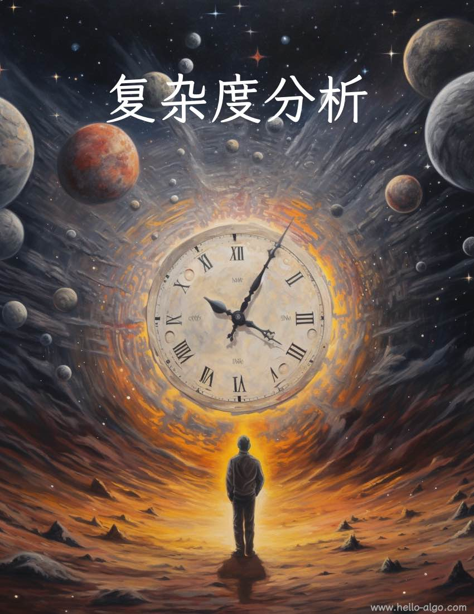

# 第 2 章 &nbsp; 时空复杂度

{ width="600" }

!!! abstract

    复杂度分析犹如浩瀚的算法宇宙中的时空向导。
    
    它带领我们在时间与空间这两个维度上深入探索，寻找更优雅的解决方案。

## 本章内容

- [2.1 &nbsp; 算法效率评估](https://www.hello-algo.com/chapter_computational_complexity/performance_evaluation/)
- [2.2 &nbsp; 时间复杂度](https://www.hello-algo.com/chapter_computational_complexity/time_complexity/)
- [2.3 &nbsp; 空间复杂度](https://www.hello-algo.com/chapter_computational_complexity/space_complexity/)
- [2.4 &nbsp; 小结](https://www.hello-algo.com/chapter_computational_complexity/summary/)
