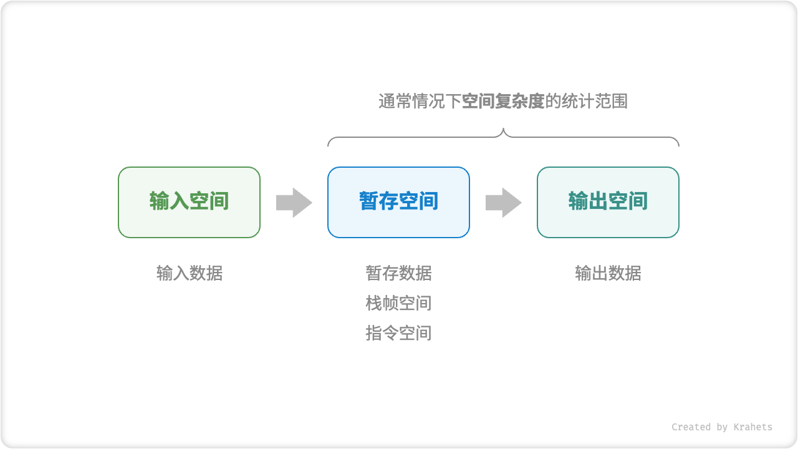
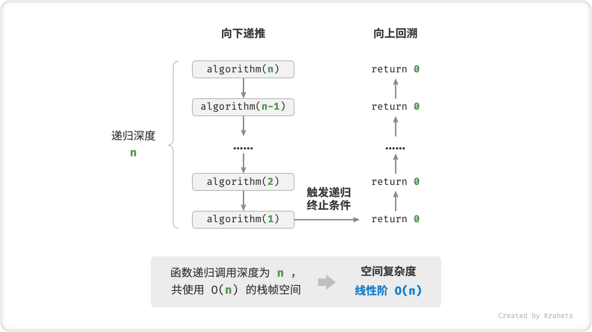
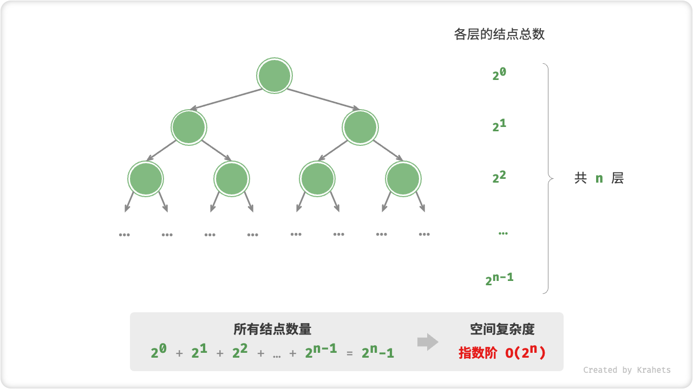

# 2.3. &nbsp; 空间复杂度

「空间复杂度 Space Complexity」用于衡量算法占用内存空间随着数据量变大时的增长趋势。这个概念与时间复杂度非常类似，只需将“运行时间”替换为“占用内存空间”。

## 2.3.1. &nbsp; 算法相关空间

算法运行过程中使用的内存空间主要包括以下几种：

- **输入空间**：用于存储算法的输入数据。
- **暂存空间**：用于存储算法运行过程中的变量、对象、函数上下文等数据。
- **输出空间**：用于存储算法的输出数据。

一般情况下，空间复杂度的统计范围是“暂存空间”加上“输出空间”。

暂存空间可以进一步划分为三个部分：

- **暂存数据**：用于保存算法运行过程中的各种常量、变量、对象等。
- **栈帧空间**：用于保存调用函数的上下文数据。系统在每次调用函数时都会在栈顶部创建一个栈帧，函数返回后，栈帧空间会被释放。
- **指令空间**：用于保存编译后的程序指令，在实际统计中通常忽略不计。

因此在分析一段程序的空间复杂度时，**我们通常统计暂存数据、输出数据、栈帧空间三部分**。



<p align="center"> Fig. 算法使用的相关空间 </p>

=== "Java"

    ```java title=""
    /* 类 */
    class Node {
        int val;
        Node next;
        Node(int x) { val = x; }
    }
    
    /* 函数 */
    int function() {
        // do something...
        return 0;
    }
    
    int algorithm(int n) {        // 输入数据
        final int a = 0;          // 暂存数据（常量）
        int b = 0;                // 暂存数据（变量）
        Node node = new Node(0);  // 暂存数据（对象）
        int c = function();       // 栈帧空间（调用函数）
        return a + b + c;         // 输出数据
    }
    ```

=== "C++"

    ```cpp title=""
    /* 结构体 */
    struct Node {
        int val;
        Node *next;
        Node(int x) : val(x), next(nullptr) {}
    };

    /* 函数 */
    int func() {
        // do something...
        return 0;
    }

    int algorithm(int n) {        // 输入数据
        const int a = 0;          // 暂存数据（常量）
        int b = 0;                // 暂存数据（变量）
        Node* node = new Node(0); // 暂存数据（对象）
        int c = func();           // 栈帧空间（调用函数）
        return a + b + c;         // 输出数据
    }
    ```

=== "Python"

    ```python title=""
    class Node:
        """类"""
        def __init__(self, x: int):
            self.val: int = x                 # 节点值
            self.next: Optional[Node] = None  # 指向下一节点的指针（引用）

    def function() -> int:
        """函数"""
        # do something...
        return 0

    def algorithm(n) -> int:  # 输入数据
        A = 0                 # 暂存数据（常量，一般用大写字母表示）
        b = 0                 # 暂存数据（变量）
        node = Node(0)        # 暂存数据（对象）
        c = function()        # 栈帧空间（调用函数）
        return A + b + c      # 输出数据
    ```

=== "Go"

    ```go title=""
    /* 结构体 */
    type node struct {
        val  int
        next *node
    }

    /* 创建 node 结构体  */
    func newNode(val int) *node {
        return &node{val: val}
    }
    
    /* 函数 */
    func function() int {
        // do something...
        return 0
    }

    func algorithm(n int) int { // 输入数据
        const a = 0             // 暂存数据（常量）
        b := 0                  // 暂存数据（变量）
        newNode(0)              // 暂存数据（对象）
        c := function()         // 栈帧空间（调用函数）
        return a + b + c        // 输出数据
    }
    ```

=== "JS"

    ```javascript title=""
    /* 类 */
    class Node {
        val;
        next;
        constructor(val) {
            this.val = val === undefined ? 0 : val; // 节点值
            this.next = null;                       // 指向下一节点的引用
        }
    }

    /* 函数 */
    function constFunc() {
        // do something
        return 0;
    }

    function algorithm(n) {       // 输入数据
        const a = 0;              // 暂存数据（常量）
        let b = 0;                // 暂存数据（变量）
        const node = new Node(0); // 暂存数据（对象）
        const c = constFunc();    // 栈帧空间（调用函数）
        return a + b + c;         // 输出数据
    }
    ```

=== "TS"

    ```typescript title=""
    /* 类 */
    class Node {
        val: number;
        next: Node | null;
        constructor(val?: number) {
            this.val = val === undefined ? 0 : val; // 节点值
            this.next = null;                       // 指向下一节点的引用
        }
    }

    /* 函数 */
    function constFunc(): number {
        // do something
        return 0;
    }

    function algorithm(n: number): number { // 输入数据
        const a = 0;                        // 暂存数据（常量）
        let b = 0;                          // 暂存数据（变量）
        const node = new Node(0);           // 暂存数据（对象）
        const c = constFunc();              // 栈帧空间（调用函数）
        return a + b + c;                   // 输出数据
    }
    ```

=== "C"

    ```c title=""
    /* 函数 */
    int func() {
        // do something...
        return 0;
    }

    int algorithm(int n) { // 输入数据
        const int a = 0;   // 暂存数据（常量）
        int b = 0;         // 暂存数据（变量）
        int c = func();    // 栈帧空间（调用函数）
        return a + b + c;  // 输出数据
    }
    ```

=== "C#"

    ```csharp title=""
    /* 类 */
    class Node {
        int val;
        Node next;
        Node(int x) { val = x; }
    }

    /* 函数 */
    int function() {
        // do something...
        return 0;
    }

    int algorithm(int n) {        // 输入数据
        const int a = 0;          // 暂存数据（常量）
        int b = 0;                // 暂存数据（变量）
        Node node = new Node(0);  // 暂存数据（对象）
        int c = function();       // 栈帧空间（调用函数）
        return a + b + c;         // 输出数据
    }
    ```

=== "Swift"

    ```swift title=""
    /* 类 */
    class Node {
        var val: Int
        var next: Node?

        init(x: Int) {
            val = x
        }
    }

    /* 函数 */
    func function() -> Int {
        // do something...
        return 0
    }

    func algorithm(n: Int) -> Int { // 输入数据
        let a = 0             // 暂存数据（常量）
        var b = 0             // 暂存数据（变量）
        let node = Node(x: 0) // 暂存数据（对象）
        let c = function()    // 栈帧空间（调用函数）
        return a + b + c      // 输出数据
    }
    ```

=== "Zig"

    ```zig title=""

    ```

=== "Dart"

    ```dart title=""
    /* 类 */
    class Node {
      int val;
      Node next;
      Node(this.val, [this.next]);
    }

    /* 函数 */
    int function() {
      // do something...
      return 0;
    }

    int algorithm(int n) {  // 输入数据
      const int a = 0;      // 暂存数据（常量）
      int b = 0;            // 暂存数据（变量）
      Node node = Node(0);  // 暂存数据（对象）
      int c = function();   // 栈帧空间（调用函数）
      return a + b + c;     // 输出数据
    }
    ```

=== "Rust"

    ```rust title=""

    ```

## 2.3.2. &nbsp; 推算方法

空间复杂度的推算方法与时间复杂度大致相同，只需将统计对象从“计算操作数量”转为“使用空间大小”。

而与时间复杂度不同的是，**我们通常只关注「最差空间复杂度」**。这是因为内存空间是一项硬性要求，我们必须确保在所有输入数据下都有足够的内存空间预留。

观察以下代码，最差空间复杂度中的“最差”有两层含义。

1. **以最差输入数据为准**：当 $n < 10$ 时，空间复杂度为 $O(1)$ ；但当 $n > 10$ 时，初始化的数组 `nums` 占用 $O(n)$ 空间；因此最差空间复杂度为 $O(n)$ 。
2. **以算法运行中的峰值内存为准**：例如，程序在执行最后一行之前，占用 $O(1)$ 空间；当初始化数组 `nums` 时，程序占用 $O(n)$ 空间；因此最差空间复杂度为 $O(n)$ 。

=== "Java"

    ```java title=""
    void algorithm(int n) {
        int a = 0;                   // O(1)
        int[] b = new int[10000];    // O(1)
        if (n > 10)
            int[] nums = new int[n]; // O(n)
    }
    ```

=== "C++"

    ```cpp title=""
    void algorithm(int n) {
        int a = 0;               // O(1)
        vector<int> b(10000);    // O(1)
        if (n > 10)
            vector<int> nums(n); // O(n)
    }
    ```

=== "Python"

    ```python title=""
    def algorithm(n: int):
        a = 0               # O(1)
        b = [0] * 10000     # O(1)
        if n > 10:
            nums = [0] * n  # O(n)
    ```

=== "Go"

    ```go title=""
    func algorithm(n int) {
        a := 0                      // O(1)
        b := make([]int, 10000)     // O(1)
        var nums []int
        if n > 10 {
            nums := make([]int, n)  // O(n)
        }
        fmt.Println(a, b, nums)
    }
    ```

=== "JS"

    ```javascript title=""
    function algorithm(n) {
        const a = 0;                   // O(1)
        const b = new Array(10000);    // O(1)
        if (n > 10) {
            const nums = new Array(n); // O(n)
        }
    }
    ```

=== "TS"

    ```typescript title=""
    function algorithm(n: number): void {
        const a = 0;                   // O(1)
        const b = new Array(10000);    // O(1)
        if (n > 10) {
            const nums = new Array(n); // O(n)
        }
    }
    ```

=== "C"

    ```c title=""
    void algorithm(int n) {
        int a = 0;               // O(1)
        int b[10000];            // O(1)
        if (n > 10)
            int nums[n] = {0};   // O(n)
    }
    ```

=== "C#"

    ```csharp title=""
    void algorithm(int n) {
        int a = 0;                   // O(1)
        int[] b = new int[10000];    // O(1)
        if (n > 10) {
            int[] nums = new int[n]; // O(n)
        }
    }
    ```

=== "Swift"

    ```swift title=""
    func algorithm(n: Int) {
        let a = 0 // O(1)
        let b = Array(repeating: 0, count: 10000) // O(1)
        if n > 10 {
            let nums = Array(repeating: 0, count: n) // O(n)
        }
    }
    ```

=== "Zig"

    ```zig title=""

    ```

=== "Dart"

    ```dart title=""
    void algorithm(int n) {
      int a = 0;                            // O(1)
      List<int> b = List.filled(10000, 0);  // O(1)
      if (n > 10) {
        List<int> nums = List.filled(n, 0); // O(n)
      }
    }
    ```

=== "Rust"

    ```rust title=""

    ```

**在递归函数中，需要注意统计栈帧空间**。例如以下代码：

- 函数 `loop()` 在循环中调用了 $n$ 次 `function()` ，每轮中的 `function()` 都返回并释放了栈帧空间，因此空间复杂度仍为 $O(1)$ 。
- 递归函数 `recur()` 在运行过程中会同时存在 $n$ 个未返回的 `recur()` ，从而占用 $O(n)$ 的栈帧空间。

=== "Java"

    ```java title=""
    int function() {
        // do something
        return 0;
    }
    /* 循环 O(1) */
    void loop(int n) {
        for (int i = 0; i < n; i++) {
            function();
        }
    }
    /* 递归 O(n) */
    void recur(int n) {
        if (n == 1) return;
        return recur(n - 1);
    }
    ```

=== "C++"

    ```cpp title=""
    int func() {
        // do something
        return 0;
    }
    /* 循环 O(1) */
    void loop(int n) {
        for (int i = 0; i < n; i++) {
            func();
        }
    }
    /* 递归 O(n) */
    void recur(int n) {
        if (n == 1) return;
        return recur(n - 1);
    }
    ```

=== "Python"

    ```python title=""
    def function() -> int:
        # do something
        return 0

    def loop(n: int):
        """循环 O(1)"""
        for _ in range(n):
            function()

    def recur(n: int) -> int:
        """递归 O(n)"""
        if n == 1: return
        return recur(n - 1)
    ```

=== "Go"

    ```go title=""
    func function() int {
        // do something
        return 0
    }
    
    /* 循环 O(1) */
    func loop(n int) {
        for i := 0; i < n; i++ {
            function()
        }
    }
    
    /* 递归 O(n) */
    func recur(n int) {
        if n == 1 {
            return
        }
        recur(n - 1)
    }
    ```

=== "JS"

    ```javascript title=""
    function constFunc() {
        // do something
        return 0;
    }
    /* 循环 O(1) */
    function loop(n) {
        for (let i = 0; i < n; i++) {
            constFunc();
        }
    }
    /* 递归 O(n) */
    function recur(n) {
        if (n === 1) return;
        return recur(n - 1);
    }
    ```

=== "TS"

    ```typescript title=""
    function constFunc(): number {
        // do something
        return 0;
    }
    /* 循环 O(1) */
    function loop(n: number): void {
        for (let i = 0; i < n; i++) {
            constFunc();
        }
    }
    /* 递归 O(n) */
    function recur(n: number): void {
        if (n === 1) return;
        return recur(n - 1);
    }
    ```

=== "C"

    ```c title=""
    int func() {
        // do something
        return 0;
    }
    /* 循环 O(1) */
    void loop(int n) {
        for (int i = 0; i < n; i++) {
            func();
        }
    }
    /* 递归 O(n) */
    void recur(int n) {
        if (n == 1) return;
        return recur(n - 1);
    }
    ```

=== "C#"

    ```csharp title=""
    int function() {
        // do something
        return 0;
    }
    /* 循环 O(1) */
    void loop(int n) {
        for (int i = 0; i < n; i++) {
            function();
        }
    }
    /* 递归 O(n) */
    int recur(int n) {
        if (n == 1) return 1;
        return recur(n - 1);
    }
    ```

=== "Swift"

    ```swift title=""
    @discardableResult
    func function() -> Int {
        // do something
        return 0
    }

    /* 循环 O(1) */
    func loop(n: Int) {
        for _ in 0 ..< n {
            function()
        }
    }

    /* 递归 O(n) */
    func recur(n: Int) {
        if n == 1 {
            return
        }
        recur(n: n - 1)
    }
    ```

=== "Zig"

    ```zig title=""

    ```

=== "Dart"

    ```dart title=""
    int function() {
      // do something
      return 0;
    }
    /* 循环 O(1) */
    void loop(int n) {
      for (int i = 0; i < n; i++) {
        function();
      }
    }
    /* 递归 O(n) */
    void recur(int n) {
      if (n == 1) return;
      return recur(n - 1);
    }
    ```

=== "Rust"

    ```rust title=""

    ```

## 2.3.3. &nbsp; 常见类型

设输入数据大小为 $n$ ，常见的空间复杂度类型有（从低到高排列）：

$$
\begin{aligned}
O(1) < O(\log n) < O(n) < O(n^2) < O(2^n) \newline
\text{常数阶} < \text{对数阶} < \text{线性阶} < \text{平方阶} < \text{指数阶}
\end{aligned}
$$


<p align="center"> Fig. 空间复杂度的常见类型 </p>

!!! tip

    部分示例代码需要一些前置知识，包括数组、链表、二叉树、递归算法等。如果你遇到看不懂的地方，可以在学习完后面章节后再来复习。

### 常数阶 $O(1)$

常数阶常见于数量与输入数据大小 $n$ 无关的常量、变量、对象。

需要注意的是，在循环中初始化变量或调用函数而占用的内存，在进入下一循环后就会被释放，即不会累积占用空间，空间复杂度仍为 $O(1)$ 。

=== "Java"

    ```java title="space_complexity.java"
    /* 函数 */
    int function() {
        // do something
        return 0;
    }

    /* 常数阶 */
    void constant(int n) {
        // 常量、变量、对象占用 O(1) 空间
        final int a = 0;
        int b = 0;
        int[] nums = new int[10000];
        ListNode node = new ListNode(0);
        // 循环中的变量占用 O(1) 空间
        for (int i = 0; i < n; i++) {
            int c = 0;
        }
        // 循环中的函数占用 O(1) 空间
        for (int i = 0; i < n; i++) {
            function();
        }
    }
    ```

=== "C++"

    ```cpp title="space_complexity.cpp"
    /* 函数 */
    int func() {
        // do something
        return 0;
    }

    /* 常数阶 */
    void constant(int n) {
        // 常量、变量、对象占用 O(1) 空间
        const int a = 0;
        int b = 0;
        vector<int> nums(10000);
        ListNode node(0);
        // 循环中的变量占用 O(1) 空间
        for (int i = 0; i < n; i++) {
            int c = 0;
        }
        // 循环中的函数占用 O(1) 空间
        for (int i = 0; i < n; i++) {
            func();
        }
    }
    ```

=== "Python"

    ```python title="space_complexity.py"
    def function() -> int:
        """函数"""
        # do something
        return 0

    def constant(n: int):
        """常数阶"""
        # 常量、变量、对象占用 O(1) 空间
        a = 0
        nums = [0] * 10000
        node = ListNode(0)
        # 循环中的变量占用 O(1) 空间
        for _ in range(n):
            c = 0
        # 循环中的函数占用 O(1) 空间
        for _ in range(n):
            function()
    ```

=== "Go"

    ```go title="space_complexity.go"
    /* 函数 */
    func function() int {
        // do something...
        return 0
    }

    /* 常数阶 */
    func spaceConstant(n int) {
        // 常量、变量、对象占用 O(1) 空间
        const a = 0
        b := 0
        nums := make([]int, 10000)
        ListNode := newNode(0)
        // 循环中的变量占用 O(1) 空间
        var c int
        for i := 0; i < n; i++ {
            c = 0
        }
        // 循环中的函数占用 O(1) 空间
        for i := 0; i < n; i++ {
            function()
        }
        fmt.Println(a, b, nums, c, ListNode)
    }
    ```

=== "JS"

    ```javascript title="space_complexity.js"
    /* 函数 */
    function constFunc() {
        // do something
        return 0;
    }

    /* 常数阶 */
    function constant(n) {
        // 常量、变量、对象占用 O(1) 空间
        const a = 0;
        const b = 0;
        const nums = new Array(10000);
        const node = new ListNode(0);
        // 循环中的变量占用 O(1) 空间
        for (let i = 0; i < n; i++) {
            const c = 0;
        }
        // 循环中的函数占用 O(1) 空间
        for (let i = 0; i < n; i++) {
            constFunc();
        }
    }
    ```

=== "TS"

    ```typescript title="space_complexity.ts"
    /* 函数 */
    function constFunc(): number {
        // do something
        return 0;
    }

    /* 常数阶 */
    function constant(n: number): void {
        // 常量、变量、对象占用 O(1) 空间
        const a = 0;
        const b = 0;
        const nums = new Array(10000);
        const node = new ListNode(0);
        // 循环中的变量占用 O(1) 空间
        for (let i = 0; i < n; i++) {
            const c = 0;
        }
        // 循环中的函数占用 O(1) 空间
        for (let i = 0; i < n; i++) {
            constFunc();
        }
    }
    ```

=== "C"

    ```c title="space_complexity.c"
    /* 函数 */
    int func() {
        // do something
        return 0;
    }

    /* 常数阶 */
    void constant(int n) {
        // 常量、变量、对象占用 O(1) 空间
        const int a = 0;
        int b = 0;
        int nums[1000];
        ListNode *node = newListNode(0);
        free(node);
        // 循环中的变量占用 O(1) 空间
        for (int i = 0; i < n; i++) {
            int c = 0;
        }
        // 循环中的函数占用 O(1) 空间
        for (int i = 0; i < n; i++) {
            func();
        }
    }
    ```

=== "C#"

    ```csharp title="space_complexity.cs"
    /* 函数 */
    int function() {
        // do something
        return 0;
    }

    /* 常数阶 */
    void constant(int n) {
        // 常量、变量、对象占用 O(1) 空间
        int a = 0;
        int b = 0;
        int[] nums = new int[10000];
        ListNode node = new ListNode(0);
        // 循环中的变量占用 O(1) 空间
        for (int i = 0; i < n; i++) {
            int c = 0;
        }
        // 循环中的函数占用 O(1) 空间
        for (int i = 0; i < n; i++) {
            function();
        }
    }
    ```

=== "Swift"

    ```swift title="space_complexity.swift"
    /* 函数 */
    @discardableResult
    func function() -> Int {
        // do something
        return 0
    }

    /* 常数阶 */
    func constant(n: Int) {
        // 常量、变量、对象占用 O(1) 空间
        let a = 0
        var b = 0
        let nums = Array(repeating: 0, count: 10000)
        let node = ListNode(x: 0)
        // 循环中的变量占用 O(1) 空间
        for _ in 0 ..< n {
            let c = 0
        }
        // 循环中的函数占用 O(1) 空间
        for _ in 0 ..< n {
            function()
        }
    }
    ```

=== "Zig"

    ```zig title="space_complexity.zig"
    [class]{}-[func]{function}

    // 常数阶
    fn constant(n: i32) void {
        // 常量、变量、对象占用 O(1) 空间
        const a: i32 = 0;
        var b: i32 = 0;
        var nums = [_]i32{0}**10000;
        var node = inc.ListNode(i32){.val = 0};
        var i: i32 = 0;
        // 循环中的变量占用 O(1) 空间
        while (i < n) : (i += 1) {
            var c: i32 = 0;
            _ = c;
        }
        // 循环中的函数占用 O(1) 空间
        i = 0;
        while (i < n) : (i += 1) {
            _ = function();
        }
        _ = a;
        _ = b;
        _ = nums;
        _ = node;
    }
    ```

=== "Dart"

    ```dart title="space_complexity.dart"
    /* 函数 */
    int function() {
      // do something
      return 0;
    }

    /* 常数阶 */
    void constant(int n) {
      // 常量、变量、对象占用 O(1) 空间
      final int a = 0;
      int b = 0;

      List<int> nums = List.filled(10000, 0);
      // 循环中的变量占用 O(1) 空间
      for (var i = 0; i < n; i++) {
        int c = 0;
      }
      // 循环中的函数占用 O(1) 空间
      for (var i = 0; i < n; i++) {
        function();
      }
    }
    ```

=== "Rust"

    ```rust title="space_complexity.rs"
    /* 函数 */
    fn function() ->i32 {
        // do something
        return 0;
    }

    /* 常数阶 */
    #[allow(unused)]
    fn constant(n: i32) {
        // 常量、变量、对象占用 O(1) 空间
        const A: i32 = 0;
        let b = 0;
        let nums = vec![0; 10000];
        let node = ListNode::new(0);
        // 循环中的变量占用 O(1) 空间
        for i in 0..n {
            let c = 0;
        }
        // 循环中的函数占用 O(1) 空间
        for i in 0..n {
            function();
        }
    }
    ```

### 线性阶 $O(n)$

线性阶常见于元素数量与 $n$ 成正比的数组、链表、栈、队列等。

=== "Java"

    ```java title="space_complexity.java"
    /* 线性阶 */
    void linear(int n) {
        // 长度为 n 的数组占用 O(n) 空间
        int[] nums = new int[n];
        // 长度为 n 的列表占用 O(n) 空间
        List<ListNode> nodes = new ArrayList<>();
        for (int i = 0; i < n; i++) {
            nodes.add(new ListNode(i));
        }
        // 长度为 n 的哈希表占用 O(n) 空间
        Map<Integer, String> map = new HashMap<>();
        for (int i = 0; i < n; i++) {
            map.put(i, String.valueOf(i));
        }
    }
    ```

=== "C++"

    ```cpp title="space_complexity.cpp"
    /* 线性阶 */
    void linear(int n) {
        // 长度为 n 的数组占用 O(n) 空间
        vector<int> nums(n);
        // 长度为 n 的列表占用 O(n) 空间
        vector<ListNode> nodes;
        for (int i = 0; i < n; i++) {
            nodes.push_back(ListNode(i));
        }
        // 长度为 n 的哈希表占用 O(n) 空间
        unordered_map<int, string> map;
        for (int i = 0; i < n; i++) {
            map[i] = to_string(i);
        }
    }
    ```

=== "Python"

    ```python title="space_complexity.py"
    def linear(n: int):
        """线性阶"""
        # 长度为 n 的列表占用 O(n) 空间
        nums = [0] * n
        # 长度为 n 的哈希表占用 O(n) 空间
        hmap = dict[int, str]()
        for i in range(n):
            hmap[i] = str(i)
    ```

=== "Go"

    ```go title="space_complexity.go"
    /* 线性阶 */
    func spaceLinear(n int) {
        // 长度为 n 的数组占用 O(n) 空间
        _ = make([]int, n)
        // 长度为 n 的列表占用 O(n) 空间
        var nodes []*node
        for i := 0; i < n; i++ {
            nodes = append(nodes, newNode(i))
        }
        // 长度为 n 的哈希表占用 O(n) 空间
        m := make(map[int]string, n)
        for i := 0; i < n; i++ {
            m[i] = strconv.Itoa(i)
        }
    }
    ```

=== "JS"

    ```javascript title="space_complexity.js"
    /* 线性阶 */
    function linear(n) {
        // 长度为 n 的数组占用 O(n) 空间
        const nums = new Array(n);
        // 长度为 n 的列表占用 O(n) 空间
        const nodes = [];
        for (let i = 0; i < n; i++) {
            nodes.push(new ListNode(i));
        }
        // 长度为 n 的哈希表占用 O(n) 空间
        const map = new Map();
        for (let i = 0; i < n; i++) {
            map.set(i, i.toString());
        }
    }
    ```

=== "TS"

    ```typescript title="space_complexity.ts"
    /* 线性阶 */
    function linear(n: number): void {
        // 长度为 n 的数组占用 O(n) 空间
        const nums = new Array(n);
        // 长度为 n 的列表占用 O(n) 空间
        const nodes: ListNode[] = [];
        for (let i = 0; i < n; i++) {
            nodes.push(new ListNode(i));
        }
        // 长度为 n 的哈希表占用 O(n) 空间
        const map = new Map();
        for (let i = 0; i < n; i++) {
            map.set(i, i.toString());
        }
    }
    ```

=== "C"

    ```c title="space_complexity.c"
    /* 哈希表 */
    struct hashTable {
        int key;
        int val;
        UT_hash_handle hh; // 基于 uthash.h 实现
    };

    typedef struct hashTable hashTable;

    /* 线性阶 */
    void linear(int n) {
        // 长度为 n 的数组占用 O(n) 空间
        int *nums = malloc(sizeof(int) * n);
        free(nums);

        // 长度为 n 的列表占用 O(n) 空间
        ListNode **nodes = malloc(sizeof(ListNode *) * n);
        for (int i = 0; i < n; i++) {
            nodes[i] = newListNode(i);
        }
        // 内存释放
        for (int i = 0; i < n; i++) {
            free(nodes[i]);
        }
        free(nodes);

        // 长度为 n 的哈希表占用 O(n) 空间
        hashTable *h = NULL;
        for (int i = 0; i < n; i++) {
            hashTable *tmp = malloc(sizeof(hashTable));
            tmp->key = i;
            tmp->val = i;
            HASH_ADD_INT(h, key, tmp);
        }

        // 内存释放
        hashTable *curr, *tmp;
        HASH_ITER(hh, h, curr, tmp) {
            HASH_DEL(h, curr);
            free(curr);
        }
    }
    ```

=== "C#"

    ```csharp title="space_complexity.cs"
    /* 线性阶 */
    void linear(int n) {
        // 长度为 n 的数组占用 O(n) 空间
        int[] nums = new int[n];
        // 长度为 n 的列表占用 O(n) 空间
        List<ListNode> nodes = new();
        for (int i = 0; i < n; i++) {
            nodes.Add(new ListNode(i));
        }
        // 长度为 n 的哈希表占用 O(n) 空间
        Dictionary<int, string> map = new();
        for (int i = 0; i < n; i++) {
            map.Add(i, i.ToString());
        }
    }
    ```

=== "Swift"

    ```swift title="space_complexity.swift"
    /* 线性阶 */
    func linear(n: Int) {
        // 长度为 n 的数组占用 O(n) 空间
        let nums = Array(repeating: 0, count: n)
        // 长度为 n 的列表占用 O(n) 空间
        let nodes = (0 ..< n).map { ListNode(x: $0) }
        // 长度为 n 的哈希表占用 O(n) 空间
        let map = Dictionary(uniqueKeysWithValues: (0 ..< n).map { ($0, "\($0)") })
    }
    ```

=== "Zig"

    ```zig title="space_complexity.zig"
    // 线性阶
    fn linear(comptime n: i32) !void {
        // 长度为 n 的数组占用 O(n) 空间
        var nums = [_]i32{0}**n;
        // 长度为 n 的列表占用 O(n) 空间
        var nodes = std.ArrayList(i32).init(std.heap.page_allocator);
        defer nodes.deinit();
        var i: i32 = 0;
        while (i < n) : (i += 1) {
            try nodes.append(i);
        }
        // 长度为 n 的哈希表占用 O(n) 空间
        var map = std.AutoArrayHashMap(i32, []const u8).init(std.heap.page_allocator);
        defer map.deinit();
        var j: i32 = 0;
        while (j < n) : (j += 1) {
            const string = try std.fmt.allocPrint(std.heap.page_allocator, "{d}", .{j});
            defer std.heap.page_allocator.free(string);
            try map.put(i, string);
        }
        _ = nums;
    }
    ```

=== "Dart"

    ```dart title="space_complexity.dart"
    /* 线性阶 */
    void linear(int n) {
      // 长度为 n 的数组占用 O(n) 空间
      List<int> nums = List.filled(n, 0);
      // 长度为 n 的列表占用 O(n) 空间
      List<ListNode> nodes = [];
      for (var i = 0; i < n; i++) {
        nodes.add(ListNode(i));
      }
      // 长度为 n 的哈希表占用 O(n) 空间
      Map<int, String> map = HashMap();
      for (var i = 0; i < n; i++) {
        map.putIfAbsent(i, () => i.toString());
      }
    }
    ```

=== "Rust"

    ```rust title="space_complexity.rs"
    /* 线性阶 */
    #[allow(unused)]
    fn linear(n: i32) {
        // 长度为 n 的数组占用 O(n) 空间
        let mut nums = vec![0; n as usize];
        // 长度为 n 的列表占用 O(n) 空间
        let mut nodes = Vec::new();
        for i in 0..n {
            nodes.push(ListNode::new(i))
        }
        // 长度为 n 的哈希表占用 O(n) 空间
        let mut map = HashMap::new();
        for i in 0..n {
            map.insert(i, i.to_string());
        }
    }
    ```

以下递归函数会同时存在 $n$ 个未返回的 `algorithm()` 函数，使用 $O(n)$ 大小的栈帧空间。

=== "Java"

    ```java title="space_complexity.java"
    /* 线性阶（递归实现） */
    void linearRecur(int n) {
        System.out.println("递归 n = " + n);
        if (n == 1)
            return;
        linearRecur(n - 1);
    }
    ```

=== "C++"

    ```cpp title="space_complexity.cpp"
    /* 线性阶（递归实现） */
    void linearRecur(int n) {
        cout << "递归 n = " << n << endl;
        if (n == 1)
            return;
        linearRecur(n - 1);
    }
    ```

=== "Python"

    ```python title="space_complexity.py"
    def linear_recur(n: int):
        """线性阶（递归实现）"""
        print("递归 n =", n)
        if n == 1:
            return
        linear_recur(n - 1)
    ```

=== "Go"

    ```go title="space_complexity.go"
    /* 线性阶（递归实现） */
    func spaceLinearRecur(n int) {
        fmt.Println("递归 n =", n)
        if n == 1 {
            return
        }
        spaceLinearRecur(n - 1)
    }
    ```

=== "JS"

    ```javascript title="space_complexity.js"
    /* 线性阶（递归实现） */
    function linearRecur(n) {
        console.log(`递归 n = ${n}`);
        if (n === 1) return;
        linearRecur(n - 1);
    }
    ```

=== "TS"

    ```typescript title="space_complexity.ts"
    /* 线性阶（递归实现） */
    function linearRecur(n: number): void {
        console.log(`递归 n = ${n}`);
        if (n === 1) return;
        linearRecur(n - 1);
    }
    ```

=== "C"

    ```c title="space_complexity.c"
    /* 线性阶（递归实现） */
    void linearRecur(int n) {
        printf("递归 n = %d\r\n", n);
        if (n == 1)
            return;
        linearRecur(n - 1);
    }
    ```

=== "C#"

    ```csharp title="space_complexity.cs"
    /* 线性阶（递归实现） */
    void linearRecur(int n) {
        Console.WriteLine("递归 n = " + n);
        if (n == 1) return;
        linearRecur(n - 1);
    }
    ```

=== "Swift"

    ```swift title="space_complexity.swift"
    /* 线性阶（递归实现） */
    func linearRecur(n: Int) {
        print("递归 n = \(n)")
        if n == 1 {
            return
        }
        linearRecur(n: n - 1)
    }
    ```

=== "Zig"

    ```zig title="space_complexity.zig"
    // 线性阶（递归实现）
    fn linearRecur(comptime n: i32) void {
        std.debug.print("递归 n = {}\n", .{n});
        if (n == 1) return;
        linearRecur(n - 1);
    }
    ```

=== "Dart"

    ```dart title="space_complexity.dart"
    /* 线性阶（递归实现） */
    void linearRecur(int n) {
      print('递归 n = $n');
      if (n == 1) return;
      linearRecur(n - 1);
    }
    ```

=== "Rust"

    ```rust title="space_complexity.rs"
    /* 线性阶（递归实现） */
    fn linear_recur(n: i32) {
        println!("递归 n = {}", n);
        if n == 1 {return};
        linear_recur(n - 1);
    }
    ```



<p align="center"> Fig. 递归函数产生的线性阶空间复杂度 </p>

### 平方阶 $O(n^2)$

平方阶常见于矩阵和图，元素数量与 $n$ 成平方关系。

=== "Java"

    ```java title="space_complexity.java"
    /* 平方阶 */
    void quadratic(int n) {
        // 矩阵占用 O(n^2) 空间
        int[][] numMatrix = new int[n][n];
        // 二维列表占用 O(n^2) 空间
        List<List<Integer>> numList = new ArrayList<>();
        for (int i = 0; i < n; i++) {
            List<Integer> tmp = new ArrayList<>();
            for (int j = 0; j < n; j++) {
                tmp.add(0);
            }
            numList.add(tmp);
        }
    }
    ```

=== "C++"

    ```cpp title="space_complexity.cpp"
    /* 平方阶 */
    void quadratic(int n) {
        // 二维列表占用 O(n^2) 空间
        vector<vector<int>> numMatrix;
        for (int i = 0; i < n; i++) {
            vector<int> tmp;
            for (int j = 0; j < n; j++) {
                tmp.push_back(0);
            }
            numMatrix.push_back(tmp);
        }
    }
    ```

=== "Python"

    ```python title="space_complexity.py"
    def quadratic(n: int):
        """平方阶"""
        # 二维列表占用 O(n^2) 空间
        num_matrix = [[0] * n for _ in range(n)]
    ```

=== "Go"

    ```go title="space_complexity.go"
    /* 平方阶 */
    func spaceQuadratic(n int) {
        // 矩阵占用 O(n^2) 空间
        numMatrix := make([][]int, n)
        for i := 0; i < n; i++ {
            numMatrix[i] = make([]int, n)
        }
    }
    ```

=== "JS"

    ```javascript title="space_complexity.js"
    /* 平方阶 */
    function quadratic(n) {
        // 矩阵占用 O(n^2) 空间
        const numMatrix = Array(n)
            .fill(null)
            .map(() => Array(n).fill(null));
        // 二维列表占用 O(n^2) 空间
        const numList = [];
        for (let i = 0; i < n; i++) {
            const tmp = [];
            for (let j = 0; j < n; j++) {
                tmp.push(0);
            }
            numList.push(tmp);
        }
    }
    ```

=== "TS"

    ```typescript title="space_complexity.ts"
    /* 平方阶 */
    function quadratic(n: number): void {
        // 矩阵占用 O(n^2) 空间
        const numMatrix = Array(n)
            .fill(null)
            .map(() => Array(n).fill(null));
        // 二维列表占用 O(n^2) 空间
        const numList = [];
        for (let i = 0; i < n; i++) {
            const tmp = [];
            for (let j = 0; j < n; j++) {
                tmp.push(0);
            }
            numList.push(tmp);
        }
    }
    ```

=== "C"

    ```c title="space_complexity.c"
    /* 平方阶 */
    void quadratic(int n) {
        // 二维列表占用 O(n^2) 空间
        int **numMatrix = malloc(sizeof(int *) * n);
        for (int i = 0; i < n; i++) {
            int *tmp = malloc(sizeof(int) * n);
            for (int j = 0; j < n; j++) {
                tmp[j] = 0;
            }
            numMatrix[i] = tmp;
        }

        // 内存释放
        for (int i = 0; i < n; i++) {
            free(numMatrix[i]);
        }
        free(numMatrix);
    }
    ```

=== "C#"

    ```csharp title="space_complexity.cs"
    /* 平方阶 */
    void quadratic(int n) {
        // 矩阵占用 O(n^2) 空间
        int[,] numMatrix = new int[n, n];
        // 二维列表占用 O(n^2) 空间
        List<List<int>> numList = new();
        for (int i = 0; i < n; i++) {
            List<int> tmp = new();
            for (int j = 0; j < n; j++) {
                tmp.Add(0);
            }
            numList.Add(tmp);
        }
    }
    ```

=== "Swift"

    ```swift title="space_complexity.swift"
    /* 平方阶 */
    func quadratic(n: Int) {
        // 二维列表占用 O(n^2) 空间
        let numList = Array(repeating: Array(repeating: 0, count: n), count: n)
    }
    ```

=== "Zig"

    ```zig title="space_complexity.zig"
    // 平方阶
    fn quadratic(n: i32) !void {
        // 二维列表占用 O(n^2) 空间
        var nodes = std.ArrayList(std.ArrayList(i32)).init(std.heap.page_allocator);
        defer nodes.deinit();
        var i: i32 = 0;
        while (i < n) : (i += 1) {
            var tmp = std.ArrayList(i32).init(std.heap.page_allocator);
            defer tmp.deinit();
            var j: i32 = 0;
            while (j < n) : (j += 1) {
                try tmp.append(0);
            }
            try nodes.append(tmp);
        }
    }
    ```

=== "Dart"

    ```dart title="space_complexity.dart"
    /* 平方阶 */
    void quadratic(int n) {
      // 矩阵占用 O(n^2) 空间
      List<List<int>> numMatrix = List.generate(n, (_) => List.filled(n, 0));
      // 二维列表占用 O(n^2) 空间
      List<List<int>> numList = [];

      for (var i = 0; i < n; i++) {
        List<int> tmp = [];
        for (int j = 0; j < n; j++) {
          tmp.add(0);
        }
        numList.add(tmp);
      }
    }
    ```

=== "Rust"

    ```rust title="space_complexity.rs"
    /* 平方阶 */
    #[allow(unused)]
    fn quadratic(n: i32) {
        // 矩阵占用 O(n^2) 空间
        let num_matrix = vec![vec![0; n as usize]; n as usize];
        // 二维列表占用 O(n^2) 空间
        let mut num_list = Vec::new();
        for i in 0..n {
            let mut tmp = Vec::new();
            for j in 0..n {
                tmp.push(0);
            }
            num_list.push(tmp);
        }
    }
    ```

在以下递归函数中，同时存在 $n$ 个未返回的 `algorithm()` ，并且每个函数中都初始化了一个数组，长度分别为 $n, n-1, n-2, ..., 2, 1$ ，平均长度为 $\frac{n}{2}$ ，因此总体占用 $O(n^2)$ 空间。

=== "Java"

    ```java title="space_complexity.java"
    /* 平方阶（递归实现） */
    int quadraticRecur(int n) {
        if (n <= 0)
            return 0;
        // 数组 nums 长度为 n, n-1, ..., 2, 1
        int[] nums = new int[n];
        System.out.println("递归 n = " + n + " 中的 nums 长度 = " + nums.length);
        return quadraticRecur(n - 1);
    }
    ```

=== "C++"

    ```cpp title="space_complexity.cpp"
    /* 平方阶（递归实现） */
    int quadraticRecur(int n) {
        if (n <= 0)
            return 0;
        vector<int> nums(n);
        cout << "递归 n = " << n << " 中的 nums 长度 = " << nums.size() << endl;
        return quadraticRecur(n - 1);
    }
    ```

=== "Python"

    ```python title="space_complexity.py"
    def quadratic_recur(n: int) -> int:
        """平方阶（递归实现）"""
        if n <= 0:
            return 0
        # 数组 nums 长度为 n, n-1, ..., 2, 1
        nums = [0] * n
        return quadratic_recur(n - 1)
    ```

=== "Go"

    ```go title="space_complexity.go"
    /* 平方阶（递归实现） */
    func spaceQuadraticRecur(n int) int {
        if n <= 0 {
            return 0
        }
        nums := make([]int, n)
        fmt.Printf("递归 n = %d 中的 nums 长度 = %d \n", n, len(nums))
        return spaceQuadraticRecur(n - 1)
    }
    ```

=== "JS"

    ```javascript title="space_complexity.js"
    /* 平方阶（递归实现） */
    function quadraticRecur(n) {
        if (n <= 0) return 0;
        const nums = new Array(n);
        console.log(`递归 n = ${n} 中的 nums 长度 = ${nums.length}`);
        return quadraticRecur(n - 1);
    }
    ```

=== "TS"

    ```typescript title="space_complexity.ts"
    /* 平方阶（递归实现） */
    function quadraticRecur(n: number): number {
        if (n <= 0) return 0;
        const nums = new Array(n);
        console.log(`递归 n = ${n} 中的 nums 长度 = ${nums.length}`);
        return quadraticRecur(n - 1);
    }
    ```

=== "C"

    ```c title="space_complexity.c"
    /* 平方阶（递归实现） */
    int quadraticRecur(int n) {
        if (n <= 0)
            return 0;
        int *nums = malloc(sizeof(int) * n);
        printf("递归 n = %d 中的 nums 长度 = %d\r\n", n, n);
        int res = quadraticRecur(n - 1);
        free(nums);
        return res;
    }
    ```

=== "C#"

    ```csharp title="space_complexity.cs"
    /* 平方阶（递归实现） */
    int quadraticRecur(int n) {
        if (n <= 0) return 0;
        int[] nums = new int[n];
        Console.WriteLine("递归 n = " + n + " 中的 nums 长度 = " + nums.Length);
        return quadraticRecur(n - 1);
    }
    ```

=== "Swift"

    ```swift title="space_complexity.swift"
    /* 平方阶（递归实现） */
    @discardableResult
    func quadraticRecur(n: Int) -> Int {
        if n <= 0 {
            return 0
        }
        // 数组 nums 长度为 n, n-1, ..., 2, 1
        let nums = Array(repeating: 0, count: n)
        print("递归 n = \(n) 中的 nums 长度 = \(nums.count)")
        return quadraticRecur(n: n - 1)
    }
    ```

=== "Zig"

    ```zig title="space_complexity.zig"
    // 平方阶（递归实现）
    fn quadraticRecur(comptime n: i32) i32 {
        if (n <= 0) return 0;
        var nums = [_]i32{0}**n;
        std.debug.print("递归 n = {} 中的 nums 长度 = {}\n", .{n, nums.len});
        return quadraticRecur(n - 1);
    }
    ```

=== "Dart"

    ```dart title="space_complexity.dart"
    /* 平方阶（递归实现） */
    int quadraticRecur(int n) {
      if (n <= 0) return 0;
      List<int> nums = List.filled(n, 0);
      print('递归 n = $n 中的 nums 长度 = ${nums.length}');
      return quadraticRecur(n - 1);
    }
    ```

=== "Rust"

    ```rust title="space_complexity.rs"
    /* 平方阶（递归实现） */
    fn quadratic_recur(n: i32) -> i32 {
        if n <= 0 {return 0};
        // 数组 nums 长度为 n, n-1, ..., 2, 1
        let nums = vec![0; n as usize];
        println!("递归 n = {} 中的 nums 长度 = {}", n, nums.len());
        return quadratic_recur(n - 1);
    }
    ```


<p align="center"> Fig. 递归函数产生的平方阶空间复杂度 </p>

### 指数阶 $O(2^n)$

指数阶常见于二叉树。高度为 $n$ 的「满二叉树」的节点数量为 $2^n - 1$ ，占用 $O(2^n)$ 空间。

=== "Java"

    ```java title="space_complexity.java"
    /* 指数阶（建立满二叉树） */
    TreeNode buildTree(int n) {
        if (n == 0)
            return null;
        TreeNode root = new TreeNode(0);
        root.left = buildTree(n - 1);
        root.right = buildTree(n - 1);
        return root;
    }
    ```

=== "C++"

    ```cpp title="space_complexity.cpp"
    /* 指数阶（建立满二叉树） */
    TreeNode *buildTree(int n) {
        if (n == 0)
            return nullptr;
        TreeNode *root = new TreeNode(0);
        root->left = buildTree(n - 1);
        root->right = buildTree(n - 1);
        return root;
    }
    ```

=== "Python"

    ```python title="space_complexity.py"
    def build_tree(n: int) -> TreeNode | None:
        """指数阶（建立满二叉树）"""
        if n == 0:
            return None
        root = TreeNode(0)
        root.left = build_tree(n - 1)
        root.right = build_tree(n - 1)
        return root
    ```

=== "Go"

    ```go title="space_complexity.go"
    /* 指数阶（建立满二叉树） */
    func buildTree(n int) *treeNode {
        if n == 0 {
            return nil
        }
        root := newTreeNode(0)
        root.left = buildTree(n - 1)
        root.right = buildTree(n - 1)
        return root
    }
    ```

=== "JS"

    ```javascript title="space_complexity.js"
    /* 指数阶（建立满二叉树） */
    function buildTree(n) {
        if (n === 0) return null;
        const root = new TreeNode(0);
        root.left = buildTree(n - 1);
        root.right = buildTree(n - 1);
        return root;
    }
    ```

=== "TS"

    ```typescript title="space_complexity.ts"
    /* 指数阶（建立满二叉树） */
    function buildTree(n: number): TreeNode | null {
        if (n === 0) return null;
        const root = new TreeNode(0);
        root.left = buildTree(n - 1);
        root.right = buildTree(n - 1);
        return root;
    }
    ```

=== "C"

    ```c title="space_complexity.c"
    /* 指数阶（建立满二叉树） */
    TreeNode *buildTree(int n) {
        if (n == 0)
            return NULL;
        TreeNode *root = newTreeNode(0);
        root->left = buildTree(n - 1);
        root->right = buildTree(n - 1);
        return root;
    }
    ```

=== "C#"

    ```csharp title="space_complexity.cs"
    /* 指数阶（建立满二叉树） */
    TreeNode? buildTree(int n) {
        if (n == 0) return null;
        TreeNode root = new TreeNode(0);
        root.left = buildTree(n - 1);
        root.right = buildTree(n - 1);
        return root;
    }
    ```

=== "Swift"

    ```swift title="space_complexity.swift"
    /* 指数阶（建立满二叉树） */
    func buildTree(n: Int) -> TreeNode? {
        if n == 0 {
            return nil
        }
        let root = TreeNode(x: 0)
        root.left = buildTree(n: n - 1)
        root.right = buildTree(n: n - 1)
        return root
    }
    ```

=== "Zig"

    ```zig title="space_complexity.zig"
    // 指数阶（建立满二叉树）
    fn buildTree(mem_allocator: std.mem.Allocator, n: i32) !?*inc.TreeNode(i32) {
        if (n == 0) return null;
        const root = try mem_allocator.create(inc.TreeNode(i32));
        root.init(0);
        root.left = try buildTree(mem_allocator, n - 1);
        root.right = try buildTree(mem_allocator, n - 1);
        return root;
    }
    ```

=== "Dart"

    ```dart title="space_complexity.dart"
    /* 指数阶（建立满二叉树） */
    TreeNode? buildTree(int n) {
      if (n == 0) return null;
      TreeNode root = TreeNode(0);
      root.left = buildTree(n - 1);
      root.right = buildTree(n - 1);
      return root;
    }
    ```

=== "Rust"

    ```rust title="space_complexity.rs"
    /* 指数阶（建立满二叉树） */
    fn build_tree(n: i32) -> Option<Rc<RefCell<TreeNode>>> {
        if n == 0 {return None};
        let root = TreeNode::new(0);
        root.borrow_mut().left = build_tree(n - 1);
        root.borrow_mut().right = build_tree(n - 1);
        return Some(root);
    }
    ```



<p align="center"> Fig. 满二叉树产生的指数阶空间复杂度 </p>

### 对数阶 $O(\log n)$

对数阶常见于分治算法和数据类型转换等。

例如“归并排序”算法，输入长度为 $n$ 的数组，每轮递归将数组从中点划分为两半，形成高度为 $\log n$ 的递归树，使用 $O(\log n)$ 栈帧空间。

再例如“数字转化为字符串”，输入任意正整数 $n$ ，它的位数为 $\log_{10} n$ ，即对应字符串长度为 $\log_{10} n$ ，因此空间复杂度为 $O(\log_{10} n) = O(\log n)$ 。

## 2.3.4. &nbsp; 权衡时间与空间

理想情况下，我们希望算法的时间复杂度和空间复杂度都能达到最优。然而在实际情况中，同时优化时间复杂度和空间复杂度通常是非常困难的。

**降低时间复杂度通常需要以提升空间复杂度为代价，反之亦然**。我们将牺牲内存空间来提升算法运行速度的思路称为“以空间换时间”；反之，则称为“以时间换空间”。

选择哪种思路取决于我们更看重哪个方面。在大多数情况下，时间比空间更宝贵，因此以空间换时间通常是更常用的策略。当然，在数据量很大的情况下，控制空间复杂度也是非常重要的。
