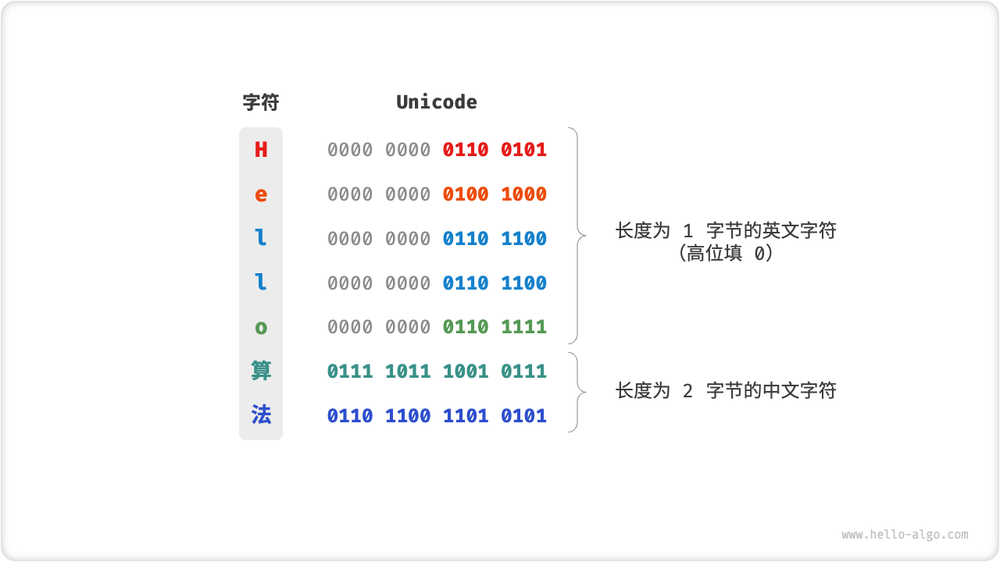
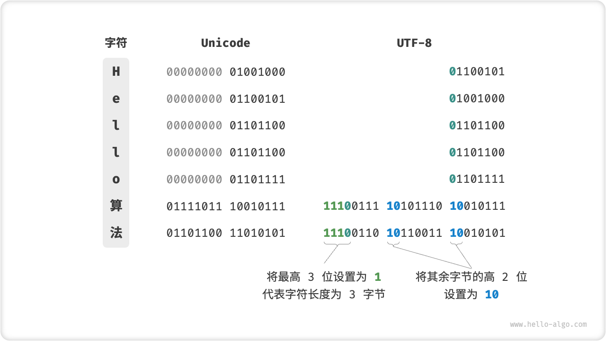

# 3.4. &nbsp; 字符集与编码

在计算机中，所有数据都是以二进制数的形式存储的，字符 `char` 也不例外。为了表示字符，我们需要建立一套「字符集」，规定每个字符和二进制数之间的一一对应关系。有了字符集之后，计算机就可以通过查表完成二进制数到字符的转换。

## 3.4.1. &nbsp; ASCII 字符集

「ASCII 码」是最早出现的字符集，全称为“美国标准信息交换代码”。它使用 7 位二进制数（即一个字节的前 7 位）表示一个字符，最多能够表示 128 个不同的字符。这包括英文字母的大小写、数字 0-9 、一些标点符号，以及一些控制字符（如换行符和制表符）。

 Fig. ASCII 码 

然而，ASCII 码仅局限于表示英文。随着计算机的全球化，一种能够表示更多语言的字符集「EASCII」应运而生。它在 ASCII 的 7 位基础上扩展到 8 位，能够表示 256 个不同的字符。世界陆续诞生了一批适用于不同地区的 EASCII 字符集。这些字符集的前 128 个字符统一为 ASCII 码，后 128 个字符定义了不同语言的字符。

## 3.4.2. &nbsp; GBK 字符集

EASCII 码仍然无法满足许多语言的字符数量要求。例如，汉字大约有近十万个，光日常使用的就有几千个。为此，中国国家标准总局于 1980 年发布了「GB2312」字符集，其收录了 6763 个汉字，基本满足了汉字的计算机处理需要。

然而，GB2312 无法处理部分的罕见字和繁体字。之后在 GB2312 的基础上，扩展得到了「GBK」字符集，它共收录了 21886 个汉字。在 GBK 编码方案中，ASCII 字符使用一个字节表示，汉字使用两个字节表示。

## 3.4.3. &nbsp; Unicode 字符集

随着计算机的蓬勃发展，在世界范围内诞生了许多字符集与编码标准，而这带来了许多问题。一方面，这些字符集一般只定义了某种特定语言的字符，无法实现跨语言解析；另一方面，同一种语言也存在多种字符集，如果两台电脑安装的是不同的编码标准，则在信息传递时就会出现乱码。

那个时代的人们会想：如果推出一个足够完整的字符集，将世界范围内的所有语言和符号都纳入其中，不就可以解决跨语言环境和乱码问题了吗？在这种思考下，一个庞大的字符集 Unicode 应运而生。

「Unicode」的全称为“统一字符编码”，理论上能容纳一百多万个字符。它致力于将全球范围内的字符纳入到统一的字符集之中，提供一种通用的字符集来处理和显示各种语言文字，减少因为编码标准不同而产生的乱码问题。

自 1991 年发布以来，Unicode 不断扩充新的语言与字符。截止 2022 年 9 月，Unicode 已经包含 149186 个字符，包括各种语言的字符、符号、甚至是表情符号等。在庞大的 Unicode 字符集中，常用的字符占用 2 字节，有些生僻的字符占 3 字节甚至 4 字节。

Unicode 是一种字符集标准，本质上是给每个字符分配一个编号（称为“码点”），**但它并没有规定在计算机中如何存储这些字符码点**。我们不禁会问：当多种长度的 Unicode 码点同时出现在同一个文本中时，系统如何解析字符？例如，给定一个长度为 2 字节的编码，系统如何确认它是一个 2 字节的字符还是两个 1 字节的字符？

**最直接的解决方案是将所有字符存储为等长的编码**。如下图所示，“Hello”中的每个字符占用 1 字节，“算法”中的每个字符占用 2 字节。我们可以通过高位填 0 ，将“Hello 算法”中的所有字符都编码为 2 字节长度。这样系统就可以每隔 2 字节解析一个字符，恢复出这个短语的内容了。

 Fig. Unicode 编码示例 

然而，ASCII 码已经向我们证明，编码英文只需要 1 字节。若采用上述方案，英文文本占用空间的大小将会是 ASCII 编码下大小的 2 倍，非常浪费内存空间。因此，我们需要一种更加高效的 Unicode 编码方法。

## 3.4.4. &nbsp; UTF-8 编码

随着互联网的发展，UTF-8 成为国际上使用最广泛的 Unicode 编码方法。**它是一种可变长的编码**，使用 1 到 4 个字节来表示一个字符，根据字符的复杂性而变。ASCII 字符只需要 1 个字节，拉丁字母和希腊字母需要 2 个字节，常用的中文字符需要 3 个字节，其他的一些生僻字符需要 4 个字节。UTF-8 的编码规则是：

- 对于长度为 1 字节的字符，将最高位设置为 0 、其余 7 位设置为 Unicode 码点。值得注意的是，ASCII 字符在 Unicode 字符集中占据了前 128 个码点。也就是说，**UTF-8 编码可以向下兼容 ASCII 码**。这意味着我们可以使用 UTF-8 来解析年代久远的 ASCII 码文本。
- 对于长度为 $n$ 字节的字符（其中 $n > 1$），将首个字节的高 $n$ 位都设置为 $1$ 、第 $n + 1$ 位设置为 $0$ ；从第二个字节开始，将每个字节的高 2 位都设置为 $10$ ；其余所有位用于填充字符的 Unicode 码点。

下图展示了“Hello算法”对应的 UTF-8 编码。将最高 $n$ 位设置为 $1$ 比较容易理解，可以向系统指出字符的长度为 $n$ 。那么，为什么要将其余所有字节的高 2 位都设置为 $10$ 呢？实际上，这个 $10$ 能够起到校验符的作用，因为在 UTF-8 编码规则下，不可能有字符的最高两位是 $10$ 。这是因为长度为 1 字节的字符的最高一位是 $0$ 。假设系统从一个错误的字节开始解析文本，字节头部的 $10$ 能够帮助系统快速的判断出异常。

 Fig. UTF-8 编码示例 

除了 UTF-8 之外，常见的编码方式还包括 UTF-16 和 UTF-32 。它们为 Unicode 字符集提供了不同的编码方法。

- **UTF-16 编码**：使用 2 或 4 个字节来表示一个字符。所有的 ASCII 字符和很多常用的中文字符，都用 2 个字节表示。少数字符需要用到 4 个字节表示。
- **UTF-32 编码**：每个字符都使用 4 个字节。这意味着 UTF-32 会比 UTF-8 和 UTF-16 更占用空间，特别是对于主要使用 ASCII 字符的文本。

从存储空间的角度看，使用 UTF-8 表示英文字符非常高效，因为它仅需 1 个字节；使用 UTF-16 编码某些非英文字符（例如中文）会更加高效，因为它只需要 2 个字节，而 UTF-8 可能需要 3 个字节。从兼容性的角度看，UTF-8 的通用性最佳，许多工具和库都优先支持 UTF-8 。

如下表所示，为各个编程语言的字符串默认编码方式。由于 UTF-16 和 UTF-32 属于等长的编码方法，因此编程语言可以直接计算字符串的长度，也可以快速地访问字符串中的任意字符。而如果使用 UTF-8 这种变长的编码方法，编程语言往往需要额外维护一个字符数组，才能实现高效的随机访问。

| 编码   | 编程语言                         |
| ------ | -------------------------------- |
| UTF-8  | Python, Go, Rust, Swift          |
| UTF-16 | Java, C#, JavaScript, TypeScript |
| UTF-32 | /                                |

