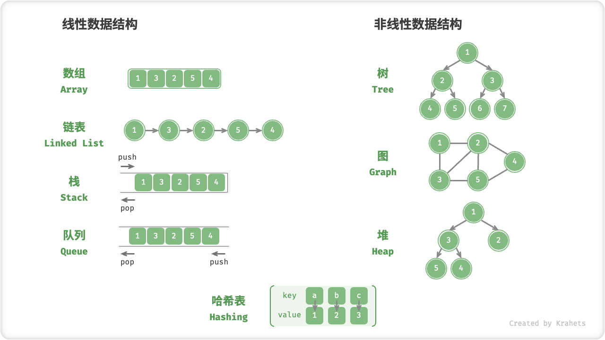
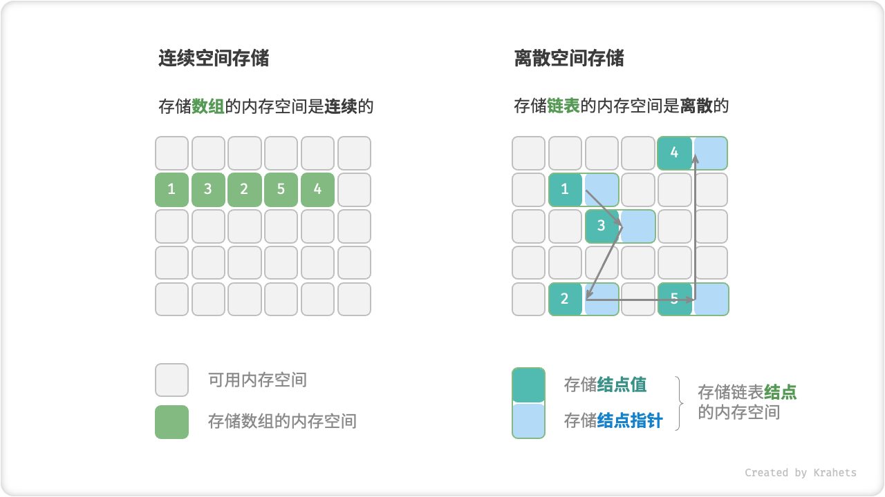

# 3.2. &nbsp; 数据结构分类

数据结构可以从逻辑结构和物理结构两个维度进行分类。

## 3.2.1. &nbsp; 逻辑结构：线性与非线性

**「逻辑结构」揭示了数据元素之间的逻辑关系**。在数组和链表中，数据按照顺序依次排列，体现了数据之间的线性关系；而在树中，数据从顶部向下按层次排列，表现出祖先与后代之间的派生关系；图则由结点和边构成，反映了复杂的网络关系。

逻辑结构通常分为「线性」和「非线性」两类。线性结构比较直观，指数据在逻辑关系上呈线性排列；非线性结构则相反，呈非线性排列，例如网状或树状结构。

- **线性数据结构**：数组、链表、栈、队列、哈希表；
- **非线性数据结构**：树、图、堆、哈希表；

 Fig. 线性与非线性数据结构 

## 3.2.2. &nbsp; 物理结构：连续与离散

!!! note

    如若阅读起来有困难，建议先阅读下一章“数组与链表”，然后再回头理解物理结构的含义。

**「物理结构」体现了数据在计算机内存中的存储方式**，可以分为数组的连续空间存储和链表的离散空间存储。物理结构从底层决定了数据的访问、更新、增删等操作方法，同时在时间效率和空间效率方面呈现出互补的特点。

 Fig. 连续空间存储与离散空间存储 

**所有数据结构都是基于数组、链表或二者的组合实现的**。例如，栈和队列既可以使用数组实现，也可以使用链表实现；而哈希表的实现可能同时包含数组和链表。

- **基于数组可实现**：栈、队列、哈希表、树、堆、图、矩阵、张量（维度 $\geq 3$ 的数组）等；
- **基于链表可实现**：栈、队列、哈希表、树、堆、图等；

基于数组实现的数据结构也被称为「静态数据结构」，这意味着此类数据结构在初始化后长度不可变。相对应地，基于链表实现的数据结构被称为「动态数据结构」，这类数据结构在初始化后，仍可以在程序运行过程中对其长度进行调整。

!!! tip

    数组与链表是其他所有数据结构的“底层积木”，建议读者投入更多时间深入了解这两种基本数据结构。
