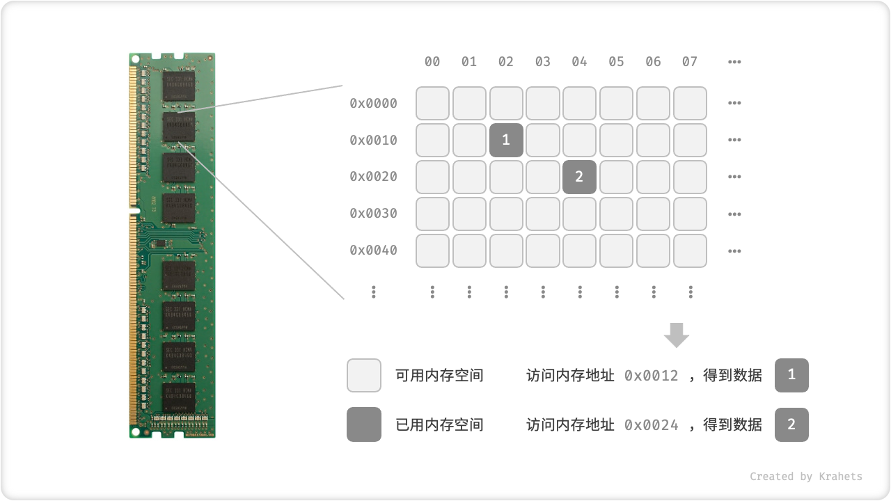

# 3.1. &nbsp; 数据与内存

## 3.1.1. &nbsp; 基本数据类型

谈及计算机中的数据，我们会想到文本、图片、视频、语音、3D 模型等各种形式。尽管这些数据的组织形式各异，但它们都由各种基本数据类型构成。

**「基本数据类型」是 CPU 可以直接进行运算的类型，在算法中直接被使用**。

- 「整数」按照不同的长度分为 byte, short, int, long 。在满足取值范围的前提下，我们应该尽量选取较短的整数类型，以减小内存空间占用；
- 「浮点数」表示小数，按长度分为 float, double ，选用规则与整数相同。
- 「字符」在计算机中以字符集形式保存，char 的值实际上是数字，代表字符集中的编号，计算机通过字符集查表完成编号到字符的转换。
- 「布尔」代表逻辑中的“是”与“否”，其占用空间需根据编程语言确定。

<div class="center-table" markdown>

| 类别   | 符号        | 占用空间          | 取值范围                                       | 默认值         |
| ------ | ----------- | ----------------- | ---------------------------------------------- | -------------- |
| 整数   | byte        | 1 byte            | $-2^7$ ~ $2^7 - 1$ ( $-128$ ~ $127$ )          | $0$            |
|        | short       | 2 bytes           | $-2^{15}$ ~ $2^{15} - 1$                       | $0$            |
|        | **int**     | 4 bytes           | $-2^{31}$ ~ $2^{31} - 1$                       | $0$            |
|        | long        | 8 bytes           | $-2^{63}$ ~ $2^{63} - 1$                       | $0$            |
| 浮点数 | **float**   | 4 bytes           | $-3.4 \times 10^{38}$ ~ $3.4 \times 10^{38}$   | $0.0$ f        |
|        | double      | 8 bytes           | $-1.7 \times 10^{308}$ ~ $1.7 \times 10^{308}$ | $0.0$          |
| 字符   | **char**    | 2 bytes / 1 byte   | $0$ ~ $2^{16} - 1$                             | $0$            |
| 布尔   | **bool** | 1 byte / 1 bit  | $\text{true}$ 或 $\text{false}$                | $\text{false}$ |

</div>

以上表格中，加粗项在算法题中最为常用。此表格无需硬背，大致理解即可，需要时可以通过查表来回忆。

### 整数表示方式

整数的取值范围取决于变量使用的内存长度，即字节（或比特）数。在计算机中，1 字节 (byte) = 8 比特 (bit)，1 比特即 1 个二进制位。以 int 类型为例：

1. 整数类型 int 占用 4 bytes = 32 bits ，可以表示 $2^{32}$ 个不同的数字；
2. 将最高位视为符号位，$0$ 代表正数，$1$ 代表负数，一共可表示 $2^{31}$ 个正数和 $2^{31}$ 个负数；
3. 当所有 bits 为 0 时代表数字 $0$ ，从零开始增大，可得最大正数为 $2^{31} - 1$；
4. 剩余 $2^{31}$ 个数字全部用来表示负数，因此最小负数为 $-2^{31}$ ；具体细节涉及“源码、反码、补码”的相关知识，有兴趣的同学可以查阅学习；

其它整数类型 byte, short, long 的取值范围的计算方法与 int 类似，在此不再赘述。

### 浮点数表示方式 *

!!! note

    本书中，标题后的 * 符号代表选读章节。如果你觉得理解困难，建议先跳过，等学完必读章节后再单独攻克。

细心的你可能会发现：int 和 float 长度相同，都是 4 bytes，但为什么 float 的取值范围远大于 int ？按理说 float 需要表示小数，取值范围应该变小才对。

实际上，这是因为浮点数 float 采用了不同的表示方式。根据 IEEE 754 标准，32-bit 长度的 float 由以下部分构成：

- 符号位 $\mathrm{S}$ ：占 1 bit ；
- 指数位 $\mathrm{E}$ ：占 8 bits ；
- 分数位 $\mathrm{N}$ ：占 24 bits ，其中 23 位显式存储；

设 32-bit 二进制数的第 $i$ 位为 $b_i$，则 float 值的计算方法定义为：

$$
\text { val } = (-1)^{b_{31}} \times 2^{\left(b_{30} b_{29} \ldots b_{23}\right)_2-127} \times\left(1 . b_{22} b_{21} \ldots b_0\right)_2
$$

转化到十进制下的计算公式为

$$
\text { val }=(-1)^{\mathrm{S}} \times 2^{\mathrm{E} -127} \times (1 + \mathrm{N})
$$

其中各项的取值范围为

$$
\begin{aligned}
\mathrm{S} \in & \{ 0, 1\} , \quad \mathrm{E} \in \{ 1, 2, \dots, 254 \} \newline
(1 + \mathrm{N}) = & (1 + \sum_{i=1}^{23} b_{23-i} 2^{-i}) \subset [1, 2 - 2^{-23}]
\end{aligned}
$$


<p align="center"> Fig. IEEE 754 标准下的 float 表示方式 </p>

以上图为例，$\mathrm{S} = 0$ ， $\mathrm{E} = 124$ ，$\mathrm{N} = 2^{-2} + 2^{-3} = 0.375$ ，易得

$$
\text { val } = (-1)^0 \times 2^{124 - 127} \times (1 + 0.375) = 0.171875
$$

现在我们可以回答最初的问题：**float 的表示方式包含指数位，导致其取值范围远大于 int** 。根据以上计算，float 可表示的最大正数为 $2^{254 - 127} \times (2 - 2^{-23}) \approx 3.4 \times 10^{38}$ ，切换符号位便可得到最小负数。

**尽管浮点数 float 扩展了取值范围，但其副作用是牺牲了精度**。整数类型 int 将全部 32 位用于表示数字，数字是均匀分布的；而由于指数位的存在，浮点数 float 的数值越大，相邻两个数字之间的差值就会趋向越大。

进一步地，指数位 $E = 0$ 和 $E = 255$ 具有特殊含义，**用于表示零、无穷大、$\mathrm{NaN}$ 等**。

<div class="center-table" markdown>

| 指数位 E           | 分数位 $\mathrm{N} = 0$ | 分数位 $\mathrm{N} \ne 0$    | 计算公式                                                     |
| ------------------ | ----------------------- | ---------------------------- | ------------------------------------------------------------ |
| $0$                | $\pm 0$                 | 次正规数    | $(-1)^{\mathrm{S}} \times 2^{-126} \times (0.\mathrm{N})$    |
| $1, 2, \dots, 254$ | 正规数                  | 正规数         | $(-1)^{\mathrm{S}} \times 2^{(\mathrm{E} -127)} \times (1.\mathrm{N})$ |
| $255$              | $\pm \infty$            | $\mathrm{NaN}$  |                                           |

</div>

特别地，次正规数显著提升了浮点数的精度，这是因为：

- 最小正正规数为 $2^{-126} \approx 1.18 \times 10^{-38}$ ；
- 最小正次正规数为 $2^{-126} \times 2^{-23} \approx 1.4 \times 10^{-45}$ ；

双精度 double 也采用类似 float 的表示方法，此处不再详述。

### 基本数据类型与数据结构的关系

我们知道，**数据结构是在计算机中组织与存储数据的方式**，它的核心是“结构”，而非“数据”。如果想要表示“一排数字”，我们自然会想到使用「数组」数据结构。数组的存储方式可以表示数字的相邻关系、顺序关系，但至于具体存储的是整数 int 、小数 float 、还是字符 char ，则与“数据结构”无关。换句话说，基本数据类型提供了数据的“内容类型”，而数据结构提供了数据的“组织方式”。

=== "Java"

    ```java title=""
    /* 使用多种「基本数据类型」来初始化「数组」 */
    int[] numbers = new int[5];
    float[] decimals = new float[5];
    char[] characters = new char[5];
    boolean[] booleans = new boolean[5];
    ```

=== "C++"

    ```cpp title=""
    /* 使用多种「基本数据类型」来初始化「数组」 */
    int numbers[5];
    float decimals[5];
    char characters[5];
    bool booleans[5];
    ```

=== "Python"

    ```python title=""
    """ Python 的 list 可以自由存储各种基本数据类型和对象 """
    list = [0, 0.0, 'a', False]
    ```

=== "Go"

    ```go title=""
    // 使用多种「基本数据类型」来初始化「数组」
    var numbers = [5]int{}
    var decimals = [5]float64{}
    var characters = [5]byte{}
    var booleans = [5]bool{}
    ```

=== "JavaScript"

    ```javascript title=""
    /* JavaScript 的数组可以自由存储各种基本数据类型和对象 */
    const array = [0, 0.0, 'a', false];
    ```

=== "TypeScript"

    ```typescript title=""
    /* 使用多种「基本数据类型」来初始化「数组」 */
    const numbers: number[] = [];
    const characters: string[] = [];
    const booleans: boolean[] = [];
    ```

=== "C"

    ```c title=""
    /* 使用多种「基本数据类型」来初始化「数组」 */
    int numbers[10];
    float decimals[10];
    char characters[10];
    bool booleans[10];
    ```

=== "C#"

    ```csharp title=""
    /* 使用多种「基本数据类型」来初始化「数组」 */
    int[] numbers = new int[5];
    float[] decimals = new float[5];
    char[] characters = new char[5];
    bool[] booleans = new bool[5];
    ```

=== "Swift"

    ```swift title=""
    /* 使用多种「基本数据类型」来初始化「数组」 */
    let numbers = Array(repeating: Int(), count: 5)
    let decimals = Array(repeating: Double(), count: 5)
    let characters = Array(repeating: Character("a"), count: 5)
    let booleans = Array(repeating: Bool(), count: 5)
    ```

=== "Zig"

    ```zig title=""

    ```

## 3.1.2. &nbsp; 计算机内存

在计算机中，内存和硬盘是两种主要的存储硬件设备。「硬盘」主要用于长期存储数据，容量较大（通常可达到 TB 级别）、速度较慢。「内存」用于运行程序时暂存数据，速度较快，但容量较小（通常为 GB 级别）。

**在算法运行过程中，相关数据都存储在内存中**。下图展示了一个计算机内存条，其中每个黑色方块都包含一块内存空间。我们可以将内存想象成一个巨大的 Excel 表格，其中每个单元格都可以存储 1 byte 的数据，在算法运行时，所有数据都被存储在这些单元格中。

**系统通过「内存地址 Memory Location」来访问目标内存位置的数据**。计算机根据特定规则为表格中的每个单元格分配编号，确保每个内存空间都有唯一的内存地址。有了这些地址，程序便可以访问内存中的数据。



<p align="center"> Fig. 内存条、内存空间、内存地址 </p>

**在数据结构与算法的设计中，内存资源是一个重要的考虑因素**。内存是所有程序的共享资源，当内存被某个程序占用时，其他程序无法同时使用。我们需要根据剩余内存资源的实际情况来设计算法。例如，算法所占用的内存峰值不应超过系统剩余空闲内存；如果运行的程序很多并且缺少大量连续的内存空间，那么所选用的数据结构必须能够存储在离散的内存空间内。
