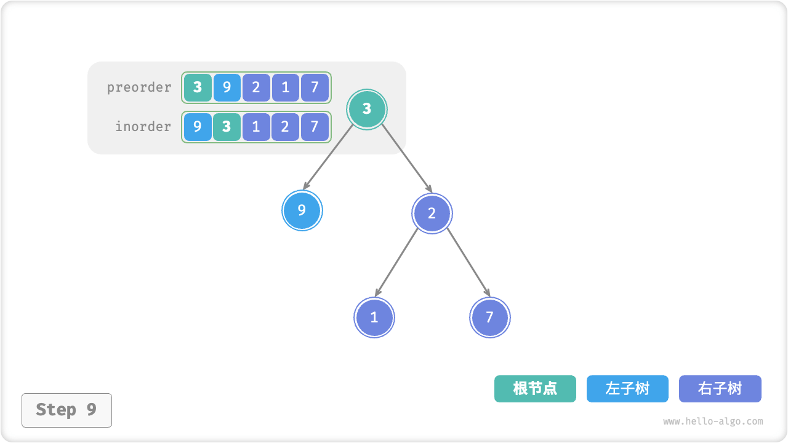

# 12.3 &nbsp; 构建二叉树问题

!!! question

    给定一个二叉树的前序遍历 `preorder` 和中序遍历 `inorder` ，请从中构建二叉树，返回二叉树的根节点。


<p align="center"> 图 12-5 &nbsp; 构建二叉树的示例数据 </p>

### 1. &nbsp; 判断是否为分治问题

原问题定义为从 `preorder` 和 `inorder` 构建二叉树，其是一个典型的分治问题。

- **问题可以被分解**：从分治的角度切入，我们可以将原问题划分为两个子问题：构建左子树、构建右子树，加上一步操作：初始化根节点。而对于每个子树（子问题），我们仍然可以复用以上划分方法，将其划分为更小的子树（子问题），直至达到最小子问题（空子树）时终止。
- **子问题是独立的**：左子树和右子树是相互独立的，它们之间没有交集。在构建左子树时，我们只需要关注中序遍历和前序遍历中与左子树对应的部分。右子树同理。
- **子问题的解可以合并**：一旦得到了左子树和右子树（子问题的解），我们就可以将它们链接到根节点上，得到原问题的解。

### 2. &nbsp; 如何划分子树

根据以上分析，这道题是可以使用分治来求解的，**但如何通过前序遍历 `preorder` 和中序遍历 `inorder` 来划分左子树和右子树呢**？

根据定义，`preorder` 和 `inorder` 都可以被划分为三个部分。

- 前序遍历：`[ 根节点 | 左子树 | 右子树 ]` ，例如图 12-5 的树对应 `[ 3 | 9 | 2 1 7 ]` 。
- 中序遍历：`[ 左子树 | 根节点 ｜ 右子树 ]` ，例如图 12-5 的树对应 `[ 9 | 3 | 1 2 7 ]` 。

以上图数据为例，我们可以通过图 12-6 所示的步骤得到划分结果。

1. 前序遍历的首元素 3 是根节点的值。
2. 查找根节点 3 在 `inorder` 中的索引，利用该索引可将 `inorder` 划分为 `[ 9 | 3 ｜ 1 2 7 ]` 。
3. 根据 `inorder` 划分结果，易得左子树和右子树的节点数量分别为 1 和 3 ，从而可将 `preorder` 划分为 `[ 3 | 9 | 2 1 7 ]` 。


<p align="center"> 图 12-6 &nbsp; 在前序和中序遍历中划分子树 </p>

### 3. &nbsp; 基于变量描述子树区间

根据以上划分方法，**我们已经得到根节点、左子树、右子树在 `preorder` 和 `inorder` 中的索引区间**。而为了描述这些索引区间，我们需要借助几个指针变量。

- 将当前树的根节点在 `preorder` 中的索引记为 $i$ 。
- 将当前树的根节点在 `inorder` 中的索引记为 $m$ 。
- 将当前树在 `inorder` 中的索引区间记为 $[l, r]$ 。

如表 12-1 所示，通过以上变量即可表示根节点在 `preorder` 中的索引，以及子树在 `inorder` 中的索引区间。

<p align="center"> 表 12-1 &nbsp; 根节点和子树在前序和中序遍历中的索引 </p>

<div class="center-table" markdown>

|        | 根节点在 `preorder` 中的索引 | 子树在 `inorder` 中的索引区间 |
| ------ | -------------------------------- | ----------------------------- |
| 当前树 | $i$                              | $[l, r]$                      |
| 左子树 | $i + 1$                          | $[l, m-1]$                    |
| 右子树 | $i + 1 + (m - l)$                | $[m+1, r]$                    |

</div>

请注意，右子树根节点索引中的 $(m-l)$ 的含义是“左子树的节点数量”，建议配合图 12-7 理解。


<p align="center"> 图 12-7 &nbsp; 根节点和左右子树的索引区间表示 </p>

### 4. &nbsp; 代码实现

为了提升查询 $m$ 的效率，我们借助一个哈希表 `hmap` 来存储数组 `inorder` 中元素到索引的映射。

=== "Python"

    ```python title="build_tree.py"
    def dfs(
        preorder: list[int],
        inorder_map: dict[int, int],
        i: int,
        l: int,
        r: int,
    ) -> TreeNode | None:
        """构建二叉树：分治"""
        # 子树区间为空时终止
        if r - l < 0:
            return None
        # 初始化根节点
        root = TreeNode(preorder[i])
        # 查询 m ，从而划分左右子树
        m = inorder_map[preorder[i]]
        # 子问题：构建左子树
        root.left = dfs(preorder, inorder_map, i + 1, l, m - 1)
        # 子问题：构建右子树
        root.right = dfs(preorder, inorder_map, i + 1 + m - l, m + 1, r)
        # 返回根节点
        return root

    def build_tree(preorder: list[int], inorder: list[int]) -> TreeNode | None:
        """构建二叉树"""
        # 初始化哈希表，存储 inorder 元素到索引的映射
        inorder_map = {val: i for i, val in enumerate(inorder)}
        root = dfs(preorder, inorder_map, 0, 0, len(inorder) - 1)
        return root
    ```

=== "C++"

    ```cpp title="build_tree.cpp"
    /* 构建二叉树：分治 */
    TreeNode *dfs(vector<int> &preorder, unordered_map<int, int> &inorderMap, int i, int l, int r) {
        // 子树区间为空时终止
        if (r - l < 0)
            return NULL;
        // 初始化根节点
        TreeNode *root = new TreeNode(preorder[i]);
        // 查询 m ，从而划分左右子树
        int m = inorderMap[preorder[i]];
        // 子问题：构建左子树
        root->left = dfs(preorder, inorderMap, i + 1, l, m - 1);
        // 子问题：构建右子树
        root->right = dfs(preorder, inorderMap, i + 1 + m - l, m + 1, r);
        // 返回根节点
        return root;
    }

    /* 构建二叉树 */
    TreeNode *buildTree(vector<int> &preorder, vector<int> &inorder) {
        // 初始化哈希表，存储 inorder 元素到索引的映射
        unordered_map<int, int> inorderMap;
        for (int i = 0; i < inorder.size(); i++) {
            inorderMap[inorder[i]] = i;
        }
        TreeNode *root = dfs(preorder, inorderMap, 0, 0, inorder.size() - 1);
        return root;
    }
    ```

=== "Java"

    ```java title="build_tree.java"
    /* 构建二叉树：分治 */
    TreeNode dfs(int[] preorder, Map<Integer, Integer> inorderMap, int i, int l, int r) {
        // 子树区间为空时终止
        if (r - l < 0)
            return null;
        // 初始化根节点
        TreeNode root = new TreeNode(preorder[i]);
        // 查询 m ，从而划分左右子树
        int m = inorderMap.get(preorder[i]);
        // 子问题：构建左子树
        root.left = dfs(preorder, inorderMap, i + 1, l, m - 1);
        // 子问题：构建右子树
        root.right = dfs(preorder, inorderMap, i + 1 + m - l, m + 1, r);
        // 返回根节点
        return root;
    }

    /* 构建二叉树 */
    TreeNode buildTree(int[] preorder, int[] inorder) {
        // 初始化哈希表，存储 inorder 元素到索引的映射
        Map<Integer, Integer> inorderMap = new HashMap<>();
        for (int i = 0; i < inorder.length; i++) {
            inorderMap.put(inorder[i], i);
        }
        TreeNode root = dfs(preorder, inorderMap, 0, 0, inorder.length - 1);
        return root;
    }
    ```

=== "C#"

    ```csharp title="build_tree.cs"
    /* 构建二叉树：分治 */
    TreeNode dfs(int[] preorder, Dictionary<int, int> inorderMap, int i, int l, int r) {
        // 子树区间为空时终止
        if (r - l < 0)
            return null;
        // 初始化根节点
        TreeNode root = new TreeNode(preorder[i]);
        // 查询 m ，从而划分左右子树
        int m = inorderMap[preorder[i]];
        // 子问题：构建左子树
        root.left = dfs(preorder, inorderMap, i + 1, l, m - 1);
        // 子问题：构建右子树
        root.right = dfs(preorder, inorderMap, i + 1 + m - l, m + 1, r);
        // 返回根节点
        return root;
    }

    /* 构建二叉树 */
    TreeNode buildTree(int[] preorder, int[] inorder) {
        // 初始化哈希表，存储 inorder 元素到索引的映射
        Dictionary<int, int> inorderMap = new Dictionary<int, int>();
        for (int i = 0; i < inorder.Length; i++) {
            inorderMap.TryAdd(inorder[i], i);
        }
        TreeNode root = dfs(preorder, inorderMap, 0, 0, inorder.Length - 1);
        return root;
    }
    ```

=== "Go"

    ```go title="build_tree.go"
    /* 构建二叉树：分治 */
    func dfsBuildTree(preorder []int, inorderMap map[int]int, i, l, r int) *TreeNode {
        // 子树区间为空时终止
        if r-l < 0 {
            return nil
        }
        // 初始化根节点
        root := NewTreeNode(preorder[i])
        // 查询 m ，从而划分左右子树
        m := inorderMap[preorder[i]]
        // 子问题：构建左子树
        root.Left = dfsBuildTree(preorder, inorderMap, i+1, l, m-1)
        // 子问题：构建右子树
        root.Right = dfsBuildTree(preorder, inorderMap, i+1+m-l, m+1, r)
        // 返回根节点
        return root
    }

    /* 构建二叉树 */
    func buildTree(preorder, inorder []int) *TreeNode {
        // 初始化哈希表，存储 inorder 元素到索引的映射
        inorderMap := make(map[int]int, len(inorder))
        for i := 0; i < len(inorder); i++ {
            inorderMap[inorder[i]] = i
        }

        root := dfsBuildTree(preorder, inorderMap, 0, 0, len(inorder)-1)
        return root
    }
    ```

=== "Swift"

    ```swift title="build_tree.swift"
    /* 构建二叉树：分治 */
    func dfs(preorder: [Int], inorderMap: [Int: Int], i: Int, l: Int, r: Int) -> TreeNode? {
        // 子树区间为空时终止
        if r - l < 0 {
            return nil
        }
        // 初始化根节点
        let root = TreeNode(x: preorder[i])
        // 查询 m ，从而划分左右子树
        let m = inorderMap[preorder[i]]!
        // 子问题：构建左子树
        root.left = dfs(preorder: preorder, inorderMap: inorderMap, i: i + 1, l: l, r: m - 1)
        // 子问题：构建右子树
        root.right = dfs(preorder: preorder, inorderMap: inorderMap, i: i + 1 + m - l, l: m + 1, r: r)
        // 返回根节点
        return root
    }

    /* 构建二叉树 */
    func buildTree(preorder: [Int], inorder: [Int]) -> TreeNode? {
        // 初始化哈希表，存储 inorder 元素到索引的映射
        let inorderMap = inorder.enumerated().reduce(into: [:]) { $0[$1.element] = $1.offset }
        return dfs(preorder: preorder, inorderMap: inorderMap, i: 0, l: 0, r: inorder.count - 1)
    }
    ```

=== "JS"

    ```javascript title="build_tree.js"
    /* 构建二叉树：分治 */
    function dfs(preorder, inorderMap, i, l, r) {
        // 子树区间为空时终止
        if (r - l < 0) return null;
        // 初始化根节点
        const root = new TreeNode(preorder[i]);
        // 查询 m ，从而划分左右子树
        const m = inorderMap.get(preorder[i]);
        // 子问题：构建左子树
        root.left = dfs(preorder, inorderMap, i + 1, l, m - 1);
        // 子问题：构建右子树
        root.right = dfs(preorder, inorderMap, i + 1 + m - l, m + 1, r);
        // 返回根节点
        return root;
    }

    /* 构建二叉树 */
    function buildTree(preorder, inorder) {
        // 初始化哈希表，存储 inorder 元素到索引的映射
        let inorderMap = new Map();
        for (let i = 0; i < inorder.length; i++) {
            inorderMap.set(inorder[i], i);
        }
        const root = dfs(preorder, inorderMap, 0, 0, inorder.length - 1);
        return root;
    }
    ```

=== "TS"

    ```typescript title="build_tree.ts"
    /* 构建二叉树：分治 */
    function dfs(
        preorder: number[],
        inorderMap: Map<number, number>,
        i: number,
        l: number,
        r: number
    ): TreeNode | null {
        // 子树区间为空时终止
        if (r - l < 0) return null;
        // 初始化根节点
        const root: TreeNode = new TreeNode(preorder[i]);
        // 查询 m ，从而划分左右子树
        const m = inorderMap.get(preorder[i]);
        // 子问题：构建左子树
        root.left = dfs(preorder, inorderMap, i + 1, l, m - 1);
        // 子问题：构建右子树
        root.right = dfs(preorder, inorderMap, i + 1 + m - l, m + 1, r);
        // 返回根节点
        return root;
    }

    /* 构建二叉树 */
    function buildTree(preorder: number[], inorder: number[]): TreeNode | null {
        // 初始化哈希表，存储 inorder 元素到索引的映射
        let inorderMap = new Map<number, number>();
        for (let i = 0; i < inorder.length; i++) {
            inorderMap.set(inorder[i], i);
        }
        const root = dfs(preorder, inorderMap, 0, 0, inorder.length - 1);
        return root;
    }
    ```

=== "Dart"

    ```dart title="build_tree.dart"
    /* 构建二叉树：分治 */
    TreeNode? dfs(
      List<int> preorder,
      Map<int, int> inorderMap,
      int i,
      int l,
      int r,
    ) {
      // 子树区间为空时终止
      if (r - l < 0) {
        return null;
      }
      // 初始化根节点
      TreeNode? root = TreeNode(preorder[i]);
      // 查询 m ，从而划分左右子树
      int m = inorderMap[preorder[i]]!;
      // 子问题：构建左子树
      root.left = dfs(preorder, inorderMap, i + 1, l, m - 1);
      // 子问题：构建右子树
      root.right = dfs(preorder, inorderMap, i + 1 + m - l, m + 1, r);
      // 返回根节点
      return root;
    }

    /* 构建二叉树 */
    TreeNode? buildTree(List<int> preorder, List<int> inorder) {
      // 初始化哈希表，存储 inorder 元素到索引的映射
      Map<int, int> inorderMap = {};
      for (int i = 0; i < inorder.length; i++) {
        inorderMap[inorder[i]] = i;
      }
      TreeNode? root = dfs(preorder, inorderMap, 0, 0, inorder.length - 1);
      return root;
    }
    ```

=== "Rust"

    ```rust title="build_tree.rs"
    /* 构建二叉树：分治 */
    fn dfs(preorder: &[i32], inorderMap: &HashMap<i32, i32>, i: i32, l: i32, r: i32) -> Option<Rc<RefCell<TreeNode>>> {
        // 子树区间为空时终止
        if r - l < 0 { return None; }
        // 初始化根节点
        let root = TreeNode::new(preorder[i as usize]);
        // 查询 m ，从而划分左右子树
        let m = inorderMap.get(&preorder[i as usize]).unwrap();
        // 子问题：构建左子树
        root.borrow_mut().left = dfs(preorder, inorderMap, i + 1, l, m - 1);
        // 子问题：构建右子树
        root.borrow_mut().right = dfs(preorder, inorderMap, i + 1 + m - l, m + 1, r);
        // 返回根节点
        Some(root)
    }

    /* 构建二叉树 */
    fn build_tree(preorder: &[i32], inorder: &[i32]) -> Option<Rc<RefCell<TreeNode>>> {
        // 初始化哈希表，存储 inorder 元素到索引的映射
        let mut inorderMap: HashMap<i32, i32> = HashMap::new();
        for i in 0..inorder.len() {
            inorderMap.insert(inorder[i], i as i32);
        }
        let root = dfs(preorder, &inorderMap, 0, 0, inorder.len() as i32 - 1);
        root
    }
    ```

=== "C"

    ```c title="build_tree.c"
    [class]{}-[func]{dfs}

    [class]{}-[func]{buildTree}
    ```

=== "Zig"

    ```zig title="build_tree.zig"
    [class]{}-[func]{dfs}

    [class]{}-[func]{buildTree}
    ```

图 12-8 展示了构建二叉树的递归过程，各个节点是在向下“递”的过程中建立的，而各条边（即引用）是在向上“归”的过程中建立的。

=== "<1>"
    

=== "<2>"
    

=== "<3>"
    

=== "<4>"
    

=== "<5>"
    

=== "<6>"
    

=== "<7>"
    

=== "<8>"
    

=== "<9>"
    

<p align="center"> 图 12-8 &nbsp; 构建二叉树的递归过程 </p>

每个递归函数内的前序遍历 `preorder` 和中序遍历 `inorder` 的划分结果如图 12-9 所示。


<p align="center"> 图 12-9 &nbsp; 每个递归函数中的划分结果 </p>

设树的节点数量为 $n$ ，初始化每一个节点（执行一个递归函数 `dfs()` ）使用 $O(1)$ 时间。**因此总体时间复杂度为 $O(n)$** 。

哈希表存储 `inorder` 元素到索引的映射，空间复杂度为 $O(n)$ 。最差情况下，即二叉树退化为链表时，递归深度达到 $n$ ，使用 $O(n)$ 的栈帧空间。**因此总体空间复杂度为 $O(n)$** 。
