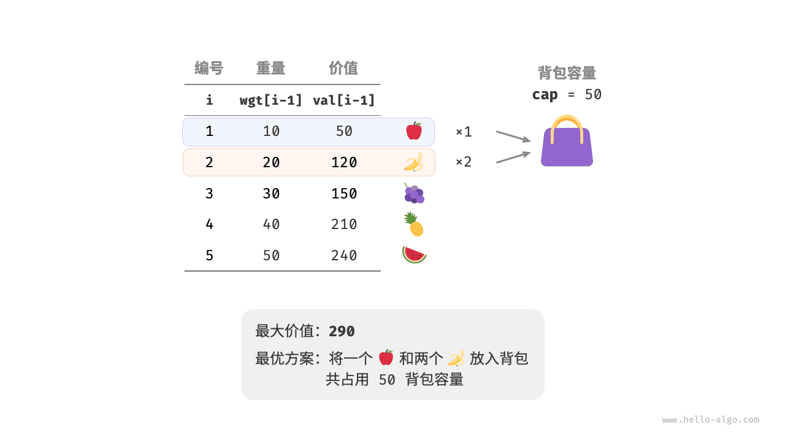
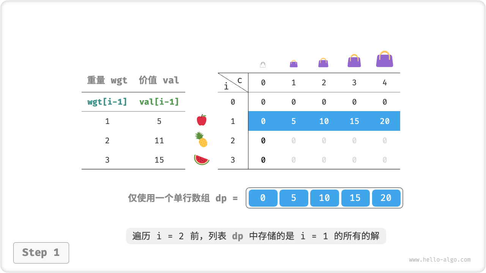
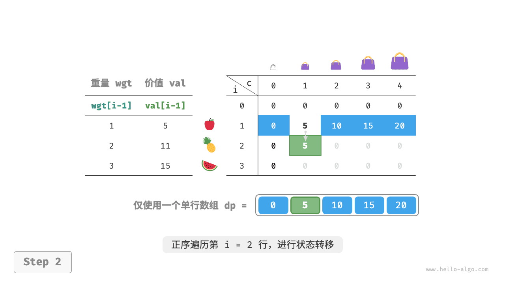
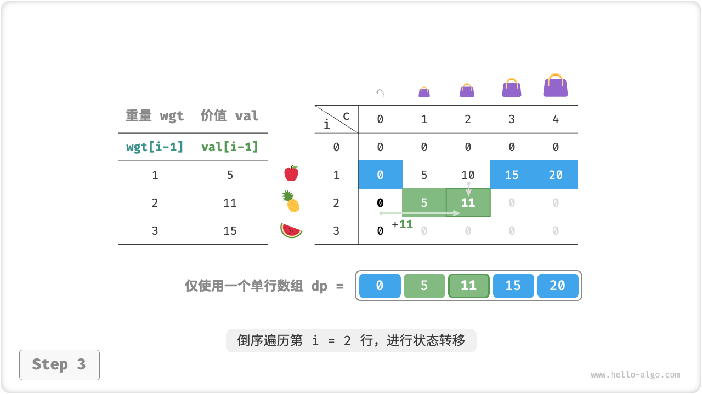
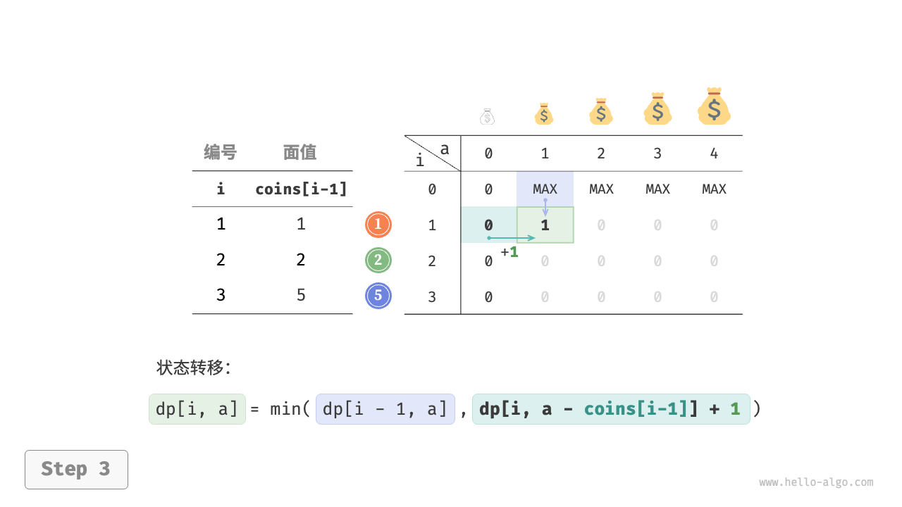
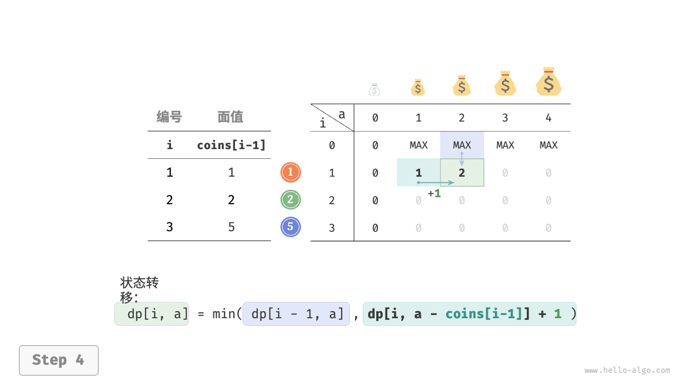
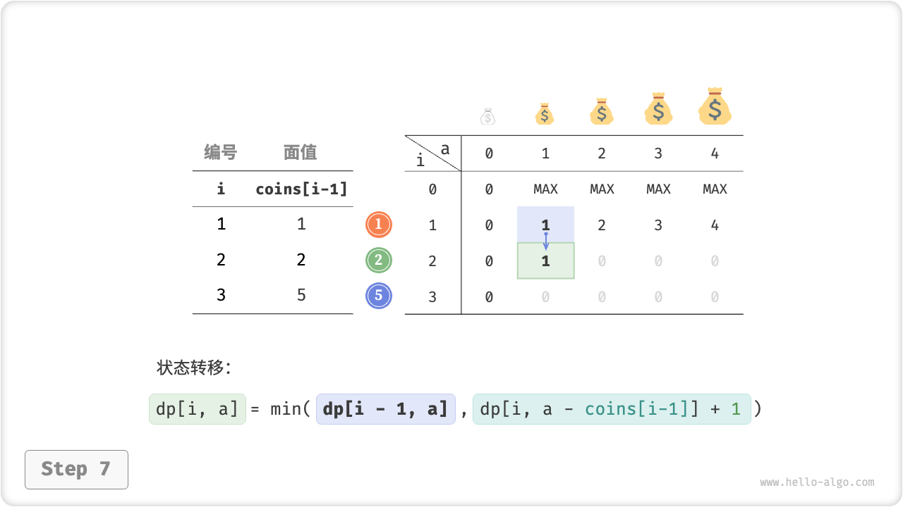
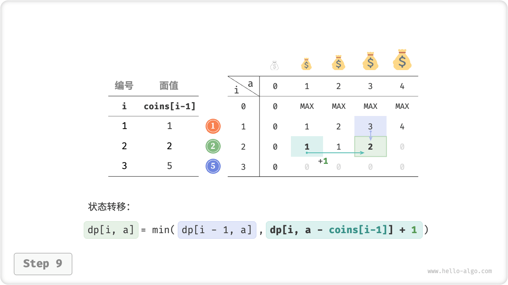
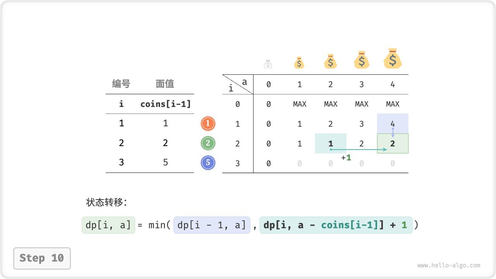
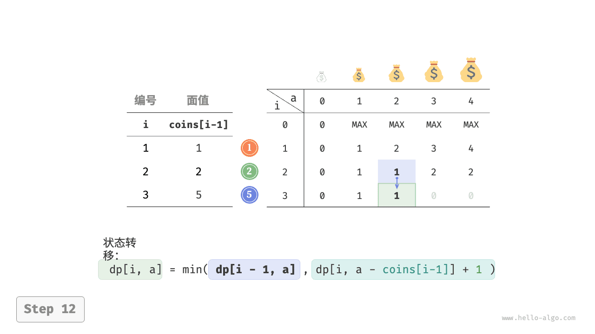

# 13.5. &nbsp; 完全背包问题

在本节，我们先求解 0-1 背包的一个变种问题：完全背包问题；再了解完全背包的一种特例问题：零钱兑换。

## 13.5.1. &nbsp; 完全背包问题

!!! question

    给定 $n$ 种物品，第 $i$ 个物品的重量为 $wgt[i-1]$ 、价值为 $val[i-1]$ ，现在有个容量为 $cap$ 的背包，**每种物品可以重复选取**，问在不超过背包容量下背包中物品的最大价值。



<p align="center"> Fig. 完全背包问题的示例数据 </p>

完全背包和 0-1 背包问题非常相似，**区别仅在于不限制物品的选择次数**。

- 在 0-1 背包中，每个物品只有一个，因此将物品 $i$ 放入背包后，只能从前 $i-1$ 个物品中选择；
- 在完全背包中，每个物品有无数个，因此将物品 $i$ 放入背包后，**仍可以从前 $i$ 个物品中选择**；

这就导致了状态转移的变化，对于状态 $[i, c]$ 有：

- **不放入物品 $i$** ：与 0-1 背包相同，转移至 $[i-1, c]$ ；
- **放入物品 $i$** ：状态转移至 $[i, c-wgt[i-1]]$ 而非 0-1 背包的 $[i-1, c-wgt[i-1]]$ ；

因此状态转移方程变为：

$$
dp[i, c] = \max(dp[i-1, c], dp[i, c - wgt[i-1]] + val[i-1])
$$

对比两道题目的动态规划代码，状态转移中有一处从 $i-1$ 变为 $i$ ，其余完全一致。

=== "Java"

    ```java title="unbounded_knapsack.java"
    /* 完全背包：动态规划 */
    int unboundedKnapsackDP(int[] wgt, int[] val, int cap) {
        int n = wgt.length;
        // 初始化 dp 表
        int[][] dp = new int[n + 1][cap + 1];
        // 状态转移
        for (int i = 1; i <= n; i++) {
            for (int c = 1; c <= cap; c++) {
                if (wgt[i - 1] > c) {
                    // 若超过背包容量，则不选物品 i
                    dp[i][c] = dp[i - 1][c];
                } else {
                    // 不选和选物品 i 这两种方案的较大值
                    dp[i][c] = Math.max(dp[i - 1][c], dp[i][c - wgt[i - 1]] + val[i - 1]);
                }
            }
        }
        return dp[n][cap];
    }
    ```

=== "C++"

    ```cpp title="unbounded_knapsack.cpp"
    /* 完全背包：动态规划 */
    int unboundedKnapsackDP(vector<int> &wgt, vector<int> &val, int cap) {
        int n = wgt.size();
        // 初始化 dp 表
        vector<vector<int>> dp(n + 1, vector<int>(cap + 1, 0));
        // 状态转移
        for (int i = 1; i <= n; i++) {
            for (int c = 1; c <= cap; c++) {
                if (wgt[i - 1] > c) {
                    // 若超过背包容量，则不选物品 i
                    dp[i][c] = dp[i - 1][c];
                } else {
                    // 不选和选物品 i 这两种方案的较大值
                    dp[i][c] = max(dp[i - 1][c], dp[i][c - wgt[i - 1]] + val[i - 1]);
                }
            }
        }
        return dp[n][cap];
    }
    ```

=== "Python"

    ```python title="unbounded_knapsack.py"
    def unbounded_knapsack_dp(wgt: list[int], val: list[int], cap: int) -> int:
        """完全背包：动态规划"""
        n = len(wgt)
        # 初始化 dp 表
        dp = [[0] * (cap + 1) for _ in range(n + 1)]
        # 状态转移
        for i in range(1, n + 1):
            for c in range(1, cap + 1):
                if wgt[i - 1] > c:
                    # 若超过背包容量，则不选物品 i
                    dp[i][c] = dp[i - 1][c]
                else:
                    # 不选和选物品 i 这两种方案的较大值
                    dp[i][c] = max(dp[i - 1][c], dp[i][c - wgt[i - 1]] + val[i - 1])
        return dp[n][cap]
    ```

=== "Go"

    ```go title="unbounded_knapsack.go"
    [class]{}-[func]{unboundedKnapsackDP}
    ```

=== "JavaScript"

    ```javascript title="unbounded_knapsack.js"
    [class]{}-[func]{unboundedKnapsackDP}
    ```

=== "TypeScript"

    ```typescript title="unbounded_knapsack.ts"
    [class]{}-[func]{unboundedKnapsackDP}
    ```

=== "C"

    ```c title="unbounded_knapsack.c"
    [class]{}-[func]{unboundedKnapsackDP}
    ```

=== "C#"

    ```csharp title="unbounded_knapsack.cs"
    [class]{unbounded_knapsack}-[func]{unboundedKnapsackDP}
    ```

=== "Swift"

    ```swift title="unbounded_knapsack.swift"
    [class]{}-[func]{unboundedKnapsackDP}
    ```

=== "Zig"

    ```zig title="unbounded_knapsack.zig"
    [class]{}-[func]{unboundedKnapsackDP}
    ```

=== "Dart"

    ```dart title="unbounded_knapsack.dart"
    [class]{}-[func]{unboundedKnapsackDP}
    ```

由于当前状态是从左边和上边的状态转移而来，**因此状态压缩后应该对 $dp$ 表中的每一行采取正序遍历**，这个遍历顺序与 0-1 背包正好相反。请通过以下动画来理解为什么要改为正序遍历。

=== "<1>"
    

=== "<2>"
    

=== "<3>"
    

=== "<4>"
    

=== "<5>"
    

=== "<6>"
    

代码实现比较简单，仅需将数组 `dp` 的第一维删除。

=== "Java"

    ```java title="unbounded_knapsack.java"
    /* 完全背包：状态压缩后的动态规划 */
    int unboundedKnapsackDPComp(int[] wgt, int[] val, int cap) {
        int n = wgt.length;
        // 初始化 dp 表
        int[] dp = new int[cap + 1];
        // 状态转移
        for (int i = 1; i <= n; i++) {
            for (int c = 1; c <= cap; c++) {
                if (wgt[i - 1] > c) {
                    // 若超过背包容量，则不选物品 i
                    dp[c] = dp[c];
                } else {
                    // 不选和选物品 i 这两种方案的较大值
                    dp[c] = Math.max(dp[c], dp[c - wgt[i - 1]] + val[i - 1]);
                }
            }
        }
        return dp[cap];
    }
    ```

=== "C++"

    ```cpp title="unbounded_knapsack.cpp"
    /* 完全背包：状态压缩后的动态规划 */
    int unboundedKnapsackDPComp(vector<int> &wgt, vector<int> &val, int cap) {
        int n = wgt.size();
        // 初始化 dp 表
        vector<int> dp(cap + 1, 0);
        // 状态转移
        for (int i = 1; i <= n; i++) {
            for (int c = 1; c <= cap; c++) {
                if (wgt[i - 1] > c) {
                    // 若超过背包容量，则不选物品 i
                    dp[c] = dp[c];
                } else {
                    // 不选和选物品 i 这两种方案的较大值
                    dp[c] = max(dp[c], dp[c - wgt[i - 1]] + val[i - 1]);
                }
            }
        }
        return dp[cap];
    }
    ```

=== "Python"

    ```python title="unbounded_knapsack.py"
    def unbounded_knapsack_dp_comp(wgt: list[int], val: list[int], cap: int) -> int:
        """完全背包：状态压缩后的动态规划"""
        n = len(wgt)
        # 初始化 dp 表
        dp = [0] * (cap + 1)
        # 状态转移
        for i in range(1, n + 1):
            # 正序遍历
            for c in range(1, cap + 1):
                if wgt[i - 1] > c:
                    # 若超过背包容量，则不选物品 i
                    dp[c] = dp[c]
                else:
                    # 不选和选物品 i 这两种方案的较大值
                    dp[c] = max(dp[c], dp[c - wgt[i - 1]] + val[i - 1])
        return dp[cap]
    ```

=== "Go"

    ```go title="unbounded_knapsack.go"
    [class]{}-[func]{unboundedKnapsackDPComp}
    ```

=== "JavaScript"

    ```javascript title="unbounded_knapsack.js"
    [class]{}-[func]{unboundedKnapsackDPComp}
    ```

=== "TypeScript"

    ```typescript title="unbounded_knapsack.ts"
    [class]{}-[func]{unboundedKnapsackDPComp}
    ```

=== "C"

    ```c title="unbounded_knapsack.c"
    [class]{}-[func]{unboundedKnapsackDPComp}
    ```

=== "C#"

    ```csharp title="unbounded_knapsack.cs"
    [class]{unbounded_knapsack}-[func]{unboundedKnapsackDPComp}
    ```

=== "Swift"

    ```swift title="unbounded_knapsack.swift"
    [class]{}-[func]{unboundedKnapsackDPComp}
    ```

=== "Zig"

    ```zig title="unbounded_knapsack.zig"
    [class]{}-[func]{unboundedKnapsackDPComp}
    ```

=== "Dart"

    ```dart title="unbounded_knapsack.dart"
    [class]{}-[func]{unboundedKnapsackDPComp}
    ```

## 13.5.2. &nbsp; 零钱兑换问题

背包问题是一大类动态规划问题的代表，其拥有很多的变种，例如零钱兑换问题。

!!! question

    给定 $n$ 种硬币，第 $i$ 个硬币的面值为 $coins[i - 1]$ ，为目标金额 $amt$ ，**每种硬币可以重复选取**，问能够凑出目标金额的最少硬币个数。如果无法凑出目标金额则返回 $-1$ 。

如下图所示，凑出 $11$ 元最少需要 $3$ 枚硬币，方案为 $1 + 2 + 5 = 11$ 。


<p align="center"> Fig. 零钱兑换问题的示例数据 </p>

**零钱兑换问题可以看作是完全背包问题的一种特殊情况**，两者具有以下联系与不同点：

- 两道题可以相互转换，“物品”对应于“硬币”、“物品重量”对应于“硬币面值”、“背包容量”对应于“目标金额”；
- 目标不同，背包问题是要最大化物品价值，零钱兑换问题是要最小化硬币数量；
- 背包问题是求“不超过”背包容量下的解，零钱兑换是求“恰好”凑到目标金额的解；

**第一步：思考每轮的决策，定义状态，从而得到 $dp$ 表**

状态 $[i, a]$ 对应的子问题为：**前 $i$ 个硬币能够凑出金额 $a$ 的最少硬币个数**，记为 $dp[i, a]$ 。

二维 $dp$ 表的尺寸为 $(n+1) \times (amt+1)$ 。

**第二步：找出最优子结构，进而推导出状态转移方程**

与完全背包的状态转移方程基本相同，不同点在于：

- 本题要求最小值，因此需将运算符 $\max()$ 更改为 $\min()$ ；
- 优化主体是“硬币数量”而非”商品价值“，因此在选中硬币时执行 $+1$ 即可；

$$
dp[i, a] = \min(dp[i-1, a], dp[i, a - coins[i-1]] + 1)
$$

**第三步：确定边界条件和状态转移顺序**

当目标金额为 $0$ 时，凑出它的最少硬币个数为 $0$ ，即所有 $dp[i, 0]$ 都等于 $0$ 。当无硬币时，**无法凑出任意 $> 0$ 的目标金额**，即是无效解。为使状态转移方程中的 $\min()$ 函数能够识别并过滤无效解，我们考虑使用 $+ \infty$ 来表示它们，即令所有 $dp[0, a]$ 都等于 $+ \infty$ 。

以上做法仅适用于 Python 语言，因为大多数编程语言并未提供 $+ \infty$ 变量，所以只能使用整型 `int` 的最大值，而这又会导致大数越界：**当 $dp[i, a - coins[i-1]]$ 是无效解时，再执行 $+ 1$ 操作会发生溢出**。

为解决该问题，我们采用一个不可能达到的大数字 $amt + 1$ 来表示无效解，因为凑出 $amt$ 的硬币个数最多为 $amt$ 个。

在最后返回前，判断 $dp[n, amt]$ 是否等于 $amt + 1$ ，若是则返回 $-1$ ，代表无法凑出目标金额。

=== "Java"

    ```java title="coin_change.java"
    /* 零钱兑换：动态规划 */
    int coinChangeDP(int[] coins, int amt) {
        int n = coins.length;
        int MAX = amt + 1;
        // 初始化 dp 表
        int[][] dp = new int[n + 1][amt + 1];
        // 状态转移：首行首列
        for (int a = 1; a <= amt; a++) {
            dp[0][a] = MAX;
        }
        // 状态转移：其余行列
        for (int i = 1; i <= n; i++) {
            for (int a = 1; a <= amt; a++) {
                if (coins[i - 1] > a) {
                    // 若超过背包容量，则不选硬币 i
                    dp[i][a] = dp[i - 1][a];
                } else {
                    // 不选和选硬币 i 这两种方案的较小值
                    dp[i][a] = Math.min(dp[i - 1][a], dp[i][a - coins[i - 1]] + 1);
                }
            }
        }
        return dp[n][amt] != MAX ? dp[n][amt] : -1;
    }
    ```

=== "C++"

    ```cpp title="coin_change.cpp"
    /* 零钱兑换：动态规划 */
    int coinChangeDP(vector<int> &coins, int amt) {
        int n = coins.size();
        int MAX = amt + 1;
        // 初始化 dp 表
        vector<vector<int>> dp(n + 1, vector<int>(amt + 1, 0));
        // 状态转移：首行首列
        for (int a = 1; a <= amt; a++) {
            dp[0][a] = MAX;
        }
        // 状态转移：其余行列
        for (int i = 1; i <= n; i++) {
            for (int a = 1; a <= amt; a++) {
                if (coins[i - 1] > a) {
                    // 若超过背包容量，则不选硬币 i
                    dp[i][a] = dp[i - 1][a];
                } else {
                    // 不选和选硬币 i 这两种方案的较小值
                    dp[i][a] = min(dp[i - 1][a], dp[i][a - coins[i - 1]] + 1);
                }
            }
        }
        return dp[n][amt] != MAX ? dp[n][amt] : -1;
    }
    ```

=== "Python"

    ```python title="coin_change.py"
    def coin_change_dp(coins: list[int], amt: int) -> int:
        """零钱兑换：动态规划"""
        n = len(coins)
        MAX = amt + 1
        # 初始化 dp 表
        dp = [[0] * (amt + 1) for _ in range(n + 1)]
        # 状态转移：首行首列
        for a in range(1, amt + 1):
            dp[0][a] = MAX
        # 状态转移：其余行列
        for i in range(1, n + 1):
            for a in range(1, amt + 1):
                if coins[i - 1] > a:
                    # 若超过背包容量，则不选硬币 i
                    dp[i][a] = dp[i - 1][a]
                else:
                    # 不选和选硬币 i 这两种方案的较小值
                    dp[i][a] = min(dp[i - 1][a], dp[i][a - coins[i - 1]] + 1)
        return dp[n][amt] if dp[n][amt] != MAX else -1
    ```

=== "Go"

    ```go title="coin_change.go"
    [class]{}-[func]{coinChangeDP}
    ```

=== "JavaScript"

    ```javascript title="coin_change.js"
    [class]{}-[func]{coinChangeDP}
    ```

=== "TypeScript"

    ```typescript title="coin_change.ts"
    [class]{}-[func]{coinChangeDP}
    ```

=== "C"

    ```c title="coin_change.c"
    [class]{}-[func]{coinChangeDP}
    ```

=== "C#"

    ```csharp title="coin_change.cs"
    [class]{coin_change}-[func]{coinChangeDP}
    ```

=== "Swift"

    ```swift title="coin_change.swift"
    [class]{}-[func]{coinChangeDP}
    ```

=== "Zig"

    ```zig title="coin_change.zig"
    [class]{}-[func]{coinChangeDP}
    ```

=== "Dart"

    ```dart title="coin_change.dart"
    [class]{}-[func]{coinChangeDP}
    ```

下图展示了零钱兑换的动态规划过程。

=== "<1>"
    

=== "<2>"
    

=== "<3>"
    

=== "<4>"
    

=== "<5>"
    

=== "<6>"
    

=== "<7>"
    

=== "<8>"
    

=== "<9>"
    

=== "<10>"
    

=== "<11>"
    

=== "<12>"
    

=== "<13>"
    

=== "<14>"
    

=== "<15>"
    

由于零钱兑换和完全背包的状态转移方程如出一辙，因此状态压缩方式也相同。

=== "Java"

    ```java title="coin_change.java"
    /* 零钱兑换：状态压缩后的动态规划 */
    int coinChangeDPComp(int[] coins, int amt) {
        int n = coins.length;
        int MAX = amt + 1;
        // 初始化 dp 表
        int[] dp = new int[amt + 1];
        Arrays.fill(dp, MAX);
        dp[0] = 0;
        // 状态转移
        for (int i = 1; i <= n; i++) {
            for (int a = 1; a <= amt; a++) {
                if (coins[i - 1] > a) {
                    // 若超过背包容量，则不选硬币 i
                    dp[a] = dp[a];
                } else {
                    // 不选和选硬币 i 这两种方案的较小值
                    dp[a] = Math.min(dp[a], dp[a - coins[i - 1]] + 1);
                }
            }
        }
        return dp[amt] != MAX ? dp[amt] : -1;
    }
    ```

=== "C++"

    ```cpp title="coin_change.cpp"
    /* 零钱兑换：状态压缩后的动态规划 */
    int coinChangeDPComp(vector<int> &coins, int amt) {
        int n = coins.size();
        int MAX = amt + 1;
        // 初始化 dp 表
        vector<int> dp(amt + 1, MAX);
        dp[0] = 0;
        // 状态转移
        for (int i = 1; i <= n; i++) {
            for (int a = 1; a <= amt; a++) {
                if (coins[i - 1] > a) {
                    // 若超过背包容量，则不选硬币 i
                    dp[a] = dp[a];
                } else {
                    // 不选和选硬币 i 这两种方案的较小值
                    dp[a] = min(dp[a], dp[a - coins[i - 1]] + 1);
                }
            }
        }
        return dp[amt] != MAX ? dp[amt] : -1;
    }
    ```

=== "Python"

    ```python title="coin_change.py"
    def coin_change_dp_comp(coins: list[int], amt: int) -> int:
        """零钱兑换：状态压缩后的动态规划"""
        n = len(coins)
        MAX = amt + 1
        # 初始化 dp 表
        dp = [MAX] * (amt + 1)
        dp[0] = 0
        # 状态转移
        for i in range(1, n + 1):
            # 正序遍历
            for a in range(1, amt + 1):
                if coins[i - 1] > a:
                    # 若超过背包容量，则不选硬币 i
                    dp[a] = dp[a]
                else:
                    # 不选和选硬币 i 这两种方案的较小值
                    dp[a] = min(dp[a], dp[a - coins[i - 1]] + 1)
        return dp[amt] if dp[amt] != MAX else -1
    ```

=== "Go"

    ```go title="coin_change.go"
    [class]{}-[func]{coinChangeDPComp}
    ```

=== "JavaScript"

    ```javascript title="coin_change.js"
    [class]{}-[func]{coinChangeDPComp}
    ```

=== "TypeScript"

    ```typescript title="coin_change.ts"
    [class]{}-[func]{coinChangeDPComp}
    ```

=== "C"

    ```c title="coin_change.c"
    [class]{}-[func]{coinChangeDPComp}
    ```

=== "C#"

    ```csharp title="coin_change.cs"
    [class]{coin_change}-[func]{coinChangeDPComp}
    ```

=== "Swift"

    ```swift title="coin_change.swift"
    [class]{}-[func]{coinChangeDPComp}
    ```

=== "Zig"

    ```zig title="coin_change.zig"
    [class]{}-[func]{coinChangeDPComp}
    ```

=== "Dart"

    ```dart title="coin_change.dart"
    [class]{}-[func]{coinChangeDPComp}
    ```

## 13.5.3. &nbsp; 零钱兑换问题 II

!!! question

    给定 $n$ 种硬币，第 $i$ 个硬币的面值为 $coins[i - 1]$ ，目标金额为 $amt$ ，每种硬币可以重复选取，**问在凑出目标金额的硬币组合数量**。


<p align="center"> Fig. 零钱兑换问题 II 的示例数据 </p>

相比于上一题，本题目标是组合数量，因此子问题变为：**前 $i$ 个硬币能够凑出金额 $a$ 的组合数量**。而 $dp$ 表仍然是尺寸为 $(n+1) \times (amt + 1)$ 的二维矩阵。

当前状态的组合数量等于不选当前硬币与选当前硬币这两种决策的组合数量之和。状态转移方程为：

$$
dp[i, a] = dp[i-1, a] + dp[i, a - coins[i-1]]
$$

当目标金额为 $0$ 时，无需选择任何硬币即可凑出目标金额，因此应将所有 $dp[i, 0]$ 都初始化为 $1$ 。当无硬币时，无法凑出任何 $>0$ 的目标金额，因此所有 $dp[0, a]$ 都等于 $0$ 。

=== "Java"

    ```java title="coin_change_ii.java"
    /* 零钱兑换 II：动态规划 */
    int coinChangeIIDP(int[] coins, int amt) {
        int n = coins.length;
        // 初始化 dp 表
        int[][] dp = new int[n + 1][amt + 1];
        // 初始化首列
        for (int i = 0; i <= n; i++) {
            dp[i][0] = 1;
        }
        // 状态转移
        for (int i = 1; i <= n; i++) {
            for (int a = 1; a <= amt; a++) {
                if (coins[i - 1] > a) {
                    // 若超过背包容量，则不选硬币 i
                    dp[i][a] = dp[i - 1][a];
                } else {
                    // 不选和选硬币 i 这两种方案之和
                    dp[i][a] = dp[i - 1][a] + dp[i][a - coins[i - 1]];
                }
            }
        }
        return dp[n][amt];
    }
    ```

=== "C++"

    ```cpp title="coin_change_ii.cpp"
    /* 零钱兑换 II：动态规划 */
    int coinChangeIIDP(vector<int> &coins, int amt) {
        int n = coins.size();
        // 初始化 dp 表
        vector<vector<int>> dp(n + 1, vector<int>(amt + 1, 0));
        // 初始化首列
        for (int i = 0; i <= n; i++) {
            dp[i][0] = 1;
        }
        // 状态转移
        for (int i = 1; i <= n; i++) {
            for (int a = 1; a <= amt; a++) {
                if (coins[i - 1] > a) {
                    // 若超过背包容量，则不选硬币 i
                    dp[i][a] = dp[i - 1][a];
                } else {
                    // 不选和选硬币 i 这两种方案之和
                    dp[i][a] = dp[i - 1][a] + dp[i][a - coins[i - 1]];
                }
            }
        }
        return dp[n][amt];
    }
    ```

=== "Python"

    ```python title="coin_change_ii.py"
    def coin_change_ii_dp(coins: list[int], amt: int) -> int:
        """零钱兑换 II：动态规划"""
        n = len(coins)
        # 初始化 dp 表
        dp = [[0] * (amt + 1) for _ in range(n + 1)]
        # 初始化首列
        for i in range(n + 1):
            dp[i][0] = 1
        # 状态转移
        for i in range(1, n + 1):
            for a in range(1, amt + 1):
                if coins[i - 1] > a:
                    # 若超过背包容量，则不选硬币 i
                    dp[i][a] = dp[i - 1][a]
                else:
                    # 不选和选硬币 i 这两种方案之和
                    dp[i][a] = dp[i - 1][a] + dp[i][a - coins[i - 1]]
        return dp[n][amt]
    ```

=== "Go"

    ```go title="coin_change_ii.go"
    [class]{}-[func]{coinChangeIIDP}
    ```

=== "JavaScript"

    ```javascript title="coin_change_ii.js"
    [class]{}-[func]{coinChangeIIDP}
    ```

=== "TypeScript"

    ```typescript title="coin_change_ii.ts"
    [class]{}-[func]{coinChangeIIDP}
    ```

=== "C"

    ```c title="coin_change_ii.c"
    [class]{}-[func]{coinChangeIIDP}
    ```

=== "C#"

    ```csharp title="coin_change_ii.cs"
    [class]{coin_change_ii}-[func]{coinChangeIIDP}
    ```

=== "Swift"

    ```swift title="coin_change_ii.swift"
    [class]{}-[func]{coinChangeIIDP}
    ```

=== "Zig"

    ```zig title="coin_change_ii.zig"
    [class]{}-[func]{coinChangeIIDP}
    ```

=== "Dart"

    ```dart title="coin_change_ii.dart"
    [class]{}-[func]{coinChangeIIDP}
    ```

状态压缩处理方式相同，删除硬币维度即可。

=== "Java"

    ```java title="coin_change_ii.java"
    /* 零钱兑换 II：状态压缩后的动态规划 */
    int coinChangeIIDPComp(int[] coins, int amt) {
        int n = coins.length;
        // 初始化 dp 表
        int[] dp = new int[amt + 1];
        dp[0] = 1;
        // 状态转移
        for (int i = 1; i <= n; i++) {
            for (int a = 1; a <= amt; a++) {
                if (coins[i - 1] > a) {
                    // 若超过背包容量，则不选硬币 i
                    dp[a] = dp[a];
                } else {
                    // 不选和选硬币 i 这两种方案之和
                    dp[a] = dp[a] + dp[a - coins[i - 1]];
                }
            }
        }
        return dp[amt];
    }
    ```

=== "C++"

    ```cpp title="coin_change_ii.cpp"
    /* 零钱兑换 II：状态压缩后的动态规划 */
    int coinChangeIIDPComp(vector<int> &coins, int amt) {
        int n = coins.size();
        // 初始化 dp 表
        vector<int> dp(amt + 1, 0);
        dp[0] = 1;
        // 状态转移
        for (int i = 1; i <= n; i++) {
            for (int a = 1; a <= amt; a++) {
                if (coins[i - 1] > a) {
                    // 若超过背包容量，则不选硬币 i
                    dp[a] = dp[a];
                } else {
                    // 不选和选硬币 i 这两种方案之和
                    dp[a] = dp[a] + dp[a - coins[i - 1]];
                }
            }
        }
        return dp[amt];
    }
    ```

=== "Python"

    ```python title="coin_change_ii.py"
    def coin_change_ii_dp_comp(coins: list[int], amt: int) -> int:
        """零钱兑换 II：状态压缩后的动态规划"""
        n = len(coins)
        # 初始化 dp 表
        dp = [0] * (amt + 1)
        dp[0] = 1
        # 状态转移
        for i in range(1, n + 1):
            # 正序遍历
            for a in range(1, amt + 1):
                if coins[i - 1] > a:
                    # 若超过背包容量，则不选硬币 i
                    dp[a] = dp[a]
                else:
                    # 不选和选硬币 i 这两种方案之和
                    dp[a] = dp[a] + dp[a - coins[i - 1]]
        return dp[amt]
    ```

=== "Go"

    ```go title="coin_change_ii.go"
    [class]{}-[func]{coinChangeIIDPComp}
    ```

=== "JavaScript"

    ```javascript title="coin_change_ii.js"
    [class]{}-[func]{coinChangeIIDPComp}
    ```

=== "TypeScript"

    ```typescript title="coin_change_ii.ts"
    [class]{}-[func]{coinChangeIIDPComp}
    ```

=== "C"

    ```c title="coin_change_ii.c"
    [class]{}-[func]{coinChangeIIDPComp}
    ```

=== "C#"

    ```csharp title="coin_change_ii.cs"
    [class]{coin_change_ii}-[func]{coinChangeIIDPComp}
    ```

=== "Swift"

    ```swift title="coin_change_ii.swift"
    [class]{}-[func]{coinChangeIIDPComp}
    ```

=== "Zig"

    ```zig title="coin_change_ii.zig"
    [class]{}-[func]{coinChangeIIDPComp}
    ```

=== "Dart"

    ```dart title="coin_change_ii.dart"
    [class]{}-[func]{coinChangeIIDPComp}
    ```
