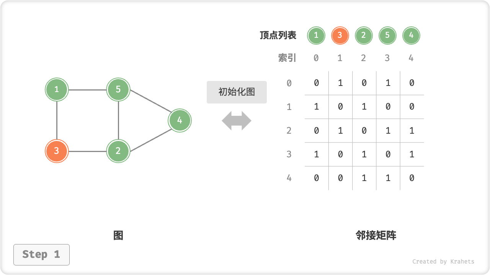
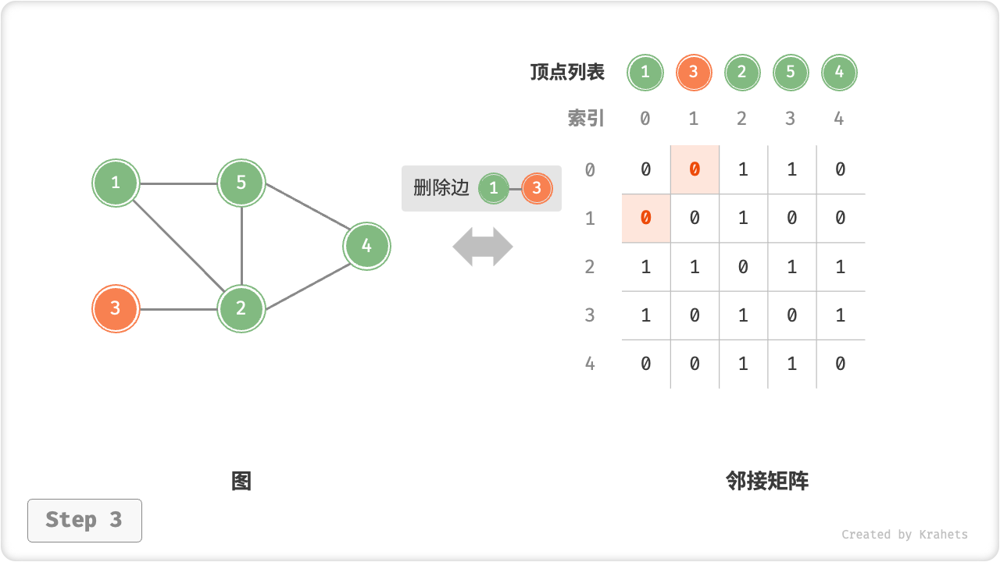
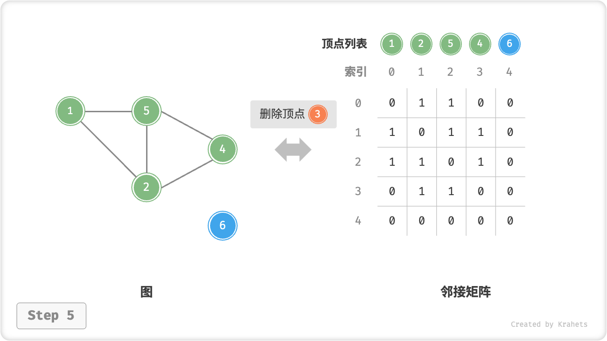
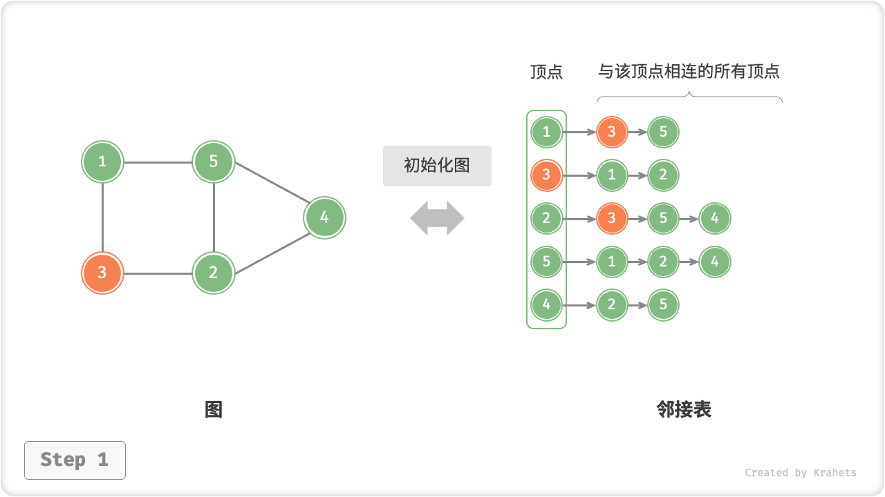
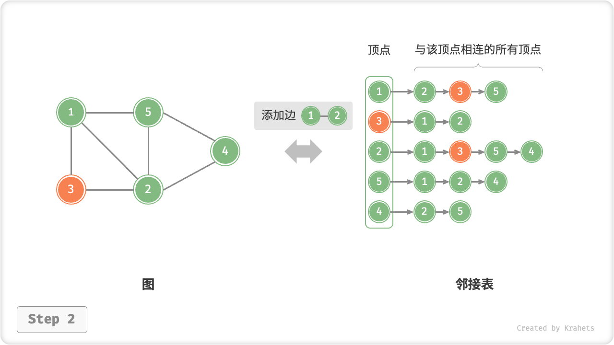

# 9.2. &nbsp; 图基础操作

图的基础操作可分为对「边」的操作和对「顶点」的操作。在「邻接矩阵」和「邻接表」两种表示方法下，实现方式有所不同。

## 9.2.1. &nbsp; 基于邻接矩阵的实现

给定一个顶点数量为 $n$ 的无向图，则有：

- **添加或删除边**：直接在邻接矩阵中修改指定的边即可，使用 $O(1)$ 时间。而由于是无向图，因此需要同时更新两个方向的边。
- **添加顶点**：在邻接矩阵的尾部添加一行一列，并全部填 $0$ 即可，使用 $O(n)$ 时间。
- **删除顶点**：在邻接矩阵中删除一行一列。当删除首行首列时达到最差情况，需要将 $(n-1)^2$ 个元素“向左上移动”，从而使用 $O(n^2)$ 时间。
- **初始化**：传入 $n$ 个顶点，初始化长度为 $n$ 的顶点列表 `vertices` ，使用 $O(n)$ 时间；初始化 $n \times n$ 大小的邻接矩阵 `adjMat` ，使用 $O(n^2)$ 时间。

=== "初始化邻接矩阵"
    

=== "添加边"
    

=== "删除边"
    

=== "添加顶点"
    

=== "删除顶点"
    

以下是基于邻接矩阵表示图的实现代码。

=== "Java"

    ```java title="graph_adjacency_matrix.java"
    /* 基于邻接矩阵实现的无向图类 */
    class GraphAdjMat {
        List<Integer> vertices; // 顶点列表，元素代表“顶点值”，索引代表“顶点索引”
        List<List<Integer>> adjMat; // 邻接矩阵，行列索引对应“顶点索引”

        /* 构造方法 */
        public GraphAdjMat(int[] vertices, int[][] edges) {
            this.vertices = new ArrayList<>();
            this.adjMat = new ArrayList<>();
            // 添加顶点
            for (int val : vertices) {
                addVertex(val);
            }
            // 添加边
            // 请注意，edges 元素代表顶点索引，即对应 vertices 元素索引
            for (int[] e : edges) {
                addEdge(e[0], e[1]);
            }
        }

        /* 获取顶点数量 */
        public int size() {
            return vertices.size();
        }

        /* 添加顶点 */
        public void addVertex(int val) {
            int n = size();
            // 向顶点列表中添加新顶点的值
            vertices.add(val);
            // 在邻接矩阵中添加一行
            List<Integer> newRow = new ArrayList<>(n);
            for (int j = 0; j < n; j++) {
                newRow.add(0);
            }
            adjMat.add(newRow);
            // 在邻接矩阵中添加一列
            for (List<Integer> row : adjMat) {
                row.add(0);
            }
        }

        /* 删除顶点 */
        public void removeVertex(int index) {
            if (index >= size())
                throw new IndexOutOfBoundsException();
            // 在顶点列表中移除索引 index 的顶点
            vertices.remove(index);
            // 在邻接矩阵中删除索引 index 的行
            adjMat.remove(index);
            // 在邻接矩阵中删除索引 index 的列
            for (List<Integer> row : adjMat) {
                row.remove(index);
            }
        }

        /* 添加边 */
        // 参数 i, j 对应 vertices 元素索引
        public void addEdge(int i, int j) {
            // 索引越界与相等处理
            if (i < 0 || j < 0 || i >= size() || j >= size() || i == j)
                throw new IndexOutOfBoundsException();
            // 在无向图中，邻接矩阵沿主对角线对称，即满足 (i, j) == (j, i)
            adjMat.get(i).set(j, 1);
            adjMat.get(j).set(i, 1);
        }

        /* 删除边 */
        // 参数 i, j 对应 vertices 元素索引
        public void removeEdge(int i, int j) {
            // 索引越界与相等处理
            if (i < 0 || j < 0 || i >= size() || j >= size() || i == j)
                throw new IndexOutOfBoundsException();
            adjMat.get(i).set(j, 0);
            adjMat.get(j).set(i, 0);
        }

        /* 打印邻接矩阵 */
        public void print() {
            System.out.print("顶点列表 = ");
            System.out.println(vertices);
            System.out.println("邻接矩阵 =");
            PrintUtil.printMatrix(adjMat);
        }
    }
    ```

=== "C++"

    ```cpp title="graph_adjacency_matrix.cpp"
    /* 基于邻接矩阵实现的无向图类 */
    class GraphAdjMat {
        vector<int> vertices;       // 顶点列表，元素代表“顶点值”，索引代表“顶点索引”
        vector<vector<int>> adjMat; // 邻接矩阵，行列索引对应“顶点索引”

      public:
        /* 构造方法 */
        GraphAdjMat(const vector<int> &vertices, const vector<vector<int>> &edges) {
            // 添加顶点
            for (int val : vertices) {
                addVertex(val);
            }
            // 添加边
            // 请注意，edges 元素代表顶点索引，即对应 vertices 元素索引
            for (const vector<int> &edge : edges) {
                addEdge(edge[0], edge[1]);
            }
        }

        /* 获取顶点数量 */
        int size() const {
            return vertices.size();
        }

        /* 添加顶点 */
        void addVertex(int val) {
            int n = size();
            // 向顶点列表中添加新顶点的值
            vertices.push_back(val);
            // 在邻接矩阵中添加一行
            adjMat.emplace_back(n, 0);
            // 在邻接矩阵中添加一列
            for (vector<int> &row : adjMat) {
                row.push_back(0);
            }
        }

        /* 删除顶点 */
        void removeVertex(int index) {
            if (index >= size()) {
                throw out_of_range("顶点不存在");
            }
            // 在顶点列表中移除索引 index 的顶点
            vertices.erase(vertices.begin() + index);
            // 在邻接矩阵中删除索引 index 的行
            adjMat.erase(adjMat.begin() + index);
            // 在邻接矩阵中删除索引 index 的列
            for (vector<int> &row : adjMat) {
                row.erase(row.begin() + index);
            }
        }

        /* 添加边 */
        // 参数 i, j 对应 vertices 元素索引
        void addEdge(int i, int j) {
            // 索引越界与相等处理
            if (i < 0 || j < 0 || i >= size() || j >= size() || i == j) {
                throw out_of_range("顶点不存在");
            }
            // 在无向图中，邻接矩阵沿主对角线对称，即满足 (i, j) == (j, i)
            adjMat[i][j] = 1;
            adjMat[j][i] = 1;
        }

        /* 删除边 */
        // 参数 i, j 对应 vertices 元素索引
        void removeEdge(int i, int j) {
            // 索引越界与相等处理
            if (i < 0 || j < 0 || i >= size() || j >= size() || i == j) {
                throw out_of_range("顶点不存在");
            }
            adjMat[i][j] = 0;
            adjMat[j][i] = 0;
        }

        /* 打印邻接矩阵 */
        void print() {
            cout << "顶点列表 = ";
            printVector(vertices);
            cout << "邻接矩阵 =" << endl;
            printVectorMatrix(adjMat);
        }
    };
    ```

=== "Python"

    ```python title="graph_adjacency_matrix.py"
    class GraphAdjMat:
        """基于邻接矩阵实现的无向图类"""

        # 顶点列表，元素代表“顶点值”，索引代表“顶点索引”
        vertices: list[int] = []
        # 邻接矩阵，行列索引对应“顶点索引”
        adj_mat: list[list[int]] = []

        def __init__(self, vertices: list[int], edges: list[list[int]]) -> None:
            """构造方法"""
            self.vertices: list[int] = []
            self.adj_mat: list[list[int]] = []
            # 添加顶点
            for val in vertices:
                self.add_vertex(val)
            # 添加边
            # 请注意，edges 元素代表顶点索引，即对应 vertices 元素索引
            for e in edges:
                self.add_edge(e[0], e[1])

        def size(self) -> int:
            """获取顶点数量"""
            return len(self.vertices)

        def add_vertex(self, val: int) -> None:
            """添加顶点"""
            n = self.size()
            # 向顶点列表中添加新顶点的值
            self.vertices.append(val)
            # 在邻接矩阵中添加一行
            new_row = [0] * n
            self.adj_mat.append(new_row)
            # 在邻接矩阵中添加一列
            for row in self.adj_mat:
                row.append(0)

        def remove_vertex(self, index: int) -> None:
            """删除顶点"""
            if index >= self.size():
                raise IndexError()
            # 在顶点列表中移除索引 index 的顶点
            self.vertices.pop(index)
            # 在邻接矩阵中删除索引 index 的行
            self.adj_mat.pop(index)
            # 在邻接矩阵中删除索引 index 的列
            for row in self.adj_mat:
                row.pop(index)

        def add_edge(self, i: int, j: int) -> None:
            """添加边"""
            # 参数 i, j 对应 vertices 元素索引
            # 索引越界与相等处理
            if i < 0 or j < 0 or i >= self.size() or j >= self.size() or i == j:
                raise IndexError()
            # 在无向图中，邻接矩阵沿主对角线对称，即满足 (i, j) == (j, i)
            self.adj_mat[i][j] = 1
            self.adj_mat[j][i] = 1

        def remove_edge(self, i: int, j: int) -> None:
            """删除边"""
            # 参数 i, j 对应 vertices 元素索引
            # 索引越界与相等处理
            if i < 0 or j < 0 or i >= self.size() or j >= self.size() or i == j:
                raise IndexError()
            self.adj_mat[i][j] = 0
            self.adj_mat[j][i] = 0

        def print(self) -> None:
            """打印邻接矩阵"""
            print("顶点列表 =", self.vertices)
            print("邻接矩阵 =")
            print_matrix(self.adj_mat)
    ```

=== "Go"

    ```go title="graph_adjacency_matrix.go"
    /* 基于邻接矩阵实现的无向图类 */
    type graphAdjMat struct {
        // 顶点列表，元素代表“顶点值”，索引代表“顶点索引”
        vertices []int
        // 邻接矩阵，行列索引对应“顶点索引”
        adjMat [][]int
    }

    /* 构造方法 */
    func newGraphAdjMat(vertices []int, edges [][]int) *graphAdjMat {
        // 添加顶点
        n := len(vertices)
        adjMat := make([][]int, n)
        for i := range adjMat {
            adjMat[i] = make([]int, n)
        }
        // 初始化图
        g := &graphAdjMat{
            vertices: vertices,
            adjMat:   adjMat,
        }
        // 添加边
        // 请注意，edges 元素代表顶点索引，即对应 vertices 元素索引
        for i := range edges {
            g.addEdge(edges[i][0], edges[i][1])
        }
        return g
    }

    /* 获取顶点数量 */
    func (g *graphAdjMat) size() int {
        return len(g.vertices)
    }

    /* 添加顶点 */
    func (g *graphAdjMat) addVertex(val int) {
        n := g.size()
        // 向顶点列表中添加新顶点的值
        g.vertices = append(g.vertices, val)
        // 在邻接矩阵中添加一行
        newRow := make([]int, n)
        g.adjMat = append(g.adjMat, newRow)
        // 在邻接矩阵中添加一列
        for i := range g.adjMat {
            g.adjMat[i] = append(g.adjMat[i], 0)
        }
    }

    /* 删除顶点 */
    func (g *graphAdjMat) removeVertex(index int) {
        if index >= g.size() {
            return
        }
        // 在顶点列表中移除索引 index 的顶点
        g.vertices = append(g.vertices[:index], g.vertices[index+1:]...)
        // 在邻接矩阵中删除索引 index 的行
        g.adjMat = append(g.adjMat[:index], g.adjMat[index+1:]...)
        // 在邻接矩阵中删除索引 index 的列
        for i := range g.adjMat {
            g.adjMat[i] = append(g.adjMat[i][:index], g.adjMat[i][index+1:]...)
        }
    }

    /* 添加边 */
    // 参数 i, j 对应 vertices 元素索引
    func (g *graphAdjMat) addEdge(i, j int) {
        // 索引越界与相等处理
        if i < 0 || j < 0 || i >= g.size() || j >= g.size() || i == j {
            fmt.Errorf("%s", "Index Out Of Bounds Exception")
        }
        // 在无向图中，邻接矩阵沿主对角线对称，即满足 (i, j) == (j, i)
        g.adjMat[i][j] = 1
        g.adjMat[j][i] = 1
    }

    /* 删除边 */
    // 参数 i, j 对应 vertices 元素索引
    func (g *graphAdjMat) removeEdge(i, j int) {
        // 索引越界与相等处理
        if i < 0 || j < 0 || i >= g.size() || j >= g.size() || i == j {
            fmt.Errorf("%s", "Index Out Of Bounds Exception")
        }
        g.adjMat[i][j] = 0
        g.adjMat[j][i] = 0
    }

    /* 打印邻接矩阵 */
    func (g *graphAdjMat) print() {
        fmt.Printf("\t顶点列表 = %v\n", g.vertices)
        fmt.Printf("\t邻接矩阵 = \n")
        for i := range g.adjMat {
            fmt.Printf("\t\t\t%v\n", g.adjMat[i])
        }
    }
    ```

=== "JavaScript"

    ```javascript title="graph_adjacency_matrix.js"
    /* 基于邻接矩阵实现的无向图类 */
    class GraphAdjMat {
        vertices; // 顶点列表，元素代表“顶点值”，索引代表“顶点索引”
        adjMat; // 邻接矩阵，行列索引对应“顶点索引”

        /* 构造函数 */
        constructor(vertices, edges) {
            this.vertices = [];
            this.adjMat = [];
            // 添加顶点
            for (const val of vertices) {
                this.addVertex(val);
            }
            // 添加边
            // 请注意，edges 元素代表顶点索引，即对应 vertices 元素索引
            for (const e of edges) {
                this.addEdge(e[0], e[1]);
            }
        }

        /* 获取顶点数量 */
        size() {
            return this.vertices.length;
        }

        /* 添加顶点 */
        addVertex(val) {
            const n = this.size();
            // 向顶点列表中添加新顶点的值
            this.vertices.push(val);
            // 在邻接矩阵中添加一行
            const newRow = [];
            for (let j = 0; j < n; j++) {
                newRow.push(0);
            }
            this.adjMat.push(newRow);
            // 在邻接矩阵中添加一列
            for (const row of this.adjMat) {
                row.push(0);
            }
        }

        /* 删除顶点 */
        removeVertex(index) {
            if (index >= this.size()) {
                throw new RangeError('Index Out Of Bounds Exception');
            }
            // 在顶点列表中移除索引 index 的顶点
            this.vertices.splice(index, 1);

            // 在邻接矩阵中删除索引 index 的行
            this.adjMat.splice(index, 1);
            // 在邻接矩阵中删除索引 index 的列
            for (const row of this.adjMat) {
                row.splice(index, 1);
            }
        }

        /* 添加边 */
        // 参数 i, j 对应 vertices 元素索引
        addEdge(i, j) {
            // 索引越界与相等处理
            if (i < 0 || j < 0 || i >= this.size() || j >= this.size() || i === j) {
                throw new RangeError('Index Out Of Bounds Exception');
            }
            // 在无向图中，邻接矩阵沿主对角线对称，即满足 (i, j) == (j, i)
            this.adjMat[i][j] = 1;
            this.adjMat[j][i] = 1;
        }

        /* 删除边 */
        // 参数 i, j 对应 vertices 元素索引
        removeEdge(i, j) {
            // 索引越界与相等处理
            if (i < 0 || j < 0 || i >= this.size() || j >= this.size() || i === j) {
                throw new RangeError('Index Out Of Bounds Exception');
            }
            this.adjMat[i][j] = 0;
            this.adjMat[j][i] = 0;
        }

        /* 打印邻接矩阵 */
        print() {
            console.log('顶点列表 = ', this.vertices);
            console.log('邻接矩阵 =', this.adjMat);
        }
    }
    ```

=== "TypeScript"

    ```typescript title="graph_adjacency_matrix.ts"
    /* 基于邻接矩阵实现的无向图类 */
    class GraphAdjMat {
        vertices: number[]; // 顶点列表，元素代表“顶点值”，索引代表“顶点索引”
        adjMat: number[][]; // 邻接矩阵，行列索引对应“顶点索引”

        /* 构造函数 */
        constructor(vertices: number[], edges: number[][]) {
            this.vertices = [];
            this.adjMat = [];
            // 添加顶点
            for (const val of vertices) {
                this.addVertex(val);
            }
            // 添加边
            // 请注意，edges 元素代表顶点索引，即对应 vertices 元素索引
            for (const e of edges) {
                this.addEdge(e[0], e[1]);
            }
        }

        /* 获取顶点数量 */
        size(): number {
            return this.vertices.length;
        }

        /* 添加顶点 */
        addVertex(val: number): void {
            const n: number = this.size();
            // 向顶点列表中添加新顶点的值
            this.vertices.push(val);
            // 在邻接矩阵中添加一行
            const newRow: number[] = [];
            for (let j: number = 0; j < n; j++) {
                newRow.push(0);
            }
            this.adjMat.push(newRow);
            // 在邻接矩阵中添加一列
            for (const row of this.adjMat) {
                row.push(0);
            }
        }

        /* 删除顶点 */
        removeVertex(index: number): void {
            if (index >= this.size()) {
                throw new RangeError('Index Out Of Bounds Exception');
            }
            // 在顶点列表中移除索引 index 的顶点
            this.vertices.splice(index, 1);

            // 在邻接矩阵中删除索引 index 的行
            this.adjMat.splice(index, 1);
            // 在邻接矩阵中删除索引 index 的列
            for (const row of this.adjMat) {
                row.splice(index, 1);
            }
        }

        /* 添加边 */
        // 参数 i, j 对应 vertices 元素索引
        addEdge(i: number, j: number): void {
            // 索引越界与相等处理
            if (i < 0 || j < 0 || i >= this.size() || j >= this.size() || i === j) {
                throw new RangeError('Index Out Of Bounds Exception');
            }
            // 在无向图中，邻接矩阵沿主对角线对称，即满足 (i, j) == (j, i)
            this.adjMat[i][j] = 1;
            this.adjMat[j][i] = 1;
        }

        /* 删除边 */
        // 参数 i, j 对应 vertices 元素索引
        removeEdge(i: number, j: number): void {
            // 索引越界与相等处理
            if (i < 0 || j < 0 || i >= this.size() || j >= this.size() || i === j) {
                throw new RangeError('Index Out Of Bounds Exception');
            }
            this.adjMat[i][j] = 0;
            this.adjMat[j][i] = 0;
        }

        /* 打印邻接矩阵 */
        print(): void {
            console.log('顶点列表 = ', this.vertices);
            console.log('邻接矩阵 =', this.adjMat);
        }
    }
    ```

=== "C"

    ```c title="graph_adjacency_matrix.c"
    [class]{graphAdjMat}-[func]{}
    ```

=== "C#"

    ```csharp title="graph_adjacency_matrix.cs"
    /* 基于邻接矩阵实现的无向图类 */
    class GraphAdjMat {
        List<int> vertices;     // 顶点列表，元素代表“顶点值”，索引代表“顶点索引”
        List<List<int>> adjMat; // 邻接矩阵，行列索引对应“顶点索引”

        /* 构造函数 */
        public GraphAdjMat(int[] vertices, int[][] edges) {
            this.vertices = new List<int>();
            this.adjMat = new List<List<int>>();
            // 添加顶点
            foreach (int val in vertices) {
                addVertex(val);
            }
            // 添加边
            // 请注意，edges 元素代表顶点索引，即对应 vertices 元素索引
            foreach (int[] e in edges) {
                addEdge(e[0], e[1]);
            }
        }

        /* 获取顶点数量 */
        public int size() {
            return vertices.Count;
        }

        /* 添加顶点 */
        public void addVertex(int val) {
            int n = size();
            // 向顶点列表中添加新顶点的值
            vertices.Add(val);
            // 在邻接矩阵中添加一行
            List<int> newRow = new List<int>(n);
            for (int j = 0; j < n; j++) {
                newRow.Add(0);
            }
            adjMat.Add(newRow);
            // 在邻接矩阵中添加一列
            foreach (List<int> row in adjMat) {
                row.Add(0);
            }
        }

        /* 删除顶点 */
        public void removeVertex(int index) {
            if (index >= size())
                throw new IndexOutOfRangeException();
            // 在顶点列表中移除索引 index 的顶点
            vertices.RemoveAt(index);
            // 在邻接矩阵中删除索引 index 的行
            adjMat.RemoveAt(index);
            // 在邻接矩阵中删除索引 index 的列
            foreach (List<int> row in adjMat) {
                row.RemoveAt(index);
            }
        }

        /* 添加边 */
        // 参数 i, j 对应 vertices 元素索引
        public void addEdge(int i, int j) {
            // 索引越界与相等处理
            if (i < 0 || j < 0 || i >= size() || j >= size() || i == j)
                throw new IndexOutOfRangeException();
            // 在无向图中，邻接矩阵沿主对角线对称，即满足 (i, j) == (j, i)
            adjMat[i][j] = 1;
            adjMat[j][i] = 1;
        }

        /* 删除边 */
        // 参数 i, j 对应 vertices 元素索引
        public void removeEdge(int i, int j) {
            // 索引越界与相等处理
            if (i < 0 || j < 0 || i >= size() || j >= size() || i == j)
                throw new IndexOutOfRangeException();
            adjMat[i][j] = 0;
            adjMat[j][i] = 0;
        }

        /* 打印邻接矩阵 */
        public void print() {
            Console.Write("顶点列表 = ");
            PrintUtil.PrintList(vertices);
            Console.WriteLine("邻接矩阵 =");
            PrintUtil.PrintMatrix(adjMat);
        }
    }
    ```

=== "Swift"

    ```swift title="graph_adjacency_matrix.swift"
    /* 基于邻接矩阵实现的无向图类 */
    class GraphAdjMat {
        private var vertices: [Int] // 顶点列表，元素代表“顶点值”，索引代表“顶点索引”
        private var adjMat: [[Int]] // 邻接矩阵，行列索引对应“顶点索引”

        /* 构造方法 */
        init(vertices: [Int], edges: [[Int]]) {
            self.vertices = []
            adjMat = []
            // 添加顶点
            for val in vertices {
                addVertex(val: val)
            }
            // 添加边
            // 请注意，edges 元素代表顶点索引，即对应 vertices 元素索引
            for e in edges {
                addEdge(i: e[0], j: e[1])
            }
        }

        /* 获取顶点数量 */
        func size() -> Int {
            vertices.count
        }

        /* 添加顶点 */
        func addVertex(val: Int) {
            let n = size()
            // 向顶点列表中添加新顶点的值
            vertices.append(val)
            // 在邻接矩阵中添加一行
            let newRow = Array(repeating: 0, count: n)
            adjMat.append(newRow)
            // 在邻接矩阵中添加一列
            for i in adjMat.indices {
                adjMat[i].append(0)
            }
        }

        /* 删除顶点 */
        func removeVertex(index: Int) {
            if index >= size() {
                fatalError("越界")
            }
            // 在顶点列表中移除索引 index 的顶点
            vertices.remove(at: index)
            // 在邻接矩阵中删除索引 index 的行
            adjMat.remove(at: index)
            // 在邻接矩阵中删除索引 index 的列
            for i in adjMat.indices {
                adjMat[i].remove(at: index)
            }
        }

        /* 添加边 */
        // 参数 i, j 对应 vertices 元素索引
        func addEdge(i: Int, j: Int) {
            // 索引越界与相等处理
            if i < 0 || j < 0 || i >= size() || j >= size() || i == j {
                fatalError("越界")
            }
            // 在无向图中，邻接矩阵沿主对角线对称，即满足 (i, j) == (j, i)
            adjMat[i][j] = 1
            adjMat[j][i] = 1
        }

        /* 删除边 */
        // 参数 i, j 对应 vertices 元素索引
        func removeEdge(i: Int, j: Int) {
            // 索引越界与相等处理
            if i < 0 || j < 0 || i >= size() || j >= size() || i == j {
                fatalError("越界")
            }
            adjMat[i][j] = 0
            adjMat[j][i] = 0
        }

        /* 打印邻接矩阵 */
        func print() {
            Swift.print("顶点列表 = ", terminator: "")
            Swift.print(vertices)
            Swift.print("邻接矩阵 =")
            PrintUtil.printMatrix(matrix: adjMat)
        }
    }
    ```

=== "Zig"

    ```zig title="graph_adjacency_matrix.zig"

    ```

## 9.2.2. &nbsp; 基于邻接表的实现

设无向图的顶点总数为 $n$ 、边总数为 $m$ ，则有：

- **添加边**：在顶点对应链表的末尾添加边即可，使用 $O(1)$ 时间。因为是无向图，所以需要同时添加两个方向的边。
- **删除边**：在顶点对应链表中查找并删除指定边，使用 $O(m)$ 时间。在无向图中，需要同时删除两个方向的边。
- **添加顶点**：在邻接表中添加一个链表，并将新增顶点作为链表头节点，使用 $O(1)$ 时间。
- **删除顶点**：需遍历整个邻接表，删除包含指定顶点的所有边，使用 $O(n + m)$ 时间。
- **初始化**：在邻接表中创建 $n$ 个顶点和 $2m$ 条边，使用 $O(n + m)$ 时间。

=== "初始化邻接表"
    

=== "添加边"
    

=== "删除边"
    

=== "添加顶点"
    

=== "删除顶点"
    

以下是基于邻接表实现图的代码示例。细心的同学可能注意到，**我们在邻接表中使用 `Vertex` 节点类来表示顶点**，这样做的原因有：

- 如果我们选择通过顶点值来区分不同顶点，那么值重复的顶点将无法被区分。
- 如果类似邻接矩阵那样，使用顶点列表索引来区分不同顶点。那么，假设我们想要删除索引为 $i$ 的顶点，则需要遍历整个邻接表，将其中 $> i$ 的索引全部减 $1$ ，这样操作效率较低。
- 因此我们考虑引入顶点类 `Vertex` ，使得每个顶点都是唯一的对象，此时删除顶点时就无需改动其余顶点了。

=== "Java"

    ```java title="graph_adjacency_list.java"
    /* 基于邻接表实现的无向图类 */
    class GraphAdjList {
        // 邻接表，key: 顶点，value：该顶点的所有邻接顶点
        Map<Vertex, List<Vertex>> adjList;

        /* 构造方法 */
        public GraphAdjList(Vertex[][] edges) {
            this.adjList = new HashMap<>();
            // 添加所有顶点和边
            for (Vertex[] edge : edges) {
                addVertex(edge[0]);
                addVertex(edge[1]);
                addEdge(edge[0], edge[1]);
            }
        }

        /* 获取顶点数量 */
        public int size() {
            return adjList.size();
        }

        /* 添加边 */
        public void addEdge(Vertex vet1, Vertex vet2) {
            if (!adjList.containsKey(vet1) || !adjList.containsKey(vet2) || vet1 == vet2)
                throw new IllegalArgumentException();
            // 添加边 vet1 - vet2
            adjList.get(vet1).add(vet2);
            adjList.get(vet2).add(vet1);
        }

        /* 删除边 */
        public void removeEdge(Vertex vet1, Vertex vet2) {
            if (!adjList.containsKey(vet1) || !adjList.containsKey(vet2) || vet1 == vet2)
                throw new IllegalArgumentException();
            // 删除边 vet1 - vet2
            adjList.get(vet1).remove(vet2);
            adjList.get(vet2).remove(vet1);
        }

        /* 添加顶点 */
        public void addVertex(Vertex vet) {
            if (adjList.containsKey(vet))
                return;
            // 在邻接表中添加一个新链表
            adjList.put(vet, new ArrayList<>());
        }

        /* 删除顶点 */
        public void removeVertex(Vertex vet) {
            if (!adjList.containsKey(vet))
                throw new IllegalArgumentException();
            // 在邻接表中删除顶点 vet 对应的链表
            adjList.remove(vet);
            // 遍历其他顶点的链表，删除所有包含 vet 的边
            for (List<Vertex> list : adjList.values()) {
                list.remove(vet);
            }
        }

        /* 打印邻接表 */
        public void print() {
            System.out.println("邻接表 =");
            for (Map.Entry<Vertex, List<Vertex>> entry : adjList.entrySet()) {
                List<Integer> tmp = new ArrayList<>();
                for (Vertex vertex : entry.getValue())
                    tmp.add(vertex.val);
                System.out.println(entry.getKey().val + ": " + tmp + ",");
            }
        }
    }
    ```

=== "C++"

    ```cpp title="graph_adjacency_list.cpp"
    /* 基于邻接表实现的无向图类 */
    class GraphAdjList {
      public:
        // 邻接表，key: 顶点，value：该顶点的所有邻接顶点
        unordered_map<Vertex *, vector<Vertex *>> adjList;

        /* 在 vector 中删除指定节点 */
        void remove(vector<Vertex *> &vec, Vertex *vet) {
            for (int i = 0; i < vec.size(); i++) {
                if (vec[i] == vet) {
                    vec.erase(vec.begin() + i);
                    break;
                }
            }
        }

        /* 构造方法 */
        GraphAdjList(const vector<vector<Vertex *>> &edges) {
            // 添加所有顶点和边
            for (const vector<Vertex *> &edge : edges) {
                addVertex(edge[0]);
                addVertex(edge[1]);
                addEdge(edge[0], edge[1]);
            }
        }

        /* 获取顶点数量 */
        int size() {
            return adjList.size();
        }

        /* 添加边 */
        void addEdge(Vertex *vet1, Vertex *vet2) {
            if (!adjList.count(vet1) || !adjList.count(vet2) || vet1 == vet2)
                throw invalid_argument("不存在顶点");
            // 添加边 vet1 - vet2
            adjList[vet1].push_back(vet2);
            adjList[vet2].push_back(vet1);
        }

        /* 删除边 */
        void removeEdge(Vertex *vet1, Vertex *vet2) {
            if (!adjList.count(vet1) || !adjList.count(vet2) || vet1 == vet2)
                throw invalid_argument("不存在顶点");
            // 删除边 vet1 - vet2
            remove(adjList[vet1], vet2);
            remove(adjList[vet2], vet1);
        }

        /* 添加顶点 */
        void addVertex(Vertex *vet) {
            if (adjList.count(vet))
                return;
            // 在邻接表中添加一个新链表
            adjList[vet] = vector<Vertex *>();
        }

        /* 删除顶点 */
        void removeVertex(Vertex *vet) {
            if (!adjList.count(vet))
                throw invalid_argument("不存在顶点");
            // 在邻接表中删除顶点 vet 对应的链表
            adjList.erase(vet);
            // 遍历其他顶点的链表，删除所有包含 vet 的边
            for (auto &adj : adjList) {
                remove(adj.second, vet);
            }
        }

        /* 打印邻接表 */
        void print() {
            cout << "邻接表 =" << endl;
            for (auto &adj : adjList) {
                const auto &key = adj.first;
                const auto &vec = adj.second;
                cout << key->val << ": ";
                printVector(vetsToVals(vec));
            }
        }
    };
    ```

=== "Python"

    ```python title="graph_adjacency_list.py"
    class GraphAdjList:
        """基于邻接表实现的无向图类"""

        def __init__(self, edges: list[list[Vertex]]) -> None:
            """构造方法"""
            # 邻接表，key: 顶点，value：该顶点的所有邻接顶点
            self.adj_list = dict[Vertex, Vertex]()
            # 添加所有顶点和边
            for edge in edges:
                self.add_vertex(edge[0])
                self.add_vertex(edge[1])
                self.add_edge(edge[0], edge[1])

        def size(self) -> int:
            """获取顶点数量"""
            return len(self.adj_list)

        def add_edge(self, vet1: Vertex, vet2: Vertex) -> None:
            """添加边"""
            if vet1 not in self.adj_list or vet2 not in self.adj_list or vet1 == vet2:
                raise ValueError()
            # 添加边 vet1 - vet2
            self.adj_list[vet1].append(vet2)
            self.adj_list[vet2].append(vet1)

        def remove_edge(self, vet1: Vertex, vet2: Vertex) -> None:
            """删除边"""
            if vet1 not in self.adj_list or vet2 not in self.adj_list or vet1 == vet2:
                raise ValueError()
            # 删除边 vet1 - vet2
            self.adj_list[vet1].remove(vet2)
            self.adj_list[vet2].remove(vet1)

        def add_vertex(self, vet: Vertex) -> None:
            """添加顶点"""
            if vet in self.adj_list:
                return
            # 在邻接表中添加一个新链表
            self.adj_list[vet] = []

        def remove_vertex(self, vet: Vertex) -> None:
            """删除顶点"""
            if vet not in self.adj_list:
                raise ValueError()
            # 在邻接表中删除顶点 vet 对应的链表
            self.adj_list.pop(vet)
            # 遍历其他顶点的链表，删除所有包含 vet 的边
            for vertex in self.adj_list:
                if vet in self.adj_list[vertex]:
                    self.adj_list[vertex].remove(vet)

        def print(self) -> None:
            """打印邻接表"""
            print("邻接表 =")
            for vertex in self.adj_list:
                tmp = [v.val for v in self.adj_list[vertex]]
                print(f"{vertex.val}: {tmp},")
    ```

=== "Go"

    ```go title="graph_adjacency_list.go"
    /* 基于邻接表实现的无向图类 */
    type graphAdjList struct {
        // 邻接表，key: 顶点，value：该顶点的所有邻接顶点
        adjList map[Vertex][]Vertex
    }

    /* 构造方法 */
    func newGraphAdjList(edges [][]Vertex) *graphAdjList {
        g := &graphAdjList{
            adjList: make(map[Vertex][]Vertex),
        }
        // 添加所有顶点和边
        for _, edge := range edges {
            g.addVertex(edge[0])
            g.addVertex(edge[1])
            g.addEdge(edge[0], edge[1])
        }
        return g
    }

    /* 获取顶点数量 */
    func (g *graphAdjList) size() int {
        return len(g.adjList)
    }

    /* 添加边 */
    func (g *graphAdjList) addEdge(vet1 Vertex, vet2 Vertex) {
        _, ok1 := g.adjList[vet1]
        _, ok2 := g.adjList[vet2]
        if !ok1 || !ok2 || vet1 == vet2 {
            panic("error")
        }
        // 添加边 vet1 - vet2, 添加匿名 struct{},
        g.adjList[vet1] = append(g.adjList[vet1], vet2)
        g.adjList[vet2] = append(g.adjList[vet2], vet1)
    }

    /* 删除边 */
    func (g *graphAdjList) removeEdge(vet1 Vertex, vet2 Vertex) {
        _, ok1 := g.adjList[vet1]
        _, ok2 := g.adjList[vet2]
        if !ok1 || !ok2 || vet1 == vet2 {
            panic("error")
        }
        // 删除边 vet1 - vet2
        DeleteSliceElms(g.adjList[vet1], vet2)
        DeleteSliceElms(g.adjList[vet2], vet1)
    }

    /* 添加顶点 */
    func (g *graphAdjList) addVertex(vet Vertex) {
        _, ok := g.adjList[vet]
        if ok {
            return
        }
        // 在邻接表中添加一个新链表
        g.adjList[vet] = make([]Vertex, 0)
    }

    /* 删除顶点 */
    func (g *graphAdjList) removeVertex(vet Vertex) {
        _, ok := g.adjList[vet]
        if !ok {
            panic("error")
        }
        // 在邻接表中删除顶点 vet 对应的链表
        delete(g.adjList, vet)
        // 遍历其他顶点的链表，删除所有包含 vet 的边
        for _, list := range g.adjList {
            DeleteSliceElms(list, vet)
        }
    }

    /* 打印邻接表 */
    func (g *graphAdjList) print() {
        var builder strings.Builder
        fmt.Printf("邻接表 = \n")
        for k, v := range g.adjList {
            builder.WriteString("\t\t" + strconv.Itoa(k.Val) + ": ")
            for _, vet := range v {
                builder.WriteString(strconv.Itoa(vet.Val) + " ")
            }
            fmt.Println(builder.String())
            builder.Reset()
        }
    }
    ```

=== "JavaScript"

    ```javascript title="graph_adjacency_list.js"
    /* 基于邻接表实现的无向图类 */
    class GraphAdjList {
        // 邻接表，key: 顶点，value：该顶点的所有邻接顶点
        adjList;

        /* 构造方法 */
        constructor(edges) {
            this.adjList = new Map();
            // 添加所有顶点和边
            for (const edge of edges) {
                this.addVertex(edge[0]);
                this.addVertex(edge[1]);
                this.addEdge(edge[0], edge[1]);
            }
        }

        /* 获取顶点数量 */
        size() {
            return this.adjList.size;
        }

        /* 添加边 */
        addEdge(vet1, vet2) {
            if (
                !this.adjList.has(vet1) ||
                !this.adjList.has(vet2) ||
                vet1 === vet2
            ) {
                throw new Error('Illegal Argument Exception');
            }
            // 添加边 vet1 - vet2
            this.adjList.get(vet1).push(vet2);
            this.adjList.get(vet2).push(vet1);
        }

        /* 删除边 */
        removeEdge(vet1, vet2) {
            if (
                !this.adjList.has(vet1) ||
                !this.adjList.has(vet2) ||
                vet1 === vet2
            ) {
                throw new Error('Illegal Argument Exception');
            }
            // 删除边 vet1 - vet2
            this.adjList.get(vet1).splice(this.adjList.get(vet1).indexOf(vet2), 1);
            this.adjList.get(vet2).splice(this.adjList.get(vet2).indexOf(vet1), 1);
        }

        /* 添加顶点 */
        addVertex(vet) {
            if (this.adjList.has(vet)) return;
            // 在邻接表中添加一个新链表
            this.adjList.set(vet, []);
        }

        /* 删除顶点 */
        removeVertex(vet) {
            if (!this.adjList.has(vet)) {
                throw new Error('Illegal Argument Exception');
            }
            // 在邻接表中删除顶点 vet 对应的链表
            this.adjList.delete(vet);
            // 遍历其他顶点的链表，删除所有包含 vet 的边
            for (let set of this.adjList.values()) {
                const index = set.indexOf(vet);
                if (index > -1) {
                    set.splice(index, 1);
                }
            }
        }

        /* 打印邻接表 */
        print() {
            console.log('邻接表 =');
            for (const [key, value] of this.adjList) {
                const tmp = [];
                for (const vertex of value) {
                    tmp.push(vertex.val);
                }
                console.log(key.val + ': ' + tmp.join());
            }
        }
    }
    ```

=== "TypeScript"

    ```typescript title="graph_adjacency_list.ts"
    /* 基于邻接表实现的无向图类 */
    class GraphAdjList {
        // 邻接表，key: 顶点，value：该顶点的所有邻接顶点
        adjList: Map<Vertex, Vertex[]>;

        /* 构造方法 */
        constructor(edges: Vertex[][]) {
            this.adjList = new Map();
            // 添加所有顶点和边
            for (const edge of edges) {
                this.addVertex(edge[0]);
                this.addVertex(edge[1]);
                this.addEdge(edge[0], edge[1]);
            }
        }

        /* 获取顶点数量 */
        size(): number {
            return this.adjList.size;
        }

        /* 添加边 */
        addEdge(vet1: Vertex, vet2: Vertex): void {
            if (
                !this.adjList.has(vet1) ||
                !this.adjList.has(vet2) ||
                vet1 === vet2
            ) {
                throw new Error('Illegal Argument Exception');
            }
            // 添加边 vet1 - vet2
            this.adjList.get(vet1).push(vet2);
            this.adjList.get(vet2).push(vet1);
        }

        /* 删除边 */
        removeEdge(vet1: Vertex, vet2: Vertex): void {
            if (
                !this.adjList.has(vet1) ||
                !this.adjList.has(vet2) ||
                vet1 === vet2
            ) {
                throw new Error('Illegal Argument Exception');
            }
            // 删除边 vet1 - vet2
            this.adjList.get(vet1).splice(this.adjList.get(vet1).indexOf(vet2), 1);
            this.adjList.get(vet2).splice(this.adjList.get(vet2).indexOf(vet1), 1);
        }

        /* 添加顶点 */
        addVertex(vet: Vertex): void {
            if (this.adjList.has(vet)) return;
            // 在邻接表中添加一个新链表
            this.adjList.set(vet, []);
        }

        /* 删除顶点 */
        removeVertex(vet: Vertex): void {
            if (!this.adjList.has(vet)) {
                throw new Error('Illegal Argument Exception');
            }
            // 在邻接表中删除顶点 vet 对应的链表
            this.adjList.delete(vet);
            // 遍历其他顶点的链表，删除所有包含 vet 的边
            for (let set of this.adjList.values()) {
                const index: number = set.indexOf(vet);
                if (index > -1) {
                    set.splice(index, 1);
                }
            }
        }

        /* 打印邻接表 */
        print(): void {
            console.log('邻接表 =');
            for (const [key, value] of this.adjList.entries()) {
                const tmp = [];
                for (const vertex of value) {
                    tmp.push(vertex.val);
                }
                console.log(key.val + ': ' + tmp.join());
            }
        }
    }
    ```

=== "C"

    ```c title="graph_adjacency_list.c"
    [class]{graphAdjList}-[func]{}
    ```

=== "C#"

    ```csharp title="graph_adjacency_list.cs"
    /* 基于邻接表实现的无向图类 */
    class GraphAdjList {
        // 邻接表，key: 顶点，value：该顶点的所有邻接顶点
        public Dictionary<Vertex, List<Vertex>> adjList;

        /* 构造函数 */
        public GraphAdjList(Vertex[][] edges) {
            this.adjList = new Dictionary<Vertex, List<Vertex>>();
            // 添加所有顶点和边
            foreach (Vertex[] edge in edges) {
                addVertex(edge[0]);
                addVertex(edge[1]);
                addEdge(edge[0], edge[1]);
            }
        }

        /* 获取顶点数量 */
        public int size() {
            return adjList.Count;
        }

        /* 添加边 */
        public void addEdge(Vertex vet1, Vertex vet2) {
            if (!adjList.ContainsKey(vet1) || !adjList.ContainsKey(vet2) || vet1 == vet2)
                throw new InvalidOperationException();
            // 添加边 vet1 - vet2
            adjList[vet1].Add(vet2);
            adjList[vet2].Add(vet1);
        }

        /* 删除边 */
        public void removeEdge(Vertex vet1, Vertex vet2) {
            if (!adjList.ContainsKey(vet1) || !adjList.ContainsKey(vet2) || vet1 == vet2)
                throw new InvalidOperationException();
            // 删除边 vet1 - vet2
            adjList[vet1].Remove(vet2);
            adjList[vet2].Remove(vet1);
        }

        /* 添加顶点 */
        public void addVertex(Vertex vet) {
            if (adjList.ContainsKey(vet))
                return;
            // 在邻接表中添加一个新链表
            adjList.Add(vet, new List<Vertex>());
        }

        /* 删除顶点 */
        public void removeVertex(Vertex vet) {
            if (!adjList.ContainsKey(vet))
                throw new InvalidOperationException();
            // 在邻接表中删除顶点 vet 对应的链表
            adjList.Remove(vet);
            // 遍历其他顶点的链表，删除所有包含 vet 的边
            foreach (List<Vertex> list in adjList.Values) {
                list.Remove(vet);
            }
        }

        /* 打印邻接表 */
        public void print() {
            Console.WriteLine("邻接表 =");
            foreach (KeyValuePair<Vertex, List<Vertex>> entry in adjList) {
                List<int> tmp = new List<int>();
                foreach (Vertex vertex in entry.Value)
                    tmp.Add(vertex.val);
                Console.WriteLine(entry.Key.val + ": [" + string.Join(", ", tmp) + "],");
            }
        }
    }
    ```

=== "Swift"

    ```swift title="graph_adjacency_list.swift"
    /* 基于邻接表实现的无向图类 */
    class GraphAdjList {
        // 邻接表，key: 顶点，value：该顶点的所有邻接顶点
        public private(set) var adjList: [Vertex: [Vertex]]

        /* 构造方法 */
        public init(edges: [[Vertex]]) {
            adjList = [:]
            // 添加所有顶点和边
            for edge in edges {
                addVertex(vet: edge[0])
                addVertex(vet: edge[1])
                addEdge(vet1: edge[0], vet2: edge[1])
            }
        }

        /* 获取顶点数量 */
        public func size() -> Int {
            adjList.count
        }

        /* 添加边 */
        public func addEdge(vet1: Vertex, vet2: Vertex) {
            if adjList[vet1] == nil || adjList[vet2] == nil || vet1 == vet2 {
                fatalError("参数错误")
            }
            // 添加边 vet1 - vet2
            adjList[vet1]?.append(vet2)
            adjList[vet2]?.append(vet1)
        }

        /* 删除边 */
        public func removeEdge(vet1: Vertex, vet2: Vertex) {
            if adjList[vet1] == nil || adjList[vet2] == nil || vet1 == vet2 {
                fatalError("参数错误")
            }
            // 删除边 vet1 - vet2
            adjList[vet1]?.removeAll(where: { $0 == vet2 })
            adjList[vet2]?.removeAll(where: { $0 == vet1 })
        }

        /* 添加顶点 */
        public func addVertex(vet: Vertex) {
            if adjList[vet] != nil {
                return
            }
            // 在邻接表中添加一个新链表
            adjList[vet] = []
        }

        /* 删除顶点 */
        public func removeVertex(vet: Vertex) {
            if adjList[vet] == nil {
                fatalError("参数错误")
            }
            // 在邻接表中删除顶点 vet 对应的链表
            adjList.removeValue(forKey: vet)
            // 遍历其他顶点的链表，删除所有包含 vet 的边
            for key in adjList.keys {
                adjList[key]?.removeAll(where: { $0 == vet })
            }
        }

        /* 打印邻接表 */
        public func print() {
            Swift.print("邻接表 =")
            for entry in adjList {
                var tmp: [Int] = []
                for vertex in entry.value {
                    tmp.append(vertex.val)
                }
                Swift.print("\(entry.key.val): \(tmp),")
            }
        }
    }
    ```

=== "Zig"

    ```zig title="graph_adjacency_list.zig"
    [class]{GraphAdjList}-[func]{}
    ```

## 9.2.3. &nbsp; 效率对比

设图中共有 $n$ 个顶点和 $m$ 条边，下表为邻接矩阵和邻接表的时间和空间效率对比。

<div class="center-table" markdown>

|              | 邻接矩阵 | 邻接表（链表） | 邻接表（哈希表） |
| ------------ | -------- | -------------- | ---------------- |
| 判断是否邻接 | $O(1)$   | $O(m)$         | $O(1)$           |
| 添加边       | $O(1)$   | $O(1)$         | $O(1)$           |
| 删除边       | $O(1)$   | $O(m)$         | $O(1)$           |
| 添加顶点     | $O(n)$   | $O(1)$         | $O(1)$           |
| 删除顶点     | $O(n^2)$ | $O(n + m)$     | $O(n)$           |
| 内存空间占用 | $O(n^2)$ | $O(n + m)$     | $O(n + m)$       |

</div>

观察上表，似乎邻接表（哈希表）的时间与空间效率最优。但实际上，在邻接矩阵中操作边的效率更高，只需要一次数组访问或赋值操作即可。综合来看，邻接矩阵体现了“以空间换时间”的原则，而邻接表体现了“以时间换空间”的原则。
