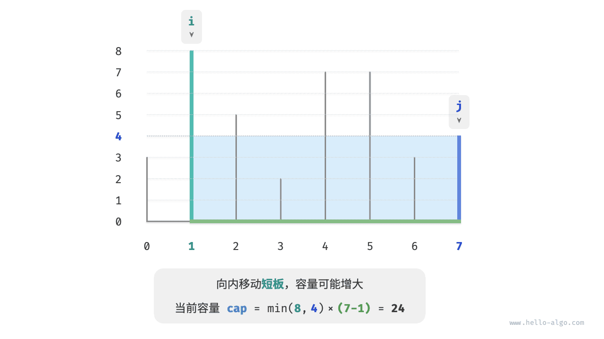
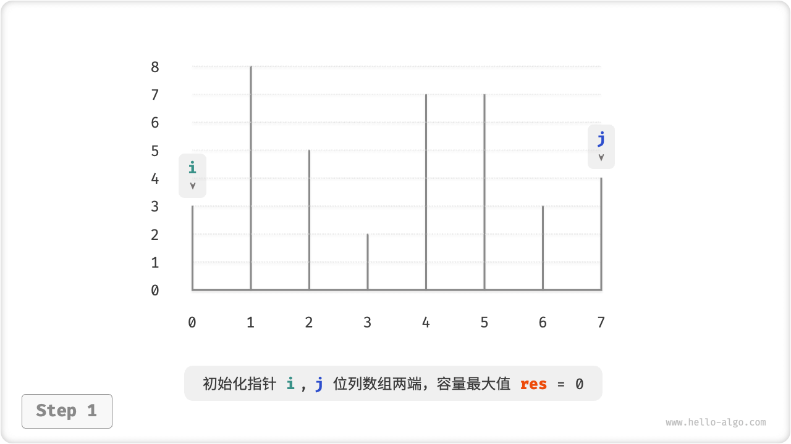
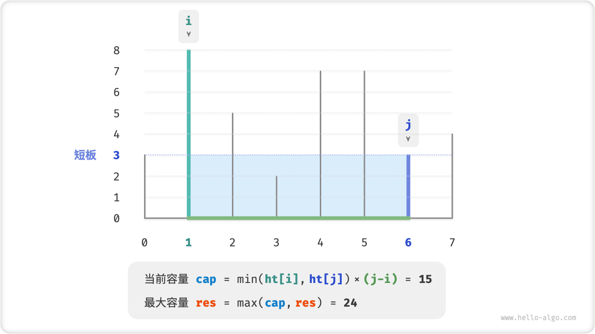
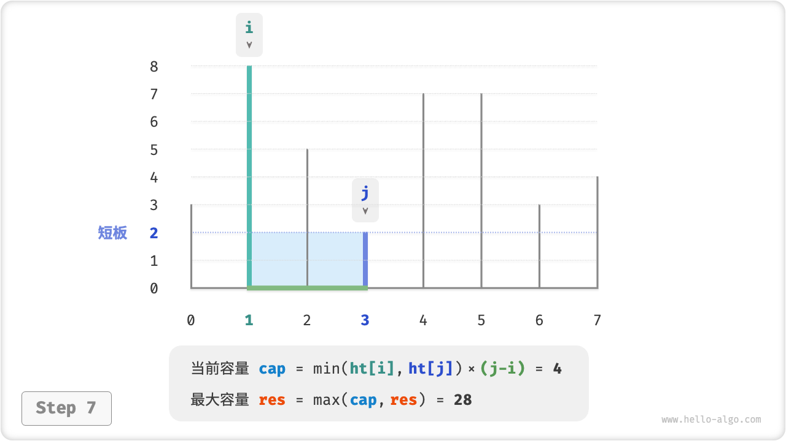

# 15.3. &nbsp; 最大容量问题

!!! question

    输入一个数组 $ht$ ，数组中的每个元素代表一个垂直隔板的高度。数组中的任意两个隔板，以及它们之间的空间可以组成一个容器。容器的容量等于高度和宽度的乘积（即面积），其中高度由较短的隔板决定，宽度是两个隔板的数组索引之差。
    
    请在数组中选择两个隔板，使得组成的容器的容量最大，返回最大容量。


<p align="center"> Fig. 最大容量问题的示例数据 </p>

容器由任意两个隔板围成，**因此本题的状态为两个隔板的索引，记为 $[i, j]$** 。

根据定义，容量等于高度乘以宽度，其中高度由短板决定，宽度是两隔板的索引之差。设容量为 $cap[i, j]$ ，可得计算公式：

$$
cap[i, j] = \min(ht[i], ht[j]) \times (j - i)
$$

设数组长度为 $n$ ，两个隔板的组合数量（即状态总数）为 $C_n^2 = \frac{n(n - 1)}{2}$ 个。最直接地，**我们可以穷举所有状态**，从而求得最大容量，时间复杂度为 $O(n^2)$ 。

### 贪心策略确定

当然，这道题还有更高效率的解法。如下图所示，现选取一个状态 $[i, j]$ ，其满足索引 $i < j$ 且高度 $ht[i] < ht[j]$ ，即 $i$ 为短板、 $j$ 为长板。


<p align="center"> Fig. 初始状态 </p>

我们发现，**如果将长板 $j$ 向短板 $i$ 靠近，则容量一定变小**。这是因为在移动长板 $j$ 后：

- 宽度 $j-i$ 肯定变小；
- 高度由短板决定，因此高度只可能不变（ $i$ 仍为短板）或变小（移动后的 $j$ 成为短板）；


<p align="center"> Fig. 向内移动长板后的状态 </p>

反向思考，**我们只有向内收缩短板 $i$ ，才有可能使容量变大**。因为虽然宽度一定变小，**但高度可能会变大**（移动后的短板 $i$ 变长了）。



<p align="center"> Fig. 向内移动长板后的状态 </p>

由此便可推出本题的贪心策略：

1. 初始状态下，指针 $i$ , $j$ 分列与数组两端。
2. 计算当前状态的容量 $cap[i, j]$ ，并更新最大容量。
3. 比较板 $i$ 和 板 $j$ 的高度，并将短板向内移动一格。
4. 循环执行第 `2.` , `3.` 步，直至 $i$ 和 $j$ 相遇时结束。

=== "<1>"
    

=== "<2>"
    

=== "<3>"
    

=== "<4>"
    

=== "<5>"
    

=== "<6>"
    

=== "<7>"
    

=== "<8>"
    

=== "<9>"
    

### 代码实现

如下代码所示，循环最多 $n$ 轮，**因此时间复杂度为 $O(n)$** 。变量 $i$ , $j$ , $res$ 使用常数大小额外空间，**因此空间复杂度为 $O(1)$** 。

=== "Java"

    ```java title="max_capacity.java"
    /* 最大容量：贪心 */
    int maxCapacity(int[] ht) {
        // 初始化 i, j 分列数组两端
        int i = 0, j = ht.length - 1;
        // 初始最大容量为 0
        int res = 0;
        // 循环贪心选择，直至两板相遇
        while (i < j) {
            // 更新最大容量
            int cap = Math.min(ht[i], ht[j]) * (j - i);
            res = Math.max(res, cap);
            // 向内移动短板
            if (ht[i] < ht[j]) {
                i++;
            } else {
                j--;
            }
        }
        return res;
    }
    ```

=== "C++"

    ```cpp title="max_capacity.cpp"
    /* 最大容量：贪心 */
    int maxCapacity(vector<int> &ht) {
        // 初始化 i, j 分列数组两端
        int i = 0, j = ht.size() - 1;
        // 初始最大容量为 0
        int res = 0;
        // 循环贪心选择，直至两板相遇
        while (i < j) {
            // 更新最大容量
            int cap = min(ht[i], ht[j]) * (j - i);
            res = max(res, cap);
            // 向内移动短板
            if (ht[i] < ht[j]) {
                i++;
            } else {
                j--;
            }
        }
        return res;
    }
    ```

=== "Python"

    ```python title="max_capacity.py"
    def max_capacity(ht: list[int]) -> int:
        """最大容量：贪心"""
        # 初始化 i, j 分列数组两端
        i, j = 0, len(ht) - 1
        # 初始最大容量为 0
        res = 0
        # 循环贪心选择，直至两板相遇
        while i < j:
            # 更新最大容量
            cap = min(ht[i], ht[j]) * (j - i)
            res = max(res, cap)
            # 向内移动短板
            if ht[i] < ht[j]:
                i += 1
            else:
                j -= 1
        return res
    ```

=== "Go"

    ```go title="max_capacity.go"
    /* 最大容量：贪心 */
    func maxCapacity(ht []int) int {
        // 初始化 i, j 分列数组两端
        i, j := 0, len(ht)-1
        // 初始最大容量为 0
        res := 0
        // 循环贪心选择，直至两板相遇
        for i < j {
            // 更新最大容量
            capacity := int(math.Min(float64(ht[i]), float64(ht[j]))) * (j - i)
            res = int(math.Max(float64(res), float64(capacity)))
            // 向内移动短板
            if ht[i] < ht[j] {
                i++
            } else {
                j--
            }
        }
        return res
    }
    ```

=== "JavaScript"

    ```javascript title="max_capacity.js"
    [class]{}-[func]{maxCapacity}
    ```

=== "TypeScript"

    ```typescript title="max_capacity.ts"
    [class]{}-[func]{maxCapacity}
    ```

=== "C"

    ```c title="max_capacity.c"
    [class]{}-[func]{maxCapacity}
    ```

=== "C#"

    ```csharp title="max_capacity.cs"
    /* 最大容量：贪心 */
    int maxCapacity(int[] ht) {
        // 初始化 i, j 分列数组两端
        int i = 0, j = ht.Length - 1;
        // 初始最大容量为 0
        int res = 0;
        // 循环贪心选择，直至两板相遇
        while (i < j) {
            // 更新最大容量
            int cap = Math.Min(ht[i], ht[j]) * (j - i);
            res = Math.Max(res, cap);
            // 向内移动短板
            if (ht[i] < ht[j]) {
                i++;
            } else {
                j--;
            }
        }
        return res;
    }
    ```

=== "Swift"

    ```swift title="max_capacity.swift"
    [class]{}-[func]{maxCapacity}
    ```

=== "Zig"

    ```zig title="max_capacity.zig"
    [class]{}-[func]{maxCapacity}
    ```

=== "Dart"

    ```dart title="max_capacity.dart"
    [class]{}-[func]{maxCapacity}
    ```

### 正确性证明

之所以贪心比穷举更快，是因为每轮的贪心选择都会“跳过”一些状态。

比如在状态 $cap[i, j]$ 下，$i$ 为短板、$j$ 为长板。若贪心地将短板 $i$ 向内移动一格，会导致以下状态被“跳过”，**意味着之后无法验证这些状态的容量大小**。

$$
cap[i, i+1], cap[i, i+2], \cdots, cap[i, j-2], cap[i, j-1]
$$


<p align="center"> Fig. 移动短板导致被跳过的状态 </p>

观察发现，**这些被跳过的状态实际上就是将长板 $j$ 向内移动的所有状态**。而在第二步中，我们已经证明内移长板一定会导致容量变小，也就是说这些被跳过的状态的容量一定更小。

也就是说，被跳过的状态都不可能是最优解，**跳过它们不会导致错过最优解**。

以上的分析说明，**移动短板的操作是“安全”的**，贪心策略是有效的。
