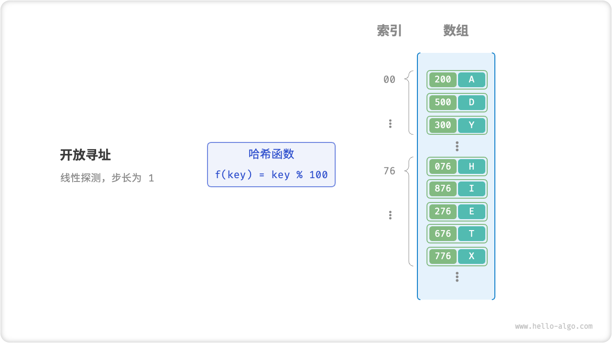

# 6.2. &nbsp; 哈希冲突

在理想情况下，哈希函数应为每个输入生成唯一的输出，实现 key 和 value 的一一对应。然而实际上，向哈希函数输入不同的 key 却产生相同输出的情况是存在的，这种现象被称为「哈希冲突 Hash Collision」。哈希冲突可能导致查询结果错误，从而严重影响哈希表的可用性。

那么，为何会出现哈希冲突呢？从本质上看，由于哈希函数的输入空间通常远大于输出空间，因此多个输入产生相同输出的情况是不可避免的。例如，若输入空间为全体整数，而输出空间为固定大小的数组，则必然有多个整数映射至同一数组索引。

为了减轻哈希冲突，一方面，**可以通过扩大哈希表容量来降低冲突概率**。极端情况下，当输入空间和输出空间大小相等时，哈希表等同于数组，每个 key 都对应唯一的数组索引，可谓“大力出奇迹”。

另一方面，**可以考虑优化哈希表的表示以缓解哈希冲突**，常用方法包括「链式地址 Separate Chaining」和「开放寻址 Open Addressing」。

## 6.2.1. &nbsp; 哈希表扩容

哈希函数的最后一步通常是对桶数量 $n$ 取余，作用是将哈希值映射到桶索引范围，从而将 key 放入对应的桶中。当哈希表容量越大（即 $n$ 越大）时，多个 key 被分配到同一个桶中的概率就越低，冲突就越少。

因此，**当哈希表内的冲突总体较为严重时，编程语言通常通过扩容哈希表来缓解冲突**。类似于数组扩容，哈希表扩容需将所有键值对从原哈希表迁移至新哈希表，开销较大。

编程语言通常使用「负载因子 Load Factor」来衡量哈希冲突的严重程度，**定义为哈希表中元素数量除以桶数量**，常作为哈希表扩容的触发条件。在 Java 中，当负载因子 $> 0.75$ 时，系统会将 HashMap 容量扩展为原先的 $2$ 倍。

## 6.2.2. &nbsp; 链式地址

在原始哈希表中，每个桶仅能存储一个键值对。**链式地址将单个元素转换为链表，将键值对作为链表节点，将所有发生冲突的键值对都存储在同一链表中**。

 Fig. 链式地址 

链式地址下，哈希表的操作方法包括：

- **查询元素**：输入 key ，经过哈希函数得到数组索引，即可访问链表头结点，然后遍历链表并对比 key 以查找目标键值对。
- **添加元素**：先通过哈希函数访问链表头结点，然后将结点（即键值对）添加到链表中。
- **删除元素**：根据哈希函数的结果访问链表头部，接着遍历链表以查找目标结点，并将其删除。

尽管链式地址法解决了哈希冲突问题，但仍存在一些局限性，包括：

- **占用空间增大**，由于链表或二叉树包含结点指针，相比数组更加耗费内存空间；
- **查询效率降低**，因为需要线性遍历链表来查找对应元素；

为了提高操作效率，**可以将链表转换为「AVL 树」或「红黑树」**，将查询操作的时间复杂度优化至 $O(\log n)$ 。

## 6.2.3. &nbsp; 开放寻址

「开放寻址」方法不引入额外的数据结构，而是通过“多次探测”来解决哈希冲突，**探测方主要包括线性探测、平方探测、多次哈希**。

### 线性探测

「线性探测」采用固定步长的线性查找来解决哈希冲突。

**插入元素**：若出现哈希冲突，则从冲突位置向后线性遍历（步长通常为 $1$ ），直至找到空位，将元素插入其中。

**查找元素**：在出现哈希冲突时，使用相同步长进行线性查找，可能遇到以下两种情况。

1. 找到对应元素，返回 value 即可；
2. 若遇到空位，说明目标键值对不在哈希表中；

 Fig. 线性探测 

线性探测存在以下缺陷：

- **不能直接删除元素**。删除元素会在数组内产生一个空位，查找其他元素时，该空位可能导致程序误判元素不存在（即上述第 `2.` 种情况）。因此，需要借助一个标志位来标记已删除元素。
- **容易产生聚集**。数组内连续被占用位置越长，这些连续位置发生哈希冲突的可能性越大，进一步促使这一位置的“聚堆生长”，最终导致增删查改操作效率降低。

### 多次哈希

顾名思义，「多次哈希」方法是使用多个哈希函数 $f_1(x)$ , $f_2(x)$ , $f_3(x)$ , $\cdots$ 进行探测。

**插入元素**：若哈希函数 $f_1(x)$ 出现冲突，则尝试 $f_2(x)$ ，以此类推，直到找到空位后插入元素。

**查找元素**：在相同的哈希函数顺序下进行查找，存在以下两种情况：

1. 如果找到目标元素，则返回之；
2. 若遇到空位或已尝试所有哈希函数，则说明哈希表中不存在该元素；

与线性探测相比，多次哈希方法不易产生聚集，但多个哈希函数会增加额外的计算量。

!!! note "哈希表设计方案"

    Java 采用「链式地址」。自 JDK 1.8 以来，当 HashMap 内数组长度大于 64 且链表长度大于 8 时，链表会被转换为「红黑树」以提升查找性能。

    Python 采用「开放寻址」。字典 dict 使用伪随机数进行探测。

    Golang 采用「链式地址」。Go 规定每个桶最多存储 8 个键值对，超出容量则连接一个溢出桶；当溢出桶过多时，会执行一次特殊的等量扩容操作，以确保性能。
