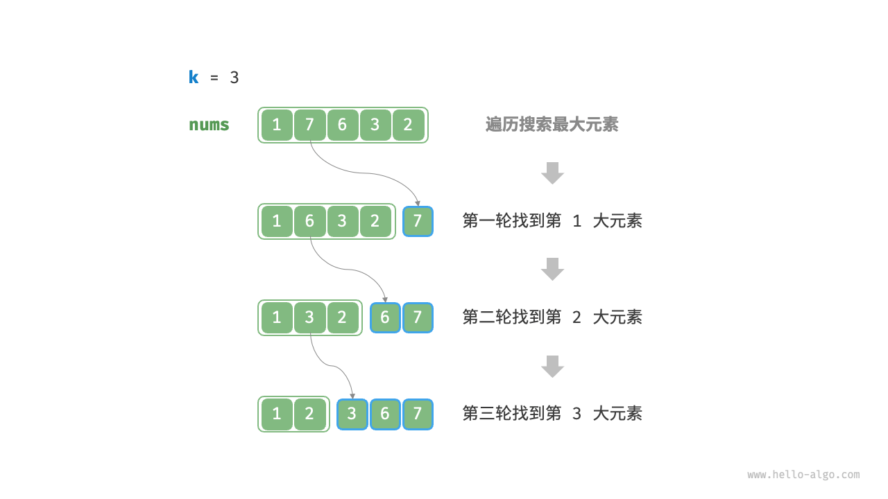
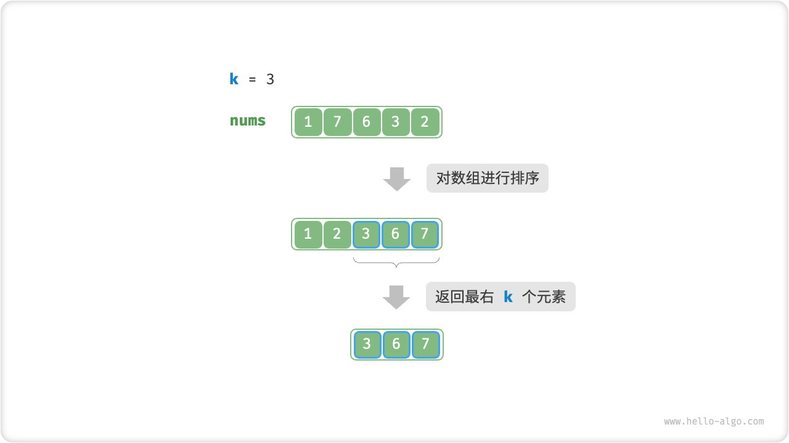
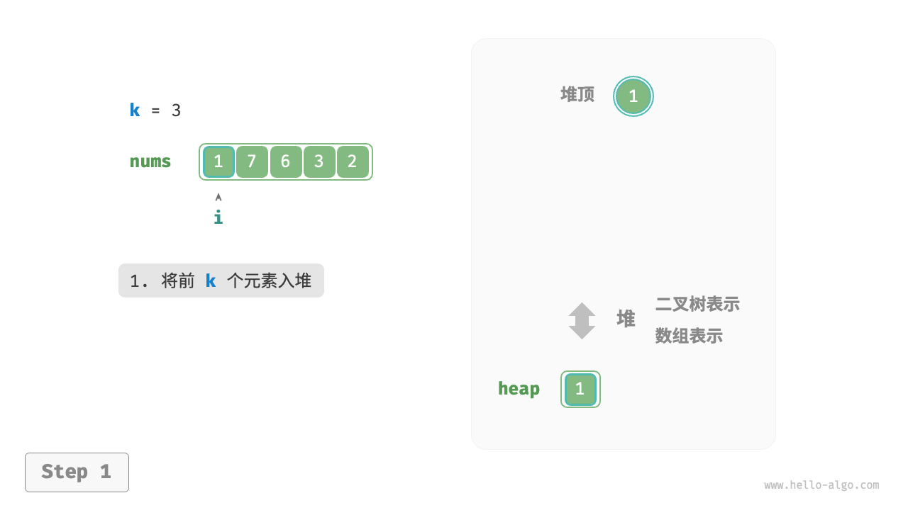
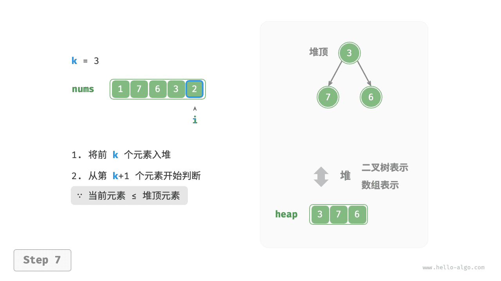
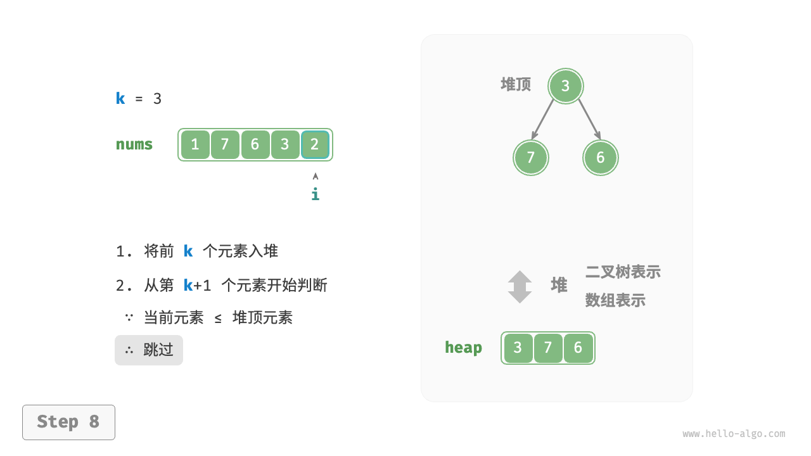

# 8.3 &nbsp; Top-K 问题

!!! question

    给定一个长度为 $n$ 无序数组 `nums` ，请返回数组中前 $k$ 大的元素。

对于该问题，我们先介绍两种思路比较直接的解法，再介绍效率更高的堆解法。

## 8.3.1 &nbsp; 方法一：遍历选择

我们可以进行图 8-6 所示的 $k$ 轮遍历，分别在每轮中提取第 $1$、$2$、$\dots$、$k$ 大的元素，时间复杂度为 $O(nk)$ 。

此方法只适用于 $k \ll n$ 的情况，因为当 $k$ 与 $n$ 比较接近时，其时间复杂度趋向于 $O(n^2)$ ，非常耗时。



<p align="center"> 图 8-6 &nbsp; 遍历寻找最大的 k 个元素 </p>

!!! tip

    当 $k = n$ 时，我们可以得到完整的有序序列，此时等价于“选择排序”算法。

## 8.3.2 &nbsp; 方法二：排序

如图 8-7 所示，我们可以先对数组 `nums` 进行排序，再返回最右边的 $k$ 个元素，时间复杂度为 $O(n \log n)$ 。

显然，该方法“超额”完成任务了，因为我们只需要找出最大的 $k$ 个元素即可，而不需要排序其他元素。



<p align="center"> 图 8-7 &nbsp; 排序寻找最大的 k 个元素 </p>

## 8.3.3 &nbsp; 方法三：堆

我们可以基于堆更加高效地解决 Top-K 问题，流程如图 8-8 所示。

1. 初始化一个小顶堆，其堆顶元素最小。
2. 先将数组的前 $k$ 个元素依次入堆。
3. 从第 $k + 1$ 个元素开始，若当前元素大于堆顶元素，则将堆顶元素出堆，并将当前元素入堆。
4. 遍历完成后，堆中保存的就是最大的 $k$ 个元素。

=== "<1>"
    

=== "<2>"
    

=== "<3>"
    

=== "<4>"
    

=== "<5>"
    

=== "<6>"
    

=== "<7>"
    

=== "<8>"
    

=== "<9>"
    

<p align="center"> 图 8-8 &nbsp; 基于堆寻找最大的 k 个元素 </p>

总共执行了 $n$ 轮入堆和出堆，堆的最大长度为 $k$ ，因此时间复杂度为 $O(n \log k)$ 。该方法的效率很高，当 $k$ 较小时，时间复杂度趋向 $O(n)$ ；当 $k$ 较大时，时间复杂度不会超过 $O(n \log n)$ 。

另外，该方法适用于动态数据流的使用场景。在不断加入数据时，我们可以持续维护堆内的元素，从而实现最大 $k$ 个元素的动态更新。

=== "Java"

    ```java title="top_k.java"
    /* 基于堆查找数组中最大的 k 个元素 */
    Queue<Integer> topKHeap(int[] nums, int k) {
        Queue<Integer> heap = new PriorityQueue<Integer>();
        // 将数组的前 k 个元素入堆
        for (int i = 0; i < k; i++) {
            heap.offer(nums[i]);
        }
        // 从第 k+1 个元素开始，保持堆的长度为 k
        for (int i = k; i < nums.length; i++) {
            // 若当前元素大于堆顶元素，则将堆顶元素出堆、当前元素入堆
            if (nums[i] > heap.peek()) {
                heap.poll();
                heap.offer(nums[i]);
            }
        }
        return heap;
    }
    ```

=== "C++"

    ```cpp title="top_k.cpp"
    /* 基于堆查找数组中最大的 k 个元素 */
    priority_queue<int, vector<int>, greater<int>> topKHeap(vector<int> &nums, int k) {
        priority_queue<int, vector<int>, greater<int>> heap;
        // 将数组的前 k 个元素入堆
        for (int i = 0; i < k; i++) {
            heap.push(nums[i]);
        }
        // 从第 k+1 个元素开始，保持堆的长度为 k
        for (int i = k; i < nums.size(); i++) {
            // 若当前元素大于堆顶元素，则将堆顶元素出堆、当前元素入堆
            if (nums[i] > heap.top()) {
                heap.pop();
                heap.push(nums[i]);
            }
        }
        return heap;
    }
    ```

=== "Python"

    ```python title="top_k.py"
    def top_k_heap(nums: list[int], k: int) -> list[int]:
        """基于堆查找数组中最大的 k 个元素"""
        heap = []
        # 将数组的前 k 个元素入堆
        for i in range(k):
            heapq.heappush(heap, nums[i])
        # 从第 k+1 个元素开始，保持堆的长度为 k
        for i in range(k, len(nums)):
            # 若当前元素大于堆顶元素，则将堆顶元素出堆、当前元素入堆
            if nums[i] > heap[0]:
                heapq.heappop(heap)
                heapq.heappush(heap, nums[i])
        return heap
    ```

=== "Go"

    ```go title="top_k.go"
    /* 基于堆查找数组中最大的 k 个元素 */
    func topKHeap(nums []int, k int) *minHeap {
        h := &minHeap{}
        heap.Init(h)
        // 将数组的前 k 个元素入堆
        for i := 0; i < k; i++ {
            heap.Push(h, nums[i])
        }
        // 从第 k+1 个元素开始，保持堆的长度为 k
        for i := k; i < len(nums); i++ {
            // 若当前元素大于堆顶元素，则将堆顶元素出堆、当前元素入堆
            if nums[i] > h.Top().(int) {
                heap.Pop(h)
                heap.Push(h, nums[i])
            }
        }
        return h
    }
    ```

=== "JS"

    ```javascript title="top_k.js"
    [class]{}-[func]{topKHeap}
    ```

=== "TS"

    ```typescript title="top_k.ts"
    [class]{}-[func]{topKHeap}
    ```

=== "C"

    ```c title="top_k.c"
    [class]{}-[func]{topKHeap}
    ```

=== "C#"

    ```csharp title="top_k.cs"
    /* 基于堆查找数组中最大的 k 个元素 */
    PriorityQueue<int, int> topKHeap(int[] nums, int k) {
        PriorityQueue<int, int> heap = new PriorityQueue<int, int>();
        // 将数组的前 k 个元素入堆
        for (int i = 0; i < k; i++) {
            heap.Enqueue(nums[i], nums[i]);
        }
        // 从第 k+1 个元素开始，保持堆的长度为 k
        for (int i = k; i < nums.Length; i++) {
            // 若当前元素大于堆顶元素，则将堆顶元素出堆、当前元素入堆
            if (nums[i] > heap.Peek()) {
                heap.Dequeue();
                heap.Enqueue(nums[i], nums[i]);
            }
        }
        return heap;
    }
    ```

=== "Swift"

    ```swift title="top_k.swift"
    /* 基于堆查找数组中最大的 k 个元素 */
    func topKHeap(nums: [Int], k: Int) -> [Int] {
        // 将数组的前 k 个元素入堆
        var heap = Array(nums.prefix(k))
        // 从第 k+1 个元素开始，保持堆的长度为 k
        for i in stride(from: k, to: nums.count, by: 1) {
            // 若当前元素大于堆顶元素，则将堆顶元素出堆、当前元素入堆
            if nums[i] > heap.first! {
                heap.removeFirst()
                heap.insert(nums[i], at: 0)
            }
        }
        return heap
    }
    ```

=== "Zig"

    ```zig title="top_k.zig"
    [class]{}-[func]{topKHeap}
    ```

=== "Dart"

    ```dart title="top_k.dart"
    /* 基于堆查找数组中最大的 k 个元素 */
    MinHeap topKHeap(List<int> nums, int k) {
      // 将数组的前 k 个元素入堆
      MinHeap heap = MinHeap(nums.sublist(0, k));
      // 从第 k+1 个元素开始，保持堆的长度为 k
      for (int i = k; i < nums.length; i++) {
        // 若当前元素大于堆顶元素，则将堆顶元素出堆、当前元素入堆
        if (nums[i] > heap.peek()) {
          heap.pop();
          heap.push(nums[i]);
        }
      }
      return heap;
    }
    ```

=== "Rust"

    ```rust title="top_k.rs"
    /* 基于堆查找数组中最大的 k 个元素 */
    fn top_k_heap(nums: Vec<i32>, k: usize) -> BinaryHeap<Reverse<i32>> {
        // Rust 的 BinaryHeap 是大顶堆，使用 Reverse 将元素大小反转
        let mut heap = BinaryHeap::<Reverse<i32>>::new();
        // 将数组的前 k 个元素入堆
        for &num in nums.iter().take(k) {
            heap.push(Reverse(num));
        }
        // 从第 k+1 个元素开始，保持堆的长度为 k
        for &num in nums.iter().skip(k) {
            // 若当前元素大于堆顶元素，则将堆顶元素出堆、当前元素入堆
            if num > heap.peek().unwrap().0 {
                heap.pop();
                heap.push(Reverse(num));
            }
        }
        heap
    }
    ```
