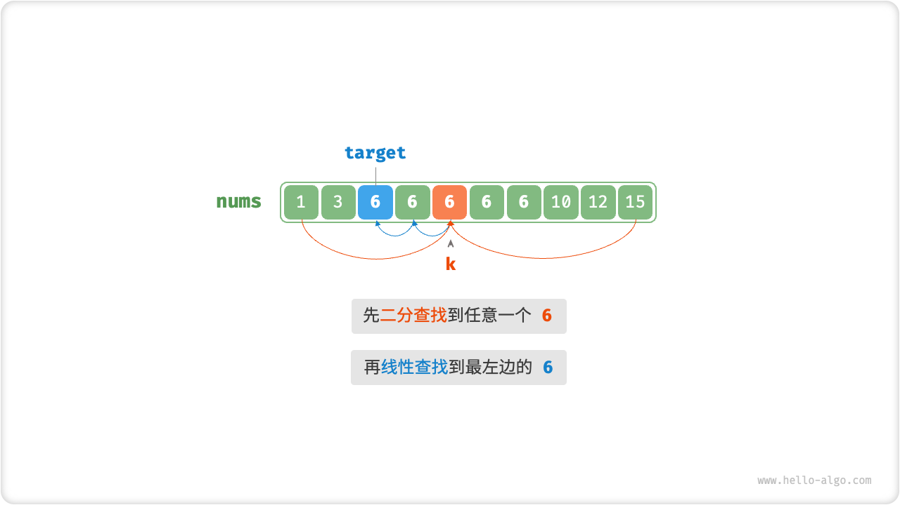
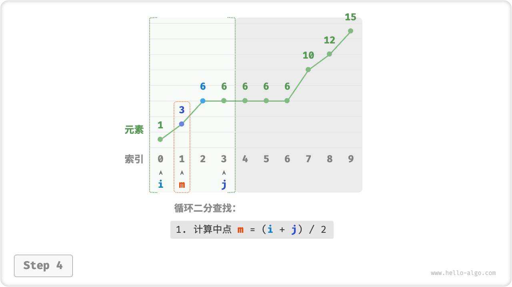

# 10.2. &nbsp; 二分查找边界

在上一节中，题目规定数组中所有元素都是唯一的。如果目标元素在数组中多次出现，上节介绍的方法只能保证返回其中一个目标元素的索引，**而无法确定该索引的左边和右边还有多少目标元素**。

!!! question

    给定一个长度为 $n$ 的有序数组 `nums` ，数组可能包含重复元素。请查找并返回元素 `target` 在数组中首次出现的索引。若数组中不包含该元素，则返回 $-1$ 。

## 10.2.1. &nbsp; 简单方法

为了查找数组中最左边的 `target` ，我们可以分为两步：

1. 进行二分查找，定位到任意一个 `target` 的索引，记为 $k$ ；
2. 以索引 $k$ 为起始点，向左进行线性遍历，找到最左边的 `target` 返回即可。



<p align="center"> Fig. 线性查找最左边的元素 </p>

这个方法虽然有效，但由于包含线性查找，**其时间复杂度可能会劣化至 $O(n)$** 。

## 10.2.2. &nbsp; 二分方法

实际上，我们可以仅通过二分查找解决以上问题。整体算法流程不变，先计算中点索引 $m$ ，再判断 `target` 和 `nums[m]` 大小关系：

- 当 `nums[m] < target` 或 `nums[m] > target` 时，说明还没有找到 `target` ，因此采取与上节代码相同的缩小区间操作，**从而使指针 $i$ 和 $j$ 向 `target` 靠近**。
- 当 `nums[m] == target` 时，说明“小于 `target` 的元素”在区间 $[i, m - 1]$ 中，因此采用 $j = m - 1$ 来缩小区间，**从而使指针 $j$ 向小于 `target` 的元素靠近**。

二分查找完成后，**$i$ 指向最左边的 `target` ，$j$ 指向首个小于 `target` 的元素**，因此返回索引 $i$ 即可。

=== "<1>"
    

=== "<2>"
    

=== "<3>"
    

=== "<4>"
    

=== "<5>"
    

=== "<6>"
    

=== "<7>"
    

=== "<8>"
    

注意，数组可能不包含目标元素 `target` 。因此在函数返回前，我们需要先判断 `nums[i]` 与 `target` 是否相等，以及索引 $i$ 是否越界。

=== "Java"

    ```java title="binary_search_edge.java"
    /* 二分查找最左一个元素 */
    int binarySearchLeftEdge(int[] nums, int target) {
        int i = 0, j = nums.length - 1; // 初始化双闭区间 [0, n-1]
        while (i <= j) {
            int m = i + (j - i) / 2; // 计算中点索引 m
            if (nums[m] < target)
                i = m + 1; // target 在区间 [m+1, j] 中
            else if (nums[m] > target)
                j = m - 1; // target 在区间 [i, m-1] 中
            else
                j = m - 1; // 首个小于 target 的元素在区间 [i, m-1] 中
        }
        if (i == nums.length || nums[i] != target)
            return -1; // 未找到目标元素，返回 -1
        return i;
    }
    ```

=== "C++"

    ```cpp title="binary_search_edge.cpp"
    /* 二分查找最左一个元素 */
    int binarySearchLeftEdge(vector<int> &nums, int target) {
        int i = 0, j = nums.size() - 1; // 初始化双闭区间 [0, n-1]
        while (i <= j) {
            int m = i + (j - i) / 2; // 计算中点索引 m
            if (nums[m] < target)
                i = m + 1; // target 在区间 [m+1, j] 中
            else if (nums[m] > target)
                j = m - 1; // target 在区间 [i, m-1] 中
            else
                j = m - 1; // 首个小于 target 的元素在区间 [i, m-1] 中
        }
        if (i == nums.size() || nums[i] != target)
            return -1; // 未找到目标元素，返回 -1
        return i;
    }
    ```

=== "Python"

    ```python title="binary_search_edge.py"
    def binary_search_left_edge(nums: list[int], target: int) -> int:
        """二分查找最左一个元素"""
        i, j = 0, len(nums) - 1  # 初始化双闭区间 [0, n-1]
        while i <= j:
            m = (i + j) // 2  # 计算中点索引 m
            if nums[m] < target:
                i = m + 1  # target 在区间 [m+1, j] 中
            elif nums[m] > target:
                j = m - 1  # target 在区间 [i, m-1] 中
            else:
                j = m - 1  # 首个小于 target 的元素在区间 [i, m-1] 中
        if i == len(nums) or nums[i] != target:
            return -1  # 未找到目标元素，返回 -1
        return i
    ```

=== "Go"

    ```go title="binary_search_edge.go"
    /* 二分查找最左一个元素 */
    func binarySearchLeftEdge(nums []int, target int) int {
        // 初始化双闭区间 [0, n-1]
        i, j := 0, len(nums)-1
        for i <= j {
            // 计算中点索引 m
            m := i + (j-i)/2
            if nums[m] < target {
                // target 在区间 [m+1, j] 中
                i = m + 1
            } else if nums[m] > target {
                // target 在区间 [i, m-1] 中
                j = m - 1
            } else {
                // 首个小于 target 的元素在区间 [i, m-1] 中
                j = m - 1
            }
        }
        if i == len(nums) || nums[i] != target {
            // 未找到目标元素，返回 -1
            return -1
        }
        return i
    }
    ```

=== "JavaScript"

    ```javascript title="binary_search_edge.js"
    [class]{}-[func]{binarySearchLeftEdge}
    ```

=== "TypeScript"

    ```typescript title="binary_search_edge.ts"
    [class]{}-[func]{binarySearchLeftEdge}
    ```

=== "C"

    ```c title="binary_search_edge.c"
    [class]{}-[func]{binarySearchLeftEdge}
    ```

=== "C#"

    ```csharp title="binary_search_edge.cs"
    /* 二分查找最左一个元素 */
    int binarySearchLeftEdge(int[] nums, int target) {
        int i = 0, j = nums.Length - 1; // 初始化双闭区间 [0, n-1]
        while (i <= j) {
            int m = i + (j - i) / 2; // 计算中点索引 m
            if (nums[m] < target)
                i = m + 1; // target 在区间 [m+1, j] 中
            else if (nums[m] > target)
                j = m - 1; // target 在区间 [i, m-1] 中
            else
                j = m - 1; // 首个小于 target 的元素在区间 [i, m-1] 中
        }
        if (i == nums.Length || nums[i] != target)
            return -1; // 未找到目标元素，返回 -1
        return i;
    }
    ```

=== "Swift"

    ```swift title="binary_search_edge.swift"
    /* 二分查找最左一个元素 */
    func binarySearchLeftEdge(nums: [Int], target: Int) -> Int {
        // 初始化双闭区间 [0, n-1]
        var i = 0
        var j = nums.count - 1
        while i <= j {
            let m = i + (j - 1) / 2 // 计算中点索引 m
            if nums[m] < target {
                i = m + 1 // target 在区间 [m+1, j] 中
            } else if nums[m] > target {
                j = m - 1 // target 在区间 [i, m-1] 中
            } else {
                j = m - 1 // 首个小于 target 的元素在区间 [i, m-1] 中
            }
        }
        if i == nums.count || nums[i] != target {
            return -1 // 未找到目标元素，返回 -1
        }
        return i
    }
    ```

=== "Zig"

    ```zig title="binary_search_edge.zig"
    [class]{}-[func]{binarySearchLeftEdge}
    ```

## 10.2.3. &nbsp; 查找右边界

类似地，我们也可以二分查找最右边的 `target` 。当 `nums[m] == target` 时，说明大于 `target` 的元素在区间 $[m + 1, j]$ 中，因此执行 `i = m + 1` ，**使得指针 $i$ 向大于 `target` 的元素靠近**。

完成二分后，**$i$ 指向首个大于 `target` 的元素，$j$ 指向最右边的 `target`** ，因此返回索引 $j$ 即可。

=== "Java"

    ```java title="binary_search_edge.java"
    /* 二分查找最右一个元素 */
    int binarySearchRightEdge(int[] nums, int target) {
        int i = 0, j = nums.length - 1; // 初始化双闭区间 [0, n-1]
        while (i <= j) {
            int m = i + (j - i) / 2; // 计算中点索引 m
            if (nums[m] < target)
                i = m + 1; // target 在区间 [m+1, j] 中
            else if (nums[m] > target)
                j = m - 1; // target 在区间 [i, m-1] 中
            else
                i = m + 1; // 首个大于 target 的元素在区间 [m+1, j] 中
        }
        if (j < 0 || nums[j] != target)
            return -1; // 未找到目标元素，返回 -1
        return j;
    }
    ```

=== "C++"

    ```cpp title="binary_search_edge.cpp"
    /* 二分查找最右一个元素 */
    int binarySearchRightEdge(vector<int> &nums, int target) {
        int i = 0, j = nums.size() - 1; // 初始化双闭区间 [0, n-1]
        while (i <= j) {
            int m = i + (j - i) / 2; // 计算中点索引 m
            if (nums[m] < target)
                i = m + 1; // target 在区间 [m+1, j] 中
            else if (nums[m] > target)
                j = m - 1; // target 在区间 [i, m-1] 中
            else
                i = m + 1; // 首个大于 target 的元素在区间 [m+1, j] 中
        }
        if (j < 0 || nums[j] != target)
            return -1; // 未找到目标元素，返回 -1
        return j;
    }
    ```

=== "Python"

    ```python title="binary_search_edge.py"
    def binary_search_right_edge(nums: list[int], target: int) -> int:
        """二分查找最右一个元素"""
        i, j = 0, len(nums) - 1  # 初始化双闭区间 [0, n-1]
        while i <= j:
            m = (i + j) // 2  # 计算中点索引 m
            if nums[m] < target:
                i = m + 1  # target 在区间 [m+1, j] 中
            elif nums[m] > target:
                j = m - 1  # target 在区间 [i, m-1] 中
            else:
                i = m + 1  # 首个大于 target 的元素在区间 [m+1, j] 中
        if j == len(nums) or nums[j] != target:
            return -1  # 未找到目标元素，返回 -1
        return j
    ```

=== "Go"

    ```go title="binary_search_edge.go"
    /* 二分查找最右一个元素 */
    func binarySearchRightEdge(nums []int, target int) int {
        // 初始化双闭区间 [0, n-1]
        i, j := 0, len(nums)-1
        for i <= j {
            // 计算中点索引 m
            m := i + (j-i)/2
            if nums[m] < target {
                // target 在区间 [m+1, j] 中
                i = m + 1
            } else if nums[m] > target {
                // target 在区间 [i, m-1] 中
                j = m - 1
            } else {
                // 首个大于 target 的元素在区间 [m+1, j] 中
                i = m + 1
            }
        }
        if j < 0 || nums[j] != target {
            // 未找到目标元素，返回 -1
            return -1
        }
        return j
    }
    ```

=== "JavaScript"

    ```javascript title="binary_search_edge.js"
    [class]{}-[func]{binarySearchRightEdge}
    ```

=== "TypeScript"

    ```typescript title="binary_search_edge.ts"
    [class]{}-[func]{binarySearchRightEdge}
    ```

=== "C"

    ```c title="binary_search_edge.c"
    [class]{}-[func]{binarySearchRightEdge}
    ```

=== "C#"

    ```csharp title="binary_search_edge.cs"
    /* 二分查找最右一个元素 */
    int binarySearchRightEdge(int[] nums, int target) {
        int i = 0, j = nums.Length - 1; // 初始化双闭区间 [0, n-1]
        while (i <= j) {
            int m = i + (j - i) / 2; // 计算中点索引 m
            if (nums[m] < target)
                i = m + 1; // target 在区间 [m+1, j] 中
            else if (nums[m] > target)
                j = m - 1; // target 在区间 [i, m-1] 中
            else
                i = m + 1; // 首个大于 target 的元素在区间 [m+1, j] 中
        }
        if (j < 0 || nums[j] != target)
            return -1; // 未找到目标元素，返回 -1
        return j;
    }
    ```

=== "Swift"

    ```swift title="binary_search_edge.swift"
    /* 二分查找最右一个元素 */
    func binarySearchRightEdge(nums: [Int], target: Int) -> Int {
        // 初始化双闭区间 [0, n-1]
        var i = 0
        var j = nums.count - 1
        while i <= j {
            let m = i + (j - i) / 2 // 计算中点索引 m
            if nums[m] < target {
                i = m + 1 // target 在区间 [m+1, j] 中
            } else if nums[m] > target {
                j = m - 1 // target 在区间 [i, m-1] 中
            } else {
                i = m + 1 // 首个大于 target 的元素在区间 [m+1, j] 中
            }
        }
        if j < 0 || nums[j] != target {
            return -1 // 未找到目标元素，返回 -1
        }
        return j
    }
    ```

=== "Zig"

    ```zig title="binary_search_edge.zig"
    [class]{}-[func]{binarySearchRightEdge}
    ```

观察下图，搜索最右边元素时指针 $j$ 的作用与搜索最左边元素时指针 $i$ 的作用一致，反之亦然。也就是说，**搜索最左边元素和最右边元素的实现是镜像对称的**。


<p align="center"> Fig. 查找最左边和最右边元素的对称性 </p>

!!! tip

    以上代码采取的都是“双闭区间”写法。有兴趣的读者可以自行实现“左闭右开”写法。
