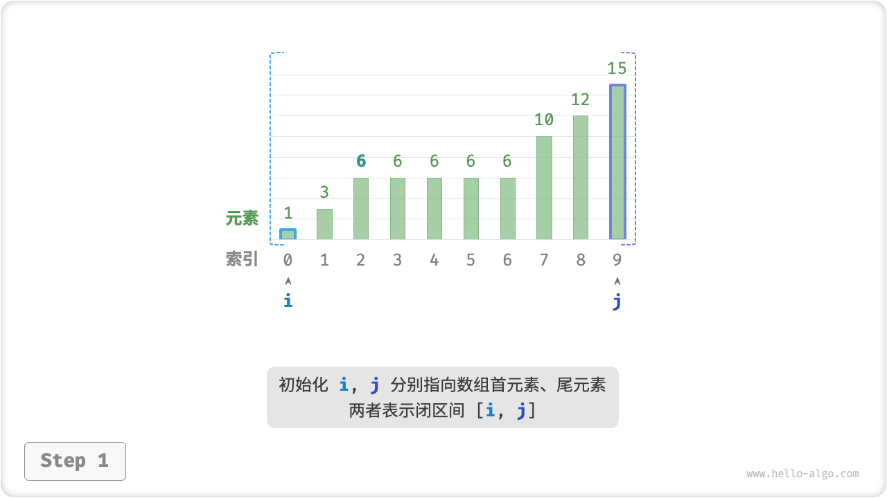
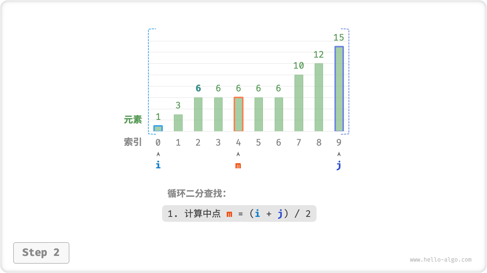
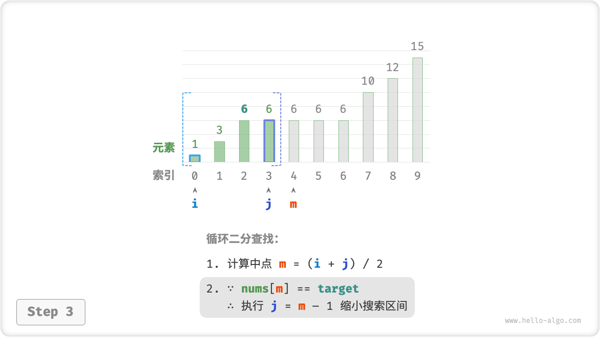
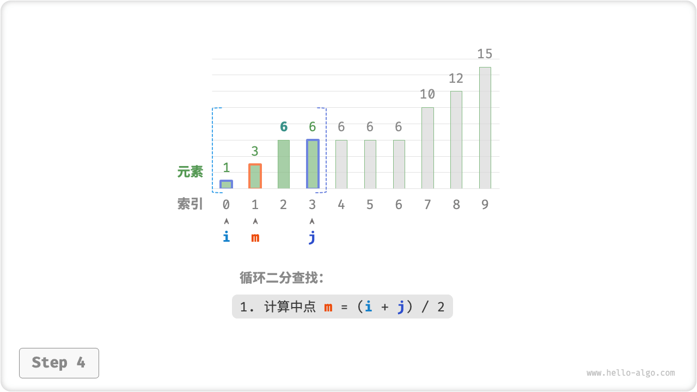
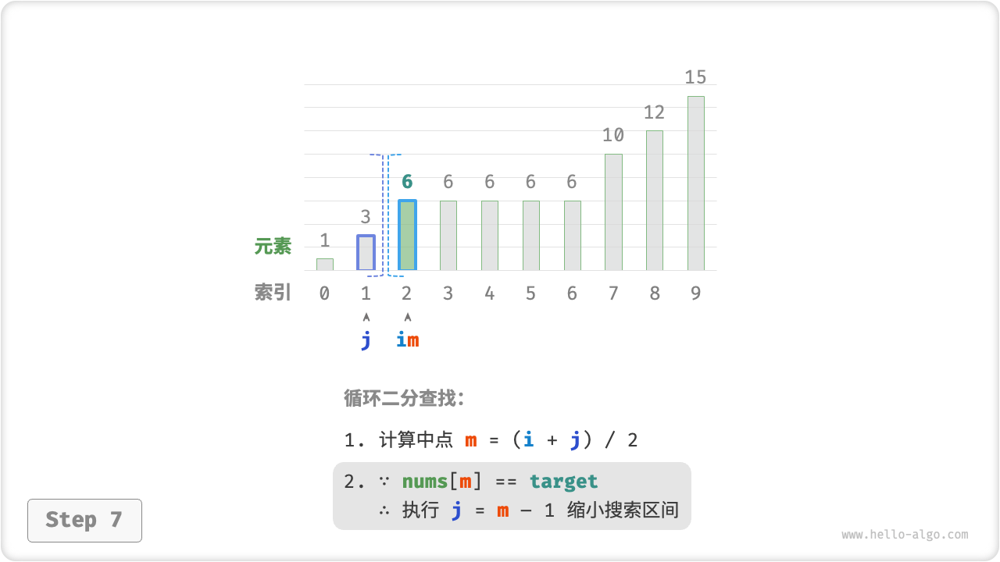
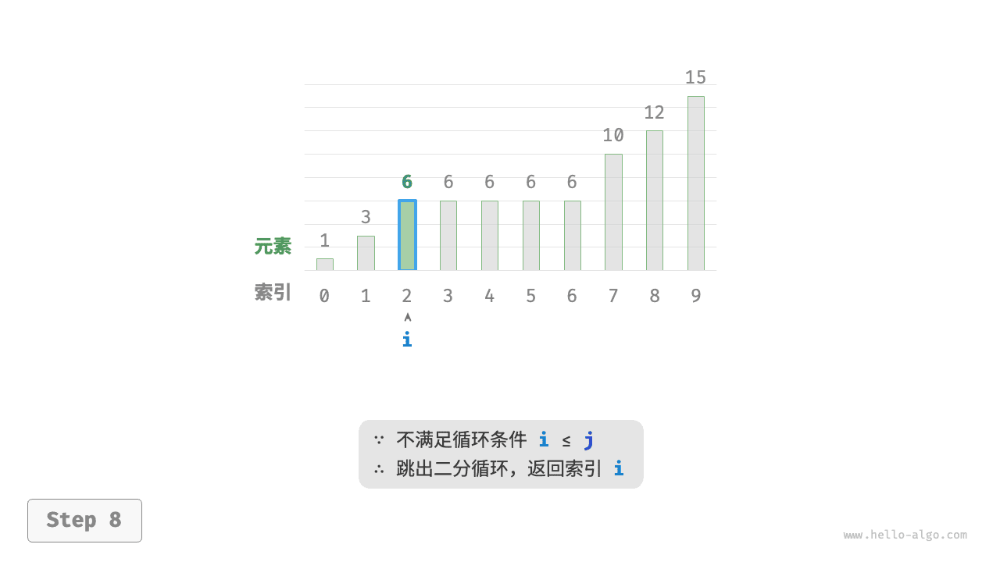

# 10.2 &nbsp; 二分查找插入点

二分查找不仅可用于搜索目标元素，还具有许多变种问题，比如搜索目标元素的插入位置。

## 10.2.1 &nbsp; 无重复元素的情况

!!! question

    给定一个长度为 $n$ 的有序数组 `nums` 和一个元素 `target` ，数组不存在重复元素。现将 `target` 插入到数组 `nums` 中，并保持其有序性。若数组中已存在元素 `target` ，则插入到其左方。请返回插入后 `target` 在数组中的索引。


<p align="center"> 图 10-4 &nbsp; 二分查找插入点示例数据 </p>

如果想要复用上节的二分查找代码，则需要回答以下两个问题。

**问题一**：当数组中包含 `target` 时，插入点的索引是否是该元素的索引？

题目要求将 `target` 插入到相等元素的左边，这意味着新插入的 `target` 替换了原来 `target` 的位置。也就是说，**当数组包含 `target` 时，插入点的索引就是该 `target` 的索引**。

**问题二**：当数组中不存在 `target` 时，插入点是哪个元素的索引？

进一步思考二分查找过程：当 `nums[m] < target` 时 $i$ 移动，这意味着指针 $i$ 在向大于等于 `target` 的元素靠近。同理，指针 $j$ 始终在向小于等于 `target` 的元素靠近。

因此二分结束时一定有：$i$ 指向首个大于 `target` 的元素，$j$ 指向首个小于 `target` 的元素。**易得当数组不包含 `target` 时，插入索引为 $i$** 。

=== "Java"

    ```java title="binary_search_insertion.java"
    /* 二分查找插入点（无重复元素） */
    int binarySearchInsertionSimple(int[] nums, int target) {
        int i = 0, j = nums.length - 1; // 初始化双闭区间 [0, n-1]
        while (i <= j) {
            int m = i + (j - i) / 2; // 计算中点索引 m
            if (nums[m] < target) {
                i = m + 1; // target 在区间 [m+1, j] 中
            } else if (nums[m] > target) {
                j = m - 1; // target 在区间 [i, m-1] 中
            } else {
                return m; // 找到 target ，返回插入点 m
            }
        }
        // 未找到 target ，返回插入点 i
        return i;
    }
    ```

=== "C++"

    ```cpp title="binary_search_insertion.cpp"
    /* 二分查找插入点（无重复元素） */
    int binarySearchInsertionSimple(vector<int> &nums, int target) {
        int i = 0, j = nums.size() - 1; // 初始化双闭区间 [0, n-1]
        while (i <= j) {
            int m = i + (j - i) / 2; // 计算中点索引 m
            if (nums[m] < target) {
                i = m + 1; // target 在区间 [m+1, j] 中
            } else if (nums[m] > target) {
                j = m - 1; // target 在区间 [i, m-1] 中
            } else {
                return m; // 找到 target ，返回插入点 m
            }
        }
        // 未找到 target ，返回插入点 i
        return i;
    }
    ```

=== "Python"

    ```python title="binary_search_insertion.py"
    def binary_search_insertion_simple(nums: list[int], target: int) -> int:
        """二分查找插入点（无重复元素）"""
        i, j = 0, len(nums) - 1  # 初始化双闭区间 [0, n-1]
        while i <= j:
            m = (i + j) // 2  # 计算中点索引 m
            if nums[m] < target:
                i = m + 1  # target 在区间 [m+1, j] 中
            elif nums[m] > target:
                j = m - 1  # target 在区间 [i, m-1] 中
            else:
                return m  # 找到 target ，返回插入点 m
        # 未找到 target ，返回插入点 i
        return i
    ```

=== "Go"

    ```go title="binary_search_insertion.go"
    /* 二分查找插入点（无重复元素） */
    func binarySearchInsertionSimple(nums []int, target int) int {
        // 初始化双闭区间 [0, n-1]
        i, j := 0, len(nums)-1
        for i <= j {
            // 计算中点索引 m
            m := i + (j-i)/2
            if nums[m] < target {
                // target 在区间 [m+1, j] 中
                i = m + 1
            } else if nums[m] > target {
                // target 在区间 [i, m-1] 中
                j = m - 1
            } else {
                // 找到 target ，返回插入点 m
                return m
            }
        }
        // 未找到 target ，返回插入点 i
        return i
    }
    ```

=== "JS"

    ```javascript title="binary_search_insertion.js"
    /* 二分查找插入点（无重复元素） */
    function binarySearchInsertionSimple(nums, target) {
        let i = 0,
            j = nums.length - 1; // 初始化双闭区间 [0, n-1]
        while (i <= j) {
            const m = Math.floor(i + (j - i) / 2); // 计算中点索引 m, 使用 Math.floor() 向下取整
            if (nums[m] < target) {
                i = m + 1; // target 在区间 [m+1, j] 中
            } else if (nums[m] > target) {
                j = m - 1; // target 在区间 [i, m-1] 中
            } else {
                return m; // 找到 target ，返回插入点 m
            }
        }
        // 未找到 target ，返回插入点 i
        return i;
    }
    ```

=== "TS"

    ```typescript title="binary_search_insertion.ts"
    /* 二分查找插入点（无重复元素） */
    function binarySearchInsertionSimple(
        nums: Array<number>,
        target: number
    ): number {
        let i = 0,
            j = nums.length - 1; // 初始化双闭区间 [0, n-1]
        while (i <= j) {
            const m = Math.floor(i + (j - i) / 2); // 计算中点索引 m, 使用 Math.floor() 向下取整
            if (nums[m] < target) {
                i = m + 1; // target 在区间 [m+1, j] 中
            } else if (nums[m] > target) {
                j = m - 1; // target 在区间 [i, m-1] 中
            } else {
                return m; // 找到 target ，返回插入点 m
            }
        }
        // 未找到 target ，返回插入点 i
        return i;
    }
    ```

=== "C"

    ```c title="binary_search_insertion.c"
    [class]{}-[func]{binarySearchInsertionSimple}
    ```

=== "C#"

    ```csharp title="binary_search_insertion.cs"
    /* 二分查找插入点（无重复元素） */
    int binarySearchInsertionSimple(int[] nums, int target) {
        int i = 0, j = nums.Length - 1; // 初始化双闭区间 [0, n-1]
        while (i <= j) {
            int m = i + (j - i) / 2; // 计算中点索引 m
            if (nums[m] < target) {
                i = m + 1; // target 在区间 [m+1, j] 中
            } else if (nums[m] > target) {
                j = m - 1; // target 在区间 [i, m-1] 中
            } else {
                return m; // 找到 target ，返回插入点 m
            }
        }
        // 未找到 target ，返回插入点 i
        return i;
    }
    ```

=== "Swift"

    ```swift title="binary_search_insertion.swift"
    /* 二分查找插入点（无重复元素） */
    func binarySearchInsertionSimple(nums: [Int], target: Int) -> Int {
        var i = 0, j = nums.count - 1 // 初始化双闭区间 [0, n-1]
        while i <= j {
            let m = i + (j - i) / 2 // 计算中点索引 m
            if nums[m] < target {
                i = m + 1 // target 在区间 [m+1, j] 中
            } else if nums[m] > target {
                j = m - 1 // target 在区间 [i, m-1] 中
            } else {
                return m // 找到 target ，返回插入点 m
            }
        }
        // 未找到 target ，返回插入点 i
        return i
    }
    ```

=== "Zig"

    ```zig title="binary_search_insertion.zig"
    [class]{}-[func]{binarySearchInsertionSimple}
    ```

=== "Dart"

    ```dart title="binary_search_insertion.dart"
    /* 二分查找插入点（无重复元素） */
    int binarySearchInsertionSimple(List<int> nums, int target) {
      int i = 0, j = nums.length - 1; // 初始化双闭区间 [0, n-1]
      while (i <= j) {
        int m = i + (j - i) ~/ 2; // 计算中点索引 m
        if (nums[m] < target) {
          i = m + 1; // target 在区间 [m+1, j] 中
        } else if (nums[m] > target) {
          j = m - 1; // target 在区间 [i, m-1] 中
        } else {
          return m; // 找到 target ，返回插入点 m
        }
      }
      // 未找到 target ，返回插入点 i
      return i;
    }
    ```

=== "Rust"

    ```rust title="binary_search_insertion.rs"
    /* 二分查找插入点（存在重复元素） */
    pub fn binary_search_insertion(nums: &[i32], target: i32) -> i32 {
        let (mut i, mut j) = (0, nums.len() as i32 - 1);    // 初始化双闭区间 [0, n-1]
        while i <= j {
            let m = i + (j - i) / 2;    // 计算中点索引 m
            if nums[m as usize] < target {
                i = m + 1;  // target 在区间 [m+1, j] 中
            } else if nums[m as usize] > target {
                j = m - 1;  // target 在区间 [i, m-1] 中
            } else {
                j = m - 1;  // 首个小于 target 的元素在区间 [i, m-1] 中
            }
        }
        // 返回插入点 i
        i
    }
    ```

## 10.2.2 &nbsp; 存在重复元素的情况

!!! question

    在上一题的基础上，规定数组可能包含重复元素，其余不变。

假设数组中存在多个 `target` ，则普通二分查找只能返回其中一个 `target` 的索引，**而无法确定该元素的左边和右边还有多少 `target`**。

题目要求将目标元素插入到最左边，**所以我们需要查找数组中最左一个 `target` 的索引**。初步考虑通过图 10-5 所示的步骤实现。

1. 执行二分查找，得到任意一个 `target` 的索引，记为 $k$ 。
2. 从索引 $k$ 开始，向左进行线性遍历，当找到最左边的 `target` 时返回。


<p align="center"> 图 10-5 &nbsp; 线性查找重复元素的插入点 </p>

此方法虽然可用，但其包含线性查找，因此时间复杂度为 $O(n)$ 。当数组中存在很多重复的 `target` 时，该方法效率很低。

现考虑拓展二分查找代码。如图 10-6 所示，整体流程保持不变，每轮先计算中点索引 $m$ ，再判断 `target` 和 `nums[m]` 大小关系，分为以下几种情况。

- 当 `nums[m] < target` 或 `nums[m] > target` 时，说明还没有找到 `target` ，因此采用普通二分查找的缩小区间操作，**从而使指针 $i$ 和 $j$ 向 `target` 靠近**。
- 当 `nums[m] == target` 时，说明小于 `target` 的元素在区间 $[i, m - 1]$ 中，因此采用 $j = m - 1$ 来缩小区间，**从而使指针 $j$ 向小于 `target` 的元素靠近**。

循环完成后，$i$ 指向最左边的 `target` ，$j$ 指向首个小于 `target` 的元素，**因此索引 $i$ 就是插入点**。

=== "<1>"
    

=== "<2>"
    

=== "<3>"
    

=== "<4>"
    

=== "<5>"
    

=== "<6>"
    

=== "<7>"
    

=== "<8>"
    

<p align="center"> 图 10-6 &nbsp; 二分查找重复元素的插入点的步骤 </p>

观察以下代码，判断分支 `nums[m] > target` 和 `nums[m] == target` 的操作相同，因此两者可以合并。

即便如此，我们仍然可以将判断条件保持展开，因为其逻辑更加清晰、可读性更好。

=== "Java"

    ```java title="binary_search_insertion.java"
    /* 二分查找插入点（存在重复元素） */
    int binarySearchInsertion(int[] nums, int target) {
        int i = 0, j = nums.length - 1; // 初始化双闭区间 [0, n-1]
        while (i <= j) {
            int m = i + (j - i) / 2; // 计算中点索引 m
            if (nums[m] < target) {
                i = m + 1; // target 在区间 [m+1, j] 中
            } else if (nums[m] > target) {
                j = m - 1; // target 在区间 [i, m-1] 中
            } else {
                j = m - 1; // 首个小于 target 的元素在区间 [i, m-1] 中
            }
        }
        // 返回插入点 i
        return i;
    }
    ```

=== "C++"

    ```cpp title="binary_search_insertion.cpp"
    /* 二分查找插入点（存在重复元素） */
    int binarySearchInsertion(vector<int> &nums, int target) {
        int i = 0, j = nums.size() - 1; // 初始化双闭区间 [0, n-1]
        while (i <= j) {
            int m = i + (j - i) / 2; // 计算中点索引 m
            if (nums[m] < target) {
                i = m + 1; // target 在区间 [m+1, j] 中
            } else if (nums[m] > target) {
                j = m - 1; // target 在区间 [i, m-1] 中
            } else {
                j = m - 1; // 首个小于 target 的元素在区间 [i, m-1] 中
            }
        }
        // 返回插入点 i
        return i;
    }
    ```

=== "Python"

    ```python title="binary_search_insertion.py"
    def binary_search_insertion(nums: list[int], target: int) -> int:
        """二分查找插入点（存在重复元素）"""
        i, j = 0, len(nums) - 1  # 初始化双闭区间 [0, n-1]
        while i <= j:
            m = (i + j) // 2  # 计算中点索引 m
            if nums[m] < target:
                i = m + 1  # target 在区间 [m+1, j] 中
            elif nums[m] > target:
                j = m - 1  # target 在区间 [i, m-1] 中
            else:
                j = m - 1  # 首个小于 target 的元素在区间 [i, m-1] 中
        # 返回插入点 i
        return i
    ```

=== "Go"

    ```go title="binary_search_insertion.go"
    /* 二分查找插入点（存在重复元素） */
    func binarySearchInsertion(nums []int, target int) int {
        // 初始化双闭区间 [0, n-1]
        i, j := 0, len(nums)-1
        for i <= j {
            // 计算中点索引 m
            m := i + (j-i)/2
            if nums[m] < target {
                // target 在区间 [m+1, j] 中
                i = m + 1
            } else if nums[m] > target {
                // target 在区间 [i, m-1] 中
                j = m - 1
            } else {
                // 首个小于 target 的元素在区间 [i, m-1] 中
                j = m - 1
            }
        }
        // 返回插入点 i
        return i
    }
    ```

=== "JS"

    ```javascript title="binary_search_insertion.js"
    /* 二分查找插入点（存在重复元素） */
    function binarySearchInsertion(nums, target) {
        let i = 0,
            j = nums.length - 1; // 初始化双闭区间 [0, n-1]
        while (i <= j) {
            const m = Math.floor(i + (j - i) / 2); // 计算中点索引 m, 使用 Math.floor() 向下取整
            if (nums[m] < target) {
                i = m + 1; // target 在区间 [m+1, j] 中
            } else if (nums[m] > target) {
                j = m - 1; // target 在区间 [i, m-1] 中
            } else {
                j = m - 1; // 首个小于 target 的元素在区间 [i, m-1] 中
            }
        }
        // 返回插入点 i
        return i;
    }
    ```

=== "TS"

    ```typescript title="binary_search_insertion.ts"
    /* 二分查找插入点（存在重复元素） */
    function binarySearchInsertion(nums: Array<number>, target: number): number {
        let i = 0,
            j = nums.length - 1; // 初始化双闭区间 [0, n-1]
        while (i <= j) {
            const m = Math.floor(i + (j - i) / 2); // 计算中点索引 m, 使用 Math.floor() 向下取整
            if (nums[m] < target) {
                i = m + 1; // target 在区间 [m+1, j] 中
            } else if (nums[m] > target) {
                j = m - 1; // target 在区间 [i, m-1] 中
            } else {
                j = m - 1; // 首个小于 target 的元素在区间 [i, m-1] 中
            }
        }
        // 返回插入点 i
        return i;
    }
    ```

=== "C"

    ```c title="binary_search_insertion.c"
    [class]{}-[func]{binarySearchInsertion}
    ```

=== "C#"

    ```csharp title="binary_search_insertion.cs"
    /* 二分查找插入点（存在重复元素） */
    int binarySearchInsertion(int[] nums, int target) {
        int i = 0, j = nums.Length - 1; // 初始化双闭区间 [0, n-1]
        while (i <= j) {
            int m = i + (j - i) / 2; // 计算中点索引 m
            if (nums[m] < target) {
                i = m + 1; // target 在区间 [m+1, j] 中
            } else if (nums[m] > target) {
                j = m - 1; // target 在区间 [i, m-1] 中
            } else {
                j = m - 1; // 首个小于 target 的元素在区间 [i, m-1] 中
            }
        }
        // 返回插入点 i
        return i;
    }
    ```

=== "Swift"

    ```swift title="binary_search_insertion.swift"
    /* 二分查找插入点（存在重复元素） */
    func binarySearchInsertion(nums: [Int], target: Int) -> Int {
        var i = 0, j = nums.count - 1 // 初始化双闭区间 [0, n-1]
        while i <= j {
            let m = i + (j - i) / 2 // 计算中点索引 m
            if nums[m] < target {
                i = m + 1 // target 在区间 [m+1, j] 中
            } else if nums[m] > target {
                j = m - 1 // target 在区间 [i, m-1] 中
            } else {
                j = m - 1 // 首个小于 target 的元素在区间 [i, m-1] 中
            }
        }
        // 返回插入点 i
        return i
    }
    ```

=== "Zig"

    ```zig title="binary_search_insertion.zig"
    [class]{}-[func]{binarySearchInsertion}
    ```

=== "Dart"

    ```dart title="binary_search_insertion.dart"
    /* 二分查找插入点（存在重复元素） */
    int binarySearchInsertion(List<int> nums, int target) {
      int i = 0, j = nums.length - 1; // 初始化双闭区间 [0, n-1]
      while (i <= j) {
        int m = i + (j - i) ~/ 2; // 计算中点索引 m
        if (nums[m] < target) {
          i = m + 1; // target 在区间 [m+1, j] 中
        } else if (nums[m] > target) {
          j = m - 1; // target 在区间 [i, m-1] 中
        } else {
          j = m - 1; // 首个小于 target 的元素在区间 [i, m-1] 中
        }
      }
      // 返回插入点 i
      return i;
    }
    ```

=== "Rust"

    ```rust title="binary_search_insertion.rs"
    /* 二分查找插入点（存在重复元素） */
    pub fn binary_search_insertion(nums: &[i32], target: i32) -> i32 {
        let (mut i, mut j) = (0, nums.len() as i32 - 1);    // 初始化双闭区间 [0, n-1]
        while i <= j {
            let m = i + (j - i) / 2;    // 计算中点索引 m
            if nums[m as usize] < target {
                i = m + 1;  // target 在区间 [m+1, j] 中
            } else if nums[m as usize] > target {
                j = m - 1;  // target 在区间 [i, m-1] 中
            } else {
                j = m - 1;  // 首个小于 target 的元素在区间 [i, m-1] 中
            }
        }
        // 返回插入点 i
        i
    }
    ```

!!! tip

    本节的代码都是“双闭区间”写法。有兴趣的读者可以自行实现“左闭右开”写法。

总的来看，二分查找无非就是给指针 $i$ 和 $j$ 分别设定搜索目标，目标可能是一个具体的元素（例如 `target` ），也可能是一个元素范围（例如小于 `target` 的元素）。

在不断的循环二分中，指针 $i$ 和 $j$ 都逐渐逼近预先设定的目标。最终，它们或是成功找到答案，或是越过边界后停止。
