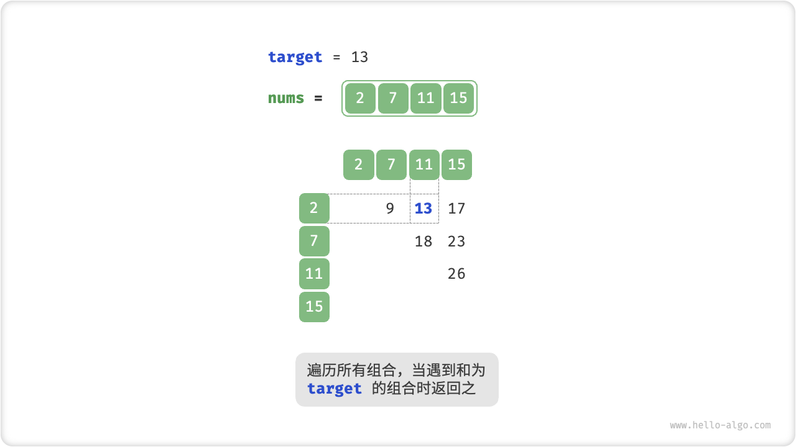
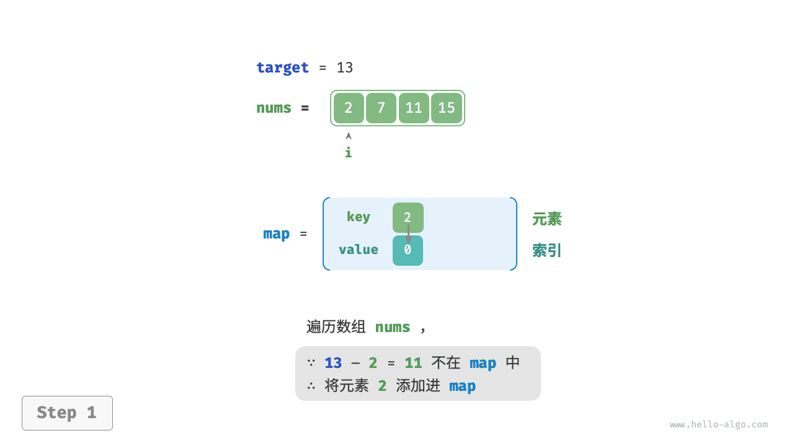

# 10.3. &nbsp; 哈希优化策略

在算法题中，**我们常通过将线性查找替换为哈希查找来降低算法的时间复杂度**。我们借助一个算法题来加深理解。

!!! question

    给定一个整数数组 `nums` 和一个目标元素 `target` ，请在数组中搜索“和”为 `target` 的两个元素，并返回它们的数组索引。返回任意一个解即可。

## 10.3.1. &nbsp; 线性查找：以时间换空间

考虑直接遍历所有可能的组合。开启一个两层循环，在每轮中判断两个整数的和是否为 `target` ，若是，则返回它们的索引。



<p align="center"> Fig. 线性查找求解两数之和 </p>

=== "Java"

    ```java title="two_sum.java"
    /* 方法一：暴力枚举 */
    int[] twoSumBruteForce(int[] nums, int target) {
        int size = nums.length;
        // 两层循环，时间复杂度 O(n^2)
        for (int i = 0; i < size - 1; i++) {
            for (int j = i + 1; j < size; j++) {
                if (nums[i] + nums[j] == target)
                    return new int[] { i, j };
            }
        }
        return new int[0];
    }
    ```

=== "C++"

    ```cpp title="two_sum.cpp"
    /* 方法一：暴力枚举 */
    vector<int> twoSumBruteForce(vector<int> &nums, int target) {
        int size = nums.size();
        // 两层循环，时间复杂度 O(n^2)
        for (int i = 0; i < size - 1; i++) {
            for (int j = i + 1; j < size; j++) {
                if (nums[i] + nums[j] == target)
                    return {i, j};
            }
        }
        return {};
    }
    ```

=== "Python"

    ```python title="two_sum.py"
    def two_sum_brute_force(nums: list[int], target: int) -> list[int]:
        """方法一：暴力枚举"""
        # 两层循环，时间复杂度 O(n^2)
        for i in range(len(nums) - 1):
            for j in range(i + 1, len(nums)):
                if nums[i] + nums[j] == target:
                    return [i, j]
        return []
    ```

=== "Go"

    ```go title="two_sum.go"
    /* 方法一：暴力枚举 */
    func twoSumBruteForce(nums []int, target int) []int {
        size := len(nums)
        // 两层循环，时间复杂度 O(n^2)
        for i := 0; i < size-1; i++ {
            for j := i + 1; i < size; j++ {
                if nums[i]+nums[j] == target {
                    return []int{i, j}
                }
            }
        }
        return nil
    }
    ```

=== "JavaScript"

    ```javascript title="two_sum.js"
    /* 方法一：暴力枚举 */
    function twoSumBruteForce(nums, target) {
        const n = nums.length;
        // 两层循环，时间复杂度 O(n^2)
        for (let i = 0; i < n; i++) {
            for (let j = i + 1; j < n; j++) {
                if (nums[i] + nums[j] === target) {
                    return [i, j];
                }
            }
        }
        return [];
    }
    ```

=== "TypeScript"

    ```typescript title="two_sum.ts"
    /* 方法一：暴力枚举 */
    function twoSumBruteForce(nums: number[], target: number): number[] {
        const n = nums.length;
        // 两层循环，时间复杂度 O(n^2)
        for (let i = 0; i < n; i++) {
            for (let j = i + 1; j < n; j++) {
                if (nums[i] + nums[j] === target) {
                    return [i, j];
                }
            }
        }
        return [];
    }
    ```

=== "C"

    ```c title="two_sum.c"
    /* 方法一：暴力枚举 */
    int *twoSumBruteForce(int *nums, int numsSize, int target, int *returnSize) {
        for (int i = 0; i < numsSize; ++i) {
            for (int j = i + 1; j < numsSize; ++j) {
                if (nums[i] + nums[j] == target) {
                    int *res = malloc(sizeof(int) * 2);
                    res[0] = i, res[1] = j;
                    *returnSize = 2;
                    return res;
                }
            }
        }
        *returnSize = 0;
        return NULL;
    }
    ```

=== "C#"

    ```csharp title="two_sum.cs"
    /* 方法一：暴力枚举 */
    int[] twoSumBruteForce(int[] nums, int target) {
        int size = nums.Length;
        // 两层循环，时间复杂度 O(n^2)
        for (int i = 0; i < size - 1; i++) {
            for (int j = i + 1; j < size; j++) {
                if (nums[i] + nums[j] == target)
                    return new int[] { i, j };
            }
        }
        return new int[0];
    }
    ```

=== "Swift"

    ```swift title="two_sum.swift"
    /* 方法一：暴力枚举 */
    func twoSumBruteForce(nums: [Int], target: Int) -> [Int] {
        // 两层循环，时间复杂度 O(n^2)
        for i in nums.indices.dropLast() {
            for j in nums.indices.dropFirst(i + 1) {
                if nums[i] + nums[j] == target {
                    return [i, j]
                }
            }
        }
        return [0]
    }
    ```

=== "Zig"

    ```zig title="two_sum.zig"
    // 方法一：暴力枚举
    fn twoSumBruteForce(nums: []i32, target: i32) ?[2]i32 {
        var size: usize = nums.len;
        var i: usize = 0;
        // 两层循环，时间复杂度 O(n^2)
        while (i < size - 1) : (i += 1) {
            var j = i + 1;
            while (j < size) : (j += 1) {
                if (nums[i] + nums[j] == target) {
                    return [_]i32{@intCast(i32, i), @intCast(i32, j)};
                }
            }
        }
        return null;
    }
    ```

此方法的时间复杂度为 $O(n^2)$ ，空间复杂度为 $O(1)$ ，在大数据量下非常耗时。

## 10.3.2. &nbsp; 哈希查找：以空间换时间

考虑借助一个哈希表，键值对分别为数组元素和元素索引。循环遍历数组，每轮执行：

1. 判断数字 `target - nums[i]` 是否在哈希表中，若是则直接返回这两个元素的索引；
2. 将键值对 `num[i]` 和索引 `i` 添加进哈希表；

=== "<1>"
    

=== "<2>"
    

=== "<3>"
    

实现代码如下所示，仅需单层循环即可。

=== "Java"

    ```java title="two_sum.java"
    /* 方法二：辅助哈希表 */
    int[] twoSumHashTable(int[] nums, int target) {
        int size = nums.length;
        // 辅助哈希表，空间复杂度 O(n)
        Map<Integer, Integer> dic = new HashMap<>();
        // 单层循环，时间复杂度 O(n)
        for (int i = 0; i < size; i++) {
            if (dic.containsKey(target - nums[i])) {
                return new int[] { dic.get(target - nums[i]), i };
            }
            dic.put(nums[i], i);
        }
        return new int[0];
    }
    ```

=== "C++"

    ```cpp title="two_sum.cpp"
    /* 方法二：辅助哈希表 */
    vector<int> twoSumHashTable(vector<int> &nums, int target) {
        int size = nums.size();
        // 辅助哈希表，空间复杂度 O(n)
        unordered_map<int, int> dic;
        // 单层循环，时间复杂度 O(n)
        for (int i = 0; i < size; i++) {
            if (dic.find(target - nums[i]) != dic.end()) {
                return {dic[target - nums[i]], i};
            }
            dic.emplace(nums[i], i);
        }
        return {};
    }
    ```

=== "Python"

    ```python title="two_sum.py"
    def two_sum_hash_table(nums: list[int], target: int) -> list[int]:
        """方法二：辅助哈希表"""
        # 辅助哈希表，空间复杂度 O(n)
        dic = {}
        # 单层循环，时间复杂度 O(n)
        for i in range(len(nums)):
            if target - nums[i] in dic:
                return [dic[target - nums[i]], i]
            dic[nums[i]] = i
        return []
    ```

=== "Go"

    ```go title="two_sum.go"
    /* 方法二：辅助哈希表 */
    func twoSumHashTable(nums []int, target int) []int {
        // 辅助哈希表，空间复杂度 O(n)
        hashTable := map[int]int{}
        // 单层循环，时间复杂度 O(n)
        for idx, val := range nums {
            if preIdx, ok := hashTable[target-val]; ok {
                return []int{preIdx, idx}
            }
            hashTable[val] = idx
        }
        return nil
    }
    ```

=== "JavaScript"

    ```javascript title="two_sum.js"
    /* 方法二：辅助哈希表 */
    function twoSumHashTable(nums, target) {
        // 辅助哈希表，空间复杂度 O(n)
        let m = {};
        // 单层循环，时间复杂度 O(n)
        for (let i = 0; i < nums.length; i++) {
            if (m[nums[i]] !== undefined) {
                return [m[nums[i]], i];
            } else {
                m[target - nums[i]] = i;
            }
        }
        return [];
    }
    ```

=== "TypeScript"

    ```typescript title="two_sum.ts"
    /* 方法二：辅助哈希表 */
    function twoSumHashTable(nums: number[], target: number): number[] {
        // 辅助哈希表，空间复杂度 O(n)
        let m: Map<number, number> = new Map();
        // 单层循环，时间复杂度 O(n)
        for (let i = 0; i < nums.length; i++) {
            let index = m.get(nums[i]);
            if (index !== undefined) {
                return [index, i];
            } else {
                m.set(target - nums[i], i);
            }
        }
        return [];
    }
    ```

=== "C"

    ```c title="two_sum.c"
    /* 哈希表 */
    struct hashTable {
        int key;
        int val;
        UT_hash_handle hh; // 基于 uthash.h 实现
    };

    typedef struct hashTable hashTable;

    /* 哈希表查询 */
    hashTable *find(hashTable *h, int key) {
        hashTable *tmp;
        HASH_FIND_INT(h, &key, tmp);
        return tmp;
    }

    /* 哈希表元素插入 */
    void insert(hashTable *h, int key, int val) {
        hashTable *t = find(h, key);
        if (t == NULL) {
            hashTable *tmp = malloc(sizeof(hashTable));
            tmp->key = key, tmp->val = val;
            HASH_ADD_INT(h, key, tmp);
        } else {
            t->val = val;
        }
    }

    /* 方法二：辅助哈希表 */
    int *twoSumHashTable(int *nums, int numsSize, int target, int *returnSize) {
        hashTable *hashtable = NULL;
        for (int i = 0; i < numsSize; i++) {
            hashTable *t = find(hashtable, target - nums[i]);
            if (t != NULL) {
                int *res = malloc(sizeof(int) * 2);
                res[0] = t->val, res[1] = i;
                *returnSize = 2;
                return res;
            }
            insert(hashtable, nums[i], i);
        }
        *returnSize = 0;
        return NULL;
    }
    ```

=== "C#"

    ```csharp title="two_sum.cs"
    /* 方法二：辅助哈希表 */
    int[] twoSumHashTable(int[] nums, int target) {
        int size = nums.Length;
        // 辅助哈希表，空间复杂度 O(n)
        Dictionary<int, int> dic = new();
        // 单层循环，时间复杂度 O(n)
        for (int i = 0; i < size; i++) {
            if (dic.ContainsKey(target - nums[i])) {
                return new int[] { dic[target - nums[i]], i };
            }
            dic.Add(nums[i], i);
        }
        return new int[0];
    }
    ```

=== "Swift"

    ```swift title="two_sum.swift"
    /* 方法二：辅助哈希表 */
    func twoSumHashTable(nums: [Int], target: Int) -> [Int] {
        // 辅助哈希表，空间复杂度 O(n)
        var dic: [Int: Int] = [:]
        // 单层循环，时间复杂度 O(n)
        for i in nums.indices {
            if let j = dic[target - nums[i]] {
                return [j, i]
            }
            dic[nums[i]] = i
        }
        return [0]
    }
    ```

=== "Zig"

    ```zig title="two_sum.zig"
    // 方法二：辅助哈希表
    fn twoSumHashTable(nums: []i32, target: i32) !?[2]i32 {
        var size: usize = nums.len;
        // 辅助哈希表，空间复杂度 O(n)
        var dic = std.AutoHashMap(i32, i32).init(std.heap.page_allocator);
        defer dic.deinit();
        var i: usize = 0;
        // 单层循环，时间复杂度 O(n)
        while (i < size) : (i += 1) {
            if (dic.contains(target - nums[i])) {
                return [_]i32{dic.get(target - nums[i]).?, @intCast(i32, i)};
            }
            try dic.put(nums[i], @intCast(i32, i));
        }
        return null;
    }
    ```

此方法通过哈希查找将时间复杂度从 $O(n^2)$ 降低至 $O(n)$ ，大幅提升运行效率。

由于需要维护一个额外的哈希表，因此空间复杂度为 $O(n)$ 。**尽管如此，该方法的整体时空效率更为均衡，因此它是本题的最优解法**。
