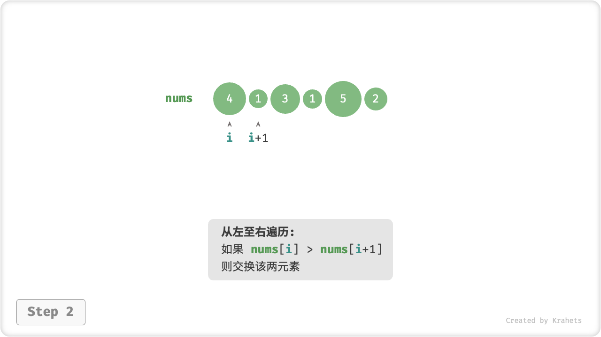
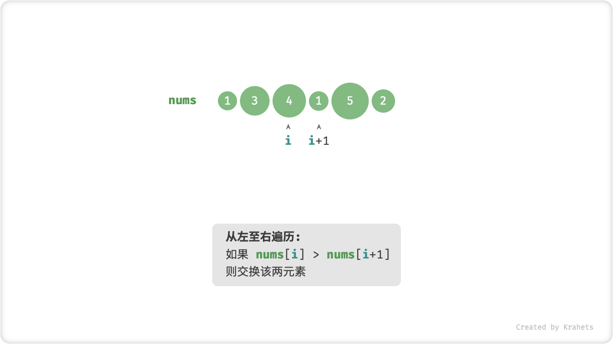
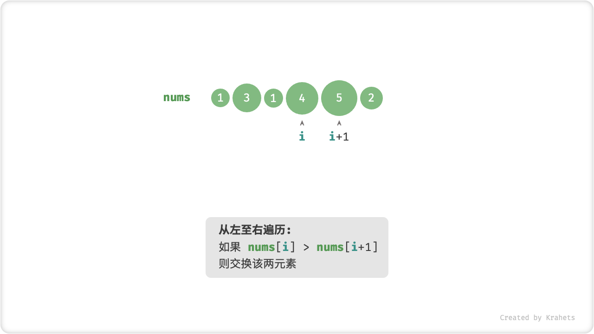
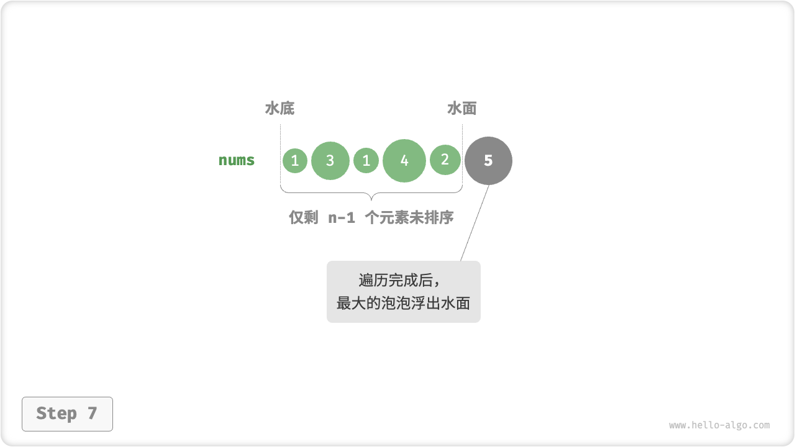

# 11.2. &nbsp; 冒泡排序

「冒泡排序 Bubble Sort」的工作原理类似于泡泡在水中的浮动。在水中，较大的泡泡会最先浮到水面。

「冒泡操作」利用元素交换操作模拟了上述过程，具体做法为：从数组最左端开始向右遍历，依次比较相邻元素大小，如果“左元素 > 右元素”就交换它俩。遍历完成后，最大的元素会被移动到数组的最右端。

**在完成一次冒泡操作后，数组的最大元素已位于正确位置，接下来只需对剩余 $n - 1$ 个元素进行排序**。

=== "<1>"
    

=== "<2>"
    

=== "<3>"
    

=== "<4>"
    

=== "<5>"
    

=== "<6>"
    

=== "<7>"
    

## 11.2.1. &nbsp; 算法流程

设输入数组长度为 $n$ ，整个冒泡排序的步骤为：

1. 完成第一轮「冒泡」后，数组的最大元素已位于正确位置，接下来只需对剩余 $n - 1$ 个元素进行排序；
2. 对剩余 $n - 1$ 个元素执行冒泡操作，可将第二大元素交换至正确位置，因而待排序元素只剩 $n - 2$ 个；
3. 如此类推，经过 $n - 1$ 轮冒泡操作，整个数组便完成排序；


<p align="center"> Fig. 冒泡排序流程 </p>

=== "Java"

    ```java title="bubble_sort.java"
    /* 冒泡排序 */
    void bubbleSort(int[] nums) {
        // 外循环：待排序元素数量为 n-1, n-2, ..., 1
        for (int i = nums.length - 1; i > 0; i--) {
            // 内循环：冒泡操作
            for (int j = 0; j < i; j++) {
                if (nums[j] > nums[j + 1]) {
                    // 交换 nums[j] 与 nums[j + 1]
                    int tmp = nums[j];
                    nums[j] = nums[j + 1];
                    nums[j + 1] = tmp;
                }
            }
        }
    }
    ```

=== "C++"

    ```cpp title="bubble_sort.cpp"
    /* 冒泡排序 */
    void bubbleSort(vector<int> &nums) {
        // 外循环：待排序元素数量为 n-1, n-2, ..., 1
        for (int i = nums.size() - 1; i > 0; i--) {
            // 内循环：冒泡操作
            for (int j = 0; j < i; j++) {
                if (nums[j] > nums[j + 1]) {
                    // 交换 nums[j] 与 nums[j + 1]
                    // 这里使用了 std::swap() 函数
                    swap(nums[j], nums[j + 1]);
                }
            }
        }
    }
    ```

=== "Python"

    ```python title="bubble_sort.py"
    def bubble_sort(nums: list[int]) -> None:
        """冒泡排序"""
        n: int = len(nums)
        # 外循环：待排序元素数量为 n-1, n-2, ..., 1
        for i in range(n - 1, 0, -1):
            # 内循环：冒泡操作
            for j in range(i):
                if nums[j] > nums[j + 1]:
                    # 交换 nums[j] 与 nums[j + 1]
                    nums[j], nums[j + 1] = nums[j + 1], nums[j]
    ```

=== "Go"

    ```go title="bubble_sort.go"
    /* 冒泡排序 */
    func bubbleSort(nums []int) {
        // 外循环：待排序元素数量为 n-1, n-2, ..., 1
        for i := len(nums) - 1; i > 0; i-- {
            // 内循环：冒泡操作
            for j := 0; j < i; j++ {
                if nums[j] > nums[j+1] {
                    // 交换 nums[j] 与 nums[j + 1]
                    nums[j], nums[j+1] = nums[j+1], nums[j]
                }
            }
        }
    }
    ```

=== "JavaScript"

    ```javascript title="bubble_sort.js"
    /* 冒泡排序 */
    function bubbleSort(nums) {
        // 外循环：待排序元素数量为 n-1, n-2, ..., 1
        for (let i = nums.length - 1; i > 0; i--) {
            // 内循环：冒泡操作
            for (let j = 0; j < i; j++) {
                if (nums[j] > nums[j + 1]) {
                    // 交换 nums[j] 与 nums[j + 1]
                    let tmp = nums[j];
                    nums[j] = nums[j + 1];
                    nums[j + 1] = tmp;
                }
            }
        }
    }
    ```

=== "TypeScript"

    ```typescript title="bubble_sort.ts"
    /* 冒泡排序 */
    function bubbleSort(nums: number[]): void {
        // 外循环：待排序元素数量为 n-1, n-2, ..., 1
        for (let i = nums.length - 1; i > 0; i--) {
            // 内循环：冒泡操作
            for (let j = 0; j < i; j++) {
                if (nums[j] > nums[j + 1]) {
                    // 交换 nums[j] 与 nums[j + 1]
                    let tmp = nums[j];
                    nums[j] = nums[j + 1];
                    nums[j + 1] = tmp;
                }
            }
        }
    }
    ```

=== "C"

    ```c title="bubble_sort.c"
    [class]{}-[func]{bubbleSort}
    ```

=== "C#"

    ```csharp title="bubble_sort.cs"
    /* 冒泡排序 */
    void bubbleSort(int[] nums)
    {
        // 外循环：待排序元素数量为 n-1, n-2, ..., 1
        for (int i = nums.Length - 1; i > 0; i--)
        {
            // 内循环：冒泡操作
            for (int j = 0; j < i; j++)
            {
                if (nums[j] > nums[j + 1])
                {
                    // 交换 nums[j] 与 nums[j + 1]
                    int tmp = nums[j];
                    nums[j] = nums[j + 1];
                    nums[j + 1] = tmp;
                }
            }
        }
    }
    ```

=== "Swift"

    ```swift title="bubble_sort.swift"
    /* 冒泡排序 */
    func bubbleSort(nums: inout [Int]) {
        // 外循环：待排序元素数量为 n-1, n-2, ..., 1
        for i in stride(from: nums.count - 1, to: 0, by: -1) {
            // 内循环：冒泡操作
            for j in stride(from: 0, to: i, by: 1) {
                if nums[j] > nums[j + 1] {
                    // 交换 nums[j] 与 nums[j + 1]
                    let tmp = nums[j]
                    nums[j] = nums[j + 1]
                    nums[j + 1] = tmp
                }
            }
        }
    }
    ```

=== "Zig"

    ```zig title="bubble_sort.zig"
    // 冒泡排序
    fn bubbleSort(nums: []i32) void {
        // 外循环：待排序元素数量为 n-1, n-2, ..., 1
        var i: usize = nums.len - 1;
        while (i > 0) : (i -= 1) {
            var j: usize = 0;
            // 内循环：冒泡操作
            while (j < i) : (j += 1) {
                if (nums[j] > nums[j + 1]) {
                    // 交换 nums[j] 与 nums[j + 1]
                    var tmp = nums[j];
                    nums[j] = nums[j + 1];
                    nums[j + 1] = tmp;
                }
            }
        }
    }
    ```

## 11.2.2. &nbsp; 算法特性

**时间复杂度 $O(n^2)$** ：各轮冒泡遍历的数组长度依次为 $n - 1$ , $n - 2$ , $\cdots$ , $2$ , $1$ ，总和为 $\frac{(n - 1) n}{2}$ ，因此使用 $O(n^2)$ 时间。在引入下文的 `flag` 优化后，最佳时间复杂度可达到 $O(n)$ ，所以它是“自适应排序”。

**空间复杂度 $O(1)$** ：指针 $i$ , $j$ 使用常数大小的额外空间，因此是“原地排序”。

由于冒泡操作中遇到相等元素不交换，因此冒泡排序是“稳定排序”。

## 11.2.3. &nbsp; 效率优化

我们发现，如果某轮冒泡操作中没有执行任何交换操作，说明数组已经完成排序，可直接返回结果。因此，可以增加一个标志位 `flag` 来监测这种情况，一旦出现就立即返回。

经过优化，冒泡排序的最差和平均时间复杂度仍为 $O(n^2)$ ；但当输入数组完全有序时，可达到最佳时间复杂度 $O(n)$ 。

=== "Java"

    ```java title="bubble_sort.java"
    /* 冒泡排序（标志优化） */
    void bubbleSortWithFlag(int[] nums) {
        // 外循环：待排序元素数量为 n-1, n-2, ..., 1
        for (int i = nums.length - 1; i > 0; i--) {
            boolean flag = false; // 初始化标志位
            // 内循环：冒泡操作
            for (int j = 0; j < i; j++) {
                if (nums[j] > nums[j + 1]) {
                    // 交换 nums[j] 与 nums[j + 1]
                    int tmp = nums[j];
                    nums[j] = nums[j + 1];
                    nums[j + 1] = tmp;
                    flag = true; // 记录交换元素
                }
            }
            if (!flag)
                break; // 此轮冒泡未交换任何元素，直接跳出
        }
    }
    ```

=== "C++"

    ```cpp title="bubble_sort.cpp"
    /* 冒泡排序（标志优化）*/
    void bubbleSortWithFlag(vector<int> &nums) {
        // 外循环：待排序元素数量为 n-1, n-2, ..., 1
        for (int i = nums.size() - 1; i > 0; i--) {
            bool flag = false; // 初始化标志位
            // 内循环：冒泡操作
            for (int j = 0; j < i; j++) {
                if (nums[j] > nums[j + 1]) {
                    // 交换 nums[j] 与 nums[j + 1]
                    // 这里使用了 std::swap() 函数
                    swap(nums[j], nums[j + 1]);
                    flag = true; // 记录交换元素
                }
            }
            if (!flag)
                break; // 此轮冒泡未交换任何元素，直接跳出
        }
    }
    ```

=== "Python"

    ```python title="bubble_sort.py"
    def bubble_sort_with_flag(nums: list[int]) -> None:
        """冒泡排序（标志优化）"""
        n: int = len(nums)
        # 外循环：待排序元素数量为 n-1, n-2, ..., 1
        for i in range(n - 1, 0, -1):
            flag: bool = False  # 初始化标志位
            # 内循环：冒泡操作
            for j in range(i):
                if nums[j] > nums[j + 1]:
                    # 交换 nums[j] 与 nums[j + 1]
                    nums[j], nums[j + 1] = nums[j + 1], nums[j]
                    flag = True  # 记录交换元素
            if not flag:
                break  # 此轮冒泡未交换任何元素，直接跳出
    ```

=== "Go"

    ```go title="bubble_sort.go"
    /* 冒泡排序（标志优化）*/
    func bubbleSortWithFlag(nums []int) {
        // 外循环：待排序元素数量为 n-1, n-2, ..., 1
        for i := len(nums) - 1; i > 0; i-- {
            flag := false // 初始化标志位
            // 内循环：冒泡操作
            for j := 0; j < i; j++ {
                if nums[j] > nums[j+1] {
                    // 交换 nums[j] 与 nums[j + 1]
                    nums[j], nums[j+1] = nums[j+1], nums[j]
                    flag = true // 记录交换元素
                }
            }
            if flag == false { // 此轮冒泡未交换任何元素，直接跳出
                break
            }
        }
    }
    ```

=== "JavaScript"

    ```javascript title="bubble_sort.js"
    /* 冒泡排序（标志优化）*/
    function bubbleSortWithFlag(nums) {
        // 外循环：待排序元素数量为 n-1, n-2, ..., 1
        for (let i = nums.length - 1; i > 0; i--) {
            let flag = false; // 初始化标志位
            // 内循环：冒泡操作
            for (let j = 0; j < i; j++) {
                if (nums[j] > nums[j + 1]) {
                    // 交换 nums[j] 与 nums[j + 1]
                    let tmp = nums[j];
                    nums[j] = nums[j + 1];
                    nums[j + 1] = tmp;
                    flag = true;  // 记录交换元素
                }
            }
            if (!flag) break;     // 此轮冒泡未交换任何元素，直接跳出
        }
    }
    ```

=== "TypeScript"

    ```typescript title="bubble_sort.ts"
    /* 冒泡排序（标志优化）*/
    function bubbleSortWithFlag(nums: number[]): void {
        // 外循环：待排序元素数量为 n-1, n-2, ..., 1
        for (let i = nums.length - 1; i > 0; i--) {
            let flag = false; // 初始化标志位
            // 内循环：冒泡操作
            for (let j = 0; j < i; j++) {
                if (nums[j] > nums[j + 1]) {
                    // 交换 nums[j] 与 nums[j + 1]
                    let tmp = nums[j];
                    nums[j] = nums[j + 1];
                    nums[j + 1] = tmp;
                    flag = true; // 记录交换元素
                }
            }
            if (!flag) break; // 此轮冒泡未交换任何元素，直接跳出
        }
    }
    ```

=== "C"

    ```c title="bubble_sort.c"
    [class]{}-[func]{bubbleSortWithFlag}
    ```

=== "C#"

    ```csharp title="bubble_sort.cs"
    /* 冒泡排序（标志优化）*/
    void bubbleSortWithFlag(int[] nums)
    {
        // 外循环：待排序元素数量为 n-1, n-2, ..., 1
        for (int i = nums.Length - 1; i > 0; i--)
        {
            bool flag = false; // 初始化标志位
            // 内循环：冒泡操作
            for (int j = 0; j < i; j++)
            {
                if (nums[j] > nums[j + 1])
                {
                    // 交换 nums[j] 与 nums[j + 1]
                    int tmp = nums[j];
                    nums[j] = nums[j + 1];
                    nums[j + 1] = tmp;
                    flag = true;  // 记录交换元素
                }
            }
            if (!flag) break;     // 此轮冒泡未交换任何元素，直接跳出
        }
    }
    ```

=== "Swift"

    ```swift title="bubble_sort.swift"
    /* 冒泡排序（标志优化）*/
    func bubbleSortWithFlag(nums: inout [Int]) {
        // 外循环：待排序元素数量为 n-1, n-2, ..., 1
        for i in stride(from: nums.count - 1, to: 0, by: -1) {
            var flag = false // 初始化标志位
            for j in stride(from: 0, to: i, by: 1) {
                if nums[j] > nums[j + 1] {
                    // 交换 nums[j] 与 nums[j + 1]
                    let tmp = nums[j]
                    nums[j] = nums[j + 1]
                    nums[j + 1] = tmp
                    flag = true // 记录交换元素
                }
            }
            if !flag { // 此轮冒泡未交换任何元素，直接跳出
                break
            }
        }
    }
    ```

=== "Zig"

    ```zig title="bubble_sort.zig"
    // 冒泡排序（标志优化）
    fn bubbleSortWithFlag(nums: []i32) void {
        // 外循环：待排序元素数量为 n-1, n-2, ..., 1
        var i: usize = nums.len - 1;
        while (i > 0) : (i -= 1) {
            var flag = false;   // 初始化标志位
            var j: usize = 0;
            // 内循环：冒泡操作
            while (j < i) : (j += 1) {
                if (nums[j] > nums[j + 1]) {
                    // 交换 nums[j] 与 nums[j + 1]
                    var tmp = nums[j];
                    nums[j] = nums[j + 1];
                    nums[j + 1] = tmp;
                    flag = true;
                }
            }
            if (!flag) break;   // 此轮冒泡未交换任何元素，直接跳出
        }
    }
    ```
