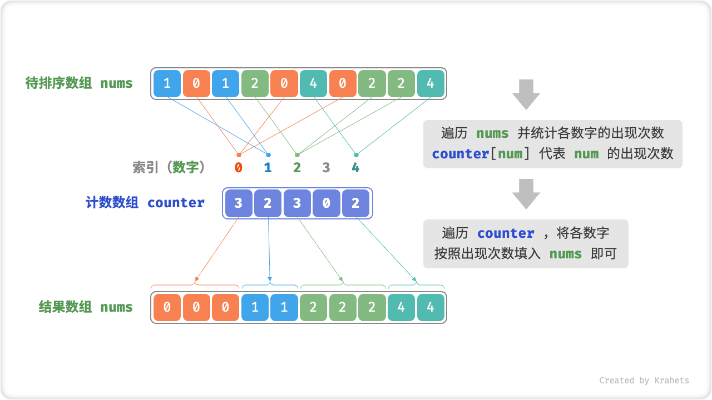
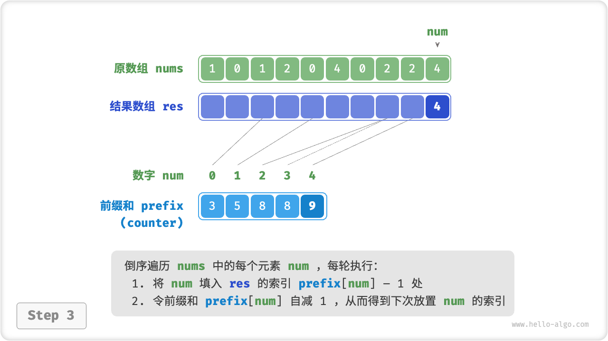
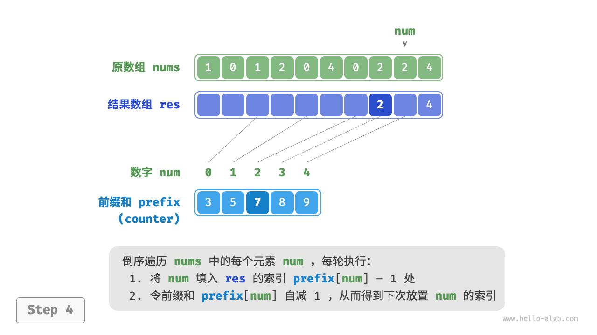
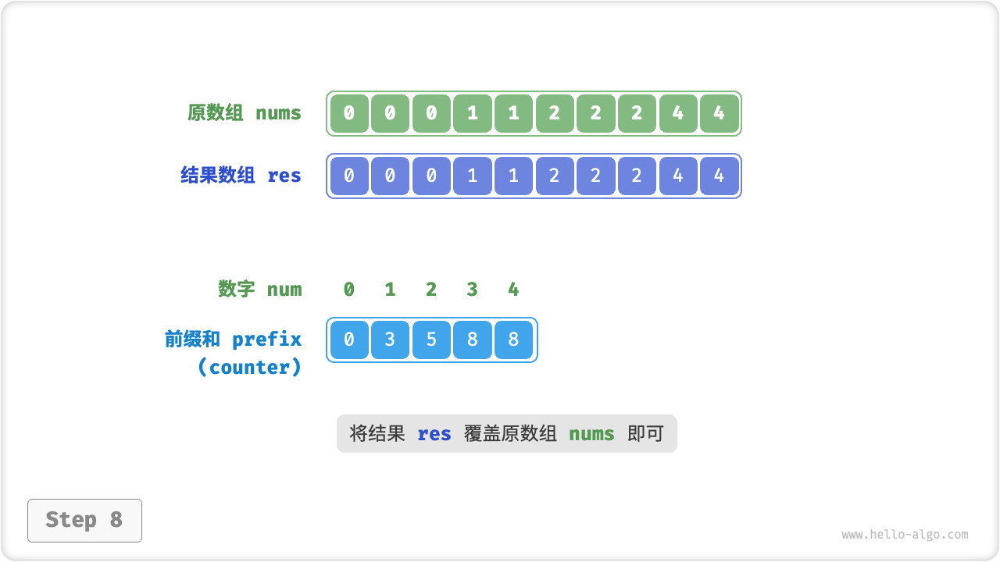

# 11.7. &nbsp; 计数排序

顾名思义，「计数排序 Counting Sort」通过统计元素数量来实现排序，一般应用于整数数组。

## 11.7.1. &nbsp; 简单实现

先看一个简单例子。给定一个长度为 $n$ 的数组 `nums` ，元素皆为 **非负整数**。计数排序的整体流程为：

1. 遍历记录数组中的最大数字，记为 $m$ ，并建立一个长度为 $m + 1$ 的辅助数组 `counter` ；
2. **借助 `counter` 统计 `nums` 中各数字的出现次数**，其中 `counter[num]` 对应数字 `num` 的出现次数。统计方法很简单，只需遍历 `nums` （设当前数字为 `num`），每轮将 `counter[num]` 自增 $1$ 即可。
3. **由于 `counter` 的各个索引是天然有序的，因此相当于所有数字已经被排序好了**。接下来，我们遍历 `counter` ，根据各数字的出现次数，将各数字按从小到大的顺序填入 `nums` 即可。



<p align="center"> Fig. 计数排序流程 </p>

=== "Java"

    ```java title="counting_sort.java"
    /* 计数排序 */
    // 简单实现，无法用于排序对象
    void countingSortNaive(int[] nums) {
        // 1. 统计数组最大元素 m
        int m = 0;
        for (int num : nums) {
            m = Math.max(m, num);
        }
        // 2. 统计各数字的出现次数
        // counter[num] 代表 num 的出现次数
        int[] counter = new int[m + 1];
        for (int num : nums) {
            counter[num]++;
        }
        // 3. 遍历 counter ，将各元素填入原数组 nums
        int i = 0;
        for (int num = 0; num < m + 1; num++) {
            for (int j = 0; j < counter[num]; j++, i++) {
                nums[i] = num;
            }
        }
    }
    ```

=== "C++"

    ```cpp title="counting_sort.cpp"
    /* 计数排序 */
    // 简单实现，无法用于排序对象
    void countingSortNaive(vector<int>& nums) {
        // 1. 统计数组最大元素 m
        int m = 0;
        for (int num : nums) {
            m = max(m, num);
        }
        // 2. 统计各数字的出现次数
        // counter[num] 代表 num 的出现次数
        vector<int> counter(m + 1, 0);
        for (int num : nums) {
            counter[num]++;
        }
        // 3. 遍历 counter ，将各元素填入原数组 nums
        int i = 0;
        for (int num = 0; num < m + 1; num++) {
            for (int j = 0; j < counter[num]; j++, i++) {
                nums[i] = num;
            }
        }
    }
    ```

=== "Python"

    ```python title="counting_sort.py"
    def counting_sort_naive(nums: list[int]) -> None:
        """ 计数排序 """
        # 简单实现，无法用于排序对象
        # 1. 统计数组最大元素 m
        m = 0
        for num in nums:
            m = max(m, num)
        # 2. 统计各数字的出现次数
        # counter[num] 代表 num 的出现次数
        counter = [0] * (m + 1)
        for num in nums:
            counter[num] += 1
        # 3. 遍历 counter ，将各元素填入原数组 nums
        i = 0
        for num in range(m + 1):
            for _ in range(counter[num]):
                nums[i] = num
                i += 1
    ```

=== "Go"

    ```go title="counting_sort.go"
    /* 计数排序 */
    // 简单实现，无法用于排序对象
    func countingSortNaive(nums []int) {
        // 1. 统计数组最大元素 m
        m := 0
        for num := range nums {
            if num > m {
                m = num
            }
        }
        // 2. 统计各数字的出现次数
        // counter[num] 代表 num 的出现次数
        counter := make([]int, m+1)
        for _, num := range nums {
            counter[num]++
        }
        // 3. 遍历 counter ，将各元素填入原数组 nums
        for i, num := 0, 0; num < m+1; num++ {
            for j := 0; j < counter[num]; j++ {
                nums[i] = num
                i++
            }
        }
    }
    ```

=== "JavaScript"

    ```javascript title="counting_sort.js"
    [class]{}-[func]{countingSortNaive}
    ```

=== "TypeScript"

    ```typescript title="counting_sort.ts"
    [class]{}-[func]{countingSortNaive}
    ```

=== "C"

    ```c title="counting_sort.c"
    [class]{}-[func]{countingSortNaive}
    ```

=== "C#"

    ```csharp title="counting_sort.cs"
    [class]{counting_sort}-[func]{countingSortNaive}
    ```

=== "Swift"

    ```swift title="counting_sort.swift"
    /* 计数排序 */
    // 简单实现，无法用于排序对象
    func countingSortNaive(nums: inout [Int]) {
        // 1. 统计数组最大元素 m
        let m = nums.max()!
        // 2. 统计各数字的出现次数
        // counter[num] 代表 num 的出现次数
        var counter = Array(repeating: 0, count: m + 1)
        for num in nums {
            counter[num] += 1
        }
        // 3. 遍历 counter ，将各元素填入原数组 nums
        var i = 0
        for num in stride(from: 0, to: m + 1, by: 1) {
            for _ in stride(from: 0, to: counter[num], by: 1) {
                nums[i] = num
                i += 1
            }
        }
    }
    ```

=== "Zig"

    ```zig title="counting_sort.zig"
    [class]{}-[func]{countingSortNaive}
    ```

!!! note "计数排序与桶排序的联系"

    从桶排序的角度看，我们可以把计数排序中计数数组 `counter` 的每个索引想象成一个桶，将统计数量的过程想象成把各个元素分配到对应的桶中。本质上，计数排序是桶排序在整型数据下的一个特例。

## 11.7.2. &nbsp; 完整实现

细心的同学可能发现，**如果输入数据是对象，上述步骤 `3.` 就失效了**。例如输入数据是商品对象，我们想要按照商品价格（类的成员变量）对商品进行排序，而上述算法只能给出价格的排序结果。

那么如何才能得到原数据的排序结果呢？我们首先计算 `counter` 的「前缀和」，顾名思义，索引 `i` 处的前缀和 `prefix[i]` 等于数组前 `i` 个元素之和，即

$$
\text{prefix}[i] = \sum_{j=0}^i \text{counter[j]}
$$

**前缀和具有明确意义，`prefix[num] - 1` 代表元素 `num` 在结果数组 `res` 中最后一次出现的索引**。这个信息很关键，因为其给出了各个元素应该出现在结果数组的哪个位置。接下来，我们倒序遍历原数组 `nums` 的每个元素 `num` ，在每轮迭代中执行：

1. 将 `num` 填入数组 `res` 的索引 `prefix[num] - 1` 处；
2. 令前缀和 `prefix[num]` 自减 $1$ ，从而得到下次放置 `num` 的索引；

完成遍历后，数组 `res` 中就是排序好的结果，最后使用 `res` 覆盖原数组 `nums` 即可；

=== "<1>"
    

=== "<2>"
    

=== "<3>"
    

=== "<4>"
    

=== "<5>"
    

=== "<6>"
    

=== "<7>"
    

=== "<8>"
    

计数排序的实现代码如下所示。

=== "Java"

    ```java title="counting_sort.java"
    /* 计数排序 */
    // 完整实现，可排序对象，并且是稳定排序
    void countingSort(int[] nums) {
        // 1. 统计数组最大元素 m
        int m = 0;
        for (int num : nums) {
            m = Math.max(m, num);
        }
        // 2. 统计各数字的出现次数
        // counter[num] 代表 num 的出现次数
        int[] counter = new int[m + 1];
        for (int num : nums) {
            counter[num]++;
        }
        // 3. 求 counter 的前缀和，将“出现次数”转换为“尾索引”
        // 即 counter[num]-1 是 num 在 res 中最后一次出现的索引
        for (int i = 0; i < m; i++) {
            counter[i + 1] += counter[i];
        }
        // 4. 倒序遍历 nums ，将各元素填入结果数组 res
        // 初始化数组 res 用于记录结果
        int n = nums.length;
        int[] res = new int[n];
        for (int i = n - 1; i >= 0; i--) {
            int num = nums[i];
            res[counter[num] - 1] = num; // 将 num 放置到对应索引处
            counter[num]--; // 令前缀和自减 1 ，得到下次放置 num 的索引
        }
        // 使用结果数组 res 覆盖原数组 nums
        for (int i = 0; i < n; i++) {
            nums[i] = res[i];
        }
    }
    ```

=== "C++"

    ```cpp title="counting_sort.cpp"
    /* 计数排序 */
    // 完整实现，可排序对象，并且是稳定排序
    void countingSort(vector<int>& nums) {
        // 1. 统计数组最大元素 m
        int m = 0;
        for (int num : nums) {
            m = max(m, num);
        }
        // 2. 统计各数字的出现次数
        // counter[num] 代表 num 的出现次数
        vector<int> counter(m + 1, 0);
        for (int num : nums) {
            counter[num]++;
        }
        // 3. 求 counter 的前缀和，将“出现次数”转换为“尾索引”
        // 即 counter[num]-1 是 num 在 res 中最后一次出现的索引
        for (int i = 0; i < m; i++) {
            counter[i + 1] += counter[i];
        }
        // 4. 倒序遍历 nums ，将各元素填入结果数组 res
        // 初始化数组 res 用于记录结果
        int n = nums.size();
        vector<int> res(n);
        for (int i = n - 1; i >= 0; i--) {
            int num = nums[i];
            res[counter[num] - 1] = num; // 将 num 放置到对应索引处
            counter[num]--; // 令前缀和自减 1 ，得到下次放置 num 的索引
        }
        // 使用结果数组 res 覆盖原数组 nums
        nums = res;
    }
    ```

=== "Python"

    ```python title="counting_sort.py"
    def counting_sort(nums: list[int]) -> None:
        """ 计数排序 """
        # 完整实现，可排序对象，并且是稳定排序
        # 1. 统计数组最大元素 m
        m = max(nums)
        # 2. 统计各数字的出现次数
        # counter[num] 代表 num 的出现次数
        counter = [0] * (m + 1)
        for num in nums:
            counter[num] += 1
        # 3. 求 counter 的前缀和，将“出现次数”转换为“尾索引”
        # 即 counter[num]-1 是 num 在 res 中最后一次出现的索引
        for i in range(m):
            counter[i + 1] += counter[i]
        # 4. 倒序遍历 nums ，将各元素填入结果数组 res
        # 初始化数组 res 用于记录结果
        n = len(nums)
        res = [0] * n
        for i in range(n - 1, -1, -1):
            num = nums[i]
            res[counter[num] - 1] = num  # 将 num 放置到对应索引处
            counter[num] -= 1  # 令前缀和自减 1 ，得到下次放置 num 的索引
        # 使用结果数组 res 覆盖原数组 nums
        for i in range(n):
            nums[i] = res[i]
    ```

=== "Go"

    ```go title="counting_sort.go"
    /* 计数排序 */
    // 完整实现，可排序对象，并且是稳定排序
    func countingSort(nums []int) {
        // 1. 统计数组最大元素 m
        m := 0
        for num := range nums {
            if num > m {
                m = num
            }
        }
        // 2. 统计各数字的出现次数
        // counter[num] 代表 num 的出现次数
        counter := make([]int, m+1)
        for _, num := range nums {
            counter[num]++
        }
        // 3. 求 counter 的前缀和，将“出现次数”转换为“尾索引”
        // 即 counter[num]-1 是 num 在 res 中最后一次出现的索引
        for i := 0; i < m; i++ {
            counter[i+1] += counter[i]
        }
        // 4. 倒序遍历 nums ，将各元素填入结果数组 res
        // 初始化数组 res 用于记录结果
        n := len(nums)
        res := make([]int, n)
        for i := n - 1; i >= 0; i-- {
            num := nums[i]
            // 将 num 放置到对应索引处
            res[counter[num]-1] = num
            // 令前缀和自减 1 ，得到下次放置 num 的索引
            counter[num]--
        }
        // 使用结果数组 res 覆盖原数组 nums
        copy(nums, res)
    }
    ```

=== "JavaScript"

    ```javascript title="counting_sort.js"
    [class]{}-[func]{countingSort}
    ```

=== "TypeScript"

    ```typescript title="counting_sort.ts"
    [class]{}-[func]{countingSort}
    ```

=== "C"

    ```c title="counting_sort.c"
    [class]{}-[func]{countingSort}
    ```

=== "C#"

    ```csharp title="counting_sort.cs"
    [class]{counting_sort}-[func]{countingSort}
    ```

=== "Swift"

    ```swift title="counting_sort.swift"
    /* 计数排序 */
    // 完整实现，可排序对象，并且是稳定排序
    func countingSort(nums: inout [Int]) {
        // 1. 统计数组最大元素 m
        let m = nums.max()!
        // 2. 统计各数字的出现次数
        // counter[num] 代表 num 的出现次数
        var counter = Array(repeating: 0, count: m + 1)
        for num in nums {
            counter[num] += 1
        }
        // 3. 求 counter 的前缀和，将“出现次数”转换为“尾索引”
        // 即 counter[num]-1 是 num 在 res 中最后一次出现的索引
        for i in stride(from: 0, to: m, by: 1) {
            counter[i + 1] += counter[i]
        }
        // 4. 倒序遍历 nums ，将各元素填入结果数组 res
        // 初始化数组 res 用于记录结果
        var res = Array(repeating: 0, count: nums.count)
        for i in stride(from: nums.count - 1, through: 0, by: -1) {
            let num = nums[i]
            res[counter[num] - 1] = num // 将 num 放置到对应索引处
            counter[num] -= 1 // 令前缀和自减 1 ，得到下次放置 num 的索引
        }
        // 使用结果数组 res 覆盖原数组 nums
        for i in stride(from: 0, to: nums.count, by: 1) {
            nums[i] = res[i]
        }
    }
    ```

=== "Zig"

    ```zig title="counting_sort.zig"
    [class]{}-[func]{countingSort}
    ```

## 11.7.3. &nbsp; 算法特性

**时间复杂度 $O(n + m)$** ：涉及遍历 `nums` 和遍历 `counter` ，都使用线性时间。一般情况下 $n \gg m$ ，此时使用线性 $O(n)$ 时间。

**空间复杂度 $O(n + m)$** ：借助了长度分别为 $n$ , $m$ 的数组 `res` 和 `counter` ，是“非原地排序”。

**稳定排序**：由于向 `res` 中填充元素的顺序是“从右向左”的，因此倒序遍历 `nums` 可以避免改变相等元素之间的相对位置，从而实现“稳定排序”；其实正序遍历 `nums` 也可以得到正确的排序结果，但结果“非稳定”。

## 11.7.4. &nbsp; 局限性

看到这里，你也许会觉得计数排序太妙了，咔咔一通操作，时间复杂度就下来了。然而，使用计数排序的前置条件比较苛刻。

**计数排序只适用于非负整数**。若想要用在其他类型数据上，则要求该数据必须可以被转化为非负整数，并且不能改变各个元素之间的相对大小关系。例如，对于包含负数的整数数组，可以先给所有数字加上一个常数，将全部数字转化为正数，排序完成后再转换回去即可。

**计数排序适用于数据量大但数据范围不大的情况**。比如，上述示例中 $m$ 不能太大，否则占用空间太多；而当 $n \ll m$ 时，计数排序使用 $O(m)$ 时间，有可能比 $O(n \log n)$ 的排序算法还要慢。
