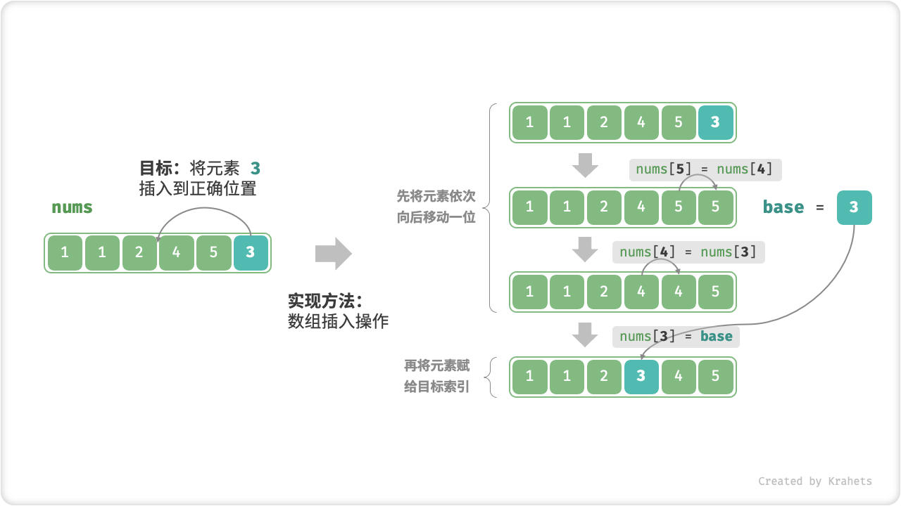
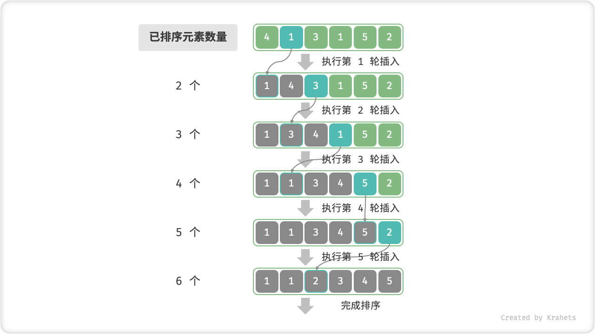

# 11.3. &nbsp; 插入排序

「插入排序 Insertion Sort」是一种基于 **数组插入操作** 的排序算法。

「插入操作」原理：选定某个待排序元素为基准数 `base`，将 `base` 与其左侧已排序区间元素依次对比大小，并插入到正确位置。

回忆数组插入操作，我们需要将从目标索引到 `base` 之间的所有元素向右移动一位，然后再将 `base` 赋值给目标索引。



<p align="center"> Fig. 单次插入操作 </p>

## 11.3.1. &nbsp; 算法流程

循环执行插入操作：

1. 先选取数组的 **第 2 个元素** 为 `base` ，执行插入操作后，**数组前 2 个元素已完成排序**。
2. 选取 **第 3 个元素** 为 `base` ，执行插入操作后，**数组前 3 个元素已完成排序**。
3. 以此类推……最后一轮选取 **数组尾元素** 为 `base` ，执行插入操作后，**所有元素已完成排序**。



<p align="center"> Fig. 插入排序流程 </p>

=== "Java"

    ```java title="insertion_sort.java"
    /* 插入排序 */
    void insertionSort(int[] nums) {
        // 外循环：base = nums[1], nums[2], ..., nums[n-1]
        for (int i = 1; i < nums.length; i++) {
            int base = nums[i], j = i - 1;
            // 内循环：将 base 插入到左边的正确位置
            while (j >= 0 && nums[j] > base) {
                nums[j + 1] = nums[j];  // 1. 将 nums[j] 向右移动一位
                j--;
            }
            nums[j + 1] = base;         // 2. 将 base 赋值到正确位置
        }
    }
    ```

=== "C++"

    ```cpp title="insertion_sort.cpp"
    /* 插入排序 */
    void insertionSort(vector<int>& nums) {
        // 外循环：base = nums[1], nums[2], ..., nums[n-1]
        for (int i = 1; i < nums.size(); i++) {
            int base = nums[i], j = i - 1;
            // 内循环：将 base 插入到左边的正确位置
            while (j >= 0 && nums[j] > base) {
                nums[j + 1] = nums[j];  // 1. 将 nums[j] 向右移动一位
                j--;
            }
            nums[j + 1] = base;         // 2. 将 base 赋值到正确位置
        }
    }
    ```

=== "Python"

    ```python title="insertion_sort.py"
    def insertion_sort(nums: list[int]) -> None:
        """插入排序"""
        # 外循环：base = nums[1], nums[2], ..., nums[n-1]
        for i in range(1, len(nums)):
            base: int = nums[i]
            j: int = i - 1
            # 内循环：将 base 插入到左边的正确位置
            while j >= 0 and nums[j] > base:
                nums[j + 1] = nums[j]  # 1. 将 nums[j] 向右移动一位
                j -= 1
            nums[j + 1] = base  # 2. 将 base 赋值到正确位置
    ```

=== "Go"

    ```go title="insertion_sort.go"
    /* 插入排序 */
    func insertionSort(nums []int) {
        // 外循环：待排序元素数量为 n-1, n-2, ..., 1
        for i := 1; i < len(nums); i++ {
            base := nums[i]
            j := i - 1
            // 内循环：将 base 插入到左边的正确位置
            for j >= 0 && nums[j] > base {
                nums[j+1] = nums[j] // 1. 将 nums[j] 向右移动一位
                j--
            }
            nums[j+1] = base // 2. 将 base 赋值到正确位置
        }
    }
    ```

=== "JavaScript"

    ```javascript title="insertion_sort.js"
    /* 插入排序 */
    function insertionSort(nums) {
        // 外循环：base = nums[1], nums[2], ..., nums[n-1]
        for (let i = 1; i < nums.length; i++) {
            let base = nums[i], j = i - 1;
            // 内循环：将 base 插入到左边的正确位置
            while (j >= 0 && nums[j] > base) {
                nums[j + 1] = nums[j];  // 1. 将 nums[j] 向右移动一位
                j--;
            }
            nums[j + 1] = base;         // 2. 将 base 赋值到正确位置
        }
    }
    ```

=== "TypeScript"

    ```typescript title="insertion_sort.ts"
    /* 插入排序 */
    function insertionSort(nums: number[]): void {
        // 外循环：base = nums[1], nums[2], ..., nums[n-1]
        for (let i = 1; i < nums.length; i++) {
            const base = nums[i];
            let j = i - 1;
            // 内循环：将 base 插入到左边的正确位置
            while (j >= 0 && nums[j] > base) {
                nums[j + 1] = nums[j]; // 1. 将 nums[j] 向右移动一位
                j--;
            }
            nums[j + 1] = base; // 2. 将 base 赋值到正确位置
        }
    }
    ```

=== "C"

    ```c title="insertion_sort.c"
    [class]{}-[func]{insertionSort}
    ```

=== "C#"

    ```csharp title="insertion_sort.cs"
    /* 插入排序 */
    void insertionSort(int[] nums)
    {
        // 外循环：base = nums[1], nums[2], ..., nums[n-1]
        for (int i = 1; i < nums.Length; i++)
        {
            int bas = nums[i], j = i - 1;
            // 内循环：将 base 插入到左边的正确位置
            while (j >= 0 && nums[j] > bas)
            {
                nums[j + 1] = nums[j]; // 1. 将 nums[j] 向右移动一位
                j--;
            }
            nums[j + 1] = bas;         // 2. 将 base 赋值到正确位置
        }
    }
    ```

=== "Swift"

    ```swift title="insertion_sort.swift"
    /* 插入排序 */
    func insertionSort(nums: inout [Int]) {
        // 外循环：base = nums[1], nums[2], ..., nums[n-1]
        for i in stride(from: 1, to: nums.count, by: 1) {
            let base = nums[i]
            var j = i - 1
            // 内循环：将 base 插入到左边的正确位置
            while j >= 0, nums[j] > base {
                nums[j + 1] = nums[j] // 1. 将 nums[j] 向右移动一位
                j -= 1
            }
            nums[j + 1] = base // 2. 将 base 赋值到正确位置
        }
    }
    ```

=== "Zig"

    ```zig title="insertion_sort.zig"
    // 插入排序
    fn insertionSort(nums: []i32) void {
        // 外循环：base = nums[1], nums[2], ..., nums[n-1]
        var i: usize = 1;
        while (i < nums.len) : (i += 1) {
            var base = nums[i];
            var j: usize = i;
            // 内循环：将 base 插入到左边的正确位置
            while (j >= 1 and nums[j - 1] > base) : (j -= 1) {
                nums[j] = nums[j - 1];  // 1. 将 nums[j] 向右移动一位
            }
            nums[j] = base;             // 2. 将 base 赋值到正确位置
        }
    }
    ```

## 11.3.2. &nbsp; 算法特性

**时间复杂度 $O(n^2)$** ：最差情况下，各轮插入操作循环 $n - 1$ , $n-2$ , $\cdots$ , $2$ , $1$ 次，求和为 $\frac{(n - 1) n}{2}$ ，使用 $O(n^2)$ 时间。输入数组完全有序下，达到最佳时间复杂度 $O(n)$ ，因此是“自适应排序”。

**空间复杂度 $O(1)$** ：指针 $i$ , $j$ 使用常数大小的额外空间，因此是“原地排序”。

在插入操作中，我们会将元素插入到相等元素的右边，不会改变它们的次序，因此是“稳定排序”。

## 11.3.3. &nbsp; 插入排序优势

回顾「冒泡排序」和「插入排序」的复杂度分析，两者的循环轮数都是 $\frac{(n - 1) n}{2}$ 。但不同的是：

- 冒泡操作基于 **元素交换** 实现，需要借助一个临时变量实现，共 3 个单元操作；
- 插入操作基于 **元素赋值** 实现，只需 1 个单元操作；

粗略估计，冒泡排序的计算开销约为插入排序的 3 倍，因此插入排序更受欢迎，许多编程语言（例如 Java）的内置排序函数都使用到了插入排序，大致思路为：

- 对于 **长数组**，采用基于分治的排序算法，例如「快速排序」，时间复杂度为 $O(n \log n)$ ；
- 对于 **短数组**，直接使用「插入排序」，时间复杂度为 $O(n^2)$ ；

虽然插入排序比快速排序的时间复杂度更高，**但实际上在数据量较小时插入排序更快**，这是因为复杂度中的常数项（即每轮中的单元操作数量）占主导作用。这个现象与「线性查找」和「二分查找」的情况类似。
