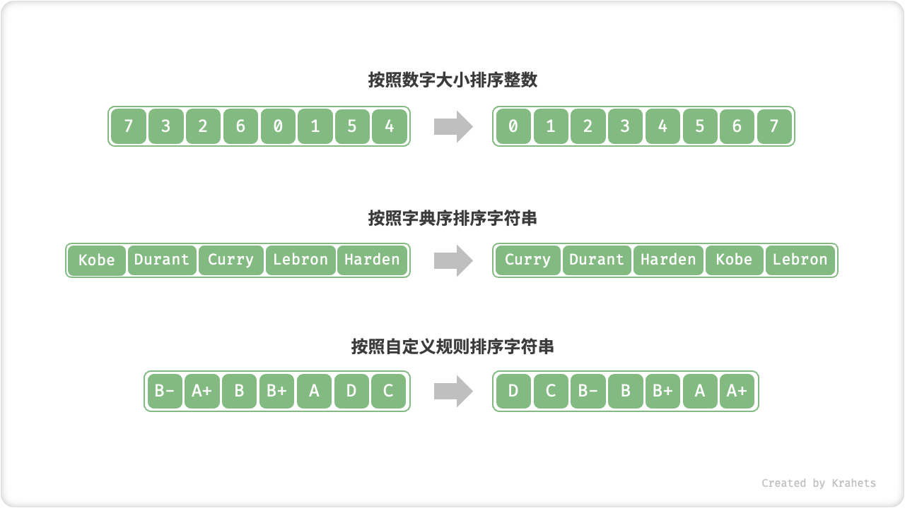

# 11.1. &nbsp; 排序简介

「排序算法 Sorting Algorithm」使得列表中的所有元素按照从小到大的顺序排列。

- 待排序的列表的 **元素类型** 可以是整数、浮点数、字符、或字符串；
- 排序算法可以根据需要设定 **判断规则**，例如数字大小、字符 ASCII 码顺序、自定义规则；



<p align="center"> Fig. 排序中不同的元素类型和判断规则 </p>

## 11.1.1. &nbsp; 评价维度

**运行效率**：我们希望排序算法的时间复杂度尽可能低，并且总体操作数量更少（即时间复杂度中的常数项更低）。在大数据量下，运行效率尤为重要。

**就地性**：顾名思义，「原地排序」直接在原数组上操作实现排序，而不用借助额外辅助数组，节约内存；并且一般情况下，原地排序的数据搬运操作较少，运行速度也更快。

**稳定性**：「稳定排序」在完成排序后，相等元素在数组中的相对顺序 **不会发生改变**。假设我们有一个存储学生信息的表格，第 1, 2 列分别是姓名和年龄。那么在以下示例中，「非稳定排序」会导致输入数据的有序性丢失。稳定性是排序算法很好的特性，**在多级排序中是必须的**。

```shell
# 输入数据是按照姓名排序好的
# (name, age)
  ('A', 19)
  ('B', 18)
  ('C', 21)
  ('D', 19)
  ('E', 23)

# 假设使用非稳定排序算法按年龄排序列表，
# 结果中 ('D', 19) 和 ('A', 19) 的相对位置改变，
# 输入数据按姓名排序的性质丢失
  ('B', 18)
  ('D', 19)
  ('A', 19)
  ('C', 21)
  ('E', 23)
```

**自适应性**：「自适应排序」的时间复杂度受输入数据影响，即最佳、最差、平均时间复杂度不全部相等。自适应性也要分情况对待，若最差时间复杂度差于平均时间复杂度，代表排序算法会在某些数据下发生劣化，因此是负面性质；而若最佳时间复杂度优于平均时间复杂度，则是正面性质。

**是否基于比较**：「比较排序」是根据比较算子（$<$ , $=$ , $>$）来判断元素的相对顺序，进而排序整个数组，理论最优时间复杂度为 $O(n \log n)$ 。「非比较排序」不采用，时间复杂度可以达到 $O(n)$ ，但通用性相对较差。

## 11.1.2. &nbsp; 理想排序算法

**运行快、原地、稳定、正向自适应、通用性好**。显然，**目前没有发现具备以上所有特性的排序算法**，排序算法的选型使用取决于具体的数据特点与问题特征。

接下来，我们将一起学习各种排序算法，并基于以上评价维度展开分析各个排序算法的优缺点。
