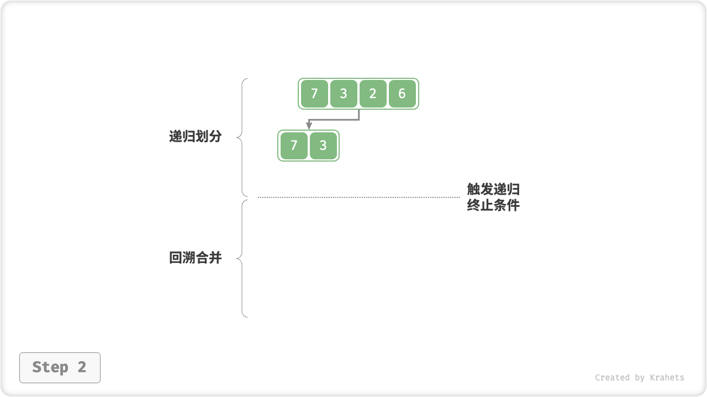
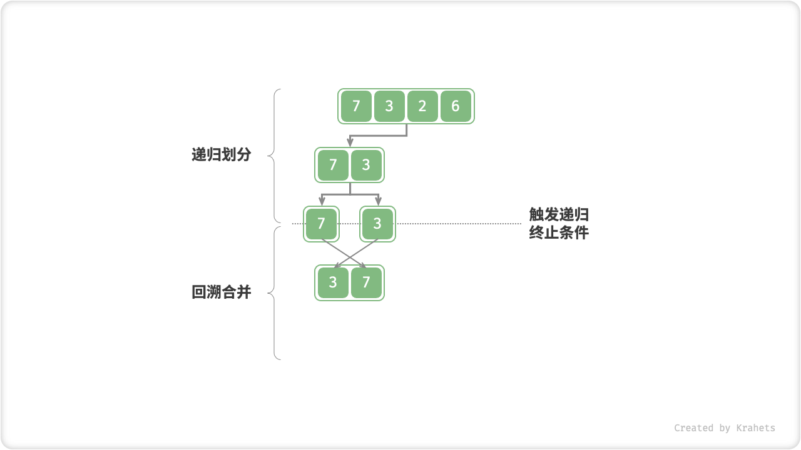
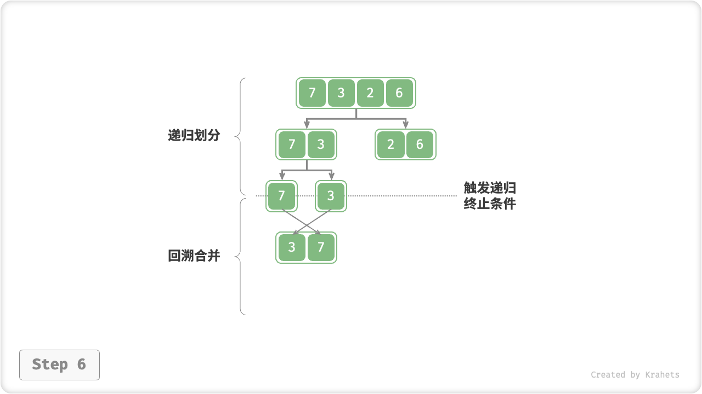
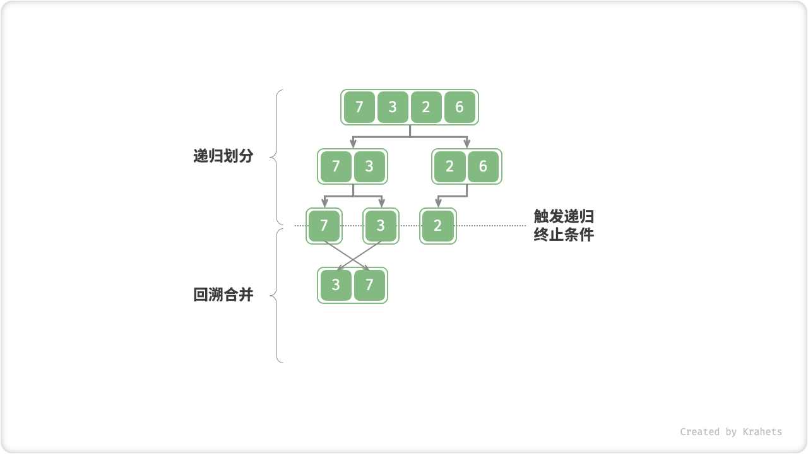
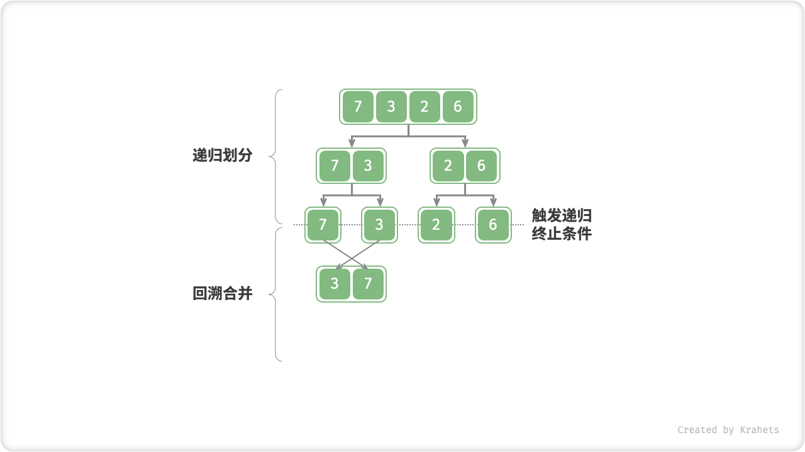
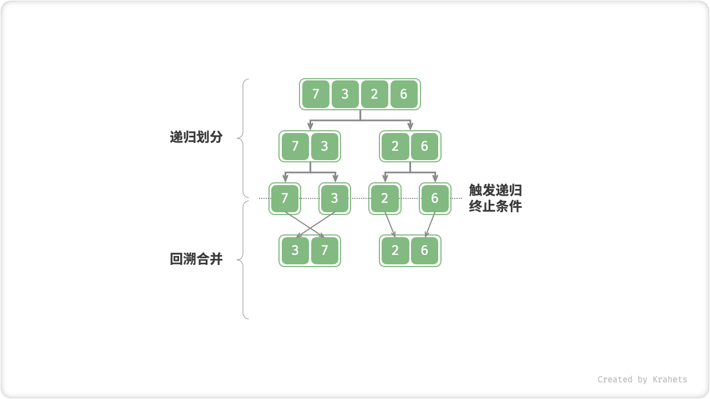

# 11.6. &nbsp; 归并排序

「归并排序 Merge Sort」基于分治思想实现排序，包含“划分”和“合并”两个阶段：

1. **划分阶段**：通过递归不断地将数组从中点处分开，将长数组的排序问题转换为短数组的排序问题。
2. **合并阶段**：当子数组长度为 1 时终止划分，开始合并，持续地将左右两个较短的有序数组合并为一个较长的有序数组，直至结束。


<p align="center"> Fig. 归并排序的划分与合并阶段 </p>

## 11.6.1. &nbsp; 算法流程

“划分阶段”从顶至底递归地将数组从中点切为两个子数组：

1. 计算数组中点 `mid` ，递归划分左子数组（区间 `[left, mid]` ）和右子数组（区间 `[mid + 1, right]` ）。
2. 递归执行步骤 `1.` ，直至子数组区间长度为 1 时，终止递归划分。

“合并阶段”从底至顶地将左子数组和右子数组合并为一个有序数组。需要注意的是，从长度为 1 的子数组开始合并，合并阶段中的每个子数组都是有序的。

=== "<1>"
    

=== "<2>"
    

=== "<3>"
    

=== "<4>"
    

=== "<5>"
    

=== "<6>"
    

=== "<7>"
    

=== "<8>"
    

=== "<9>"
    

=== "<10>"
    

观察发现，归并排序的递归顺序与二叉树的后序遍历相同，具体来看：

- **后序遍历**：先递归左子树，再递归右子树，最后处理根节点。
- **归并排序**：先递归左子数组，再递归右子数组，最后处理合并。

=== "Java"

    ```java title="merge_sort.java"
    /* 合并左子数组和右子数组 */
    // 左子数组区间 [left, mid]
    // 右子数组区间 [mid + 1, right]
    void merge(int[] nums, int left, int mid, int right) {
        // 初始化辅助数组
        int[] tmp = Arrays.copyOfRange(nums, left, right + 1);
        // 左子数组的起始索引和结束索引
        int leftStart = left - left, leftEnd = mid - left;
        // 右子数组的起始索引和结束索引
        int rightStart = mid + 1 - left, rightEnd = right - left;
        // i, j 分别指向左子数组、右子数组的首元素
        int i = leftStart, j = rightStart;
        // 通过覆盖原数组 nums 来合并左子数组和右子数组
        for (int k = left; k <= right; k++) {
            // 若“左子数组已全部合并完”，则选取右子数组元素，并且 j++
            if (i > leftEnd)
                nums[k] = tmp[j++];
            // 否则，若“右子数组已全部合并完”或“左子数组元素 <= 右子数组元素”，则选取左子数组元素，并且 i++
            else if (j > rightEnd || tmp[i] <= tmp[j])
                nums[k] = tmp[i++];
            // 否则，若“左右子数组都未全部合并完”且“左子数组元素 > 右子数组元素”，则选取右子数组元素，并且 j++
            else
                nums[k] = tmp[j++];
        }
    }

    /* 归并排序 */
    void mergeSort(int[] nums, int left, int right) {
        // 终止条件
        if (left >= right)
            return;                      // 当子数组长度为 1 时终止递归
        // 划分阶段
        int mid = (left + right) / 2;    // 计算中点
        mergeSort(nums, left, mid);      // 递归左子数组
        mergeSort(nums, mid + 1, right); // 递归右子数组
        // 合并阶段
        merge(nums, left, mid, right);
    }
    ```

=== "C++"

    ```cpp title="merge_sort.cpp"
    /* 合并左子数组和右子数组 */
    // 左子数组区间 [left, mid]
    // 右子数组区间 [mid + 1, right]
    void merge(vector<int> &nums, int left, int mid, int right) {
        // 初始化辅助数组
        vector<int> tmp(nums.begin() + left, nums.begin() + right + 1);
        // 左子数组的起始索引和结束索引
        int leftStart = left - left, leftEnd = mid - left;
        // 右子数组的起始索引和结束索引
        int rightStart = mid + 1 - left, rightEnd = right - left;
        // i, j 分别指向左子数组、右子数组的首元素
        int i = leftStart, j = rightStart;
        // 通过覆盖原数组 nums 来合并左子数组和右子数组
        for (int k = left; k <= right; k++) {
            // 若“左子数组已全部合并完”，则选取右子数组元素，并且 j++
            if (i > leftEnd)
                nums[k] = tmp[j++];
            // 否则，若“右子数组已全部合并完”或“左子数组元素 <= 右子数组元素”，则选取左子数组元素，并且 i++
            else if (j > rightEnd || tmp[i] <= tmp[j])
                nums[k] = tmp[i++];
            // 否则，若“左右子数组都未全部合并完”且“左子数组元素 > 右子数组元素”，则选取右子数组元素，并且 j++
            else
                nums[k] = tmp[j++];
        }
    }

    /* 归并排序 */
    void mergeSort(vector<int> &nums, int left, int right) {
        // 终止条件
        if (left >= right)
            return; // 当子数组长度为 1 时终止递归
        // 划分阶段
        int mid = (left + right) / 2;    // 计算中点
        mergeSort(nums, left, mid);      // 递归左子数组
        mergeSort(nums, mid + 1, right); // 递归右子数组
        // 合并阶段
        merge(nums, left, mid, right);
    }
    ```

=== "Python"

    ```python title="merge_sort.py"
    def merge(nums: list[int], left: int, mid: int, right: int):
        """合并左子数组和右子数组"""
        # 左子数组区间 [left, mid]
        # 右子数组区间 [mid + 1, right]
        # 初始化辅助数组
        tmp = list(nums[left : right + 1])
        # 左子数组的起始索引和结束索引
        left_start = 0
        left_end = mid - left
        # 右子数组的起始索引和结束索引
        right_start = mid + 1 - left
        right_end = right - left
        # i, j 分别指向左子数组、右子数组的首元素
        i = left_start
        j = right_start
        # 通过覆盖原数组 nums 来合并左子数组和右子数组
        for k in range(left, right + 1):
            # 若“左子数组已全部合并完”，则选取右子数组元素，并且 j++
            if i > left_end:
                nums[k] = tmp[j]
                j += 1
            # 否则，若“右子数组已全部合并完”或“左子数组元素 <= 右子数组元素”，则选取左子数组元素，并且 i++
            elif j > right_end or tmp[i] <= tmp[j]:
                nums[k] = tmp[i]
                i += 1
            # 否则，若“左右子数组都未全部合并完”且“左子数组元素 > 右子数组元素”，则选取右子数组元素，并且 j++
            else:
                nums[k] = tmp[j]
                j += 1

    def merge_sort(nums: list[int], left: int, right: int):
        """归并排序"""
        # 终止条件
        if left >= right:
            return  # 当子数组长度为 1 时终止递归
        # 划分阶段
        mid = (left + right) // 2  # 计算中点
        merge_sort(nums, left, mid)  # 递归左子数组
        merge_sort(nums, mid + 1, right)  # 递归右子数组
        # 合并阶段
        merge(nums, left, mid, right)
    ```

=== "Go"

    ```go title="merge_sort.go"
    /* 合并左子数组和右子数组 */
    // 左子数组区间 [left, mid]
    // 右子数组区间 [mid + 1, right]
    func merge(nums []int, left, mid, right int) {
        // 初始化辅助数组 借助 copy 模块
        tmp := make([]int, right-left+1)
        for i := left; i <= right; i++ {
            tmp[i-left] = nums[i]
        }
        // 左子数组的起始索引和结束索引
        leftStart, leftEnd := left-left, mid-left
        // 右子数组的起始索引和结束索引
        rightStart, rightEnd := mid+1-left, right-left
        // i, j 分别指向左子数组、右子数组的首元素
        i, j := leftStart, rightStart
        // 通过覆盖原数组 nums 来合并左子数组和右子数组
        for k := left; k <= right; k++ {
            // 若“左子数组已全部合并完”，则选取右子数组元素，并且 j++
            if i > leftEnd {
                nums[k] = tmp[j]
                j++
                // 否则，若“右子数组已全部合并完”或“左子数组元素 <= 右子数组元素”，则选取左子数组元素，并且 i++
            } else if j > rightEnd || tmp[i] <= tmp[j] {
                nums[k] = tmp[i]
                i++
                // 否则，若“左右子数组都未全部合并完”且“左子数组元素 > 右子数组元素”，则选取右子数组元素，并且 j++
            } else {
                nums[k] = tmp[j]
                j++
            }
        }
    }

    /* 归并排序 */
    func mergeSort(nums []int, left, right int) {
        // 终止条件
        if left >= right {
            return
        }
        // 划分阶段
        mid := (left + right) / 2
        mergeSort(nums, left, mid)
        mergeSort(nums, mid+1, right)
        // 合并阶段
        merge(nums, left, mid, right)
    }
    ```

=== "JavaScript"

    ```javascript title="merge_sort.js"
    /* 合并左子数组和右子数组 */
    // 左子数组区间 [left, mid]
    // 右子数组区间 [mid + 1, right]
    function merge(nums, left, mid, right) {
        // 初始化辅助数组
        let tmp = nums.slice(left, right + 1);
        // 左子数组的起始索引和结束索引
        let leftStart = left - left,
            leftEnd = mid - left;
        // 右子数组的起始索引和结束索引
        let rightStart = mid + 1 - left,
            rightEnd = right - left;
        // i, j 分别指向左子数组、右子数组的首元素
        let i = leftStart,
            j = rightStart;
        // 通过覆盖原数组 nums 来合并左子数组和右子数组
        for (let k = left; k <= right; k++) {
            if (i > leftEnd) {
                // 若“左子数组已全部合并完”，则选取右子数组元素，并且 j++
                nums[k] = tmp[j++];
            } else if (j > rightEnd || tmp[i] <= tmp[j]) {
                // 否则，若“右子数组已全部合并完”或“左子数组元素 <= 右子数组元素”，则选取左子数组元素，并且 i++
                nums[k] = tmp[i++];
            } else {
                // 否则，若“左右子数组都未全部合并完”且“左子数组元素 > 右子数组元素”，则选取右子数组元素，并且 j++
                nums[k] = tmp[j++];
            }
        }
    }

    /* 归并排序 */
    function mergeSort(nums, left, right) {
        // 终止条件
        if (left >= right) return; // 当子数组长度为 1 时终止递归
        // 划分阶段
        let mid = Math.floor((left + right) / 2); // 计算中点
        mergeSort(nums, left, mid); // 递归左子数组
        mergeSort(nums, mid + 1, right); // 递归右子数组
        // 合并阶段
        merge(nums, left, mid, right);
    }
    ```

=== "TypeScript"

    ```typescript title="merge_sort.ts"
    /* 合并左子数组和右子数组 */
    // 左子数组区间 [left, mid]
    // 右子数组区间 [mid + 1, right]
    function merge(nums: number[], left: number, mid: number, right: number): void {
        // 初始化辅助数组
        let tmp = nums.slice(left, right + 1);
        // 左子数组的起始索引和结束索引
        let leftStart = left - left,
            leftEnd = mid - left;
        // 右子数组的起始索引和结束索引
        let rightStart = mid + 1 - left,
            rightEnd = right - left;
        // i, j 分别指向左子数组、右子数组的首元素
        let i = leftStart,
            j = rightStart;
        // 通过覆盖原数组 nums 来合并左子数组和右子数组
        for (let k = left; k <= right; k++) {
            if (i > leftEnd) {
                // 若“左子数组已全部合并完”，则选取右子数组元素，并且 j++
                nums[k] = tmp[j++];
                // 否则，若“右子数组已全部合并完”或“左子数组元素 <= 右子数组元素”，则选取左子数组元素，并且 i++
            } else if (j > rightEnd || tmp[i] <= tmp[j]) {
                nums[k] = tmp[i++];
                // 否则，若“左右子数组都未全部合并完”且“左子数组元素 > 右子数组元素”，则选取右子数组元素，并且 j++
            } else {
                nums[k] = tmp[j++];
            }
        }
    }

    /* 归并排序 */
    function mergeSort(nums: number[], left: number, right: number): void {
        // 终止条件
        if (left >= right) return; // 当子数组长度为 1 时终止递归
        // 划分阶段
        let mid = Math.floor((left + right) / 2); // 计算中点
        mergeSort(nums, left, mid); // 递归左子数组
        mergeSort(nums, mid + 1, right); // 递归右子数组
        // 合并阶段
        merge(nums, left, mid, right);
    }
    ```

=== "C"

    ```c title="merge_sort.c"
    /* 合并左子数组和右子数组 */
    // 左子数组区间 [left, mid]
    // 右子数组区间 [mid + 1, right]
    void merge(int *nums, int left, int mid, int right) {
        int index;
        // 初始化辅助数组
        int tmp[right + 1 - left];
        for (index = left; index < right + 1; index++) {
            tmp[index - left] = nums[index];
        }
        // 左子数组的起始索引和结束索引
        int leftStart = left - left, leftEnd = mid - left;
        // 右子数组的起始索引和结束索引
        int rightStart = mid + 1 - left, rightEnd = right - left;
        // i, j 分别指向左子数组、右子数组的首元素
        int i = leftStart, j = rightStart;
        // 通过覆盖原数组 nums 来合并左子数组和右子数组
        for (int k = left; k <= right; k++) {
            // 若“左子数组已全部合并完”，则选取右子数组元素，并且 j++
            if (i > leftEnd)
                nums[k] = tmp[j++];
            // 否则，若“右子数组已全部合并完”或“左子数组元素 <= 右子数组元素”，则选取左子数组元素，并且 i++
            else if (j > rightEnd || tmp[i] <= tmp[j])
                nums[k] = tmp[i++];
            // 否则，若“左右子数组都未全部合并完”且“左子数组元素 > 右子数组元素”，则选取右子数组元素，并且 j++
            else
                nums[k] = tmp[j++];
        }
    }

    /* 归并排序 */
    void mergeSort(int *nums, int left, int right) {
        // 终止条件
        if (left >= right)
            return; // 当子数组长度为 1 时终止递归
        // 划分阶段
        int mid = (left + right) / 2;    // 计算中点
        mergeSort(nums, left, mid);      // 递归左子数组
        mergeSort(nums, mid + 1, right); // 递归右子数组
        // 合并阶段
        merge(nums, left, mid, right);
    }
    ```

=== "C#"

    ```csharp title="merge_sort.cs"
    /* 合并左子数组和右子数组 */
    // 左子数组区间 [left, mid]
    // 右子数组区间 [mid + 1, right]
    void merge(int[] nums, int left, int mid, int right) {
        // 初始化辅助数组
        int[] tmp = nums[left..(right + 1)];
        // 左子数组的起始索引和结束索引  
        int leftStart = left - left, leftEnd = mid - left;
        // 右子数组的起始索引和结束索引       
        int rightStart = mid + 1 - left, rightEnd = right - left;
        // i, j 分别指向左子数组、右子数组的首元素
        int i = leftStart, j = rightStart;
        // 通过覆盖原数组 nums 来合并左子数组和右子数组
        for (int k = left; k <= right; k++) {
            // 若“左子数组已全部合并完”，则选取右子数组元素，并且 j++
            if (i > leftEnd)
                nums[k] = tmp[j++];
            // 否则，若“右子数组已全部合并完”或“左子数组元素 <= 右子数组元素”，则选取左子数组元素，并且 i++
            else if (j > rightEnd || tmp[i] <= tmp[j])
                nums[k] = tmp[i++];
            // 否则，若“左右子数组都未全部合并完”且“左子数组元素 > 右子数组元素”，则选取右子数组元素，并且 j++
            else
                nums[k] = tmp[j++];
        }
    }

    /* 归并排序 */
    void mergeSort(int[] nums, int left, int right) {
        // 终止条件
        if (left >= right) return;       // 当子数组长度为 1 时终止递归
        // 划分阶段
        int mid = (left + right) / 2;    // 计算中点
        mergeSort(nums, left, mid);      // 递归左子数组
        mergeSort(nums, mid + 1, right); // 递归右子数组
        // 合并阶段
        merge(nums, left, mid, right);
    }
    ```

=== "Swift"

    ```swift title="merge_sort.swift"
    /* 合并左子数组和右子数组 */
    // 左子数组区间 [left, mid]
    // 右子数组区间 [mid + 1, right]
    func merge(nums: inout [Int], left: Int, mid: Int, right: Int) {
        // 初始化辅助数组
        let tmp = Array(nums[left ..< (right + 1)])
        // 左子数组的起始索引和结束索引
        let leftStart = left - left
        let leftEnd = mid - left
        // 右子数组的起始索引和结束索引
        let rightStart = mid + 1 - left
        let rightEnd = right - left
        // i, j 分别指向左子数组、右子数组的首元素
        var i = leftStart
        var j = rightStart
        // 通过覆盖原数组 nums 来合并左子数组和右子数组
        for k in left ... right {
            // 若“左子数组已全部合并完”，则选取右子数组元素，并且 j++
            if i > leftEnd {
                nums[k] = tmp[j]
                j += 1
            }
            // 否则，若“右子数组已全部合并完”或“左子数组元素 <= 右子数组元素”，则选取左子数组元素，并且 i++
            else if j > rightEnd || tmp[i] <= tmp[j] {
                nums[k] = tmp[i]
                i += 1
            }
            // 否则，若“左右子数组都未全部合并完”且“左子数组元素 > 右子数组元素”，则选取右子数组元素，并且 j++
            else {
                nums[k] = tmp[j]
                j += 1
            }
        }
    }

    /* 归并排序 */
    func mergeSort(nums: inout [Int], left: Int, right: Int) {
        // 终止条件
        if left >= right { // 当子数组长度为 1 时终止递归
            return
        }
        // 划分阶段
        let mid = (left + right) / 2 // 计算中点
        mergeSort(nums: &nums, left: left, right: mid) // 递归左子数组
        mergeSort(nums: &nums, left: mid + 1, right: right) // 递归右子数组
        // 合并阶段
        merge(nums: &nums, left: left, mid: mid, right: right)
    }
    ```

=== "Zig"

    ```zig title="merge_sort.zig"
    // 合并左子数组和右子数组
    // 左子数组区间 [left, mid]
    // 右子数组区间 [mid + 1, right]
    fn merge(nums: []i32, left: usize, mid: usize, right: usize) !void {
        // 初始化辅助数组
        var mem_arena = std.heap.ArenaAllocator.init(std.heap.page_allocator);
        defer mem_arena.deinit();
        const mem_allocator = mem_arena.allocator();
        var tmp = try mem_allocator.alloc(i32, right + 1 - left);
        std.mem.copy(i32, tmp, nums[left..right+1]);
        // 左子数组的起始索引和结束索引  
        var leftStart = left - left;
        var leftEnd = mid - left;
        // 右子数组的起始索引和结束索引       
        var rightStart = mid + 1 - left;
        var rightEnd = right - left;
        // i, j 分别指向左子数组、右子数组的首元素
        var i = leftStart;
        var j = rightStart;
        // 通过覆盖原数组 nums 来合并左子数组和右子数组
        var k = left;
        while (k <= right) : (k += 1) {
            // 若“左子数组已全部合并完”，则选取右子数组元素，并且 j++
            if (i > leftEnd) {
                nums[k] = tmp[j];
                j += 1;
            // 否则，若“右子数组已全部合并完”或“左子数组元素 <= 右子数组元素”，则选取左子数组元素，并且 i++
            } else if  (j > rightEnd or tmp[i] <= tmp[j]) {
                nums[k] = tmp[i];
                i += 1;
            // 否则，若“左右子数组都未全部合并完”且“左子数组元素 > 右子数组元素”，则选取右子数组元素，并且 j++
            } else {
                nums[k] = tmp[j];
                j += 1;
            }
        }
    }

    // 归并排序
    fn mergeSort(nums: []i32, left: usize, right: usize) !void {
        // 终止条件
        if (left >= right) return;              // 当子数组长度为 1 时终止递归
        // 划分阶段
        var mid = (left + right) / 2;           // 计算中点
        try mergeSort(nums, left, mid);         // 递归左子数组
        try mergeSort(nums, mid + 1, right);    // 递归右子数组
        // 合并阶段
        try merge(nums, left, mid, right);
    }
    ```

=== "Dart"

    ```dart title="merge_sort.dart"
    /* 合并左子数组和右子数组 */
    // 左子数组区间 [left, mid]
    // 右子数组区间 [mid + 1, right]
    void merge(List<int> nums, int left, int mid, int right) {
      // 初始化辅助数组
      List<int> tmp = nums.sublist(left, right + 1);
      // 左子数组的起始索引和结束索引
      int leftStart = left - left, leftEnd = mid - left;
      // 右子数组的起始索引和结束索引
      int rightStart = mid + 1 - left, rightEnd = right - left;
      // i, j 分别指向左子数组、右子数组的首元素
      int i = leftStart, j = rightStart;
      // 通过覆盖原数组 nums 来合并左子数组和右子数组
      for (int k = left; k <= right; k++) {
        // 若“左子数组已全部合并完”，则选取右子数组元素，并且 j++
        if (i > leftEnd)
          nums[k] = tmp[j++];
        // 否则，若“右子数组已全部合并完”或“左子数组元素 <= 右子数组元素”，则选取左子数组元素，并且 i++
        else if (j > rightEnd || tmp[i] <= tmp[j])
          nums[k] = tmp[i++];
        // 否则，若“左右子数组都未全部合并完”且“左子数组元素 > 右子数组元素”，则选取右子数组元素，并且 j++
        else
          nums[k] = tmp[j++];
      }
    }

    /* 归并排序 */
    void mergeSort(List<int> nums, int left, int right) {
      // 终止条件
      if (left >= right) return; // 当子数组长度为 1 时终止递归
      // 划分阶段
      int mid = (left + right) ~/ 2; // 计算中点
      mergeSort(nums, left, mid); // 递归左子数组
      mergeSort(nums, mid + 1, right); // 递归右子数组
      // 合并阶段
      merge(nums, left, mid, right);
    }
    ```

=== "Rust"

    ```rust title="merge_sort.rs"
    /* 合并左子数组和右子数组 */
    // 左子数组区间 [left, mid]
    // 右子数组区间 [mid + 1, right]
    fn merge(nums: &mut [i32], left: usize, mid: usize, right: usize) {
        // 初始化辅助数组
        let tmp: Vec<i32> = nums[left..right + 1].to_vec();
        // 左子数组的起始索引和结束索引
        let (left_start, left_end) = (left - left, mid - left);
        // 右子数组的起始索引和结束索引
        let (right_start, right_end) = (mid + 1 - left, right-left);
        // i, j 分别指向左子数组、右子数组的首元素
        let (mut l_corrent, mut r_corrent) = (left_start, right_start);
        // 通过覆盖原数组 nums 来合并左子数组和右子数组
        for k in left..right + 1 {
            // 若“左子数组已全部合并完”，则选取右子数组元素，并且 j++
            if l_corrent > left_end {
                nums[k] = tmp[r_corrent];
                r_corrent += 1;
            }
            // 否则，若“右子数组已全部合并完”或“左子数组元素 <= 右子数组元素”，则选取左子数组元素，并且 i++
            else if r_corrent > right_end || tmp[l_corrent] <= tmp[r_corrent] {
                nums[k] = tmp[l_corrent];
                l_corrent += 1;
            }
            // 否则，若“左右子数组都未全部合并完”且“左子数组元素 > 右子数组元素”，则选取右子数组元素，并且 j++
            else {
                nums[k] = tmp[r_corrent];
                r_corrent += 1;
            }
        }
    }

    /* 归并排序 */
    fn merge_sort(left: usize, right: usize, nums: &mut [i32]) {
        // 终止条件
        if left >= right { return; }       // 当子数组长度为 1 时终止递归
        // 划分阶段
        let mid = (left + right) / 2;     // 计算中点
        merge_sort(left, mid, nums);      // 递归左子数组
        merge_sort(mid + 1, right, nums);  // 递归右子数组
        // 合并阶段
        merge(nums, left, mid, right);
    }
    ```

合并方法 `merge()` 代码中的难点包括：

- **在阅读代码时，需要特别注意各个变量的含义**。`nums` 的待合并区间为 `[left, right]` ，但由于 `tmp` 仅复制了 `nums` 该区间的元素，因此 `tmp` 对应区间为 `[0, right - left]` 。
- 在比较 `tmp[i]` 和 `tmp[j]` 的大小时，**还需考虑子数组遍历完成后的索引越界问题**，即 `i > leftEnd` 和 `j > rightEnd` 的情况。索引越界的优先级是最高的，如果左子数组已经被合并完了，那么不需要继续比较，直接合并右子数组元素即可。

## 11.6.2. &nbsp; 算法特性

- **时间复杂度 $O(n \log n)$ 、非自适应排序** ：划分产生高度为 $\log n$ 的递归树，每层合并的总操作数量为 $n$ ，因此总体时间复杂度为 $O(n \log n)$ 。
- **空间复杂度 $O(n)$ 、非原地排序** ：递归深度为 $\log n$ ，使用 $O(\log n)$ 大小的栈帧空间。合并操作需要借助辅助数组实现，使用 $O(n)$ 大小的额外空间。
- **稳定排序**：在合并过程中，相等元素的次序保持不变。

## 11.6.3. &nbsp; 链表排序 *

归并排序在排序链表时具有显著优势，空间复杂度可以优化至 $O(1)$ ，原因如下：

- 由于链表仅需改变指针就可实现节点的增删操作，因此合并阶段（将两个短有序链表合并为一个长有序链表）无需创建辅助链表。
- 通过使用“迭代划分”替代“递归划分”，可省去递归使用的栈帧空间。

具体实现细节比较复杂，有兴趣的同学可以查阅相关资料进行学习。
