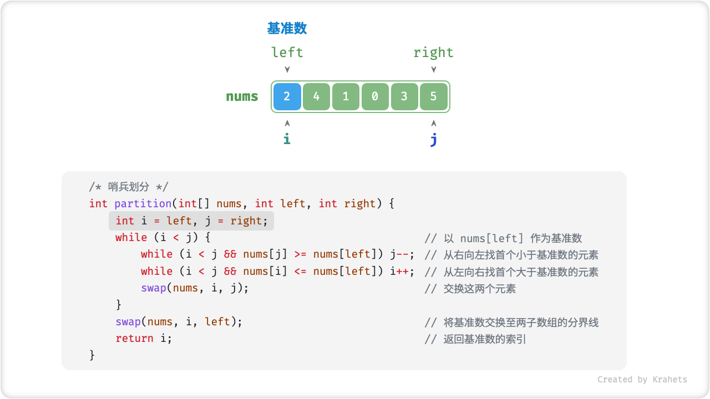
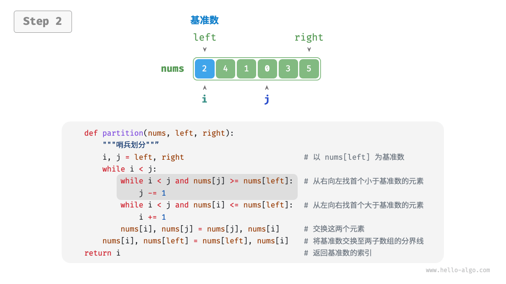
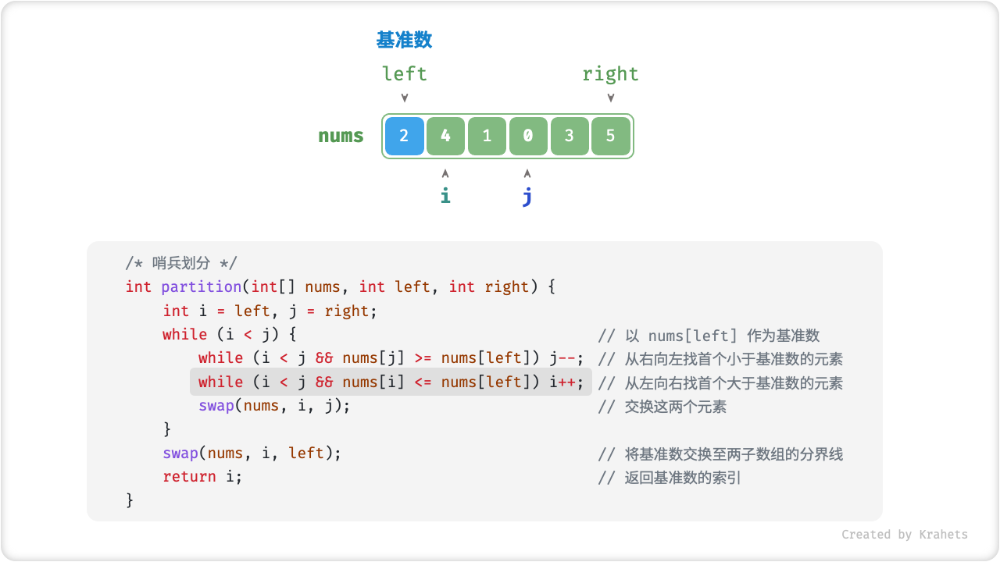
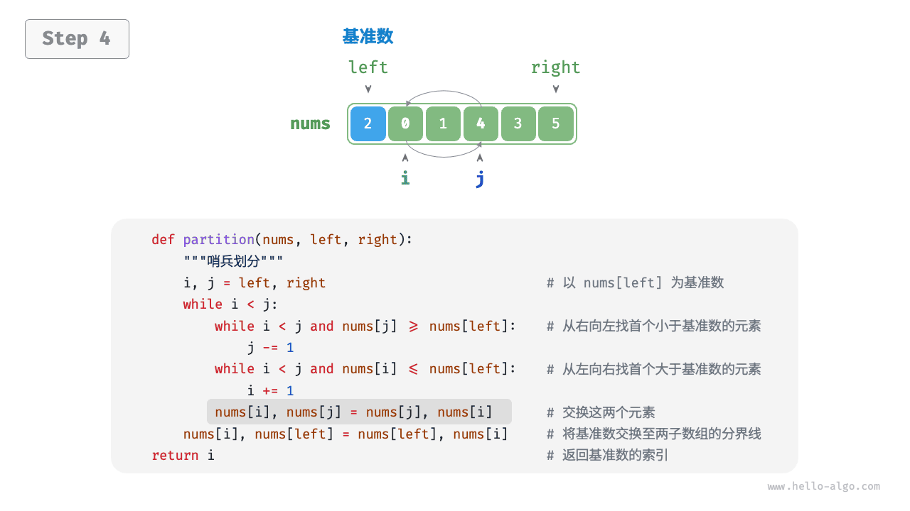
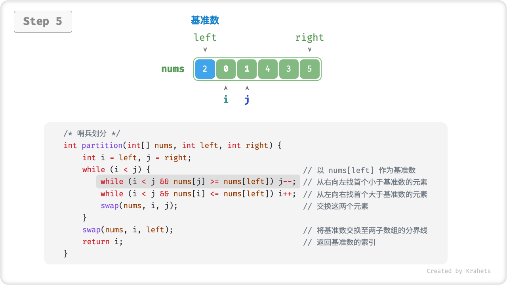
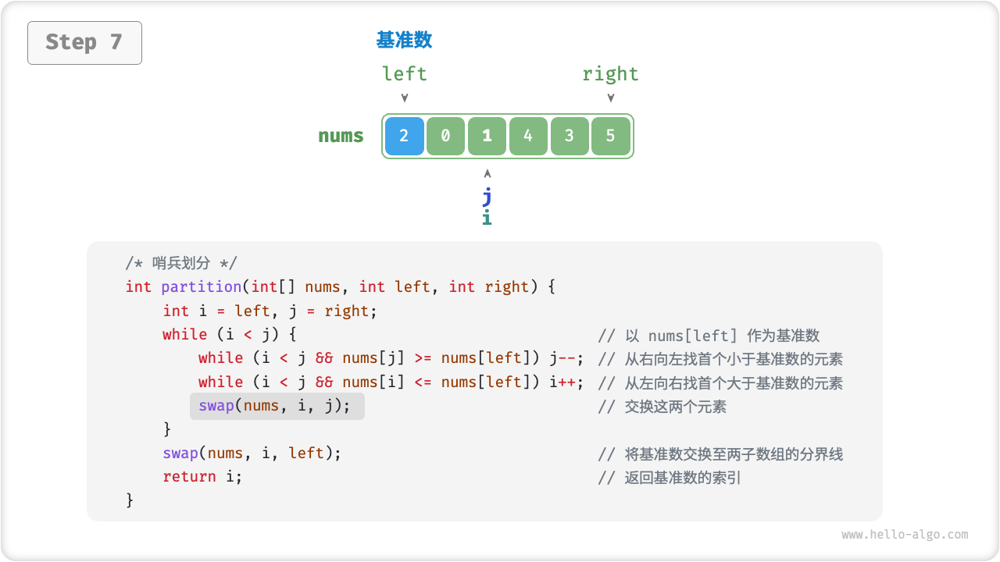
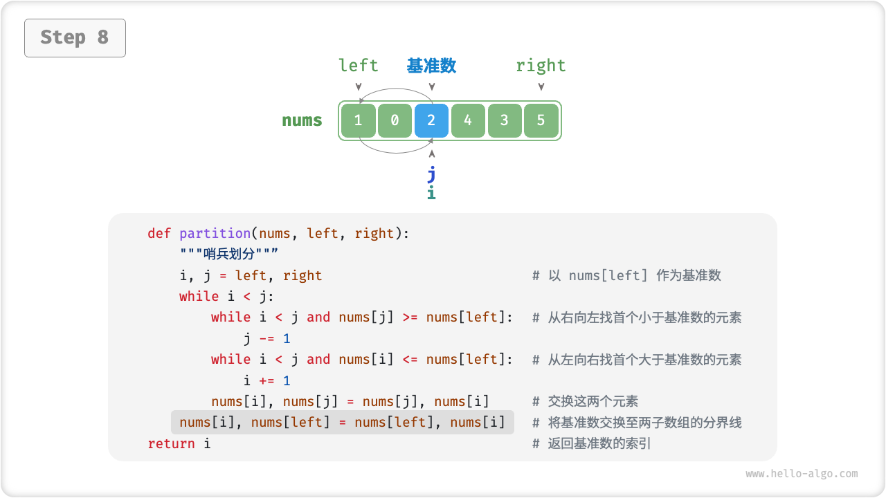
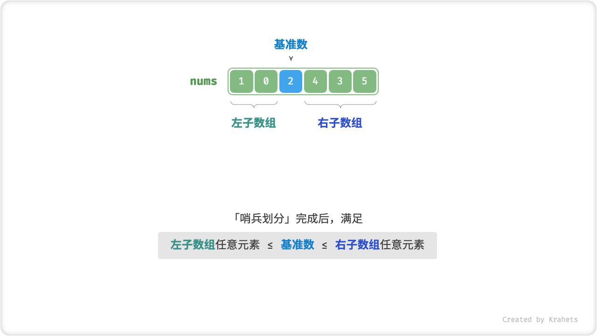

# 11.5. &nbsp; 快速排序

「快速排序 Quick Sort」是一种基于分治思想的排序算法，运行高效，应用广泛。

快速排序的核心操作是「哨兵划分」，其目标是：选择数组中的某个元素作为“基准数”，将所有小于基准数的元素移到其左侧，而大于基准数的元素移到其右侧。具体来说，哨兵划分的流程为：

1. 选取数组最左端元素作为基准数，初始化两个指针 `i` 和 `j` 分别指向数组的两端；
2. 设置一个循环，在每轮中使用 `i`（`j`）分别寻找第一个比基准数大（小）的元素，然后交换这两个元素；
3. 循环执行步骤 `2.` ，直到 `i` 和 `j` 相遇时停止，最后将基准数交换至两个子数组的分界线；

哨兵划分完成后，原数组被划分成三部分：左子数组、基准数、右子数组，且满足“左子数组任意元素 $\leq$ 基准数 $\leq$ 右子数组任意元素”。因此，我们接下来只需对这两个子数组进行排序。

=== "<1>"
    

=== "<2>"
    

=== "<3>"
    

=== "<4>"
    

=== "<5>"
    

=== "<6>"
    

=== "<7>"
    

=== "<8>"
    

=== "<9>"
    

!!! note "快速排序的分治思想"

    哨兵划分的实质是将一个较长数组的排序问题简化为两个较短数组的排序问题。

=== "Java"

    ```java title="quick_sort.java"
    /* 元素交换 */
    void swap(int[] nums, int i, int j) {
        int tmp = nums[i];
        nums[i] = nums[j];
        nums[j] = tmp;
    }

    /* 哨兵划分 */
    int partition(int[] nums, int left, int right) {
        // 以 nums[left] 作为基准数
        int i = left, j = right;
        while (i < j) {
            while (i < j && nums[j] >= nums[left])
                j--;          // 从右向左找首个小于基准数的元素
            while (i < j && nums[i] <= nums[left])
                i++;          // 从左向右找首个大于基准数的元素
            swap(nums, i, j); // 交换这两个元素
        }
        swap(nums, i, left);  // 将基准数交换至两子数组的分界线
        return i;             // 返回基准数的索引
    }
    ```

=== "C++"

    ```cpp title="quick_sort.cpp"
    /* 元素交换 */
    void swap(vector<int> &nums, int i, int j) {
        int tmp = nums[i];
        nums[i] = nums[j];
        nums[j] = tmp;
    }

    /* 哨兵划分 */
    int partition(vector<int> &nums, int left, int right) {
        // 以 nums[left] 作为基准数
        int i = left, j = right;
        while (i < j) {
            while (i < j && nums[j] >= nums[left])
                j--; // 从右向左找首个小于基准数的元素
            while (i < j && nums[i] <= nums[left])
                i++;          // 从左向右找首个大于基准数的元素
            swap(nums, i, j); // 交换这两个元素
        }
        swap(nums, i, left); // 将基准数交换至两子数组的分界线
        return i;            // 返回基准数的索引
    }
    ```

=== "Python"

    ```python title="quick_sort.py"
    def partition(self, nums: list[int], left: int, right: int) -> int:
        """哨兵划分"""
        # 以 nums[left] 作为基准数
        i, j = left, right
        while i < j:
            while i < j and nums[j] >= nums[left]:
                j -= 1  # 从右向左找首个小于基准数的元素
            while i < j and nums[i] <= nums[left]:
                i += 1  # 从左向右找首个大于基准数的元素
            # 元素交换
            nums[i], nums[j] = nums[j], nums[i]
        # 将基准数交换至两子数组的分界线
        nums[i], nums[left] = nums[left], nums[i]
        return i  # 返回基准数的索引
    ```

=== "Go"

    ```go title="quick_sort.go"
    /* 哨兵划分 */
    func (q *quickSort) partition(nums []int, left, right int) int {
        // 以 nums[left] 作为基准数
        i, j := left, right
        for i < j {
            for i < j && nums[j] >= nums[left] {
                j-- // 从右向左找首个小于基准数的元素
            }
            for i < j && nums[i] <= nums[left] {
                i++ // 从左向右找首个大于基准数的元素
            }
            // 元素交换
            nums[i], nums[j] = nums[j], nums[i]
        }
        // 将基准数交换至两子数组的分界线
        nums[i], nums[left] = nums[left], nums[i]
        return i // 返回基准数的索引
    }
    ```

=== "JavaScript"

    ```javascript title="quick_sort.js"
    /* 元素交换 */
    swap(nums, i, j) {
        let tmp = nums[i];
        nums[i] = nums[j];
        nums[j] = tmp;
    }

    /* 哨兵划分 */
    partition(nums, left, right) {
        // 以 nums[left] 作为基准数
        let i = left,
            j = right;
        while (i < j) {
            while (i < j && nums[j] >= nums[left]) {
                j -= 1; // 从右向左找首个小于基准数的元素
            }
            while (i < j && nums[i] <= nums[left]) {
                i += 1; // 从左向右找首个大于基准数的元素
            }
            // 元素交换
            this.swap(nums, i, j); // 交换这两个元素
        }
        this.swap(nums, i, left); // 将基准数交换至两子数组的分界线
        return i; // 返回基准数的索引
    }
    ```

=== "TypeScript"

    ```typescript title="quick_sort.ts"
    /* 元素交换 */
    swap(nums: number[], i: number, j: number): void {
        let tmp = nums[i];
        nums[i] = nums[j];
        nums[j] = tmp;
    }

    /* 哨兵划分 */
    partition(nums: number[], left: number, right: number): number {
        // 以 nums[left] 作为基准数
        let i = left,
            j = right;
        while (i < j) {
            while (i < j && nums[j] >= nums[left]) {
                j -= 1; // 从右向左找首个小于基准数的元素
            }
            while (i < j && nums[i] <= nums[left]) {
                i += 1; // 从左向右找首个大于基准数的元素
            }
            // 元素交换
            this.swap(nums, i, j); // 交换这两个元素
        }
        this.swap(nums, i, left); // 将基准数交换至两子数组的分界线
        return i; // 返回基准数的索引
    }
    ```

=== "C"

    ```c title="quick_sort.c"
    /* 元素交换 */
    void swap(int nums[], int i, int j) {
        int tmp = nums[i];
        nums[i] = nums[j];
        nums[j] = tmp;
    }

    /* 快速排序类 */
    // 快速排序类-哨兵划分
    int partition(int nums[], int left, int right) {
        // 以 nums[left] 作为基准数
        int i = left, j = right;
        while (i < j) {
            while (i < j && nums[j] >= nums[left]) {
                // 从右向左找首个小于基准数的元素
                j--;
            }
            while (i < j && nums[i] <= nums[left]) {
                // 从左向右找首个大于基准数的元素
                i++;
            }
            // 交换这两个元素
            swap(nums, i, j);
        }
        // 将基准数交换至两子数组的分界线
        swap(nums, i, left);
        // 返回基准数的索引
        return i;
    }
    ```

=== "C#"

    ```csharp title="quick_sort.cs"
    /* 元素交换 */
    void swap(int[] nums, int i, int j) {
        int tmp = nums[i];
        nums[i] = nums[j];
        nums[j] = tmp;
    }

    /* 哨兵划分 */
    int partition(int[] nums, int left, int right) {
        // 以 nums[left] 作为基准数
        int i = left, j = right;
        while (i < j) {
            while (i < j && nums[j] >= nums[left])
                j--;          // 从右向左找首个小于基准数的元素
            while (i < j && nums[i] <= nums[left])
                i++;          // 从左向右找首个大于基准数的元素
            swap(nums, i, j); // 交换这两个元素
        }
        swap(nums, i, left);  // 将基准数交换至两子数组的分界线
        return i;             // 返回基准数的索引
    }
    ```

=== "Swift"

    ```swift title="quick_sort.swift"
    /* 元素交换 */
    func swap(nums: inout [Int], i: Int, j: Int) {
        let tmp = nums[i]
        nums[i] = nums[j]
        nums[j] = tmp
    }

    /* 哨兵划分 */
    func partition(nums: inout [Int], left: Int, right: Int) -> Int {
        // 以 nums[left] 作为基准数
        var i = left
        var j = right
        while i < j {
            while i < j, nums[j] >= nums[left] {
                j -= 1 // 从右向左找首个小于基准数的元素
            }
            while i < j, nums[i] <= nums[left] {
                i += 1 // 从左向右找首个大于基准数的元素
            }
            swap(nums: &nums, i: i, j: j) // 交换这两个元素
        }
        swap(nums: &nums, i: i, j: left) // 将基准数交换至两子数组的分界线
        return i // 返回基准数的索引
    }
    ```

=== "Zig"

    ```zig title="quick_sort.zig"
    // 元素交换
    fn swap(nums: []i32, i: usize, j: usize) void {
        var tmp = nums[i];
        nums[i] = nums[j];
        nums[j] = tmp;
    }

    // 哨兵划分
    fn partition(nums: []i32, left: usize, right: usize) usize {
        // 以 nums[left] 作为基准数
        var i = left;
        var j = right;
        while (i < j) {
            while (i < j and nums[j] >= nums[left]) j -= 1; // 从右向左找首个小于基准数的元素
            while (i < j and nums[i] <= nums[left]) i += 1; // 从左向右找首个大于基准数的元素
            swap(nums, i, j);   // 交换这两个元素
        }
        swap(nums, i, left);    // 将基准数交换至两子数组的分界线
        return i;               // 返回基准数的索引
    }
    ```

## 11.5.1. &nbsp; 算法流程

1. 首先，对原数组执行一次「哨兵划分」，得到未排序的左子数组和右子数组；
2. 然后，对左子数组和右子数组分别递归执行「哨兵划分」；
3. 持续递归，直至子数组长度为 1 时终止，从而完成整个数组的排序；


<p align="center"> Fig. 快速排序流程 </p>

=== "Java"

    ```java title="quick_sort.java"
    /* 快速排序 */
    void quickSort(int[] nums, int left, int right) {
        // 子数组长度为 1 时终止递归
        if (left >= right)
            return;
        // 哨兵划分
        int pivot = partition(nums, left, right);
        // 递归左子数组、右子数组
        quickSort(nums, left, pivot - 1);
        quickSort(nums, pivot + 1, right);
    }
    ```

=== "C++"

    ```cpp title="quick_sort.cpp"
    /* 快速排序 */
    void quickSort(vector<int> &nums, int left, int right) {
        // 子数组长度为 1 时终止递归
        if (left >= right)
            return;
        // 哨兵划分
        int pivot = partition(nums, left, right);
        // 递归左子数组、右子数组
        quickSort(nums, left, pivot - 1);
        quickSort(nums, pivot + 1, right);
    }
    ```

=== "Python"

    ```python title="quick_sort.py"
    def quick_sort(self, nums: list[int], left: int, right: int) -> None:
        """快速排序"""
        # 子数组长度为 1 时终止递归
        if left >= right:
            return
        # 哨兵划分
        pivot = self.partition(nums, left, right)
        # 递归左子数组、右子数组
        self.quick_sort(nums, left, pivot - 1)
        self.quick_sort(nums, pivot + 1, right)
    ```

=== "Go"

    ```go title="quick_sort.go"
    /* 快速排序 */
    func (q *quickSort) quickSort(nums []int, left, right int) {
        // 子数组长度为 1 时终止递归
        if left >= right {
            return
        }
        // 哨兵划分
        pivot := q.partition(nums, left, right)
        // 递归左子数组、右子数组
        q.quickSort(nums, left, pivot-1)
        q.quickSort(nums, pivot+1, right)
    }
    ```

=== "JavaScript"

    ```javascript title="quick_sort.js"
    /* 快速排序 */
    quickSort(nums, left, right) {
        // 子数组长度为 1 时终止递归
        if (left >= right) return;
        // 哨兵划分
        const pivot = this.partition(nums, left, right);
        // 递归左子数组、右子数组
        this.quickSort(nums, left, pivot - 1);
        this.quickSort(nums, pivot + 1, right);
    }
    ```

=== "TypeScript"

    ```typescript title="quick_sort.ts"
    /* 快速排序 */
    quickSort(nums: number[], left: number, right: number): void {
        // 子数组长度为 1 时终止递归
        if (left >= right) {
            return;
        }
        // 哨兵划分
        const pivot = this.partition(nums, left, right);
        // 递归左子数组、右子数组
        this.quickSort(nums, left, pivot - 1);
        this.quickSort(nums, pivot + 1, right);
    }
    ```

=== "C"

    ```c title="quick_sort.c"
    /* 快速排序类 */
    // 快速排序类-哨兵划分
    int partition(int nums[], int left, int right) {
        // 以 nums[left] 作为基准数
        int i = left, j = right;
        while (i < j) {
            while (i < j && nums[j] >= nums[left]) {
                // 从右向左找首个小于基准数的元素
                j--;
            }
            while (i < j && nums[i] <= nums[left]) {
                // 从左向右找首个大于基准数的元素
                i++;
            }
            // 交换这两个元素
            swap(nums, i, j);
        }
        // 将基准数交换至两子数组的分界线
        swap(nums, i, left);
        // 返回基准数的索引
        return i;
    }

    // 快速排序类-快速排序
    void quickSort(int nums[], int left, int right) {
        // 子数组长度为 1 时终止递归
        if (left >= right) {
            return;
        }
        // 哨兵划分
        int pivot = partition(nums, left, right);
        // 递归左子数组、右子数组
        quickSort(nums, left, pivot - 1);
        quickSort(nums, pivot + 1, right);
    }
    ```

=== "C#"

    ```csharp title="quick_sort.cs"
    /* 快速排序 */
    void quickSort(int[] nums, int left, int right) {
        // 子数组长度为 1 时终止递归
        if (left >= right)
            return;
        // 哨兵划分
        int pivot = partition(nums, left, right);
        // 递归左子数组、右子数组
        quickSort(nums, left, pivot - 1);
        quickSort(nums, pivot + 1, right);
    }
    ```

=== "Swift"

    ```swift title="quick_sort.swift"
    /* 快速排序 */
    func quickSort(nums: inout [Int], left: Int, right: Int) {
        // 子数组长度为 1 时终止递归
        if left >= right {
            return
        }
        // 哨兵划分
        let pivot = partition(nums: &nums, left: left, right: right)
        // 递归左子数组、右子数组
        quickSort(nums: &nums, left: left, right: pivot - 1)
        quickSort(nums: &nums, left: pivot + 1, right: right)
    }
    ```

=== "Zig"

    ```zig title="quick_sort.zig"
    // 快速排序
    fn quickSort(nums: []i32, left: usize, right: usize) void {
        // 子数组长度为 1 时终止递归
        if (left >= right) return;
        // 哨兵划分
        var pivot = partition(nums, left, right);
        // 递归左子数组、右子数组
        quickSort(nums, left, pivot - 1);
        quickSort(nums, pivot + 1, right);
    }
    ```

## 11.5.2. &nbsp; 算法特性

- **时间复杂度 $O(n \log n)$ 、自适应排序** ：在平均情况下，哨兵划分的递归层数为 $\log n$ ，每层中的总循环数为 $n$ ，总体使用 $O(n \log n)$ 时间。在最差情况下，每轮哨兵划分操作都将长度为 $n$ 的数组划分为长度为 $0$ 和 $n - 1$ 的两个子数组，此时递归层数达到 $n$ 层，每层中的循环数为 $n$ ，总体使用 $O(n^2)$ 时间。
- **空间复杂度 $O(n)$ 、原地排序** ：在输入数组完全倒序的情况下，达到最差递归深度 $n$ ，使用 $O(n)$ 栈帧空间。排序操作是在原数组上进行的，未借助额外数组。
- **非稳定排序**：在哨兵划分的最后一步，基准数可能会被交换至相等元素的右侧。

## 11.5.3. &nbsp; 快排为什么快？

从名称上就能看出，快速排序在效率方面应该具有一定的优势。尽管快速排序的平均时间复杂度与「归并排序」和「堆排序」相同，但通常快速排序的效率更高，原因如下：

- **出现最差情况的概率很低**：虽然快速排序的最差时间复杂度为 $O(n^2)$ ，没有归并排序稳定，但在绝大多数情况下，快速排序能在 $O(n \log n)$ 的时间复杂度下运行。
- **缓存使用效率高**：在执行哨兵划分操作时，系统可将整个子数组加载到缓存，因此访问元素的效率较高。而像「堆排序」这类算法需要跳跃式访问元素，从而缺乏这一特性。
- **复杂度的常数系数低**：在上述三种算法中，快速排序的比较、赋值、交换等操作的总数量最少。这与「插入排序」比「冒泡排序」更快的原因类似。

## 11.5.4. &nbsp; 基准数优化

**快速排序在某些输入下的时间效率可能降低**。举一个极端例子，假设输入数组是完全倒序的，由于我们选择最左端元素作为基准数，那么在哨兵划分完成后，基准数被交换至数组最右端，导致左子数组长度为 $n - 1$ 、右子数组长度为 $0$ 。如此递归下去，每轮哨兵划分后的右子数组长度都为 $0$ ，分治策略失效，快速排序退化为「冒泡排序」。

为了尽量避免这种情况发生，**我们可以优化哨兵划分中的基准数的选取策略**。例如，我们可以随机选取一个元素作为基准数。然而，如果运气不佳，每次都选到不理想的基准数，效率仍然不尽如人意。

需要注意的是，编程语言通常生成的是“伪随机数”。如果我们针对伪随机数序列构建一个特定的测试样例，那么快速排序的效率仍然可能劣化。

为了进一步改进，我们可以在数组中选取三个候选元素（通常为数组的首、尾、中点元素），**并将这三个候选元素的中位数作为基准数**。这样一来，基准数“既不太小也不太大”的概率将大幅提升。当然，我们还可以选取更多候选元素，以进一步提高算法的稳健性。采用这种方法后，时间复杂度劣化至 $O(n^2)$ 的概率大大降低。

=== "Java"

    ```java title="quick_sort.java"
    /* 选取三个元素的中位数 */
    int medianThree(int[] nums, int left, int mid, int right) {
        // 此处使用异或运算来简化代码
        // 异或规则为 0 ^ 0 = 1 ^ 1 = 0, 0 ^ 1 = 1 ^ 0 = 1
        if ((nums[left] < nums[mid]) ^ (nums[left] < nums[right]))
            return left;
        else if ((nums[mid] < nums[left]) ^ (nums[mid] < nums[right]))
            return mid;
        else
            return right;
    }

    /* 哨兵划分（三数取中值） */
    int partition(int[] nums, int left, int right) {
        // 选取三个候选元素的中位数
        int med = medianThree(nums, left, (left + right) / 2, right);
        // 将中位数交换至数组最左端
        swap(nums, left, med);
        // 以 nums[left] 作为基准数
        int i = left, j = right;
        while (i < j) {
            while (i < j && nums[j] >= nums[left])
                j--;          // 从右向左找首个小于基准数的元素
            while (i < j && nums[i] <= nums[left])
                i++;          // 从左向右找首个大于基准数的元素
            swap(nums, i, j); // 交换这两个元素
        }
        swap(nums, i, left);  // 将基准数交换至两子数组的分界线
        return i;             // 返回基准数的索引
    }
    ```

=== "C++"

    ```cpp title="quick_sort.cpp"
    /* 选取三个元素的中位数 */
    int medianThree(vector<int> &nums, int left, int mid, int right) {
        // 此处使用异或运算来简化代码
        // 异或规则为 0 ^ 0 = 1 ^ 1 = 0, 0 ^ 1 = 1 ^ 0 = 1
        if ((nums[left] < nums[mid]) ^ (nums[left] < nums[right]))
            return left;
        else if ((nums[mid] < nums[left]) ^ (nums[mid] < nums[right]))
            return mid;
        else
            return right;
    }

    /* 哨兵划分（三数取中值） */
    int partition(vector<int> &nums, int left, int right) {
        // 选取三个候选元素的中位数
        int med = medianThree(nums, left, (left + right) / 2, right);
        // 将中位数交换至数组最左端
        swap(nums, left, med);
        // 以 nums[left] 作为基准数
        int i = left, j = right;
        while (i < j) {
            while (i < j && nums[j] >= nums[left])
                j--; // 从右向左找首个小于基准数的元素
            while (i < j && nums[i] <= nums[left])
                i++;          // 从左向右找首个大于基准数的元素
            swap(nums, i, j); // 交换这两个元素
        }
        swap(nums, i, left); // 将基准数交换至两子数组的分界线
        return i;            // 返回基准数的索引
    }
    ```

=== "Python"

    ```python title="quick_sort.py"
    def median_three(self, nums: list[int], left: int, mid: int, right: int) -> int:
        """选取三个元素的中位数"""
        # 此处使用异或运算来简化代码
        # 异或规则为 0 ^ 0 = 1 ^ 1 = 0, 0 ^ 1 = 1 ^ 0 = 1
        if (nums[left] < nums[mid]) ^ (nums[left] < nums[right]):
            return left
        elif (nums[mid] < nums[left]) ^ (nums[mid] < nums[right]):
            return mid
        return right

    def partition(self, nums: list[int], left: int, right: int) -> int:
        """哨兵划分（三数取中值）"""
        # 以 nums[left] 作为基准数
        med = self.median_three(nums, left, (left + right) // 2, right)
        # 将中位数交换至数组最左端
        nums[left], nums[med] = nums[med], nums[left]
        # 以 nums[left] 作为基准数
        i, j = left, right
        while i < j:
            while i < j and nums[j] >= nums[left]:
                j -= 1  # 从右向左找首个小于基准数的元素
            while i < j and nums[i] <= nums[left]:
                i += 1  # 从左向右找首个大于基准数的元素
            # 元素交换
            nums[i], nums[j] = nums[j], nums[i]
        # 将基准数交换至两子数组的分界线
        nums[i], nums[left] = nums[left], nums[i]
        return i  # 返回基准数的索引
    ```

=== "Go"

    ```go title="quick_sort.go"
    /* 选取三个元素的中位数 */
    func (q *quickSortMedian) medianThree(nums []int, left, mid, right int) int {
        // 此处使用异或运算来简化代码（!= 在这里起到异或的作用）
        // 异或规则为 0 ^ 0 = 1 ^ 1 = 0, 0 ^ 1 = 1 ^ 0 = 1
        if (nums[left] < nums[mid]) != (nums[left] < nums[right]) {
            return left
        } else if (nums[mid] < nums[left]) != (nums[mid] < nums[right]) {
            return mid
        }
        return right
    }

    /* 哨兵划分（三数取中值）*/
    func (q *quickSortMedian) partition(nums []int, left, right int) int {
        // 以 nums[left] 作为基准数
        med := q.medianThree(nums, left, (left+right)/2, right)
        // 将中位数交换至数组最左端
        nums[left], nums[med] = nums[med], nums[left]
        // 以 nums[left] 作为基准数
        i, j := left, right
        for i < j {
            for i < j && nums[j] >= nums[left] {
                j-- //从右向左找首个小于基准数的元素
            }
            for i < j && nums[i] <= nums[left] {
                i++ //从左向右找首个大于基准数的元素
            }
            //元素交换
            nums[i], nums[j] = nums[j], nums[i]
        }
        //将基准数交换至两子数组的分界线
        nums[i], nums[left] = nums[left], nums[i]
        return i //返回基准数的索引
    }
    ```

=== "JavaScript"

    ```javascript title="quick_sort.js"
    /* 选取三个元素的中位数 */
    medianThree(nums, left, mid, right) {
        // 此处使用异或运算来简化代码
        // 异或规则为 0 ^ 0 = 1 ^ 1 = 0, 0 ^ 1 = 1 ^ 0 = 1
        if ((nums[left] < nums[mid]) ^ (nums[left] < nums[right])) return left;
        else if ((nums[mid] < nums[left]) ^ (nums[mid] < nums[right]))
            return mid;
        else return right;
    }

    /* 哨兵划分（三数取中值） */
    partition(nums, left, right) {
        // 选取三个候选元素的中位数
        let med = this.medianThree(
            nums,
            left,
            Math.floor((left + right) / 2),
            right
        );
        // 将中位数交换至数组最左端
        this.swap(nums, left, med);
        // 以 nums[left] 作为基准数
        let i = left,
            j = right;
        while (i < j) {
            while (i < j && nums[j] >= nums[left]) j--; // 从右向左找首个小于基准数的元素
            while (i < j && nums[i] <= nums[left]) i++; // 从左向右找首个大于基准数的元素
            this.swap(nums, i, j); // 交换这两个元素
        }
        this.swap(nums, i, left); // 将基准数交换至两子数组的分界线
        return i; // 返回基准数的索引
    }
    ```

=== "TypeScript"

    ```typescript title="quick_sort.ts"
    /* 选取三个元素的中位数 */
    medianThree(
        nums: number[],
        left: number,
        mid: number,
        right: number
    ): number {
        // 此处使用异或运算来简化代码
        // 异或规则为 0 ^ 0 = 1 ^ 1 = 0, 0 ^ 1 = 1 ^ 0 = 1
        if (Number(nums[left] < nums[mid]) ^ Number(nums[left] < nums[right])) {
            return left;
        } else if (
            Number(nums[mid] < nums[left]) ^ Number(nums[mid] < nums[right])
        ) {
            return mid;
        } else {
            return right;
        }
    }

    /* 哨兵划分（三数取中值） */
    partition(nums: number[], left: number, right: number): number {
        // 选取三个候选元素的中位数
        let med = this.medianThree(
            nums,
            left,
            Math.floor((left + right) / 2),
            right
        );
        // 将中位数交换至数组最左端
        this.swap(nums, left, med);
        // 以 nums[left] 作为基准数
        let i = left,
            j = right;
        while (i < j) {
            while (i < j && nums[j] >= nums[left]) {
                j--; // 从右向左找首个小于基准数的元素
            }
            while (i < j && nums[i] <= nums[left]) {
                i++; // 从左向右找首个大于基准数的元素
            }
            this.swap(nums, i, j); // 交换这两个元素
        }
        this.swap(nums, i, left); // 将基准数交换至两子数组的分界线
        return i; // 返回基准数的索引
    }
    ```

=== "C"

    ```c title="quick_sort.c"
    /* 快速排序类（中位基准数优化） */
    // 选取三个元素的中位数
    int medianThree(int nums[], int left, int mid, int right) {
        // 此处使用异或运算来简化代码
        // 异或规则为 0 ^ 0 = 1 ^ 1 = 0, 0 ^ 1 = 1 ^ 0 = 1
        if ((nums[left] < nums[mid]) ^ (nums[left] < nums[right]))
            return left;
        else if ((nums[mid] < nums[left]) ^ (nums[mid] < nums[right]))
            return mid;
        else
            return right;
    }

    /* 快速排序类（中位基准数优化） */
    // 选取三个元素的中位数
    int medianThree(int nums[], int left, int mid, int right) {
        // 此处使用异或运算来简化代码
        // 异或规则为 0 ^ 0 = 1 ^ 1 = 0, 0 ^ 1 = 1 ^ 0 = 1
        if ((nums[left] < nums[mid]) ^ (nums[left] < nums[right]))
            return left;
        else if ((nums[mid] < nums[left]) ^ (nums[mid] < nums[right]))
            return mid;
        else
            return right;
    }

    // 哨兵划分（三数取中值）
    int partitionMedian(int nums[], int left, int right) {
        // 选取三个候选元素的中位数
        int med = medianThree(nums, left, (left + right) / 2, right);
        // 将中位数交换至数组最左端
        swap(nums, left, med);
        // 以 nums[left] 作为基准数
        int i = left, j = right;
        while (i < j) {
            while (i < j && nums[j] >= nums[left])
                j--; // 从右向左找首个小于基准数的元素
            while (i < j && nums[i] <= nums[left])
                i++;          // 从左向右找首个大于基准数的元素
            swap(nums, i, j); // 交换这两个元素
        }
        swap(nums, i, left); // 将基准数交换至两子数组的分界线
        return i;            // 返回基准数的索引
    }
    ```

=== "C#"

    ```csharp title="quick_sort.cs"
    /* 选取三个元素的中位数 */
    int medianThree(int[] nums, int left, int mid, int right) {
        // 此处使用异或运算来简化代码
        // 异或规则为 0 ^ 0 = 1 ^ 1 = 0, 0 ^ 1 = 1 ^ 0 = 1
        if ((nums[left] < nums[mid]) ^ (nums[left] < nums[right]))
            return left;
        else if ((nums[mid] < nums[left]) ^ (nums[mid] < nums[right]))
            return mid;
        else
            return right;
    }

    /* 哨兵划分（三数取中值） */
    int partition(int[] nums, int left, int right) {
        // 选取三个候选元素的中位数
        int med = medianThree(nums, left, (left + right) / 2, right);
        // 将中位数交换至数组最左端
        swap(nums, left, med);
        // 以 nums[left] 作为基准数
        int i = left, j = right;
        while (i < j) {
            while (i < j && nums[j] >= nums[left])
                j--;          // 从右向左找首个小于基准数的元素
            while (i < j && nums[i] <= nums[left])
                i++;          // 从左向右找首个大于基准数的元素
            swap(nums, i, j); // 交换这两个元素
        }
        swap(nums, i, left);  // 将基准数交换至两子数组的分界线
        return i;             // 返回基准数的索引
    }
    ```

=== "Swift"

    ```swift title="quick_sort.swift"
    /* 选取三个元素的中位数 */
    func medianThree(nums: [Int], left: Int, mid: Int, right: Int) -> Int {
        if (nums[left] < nums[mid]) != (nums[left] < nums[right]) {
            return left
        } else if (nums[mid] < nums[left]) != (nums[mid] < nums[right]) {
            return mid
        } else {
            return right
        }
    }

    /* 哨兵划分（三数取中值） */
    func partitionMedian(nums: inout [Int], left: Int, right: Int) -> Int {
        // 选取三个候选元素的中位数
        let med = medianThree(nums: nums, left: left, mid: (left + right) / 2, right: right)
        // 将中位数交换至数组最左端
        swap(nums: &nums, i: left, j: med)
        return partition(nums: &nums, left: left, right: right)
    }
    ```

=== "Zig"

    ```zig title="quick_sort.zig"
    // 选取三个元素的中位数
    fn medianThree(nums: []i32, left: usize, mid: usize, right: usize) usize {
        // 此处使用异或运算来简化代码
        // 异或规则为 0 ^ 0 = 1 ^ 1 = 0, 0 ^ 1 = 1 ^ 0 = 1
        if ((nums[left] < nums[mid]) != (nums[left] < nums[right])) {
            return left;
        } else if ((nums[mid] < nums[left]) != (nums[mid] < nums[right])) {
            return mid;
        } else {
            return right;
        }
    }

    // 哨兵划分（三数取中值）
    fn partition(nums: []i32, left: usize, right: usize) usize {
        // 选取三个候选元素的中位数
        var med = medianThree(nums, left, (left + right) / 2, right);
        // 将中位数交换至数组最左端
        swap(nums, left, med);
        // 以 nums[left] 作为基准数
        var i = left;
        var j = right;
        while (i < j) {
            while (i < j and nums[j] >= nums[left]) j -= 1; // 从右向左找首个小于基准数的元素
            while (i < j and nums[i] <= nums[left]) i += 1; // 从左向右找首个大于基准数的元素
            swap(nums, i, j);   // 交换这两个元素
        }
        swap(nums, i, left);    // 将基准数交换至两子数组的分界线
        return i;               // 返回基准数的索引
    }
    ```

## 11.5.5. &nbsp; 尾递归优化

**在某些输入下，快速排序可能占用空间较多**。以完全倒序的输入数组为例，由于每轮哨兵划分后右子数组长度为 $0$ ，递归树的高度会达到 $n - 1$ ，此时需要占用 $O(n)$ 大小的栈帧空间。

为了防止栈帧空间的累积，我们可以在每轮哨兵排序完成后，比较两个子数组的长度，**仅对较短的子数组进行递归**。由于较短子数组的长度不会超过 $\frac{n}{2}$ ，因此这种方法能确保递归深度不超过 $\log n$ ，从而将最差空间复杂度优化至 $O(\log n)$ 。

=== "Java"

    ```java title="quick_sort.java"
    /* 快速排序（尾递归优化） */
    void quickSort(int[] nums, int left, int right) {
        // 子数组长度为 1 时终止
        while (left < right) {
            // 哨兵划分操作
            int pivot = partition(nums, left, right);
            // 对两个子数组中较短的那个执行快排
            if (pivot - left < right - pivot) {
                quickSort(nums, left, pivot - 1); // 递归排序左子数组
                left = pivot + 1; // 剩余未排序区间为 [pivot + 1, right]
            } else {
                quickSort(nums, pivot + 1, right); // 递归排序右子数组
                right = pivot - 1; // 剩余未排序区间为 [left, pivot - 1]
            }
        }
    }
    ```

=== "C++"

    ```cpp title="quick_sort.cpp"
    /* 快速排序（尾递归优化） */
    void quickSort(vector<int> &nums, int left, int right) {
        // 子数组长度为 1 时终止
        while (left < right) {
            // 哨兵划分操作
            int pivot = partition(nums, left, right);
            // 对两个子数组中较短的那个执行快排
            if (pivot - left < right - pivot) {
                quickSort(nums, left, pivot - 1); // 递归排序左子数组
                left = pivot + 1;                 // 剩余未排序区间为 [pivot + 1, right]
            } else {
                quickSort(nums, pivot + 1, right); // 递归排序右子数组
                right = pivot - 1;                 // 剩余未排序区间为 [left, pivot - 1]
            }
        }
    }
    ```

=== "Python"

    ```python title="quick_sort.py"
    def quick_sort(self, nums: list[int], left: int, right: int) -> None:
        """快速排序（尾递归优化）"""
        # 子数组长度为 1 时终止
        while left < right:
            # 哨兵划分操作
            pivot = self.partition(nums, left, right)
            # 对两个子数组中较短的那个执行快排
            if pivot - left < right - pivot:
                self.quick_sort(nums, left, pivot - 1)  # 递归排序左子数组
                left = pivot + 1  # 剩余未排序区间为 [pivot + 1, right]
            else:
                self.quick_sort(nums, pivot + 1, right)  # 递归排序右子数组
                right = pivot - 1  # 剩余未排序区间为 [left, pivot - 1]
    ```

=== "Go"

    ```go title="quick_sort.go"
    /* 快速排序（尾递归优化）*/
    func (q *quickSortTailCall) quickSort(nums []int, left, right int) {
        // 子数组长度为 1 时终止
        for left < right {
            // 哨兵划分操作
            pivot := q.partition(nums, left, right)
            // 对两个子数组中较短的那个执行快排
            if pivot-left < right-pivot {
                q.quickSort(nums, left, pivot-1) // 递归排序左子数组
                left = pivot + 1                 // 剩余未排序区间为 [pivot + 1, right]
            } else {
                q.quickSort(nums, pivot+1, right) // 递归排序右子数组
                right = pivot - 1                 // 剩余未排序区间为 [left, pivot - 1]
            }
        }
    }
    ```

=== "JavaScript"

    ```javascript title="quick_sort.js"
    /* 快速排序（尾递归优化） */
    quickSort(nums, left, right) {
        // 子数组长度为 1 时终止
        while (left < right) {
            // 哨兵划分操作
            let pivot = this.partition(nums, left, right);
            // 对两个子数组中较短的那个执行快排
            if (pivot - left < right - pivot) {
                this.quickSort(nums, left, pivot - 1); // 递归排序左子数组
                left = pivot + 1; // 剩余未排序区间为 [pivot + 1, right]
            } else {
                this.quickSort(nums, pivot + 1, right); // 递归排序右子数组
                right = pivot - 1; // 剩余未排序区间为 [left, pivot - 1]
            }
        }
    }
    ```

=== "TypeScript"

    ```typescript title="quick_sort.ts"
    /* 快速排序（尾递归优化） */
    quickSort(nums: number[], left: number, right: number): void {
        // 子数组长度为 1 时终止
        while (left < right) {
            // 哨兵划分操作
            let pivot = this.partition(nums, left, right);
            // 对两个子数组中较短的那个执行快排
            if (pivot - left < right - pivot) {
                this.quickSort(nums, left, pivot - 1); // 递归排序左子数组
                left = pivot + 1; // 剩余未排序区间为 [pivot + 1, right]
            } else {
                this.quickSort(nums, pivot + 1, right); // 递归排序右子数组
                right = pivot - 1; // 剩余未排序区间为 [left, pivot - 1]
            }
        }
    }
    ```

=== "C"

    ```c title="quick_sort.c"
    /* 快速排序类（尾递归优化） */
    // 快速排序（尾递归优化）
    void quickSortTailCall(int nums[], int left, int right) {
        // 子数组长度为 1 时终止
        while (left < right) {
            // 哨兵划分操作
            int pivot = partition(nums, left, right);
            // 对两个子数组中较短的那个执行快排
            if (pivot - left < right - pivot) {
                quickSortTailCall(nums, left, pivot - 1); // 递归排序左子数组
                left = pivot + 1;                         // 剩余未排序区间为 [pivot + 1, right]
            } else {
                quickSortTailCall(nums, pivot + 1, right); // 递归排序右子数组
                right = pivot - 1;                         // 剩余未排序区间为 [left, pivot - 1]
            }
        }
    }
    ```

=== "C#"

    ```csharp title="quick_sort.cs"
    /* 快速排序（尾递归优化） */
    void quickSort(int[] nums, int left, int right) {
        // 子数组长度为 1 时终止
        while (left < right) {
            // 哨兵划分操作
            int pivot = partition(nums, left, right);
            // 对两个子数组中较短的那个执行快排
            if (pivot - left < right - pivot) {
                quickSort(nums, left, pivot - 1);  // 递归排序左子数组
                left = pivot + 1;  // 剩余未排序区间为 [pivot + 1, right]
            } else {
                quickSort(nums, pivot + 1, right); // 递归排序右子数组
                right = pivot - 1; // 剩余未排序区间为 [left, pivot - 1]
            }
        }
    }
    ```

=== "Swift"

    ```swift title="quick_sort.swift"
    /* 快速排序（尾递归优化） */
    func quickSortTailCall(nums: inout [Int], left: Int, right: Int) {
        var left = left
        var right = right
        // 子数组长度为 1 时终止
        while left < right {
            // 哨兵划分操作
            let pivot = partition(nums: &nums, left: left, right: right)
            // 对两个子数组中较短的那个执行快排
            if (pivot - left) < (right - pivot) {
                quickSortTailCall(nums: &nums, left: left, right: pivot - 1) // 递归排序左子数组
                left = pivot + 1 // 剩余未排序区间为 [pivot + 1, right]
            } else {
                quickSortTailCall(nums: &nums, left: pivot + 1, right: right) // 递归排序右子数组
                right = pivot - 1 // 剩余未排序区间为 [left, pivot - 1]
            }
        }
    }
    ```

=== "Zig"

    ```zig title="quick_sort.zig"
    // 快速排序（尾递归优化）
    fn quickSort(nums: []i32, left_: usize, right_: usize) void {
        var left = left_;
        var right = right_;
        // 子数组长度为 1 时终止递归
        while (left < right) {
            // 哨兵划分操作
            var pivot = partition(nums, left, right);
            // 对两个子数组中较短的那个执行快排
            if (pivot - left < right - pivot) {
                quickSort(nums, left, pivot - 1);   // 递归排序左子数组
                left = pivot + 1;                   // 剩余未排序区间为 [pivot + 1, right]
            } else {
                quickSort(nums, pivot + 1, right);  // 递归排序右子数组
                right = pivot - 1;                  // 剩余未排序区间为 [left, pivot - 1]
            }
        }
    }
    ```

!!! question "哨兵划分中“从右往左查找”与“从左往右查找”的顺序可以交换吗？"

    不行，当我们以最左端元素为基准数时，必须先“从右往左查找”再“从左往右查找”。这个结论有些反直觉，我们来剖析一下原因。

    哨兵划分 `partition()` 的最后一步是交换 `nums[left]` 和 `nums[i]` 。完成交换后，基准数左边的元素都 `<=` 基准数，**这就要求最后一步交换前 `nums[left] >= nums[i]` 必须成立**。假设我们先“从左往右查找”，那么如果找不到比基准数更小的元素，**则会在 `i == j` 时跳出循环，此时可能 `nums[j] == nums[i] > nums[left]`**。也就是说，此时最后一步交换操作会把一个比基准数更大的元素交换至数组最左端，导致哨兵划分失败。

    举个例子，给定数组 `[0, 0, 0, 0, 1]` ，如果先“从左向右查找”，哨兵划分后数组为 `[1, 0, 0, 0, 0]` ，这个结果是不正确的。

    再深入思考一下，如果我们选择 `nums[right]` 为基准数，那么正好反过来，必须先“从左往右查找”。
