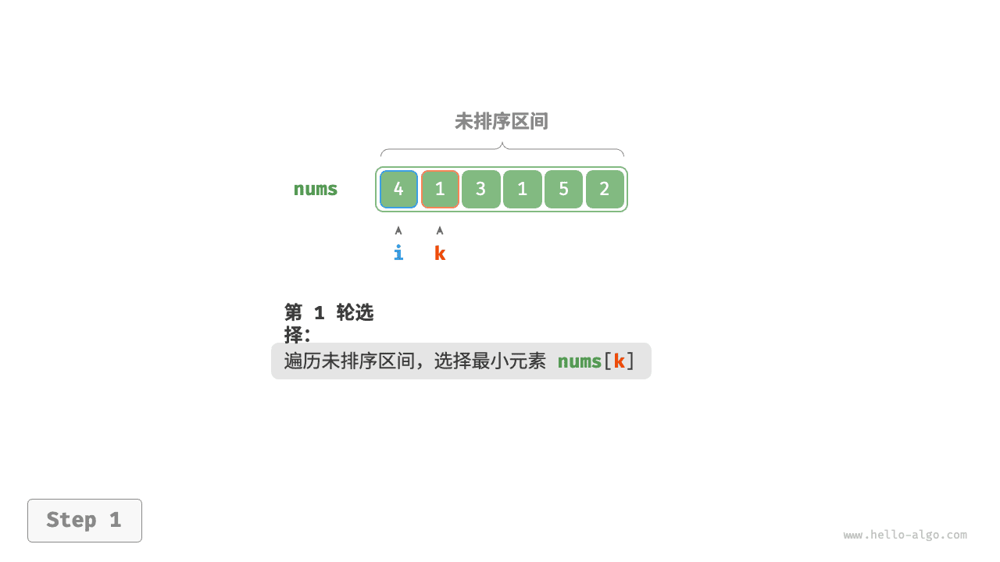
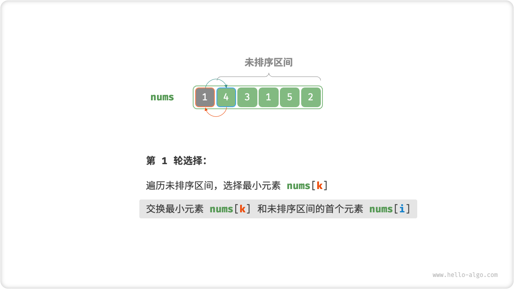
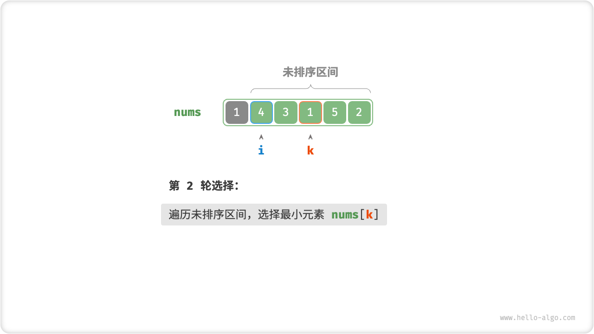
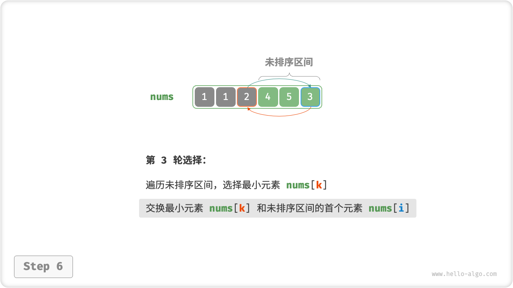
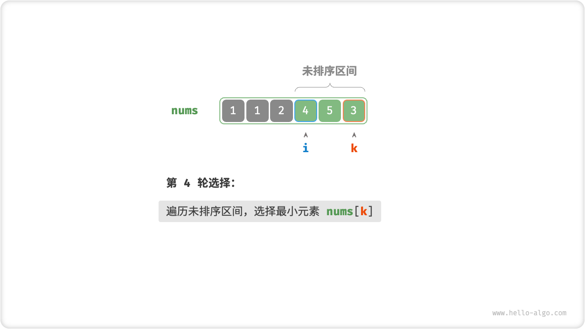
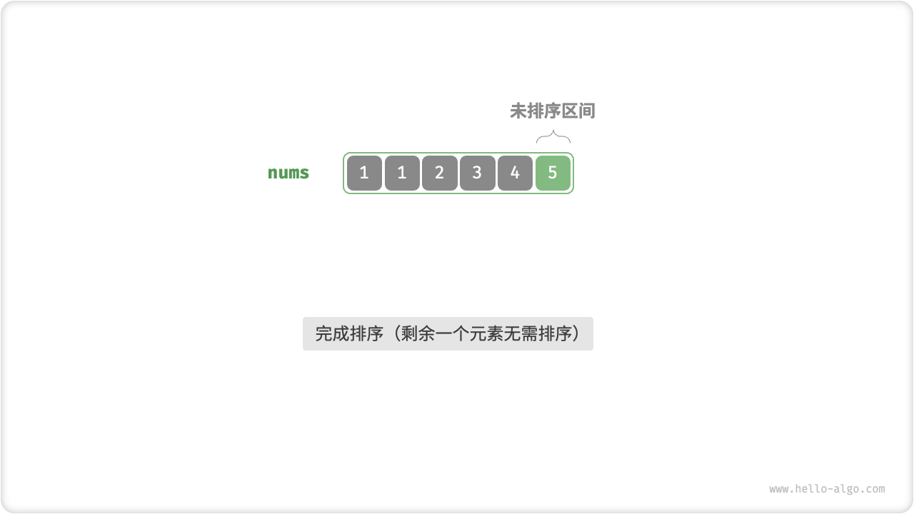
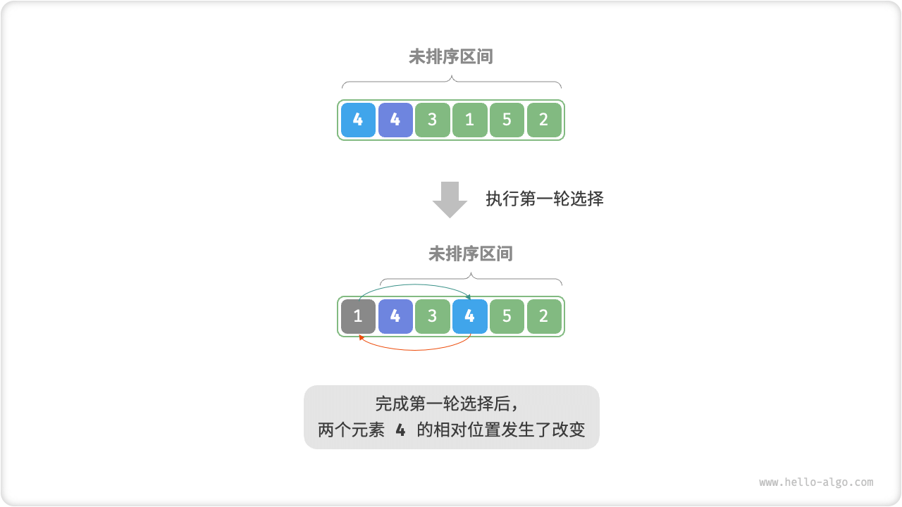

# 11.2. &nbsp; 选择排序

「选择排序 Selection Sort」的工作原理非常直接：开启一个循环，每轮从未排序区间选择最小的元素，将其放到已排序区间的末尾。

设数组的长度为 $n$ ，选择排序的算法流程如下：

1. 初始状态下，所有元素未排序，即未排序（索引）区间为 $[0, n-1]$ 。
2. 选取区间 $[0, n-1]$ 中的最小元素，将其与索引 $0$ 处元素交换。完成后，数组前 1 个元素已排序。
3. 选取区间 $[1, n-1]$ 中的最小元素，将其与索引 $1$ 处元素交换。完成后，数组前 2 个元素已排序。
4. 以此类推。经过 $n - 1$ 轮选择与交换后，数组前 $n - 1$ 个元素已排序。
5. 仅剩的一个元素必定是最大元素，无需排序，因此数组排序完成。

=== "<1>"
    

=== "<2>"
    

=== "<3>"
    

=== "<4>"
    

=== "<5>"
    

=== "<6>"
    

=== "<7>"
    

=== "<8>"
    

=== "<9>"
    

=== "<10>"
    

=== "<11>"
    

在代码中，我们用 $k$ 来记录未排序区间内的最小元素。

=== "Java"

    ```java title="selection_sort.java"
    /* 选择排序 */
    void selectionSort(int[] nums) {
        int n = nums.length;
        // 外循环：未排序区间为 [i, n-1]
        for (int i = 0; i < n - 1; i++) {
            // 内循环：找到未排序区间内的最小元素
            int k = i;
            for (int j = i + 1; j < n; j++) {
                if (nums[j] < nums[k])
                    k = j; // 记录最小元素的索引
            }
            // 将该最小元素与未排序区间的首个元素交换
            int temp = nums[i];
            nums[i] = nums[k];
            nums[k] = temp;
        }
    }
    ```

=== "C++"

    ```cpp title="selection_sort.cpp"
    /* 选择排序 */
    void selectionSort(vector<int> &nums) {
        int n = nums.size();
        // 外循环：未排序区间为 [i, n-1]
        for (int i = 0; i < n - 1; i++) {
            // 内循环：找到未排序区间内的最小元素
            int k = i;
            for (int j = i + 1; j < n; j++) {
                if (nums[j] < nums[k])
                    k = j; // 记录最小元素的索引
            }
            // 将该最小元素与未排序区间的首个元素交换
            swap(nums[i], nums[k]);
        }
    }
    ```

=== "Python"

    ```python title="selection_sort.py"
    def selection_sort(nums: list[int]):
        """选择排序"""
        n = len(nums)
        # 外循环：未排序区间为 [i, n-1]
        for i in range(n - 1):
            # 内循环：找到未排序区间内的最小元素
            k = i
            for j in range(i + 1, n):
                if nums[j] < nums[k]:
                    k = j  # 记录最小元素的索引
            # 将该最小元素与未排序区间的首个元素交换
            nums[i], nums[k] = nums[k], nums[i]
    ```

=== "Go"

    ```go title="selection_sort.go"
    /* 选择排序 */
    func selectionSort(nums []int) {
        n := len(nums)
        // 外循环：未排序区间为 [i, n-1]
        for i := 0; i < n-1; i++ {
            // 内循环：找到未排序区间内的最小元素
            k := i
            for j := i + 1; j < n; j++ {
                if nums[j] < nums[k] {
                    // 记录最小元素的索引
                    k = j
                }
            }
            // 将该最小元素与未排序区间的首个元素交换
            nums[i], nums[k] = nums[k], nums[i]

        }
    }
    ```

=== "JavaScript"

    ```javascript title="selection_sort.js"
    /* 选择排序 */
    function selectionSort(nums) {
        let n = nums.length;
        // 外循环：未排序区间为 [i, n-1]
        for (let i = 0; i < n - 1; i++) {
            // 内循环：找到未排序区间内的最小元素
            let k = i;
            for (let j = i + 1; j < n; j++) {
                if (nums[j] < nums[k]) {
                    k = j; // 记录最小元素的索引
                }
            }
            // 将该最小元素与未排序区间的首个元素交换
            [nums[i], nums[k]] = [nums[k], nums[i]];
        }
    }
    ```

=== "TypeScript"

    ```typescript title="selection_sort.ts"
    /* 选择排序 */
    function selectionSort(nums: number[]): void {
        let n = nums.length;
        // 外循环：未排序区间为 [i, n-1]
        for (let i = 0; i < n - 1; i++) {
            // 内循环：找到未排序区间内的最小元素
            let k = i;
            for (let j = i + 1; j < n; j++) {
                if (nums[j] < nums[k]) {
                    k = j; // 记录最小元素的索引
                }
            }
            // 将该最小元素与未排序区间的首个元素交换
            [nums[i], nums[k]] = [nums[k], nums[i]];
        }
    }
    ```

=== "C"

    ```c title="selection_sort.c"
    /* 选择排序 */
    void selectionSort(int nums[], int n) {
        // 外循环：未排序区间为 [i, n-1]
        for (int i = 0; i < n - 1; i++) {
            // 内循环：找到未排序区间内的最小元素
            int k = i;
            for (int j = i + 1; j < n; j++) {
                if (nums[j] < nums[k])
                    k = j;  // 记录最小元素的索引
            }
            // 将该最小元素与未排序区间的首个元素交换
            int temp = nums[i];
            nums[i] = nums[k];
            nums[k] = temp;
        }
    }
    ```

=== "C#"

    ```csharp title="selection_sort.cs"
    /* 选择排序 */
    void selectionSort(int[] nums) {
        int n = nums.Length;
        // 外循环：未排序区间为 [i, n-1]
        for (int i = 0; i < n - 1; i++) {
            // 内循环：找到未排序区间内的最小元素
            int k = i;
            for (int j = i + 1; j < n; j++) {
                if (nums[j] < nums[k])
                    k = j; // 记录最小元素的索引
            }
            // 将该最小元素与未排序区间的首个元素交换
            (nums[k], nums[i]) = (nums[i], nums[k]);
        }
    }
    ```

=== "Swift"

    ```swift title="selection_sort.swift"
    /* 选择排序 */
    func selectionSort(nums: inout [Int]) {
        // 外循环：未排序区间为 [i, n-1]
        for i in nums.indices.dropLast() {
            // 内循环：找到未排序区间内的最小元素
            var k = i
            for j in nums.indices.dropFirst(i + 1) {
                if nums[j] < nums[k] {
                    k = j // 记录最小元素的索引
                }
            }
            // 将该最小元素与未排序区间的首个元素交换
            nums.swapAt(i, k)
        }
    }
    ```

=== "Zig"

    ```zig title="selection_sort.zig"
    [class]{}-[func]{selectionSort}
    ```

=== "Dart"

    ```dart title="selection_sort.dart"
    /* 选择排序 */
    void selectionSort(List<int> nums) {
      int n = nums.length;
      // 外循环：未排序区间为 [i, n-1]
      for (int i = 0; i < n - 1; i++) {
        // 内循环：找到未排序区间内的最小元素
        int k = i;
        for (int j = i + 1; j < n; j++) {
          if (nums[j] < nums[k]) k = j; // 记录最小元素的索引
        }
        // 将该最小元素与未排序区间的首个元素交换
        int temp = nums[i];
        nums[i] = nums[k];
        nums[k] = temp;
      }
    }
    ```

=== "Rust"

    ```rust title="selection_sort.rs"
    /* 选择排序 */
    fn selection_sort(nums: &mut [i32]) {
        let n = nums.len();
        // 外循环：未排序区间为 [i, n-1]
        for i in 0..n-1 {
            // 内循环：找到未排序区间内的最小元素
            let mut k = i;
            for j in i+1..n {
                if nums[j] < nums[k] {
                    k = j; // 记录最小元素的索引
                }
            }
            // 将该最小元素与未排序区间的首个元素交换
            nums.swap(i, k);
        }
    }
    ```

## 11.2.1. &nbsp; 算法特性

- **时间复杂度为 $O(n^2)$ 、非自适应排序**：外循环共 $n - 1$ 轮，第一轮的未排序区间长度为 $n$ ，最后一轮的未排序区间长度为 $2$ ，即各轮外循环分别包含 $n$ , $n - 1$ , $\cdots$ , $2$ 轮内循环，求和为 $\frac{(n - 1)(n + 2)}{2}$ 。
- **空间复杂度 $O(1)$ 、原地排序**：指针 $i$ , $j$ 使用常数大小的额外空间。
- **非稳定排序**：在交换元素时，有可能将 `nums[i]` 交换至其相等元素的右边，导致两者的相对顺序发生改变。



<p align="center"> Fig. 选择排序非稳定示例 </p>
