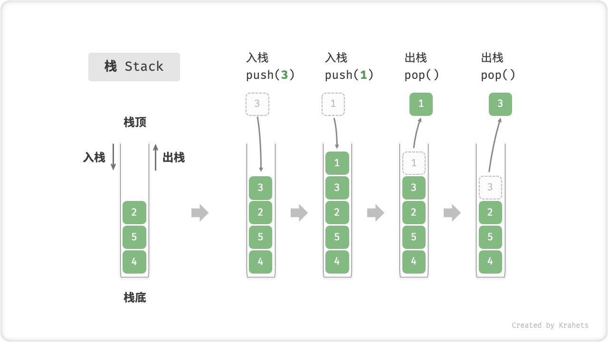
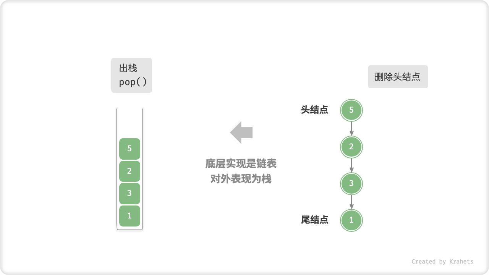
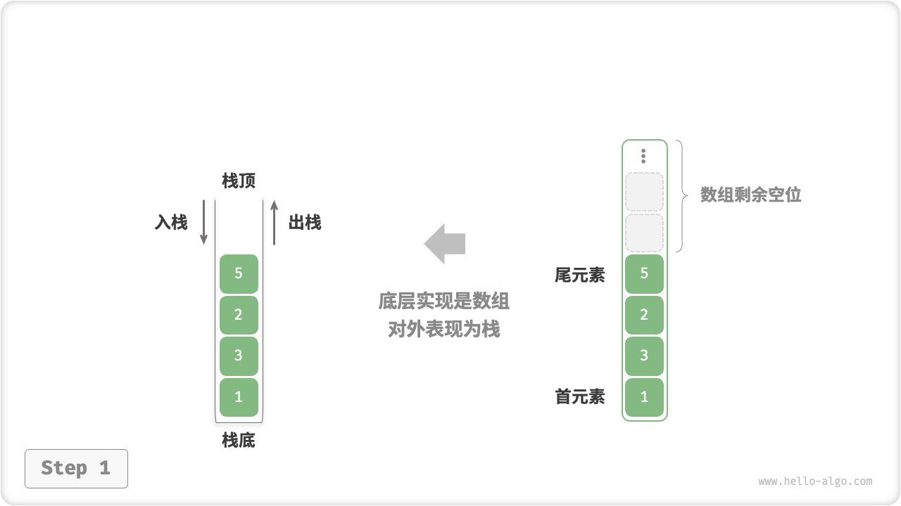
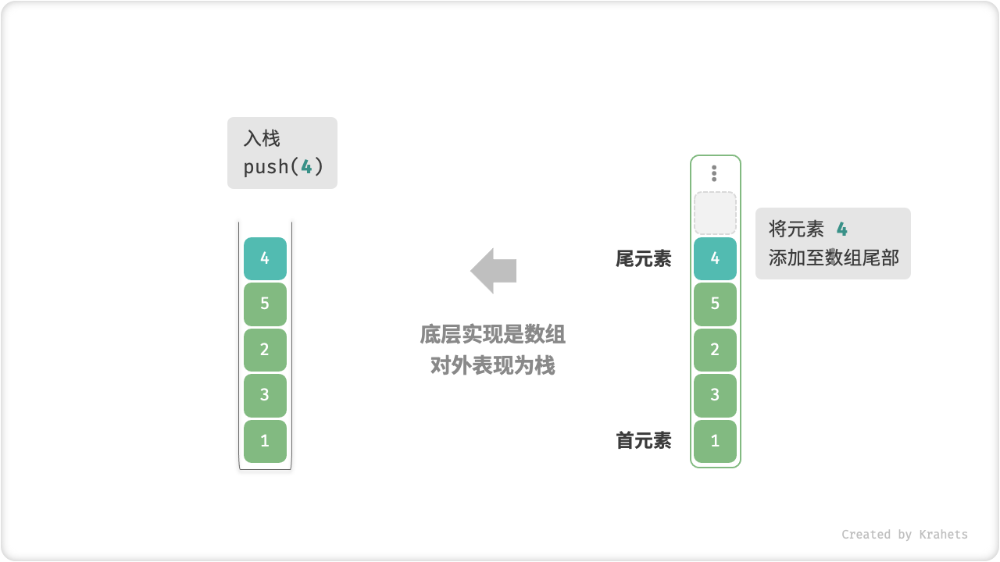
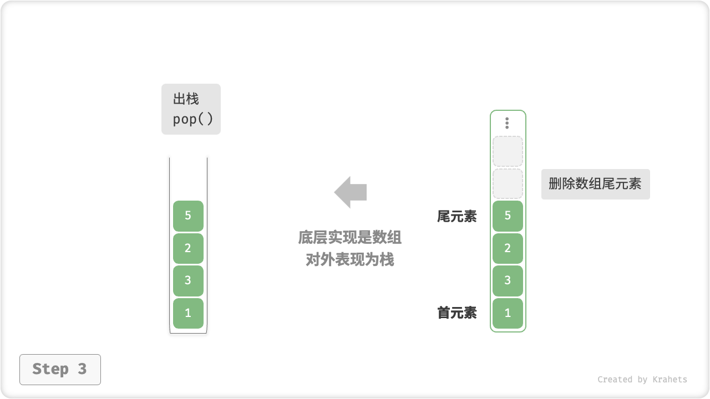

# 5.1. &nbsp; 栈

「栈 Stack」是一种遵循「先入后出 first in, last out」数据操作规则的线性数据结构。我们可以将栈类比为放在桌面上的一摞盘子，如果需要拿出底部的盘子，则需要先将上面的盘子依次取出。

“盘子”是一种形象比喻，我们将盘子替换为任意一种元素（例如整数、字符、对象等），就得到了栈数据结构。

我们将这一摞元素的顶部称为「栈顶」，将底部称为「栈底」，将把元素添加到栈顶的操作称为「入栈」，将删除栈顶元素的操作称为「出栈」。



<p align="center"> Fig. 栈的先入后出规则 </p>

## 5.1.1. &nbsp; 栈常用操作

栈的常用操作见下表（方法命名以 Java 为例）。

<div class="center-table" markdown>

| 方法      | 描述                   | 时间复杂度 |
| --------- | ---------------------- | ---------- |
| push()    | 元素入栈（添加至栈顶） | $O(1)$     |
| pop()     | 栈顶元素出栈           | $O(1)$     |
| peek()    | 访问栈顶元素           | $O(1)$     |
| size()    | 获取栈的长度           | $O(1)$     |
| isEmpty() | 判断栈是否为空         | $O(1)$     |

</div>

我们可以直接使用编程语言实现好的栈类。 某些语言并未专门提供栈类，但我们可以直接把该语言的「数组」或「链表」看作栈来使用，并通过“脑补”来屏蔽无关操作。

=== "Java"

    ```java title="stack.java"
    /* 初始化栈 */
    // 在 Java 中，推荐将 ArrayList 当作栈来使用
    List<Integer> stack = new ArrayList<>();
    
    /* 元素入栈 */
    stack.add(1);
    stack.add(3);
    stack.add(2);
    stack.add(5);
    stack.add(4);
    
    /* 访问栈顶元素 */
    int peek = stack.get(stack.size() - 1);
    
    /* 元素出栈 */
    int pop = stack.remove(stack.size() - 1);
    
    /* 获取栈的长度 */
    int size = stack.size();
    
    /* 判断是否为空 */
    boolean isEmpty = stack.isEmpty();
    ```

=== "C++"

    ```cpp title="stack.cpp"
    /* 初始化栈 */
    stack<int> stack;
    
    /* 元素入栈 */
    stack.push(1);
    stack.push(3);
    stack.push(2);
    stack.push(5);
    stack.push(4);
    
    /* 访问栈顶元素 */
    int top = stack.top();
    
    /* 元素出栈 */
    stack.pop();
    
    /* 获取栈的长度 */
    int size = stack.size();
    
    /* 判断是否为空 */
    bool empty = stack.empty();
    ```

=== "Python"

    ```python title="stack.py"
    """ 初始化栈 """
    # Python 没有内置的栈类，可以把 List 当作栈来使用 
    stack = []
    
    """ 元素入栈 """
    stack.append(1)
    stack.append(3)
    stack.append(2)
    stack.append(5)
    stack.append(4)
    
    """ 访问栈顶元素 """
    peek = stack[-1]
    
    """ 元素出栈 """
    pop = stack.pop()
    
    """ 获取栈的长度 """
    size = len(stack)
    
    """ 判断是否为空 """
    is_empty = len(stack) == 0
    ```

=== "Go"

    ```go title="stack_test.go"
    /* 初始化栈 */
    // 在 Go 中，推荐将 Slice 当作栈来使用
    var stack []int
    
    /* 元素入栈 */
    stack = append(stack, 1)
    stack = append(stack, 3)
    stack = append(stack, 2)
    stack = append(stack, 5)
    stack = append(stack, 4)
    
    /* 访问栈顶元素 */
    peek := stack[len(stack)-1]
    
    /* 元素出栈 */
    pop := stack[len(stack)-1]
    stack = stack[:len(stack)-1]
    
    /* 获取栈的长度 */
    size := len(stack)
    
    /* 判断是否为空 */
    isEmpty := len(stack) == 0
    ```

=== "JavaScript"

    ```javascript title="stack.js"
    /* 初始化栈 */
    // Javascript 没有内置的栈类，可以把 Array 当作栈来使用 
    const stack = [];
    
    /* 元素入栈 */
    stack.push(1);
    stack.push(3);
    stack.push(2);
    stack.push(5);
    stack.push(4);
    
    /* 访问栈顶元素 */
    const peek = stack[stack.length-1];
    
    /* 元素出栈 */
    const pop = stack.pop();
    
    /* 获取栈的长度 */
    const size = stack.length;
    
    /* 判断是否为空 */
    const is_empty = stack.length === 0;
    ```

=== "TypeScript"

    ```typescript title="stack.ts"
    /* 初始化栈 */
    // Typescript 没有内置的栈类，可以把 Array 当作栈来使用 
    const stack: number[] = [];
    
    /* 元素入栈 */
    stack.push(1);
    stack.push(3);
    stack.push(2);
    stack.push(5);
    stack.push(4);
    
    /* 访问栈顶元素 */
    const peek = stack[stack.length - 1];
    
    /* 元素出栈 */
    const pop = stack.pop();
    
    /* 获取栈的长度 */
    const size = stack.length;
    
    /* 判断是否为空 */
    const is_empty = stack.length === 0;
    ```

=== "C"

    ```c title="stack.c"
    
    ```

=== "C#"

    ```csharp title="stack.cs"
    /* 初始化栈 */
    Stack<int> stack = new ();
    
    /* 元素入栈 */
    stack.Push(1);
    stack.Push(3);
    stack.Push(2);
    stack.Push(5);
    stack.Push(4);
    
    /* 访问栈顶元素 */
    int peek = stack.Peek();
    
    /* 元素出栈 */
    int pop = stack.Pop();
    
    /* 获取栈的长度 */
    int size = stack.Count();
    
    /* 判断是否为空 */
    bool isEmpty = stack.Count()==0;
    ```

=== "Swift"

    ```swift title="stack.swift"
    /* 初始化栈 */
    // Swift 没有内置的栈类，可以把 Array 当作栈来使用
    var stack: [Int] = []
    
    /* 元素入栈 */
    stack.append(1)
    stack.append(3)
    stack.append(2)
    stack.append(5)
    stack.append(4)
    
    /* 访问栈顶元素 */
    let peek = stack.last!
    
    /* 元素出栈 */
    let pop = stack.removeLast()
    
    /* 获取栈的长度 */
    let size = stack.count
    
    /* 判断是否为空 */
    let isEmpty = stack.isEmpty
    ```

=== "Zig"

    ```zig title="stack.zig"

    ```

## 5.1.2. &nbsp; 栈的实现

为了更加清晰地了解栈的运行机制，接下来我们来自己动手实现一个栈类。

栈规定元素是先入后出的，因此我们只能在栈顶添加或删除元素。然而，数组或链表都可以在任意位置添加删除元素，因此 **栈可被看作是一种受约束的数组或链表**。换言之，我们可以“屏蔽”数组或链表的部分无关操作，使之对外的表现逻辑符合栈的规定即可。

### 基于链表的实现

使用「链表」实现栈时，将链表的头结点看作栈顶，将尾结点看作栈底。

对于入栈操作，将元素插入到链表头部即可，这种结点添加方式被称为“头插法”。而对于出栈操作，则将头结点从链表中删除即可。

=== "LinkedListStack"
    

=== "push()"
    

=== "pop()"
    

以下是基于链表实现栈的示例代码。

=== "Java"

    ```java title="linkedlist_stack.java"
    /* 基于链表实现的栈 */
    class LinkedListStack {
        private ListNode stackPeek;  // 将头结点作为栈顶
        private int stkSize = 0;   // 栈的长度
        
        public LinkedListStack() {
            stackPeek = null;
        }

        /* 获取栈的长度 */
        public int size() {
            return stkSize;
        }

        /* 判断栈是否为空 */
        public boolean isEmpty() {
            return size() == 0;
        }

        /* 入栈 */
        public void push(int num) {
            ListNode node = new ListNode(num);
            node.next = stackPeek;
            stackPeek = node;
            stkSize++;
        }

        /* 出栈 */
        public int pop() {
            int num = peek();
            stackPeek = stackPeek.next;
            stkSize--;
            return num;
        }

        /* 访问栈顶元素 */
        public int peek() {
            if (size() == 0)
                throw new EmptyStackException();
            return stackPeek.val;
        }

        /* 将 List 转化为 Array 并返回 */
        public int[] toArray() {
            ListNode node = stackPeek;
            int[] res = new int[size()];
            for (int i = res.length - 1; i >= 0; i--) {
                res[i] = node.val;
                node = node.next;
            }
            return res;
        }
    }
    ```

=== "C++"

    ```cpp title="linkedlist_stack.cpp"
    /* 基于链表实现的栈 */
    class LinkedListStack {
    private:
        ListNode* stackTop; // 将头结点作为栈顶
        int stkSize;        // 栈的长度

    public:
        LinkedListStack() {
            stackTop = nullptr;
            stkSize = 0;
        }

        ~LinkedListStack() {
            freeMemoryLinkedList(stackTop);
        }

        /* 获取栈的长度 */
        int size() {
            return stkSize;
        }

        /* 判断栈是否为空 */
        bool empty() {
            return size() == 0;
        }

        /* 入栈 */
        void push(int num) {
            ListNode* node = new ListNode(num);
            node->next = stackTop;
            stackTop = node;
            stkSize++;
        }

        /* 出栈 */
        void pop() {
            int num = top();
            ListNode *tmp = stackTop;
            stackTop = stackTop->next;
            // 释放内存
            delete tmp;
            stkSize--;
        }

        /* 访问栈顶元素 */
        int top() {
            if (size() == 0)
                throw out_of_range("栈为空");
            return stackTop->val;
        }

        /* 将 List 转化为 Array 并返回 */
        vector<int> toVector() {
            ListNode* node = stackTop;
            vector<int> res(size());
            for (int i = res.size() - 1; i >= 0; i--) {
                res[i] = node->val;
                node = node->next;
            }
            return res;
        }
    };
    ```

=== "Python"

    ```python title="linkedlist_stack.py"
    class LinkedListStack:
        """ 基于链表实现的栈 """
        def __init__(self):
            """ 构造方法 """
            self.__peek = None
            self.__size = 0

        def size(self):
            """ 获取栈的长度 """
            return self.__size

        def is_empty(self):
            """ 判断栈是否为空 """
            return not self.__peek

        def push(self, val):
            """ 入栈 """
            node = ListNode(val)
            node.next = self.__peek
            self.__peek = node
            self.__size += 1

        def pop(self):
            """ 出栈 """
            num = self.peek()
            self.__peek = self.__peek.next
            self.__size -= 1
            return num

        def peek(self):
            """ 访问栈顶元素 """
            # 判空处理
            if not self.__peek: return None
            return self.__peek.val

        def to_list(self):
            """ 转化为列表用于打印 """
            arr = []
            node = self.__peek
            while node:
                arr.append(node.val)
                node = node.next
            arr.reverse()
            return arr
    ```

=== "Go"

    ```go title="linkedlist_stack.go"
    /* 基于链表实现的栈 */
    type linkedListStack struct {
        // 使用内置包 list 来实现栈
        data *list.List
    }

    /* 初始化栈 */
    func newLinkedListStack() *linkedListStack {
        return &linkedListStack{
            data: list.New(),
        }
    }

    /* 入栈 */
    func (s *linkedListStack) push(value int) {
        s.data.PushBack(value)
    }

    /* 出栈 */
    func (s *linkedListStack) pop() any {
        if s.isEmpty() {
            return nil
        }
        e := s.data.Back()
        s.data.Remove(e)
        return e.Value
    }

    /* 访问栈顶元素 */
    func (s *linkedListStack) peek() any {
        if s.isEmpty() {
            return nil
        }
        e := s.data.Back()
        return e.Value
    }

    /* 获取栈的长度 */
    func (s *linkedListStack) size() int {
        return s.data.Len()
    }

    /* 判断栈是否为空 */
    func (s *linkedListStack) isEmpty() bool {
        return s.data.Len() == 0
    }

    /* 获取 List 用于打印 */
    func (s *linkedListStack) toList() *list.List {
        return s.data
    }
    ```

=== "JavaScript"

    ```javascript title="linkedlist_stack.js"
    /* 基于链表实现的栈 */
    class LinkedListStack {
        #stackPeek;     // 将头结点作为栈顶
        #stkSize = 0;   // 栈的长度

        constructor() {
            this.#stackPeek = null;
        }

        /* 获取栈的长度 */
        get size() {
            return this.#stkSize;
        }

        /* 判断栈是否为空 */
        isEmpty() {
            return this.size == 0;
        }

        /* 入栈 */
        push(num) {
            const node = new ListNode(num);
            node.next = this.#stackPeek;
            this.#stackPeek = node;
            this.#stkSize++;
        }

        /* 出栈 */
        pop() {
            const num = this.peek();
            this.#stackPeek = this.#stackPeek.next;
            this.#stkSize--;
            return num;
        }

        /* 访问栈顶元素 */
        peek() {
            if (!this.#stackPeek)
                throw new Error("栈为空");
            return this.#stackPeek.val;
        }

        /* 将链表转化为 Array 并返回 */
        toArray() {
            let node = this.#stackPeek;
            const res = new Array(this.size);
            for (let i = res.length - 1; i >= 0; i--) {
                res[i] = node.val;
                node = node.next;
            }
            return res;
        }
    }
    ```

=== "TypeScript"

    ```typescript title="linkedlist_stack.ts"
    /* 基于链表实现的栈 */
    class LinkedListStack {
        private stackPeek: ListNode | null; // 将头结点作为栈顶
        private stkSize: number = 0; // 栈的长度

        constructor() {
            this.stackPeek = null;
        }

        /* 获取栈的长度 */
        get size(): number {
            return this.stkSize;
        }

        /* 判断栈是否为空 */
        isEmpty(): boolean {
            return this.size == 0;
        }

        /* 入栈 */
        push(num: number): void {
            const node = new ListNode(num);
            node.next = this.stackPeek;
            this.stackPeek = node;
            this.stkSize++;
        }

        /* 出栈 */
        pop(): number {
            const num = this.peek();
            if (!this.stackPeek) throw new Error('栈为空');
            this.stackPeek = this.stackPeek.next;
            this.stkSize--;
            return num;
        }

        /* 访问栈顶元素 */
        peek(): number {
            if (!this.stackPeek) throw new Error('栈为空');
            return this.stackPeek.val;
        }

        /* 将链表转化为 Array 并返回 */
        toArray(): number[] {
            let node = this.stackPeek;
            const res = new Array<number>(this.size);
            for (let i = res.length - 1; i >= 0; i--) {
                res[i] = node!.val;
                node = node!.next;
            }
            return res;
        }
    }
    ```

=== "C"

    ```c title="linkedlist_stack.c"
    [class]{linkedListStack}-[func]{}
    ```

=== "C#"

    ```csharp title="linkedlist_stack.cs"
    /* 基于链表实现的栈 */
    class LinkedListStack
    {
        private ListNode? stackPeek;  // 将头结点作为栈顶
        private int stkSize = 0;   // 栈的长度

        public LinkedListStack()
        {
            stackPeek = null;
        }

        /* 获取栈的长度 */
        public int size()
        {
            return stkSize;
        }

        /* 判断栈是否为空 */
        public bool isEmpty()
        {
            return size() == 0;
        }

        /* 入栈 */
        public void push(int num)
        {
            ListNode node = new ListNode(num);
            node.next = stackPeek;
            stackPeek = node;
            stkSize++;
        }

        /* 出栈 */
        public int pop()
        {
            if (stackPeek == null)
                throw new Exception();

            int num = peek();
            stackPeek = stackPeek.next;
            stkSize--;
            return num;
        }

        /* 访问栈顶元素 */
        public int peek()
        {
            if (size() == 0 || stackPeek == null)
                throw new Exception();
            return stackPeek.val;
        }

        /* 将 List 转化为 Array 并返回 */
        public int[] toArray()
        {
            if (stackPeek == null)
                return Array.Empty<int>();

            ListNode node = stackPeek;
            int[] res = new int[size()];
            for (int i = res.Length - 1; i >= 0; i--)
            {
                res[i] = node.val;
                node = node.next;
            }
            return res;
        }
    }
    ```

=== "Swift"

    ```swift title="linkedlist_stack.swift"
    /* 基于链表实现的栈 */
    class LinkedListStack {
        private var _peek: ListNode? // 将头结点作为栈顶
        private var _size = 0 // 栈的长度

        init() {}

        /* 获取栈的长度 */
        func size() -> Int {
            _size
        }

        /* 判断栈是否为空 */
        func isEmpty() -> Bool {
            size() == 0
        }

        /* 入栈 */
        func push(num: Int) {
            let node = ListNode(x: num)
            node.next = _peek
            _peek = node
            _size += 1
        }

        /* 出栈 */
        @discardableResult
        func pop() -> Int {
            let num = peek()
            _peek = _peek?.next
            _size -= 1
            return num
        }

        /* 访问栈顶元素 */
        func peek() -> Int {
            if isEmpty() {
                fatalError("栈为空")
            }
            return _peek!.val
        }

        /* 将 List 转化为 Array 并返回 */
        func toArray() -> [Int] {
            var node = _peek
            var res = Array(repeating: 0, count: _size)
            for i in sequence(first: res.count - 1, next: { $0 >= 0 + 1 ? $0 - 1 : nil }) {
                res[i] = node!.val
                node = node?.next
            }
            return res
        }
    }
    ```

=== "Zig"

    ```zig title="linkedlist_stack.zig"
    // 基于链表实现的栈
    fn LinkedListStack(comptime T: type) type {
        return struct {
            const Self = @This();

            stackTop: ?*inc.ListNode(T) = null,             // 将头结点作为栈顶
            stkSize: usize = 0,                             // 栈的长度
            mem_arena: ?std.heap.ArenaAllocator = null,
            mem_allocator: std.mem.Allocator = undefined,   // 内存分配器

            // 构造方法（分配内存+初始化栈）
            pub fn init(self: *Self, allocator: std.mem.Allocator) !void {
                if (self.mem_arena == null) {
                    self.mem_arena = std.heap.ArenaAllocator.init(allocator);
                    self.mem_allocator = self.mem_arena.?.allocator();
                }
                self.stackTop = null;
                self.stkSize = 0;
            }

            // 析构方法（释放内存）
            pub fn deinit(self: *Self) void {
                if (self.mem_arena == null) return;
                self.mem_arena.?.deinit();
            }

            // 获取栈的长度
            pub fn size(self: *Self) usize {
                return self.stkSize;
            }

            // 判断栈是否为空
            pub fn isEmpty(self: *Self) bool {
                return self.size() == 0;
            }

            // 访问栈顶元素
            pub fn top(self: *Self) T {
                if (self.size() == 0) @panic("栈为空");
                return self.stackTop.?.val;
            }  

            // 入栈
            pub fn push(self: *Self, num: T) !void {
                var node = try self.mem_allocator.create(inc.ListNode(T));
                node.init(num);
                node.next = self.stackTop;
                self.stackTop = node;
                self.stkSize += 1;
            } 

            // 出栈
            pub fn pop(self: *Self) T {
                var num = self.top();
                self.stackTop = self.stackTop.?.next;
                self.stkSize -= 1;
                return num;
            } 

            // 将栈转换为数组
            pub fn toArray(self: *Self) ![]T {
                var node = self.stackTop;
                var res = try self.mem_allocator.alloc(T, self.size());
                std.mem.set(T, res, @as(T, 0));
                var i: usize = 0;
                while (i < res.len) : (i += 1) {
                    res[res.len - i - 1] = node.?.val;
                    node = node.?.next;
                }
                return res;
            }
        };
    }
    ```

### 基于数组的实现

使用「数组」实现栈时，考虑将数组的尾部当作栈顶。这样设计下，「入栈」与「出栈」操作就对应在数组尾部「添加元素」与「删除元素」，时间复杂度都为 $O(1)$ 。

=== "ArrayStack"
    

=== "push()"
    

=== "pop()"
    

由于入栈的元素可能是源源不断的，因此可以使用支持动态扩容的「列表」，这样就无需自行实现数组扩容了。以下是示例代码。

=== "Java"

    ```java title="array_stack.java"
    /* 基于数组实现的栈 */
    class ArrayStack {
        private ArrayList<Integer> stack;
        public ArrayStack() {
            // 初始化列表（动态数组）
            stack = new ArrayList<>();
        }

        /* 获取栈的长度 */
        public int size() {
            return stack.size();
        }

        /* 判断栈是否为空 */
        public boolean isEmpty() {
            return size() == 0;
        }

        /* 入栈 */
        public void push(int num) {
            stack.add(num);
        }

        /* 出栈 */
        public int pop() {
            if (isEmpty())
                throw new EmptyStackException();
            return stack.remove(size() - 1);
        }

        /* 访问栈顶元素 */
        public int peek() {
            if (isEmpty())
                throw new EmptyStackException();
            return stack.get(size() - 1);
        }

        /* 将 List 转化为 Array 并返回 */
        public Object[] toArray() {
            return stack.toArray();
        }
    }
    ```

=== "C++"

    ```cpp title="array_stack.cpp"
    /* 基于数组实现的栈 */
    class ArrayStack {
    private:
        vector<int> stack;
        
    public:
        /* 获取栈的长度 */
        int size() {
            return stack.size();
        }

        /* 判断栈是否为空 */
        bool empty() {
            return stack.empty();
        }

        /* 入栈 */
        void push(int num) {
            stack.push_back(num);
        }

        /* 出栈 */
        void pop() {
            int oldTop = top();
            stack.pop_back();
        }

        /* 访问栈顶元素 */
        int top() {
            if(empty())
                throw out_of_range("栈为空");
            return stack.back();
        }

        /* 返回 Vector */
        vector<int> toVector() {
            return stack;
        }
    };
    ```

=== "Python"

    ```python title="array_stack.py"
    class ArrayStack:
        """ 基于数组实现的栈 """
        def __init__(self):
            """ 构造方法 """
            self.__stack = []

        def size(self):
            """ 获取栈的长度 """
            return len(self.__stack)

        def is_empty(self):
            """ 判断栈是否为空 """
            return self.__stack == []

        def push(self, item):
            """ 入栈 """
            self.__stack.append(item)

        def pop(self):
            """ 出栈 """
            assert not self.is_empty(), "栈为空"
            return self.__stack.pop()

        def peek(self):
            """ 访问栈顶元素 """
            assert not self.is_empty(), "栈为空"
            return self.__stack[-1]
        
        def to_list(self):
            """ 返回列表用于打印 """
            return self.__stack
    ```

=== "Go"

    ```go title="array_stack.go"
    /* 基于数组实现的栈 */
    type arrayStack struct {
        data []int // 数据
    }

    /* 初始化栈 */
    func newArrayStack() *arrayStack {
        return &arrayStack{
            // 设置栈的长度为 0，容量为 16
            data: make([]int, 0, 16),
        }
    }

    /* 栈的长度 */
    func (s *arrayStack) size() int {
        return len(s.data)
    }

    /* 栈是否为空 */
    func (s *arrayStack) isEmpty() bool {
        return s.size() == 0
    }

    /* 入栈 */
    func (s *arrayStack) push(v int) {
        // 切片会自动扩容
        s.data = append(s.data, v)
    }

    /* 出栈 */
    func (s *arrayStack) pop() any {
        val := s.peek()
        s.data = s.data[:len(s.data)-1]
        return val
    }

    /* 获取栈顶元素 */
    func (s *arrayStack) peek() any {
        if s.isEmpty() {
            return nil
        }
        val := s.data[len(s.data)-1]
        return val
    }

    /* 获取 Slice 用于打印 */
    func (s *arrayStack) toSlice() []int {
        return s.data
    }
    ```

=== "JavaScript"

    ```javascript title="array_stack.js"
    /* 基于数组实现的栈 */
    class ArrayStack {
        #stack;
        constructor() {
            this.#stack = [];
        }
        
        /* 获取栈的长度 */
        get size() {
            return this.#stack.length;
        }

        /* 判断栈是否为空 */
        empty() {
            return this.#stack.length === 0;
        }

        /* 入栈 */
        push(num) {
            this.#stack.push(num);
        }

        /* 出栈 */
        pop() {
            if (this.empty())
                throw new Error("栈为空");
            return this.#stack.pop();
        }

        /* 访问栈顶元素 */
        top() {
            if (this.empty())
                throw new Error("栈为空");
            return this.#stack[this.#stack.length - 1];
        }

        /* 返回 Array */
        toArray() {
            return this.#stack;
        }
    };
    ```

=== "TypeScript"

    ```typescript title="array_stack.ts"
    /* 基于数组实现的栈 */
    class ArrayStack {
        private stack: number[];
        constructor() {
            this.stack = [];
        }

        /* 获取栈的长度 */
        get size(): number {
            return this.stack.length;
        }

        /* 判断栈是否为空 */
        empty(): boolean {
            return this.stack.length === 0;
        }

        /* 入栈 */
        push(num: number): void {
            this.stack.push(num);
        }

        /* 出栈 */
        pop(): number | undefined {
            if (this.empty())
                throw new Error('栈为空');
            return this.stack.pop();
        }

        /* 访问栈顶元素 */
        top(): number | undefined {
            if (this.empty())
                throw new Error('栈为空');
            return this.stack[this.stack.length - 1];
        }

        /* 返回 Array */
        toArray() {
            return this.stack;
        }
    };
    ```

=== "C"

    ```c title="array_stack.c"
    [class]{arrayStack}-[func]{}
    ```

=== "C#"

    ```csharp title="array_stack.cs"
    /* 基于数组实现的栈 */
    class ArrayStack
    {
        private List<int> stack;
        public ArrayStack()
        {
            // 初始化列表（动态数组）
            stack = new();
        }

        /* 获取栈的长度 */
        public int size()
        {
            return stack.Count();
        }

        /* 判断栈是否为空 */
        public bool isEmpty()
        {
            return size() == 0;
        }

        /* 入栈 */
        public void push(int num)
        {
            stack.Add(num);
        }

        /* 出栈 */
        public int pop()
        {
            if (isEmpty())
                throw new Exception();
            var val = peek();
            stack.RemoveAt(size() - 1);
            return val;
        }

        /* 访问栈顶元素 */
        public int peek()
        {
            if (isEmpty())
                throw new Exception();
            return stack[size() - 1];
        }

        /* 将 List 转化为 Array 并返回 */
        public int[] toArray()
        {
            return stack.ToArray();
        }
    }
    ```

=== "Swift"

    ```swift title="array_stack.swift"
    /* 基于数组实现的栈 */
    class ArrayStack {
        private var stack: [Int]

        init() {
            // 初始化列表（动态数组）
            stack = []
        }

        /* 获取栈的长度 */
        func size() -> Int {
            stack.count
        }

        /* 判断栈是否为空 */
        func isEmpty() -> Bool {
            stack.isEmpty
        }

        /* 入栈 */
        func push(num: Int) {
            stack.append(num)
        }

        /* 出栈 */
        @discardableResult
        func pop() -> Int {
            if isEmpty() {
                fatalError("栈为空")
            }
            return stack.removeLast()
        }

        /* 访问栈顶元素 */
        func peek() -> Int {
            if isEmpty() {
                fatalError("栈为空")
            }
            return stack.last!
        }

        /* 将 List 转化为 Array 并返回 */
        func toArray() -> [Int] {
            stack
        }
    }
    ```

=== "Zig"

    ```zig title="array_stack.zig"
    // 基于数组实现的栈
    fn ArrayStack(comptime T: type) type {
        return struct {
            const Self = @This();

            stack: ?std.ArrayList(T) = null,     

            // 构造方法（分配内存+初始化栈）
            pub fn init(self: *Self, allocator: std.mem.Allocator) void {
                if (self.stack == null) {
                    self.stack = std.ArrayList(T).init(allocator);
                }
            }

            // 析构方法（释放内存）
            pub fn deinit(self: *Self) void {
                if (self.stack == null) return;
                self.stack.?.deinit();
            }

            // 获取栈的长度
            pub fn size(self: *Self) usize {
                return self.stack.?.items.len;
            }

            // 判断栈是否为空
            pub fn isEmpty(self: *Self) bool {
                return self.size() == 0;
            }

            // 访问栈顶元素
            pub fn peek(self: *Self) T {
                if (self.isEmpty()) @panic("栈为空");
                return self.stack.?.items[self.size() - 1];
            }  

            // 入栈
            pub fn push(self: *Self, num: T) !void {
                try self.stack.?.append(num);
            } 

            // 出栈
            pub fn pop(self: *Self) T {
                var num = self.stack.?.pop();
                return num;
            } 

            // 返回 ArrayList
            pub fn toList(self: *Self) std.ArrayList(T) {
                return self.stack.?;
            }
        };
    }
    ```

## 5.1.3. &nbsp; 两种实现对比

### 支持操作

两种实现都支持栈定义中的各项操作，数组实现额外支持随机访问，但这已经超出栈的定义范畴，一般不会用到。

### 时间效率

在数组（列表）实现中，入栈与出栈操作都是在预先分配好的连续内存中操作，具有很好的缓存本地性，效率很好。然而，如果入栈时超出数组容量，则会触发扩容机制，那么该次入栈操作的时间复杂度为 $O(n)$ 。

在链表实现中，链表的扩容非常灵活，不存在上述数组扩容时变慢的问题。然而，入栈操作需要初始化结点对象并修改指针，因而效率不如数组。进一步地思考，如果入栈元素不是 `int` 而是结点对象，那么就可以省去初始化步骤，从而提升效率。

综上所述，当入栈与出栈操作的元素是基本数据类型（例如 `int` , `double` ）时，则结论如下：

- 数组实现的栈在触发扩容时会变慢，但由于扩容是低频操作，因此 **总体效率更高**；
- 链表实现的栈可以提供 **更加稳定的效率表现**；

### 空间效率

在初始化列表时，系统会给列表分配“初始容量”，该容量可能超过我们的需求。并且扩容机制一般是按照特定倍率（比如 2 倍）进行扩容，扩容后的容量也可能超出我们的需求。因此，**数组实现栈会造成一定的空间浪费**。

当然，由于结点需要额外存储指针，因此 **链表结点比数组元素占用更大**。

综上，我们不能简单地确定哪种实现更加省内存，需要 case-by-case 地分析。

## 5.1.4. &nbsp; 栈典型应用

- **浏览器中的后退与前进、软件中的撤销与反撤销**。每当我们打开新的网页，浏览器就将上一个网页执行入栈，这样我们就可以通过「后退」操作来回到上一页面，后退操作实际上是在执行出栈。如果要同时支持后退和前进，那么则需要两个栈来配合实现。
- **程序内存管理**。每当调用函数时，系统就会在栈顶添加一个栈帧，用来记录函数的上下文信息。在递归函数中，向下递推会不断执行入栈，向上回溯阶段时出栈。
