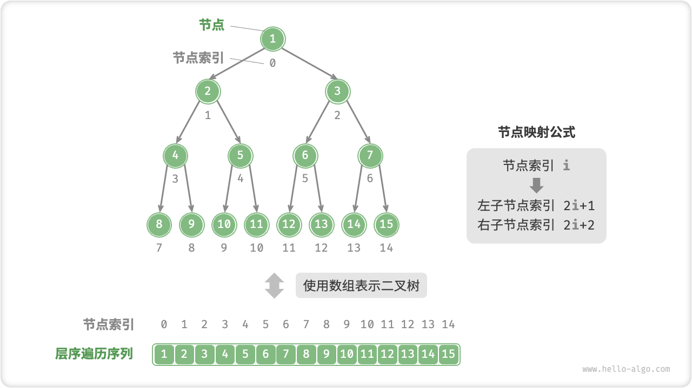
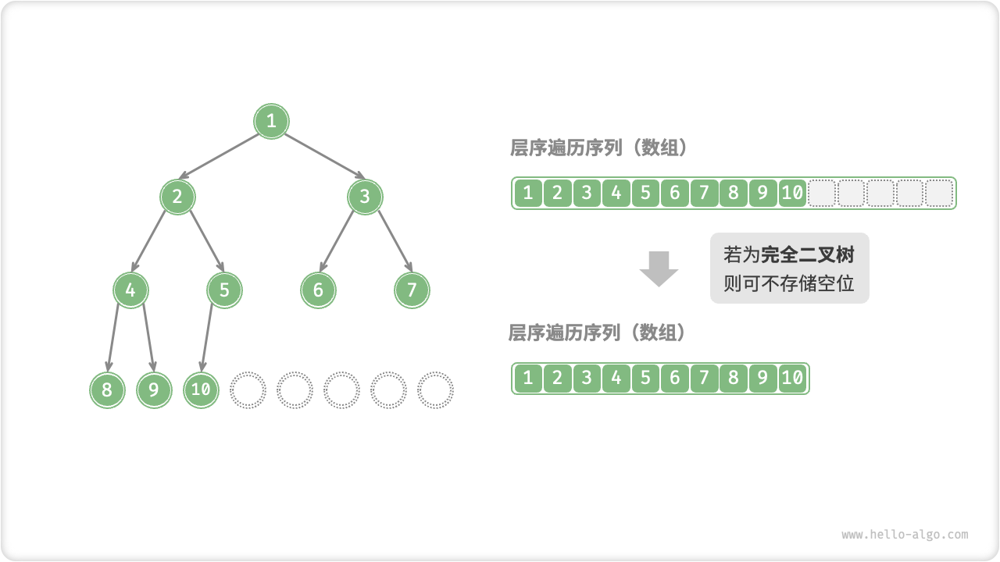

# 7.3. &nbsp; 二叉树数组表示

在链表表示下，二叉树的存储单元为节点 `TreeNode` ，节点之间通过指针相连接。在上节中，我们学习了在链表表示下的二叉树的各项基本操作。

那么，能否用「数组」来表示二叉树呢？答案是肯定的。

## 7.3.1. &nbsp; 表示完美二叉树

先分析一个简单案例，给定一个完美二叉树，我们将节点按照层序遍历的顺序编号（从 $0$ 开始），此时每个节点都对应唯一的索引。

根据层序遍历的特性，我们可以推导出父节点索引与子节点索引之间的“映射公式”：**若节点的索引为 $i$ ，则该节点的左子节点索引为 $2i + 1$ ，右子节点索引为 $2i + 2$** 。



<p align="center"> Fig. 完美二叉树的数组表示 </p>

**映射公式的作用相当于链表中的指针**。如果我们将节点按照层序遍历的顺序存储在一个数组中，那么对于数组中的任意节点，我们都可以通过映射公式来访问其子节点。

## 7.3.2. &nbsp; 表示任意二叉树

然而，完美二叉树只是一个特例。在二叉树的中间层，通常存在许多 $\text{None}$ ，而层序遍历序列并不包含这些 $\text{None}$ 。我们无法仅凭该序列来推测 $\text{None}$ 的数量和分布位置，**这意味着存在多种二叉树结构都符合该层序遍历序列**。显然在这种情况下，上述的数组表示方法已经失效。


<p align="center"> Fig. 层序遍历序列对应多种二叉树可能性 </p>

为了解决此问题，**我们可以考虑在层序遍历序列中显式地写出所有 $\text{None}$**。如下图所示，这样处理后，层序遍历序列就可以唯一表示二叉树了。

=== "Java"

    ```java title=""
    /* 二叉树的数组表示 */
    // 使用 int 的包装类 Integer ，就可以使用 null 来标记空位
    Integer[] tree = { 1, 2, 3, 4, null, 6, 7, 8, 9, null, null, 12, null, null, 15 };
    ```

=== "C++"

    ```cpp title=""
    /* 二叉树的数组表示 */
    // 使用 int 最大值 INT_MAX 标记空位
    vector<int> tree = {1, 2, 3, 4, INT_MAX, 6, 7, 8, 9, INT_MAX, INT_MAX, 12, INT_MAX, INT_MAX, 15};
    ```

=== "Python"

    ```python title=""
    # 二叉树的数组表示
    # 直接使用 None 来表示空位
    tree = [1, 2, 3, 4, None, 6, 7, 8, 9, None, None, 12, None, None, 15]
    ```

=== "Go"

    ```go title=""
    /* 二叉树的数组表示 */
    // 使用 any 类型的切片, 就可以使用 nil 来标记空位
    tree := []any{1, 2, 3, 4, nil, 6, 7, 8, 9, nil, nil, 12, nil, nil, 15}
    ```

=== "JavaScript"

    ```javascript title=""
    /* 二叉树的数组表示 */
    // 直接使用 null 来表示空位
    let tree = [1, 2, 3, 4, null, 6, 7, 8, 9, null, null, 12, null, null, 15];
    ```

=== "TypeScript"

    ```typescript title=""
    /* 二叉树的数组表示 */
    // 直接使用 null 来表示空位
    let tree: (number | null)[] = [1, 2, 3, 4, null, 6, 7, 8, 9, null, null, 12, null, null, 15];
    ```

=== "C"

    ```c title=""
    /* 二叉树的数组表示 */
    // 使用 int 最大值标记空位，因此要求节点值不能为 INT_MAX
    int tree[] = {1, 2, 3, 4, INT_MAX, 6, 7, 8, 9, INT_MAX, INT_MAX, 12, INT_MAX, INT_MAX, 15};
    ```

=== "C#"

    ```csharp title=""
    /* 二叉树的数组表示 */
    // 使用 int? 可空类型 ，就可以使用 null 来标记空位
    int?[] tree = { 1, 2, 3, 4, null, 6, 7, 8, 9, null, null, 12, null, null, 15 };
    ```

=== "Swift"

    ```swift title=""
    /* 二叉树的数组表示 */
    // 使用 Int? 可空类型 ，就可以使用 nil 来标记空位
    let tree: [Int?] = [1, 2, 3, 4, nil, 6, 7, 8, 9, nil, nil, 12, nil, nil, 15]
    ```

=== "Zig"

    ```zig title=""

    ```

=== "Dart"

    ```dart title=""
    /* 二叉树的数组表示 */
    // 使用 int? 可空类型 ，就可以使用 null 来标记空位
    List<int?> tree = [1, 2, 3, 4, null, 6, 7, 8, 9, null, null, 12, null, null, 15];
    ```


<p align="center"> Fig. 任意类型二叉树的数组表示 </p>

以下为数组表示下二叉树的实现，包括：

- 获取节点数量、节点值、左（右）子节点、父节点等基础操作；
- 获取前序遍历、中序遍历、后序遍历、层序遍历的节点值序列；

=== "Java"

    ```java title="array_binary_tree.java"
    /* 数组表示下的二叉树类 */
    class ArrayBinaryTree {
        private List<Integer> tree;

        /* 构造方法 */
        public ArrayBinaryTree(List<Integer> arr) {
            tree = new ArrayList<>(arr);
        }

        /* 节点数量 */
        public int size() {
            return tree.size();
        }

        /* 获取索引为 i 节点的值 */
        public Integer val(int i) {
            // 若索引越界，则返回 null ，代表空位
            if (i < 0 || i >= size())
                return null;
            return tree.get(i);
        }

        /* 获取索引为 i 节点的左子节点的索引 */
        public Integer left(int i) {
            return 2 * i + 1;
        }

        /* 获取索引为 i 节点的右子节点的索引 */
        public Integer right(int i) {
            return 2 * i + 2;
        }

        /* 获取索引为 i 节点的父节点的索引 */
        public Integer parent(int i) {
            return (i - 1) / 2;
        }

        /* 层序遍历 */
        public List<Integer> levelOrder() {
            List<Integer> res = new ArrayList<>();
            // 直接遍历数组
            for (int i = 0; i < size(); i++) {
                if (val(i) != null)
                    res.add(val(i));
            }
            return res;
        }

        /* 深度优先遍历 */
        private void dfs(Integer i, String order, List<Integer> res) {
            // 若为空位，则返回
            if (val(i) == null)
                return;
            // 前序遍历
            if (order == "pre")
                res.add(val(i));
            dfs(left(i), order, res);
            // 中序遍历
            if (order == "in")
                res.add(val(i));
            dfs(right(i), order, res);
            // 后序遍历
            if (order == "post")
                res.add(val(i));
        }

        /* 前序遍历 */
        public List<Integer> preOrder() {
            List<Integer> res = new ArrayList<>();
            dfs(0, "pre", res);
            return res;
        }

        /* 中序遍历 */
        public List<Integer> inOrder() {
            List<Integer> res = new ArrayList<>();
            dfs(0, "in", res);
            return res;
        }

        /* 后序遍历 */
        public List<Integer> postOrder() {
            List<Integer> res = new ArrayList<>();
            dfs(0, "post", res);
            return res;
        }
    }
    ```

=== "C++"

    ```cpp title="array_binary_tree.cpp"
    /* 数组表示下的二叉树类 */
    class ArrayBinaryTree {
      public:
        /* 构造方法 */
        ArrayBinaryTree(vector<int> arr) {
            tree = arr;
        }

        /* 节点数量 */
        int size() {
            return tree.size();
        }

        /* 获取索引为 i 节点的值 */
        int val(int i) {
            // 若索引越界，则返回 INT_MAX ，代表空位
            if (i < 0 || i >= size())
                return INT_MAX;
            return tree[i];
        }

        /* 获取索引为 i 节点的左子节点的索引 */
        int left(int i) {
            return 2 * i + 1;
        }

        /* 获取索引为 i 节点的右子节点的索引 */
        int right(int i) {
            return 2 * i + 2;
        }

        /* 获取索引为 i 节点的父节点的索引 */
        int parent(int i) {
            return (i - 1) / 2;
        }

        /* 层序遍历 */
        vector<int> levelOrder() {
            vector<int> res;
            // 直接遍历数组
            for (int i = 0; i < size(); i++) {
                if (val(i) != INT_MAX)
                    res.push_back(val(i));
            }
            return res;
        }

        /* 前序遍历 */
        vector<int> preOrder() {
            vector<int> res;
            dfs(0, "pre", res);
            return res;
        }

        /* 中序遍历 */
        vector<int> inOrder() {
            vector<int> res;
            dfs(0, "in", res);
            return res;
        }

        /* 后序遍历 */
        vector<int> postOrder() {
            vector<int> res;
            dfs(0, "post", res);
            return res;
        }

      private:
        vector<int> tree;

        /* 深度优先遍历 */
        void dfs(int i, string order, vector<int> &res) {
            // 若为空位，则返回
            if (val(i) == INT_MAX)
                return;
            // 前序遍历
            if (order == "pre")
                res.push_back(val(i));
            dfs(left(i), order, res);
            // 中序遍历
            if (order == "in")
                res.push_back(val(i));
            dfs(right(i), order, res);
            // 后序遍历
            if (order == "post")
                res.push_back(val(i));
        }
    };
    ```

=== "Python"

    ```python title="array_binary_tree.py"
    class ArrayBinaryTree:
        """数组表示下的二叉树类"""

        def __init__(self, arr: list[int | None]):
            """构造方法"""
            self.__tree = list(arr)

        def size(self):
            """节点数量"""
            return len(self.__tree)

        def val(self, i: int) -> int:
            """获取索引为 i 节点的值"""
            # 若索引越界，则返回 None ，代表空位
            if i < 0 or i >= self.size():
                return None
            return self.__tree[i]

        def left(self, i: int) -> int | None:
            """获取索引为 i 节点的左子节点的索引"""
            return 2 * i + 1

        def right(self, i: int) -> int | None:
            """获取索引为 i 节点的右子节点的索引"""
            return 2 * i + 2

        def parent(self, i: int) -> int | None:
            """获取索引为 i 节点的父节点的索引"""
            return (i - 1) // 2

        def level_order(self) -> list[int]:
            """层序遍历"""
            self.res = []
            # 直接遍历数组
            for i in range(self.size()):
                if self.val(i) is not None:
                    self.res.append(self.val(i))
            return self.res

        def __dfs(self, i: int, order: str):
            """深度优先遍历"""
            if self.val(i) is None:
                return
            # 前序遍历
            if order == "pre":
                self.res.append(self.val(i))
            self.__dfs(self.left(i), order)
            # 中序遍历
            if order == "in":
                self.res.append(self.val(i))
            self.__dfs(self.right(i), order)
            # 后序遍历
            if order == "post":
                self.res.append(self.val(i))

        def pre_order(self) -> list[int]:
            """前序遍历"""
            self.res = []
            self.__dfs(0, order="pre")
            return self.res

        def in_order(self) -> list[int]:
            """中序遍历"""
            self.res = []
            self.__dfs(0, order="in")
            return self.res

        def post_order(self) -> list[int]:
            """后序遍历"""
            self.res = []
            self.__dfs(0, order="post")
            return self.res
    ```

=== "Go"

    ```go title="array_binary_tree.go"
    [class]{arrayBinaryTree}-[func]{}
    ```

=== "JavaScript"

    ```javascript title="array_binary_tree.js"
    [class]{ArrayBinaryTree}-[func]{}
    ```

=== "TypeScript"

    ```typescript title="array_binary_tree.ts"
    [class]{ArrayBinaryTree}-[func]{}
    ```

=== "C"

    ```c title="array_binary_tree.c"
    [class]{arrayBinaryTree}-[func]{}
    ```

=== "C#"

    ```csharp title="array_binary_tree.cs"
    [class]{ArrayBinaryTree}-[func]{}
    ```

=== "Swift"

    ```swift title="array_binary_tree.swift"
    [class]{ArrayBinaryTree}-[func]{}
    ```

=== "Zig"

    ```zig title="array_binary_tree.zig"
    [class]{ArrayBinaryTree}-[func]{}
    ```

=== "Dart"

    ```dart title="array_binary_tree.dart"
    [class]{ArrayBinaryTree}-[func]{}
    ```

## 7.3.3. &nbsp; 优势与局限性

二叉树的数组表示存在以下优点：

- 数组存储在连续的内存空间中，缓存友好，访问与遍历速度较快；
- 不需要存储指针，比较节省空间；
- 允许随机访问节点；

然而，数组表示也具有一些局限性：

- 数组存储需要连续内存空间，因此不适合存储数据量过大的树。
- 增删节点需要通过数组插入与删除操作实现，效率较低；
- 当二叉树中存在大量 $\text{None}$ 时，数组中包含的节点数据比重较低，空间利用率较低。

**完全二叉树非常适合使用数组来表示**。回顾完全二叉树的定义，$\text{None}$ 只出现在最底层且靠右的位置，**这意味着所有 $\text{None}$ 一定出现在层序遍历序列的末尾**。因此，在使用数组表示完全二叉树时，可以省略存储所有 $\text{None}$ 。



<p align="center"> Fig. 完全二叉树的数组表示 </p>
