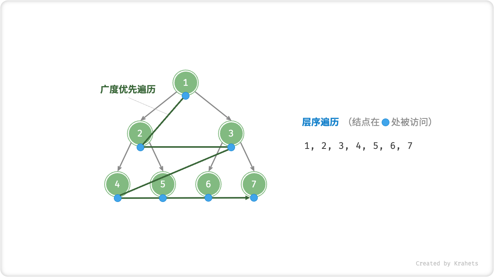
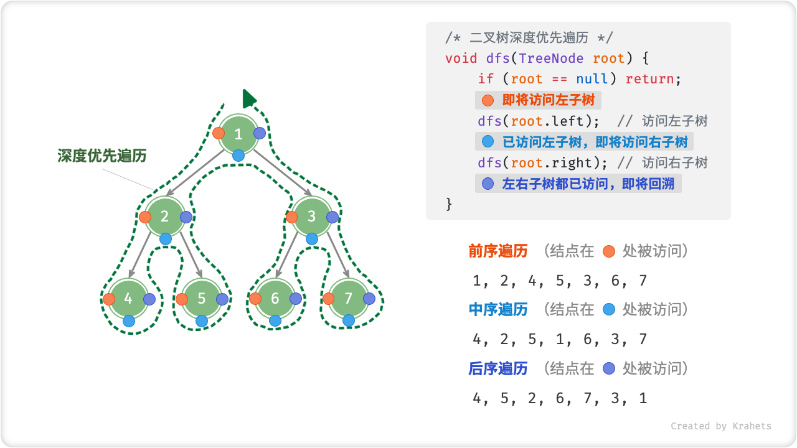

# 7.2. &nbsp; 二叉树遍历

从物理结构角度看，树是一种基于链表的数据结构，因此遍历方式也是通过指针（即引用）逐个遍历结点。同时，树还是一种非线性数据结构，这导致遍历树比遍历链表更加复杂，需要使用搜索算法来实现。

常见的二叉树遍历方式有层序遍历、前序遍历、中序遍历、后序遍历。

## 7.2.1. &nbsp; 层序遍历

「层序遍历 Level-Order Traversal」从顶至底、一层一层地遍历二叉树，并在每层中按照从左到右的顺序访问结点。

层序遍历本质上是「广度优先搜索 Breadth-First Traversal」，其体现着一种“一圈一圈向外”的层进遍历方式。



<p align="center"> Fig. 二叉树的层序遍历 </p>

### 算法实现

广度优先遍历一般借助「队列」来实现。队列的规则是“先进先出”，广度优先遍历的规则是 ”一层层平推“ ，两者背后的思想是一致的。

=== "Java"

    ```java title="binary_tree_bfs.java"
    /* 层序遍历 */
    List<Integer> levelOrder(TreeNode root) {
        // 初始化队列，加入根结点
        Queue<TreeNode> queue = new LinkedList<>() {{ add(root); }};
        // 初始化一个列表，用于保存遍历序列
        List<Integer> list = new ArrayList<>();
        while (!queue.isEmpty()) {
            TreeNode node = queue.poll();  // 队列出队
            list.add(node.val);            // 保存结点值
            if (node.left != null)
                queue.offer(node.left);    // 左子结点入队
            if (node.right != null)
                queue.offer(node.right);   // 右子结点入队
        }
        return list;
    }
    ```

=== "C++"

    ```cpp title="binary_tree_bfs.cpp"
    /* 层序遍历 */
    vector<int> levelOrder(TreeNode* root) {
        // 初始化队列，加入根结点
        queue<TreeNode*> queue;
        queue.push(root);
        // 初始化一个列表，用于保存遍历序列
        vector<int> vec;
        while (!queue.empty()) {
            TreeNode* node = queue.front();
            queue.pop();                 // 队列出队
            vec.push_back(node->val);    // 保存结点值
            if (node->left != nullptr)
                queue.push(node->left);  // 左子结点入队
            if (node->right != nullptr)
                queue.push(node->right); // 右子结点入队
        }
        return vec;
    }
    ```

=== "Python"

    ```python title="binary_tree_bfs.py"
    def level_order(root: Optional[TreeNode]) -> List[int]:
        """ 层序遍历 """
        # 初始化队列，加入根结点
        queue: Deque[TreeNode] = collections.deque()
        queue.append(root)
        # 初始化一个列表，用于保存遍历序列
        res: List[int] = []
        while queue:
            node: TreeNode = queue.popleft() # 队列出队
            res.append(node.val)             # 保存结点值
            if node.left is not None:
                queue.append(node.left)      # 左子结点入队
            if node.right is not None:
                queue.append(node.right)     # 右子结点入队
        return res
    ```

=== "Go"

    ```go title="binary_tree_bfs.go"
    /* 层序遍历 */
    func levelOrder(root *TreeNode) []int {
        // 初始化队列，加入根结点
        queue := list.New()
        queue.PushBack(root)
        // 初始化一个切片，用于保存遍历序列
        nums := make([]int, 0)
        for queue.Len() > 0 {
            // poll
            node := queue.Remove(queue.Front()).(*TreeNode)
            // 保存结点值
            nums = append(nums, node.Val)
            if node.Left != nil {
                // 左子结点入队
                queue.PushBack(node.Left)
            }
            if node.Right != nil {
                // 右子结点入队
                queue.PushBack(node.Right)
            }
        }
        return nums
    }
    ```

=== "JavaScript"

    ```javascript title="binary_tree_bfs.js"
    /* 层序遍历 */
    function levelOrder(root) {
        // 初始化队列，加入根结点
        const queue = [root];
        // 初始化一个列表，用于保存遍历序列
        const list = [];
        while (queue.length) {
            let node = queue.shift();   // 队列出队
            list.push(node.val);        // 保存结点值
            if (node.left)
                queue.push(node.left);  // 左子结点入队
            if (node.right)
                queue.push(node.right); // 右子结点入队

        }
        return list;
    }
    ```

=== "TypeScript"

    ```typescript title="binary_tree_bfs.ts"
    /* 层序遍历 */
    function levelOrder(root: TreeNode | null): number[] {
        // 初始化队列，加入根结点
        const queue = [root];
        // 初始化一个列表，用于保存遍历序列
        const list: number[] = [];
        while (queue.length) {
            let node = queue.shift() as TreeNode; // 队列出队
            list.push(node.val); // 保存结点值
            if (node.left) {
                queue.push(node.left); // 左子结点入队
            }
            if (node.right) {
                queue.push(node.right); // 右子结点入队
            }
        }
        return list;
    }
    ```

=== "C"

    ```c title="binary_tree_bfs.c"
    [class]{}-[func]{levelOrder}
    ```

=== "C#"

    ```csharp title="binary_tree_bfs.cs"
    /* 层序遍历 */
    List<int> levelOrder(TreeNode root)
    {
        // 初始化队列，加入根结点
        Queue<TreeNode> queue = new();
        queue.Enqueue(root);
        // 初始化一个列表，用于保存遍历序列
        List<int> list = new();
        while (queue.Count != 0)
        {
            TreeNode node = queue.Dequeue(); // 队列出队
            list.Add(node.val);              // 保存结点值
            if (node.left != null)
                queue.Enqueue(node.left);    // 左子结点入队
            if (node.right != null)
                queue.Enqueue(node.right);   // 右子结点入队
        }
        return list;
    }
    ```

=== "Swift"

    ```swift title="binary_tree_bfs.swift"
    /* 层序遍历 */
    func levelOrder(root: TreeNode) -> [Int] {
        // 初始化队列，加入根结点
        var queue: [TreeNode] = [root]
        // 初始化一个列表，用于保存遍历序列
        var list: [Int] = []
        while !queue.isEmpty {
            let node = queue.removeFirst() // 队列出队
            list.append(node.val) // 保存结点值
            if let left = node.left {
                queue.append(left) // 左子结点入队
            }
            if let right = node.right {
                queue.append(right) // 右子结点入队
            }
        }
        return list
    }
    ```

=== "Zig"

    ```zig title="binary_tree_bfs.zig"
    // 层序遍历
    fn levelOrder(comptime T: type, mem_allocator: std.mem.Allocator, root: *inc.TreeNode(T)) !std.ArrayList(T) {
        // 初始化队列，加入根结点
        const L = std.TailQueue(*inc.TreeNode(T));
        var queue = L{};
        var root_node = try mem_allocator.create(L.Node);
        root_node.data = root;
        queue.append(root_node); 
        // 初始化一个列表，用于保存遍历序列
        var list = std.ArrayList(T).init(std.heap.page_allocator);
        while (queue.len > 0) {
            var queue_node = queue.popFirst().?;    // 队列出队
            var node = queue_node.data;
            try list.append(node.val);              // 保存结点值
            if (node.left != null) {
                var tmp_node = try mem_allocator.create(L.Node);
                tmp_node.data = node.left.?;
                queue.append(tmp_node);             // 左子结点入队
            }
            if (node.right != null) {
                var tmp_node = try mem_allocator.create(L.Node);
                tmp_node.data = node.right.?;
                queue.append(tmp_node);             // 右子结点入队
            }        
        }
        return list;
    }
    ```

### 复杂度分析

**时间复杂度**：所有结点被访问一次，使用 $O(n)$ 时间，其中 $n$ 为结点数量。

**空间复杂度**：当为满二叉树时达到最差情况，遍历到最底层前，队列中最多同时存在 $\frac{n + 1}{2}$ 个结点，使用 $O(n)$ 空间。

## 7.2.2. &nbsp; 前序、中序、后序遍历

相对地，前、中、后序遍历皆属于「深度优先遍历 Depth-First Traversal」，其体现着一种“先走到尽头，再回头继续”的回溯遍历方式。

如下图所示，左侧是深度优先遍历的的示意图，右上方是对应的递归实现代码。深度优先遍历就像是绕着整个二叉树的外围“走”一圈，走的过程中，在每个结点都会遇到三个位置，分别对应前序遍历、中序遍历、后序遍历。



<p align="center"> Fig. 二叉搜索树的前、中、后序遍历 </p>

<div class="center-table" markdown>

| 位置       | 含义                                 | 此处访问结点时对应            |
| ---------- | ------------------------------------ | ----------------------------- |
| 橙色圆圈处 | 刚进入此结点，即将访问该结点的左子树 | 前序遍历 Pre-Order Traversal  |
| 蓝色圆圈处 | 已访问完左子树，即将访问右子树       | 中序遍历 In-Order Traversal   |
| 紫色圆圈处 | 已访问完左子树和右子树，即将返回     | 后序遍历 Post-Order Traversal |

</div>

### 算法实现

=== "Java"

    ```java title="binary_tree_dfs.java"
    /* 前序遍历 */
    void preOrder(TreeNode root) {
        if (root == null) return;
        // 访问优先级：根结点 -> 左子树 -> 右子树
        list.add(root.val);
        preOrder(root.left);
        preOrder(root.right);
    }

    /* 中序遍历 */
    void inOrder(TreeNode root) {
        if (root == null) return;
        // 访问优先级：左子树 -> 根结点 -> 右子树
        inOrder(root.left);
        list.add(root.val);
        inOrder(root.right);
    }

    /* 后序遍历 */
    void postOrder(TreeNode root) {
        if (root == null) return;
        // 访问优先级：左子树 -> 右子树 -> 根结点
        postOrder(root.left);
        postOrder(root.right);
        list.add(root.val);
    }
    ```

=== "C++"

    ```cpp title="binary_tree_dfs.cpp"
    /* 前序遍历 */
    void preOrder(TreeNode* root) {
        if (root == nullptr) return;
        // 访问优先级：根结点 -> 左子树 -> 右子树
        vec.push_back(root->val);
        preOrder(root->left);
        preOrder(root->right);
    }

    /* 中序遍历 */
    void inOrder(TreeNode* root) {
        if (root == nullptr) return;
        // 访问优先级：左子树 -> 根结点 -> 右子树
        inOrder(root->left);
        vec.push_back(root->val);
        inOrder(root->right);
    }

    /* 后序遍历 */
    void postOrder(TreeNode* root) {
        if (root == nullptr) return;
        // 访问优先级：左子树 -> 右子树 -> 根结点
        postOrder(root->left);
        postOrder(root->right);
        vec.push_back(root->val);
    }
    ```

=== "Python"

    ```python title="binary_tree_dfs.py"
    def pre_order(root: Optional[TreeNode]) -> None:
        """ 前序遍历 """
        if root is None:
            return
        # 访问优先级：根结点 -> 左子树 -> 右子树
        res.append(root.val)
        pre_order(root=root.left)
        pre_order(root=root.right)

    def in_order(root: Optional[TreeNode]) -> None:
        """ 中序遍历 """
        if root is None:
            return
        # 访问优先级：左子树 -> 根结点 -> 右子树
        in_order(root=root.left)
        res.append(root.val)
        in_order(root=root.right)

    def post_order(root: Optional[TreeNode]) -> None:
        """ 后序遍历 """
        if root is None:
            return
        # 访问优先级：左子树 -> 右子树 -> 根结点
        post_order(root=root.left)
        post_order(root=root.right)
        res.append(root.val)
    ```

=== "Go"

    ```go title="binary_tree_dfs.go"
    /* 前序遍历 */
    func preOrder(node *TreeNode) {
        if node == nil {
            return
        }
        // 访问优先级：根结点 -> 左子树 -> 右子树
        nums = append(nums, node.Val)
        preOrder(node.Left)
        preOrder(node.Right)
    }

    /* 中序遍历 */
    func inOrder(node *TreeNode) {
        if node == nil {
            return
        }
        // 访问优先级：左子树 -> 根结点 -> 右子树
        inOrder(node.Left)
        nums = append(nums, node.Val)
        inOrder(node.Right)
    }

    /* 后序遍历 */
    func postOrder(node *TreeNode) {
        if node == nil {
            return
        }
        // 访问优先级：左子树 -> 右子树 -> 根结点
        postOrder(node.Left)
        postOrder(node.Right)
        nums = append(nums, node.Val)
    }
    ```

=== "JavaScript"

    ```javascript title="binary_tree_dfs.js"
    /* 前序遍历 */
    function preOrder(root) {
        if (root === null) return;
        // 访问优先级：根结点 -> 左子树 -> 右子树
        list.push(root.val);
        preOrder(root.left);
        preOrder(root.right);
    }

    /* 中序遍历 */
    function inOrder(root) {
        if (root === null) return;
        // 访问优先级：左子树 -> 根结点 -> 右子树
        inOrder(root.left);
        list.push(root.val);
        inOrder(root.right);
    }

    /* 后序遍历 */
    function postOrder(root) {
        if (root === null) return;
        // 访问优先级：左子树 -> 右子树 -> 根结点
        postOrder(root.left);
        postOrder(root.right);
        list.push(root.val);
    }
    ```

=== "TypeScript"

    ```typescript title="binary_tree_dfs.ts"
    /* 前序遍历 */
    function preOrder(root: TreeNode | null): void {
        if (root === null) {
            return;
        }
        // 访问优先级：根结点 -> 左子树 -> 右子树
        list.push(root.val);
        preOrder(root.left);
        preOrder(root.right);
    }

    /* 中序遍历 */
    function inOrder(root: TreeNode | null): void {
        if (root === null) {
            return;
        }
        // 访问优先级：左子树 -> 根结点 -> 右子树
        inOrder(root.left);
        list.push(root.val);
        inOrder(root.right);
    }

    /* 后序遍历 */
    function postOrder(root: TreeNode | null): void {
        if (root === null) {
            return;
        }
        // 访问优先级：左子树 -> 右子树 -> 根结点
        postOrder(root.left);
        postOrder(root.right);
        list.push(root.val);
    }
    ```

=== "C"

    ```c title="binary_tree_dfs.c"
    [class]{}-[func]{preOrder}

    [class]{}-[func]{inOrder}

    [class]{}-[func]{postOrder}
    ```

=== "C#"

    ```csharp title="binary_tree_dfs.cs"
    /* 前序遍历 */
    void preOrder(TreeNode? root)
    {
        if (root == null) return;
        // 访问优先级：根结点 -> 左子树 -> 右子树
        list.Add(root.val);
        preOrder(root.left);
        preOrder(root.right);
    }

    /* 中序遍历 */
    void inOrder(TreeNode? root)
    {
        if (root == null) return;
        // 访问优先级：左子树 -> 根结点 -> 右子树
        inOrder(root.left);
        list.Add(root.val);
        inOrder(root.right);
    }

    /* 后序遍历 */
    void postOrder(TreeNode? root)
    {
        if (root == null) return;
        // 访问优先级：左子树 -> 右子树 -> 根结点
        postOrder(root.left);
        postOrder(root.right);
        list.Add(root.val);
    }
    ```

=== "Swift"

    ```swift title="binary_tree_dfs.swift"
    /* 前序遍历 */
    func preOrder(root: TreeNode?) {
        guard let root = root else {
            return
        }
        // 访问优先级：根结点 -> 左子树 -> 右子树
        list.append(root.val)
        preOrder(root: root.left)
        preOrder(root: root.right)
    }

    /* 中序遍历 */
    func inOrder(root: TreeNode?) {
        guard let root = root else {
            return
        }
        // 访问优先级：左子树 -> 根结点 -> 右子树
        inOrder(root: root.left)
        list.append(root.val)
        inOrder(root: root.right)
    }

    /* 后序遍历 */
    func postOrder(root: TreeNode?) {
        guard let root = root else {
            return
        }
        // 访问优先级：左子树 -> 右子树 -> 根结点
        postOrder(root: root.left)
        postOrder(root: root.right)
        list.append(root.val)
    }
    ```

=== "Zig"

    ```zig title="binary_tree_dfs.zig"
    // 前序遍历
    fn preOrder(comptime T: type, root: ?*inc.TreeNode(T)) !void {
        if (root == null) return;
        // 访问优先级：根结点 -> 左子树 -> 右子树
        try list.append(root.?.val);
        try preOrder(T, root.?.left);
        try preOrder(T, root.?.right);
    }

    // 中序遍历
    fn inOrder(comptime T: type, root: ?*inc.TreeNode(T)) !void {
        if (root == null) return;
        // 访问优先级：左子树 -> 根结点 -> 右子树
        try inOrder(T, root.?.left);
        try list.append(root.?.val);
        try inOrder(T, root.?.right);
    }

    // 后序遍历
    fn postOrder(comptime T: type, root: ?*inc.TreeNode(T)) !void {
        if (root == null) return;
        // 访问优先级：左子树 -> 右子树 -> 根结点
        try postOrder(T, root.?.left);
        try postOrder(T, root.?.right);
        try list.append(root.?.val);
    }
    ```

!!! note

    使用循环一样可以实现前、中、后序遍历，但代码相对繁琐，有兴趣的同学可以自行实现。

### 复杂度分析

**时间复杂度**：所有结点被访问一次，使用 $O(n)$ 时间，其中 $n$ 为结点数量。

**空间复杂度**：当树退化为链表时达到最差情况，递归深度达到 $n$ ，系统使用 $O(n)$ 栈帧空间。
