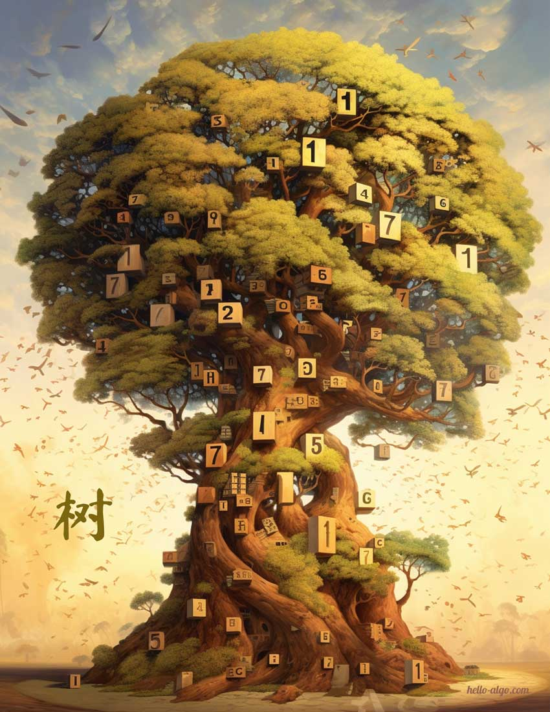

# 7. &nbsp; 树

{ width="600" }

## 本章内容

- [7.1 &nbsp; 二叉树](https://www.hello-algo.com/chapter_tree/binary_tree/)
- [7.2 &nbsp; 二叉树遍历](https://www.hello-algo.com/chapter_tree/binary_tree_traversal/)
- [7.3 &nbsp; 二叉树数组表示](https://www.hello-algo.com/chapter_tree/array_representation_of_tree/)
- [7.4 &nbsp; 二叉搜索树](https://www.hello-algo.com/chapter_tree/binary_search_tree/)
- [7.5 &nbsp; AVL 树 *](https://www.hello-algo.com/chapter_tree/avl_tree/)
- [7.6 &nbsp; 小结](https://www.hello-algo.com/chapter_tree/summary/)
