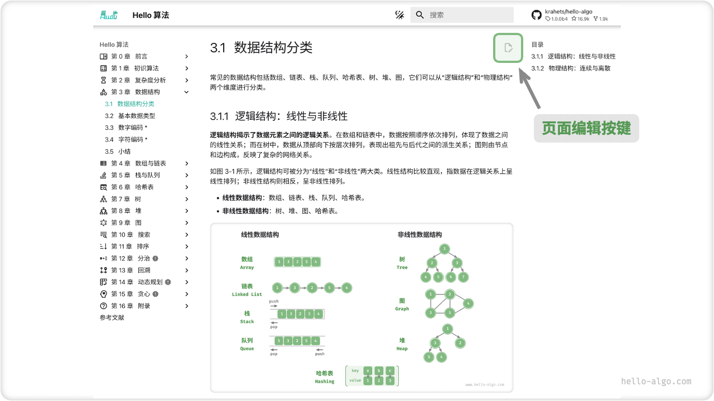

# Participate In Contributing

Due to the author's limited ability, it is inevitable that there are some omissions and errors in the book. If you have found clerical errors, invalid links, missing content, textual ambiguities, unclear solutions, or ill-structured lines, please assist us in making corrections in order to provide readers with a better quality learning resource.

The GitHub IDs of all [contributors](https://github.com/krahets/hello-algo/graphs/contributors) will be displayed on the book's repository homepage as a thank you for their unselfish contributions to the open source community.

!!! success "The appeal of open source"

    The time between printings of paper books often takes years, making it very inconvenient to update the content.
   
    In this open source book, however, the time for content turnover is reduced to days or even hours.

### Content Fine-Tuning

As shown in the figure below, there is an "Edit icon" in the upper right corner of each page. You can modify the text or code by following the steps below.

1. Click on the "Edit figure" and agree to this action if you are prompted to "Need to Fork this repository".
2. Modify the content of the Markdown source file, checking for correctness and trying to keep the formatting as uniform as possible.
3. At the bottom of the page, fill in the change instructions and click the "Propose file change" button. After the page jumps, click "Create pull request" button to initiate the pull request.



The graphs can't be modified directly, you need to describe the problem by creating a new [Issue](https://github.com/krahets/hello-algo/issues) or commenting on the message and we'll redraw and replace the graphs as soon as possible.

### Content Creation

If you are interested in participating in this open source project, including translating the code into other programming languages, extending the content of the article, etc., then the following Pull Request workflow needs to be implemented.

1. Log into GitHub and Fork [this repository](https://github.com/krahets/hello-algo) to your personal account.
2. Go to your Fork repository webpage and use the `git clone` command to clone the repository locally.
3. Content creation locally with full testing to verify code correctness.
4. Commit changes made locally and then Push them to the remote repository.
5. Refresh the repository page and click the "Create pull request" button to initiate a pull request.

### Docker Deployment

In the `hello-algo` root directory, execute the following Docker script to access the project at `http://localhost:8000`.

```shell
docker-compose up -d
```

Use the following command to delete the deployment.

```shell
docker-compose down
```
