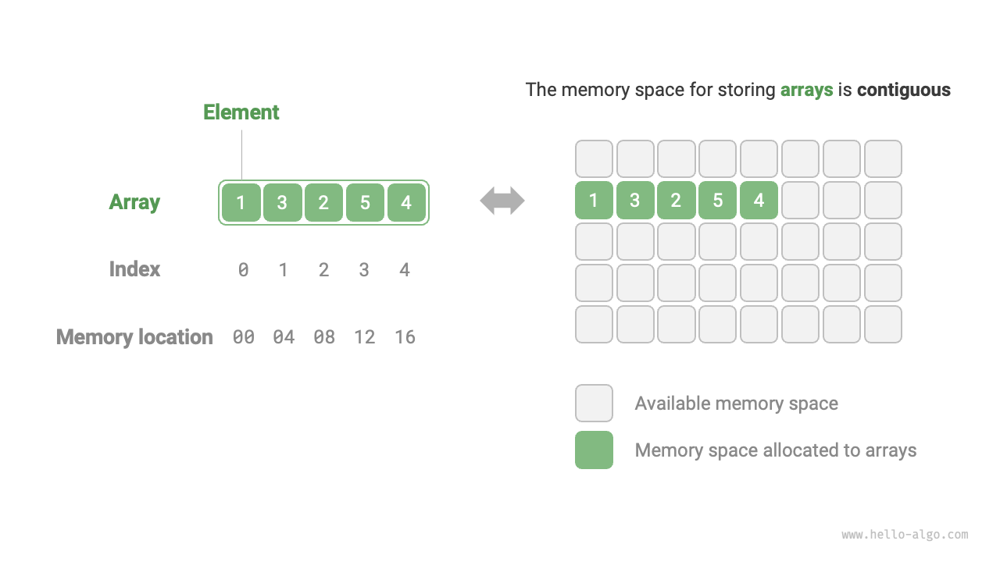
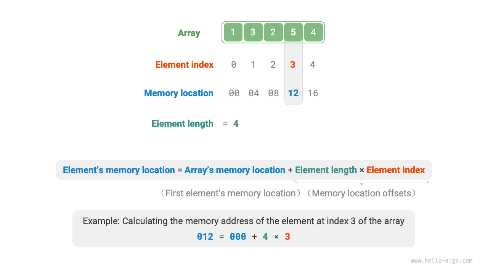
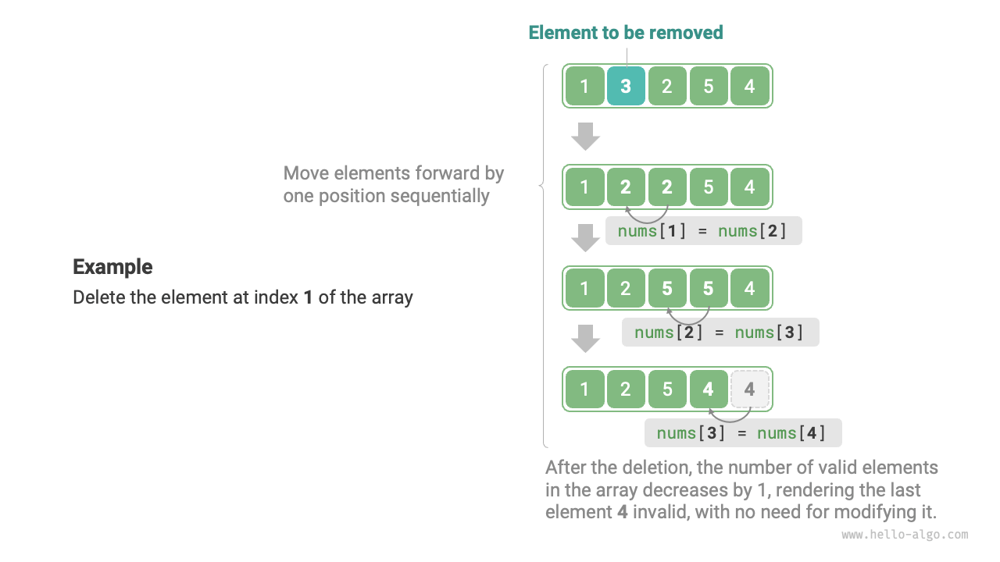

# Arrays

The "array" is a linear data structure that stores elements of the same type in contiguous memory locations. We refer to the position of an element in the array as its "index". The following image illustrates the main terminology and concepts of an array.



## Common Operations on Arrays

### Initializing Arrays

There are two ways to initialize arrays depending on the requirements: without initial values and with given initial values. In cases where initial values are not specified, most programming languages will initialize the array elements to $0$:

=== "Python"

    ```python title="array.py"
    # Initialize array
    arr: list[int] = [0] * 5  # [ 0, 0, 0, 0, 0 ]
    nums: list[int] = [1, 3, 2, 5, 4]
    ```

=== "C++"

    ```cpp title="array.cpp"
    /* Initialize array */
    // Stored on stack
    int arr[5];
    int nums[5] = { 1, 3, 2, 5, 4 };
    // Stored on heap (manual memory release needed)
    int* arr1 = new int[5];
    int* nums1 = new int[5] { 1, 3, 2, 5, 4 };
    ```

=== "Java"

    ```java title="array.java"
    /* Initialize array */
    int[] arr = new int[5]; // { 0, 0, 0, 0, 0 }
    int[] nums = { 1, 3, 2, 5, 4 };
    ```

=== "C#"

    ```csharp title="array.cs"
    /* Initialize array */
    int[] arr = new int[5]; // [ 0, 0, 0, 0, 0 ]
    int[] nums = [1, 3, 2, 5, 4];
    ```

=== "Go"

    ```go title="array.go"
    /* Initialize array */
    var arr [5]int
    // In Go, specifying the length ([5]int) denotes an array, while not specifying it ([]int) denotes a slice.
    // Since Go's arrays are designed to have compile-time fixed length, only constants can be used to specify the length.
    // For convenience in implementing the extend() method, the Slice will be considered as an Array here.
    nums := []int{1, 3, 2, 5, 4}
    ```

=== "Swift"

    ```swift title="array.swift"
    /* Initialize array */
    let arr = Array(repeating: 0, count: 5) // [0, 0, 0, 0, 0]
    let nums = [1, 3, 2, 5, 4]
    ```

=== "JS"

    ```javascript title="array.js"
    /* Initialize array */
    var arr = new Array(5).fill(0);
    var nums = [1, 3, 2, 5, 4];
    ```

=== "TS"

    ```typescript title="array.ts"
    /* Initialize array */
    let arr: number[] = new Array(5).fill(0);
    let nums: number[] = [1, 3, 2, 5, 4];
    ```

=== "Dart"

    ```dart title="array.dart"
    /* Initialize array */
    List<int> arr = List.filled(5, 0); // [0, 0, 0, 0, 0]
    List<int> nums = [1, 3, 2, 5, 4];
    ```

=== "Rust"

    ```rust title="array.rs"
    /* Initialize array */
    let arr: Vec<i32> = vec![0; 5]; // [0, 0, 0, 0, 0]
    let nums: Vec<i32> = vec![1, 3, 2, 5, 4];
    ```

=== "C"

    ```c title="array.c"
    /* Initialize array */
    int arr[5] = { 0 }; // { 0, 0, 0, 0, 0 }
    int nums[5] = { 1, 3, 2, 5, 4 };
    ```

=== "Zig"

    ```zig title="array.zig"
    // Initialize array
    var arr = [_]i32{0} ** 5; // { 0, 0, 0, 0, 0 }
    var nums = [_]i32{ 1, 3, 2, 5, 4 };
    ```

### Accessing Elements

Elements in an array are stored in contiguous memory locations, which makes it easy to compute the memory address of any element. Given the memory address of the array (the address of the first element) and the index of an element, we can calculate the memory address of that element using the formula shown in the following image, allowing direct access to the element.



As observed in the above image, the index of the first element of an array is $0$, which may seem counterintuitive since counting starts from $1$. However, from the perspective of the address calculation formula, **an index is essentially an offset from the memory address**. The offset for the first element's address is $0$, making its index $0$ logical.

Accessing elements in an array is highly efficient, allowing us to randomly access any element in $O(1)$ time.

```src
[file]{array}-[class]{}-[func]{random_access}
```

### Inserting Elements

As shown in the image below, to insert an element in the middle of an array, all elements following the insertion point must be moved one position back to make room for the new element.


It's important to note that since the length of an array is fixed, inserting an element will inevitably lead to the loss of the last element in the array. We will discuss solutions to this problem in the "List" chapter.

```src
[file]{array}-[class]{}-[func]{insert}
```

### Deleting Elements

Similarly, as illustrated below, to delete an element at index $i$, all elements following index $i$ must be moved forward by one position.



Note that after deletion, the last element becomes "meaningless", so we do not need to specifically modify it.

```src
[file]{array}-[class]{}-[func]{remove}
```

Overall, the insertion and deletion operations in arrays have the following disadvantages:

- **High Time Complexity**: Both insertion and deletion in an array have an average time complexity of $O(n)$, where $n$ is the length of the array.
- **Loss of Elements**: Due to the fixed length of arrays, elements that exceed the array's capacity are lost during insertion.
- **Waste of Memory**: We can initialize a longer array and use only the front part, allowing the "lost" end elements during insertion to be "meaningless", but this leads to some wasted memory space.

### Traversing Arrays

In most programming languages, we can traverse an array either by indices or by directly iterating over each element:

```src
[file]{array}-[class]{}-[func]{traverse}
```

### Finding Elements

To find a specific element in an array, we need to iterate through it, checking each element to see if it matches.

Since arrays are linear data structures, this operation is known as "linear search".

```src
[file]{array}-[class]{}-[func]{find}
```

### Expanding Arrays

In complex system environments, it's challenging to ensure that the memory space following an array is available, making it unsafe to extend the array's capacity. Therefore, in most programming languages, **the length of an array is immutable**.

To expand an array, we need to create a larger array and then copy the elements from the original array. This operation has a time complexity of $O(n)$ and can be time-consuming for large arrays. The code is as follows:

```src
[file]{array}-[class]{}-[func]{extend}
```

## Advantages and Limitations of Arrays

Arrays are stored in contiguous memory spaces and consist of elements of the same type. This approach includes a wealth of prior information that the system can use to optimize the operation efficiency of the data structure.

- **High Space Efficiency**: Arrays allocate a contiguous block of memory for data, eliminating the need for additional structural overhead.
- **Support for Random Access**: Arrays allow $O(1)$ time access to any element.
- **Cache Locality**: When accessing array elements, the computer not only loads them but also caches the surrounding data, leveraging high-speed cache to improve the speed of subsequent operations.

However, continuous space storage is a double-edged sword, with the following limitations:

- **Low Efficiency in Insertion and Deletion**: When there are many elements in an array, insertion and deletion operations require moving a large number of elements.
- **Fixed Length**: The length of an array is fixed after initialization. Expanding an array requires copying all data to a new array, which is costly.
- **Space Wastage**: If the allocated size of an array exceeds the actual need, the extra space is wasted.

## Typical Applications of Arrays

Arrays are a fundamental and common data structure, frequently used in various algorithms and in implementing complex data structures.

- **Random Access**: If we want to randomly sample some data, we can use an array for storage and generate a random sequence to implement random sampling based on indices.
- **Sorting and Searching**: Arrays are the most commonly used data structure for sorting and searching algorithms. Quick sort, merge sort, binary search, etc., are primarily conducted on arrays.
- **Lookup Tables**: Arrays can be used as lookup tables for fast element or relationship retrieval. For instance, if we want to implement a mapping from characters to ASCII codes, we can use the ASCII code value of a character as the index, with the corresponding element stored in the corresponding position in the array.
- **Machine Learning**: Arrays are extensively used in neural networks for linear algebra operations between vectors, matrices, and tensors. Arrays are the most commonly used data structure in neural network programming.
- **Data Structure Implementation**: Arrays can be used to implement stacks, queues, hash tables, heaps, graphs, etc. For example, the adjacency matrix representation of a graph is essentially a two-dimensional array.
