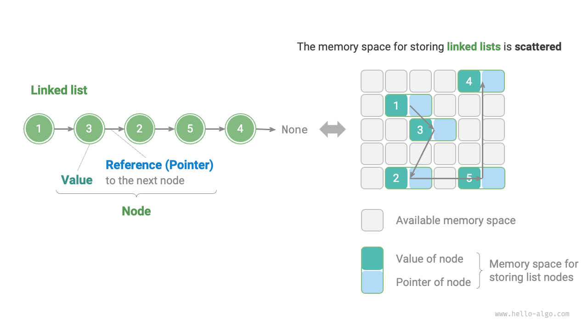
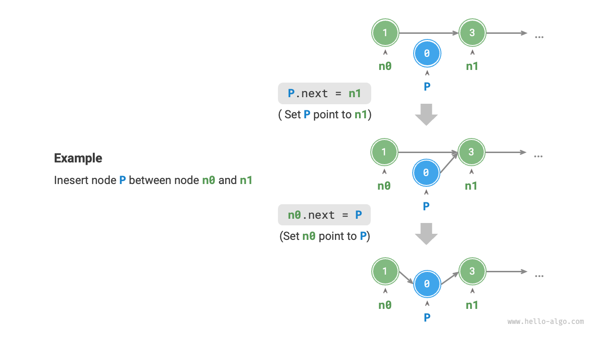
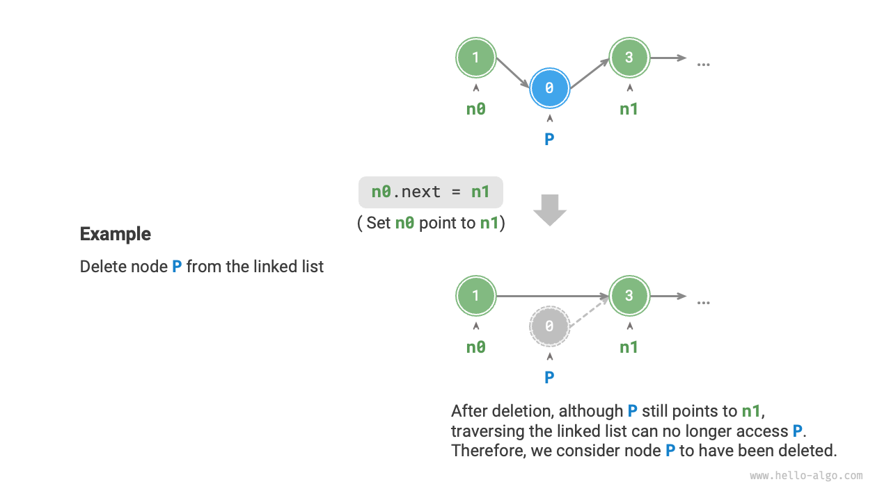
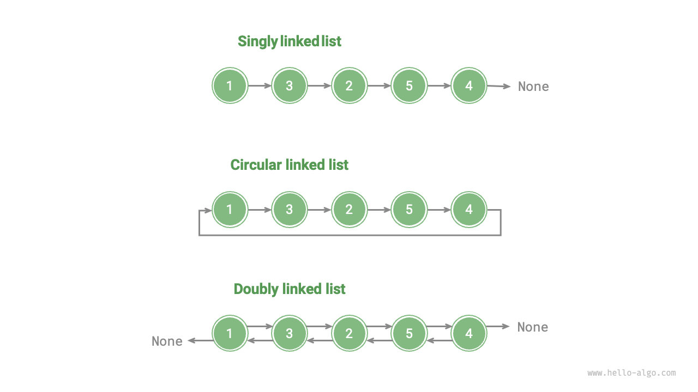

# Linked List

Memory space is a common resource for all programs, and in a complex system operating environment, free memory space may be scattered all over memory. We know that the memory space for storing an array must be contiguous, and when the array is very large, the memory may not be able to provide such a large contiguous space. This is where the flexibility of linked lists comes into play.

A "linked list linked list" is a linear data structure in which each element is a node object and each node is connected by a "reference". The reference records the memory address of the next node, which can be accessed from the current node to the next node.

Linked lists are designed so that individual nodes can be stored scattered throughout memory, and their memory addresses are needlessly contiguous.



Looking at the figure above, a linked list is composed of "node node" objects. Each node contains two pieces of data: the node's "value" and a "reference" to the next node.

- The first node of a linked list is called the "head node" and the last node is called the "tail node".
- The tail node points to "null", which is denoted as $\text{null}$, $\text{nullptr}$, and $\text{None}$ in Java, C++, and Python, respectively.
- In pointer-enabled languages such as C, C++, Go, and Rust, the above "reference" should be replaced with "pointer".

As shown in the following code, a linked list node `ListNode` holds an additional reference (pointer) in addition to the value. Therefore, for the same amount of data, **linked lists take up more memory space than arrays**.

=== "Python"

    ```python title=""
    class ListNode:
        """Class of linked lists nodes""""
        def __init__(self, val: int):
            self.val: int = val               # node value
            self.next: ListNode | None = None # reference to the next node
    ```

=== "C++"

    ```cpp title=""
    /* Linked list node structure */
    struct ListNode {
        int val;         // node value
        ListNode *next;  // Pointer to the next node.
        ListNode(int x) : val(x), next(nullptr) {}  // constructor
    };
    ```

=== "Java"

    ```java title=""
    /* Linked list node class */
    class ListNode {
        int val;        // node value
        ListNode next;  // Reference to the next node.
        ListNode(int x) { val = x; }  // Constructor
    }
    ```

=== "C#"

    ```csharp title=""
    /* Linked list node class */
    class ListNode {
        int val;         // node value
        ListNode next;   // Reference to the next node.
        ListNode(int x) => val = x; //constructor
    }
    ```

=== "Go"

    ```go title=""
    /* Linked list node structure */
    type ListNode struct {
        Val  int       // Node value
        Next *ListNode // Pointer to the next node.
    }

    // The NewListNode constructor, which creates a new linked list.
    func NewListNode(val int) *ListNode {
        return &ListNode{
            Val:  val,
            Next: nil,
        }
    }
    ```

=== "Swift"

    ```swift title=""
    /* Linked list node class */
    class ListNode {
        var val: Int // node value
        var next: ListNode? // Reference to the next node.

        init(x: Int) { // constructor
            val = x
        }
    }
    ```

=== "JS"

    ```javascript title=""
    /* Linked list node class */
    class ListNode {
        constructor(val, next) {
            this.val = (val === undefined ? 0 : val);       // node value
            this.next = (next === undefined ? null : next); // reference to next node
        }
    }
    ```

=== "TS"

    ```typescript title=""
    /* Linked list node class */
    class ListNode {
        val: number;
        next: ListNode | null;
        constructor(val?: number, next?: ListNode | null) {
            this.val = val === undefined ? 0 : val;        // node value
            this.next = next === undefined ? null : next;  // reference to the next node
        }
    }
    ```

=== "Dart"

    ```dart title=""
    /* Linked list node class */
    class ListNode {
      int val; // node value
      ListNode? next; // Reference to the next node.
      ListNode(this.val, [this.next]); // constructor
    }
    ```

=== "Rust"

    ```rust title=""
    use std::rc::Rc;
    use std::cell::RefCell;
    /* Linked list node class */
    #[derive(Debug)]
    struct ListNode {
        val: i32, // node value
        next: Option<Rc<RefCell<ListNode>>>, // pointer to next node
    }
    ```

=== "C"

    ```c title=""
    /* Linked list node structure */
    typedef struct ListNode {
        int val;               // node value
        struct ListNode *next; // Pointer to the next node.
    } ListNode;

    /* Constructors */
    ListNode *newListNode(int val) {
        ListNode *node, *next;
        node = (ListNode *) malloc(sizeof(ListNode));
        node->val = val;
        node->next = NULL;
        return node;
    }
    ```

=== "Zig"

    ```zig title=""
    // Linked list node class
    pub fn ListNode(comptime T: type) type {
        return struct {
            const Self = @This();

            val: T = 0, // node value
            next: ?*Self = null, // pointer to the next node

            // Constructor
            pub fn init(self: *Self, x: i32) void {
                self.val = x;
                self.next = null;
            }
        };
    }
    ```

## Common Operations On Linked Lists

### Initialize A Linked List

Creating a linked list is a two-step process. The first step is to initialize each node object, and the second step is to build a reference-pointing relationship. After initialization, we can start from the head node of the linked list node, through the reference pointing `next` to access all the nodes in turn.

=== "Python"

    ```python title="linked_list.py"
    # Initialize linked list 1 -> 3 -> 2 -> 5 -> 4
    # Initialize individual nodes
    n0 = ListNode(1)
    n1 = ListNode(3)
    n2 = ListNode(2)
    n3 = ListNode(5)
    n4 = ListNode(4)
    # Construct references to point to
    n0.next = n1
    n1.next = n2
    n2.next = n3
    n3.next = n4
    ```

=== "C++"

    ```cpp title="linked_list.cpp"
    /* Initialize linked list 1 -> 3 -> 2 -> 5 -> 4 */
    // Initialize each node
    ListNode* n0 = new ListNode(1);
    ListNode* n1 = new ListNode(3);
    ListNode* n2 = new ListNode(2);
    ListNode* n3 = new ListNode(5);
    ListNode* n4 = new ListNode(4);
    // Construct references to point to
    n0->next = n1;
    n1->next = n2;
    n2->next = n3;
    n3->next = n4;
    ```

=== "Java"

    ```java title="linked_list.java"
    /* Initialize linked list 1 -> 3 -> 2 -> 5 -> 4 */
    // Initialize each node
    ListNode n0 = new ListNode(1);
    ListNode n1 = new ListNode(3);
    ListNode n2 = new ListNode(2);
    ListNode n3 = new ListNode(5);
    ListNode n4 = new ListNode(4);
    // Construct references to point to
    n0.next = n1;
    n1.next = n2;
    n2.next = n3;
    n3.next = n4;
    ```

=== "C#"

    ```csharp title="linked_list.cs"
    /* Initialize linked list 1 -> 3 -> 2 -> 5 -> 4 */
    // Initialize each node
    ListNode n0 = new(1);
    ListNode n1 = new(3);
    ListNode n2 = new(2);
    ListNode n3 = new(5);
    ListNode n4 = new(4);
    // Construct references to point to
    n0.next = n1;
    n1.next = n2;
    n2.next = n3;
    n3.next = n4;
    ```

=== "Go"

    ```go title="linked_list.go"
    /* Initialize linked list 1 -> 3 -> 2 -> 5 -> 4 */
    // Initialize each node
    n0 := NewListNode(1)
    n1 := NewListNode(3)
    n2 := NewListNode(2)
    n3 := NewListNode(5)
    n4 := NewListNode(4)
    // Construct references to point to
    n0.Next = n1
    n1.Next = n2
    n2.Next = n3
    n3.Next = n4
    ```

=== "Swift"

    ```swift title="linked_list.swift"
    /* Initialize linked list 1 -> 3 -> 2 -> 5 -> 4 */
    // Initialize each node
    let n0 = ListNode(x: 1)
    let n1 = ListNode(x: 3)
    let n2 = ListNode(x: 2)
    let n3 = ListNode(x: 5)
    let n4 = ListNode(x: 4)
    // Construct references to point to
    n0.next = n1
    n1.next = n2
    n2.next = n3
    n3.next = n4
    ```

=== "JS"

    ```javascript title="linked_list.js"
    /* Initialize linked list 1 -> 3 -> 2 -> 5 -> 4 */
    // Initialize each node
    const n0 = new ListNode(1);
    const n1 = new ListNode(3);
    const n2 = new ListNode(2);
    const n3 = new ListNode(5);
    const n4 = new ListNode(4);
    // Construct references to point to
    n0.next = n1;
    n1.next = n2;
    n2.next = n3;
    n3.next = n4;
    ```

=== "TS"

    ```typescript title="linked_list.ts"
    /* Initialize linked list 1 -> 3 -> 2 -> 5 -> 4 */
    // Initialize each node
    const n0 = new ListNode(1);
    const n1 = new ListNode(3);
    const n2 = new ListNode(2);
    const n3 = new ListNode(5);
    const n4 = new ListNode(4);
    // Construct references to point to
    n0.next = n1;
    n1.next = n2;
    n2.next = n3;
    n3.next = n4;
    ```

=== "Dart"

    ```dart title="linked_list.dart"
    /* Initialize linked list 1 -> 3 -> 2 -> 5 -> 4 */\
    // Initialize each node
    ListNode n0 = ListNode(1);
    ListNode n1 = ListNode(3);
    ListNode n2 = ListNode(2);
    ListNode n3 = ListNode(5);
    ListNode n4 = ListNode(4);
    // Construct references to point to
    n0.next = n1;
    n1.next = n2;
    n2.next = n3;
    n3.next = n4;
    ```

=== "Rust"

    ```rust title="linked_list.rs"
    /* Initialize linked list 1 -> 3 -> 2 -> 5 -> 4 */
    // Initialize each node
    let n0 = Rc::new(RefCell::new(ListNode { val: 1, next: None }));
    let n1 = Rc::new(RefCell::new(ListNode { val: 3, next: None }));
    let n2 = Rc::new(RefCell::new(ListNode { val: 2, next: None }));
    let n3 = Rc::new(RefCell::new(ListNode { val: 5, next: None }));
    let n4 = Rc::new(RefCell::new(ListNode { val: 4, next: None }));

    // Construct references to point to
    n0.borrow_mut().next = Some(n1.clone());
    n1.borrow_mut().next = Some(n2.clone());
    n2.borrow_mut().next = Some(n3.clone());
    n3.borrow_mut().next = Some(n4.clone());
    ```

=== "C"

    ```c title="linked_list.c"
    /* Initialize linked list 1 -> 3 -> 2 -> 5 -> 4 */
    // Initialize each node
    ListNode* n0 = newListNode(1);
    ListNode* n1 = newListNode(3);
    ListNode* n2 = newListNode(2);
    ListNode* n3 = newListNode(5);
    ListNode* n4 = newListNode(4);
    // Construct references to point to
    n0->next = n1;
    n1->next = n2;
    n2->next = n3;
    n3->next = n4;
    ```

=== "Zig"

    ```zig title="linked_list.zig"
    // Initialize the linked list.
    // Initialize each node
    var n0 = inc.ListNode(i32){.val = 1};
    var n1 = inc.ListNode(i32){.val = 3};
    var n2 = inc.ListNode(i32){.val = 2};
    var n3 = inc.ListNode(i32){.val = 5};
    var n4 = inc.ListNode(i32){.val = 4};
    // Construct references to point to
    n0.next = &n1;
    n1.next = &n2;
    n2.next = &n3;
    n3.next = &n4;
    ```

An array as a whole is a variable, e.g., the array `nums` contains the elements `nums[0]` and `nums[1]`, etc., whereas a linked list consists of a number of separate node objects. **We usually take the head node as a surrogate for a linked list**. For example, the linked list in the above code can be notated as a linked list `n0` .

### Insert Node

Inserting nodes in a linked list is very easy. As shown in the figure below, suppose we want to insert a new node `P` between two neighboring nodes `n0` and `n1` , **then we just need to change the two node references (pointers)**with a time complexity of $O(1)$ .

In contrast, inserting elements into an array has a time complexity of $O(n)$ , which is less efficient with large amounts of data.



```src
[file]{linked_list}-[class]{}-[func]{insert}
```

### Delete Node

As shown in the figure below, it is also very easy to delete nodes in a linked list **just by changing the reference (pointer) to a node**.

Note that although the node `P` still points to `n1` after the deletion operation is completed, it is not actually possible to traverse the linked list to reach `P`, which means that `P` no longer belongs to the linked list.



```src
[file]{linked_list}-[class]{}-[func]{remove}
```

### Access Nodes

**It is less efficient to access nodes in a linked list**. As mentioned in the previous section, we can access any element in the array in $O(1)$ time. This is not the case for linked lists, where the program needs to start from the head node and traverse backward one by one until it finds the target node. In other words, accessing the $i$th node of the linked list requires a loop of $i - 1$ rounds, with a time complexity of $O(n)$ .

```src
[file]{linked_list}-[class]{}-[func]{access}
```

### Find The Node

Traverses the linked list, finds the node whose value is `target`, and outputs the index of the node in the linked list. This process is also a linear lookup.

```src
[file]{linked_list}-[class]{}-[func]{find}
```

## Arrays Vs. Linked Lists

The table below summarizes and compares the various properties and operational efficiencies of arrays and linked lists. Since they use two opposite storage strategies, the various properties and operational efficiencies are also characterized by opposites.

<p align="center"> Table <id> &nbsp; Efficiency of Arrays vs. Linked Lists </p>

|                    | arrays                               | linked lists             |
| ------------------ | ------------------------------------ | ------------------------ |
| Storage Methods    | Continuous Memory Space              | Distributed Memory Space |
| Cache Localization | Friendly                             | Unfriendly               |
| Capacity Expansion | Non-variable Length                  | Flexible Expansion       |
| Memory Efficiency  | Less memory usage, some space wasted | More memory usage        |
| access elements    | $O(1)$                               | $O(n)$                   |
| Add Element        | $O(n)$                               | $O(1)$                   |
| Delete Element     | $O(n)$                               | $O(1)$                   |

## Common Linked List Types

As shown in the figure below, there are three common types of linked lists.

- **Unidirectional linked list**: i.e., the ordinary linked list introduced above. The nodes of a unidirectional linked list contain two pieces of data, the value and a reference to the next node. We will refer to the first node as the head node and the last node as the tail node, which points to null $\text{None}$ .
- **Ring linked list**: If we make the tail node of a unidirectional linked list point to the head node (i.e., the head and tail are connected), we get a ring linked list. In a ring linked list node any node can be considered as the head node.
- **Bidirectional linked lists**: In contrast to unidirectional linked lists, bidirectional linked lists record references in both directions. The node definition of a bi-directional linked list contains references (pointers) to both the successor node (next node) and the predecessor node (previous node). Compared to unidirectional linked lists, bi-directional linked lists are more flexible and can be traversed in both directions, but accordingly require more memory space.

=== "Python"

    ```python title=""
    class ListNode:
        """Bidirectional linked list node class""""
        def __init__(self, val: int):
            self.val: int = val                # node value
            self.next: ListNode | None = None  # reference to the successor node
            self.prev: ListNode | None = None  # reference to a predecessor node
    ```

=== "C++"

    ```cpp title=""
    /* Bidirectional linked list node structure */
    struct ListNode {
        int val;         // node value
        ListNode *next;  // Pointer to the successor node.
        ListNode *prev;  // pointer to the predecessor node
        ListNode(int x) : val(x), next(nullptr), prev(nullptr) {}  // constructor
    };
    ```

=== "Java"

    ```java title=""
    /* Bidirectional linked list node class */
    class ListNode {
        int val;        // node value
        ListNode next;  // Reference to the next node.
        ListNode prev;  // reference to the predecessor node
        ListNode(int x) { val = x; }  // Constructor
    }
    ```

=== "C#"

    ```csharp title=""
    /* Bidirectional linked list node class */
    class ListNode {
        int val;        // node value
        ListNode next;  // Reference to the next node.
        ListNode prev;  // reference to the predecessor node
        ListNode(int x) => val = x;  // constructor
    }
    ```

=== "Go"

    ```go title=""
    /* Bidirectional linked list node structure */
    type DoublyListNode struct {
        Val  int             // Node value
        Next *DoublyListNode // Pointer to the successor node.
        Prev *DoublyListNode // pointer to the predecessor node
    }

    // NewDoublyListNode initialization
    func NewDoublyListNode(val int) *DoublyListNode {
        return &DoublyListNode{
            Val:  val,
            Next: nil,
            Prev: nil,
        }
    }
    ```

=== "Swift"

    ```swift title=""
    /* Bidirectional linked list node class */
    class ListNode {
        var val: Int // node value
        var next: ListNode? // Reference to the next node.
        var prev: ListNode? // Reference to the predecessor node.

        init(x: Int) { // constructor
            val = x
        }
    }
    ```

=== "JS"

    ```javascript title=""
    /* Bidirectional linked list node class */
    class ListNode {
        constructor(val, next, prev) {
            this.val = val  ===  undefined ? 0 : val;        // node value
            this.next = next  ===  undefined ? null : next;  // reference to the successor node
            this.prev = prev  ===  undefined ? null : prev;  // reference to the predecessor node
        }
    }
    ```

=== "TS"

    ```typescript title=""
    /* Bidirectional linked list node class */
    class ListNode {
        val: number;
        next: ListNode | null;
        prev: ListNode | null;
        constructor(val?: number, next?: ListNode | null, prev?: ListNode | null) {
            this.val = val  ===  undefined ? 0 : val;        // node value
            this.next = next  ===  undefined ? null : next;  // reference to the successor node
            this.prev = prev  ===  undefined ? null : prev;  // reference to the predecessor node
        }
    }
    ```

=== "Dart"

    ```dart title=""
    /* Bidirectional linked list node class */
    class ListNode {
        int val;        // node value
        ListNode next;  // Reference to the next node.
        ListNode prev;  // reference to the predecessor node
        ListNode(this.val, [this.next, this.prev]);  // Constructor
    }
    ```

=== "Rust"

    ```rust title=""
    use std::rc::Rc;
    use std::cell::RefCell;

    /* Bidirectional linked list node type */
    #[derive(Debug)]
    struct ListNode {
        val: i32, // node value
        next: Option<Rc<RefCell<ListNode>>>, // pointer to successor node
        prev: Option<Rc<RefCell<ListNode>>>, // pointer to predecessor node
    }

    /* Constructors */
    impl ListNode {
        fn new(val: i32) -> Self {
            ListNode {
                val,
                next: None,
                prev: None,
            }
        }
    }
    ```

=== "C"

    ```c title=""
    /* Bidirectional linked list node structure */
    typedef struct ListNode {
        int val;               // node value
        struct ListNode *next; // Pointer to the successor node.
        struct ListNode *prev; // pointer to the predecessor node
    } ListNode;

    /* Constructors */
    ListNode *newListNode(int val) {
        ListNode *node, *next;
        node = (ListNode *) malloc(sizeof(ListNode));
        node->val = val;
        node->next = NULL;
        node->prev = NULL;
        return node;
    }
    ```

=== "Zig"

    ```zig title=""
    // Bidirectional linked list node class
    pub fn ListNode(comptime T: type) type {
        return struct {
            const Self = @This();

            val: T = 0, // node value
            next: ?*Self = null, // pointer to the successor node
            prev: ?*Self = null, // pointer to the predecessor node

            // Constructor
            pub fn init(self: *Self, x: i32) void {
                self.val = x;
                self.next = null;
                self.prev = null;
            }
        };
    }
    ```



## Typical Applications Of Linked Lists

One-way linked lists are commonly used to implement data structures such as stacks, queues, hash tables and graphs.

- **Stack vs. Queue**: when both insertion and deletion operations are performed at one end of a linked list, it exhibits a FIFO characteristic, corresponding to a stack; when insertion operations are performed at one end of a linked list and deletion operations are performed at the other end of a linked list, it exhibits a FIFO characteristic, corresponding to a queue.
- **Hash table**: the linked address method is one of the dominant solutions to hash collisions, in which all conflicting elements are put into a linked list.
- **Graph**: An adjacency list is a common way of representing a graph, in which each vertex of the graph is associated with a linked list, and each element of the linked list represents the other vertices connected to that vertex.

Bidirectional linked lists are often used in scenarios where you need to quickly find the previous and next elements.

- **Advanced Data Structures**: e.g. in red-black tree, B-tree, we need to access the parent node of a node, this can be done by keeping a reference to the parent node in the node, similar to a bidirectional linked list.
- **Browser History**: In web browsers, when a user clicks on the forward or back button, the browser needs to know the previous and next web pages that the user has visited. The property of bi-directional linked lists makes this operation easy.
- **LRU algorithm**: In a cache elimination algorithm (LRU), we need to quickly find the least recently used data as well as support adding and removing nodes quickly. This is where the use of bi-directional linked lists is very appropriate.

Circular linked lists are often used in scenarios that require periodic operations, such as resource scheduling in operating systems.

- **Time Slice Rotation Scheduling Algorithm**: In operating systems, the time slice rotation scheduling algorithm is a common CPU scheduling algorithm that involves looping over a set of processes. Each process is given a time slice and when the time slice runs out, the CPU switches to the next process. The operation of such a loop can then be realized by means of a circular linked list.
- **Data Buffers**: In some data buffer implementations, circular linked lists may also be used. For example, in audio and video players, the data stream may be divided into multiple buffer blocks and put into a circular linked list for seamless playback.
