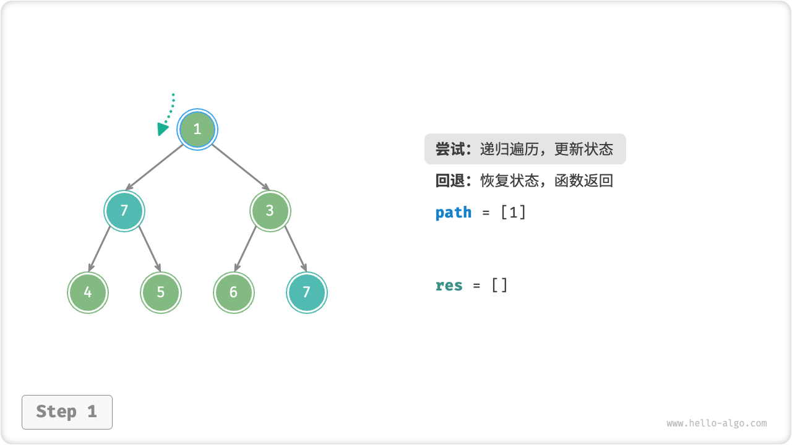
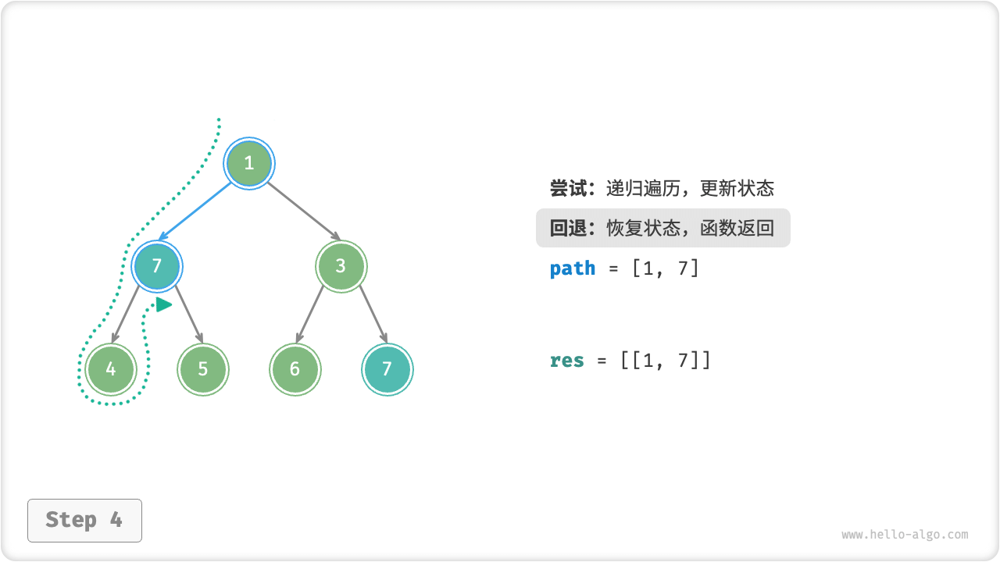
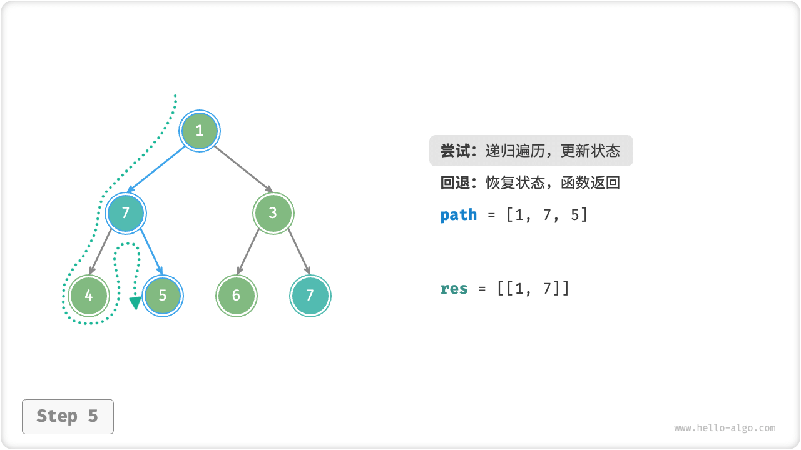
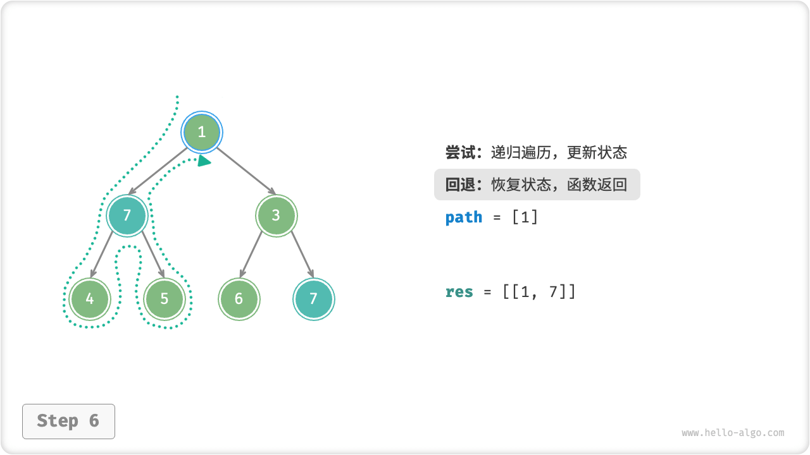
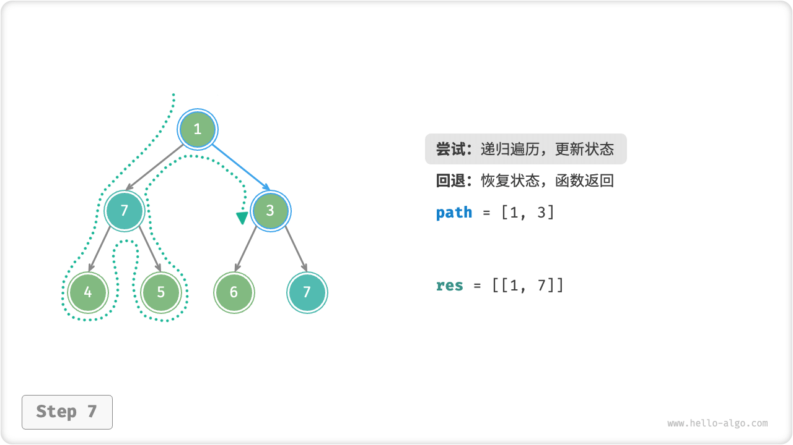
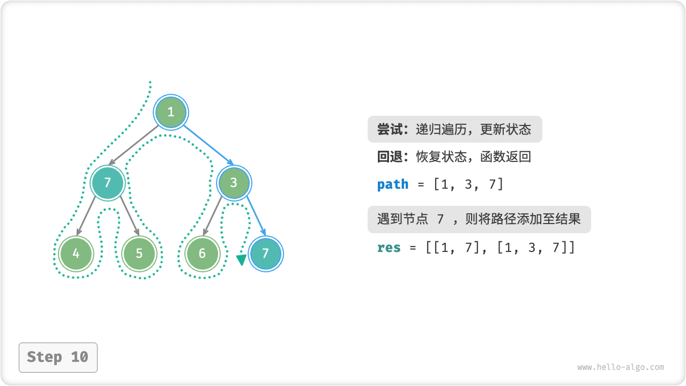
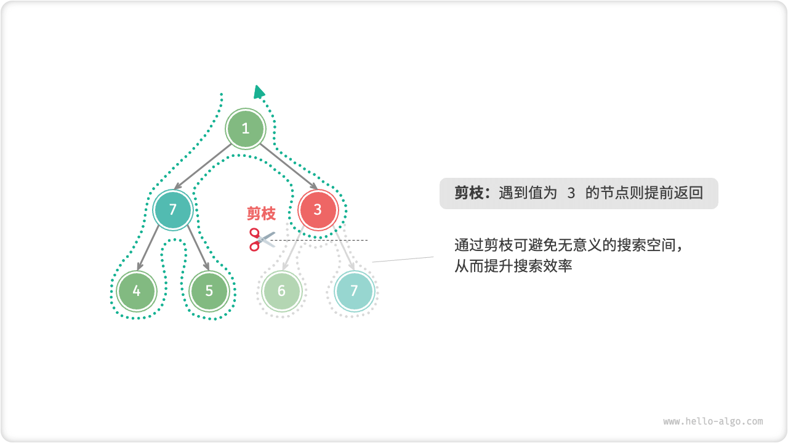

# Backtracking Algorithm

"The backtracking algorithm is a method of solving problems by exhaustive enumeration. The core idea is to start from an initial state, brute-force search for all possible solutions, and record the correct solution when it is encountered, until a solution is found, or the solution cannot be found after trying all possible choices.

Backtracking algorithms usually use "depth-first search" to traverse the solution space. In the binary tree chapter, we mentioned that the preorder, midorder, and postorder traversals are all depth-first searches. In the next section, we will construct a backtracking problem using preorder traversal to understand how the backtracking algorithm works.

!!! question "Example 1"

    Given a binary tree, search for and record all nodes with the value $7$, return the list of nodes.

For this problem, we traverse the tree node in preorder and determine whether the value of the current node is $7$ , if yes, then the value of the node is added to the result list `res`. The procedure is realized as shown in the figure below and in the following code.

```src
[file]{preorder_traversal_i_compact}-[class]{}-[func]{pre_order}
```


## Try And Fall Back

**The backtracking algorithm is called backtracking algorithm because it employs a "try" and "backtrack" strategy when searching the solution space**. When the algorithm encounters a state in the search process where it cannot move forward or cannot obtain a solution that satisfies the conditions, it will undo the previous choice, fall back to the previous state, and try other possible choices.

For Example 1, visiting each node represents a "try", while `return` to cross a leaf node or return to a parent node represents a "backtrack".

It is worth clarifying that **the fallback does not include only functions returning**. To explain this, we expand slightly on Example 1.

!!! question "Example 2"

    Search for all nodes in the binary tree with the value $7$**Please return the path from the root node to these nodes**.

Based on the code in Example 1, we need to record the path of the visited nodes with the help of a list `path`. When a node with value $7$ is visited, `path` is copied and added to the result list `res` . Once the traversal is complete, `res` holds all the solutions.

```src
[file]{preorder_traversal_ii_compact}-[class]{}-[func]{pre_order}
```

In each "try", we record the path by adding the current node to `path`; **before "fallback", we need to pop the node out of `path` to restore the state of the node before this try**. to restore the state before this attempt.

Observing the process shown in the figure below, **we can understand try and back as "forward" and "undo"**, the two operations are inverse to each other.

=== "<1>"
    

=== "<2>"
    

=== "<3>"
    

=== "<4>"
    

=== "<5>"
    

=== "<6>"
    

=== "<7>"
    

=== "<8>"
    

=== "<9>"
    

=== "<10>"
    

=== "<11>"
    

## Pruning

Complex backtracking problems usually contain one or more constraints, **Constraints can often be used for "pruning"**.

!!! question "Example 3"

    Search for all nodes in the binary tree with value $7$, return the path from the root node to these nodes, **and require that the path does not contain nodes with value $3$**.

In order to satisfy the above constraints, **we need to add the pruning operation**: if a node with the value $3$ is encountered during the search process, it is returned early and the search is stopped from continuing.

```src
[file]{preorder_traversal_iii_compact}-[class]{}-[func]{pre_order}
```

Pruning is a very visual term. As shown in the figure below, during the search process, **we "cut off" the search branches that do not satisfy the constraints** to avoid many meaningless attempts, thus improving the search efficiency.



## Framework Code

Next, we try to distill the main framework of "try, fallback, pruning" of backtracking to improve the generality of the code.

In the following framework code, `state` denotes the current state of the problem, and `choices` denotes the choices that can be made in the current state.

=== "Python"

    ```python title=""
    def backtrack(state: State, choices: list[choice], res: list[state]):
        """Backtracking algorithm framework""""
        # Determine if it's a solution
        if is_solution(state):
            # Recorded solutions
            record_solution(state, res)
            # Stop continuing the search
            return
        # Iterate over all choices
        for choice in choices:
            # Pruning: determining whether a choice is legal or not
            if is_valid(state, choice):
                # Trying: making choices, updating state
                make_choice(state, choice)
                backtrack(state, choices, res)
                # Fallback: undo the selection and revert to the previous state
                undo_choice(state, choice)
    ```

=== "C++"

    ```cpp title=""
    /* Backtracking algorithm framework */
    void backtrack(State *state, vector<Choice *> &choices, vector<State *> &res) {
        // Determine whether it is a solution or not
        if (isSolution(state)) {
            // Record the solution
            recordSolution(state, res);
            // Stop continuing the search
            return;
        }
        // Iterate over all choices
        for (Choice choice : choices) {
            // Pruning: determining whether a choice is legal or not
            if (isValid(state, choice)) {
                // Try: make a choice, update the state
                makeChoice(state, choice);
                backtrack(state, choices, res);
                // Fallback: undo the selection and revert to the previous state
                undoChoice(state, choice);
            }
        }
    }
    ```

=== "Java"

    ```java title=""
    /* Backtracking algorithm framework */
    void backtrack(State state, List<Choice> choices, List<State> res) {
        // Determine whether it is a solution or not
        if (isSolution(state)) {
            // Record the solution
            recordSolution(state, res);
            // Stop continuing the search
            return;
        }
        // Iterate over all choices
        for (Choice choice : choices) {
            // Pruning: determining whether a choice is legal or not
            if (isValid(state, choice)) {
                // Try: make a choice, update the state
                makeChoice(state, choice);
                backtrack(state, choices, res);
                // Fallback: undo the selection and revert to the previous state
                undoChoice(state, choice);
            }
        }
    }
    ```

=== "C#"

    ```csharp title=""
    /* Backtracking algorithm framework */
    void Backtrack(State state, List<Choice> choices, List<State> res) {
        // Determine whether it is a solution or not
        if (IsSolution(state)) {
            // Record the solution
            RecordSolution(state, res);
            // Stop continuing the search
            return;
        }
        // Iterate over all choices
        foreach (Choice choice in choices) {
            // Pruning: determining whether a choice is legal or not
            if (IsValid(state, choice)) {
                // Try: make a choice, update the state
                MakeChoice(state, choice);
                Backtrack(state, choices, res);
                // Fallback: undo the selection and revert to the previous state
                UndoChoice(state, choice);
            }
        }
    }
    ```

=== "Go"

    ```go title=""
    /* Backtracking algorithm framework */
    func backtrack(state *State, choices []Choice, res *[]State) {
        // Determine whether it is a solution or not
        if isSolution(state) {
            // Record the solution
            recordSolution(state, res)
            // Stop continuing the search
            return
        }
        // Iterate over all choices
        for _, choice := range choices {
            // Pruning: determining whether a choice is legal or not
            if isValid(state, choice) {
                // Try: make a choice, update the state
                makeChoice(state, choice)
                backtrack(state, choices, res)
                // Fallback: undo the selection and revert to the previous state
                undoChoice(state, choice)
            }
        }
    }
    ```

=== "Swift"

    ```swift title=""
    /* Backtracking algorithm framework */
    func backtrack(state: inout State, choices: [Choice], res: inout [State]) {
        // Determine whether it is a solution or not
        if isSolution(state: state) {
            // Record the solution
            recordSolution(state: state, res: &res)
            // Stop continuing the search
            return
        }
        // Iterate over all choices
        for choice in choices {
            // Pruning: determining whether a choice is legal or not
            if isValid(state: state, choice: choice) {
                // Try: make a choice, update the state
                makeChoice(state: &state, choice: choice)
                backtrack(state: &state, choices: choices, res: &res)
                // Fallback: undo the selection and revert to the previous state
                undoChoice(state: &state, choice: choice)
            }
        }
    }
    ```

=== "JS"

    ```javascript title=""
    /* Backtracking algorithm framework */
    function backtrack(state, choices, res) {
        // Determine whether it is a solution or not
        if (isSolution(state)) {
            // Record the solution
            recordSolution(state, res);
            // Stop continuing the search
            return;
        }
        // Iterate over all choices
        for (let choice of choices) {
            // Pruning: determining whether a choice is legal or not
            if (isValid(state, choice)) {
                // Try: make a choice, update the state
                makeChoice(state, choice);
                backtrack(state, choices, res);
                // Fallback: undo the selection and revert to the previous state
                undoChoice(state, choice);
            }
        }
    }
    ```

=== "TS"

    ```typescript title=""
    /* Backtracking algorithm framework */
    function backtrack(state: State, choices: Choice[], res: State[]): void {
        // Determine whether it is a solution or not
        if (isSolution(state)) {
            // Record the solution
            recordSolution(state, res);
            // Stop continuing the search
            return;
        }
        // Iterate over all choices
        for (let choice of choices) {
            // Pruning: determining whether a choice is legal or not
            if (isValid(state, choice)) {
                // Try: make a choice, update the state
                makeChoice(state, choice);
                backtrack(state, choices, res);
                // Fallback: undo the selection and revert to the previous state
                undoChoice(state, choice);
            }
        }
    }
    ```

=== "Dart"

    ```dart title=""
    /* Backtracking algorithm framework */
    void backtrack(State state, List<Choice>, List<State> res) {
      // Determine whether it is a solution or not
      if (isSolution(state)) {
        // Record the solution
        recordSolution(state, res);
        // Stop continuing the search
        return;
      }
      // Iterate over all choices
      for (Choice choice in choices) {
        // Pruning: determining whether a choice is legal or not
        if (isValid(state, choice)) {
          // Try: make a choice, update the state
          makeChoice(state, choice);
          backtrack(state, choices, res);
          // Fallback: undo the selection and revert to the previous state
          undoChoice(state, choice);
        }
      }
    }
    ```

=== "Rust"

    ```rust title=""
    /* Backtracking algorithm framework */
    fn backtrack(state: &mut State, choices: &Vec<Choice>, res: &mut Vec<State>) {
        // Determine whether it is a solution or not
        if is_solution(state) {
            // Record the solution
            record_solution(state, res);
            // Stop continuing the search
            return;
        }
        // Iterate over all choices
        for choice in choices {
            // Pruning: determining whether a choice is legal or not
            if is_valid(state, choice) {
                // Try: make a choice, update the state
                make_choice(state, choice);
                backtrack(state, choices, res);
                // Fallback: undo the selection and revert to the previous state
                undo_choice(state, choice);
            }
        }
    }
    ```

=== "C"

    ```c title=""
    /* Backtracking algorithm framework */
    void backtrack(State *state, Choice *choices, int numChoices, State *res, int numRes) {
        // Determine if it's a solution.
        if (isSolution(state)) {
            // Record the solution
            recordSolution(state, res, numRes);
            // Stop continuing the search
            return;
        }
        // Iterate over all choices
        for (int i = 0; i < numChoices; i++) {
            // Pruning: determining whether a choice is legal or not
            if (isValid(state, &choices[i])) {
                // Try: make a choice, update the state
                makeChoice(state, &choices[i]);
                backtrack(state, choices, numChoices, res, numRes);
                // Fallback: undo the selection and revert to the previous state
                undoChoice(state, &choices[i]);
            }
        }
    }
    ```

=== "Zig"

    ```zig title=""

    ```

Next, we solve example 3 based on the framework code. The state `state` is the node traversal path, the choices `choices` are the left-child nodes and right-child nodes of the current node, and the result `res` is the list of paths.

```src
[file]{preorder_traversal_iii_template}-[class]{}-[func]{backtrack}
```

According to the question, we should continue the search after finding the node with the value $7$, **so we need to remove the `return` statement after recording the solution**. The figure below compares the search process of keeping or removing `return` statements.


The code implementation based on the backtracking algorithm framework is more general, although it seems verbose, than the code implementation based on the preorder traversal. In fact, **many backtracking problems can be solved under this framework**. We just need to define `state` and `choices` according to the specific problem and implement the methods in the framework.

## Commonly Used Terms

In order to analyze the algorithm problem more clearly, we summarize the meaning of the common terms used in the backtracking algorithm and give corresponding examples against Example 3.

<p align="center"> Table <id> &nbsp; Common backtracking algorithm terminology </p>

| Nouns                 | Definitions                                                                                                                                                            | Example 3                                                                                                                                                  |
| --------------------- | ---------------------------------------------------------------------------------------------------------------------------------------------------------------------- | ---------------------------------------------------------------------------------------------------------------------------------------------------------- |
| Solution Solution     | A solution is an answer that satisfies a specific condition of the problem, there may be one or more                                                                   | All paths from the root node to the node $7$ that satisfy the constraints                                                                                  |
| Constraint Constraint | A constraint is a condition in a problem that restricts the feasibility of a solution, usually used for pruning                                                        | The path does not contain a node $3$                                                                                                                       |
| State State           | The state indicates the situation of the problem at a given point in time, including the choices that have been made                                                   | The path of the nodes that are currently visited, i.e., the list of `path` nodes                                                                           |
| Attempt               | Attempt is the process of exploring the solution space based on the available choices, including making a choice, updating the state, and checking if it is a solution | Recursion accesses the left (right) child node, adds the node to the `path` , and determines if the node's value is $7$                                    |
| Backtracking          | Backtracking means that when a state that does not satisfy the constraints is encountered, the choices made earlier are undone and return to the previous state        | The search is terminated when the leaf node is crossed, the end node is accessed, and the node with the value $3$ is encountered, and the function returns |
| Pruning Pruning       | Pruning is a method to avoid meaningless search paths based on problem characteristics and constraints, which improves the search efficiency                           | When a node with value $3$ is encountered, then terminate to continue the search                                                                           |

!!! tip

    The concepts of problem, solution, and state are generic and are covered in algorithms such as divide and conquer, backtracking, dynamic programming, and greedy algorithms.

## Strengths And Limitations

The backtracking algorithm is essentially a depth-first search algorithm that tries all possible solutions until it finds a solution that satisfies the conditions. The advantage of this method is that it is able to find all possible solutions and is highly efficient with reasonable pruning operations.

However, when dealing with large-scale or complex problems, **backtracking algorithms may run with unacceptable efficiency**.

- **Time**: backtracking algorithms usually need to traverse all possibilities of the state space, and the time complexity can be of exponential or multiplicative order.
- **Space**: the need to save the current state (e.g., path, auxiliary variables for pruning, etc.) in recursion calls can make space requirements large when the depth is large.

Even so, **backtracking algorithms are still the best solution for certain search problems and constraint satisfaction problems**. For these problems, since it is impossible to predict which choices generate valid solutions, we must iterate over all possible choices. In this case, **the key is how to optimize for efficiency**. There are two common efficiency optimization methods.

- **pruning**: saving time and space by avoiding searching for paths that will definitely not yield a solution.
- **Heuristic search**: some strategy or estimate is introduced into the search process so as to prioritize the search for paths that are most likely to yield valid solutions.

## Backtracking Through Typical Examples

Backtracking algorithms can be used to solve many search problems, constraint satisfaction problems and combinatorial optimization problems.

**Search Problems**: the goal of this type of problem is to find solutions that satisfy specific conditions.

- Permutations problem: Given a set, find all possible permutations of it.
- Subset-sum problem: Given a set and a target sum, find all subsets of the set whose sum is the target sum.
- Hanota problem: Given three columns and a series of disks of different sizes, it is required to move all the disks from one column to another, one at a time, and without placing the larger disk on top of the smaller disk.

**Constraint Satisfaction Problems**: the goal of these problems is to find a solution that satisfies all the constraints.

- $n$ Queens: Place $n$ queens on a $n \times n$ board so that they do not attack each other.
- Sudoku: Fill the grid of $9 \times 9$ with the numbers $1$ ~ $9$ so that the numbers in each row, column and each $3 \times 3$ subgrid are not repeated.
- Graph Coloring Problem: Given an undirected graph, color each vertex of the graph with the least number of colors such that adjacent vertices are different colors.

**Combinatorial Optimization Problems**: the goal of these problems is to find an optimal solution in a combinatorial space that satisfies certain conditions.

- 0-1 Knapsack problem: Given a set of items and a knapsack, each item has a certain value and weight, and it is required to select the items such that the total value is maximized within the capacity constraints of the knapsack.
- Traveler's problem: In a graph, find the shortest path from a point that visits all other points exactly once and then returns to the starting point.
- Maximum Group Problem: Given an undirected graph, find the largest complete subgraph where any two vertices in the subgraph are connected by an edge.

Note that for many combinatorial optimization problems, backtracking is not an optimal solution.

- 0-1 Knapsack problems are often solved using dynamic programming to achieve greater time efficiency.
- The traveler is a well-known NP-Hard problem, and commonly used solutions include genetic algorithms and ant colony algorithms.
- The maximal group problem is a classical problem in graph theory and can be solved with heuristic algorithms such as greedy algorithms.
