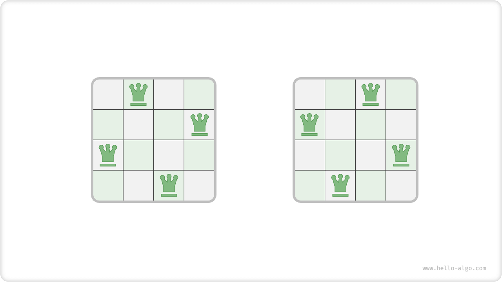
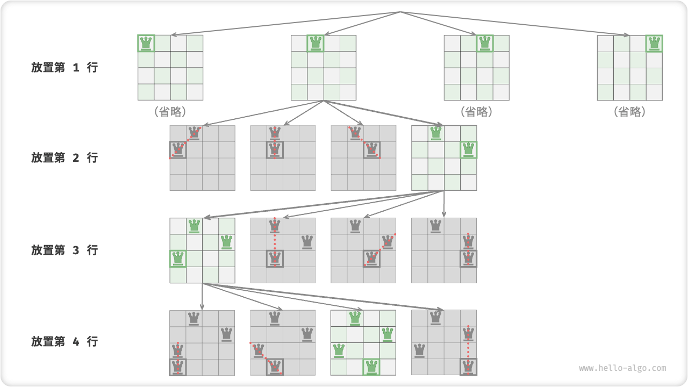
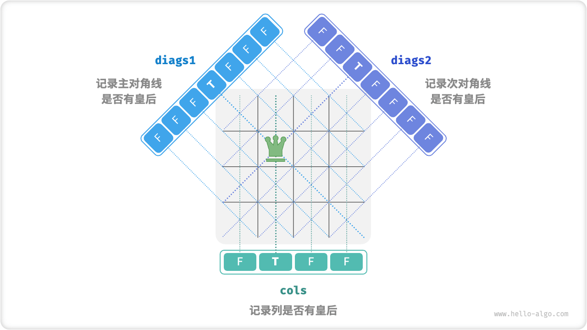

# N-Queens Problem

!!! question

    According to the rules of chess, a queen can attack a piece that is in the same row or column or diagonal as her. Given $n$ queens and a chessboard of size $n \times n$, find a placement scheme that makes it impossible for all queens to attack each other.

As shown in the figure below, a total of two solutions can be found when $n = 4$. From the backtracking algorithm's point of view, $n \times n$ size of the board has a total of $n^2$ squares, giving all the choices `choices` . During the process of placing queens one by one, the state of the board is constantly changing, and the board at each moment is the state `state` .



The figure below illustrates the three constraints of this problem:**Multiple queens cannot be in the same row, the same column, and the same diagonal**. It is worth noting that there are two types of diagonals: the primary diagonal `\` and the secondary diagonal `/`.


### A Line-By-Line Placement Strategy

The number of queens and the number of rows of the board are both $n$ , so it is easy to get a corollary:**Each row of the board is allowed and only one queen is allowed to be placed**.

That is, we can adopt a row-by-row placement strategy: starting from the first row, place a queen in each row until the end of the last row.

The figure below shows the row-by-row placement process for the $4$ Queens problem. Due to space constraints, the figure below expands only one of the search branches in the first row, and pruning all the solutions that do not satisfy the column constraints and the diagonal constraints.



Essentially, **the row-by-row placement strategy acts as pruning** which avoids all search branches with multiple queens on the same row.

### Columns With Diagonal Pruning

To satisfy the column constraints, we can utilize a boolean array `cols` of length $n$ to record whether each column has a queen or not. Before each placement decision, we prune the columns with existing queens by `cols` and dynamically update the state of `cols` in backtracking.

So how do we handle diagonal constraints? Let the row-column index of a certain lattice in the board be $(row, col)$ , and a certain main diagonal in the matrix be selected, we find that the row index minus the column index of all the lattices on that diagonal are equal, **i.e., $row - col$ is a constant value for all the lattices on the diagonal**.

That is, if two grids satisfy $row_1 - col_1 = row_2 - col_2$ , then they must be on the same main diagonal. Using this law, we can record whether there are queens on each main diagonal with the help of the array `diag1` shown in the figure below.

Similarly, **$row + col$ is constant for all grids on the subdiagonal**. We can similarly handle subdiagonal constraints with the help of the array `diag2`.



### Code Implementation

Note that the range of $row - col$ in $n$ dimensional square array is $[-n + 1, n - 1]$ and the range of $row + col$ is $[0, 2n - 2]$ , so the number of primary diagonals and secondary diagonals are both $2n - 1$ , i.e., the lengths of the arrays `diag1` and `diag2` are both $2n - 1$ .

```src
[file]{n_queens}-[class]{}-[func]{n_queens}
```

Placing $n$ times row by row and considering the column constraints, there are $n$, $n-1$, $\dots$, $2$, and $1$ choices from the first to the last row, respectively, **thus the time complexity is $O(n!)$** . In fact, pruning based on diagonal constraints can also drastically reduce the search space, and thus the search efficiency is often better than the above time complexity.

The array `state` uses $O(n^2)$ space, and the arrays `cols`, `diags1` and `diags2` all use $O(n)$ space. The maximum depth of recursion is $n$ and the $O(n)$ stack space is used. Therefore, **thespace complexity is $O(n^2)$** .
