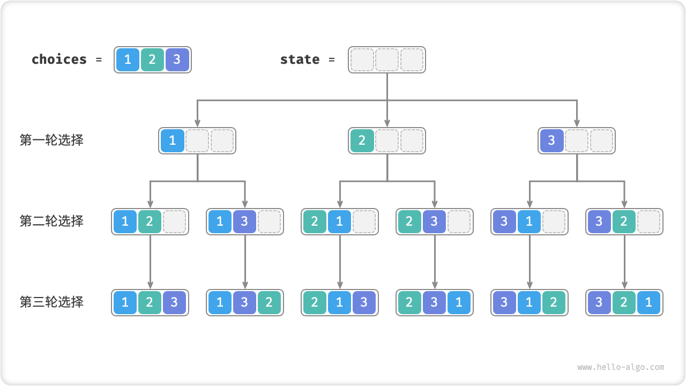
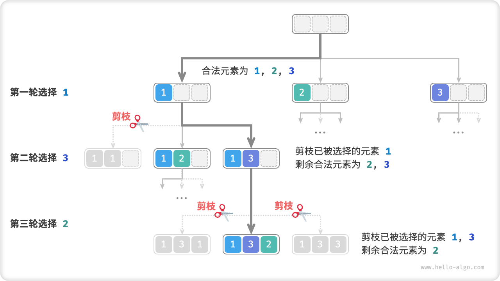
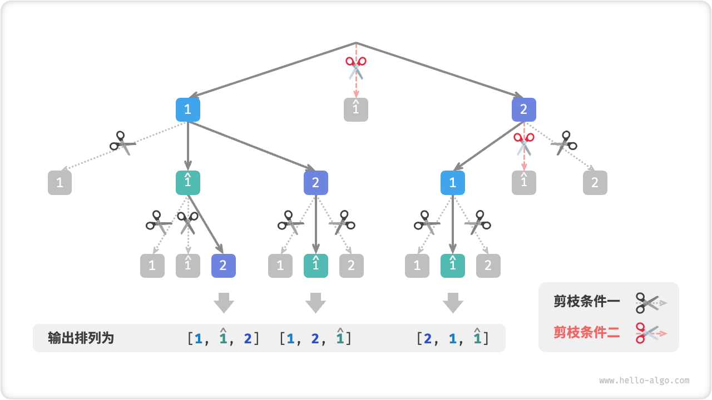

# Permutations Problem

The permutations problem is a typical application of the backtracking algorithm. It is defined as finding all possible permutations of the elements of a set (e.g., an array or a string) given that set.

The table below lists several example data, including the input array and all the corresponding alignments.

<p align="center"> Table <id> &nbsp; Full Arrangement Example </p>

| Input Array | All Arrangements                                                   |
| :---------- | :----------------------------------------------------------------- |
| $[1]$       | $[1]$                                                              |
| $[1, 2]$    | $[1, 2], [2, 1]$                                                   |
| $[1, 2, 3]$ | $[1, 2, 3], [1, 3, 2], [2, 1, 3], [2, 3, 1], [3, 1, 2], [3, 2, 1]$ |

## The Case Of Unequal Elements

!!! question

    Inputs an array of integers, the array contains no duplicate elements and returns all possible permutations.

From the backtracking algorithm point of view, **we can imagine the process of generating an arrangement as the result of a series of choices**. Suppose the input array is $[1, 2, 3]$ , and if we first select $1$, then $3$, and finally $2$ , we obtain the arrangement $[1, 3, 2]$ . Fallback means to undo a choice and continue to try other choices later.

From the point of view of the backtracking code, the candidate set `choices` is all the elements in the input array, and the state `state` is the elements that have been selected until now. Note that each element is only allowed to be selected once, **so all elements in `state` should be unique**.

As shown in the figure below, we can expand the search process into a recursion tree where each tree node represents the current state `state` . Starting from the root node, we reach the leaf nodes after three rounds of selection, and each leaf node corresponds to an arrangement.



### Repeat Selection Pruning

In order to realize that each element is selected only once, we consider introducing a Boolean array `selected` , where `selected[i]` indicates whether `choices[i]` has been selected or not, and implement the following pruning operation based on it.

- After making the selection `choice[i]`, we assign `selected[i]` to $\text{True}$ to represent that it has been selected.
- When traversing the choices list `choices`, skip all nodes that have already been selected, i.e. pruning.

As shown in the figure below, suppose we choose 1 in the first round, 3 in the second round, and 2 in the third round, then we need to cut off the branch of element 1 in the second round, and the branches of element 1 and element 3 in the third round.



Observing the figure above, we find that this pruning operation reduces the search space size from $O(n^n)$ to $O(n!)$ .

### Code Implementation

With the above information in mind, we can do the "fill-in-the-blanks" in the framework code. In order to reduce the number of lines of code, instead of implementing each function in the framework code separately, we will expand them in the `backtrack()` function.

```src
[file]{permutations_i}-[class]{}-[func]{permutations_i}
```

## Consider The Case Of Equal Elements

!!! question

    Input an array of integers, **The array may contain duplicate elements**. Return all non-duplicate permutations.

Suppose the input array is $[1, 1, 2]$ . In order to easily distinguish between the two repeated elements $1$ , we denote the second $1$ as $\hat{1}$ .

As shown in the figure below, half of the alignments generated by the above method are duplicates.


So how do you remove duplicate alignments? Most directly, consider de-duplicating the alignments directly with the help of a hash table. However, this is not elegant enough, **because the search branch that generates the duplicate alignments is unnecessary and should be recognized and pruned in advance**, which further improves the efficiency of the algorithm.

### Pruning Of Equivalent Elements

Observe the figure below, in the first round, choosing $1$ or choosing $\hat{1}$ is equivalent, and all alignments generated under these two choices are duplicates. Therefore $\hat{1}$ should be pruned.

Similarly, after selecting $2$ in the first round, $1$ and $\hat{1}$ in the second round of selection will also generate duplicate branches, so $\hat{1}$ in the second round should also be pruned.

Essentially, **our goal is to ensure that multiple equal elements are selected only once in a given round of selection**.


### Code Implementation

Building on the code from the previous question, we consider opening a hash table `duplicated` in each round of selection to keep track of the elements that have been tried in that round and pruning duplicates.

```src
[file]{permutations_ii}-[class]{}-[func]{permutations_ii}
```

Assuming that the elements are not the same as each other two by two, there are $n$ a total of $n!$ permutations (factorials) of the elements; when recording the result, a list of length $n$ needs to be copied, using $O(n)$ time. **Therefore the time complexity is $O(n!n)$** .

Maximum recursion depth is $n$, using $O(n)$ stack frame space. `selected` uses $O(n)$ space. There are at most $n$ `duplicated` at the same moment, using $O(n^2)$ space. **Therefore the space complexity is $O(n^2)$** .

### Two Pruning Comparisons

Note that although both `selected` and `duplicated` are used for pruning, they have different goals.

- **Repeated selection pruning**: there is only one `selected` for the entire search. It records which elements are contained in the current state, and serves to prevent any of the elements in `choices` from recurring in `state`.
- **Equal element pruning**: each round of selection (i.e., each call to the `backtrack` function) contains a `duplicated` . It records which elements have been selected in the current round of traversal (i.e., the `for` loop), and serves to ensure that equal elements are selected only once.

The figure below illustrates the range of validity of the two pruning conditions. Note that each node in the tree represents a choice, and the individual nodes on the path from the root node to the leaf nodes form an arrangement.


