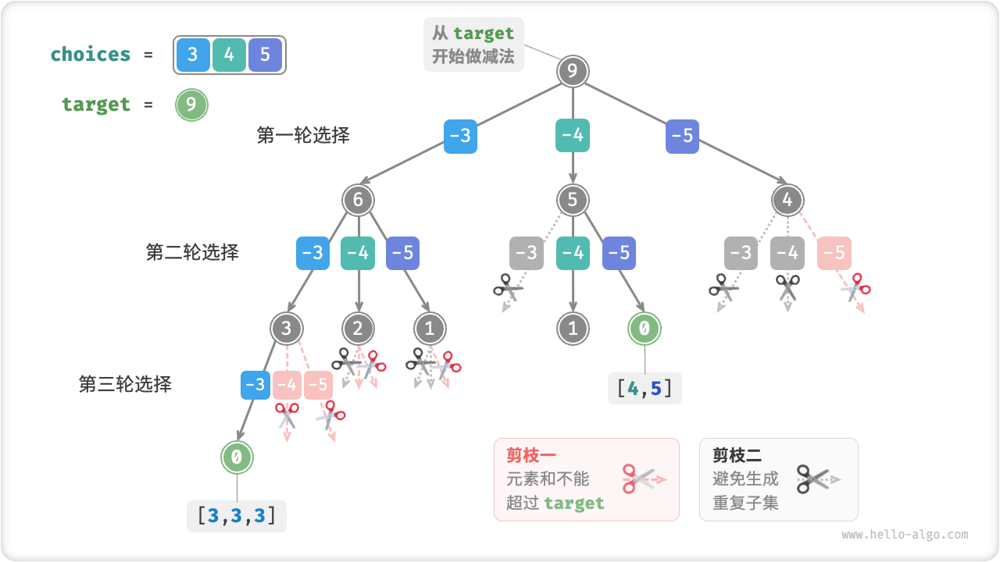
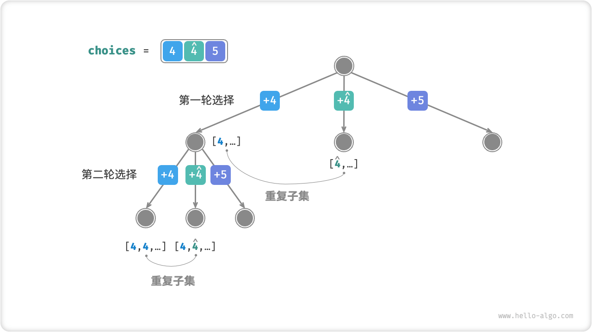
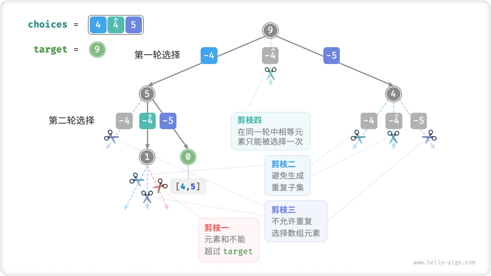

# Subset-Sum Problem

## The Case Of No Duplicate Elements

!!! question

    Given an array of positive integers `nums` and a target positive integer `target` , find all possible combinations such that the sum of the elements in the combination equals `target` . Given an array with no duplicate elements, each element can be selected more than once. Return these combinations as a list, which should not contain duplicate combinations.

For example, input the set $\{3, 4, 5\}$ and the target integer $9$ , the solution is $\{3, 3, 3\}, \{4, 5\}$ . The following two points need to be noted.

- Elements in the input set can be selected repeatedly an infinite number of times.
- A subset does not distinguish the order of elements, for example $\{4, 5\}$ and $\{5, 4\}$ are the same subset.

### Refer To The Full-Arrangement Solution

Similar to the permutations problem, we can imagine the subset-sum generation process as the result of a series of selections, and update the "element sum" in real time during the selection process, and record the subset to the result list when the element sum is equal to `target`.

And unlike the permutations problem, **the elements in the set of this problem can be selected an infinite number of times** so there is no need to resort to the `selected` Boolean list to keep track of whether an element has been selected or not. We can make minor modifications to the full permutation code to get the solution code initially.

```src
[file]{subset_sum_i_naive}-[class]{}-[func]{subset_sum_i_naive}
```

Input the array $[3, 4, 5]$ and the target element $9$ to the above code and the output is $[3, 3, 3], [4, 5], [5, 4]$ . **Although all the subsets with sum $9$ are successfully found, there are duplicate subsets $[4, 5]$ and $[5, 4]$** .

This is because the search process is selection order specific, however, subset is not selection order specific. As shown in the figure below, select $4$ before $5$ and select $5$ before $4$ are two different branches, but they correspond to the same subset.


To remove duplicate subsets, **a straightforward idea is to de-duplicate the result list**. However, this method is inefficient for two reasons.

- When the array has many elements, and especially when `target` is large, the search process produces a large number of duplicate subsets.
- Comparing similarities and differences in subsets (arrays) is very time consuming and requires sorting the array and then comparing the similarities and differences of each element in the array.

### Duplicate Subset Pruning

**We consider de-duplication by pruning during the search process**. Observe the figure below, the duplicate subset is created when the elements of the array are selected in a different order, as in the following case.

1. When $3$ and $4$ are selected in the first and second rounds, respectively, all subsets containing these two elements are generated, denoted as $[3, 4, \dots]$ .
2. After that, when $4$ is chosen in the first round, **then $3$** should be skipped in the second round because the subset generated by that choice $[4, 3, \dots]$ is an exact duplicate of the subset generated in `1.`.

In the search, each level of selection is attempted one by one from left to right, so the further to the right the more branches are clipped.

1. The first two rounds select $3$ and $5$ , generating the subset $[3, 5, \dots]$ .
2. The first two rounds select $4$ and $5$ , generating the subset $[4, 5, \dots]$ .
3. If $5$ is chosen in the first round, **then $3$ and $4$** should be skipped in the second round because the subsets $[5, 3, \dots]$ and $[5, 4, \dots]$ are exact duplicates of the subsets described in steps `1.` and `2.`.


To summarize, given an input array $[x_1, x_2, \dots, x_n]$ , let the sequence of choices during the search be $[x_{i_1}, x_{i_2}, \dots, x_{i_m}]$ , then this sequence of choices needs to satisfy $i_1 \leq i_2 \leq \dots \leq i_m$ . **Any selection sequence that does not satisfy this condition results in duplicates and should be pruned**.

### Code Implementation

To implement this pruning, we initialize the variable `start` , which is used to indicate the traversal starting point. **When a selection $x_{i}$ is made, set the next round of traversal to start at index $i$**. Doing so allows the selection sequence to satisfy $i_1 \leq i_2 \leq \dots \leq i_m$ , which guarantees a unique subset.

In addition to this, we have made the following two optimizations to the code.

- Sort the array `nums` before turning on the search. When iterating through all the choices, **simply end the loop when the subset sum exceeds `target`**because the elements that come after it are larger, and all of their subset sums are bound to exceed `target` .
- Omitting the elements and the variable `total` , **counts the elements and by performing a subtraction on `target`** , and records the solution when `target` equals $0$.

```src
[file]{subset_sum_i}-[class]{}-[func]{subset_sum_i}
```

The figure below shows the overall backtracking process after inputting the array $[3, 4, 5]$ and the target element $9$ into the above code.



## Consider The Case Of Duplicate Elements

!!! question

    Given an array of positive integers `nums` and a target positive integer `target` , find all possible combinations such that the sum of the elements in the combination equals `target` . **The given array may contain duplicate elements, each of which can be selected only once**. Please return these combinations as a list; the list should not contain duplicate combinations.

Compared to the previous question, **the input array of this question may contain duplicate elements**, which introduces a new problem. For example, given the array $[4, \hat{4}, 5]$ and the target element $9$ , the output of the existing code is $[4, 5], [\hat{4}, 5]$ , with a duplicate subset.

**The reason for this duplication is that equal elements are selected multiple times in a given round**. In the figure below, there are three choices in the first round, two of which are both $4$ , which produces two duplicate search branches and thus outputs a duplicate subset; similarly, the two $4$ in the second round also produce a duplicate subset.



### Pruning Of Equivalent Elements

To solve this problem, **we need to restrict equal elements to be selected only once in each round**. The implementation is rather clever: since the array is sorted, the equal elements are all adjacent. This means that in a given round of selection, if the current element is equal to the element to its left, it has already been selected, so the current element is simply skipped.

At the same time, **this question specifies that each element in the array can only be selected once**. Fortunately, we can also utilize the variable `start` to satisfy this constraint: after a selection $x_{i}$ is made, set the next round to traverse backwards from index $i + 1$. This removes duplicate subsets and avoids duplicate selection of elements.

### Code Implementation

```src
[file]{subset_sum_ii}-[class]{}-[func]{subset_sum_ii}
```

The figure below illustrates the backtracking process for the array $[4, 4, 5]$ and the target element $9$ with four pruning operations. Please combine the figure with the code comments to understand the whole search process and how each pruning operation works.


