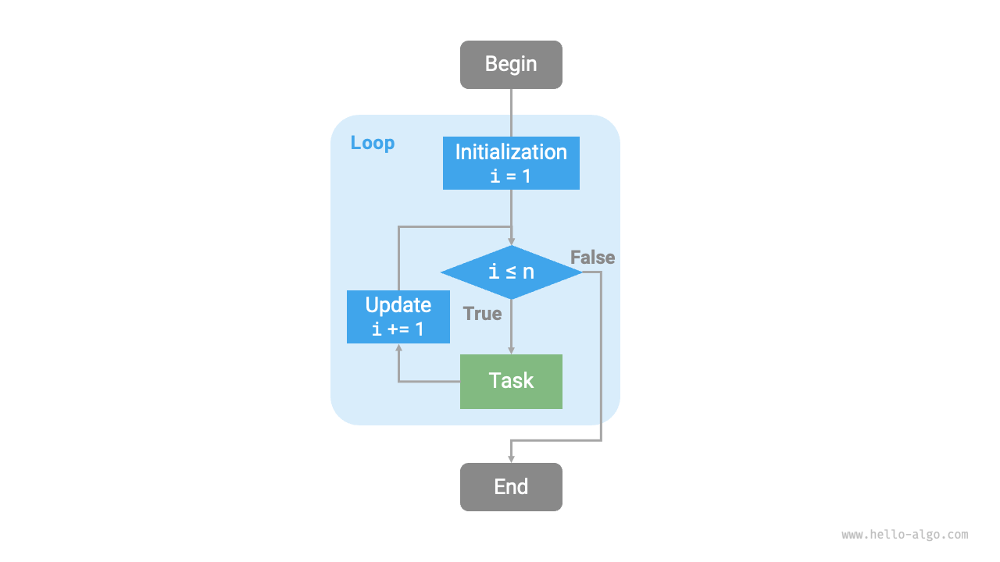
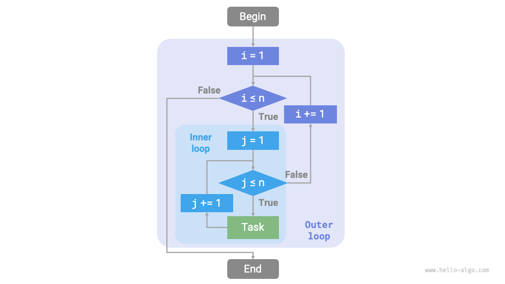
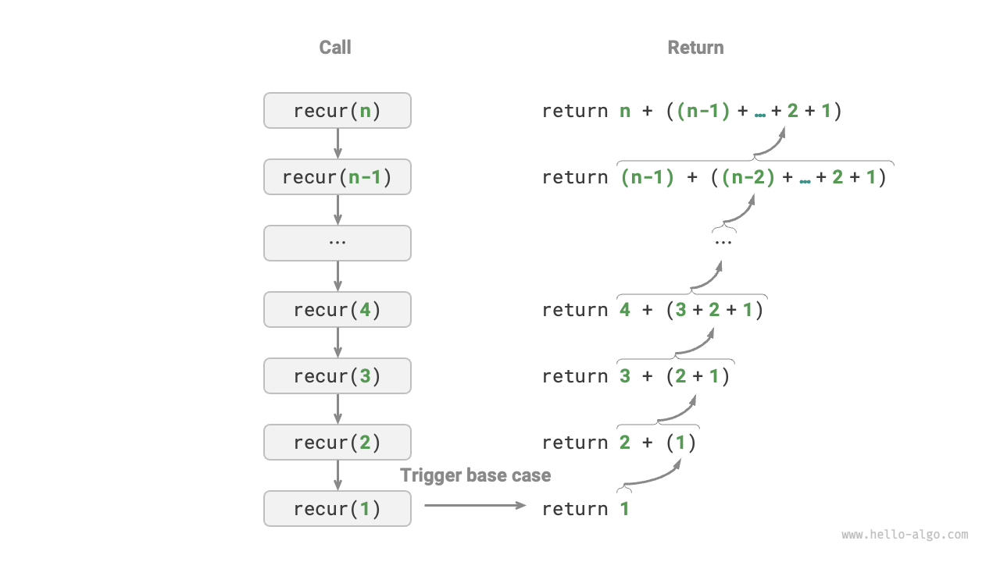
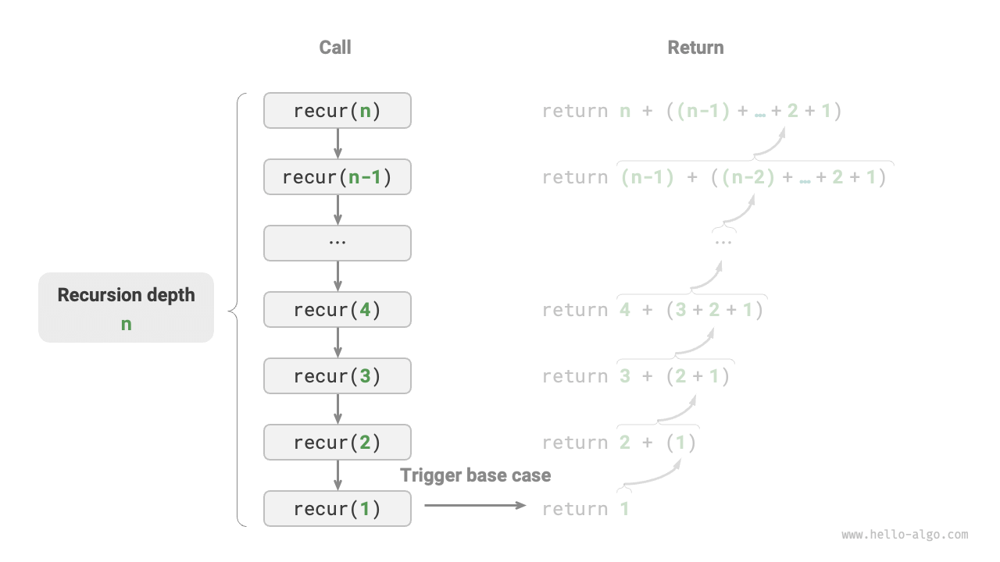
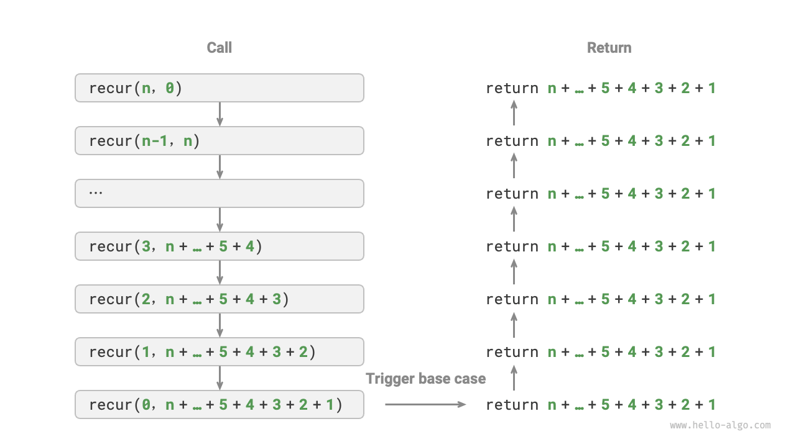
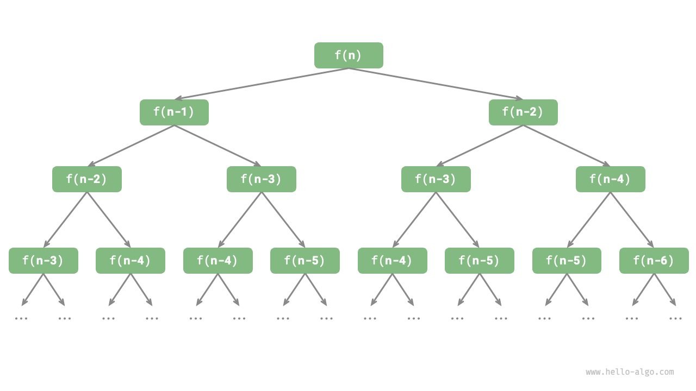

# Iteration and Recursion

In algorithms, repeatedly performing a task is quite common and closely linked to complexity analysis. Therefore, before diving into the details of time complexity and space complexity, let's first understand how to implement repetitive task execution in programming, focusing on two fundamental control structures: iteration and recursion.

## Iteration

"Iteration" is a control structure used to repeatedly execute a task. In an iterative process, a program repeatedly executes a block of code as long as a certain condition is met, ceasing once this condition is no longer satisfied.

### For Loops

The `for` loop is one of the most common forms of iteration, and **it's particularly suitable when the number of iterations is known in advance**.

The following function implements summation $1 + 2 + \dots + n$ using a `for` loop, with the sum being recorded in the variable `res`. Note that in Python, `range(a, b)` corresponds to a "left-closed, right-open" interval, meaning it includes numbers in the sequence from $a, a + 1, \dots$, up to $b-1$, but not $b$ itself.

```src
[file]{iteration}-[class]{}-[func]{for_loop}
```

Figure 2-1 shows the flowchart for this summation function.


<div align="center">Figure 2-1: Flowchart of the Summation Function</div>

The number of operations in this summation function is proportional to the size of the input data $n$, or in other words, it has a "linear relationship." In fact, this "linear relationship" is what time complexity describes. This topic will be discussed in more detail in the next section.

### While Loops

Similar to `for` loops, `while` loops are another approach for implementing iteration. In a `while` loop, the program checks a condition at the beginning of each iteration; if the condition is true, the execution continues, otherwise, the loop ends.

Next, let's use a `while` loop to implement the summation of $1 + 2 + \dots + n$.

```src
[file]{iteration}-[class]{}-[func]{while_loop}
```

**`While` loops provide more flexibility than `for` loops**, especially since they allow for custom initialization and modification of the condition variable at each step.

For example, in the following code, the condition variable $i$ is updated twice in each iteration, a scenario that would be less convenient to implement with a `for` loop

```src
[file]{iteration}-[class]{}-[func]{while_loop_ii}
```

Overall, **`for` loops tend to be more concise, while `while` loops offer more flexibility**. Both can be used to implement iterative structures, and the choice between them should be based on the specific requirements of the problem at hand.

### Nested Loops

Nested loops involve placing one loop structure within another. Taking `for` loops as an example:

```src
[file]{iteration}-[class]{}-[func]{nested_for_loop}
```

Figure 2-2 provides the flowchart for such a nested loop structure.


<div align="center">Figure 2-2: Flowchart of the Nested Loop</div>

In such cases, the number of operations of the function is proportional to $n^2$, meaning the algorithm's runtime and the size of the input data $n$ have a 'quadratic relationship.'

We can further increase the complexity by adding more nested loops, each level of nesting effectively "increasing the dimension," which raises the time complexity to "cubic," "quartic," and so on.

## Recursion

Recursion is an algorithmic strategy where a function solves a problem by calling itself. It primarily involves two phases:

1. **Recursive Descent**: This is where the program repeatedly calls itself, often with progressively smaller or simpler arguments, moving towards the "base case" or "termination point." This phase is characterized by the function venturing deeper into successive levels of recursion.
2. **Backtracking** or **Recursive Ascent**: After reaching the "base case," the function begins its ascent, retracing its steps back from the deepest level of recursion. During this phase, it consolidates or processes the results from each recursive call as it returns to the initial call.

From an implementation standpoint, recursive code typically includes three main elements:

1. **Base Case** or **Termination Condition**: This serves as the stopping criterion for the recursion, indicating when the function should cease deeper recursive calls and begin its ascent or backtracking.
2. **Recursive Invocation**: This aligns with the "Recursive Descent" phase, where the function continues to call itself, typically with altered parameters, delving deeper into the recursion.
3. **Result Propagation**: This is associated with the 'Backtracking' or 'Recursive Ascent' phase, where the outcome from each recursive depth is passed back up to the preceding level, ultimately culminating at the initial call.

Consider the following code, where simply calling the function `recur(n)` can compute the sum of $1 + 2 + \dots + n$:

```src
[file]{recursion}-[class]{}-[func]{recur}
```

Figure 2-3 illustrates the recursive process of this function.


<div align="center">Figure 2-3: The Recursive Process of the Summation Function</div>

While iteration and recursion can yield the same results from a computational standpoint, **they represent two distinct paradigms of thinking and problem-solving.**

- **Iteration**: This approach is "bottom-up." It starts with the most fundamental steps and then repeatedly applies or accumulates these steps until the task is complete. 
- **Recursion**: sThis method is "top-down." It breaks the original problem down into smaller subproblems, each resembling the original problem in form. These subproblems are further decomposed into even smaller parts, continuing until reaching the base case (whose solution is known).

Let's take the earlier example of the summation function, defined as $f(n) = 1 + 2 + \dots + n$.

- **Iteration**: In this approach, we simulate the summation process within a loop. Starting from $1$ and traversing to $n$, we perform the summation operation in each iteration to eventually compute $f(n)$.
- **Recursion**: Here, the problem is broken down into a subproblem: $f(n) = n + f(n-1)$. This decomposition continues recursively until reaching the base case, $f(1) = 1$, at which point the recursion terminates.

### Call Stack

Every time a recursive function calls itself, the system allocates memory for the newly initiated function to store local variables, the return address, and other relevant information. This leads to two primary outcomes:

- **Memory Allocation for Context Data**: The context data for each function is stored in a memory area known as the 'stack frame.' This memory is not freed until the function returns. As a result, recursion generally consumes more memory space than iteration.
- **Overhead of Recursive Calls**: Each recursive function call incurs additional overhead. Therefore, in terms of time efficiency, recursion is usually less efficient than loops.

As illustrated in Figure 2-4, before the termination condition is triggered, there are $n$ recursive functions pending return, **resulting in a recursion depth of $n$**.


<div align="center">Figure 2-4: Recursive Call Depth</div>

In practice, the depth of recursion allowed in programming languages is usually limited. Excessively deep recursion can lead to a stack overflow error.

### Tail Recursion

Interestingly, **if a function performs its recursive call as the very last step before returning**, it can be optimized by the compiler or interpreter to be as space-efficient as iteration. This scenario is known as "tail recursion."

- **Ordinary Recursion**: In standard recursion, when the function returns to the previous level, it continues to execute more code, requiring the system to save the context of the previous call.
- **Tail Recursion**: Here, the recursive call is the final operation before the function returns. This means that upon returning to the previous level, no further actions are needed, so the system doesn't need to save the context of the previous level.

Taking the summation of $1 + 2 + \dots + n$ as an example, we can implement tail recursion by making the result variable `res` a parameter of the function.

```src
[file]{recursion}-[class]{}-[func]{tail_recur}
```

The execution process of tail recursion, as shown in Figure 2-5, differs significantly from that of ordinary recursion in terms of when the summation operation is performed:

- **Ordinary Recursion**: The summation occurs during the "Backtracking" or "Recursive Ascent" phase, with the summing operation being executed each time the function returns from a deeper recursive level.
- **Tail Recursion**: The summation happens during the "Recursive Descent," and the "Backtracking" or "Recursive Ascent" phase simply involves returning through the levels without additional operations.


<div align="center">Figure 2-5: Tail Recursion Process</div>

!!! tip

    Please note that many compilers or interpreters do not support tail recursion optimization. For instance, Python does not support tail recursion optimization by default. Therefore, even if a function is in the form of tail recursion, it may still encounter stack overflow issues.

### Recursion Tree

When dealing with algorithms related to "divide and conquer," recursion often offers a more intuitive approach and produces more readable code than iteration. Take the "Fibonacci sequence" as an example.

!!! question

    Given a Fibonacci sequence $0, 1, 1, 2, 3, 5, 8, 13, \dots$, we want to find the $n$th number in the series.

Let's denote the $n$th number of the Fibonacci sequence as $f(n)$, It follows two simple rules:

- The first two numbers of the sequence are $f(1) = 0$ and $f(2) = 1$.
- Each number in the series is the sum of the two preceding ones, i.e., $f(n) = f(n - 1) + f(n - 2)$.

By following this recursive relationship and using the first two numbers as the base case, we can write recursive code. Calling `fib(n)` retrieves the $n$th number in the Fibonacci sequence.

```src
[file]{recursion}-[class]{}-[func]{fib}
```
Upon examining this code, we notice that **each function call recursively triggers two more calls, creating two branches from a single call**. As illustrated in Figure 2-6, this process of recursive calling eventually forms a "recursion tree" with $n$ levels.


<div align="center">Figure 2-6: Fibonacci Sequence Recursion Tree</div>

At its core, recursion embodies the paradigm of "breaking down a problem into smaller subproblems." This divide and conquer strategy is crucial.

- From an algorithmic perspective, many essential strategies like searching, sorting, backtracking, divide and conquer, and dynamic programming either directly or indirectly utilize this approach. 
- From a data structure standpoint, recursion is inherently suitable for dealing with linked lists, trees, and graphs, as these structures lend themselves well to analysis through divide and conquer strategy.

## Comparison of Iteration and Recursion

Summarizing the content above, as shown in Table 2-1, iteration and recursion differ in their implementation, performance, and applicability.

<p align="center"> Table 2-1<id> &nbsp; Comparison of Characteristics Between Iteration and Recursion </p>

| Aspect              | Iteration                                               | Recursion                                                                                                                             |
| ------------------- | ------------------------------------------------------- | ------------------------------------------------------------------------------------------------------------------------------------- |
| Implementation      | Loop structures	                                        | Function calling itself                                                                                                               |
| Time Efficiency     | Generally higher efficiency, no overhead from function calls | Overhead incurred with each function call                                                                                                     |
| Memory Usage        | Usually utilizes fixed-size memory space              | Accumulative function calls can consume substantial stack frame space                                                                          |
| Applicable Problems | Suitable for straightforward looping tasks, offers intuitive and readable code | Best for decomposing into subproblems, like in trees, graphs, divide and conquer, backtracking, etc., resulting in simple and clear code structure |

!!! tip

    If you find the content below challenging, consider revisiting it after reading the chapter on "Stacks."

So, what intrinsic connection exists between iteration and recursion? Taking the aforementioned recursive function as an example, the summation operation occurs during the "Recursive Ascent" phase. This means that the initially called function is actually the last to complete its summing operation, **a mechanism that mirrors the "Last In, First Out" (LIFO) principle of stacks, showcasing a parallel in their workings.**

In fact, recursion-related terms like "call stack" and "stack frame space" already hint at the close relationship between recursion and stacks.

1. **Descending (Recursive Call)**: When a function is called, the system allocates a new stack frame on the "call stack" for that function. This frame is used to store the function’s local variables, parameters, and return address.
2. **Ascending (Returning from Call)**: When a function completes execution and returns, its corresponding stack frame is removed from the "call stack," restoring the execution environment of the previous function.

Therefore, **we can use an explicit stack to simulate the behavior of the call stack**, thereby transforming recursion into an iterative form.

```src
[file]{recursion}-[class]{}-[func]{for_loop_recur}
```

Upon examining the code, we see that once recursion is converted to iteration, the code becomes more complex. Although iteration and recursion are often interchangeable, the conversion isn't always advisable for a couple of reasons:

- The transformed code may become harder to understand and less readable.
- For certain complex problems, simulating the behavior of the system call stack can be quite challenging.

In conclusion, **whether to choose iteration or recursion depends on the specific nature of the problem**. In programming practice, it's crucial to weigh the pros and cons of both and choose the most suitable approach for the situation at hand.
