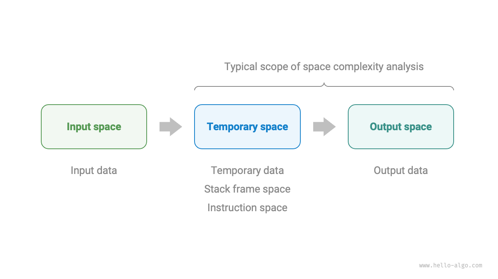
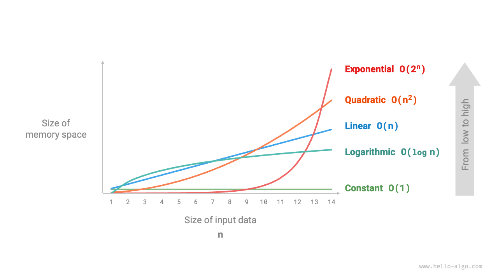
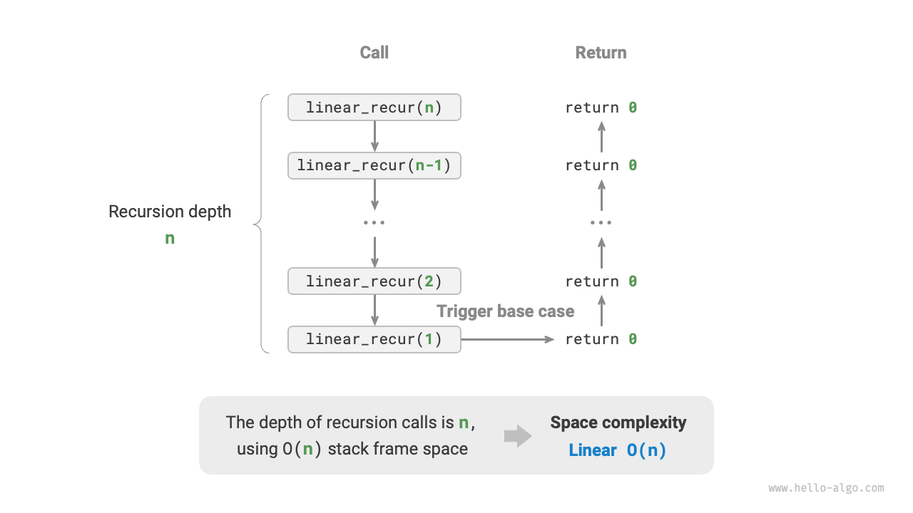
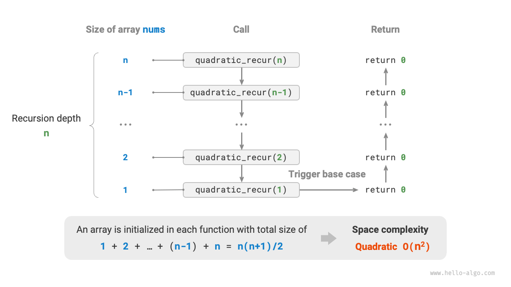
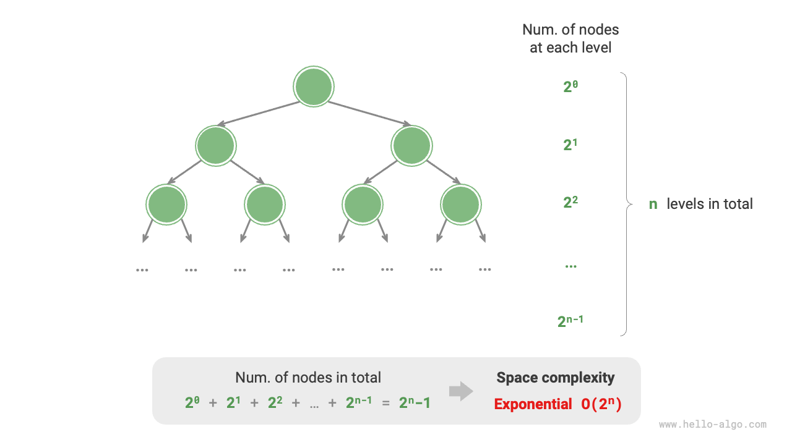

# 2.4 &nbsp; Space Complexity

"Space complexity" is used to measure the growth trend of the memory space occupied by an algorithm as the amount of data increases. This concept is very similar to time complexity, except that "running time" is replaced with "occupied memory space".

## 2.4.1 &nbsp; Space Related to Algorithms

The memory space used by an algorithm during its execution mainly includes the following types.

- **Input Space**: Used to store the input data of the algorithm.
- **Temporary Space**: Used to store variables, objects, function contexts, and other data during the algorithm's execution.
- **Output Space**: Used to store the output data of the algorithm.

Generally, the scope of space complexity statistics includes both "Temporary Space" and "Output Space".

Temporary space can be further divided into three parts.

- **Temporary Data**: Used to save various constants, variables, objects, etc., during the algorithm's execution.
- **Stack Frame Space**: Used to save the context data of the called function. The system creates a stack frame at the top of the stack each time a function is called, and the stack frame space is released after the function returns.
- **Instruction Space**: Used to store compiled program instructions, which are usually negligible in actual statistics.

When analyzing the space complexity of a program, **we typically count the Temporary Data, Stack Frame Space, and Output Data**, as shown in the Figure 2-15 .

{ class="animation-figure" }

<p align="center"> Figure 2-15 &nbsp; Space Types Used in Algorithms </p>

The relevant code is as follows:

=== "Python"

    ```python title=""
    class Node:
        """Classes""""
        def __init__(self, x: int):
            self.val: int = x               # node value
            self.next: Node | None = None   # reference to the next node

    def function() -> int:
        """"Functions"""""
        # Perform certain operations...
        return 0

    def algorithm(n) -> int:    # input data
        A = 0                   # temporary data (constant, usually in uppercase)
        b = 0                   # temporary data (variable)
        node = Node(0)          # temporary data (object)
        c = function()          # Stack frame space (call function)
        return A + b + c        # output data
    ```

=== "C++"

    ```cpp title=""
    /* Structures */
    struct Node {
        int val;
        Node *next;
        Node(int x) : val(x), next(nullptr) {}
    };

    /* Functions */
    int func() {
        // Perform certain operations...
        return 0;
    }

    int algorithm(int n) {          // input data
        const int a = 0;            // temporary data (constant)
        int b = 0;                  // temporary data (variable)
        Node* node = new Node(0);   // temporary data (object)
        int c = func();             // stack frame space (call function)
        return a + b + c;           // output data
    }
    ```

=== "Java"

    ```java title=""
    /* Classes */
    class Node {
        int val;
        Node next;
        Node(int x) { val = x; }
    }
   
    /* Functions */
    int function() {
        // Perform certain operations...
        return 0;
    }
   
    int algorithm(int n) {          // input data
        final int a = 0;            // temporary data (constant)
        int b = 0;                  // temporary data (variable)
        Node node = new Node(0);    // temporary data (object)
        int c = function();         // stack frame space (call function)
        return a + b + c;           // output data
    }
    ```

=== "C#"

    ```csharp title=""
    /* Classes */
    class Node {
        int val;
        Node next;
        Node(int x) { val = x; }
    }

    /* Functions */
    int Function() {
        // Perform certain operations...
        return 0;
    }

    int Algorithm(int n) {  // input data
        const int a = 0;    // temporary data (constant)
        int b = 0;          // temporary data (variable)
        Node node = new(0); // temporary data (object)
        int c = Function(); // stack frame space (call function)
        return a + b + c;   // output data
    }
    ```

=== "Go"

    ```go title=""
    /* Structures */
    type node struct {
        val  int
        next *node
    }

    /* Create node structure */
    func newNode(val int) *node {
        return &node{val: val}
    }
   
    /* Functions */
    func function() int {
        // Perform certain operations...
        return 0
    }

    func algorithm(n int) int { // input data
        const a = 0             // temporary data (constant)
        b := 0                  // temporary storage of data (variable)
        newNode(0)              // temporary data (object)
        c := function()         // stack frame space (call function)
        return a + b + c        // output data
    }
    ```

=== "Swift"

    ```swift title=""
    /* Classes */
    class Node {
        var val: Int
        var next: Node?

        init(x: Int) {
            val = x
        }
    }

    /* Functions */
    func function() -> Int {
        // Perform certain operations...
        return 0
    }

    func algorithm(n: Int) -> Int { // input data
        let a = 0                   // temporary data (constant)
        var b = 0                   // temporary data (variable)
        let node = Node(x: 0)       // temporary data (object)
        let c = function()          // stack frame space (call function)
        return a + b + c            // output data
    }
    ```

=== "JS"

    ```javascript title=""
    /* Classes */
    class Node {
        val;
        next;
        constructor(val) {
            this.val = val === undefined ? 0 : val; // node value
            this.next = null;                       // reference to the next node
        }
    }

    /* Functions */
    function constFunc() {
        // Perform certain operations
        return 0;
    }

    function algorithm(n) {         // input data
        const a = 0;                // temporary data (constant)
        let b = 0;                  // temporary data (variable)
        const node = new Node(0);   // temporary data (object)
        const c = constFunc();      // Stack frame space (calling function)
        return a + b + c;           // output data
    }
    ```

=== "TS"

    ```typescript title=""
    /* Classes */
    class Node {
        val: number;
        next: Node | null;
        constructor(val?: number) {
            this.val = val === undefined ? 0 : val; // node value
            this.next = null;                       // reference to the next node
        }
    }

    /* Functions */
    function constFunc(): number {
        // Perform certain operations
        return 0;
    }

    function algorithm(n: number): number { // input data
        const a = 0;                        // temporary data (constant)
        let b = 0;                          // temporary data (variable)
        const node = new Node(0);           // temporary data (object)
        const c = constFunc();              // Stack frame space (calling function)
        return a + b + c;                   // output data
    }
    ```

=== "Dart"

    ```dart title=""
    /* Classes */
    class Node {
      int val;
      Node next;
      Node(this.val, [this.next]);
    }

    /* Functions */
    int function() {
      // Perform certain operations...
      return 0;
    }

    int algorithm(int n) {  // input data
      const int a = 0;      // temporary data (constant)
      int b = 0;            // temporary data (variable)
      Node node = Node(0);  // temporary data (object)
      int c = function();   // stack frame space (call function)
      return a + b + c;     // output data
    }
    ```

=== "Rust"

    ```rust title=""
    use std::rc::Rc;
    use std::cell::RefCell;
   
    /* Structures */
    struct Node {
        val: i32,
        next: Option<Rc<RefCell<Node>>>,
    }

    /* Creating a Node structure */
    impl Node {
        fn new(val: i32) -> Self {
            Self { val: val, next: None }
        }
    }

    /* Functions */
    fn function() -> i32 {     
        // Perform certain operations...
        return 0;
    }

    fn algorithm(n: i32) -> i32 {   // input data
        const a: i32 = 0;           // temporary data (constant)
        let mut b = 0;              // temporary data (variable)
        let node = Node::new(0);    // temporary data (object)
        let c = function();         // stack frame space (call function)
        return a + b + c;           // output data
    }
    ```

=== "C"

    ```c title=""
    /* Functions */
    int func() {
        // Perform certain operations...
        return 0;
    }

    int algorithm(int n) {  // input data
        const int a = 0;    // temporary data (constant)
        int b = 0;          // temporary data (variable)
        int c = func();     // stack frame space (call function)
        return a + b + c;   // output data
    }
    ```

=== "Zig"

    ```zig title=""

    ```

## 2.4.2 &nbsp; Calculation Method

The method for calculating space complexity is roughly similar to that of time complexity, with the only change being the shift of the statistical object from "number of operations" to "size of used space".

However, unlike time complexity, **we usually only focus on the worst-case space complexity**. This is because memory space is a hard requirement, and we must ensure that there is enough memory space reserved under all input data.

Consider the following code, the term "worst-case" in worst-case space complexity has two meanings.

1. **Based on the worst input data**: When $n < 10$, the space complexity is $O(1)$; but when $n > 10$, the initialized array `nums` occupies $O(n)$ space, thus the worst-case space complexity is $O(n)$.
2. **Based on the peak memory used during the algorithm's execution**: For example, before executing the last line, the program occupies $O(1)$ space; when initializing the array `nums`, the program occupies $O(n)$ space, hence the worst-case space complexity is $O(n)$.

=== "Python"

    ```python title=""
    def algorithm(n: int):
        a = 0               # O(1)
        b = [0] * 10000     # O(1)
        if n > 10:
            nums = [0] * n  # O(n)
    ```

=== "C++"

    ```cpp title=""
    void algorithm(int n) {
        int a = 0;               // O(1)
        vector<int> b(10000);    // O(1)
        if (n > 10)
            vector<int> nums(n); // O(n)
    }
    ```

=== "Java"

    ```java title=""
    void algorithm(int n) {
        int a = 0;                   // O(1)
        int[] b = new int[10000];    // O(1)
        if (n > 10)
            int[] nums = new int[n]; // O(n)
    }
    ```

=== "C#"

    ```csharp title=""
    void Algorithm(int n) {
        int a = 0;                   // O(1)
        int[] b = new int[10000];    // O(1)
        if (n > 10) {
            int[] nums = new int[n]; // O(n)
        }
    }
    ```

=== "Go"

    ```go title=""
    func algorithm(n int) {
        a := 0                      // O(1)
        b := make([]int, 10000)     // O(1)
        var nums []int
        if n > 10 {
            nums := make([]int, n)  // O(n)
        }
        fmt.Println(a, b, nums)
    }
    ```

=== "Swift"

    ```swift title=""
    func algorithm(n: Int) {
        let a = 0 // O(1)
        let b = Array(repeating: 0, count: 10000) // O(1)
        if n > 10 {
            let nums = Array(repeating: 0, count: n) // O(n)
        }
    }
    ```

=== "JS"

    ```javascript title=""
    function algorithm(n) {
        const a = 0;                   // O(1)
        const b = new Array(10000);    // O(1)
        if (n > 10) {
            const nums = new Array(n); // O(n)
        }
    }
    ```

=== "TS"

    ```typescript title=""
    function algorithm(n: number): void {
        const a = 0;                   // O(1)
        const b = new Array(10000);    // O(1)
        if (n > 10) {
            const nums = new Array(n); // O(n)
        }
    }
    ```

=== "Dart"

    ```dart title=""
    void algorithm(int n) {
      int a = 0;                            // O(1)
      List<int> b = List.filled(10000, 0);  // O(1)
      if (n > 10) {
        List<int> nums = List.filled(n, 0); // O(n)
      }
    }
    ```

=== "Rust"

    ```rust title=""
    fn algorithm(n: i32) {
        let a = 0;                              // O(1)
        let b = [0; 10000];                     // O(1)
        if n > 10 {
            let nums = vec![0; n as usize];     // O(n)
        }
    }
    ```

=== "C"

    ```c title=""
    void algorithm(int n) {
        int a = 0;               // O(1)
        int b[10000];            // O(1)
        if (n > 10)
            int nums[n] = {0};   // O(n)
    }
    ```

=== "Zig"

    ```zig title=""

    ```

**In recursive functions, stack frame space must be taken into count**. Consider the following code:

=== "Python"

    ```python title=""
    def function() -> int:
        # Perform certain operations
        return 0

    def loop(n: int):
        """Loop O(1)"""""
        for _ in range(n):
            function()

    def recur(n: int) -> int:
        """Recursion O(n)"""""
        if n == 1: return
        return recur(n - 1)
    ```

=== "C++"

    ```cpp title=""
    int func() {
        // Perform certain operations
        return 0;
    }
    /* Cycle O(1) */
    void loop(int n) {
        for (int i = 0; i < n; i++) {
            func();
        }
    }
    /* Recursion O(n) */
    void recur(int n) {
        if (n == 1) return;
        return recur(n - 1);
    }
    ```

=== "Java"

    ```java title=""
    int function() {
        // Perform certain operations
        return 0;
    }
    /* Cycle O(1) */
    void loop(int n) {
        for (int i = 0; i < n; i++) {
            function();
        }
    }
    /* Recursion O(n) */
    void recur(int n) {
        if (n == 1) return;
        return recur(n - 1);
    }
    ```

=== "C#"

    ```csharp title=""
    int Function() {
        // Perform certain operations
        return 0;
    }
    /* Cycle O(1) */
    void Loop(int n) {
        for (int i = 0; i < n; i++) {
            Function();
        }
    }
    /* Recursion O(n) */
    int Recur(int n) {
        if (n == 1) return 1;
        return Recur(n - 1);
    }
    ```

=== "Go"

    ```go title=""
    func function() int {
        // Perform certain operations
        return 0
    }
   
    /* Cycle O(1) */
    func loop(n int) {
        for i := 0; i < n; i++ {
            function()
        }
    }
   
    /* Recursion O(n) */
    func recur(n int) {
        if n == 1 {
            return
        }
        recur(n - 1)
    }
    ```

=== "Swift"

    ```swift title=""
    @discardableResult
    func function() -> Int {
        // Perform certain operations
        return 0
    }

    /* Cycle O(1) */
    func loop(n: Int) {
        for _ in 0 ..< n {
            function()
        }
    }

    /* Recursion O(n) */
    func recur(n: Int) {
        if n == 1 {
            return
        }
        recur(n: n - 1)
    }
    ```

=== "JS"

    ```javascript title=""
    function constFunc() {
        // Perform certain operations
        return 0;
    }
    /* Cycle O(1) */
    function loop(n) {
        for (let i = 0; i < n; i++) {
            constFunc();
        }
    }
    /* Recursion O(n) */
    function recur(n) {
        if (n === 1) return;
        return recur(n - 1);
    }
    ```

=== "TS"

    ```typescript title=""
    function constFunc(): number {
        // Perform certain operations
        return 0;
    }
    /* Cycle O(1) */
    function loop(n: number): void {
        for (let i = 0; i < n; i++) {
            constFunc();
        }
    }
    /* Recursion O(n) */
    function recur(n: number): void {
        if (n === 1) return;
        return recur(n - 1);
    }
    ```

=== "Dart"

    ```dart title=""
    int function() {
      // Perform certain operations
      return 0;
    }
    /* Cycle O(1) */
    void loop(int n) {
      for (int i = 0; i < n; i++) {
        function();
      }
    }
    /* Recursion O(n) */
    void recur(int n) {
      if (n == 1) return;
      return recur(n - 1);
    }
    ```

=== "Rust"

    ```rust title=""
    fn function() -> i32 {
        // Perform certain operations
        return 0;
    }
    /* Cycle O(1) */
    fn loop(n: i32) {
        for i in 0..n {
            function();
        }
    }
    /* Recursion O(n) */
    void recur(n: i32) {
        if n == 1 {
            return;
        }
        recur(n - 1);
    }
    ```

=== "C"

    ```c title=""
    int func() {
        // Perform certain operations
        return 0;
    }
    /* Cycle O(1) */
    void loop(int n) {
        for (int i = 0; i < n; i++) {
            func();
        }
    }
    /* Recursion O(n) */
    void recur(int n) {
        if (n == 1) return;
        return recur(n - 1);
    }
    ```

=== "Zig"

    ```zig title=""

    ```

The time complexity of both `loop()` and `recur()` functions is $O(n)$, but their space complexities differ.

- The `loop()` function calls `function()` $n$ times in a loop, where each iteration's `function()` returns and releases its stack frame space, so the space complexity remains $O(1)$.
- The recursive function `recur()` will have $n$ instances of unreturned `recur()` existing simultaneously during its execution, thus occupying $O(n)$ stack frame space.

## 2.4.3 &nbsp; Common Types

Let the size of the input data be $n$, the following chart displays common types of space complexities (arranged from low to high).

$$
\begin{aligned}
O(1) < O(\log n) < O(n) < O(n^2) < O(2^n) \newline
\text{Constant Order} < \text{Logarithmic Order} < \text{Linear Order} < \text{Quadratic Order} < \text{Exponential Order}
\end{aligned}
$$

{ class="animation-figure" }

<p align="center"> Figure 2-16 &nbsp; Common Types of Space Complexity </p>

### 1. &nbsp; Constant Order $O(1)$

Constant order is common in constants, variables, objects that are independent of the size of input data $n$.

Note that memory occupied by initializing variables or calling functions in a loop, which is released upon entering the next cycle, does not accumulate over space, thus the space complexity remains $O(1)$:

=== "Python"

    ```python title="space_complexity.py"
    def function() -> int:
        """函数"""
        # 执行某些操作
        return 0

    def constant(n: int):
        """常数阶"""
        # 常量、变量、对象占用 O(1) 空间
        a = 0
        nums = [0] * 10000
        node = ListNode(0)
        # 循环中的变量占用 O(1) 空间
        for _ in range(n):
            c = 0
        # 循环中的函数占用 O(1) 空间
        for _ in range(n):
            function()
    ```

=== "C++"

    ```cpp title="space_complexity.cpp"
    /* 函数 */
    int func() {
        // 执行某些操作
        return 0;
    }

    /* 常数阶 */
    void constant(int n) {
        // 常量、变量、对象占用 O(1) 空间
        const int a = 0;
        int b = 0;
        vector<int> nums(10000);
        ListNode node(0);
        // 循环中的变量占用 O(1) 空间
        for (int i = 0; i < n; i++) {
            int c = 0;
        }
        // 循环中的函数占用 O(1) 空间
        for (int i = 0; i < n; i++) {
            func();
        }
    }
    ```

=== "Java"

    ```java title="space_complexity.java"
    /* 函数 */
    int function() {
        // 执行某些操作
        return 0;
    }

    /* 常数阶 */
    void constant(int n) {
        // 常量、变量、对象占用 O(1) 空间
        final int a = 0;
        int b = 0;
        int[] nums = new int[10000];
        ListNode node = new ListNode(0);
        // 循环中的变量占用 O(1) 空间
        for (int i = 0; i < n; i++) {
            int c = 0;
        }
        // 循环中的函数占用 O(1) 空间
        for (int i = 0; i < n; i++) {
            function();
        }
    }
    ```

=== "C#"

    ```csharp title="space_complexity.cs"
    /* 函数 */
    int Function() {
        // 执行某些操作
        return 0;
    }

    /* 常数阶 */
    void Constant(int n) {
        // 常量、变量、对象占用 O(1) 空间
        int a = 0;
        int b = 0;
        int[] nums = new int[10000];
        ListNode node = new(0);
        // 循环中的变量占用 O(1) 空间
        for (int i = 0; i < n; i++) {
            int c = 0;
        }
        // 循环中的函数占用 O(1) 空间
        for (int i = 0; i < n; i++) {
            Function();
        }
    }
    ```

=== "Go"

    ```go title="space_complexity.go"
    /* 函数 */
    func function() int {
        // 执行某些操作...
        return 0
    }

    /* 常数阶 */
    func spaceConstant(n int) {
        // 常量、变量、对象占用 O(1) 空间
        const a = 0
        b := 0
        nums := make([]int, 10000)
        node := newNode(0)
        // 循环中的变量占用 O(1) 空间
        var c int
        for i := 0; i < n; i++ {
            c = 0
        }
        // 循环中的函数占用 O(1) 空间
        for i := 0; i < n; i++ {
            function()
        }
        b += 0
        c += 0
        nums[0] = 0
        node.val = 0
    }
    ```

=== "Swift"

    ```swift title="space_complexity.swift"
    /* 函数 */
    @discardableResult
    func function() -> Int {
        // 执行某些操作
        return 0
    }

    /* 常数阶 */
    func constant(n: Int) {
        // 常量、变量、对象占用 O(1) 空间
        let a = 0
        var b = 0
        let nums = Array(repeating: 0, count: 10000)
        let node = ListNode(x: 0)
        // 循环中的变量占用 O(1) 空间
        for _ in 0 ..< n {
            let c = 0
        }
        // 循环中的函数占用 O(1) 空间
        for _ in 0 ..< n {
            function()
        }
    }
    ```

=== "JS"

    ```javascript title="space_complexity.js"
    /* 函数 */
    function constFunc() {
        // 执行某些操作
        return 0;
    }

    /* 常数阶 */
    function constant(n) {
        // 常量、变量、对象占用 O(1) 空间
        const a = 0;
        const b = 0;
        const nums = new Array(10000);
        const node = new ListNode(0);
        // 循环中的变量占用 O(1) 空间
        for (let i = 0; i < n; i++) {
            const c = 0;
        }
        // 循环中的函数占用 O(1) 空间
        for (let i = 0; i < n; i++) {
            constFunc();
        }
    }
    ```

=== "TS"

    ```typescript title="space_complexity.ts"
    /* 函数 */
    function constFunc(): number {
        // 执行某些操作
        return 0;
    }

    /* 常数阶 */
    function constant(n: number): void {
        // 常量、变量、对象占用 O(1) 空间
        const a = 0;
        const b = 0;
        const nums = new Array(10000);
        const node = new ListNode(0);
        // 循环中的变量占用 O(1) 空间
        for (let i = 0; i < n; i++) {
            const c = 0;
        }
        // 循环中的函数占用 O(1) 空间
        for (let i = 0; i < n; i++) {
            constFunc();
        }
    }
    ```

=== "Dart"

    ```dart title="space_complexity.dart"
    /* 函数 */
    int function() {
      // 执行某些操作
      return 0;
    }

    /* 常数阶 */
    void constant(int n) {
      // 常量、变量、对象占用 O(1) 空间
      final int a = 0;
      int b = 0;
      List<int> nums = List.filled(10000, 0);
      ListNode node = ListNode(0);
      // 循环中的变量占用 O(1) 空间
      for (var i = 0; i < n; i++) {
        int c = 0;
      }
      // 循环中的函数占用 O(1) 空间
      for (var i = 0; i < n; i++) {
        function();
      }
    }
    ```

=== "Rust"

    ```rust title="space_complexity.rs"
    /* 函数 */
    fn function() ->i32 {
        // 执行某些操作
        return 0;
    }

    /* 常数阶 */
    #[allow(unused)]
    fn constant(n: i32) {
        // 常量、变量、对象占用 O(1) 空间
        const A: i32 = 0;
        let b = 0;
        let nums = vec![0; 10000];
        let node = ListNode::new(0);
        // 循环中的变量占用 O(1) 空间
        for i in 0..n {
            let c = 0;
        }
        // 循环中的函数占用 O(1) 空间
        for i in 0..n {
            function();
        }
    }
    ```

=== "C"

    ```c title="space_complexity.c"
    /* 函数 */
    int func() {
        // 执行某些操作
        return 0;
    }

    /* 常数阶 */
    void constant(int n) {
        // 常量、变量、对象占用 O(1) 空间
        const int a = 0;
        int b = 0;
        int nums[1000];
        ListNode *node = newListNode(0);
        free(node);
        // 循环中的变量占用 O(1) 空间
        for (int i = 0; i < n; i++) {
            int c = 0;
        }
        // 循环中的函数占用 O(1) 空间
        for (int i = 0; i < n; i++) {
            func();
        }
    }
    ```

=== "Zig"

    ```zig title="space_complexity.zig"
    // 函数
    fn function() i32 {
        // 执行某些操作
        return 0;
    }

    // 常数阶
    fn constant(n: i32) void {
        // 常量、变量、对象占用 O(1) 空间
        const a: i32 = 0;
        var b: i32 = 0;
        var nums = [_]i32{0}**10000;
        var node = inc.ListNode(i32){.val = 0};
        var i: i32 = 0;
        // 循环中的变量占用 O(1) 空间
        while (i < n) : (i += 1) {
            var c: i32 = 0;
            _ = c;
        }
        // 循环中的函数占用 O(1) 空间
        i = 0;
        while (i < n) : (i += 1) {
            _ = function();
        }
        _ = a;
        _ = b;
        _ = nums;
        _ = node;
    }
    ```

??? pythontutor "Code Visualization"

    <div style="height: 549px; width: 100%;"><iframe class="pythontutor-iframe" src="https://pythontutor.com/iframe-embed.html#code=class%20ListNode%3A%0A%20%20%20%20%22%22%22%E9%93%BE%E8%A1%A8%E8%8A%82%E7%82%B9%E7%B1%BB%22%22%22%0A%20%20%20%20def%20__init__%28self,%20val%3A%20int%29%3A%0A%20%20%20%20%20%20%20%20self.val%3A%20int%20%3D%20val%20%20%23%20%E8%8A%82%E7%82%B9%E5%80%BC%0A%20%20%20%20%20%20%20%20self.next%3A%20ListNode%20%7C%20None%20%3D%20None%20%20%23%20%E5%90%8E%E7%BB%A7%E8%8A%82%E7%82%B9%E5%BC%95%E7%94%A8%0A%0Adef%20function%28%29%20-%3E%20int%3A%0A%20%20%20%20%22%22%22%E5%87%BD%E6%95%B0%22%22%22%0A%20%20%20%20%23%20%E6%89%A7%E8%A1%8C%E6%9F%90%E4%BA%9B%E6%93%8D%E4%BD%9C%0A%20%20%20%20return%200%0A%0Adef%20constant%28n%3A%20int%29%3A%0A%20%20%20%20%22%22%22%E5%B8%B8%E6%95%B0%E9%98%B6%22%22%22%0A%20%20%20%20%23%20%E5%B8%B8%E9%87%8F%E3%80%81%E5%8F%98%E9%87%8F%E3%80%81%E5%AF%B9%E8%B1%A1%E5%8D%A0%E7%94%A8%20O%281%29%20%E7%A9%BA%E9%97%B4%0A%20%20%20%20a%20%3D%200%0A%20%20%20%20nums%20%3D%20%5B0%5D%20*%2010%0A%20%20%20%20node%20%3D%20ListNode%280%29%0A%20%20%20%20%23%20%E5%BE%AA%E7%8E%AF%E4%B8%AD%E7%9A%84%E5%8F%98%E9%87%8F%E5%8D%A0%E7%94%A8%20O%281%29%20%E7%A9%BA%E9%97%B4%0A%20%20%20%20for%20_%20in%20range%28n%29%3A%0A%20%20%20%20%20%20%20%20c%20%3D%200%0A%20%20%20%20%23%20%E5%BE%AA%E7%8E%AF%E4%B8%AD%E7%9A%84%E5%87%BD%E6%95%B0%E5%8D%A0%E7%94%A8%20O%281%29%20%E7%A9%BA%E9%97%B4%0A%20%20%20%20for%20_%20in%20range%28n%29%3A%0A%20%20%20%20%20%20%20%20function%28%29%0A%0A%22%22%22Driver%20Code%22%22%22%0Aif%20__name__%20%3D%3D%20%22__main__%22%3A%0A%20%20%20%20n%20%3D%205%0A%20%20%20%20print%28%22%E8%BE%93%E5%85%A5%E6%95%B0%E6%8D%AE%E5%A4%A7%E5%B0%8F%20n%20%3D%22,%20n%29%0A%0A%20%20%20%20%23%20%E5%B8%B8%E6%95%B0%E9%98%B6%0A%20%20%20%20constant%28n%29&codeDivHeight=472&codeDivWidth=350&cumulative=false&curInstr=6&heapPrimitives=nevernest&origin=opt-frontend.js&py=311&rawInputLstJSON=%5B%5D&textReferences=false"> </iframe></div>
    <div style="margin-top: 5px;"><a href="https://pythontutor.com/iframe-embed.html#code=class%20ListNode%3A%0A%20%20%20%20%22%22%22%E9%93%BE%E8%A1%A8%E8%8A%82%E7%82%B9%E7%B1%BB%22%22%22%0A%20%20%20%20def%20__init__%28self,%20val%3A%20int%29%3A%0A%20%20%20%20%20%20%20%20self.val%3A%20int%20%3D%20val%20%20%23%20%E8%8A%82%E7%82%B9%E5%80%BC%0A%20%20%20%20%20%20%20%20self.next%3A%20ListNode%20%7C%20None%20%3D%20None%20%20%23%20%E5%90%8E%E7%BB%A7%E8%8A%82%E7%82%B9%E5%BC%95%E7%94%A8%0A%0Adef%20function%28%29%20-%3E%20int%3A%0A%20%20%20%20%22%22%22%E5%87%BD%E6%95%B0%22%22%22%0A%20%20%20%20%23%20%E6%89%A7%E8%A1%8C%E6%9F%90%E4%BA%9B%E6%93%8D%E4%BD%9C%0A%20%20%20%20return%200%0A%0Adef%20constant%28n%3A%20int%29%3A%0A%20%20%20%20%22%22%22%E5%B8%B8%E6%95%B0%E9%98%B6%22%22%22%0A%20%20%20%20%23%20%E5%B8%B8%E9%87%8F%E3%80%81%E5%8F%98%E9%87%8F%E3%80%81%E5%AF%B9%E8%B1%A1%E5%8D%A0%E7%94%A8%20O%281%29%20%E7%A9%BA%E9%97%B4%0A%20%20%20%20a%20%3D%200%0A%20%20%20%20nums%20%3D%20%5B0%5D%20*%2010%0A%20%20%20%20node%20%3D%20ListNode%280%29%0A%20%20%20%20%23%20%E5%BE%AA%E7%8E%AF%E4%B8%AD%E7%9A%84%E5%8F%98%E9%87%8F%E5%8D%A0%E7%94%A8%20O%281%29%20%E7%A9%BA%E9%97%B4%0A%20%20%20%20for%20_%20in%20range%28n%29%3A%0A%20%20%20%20%20%20%20%20c%20%3D%200%0A%20%20%20%20%23%20%E5%BE%AA%E7%8E%AF%E4%B8%AD%E7%9A%84%E5%87%BD%E6%95%B0%E5%8D%A0%E7%94%A8%20O%281%29%20%E7%A9%BA%E9%97%B4%0A%20%20%20%20for%20_%20in%20range%28n%29%3A%0A%20%20%20%20%20%20%20%20function%28%29%0A%0A%22%22%22Driver%20Code%22%22%22%0Aif%20__name__%20%3D%3D%20%22__main__%22%3A%0A%20%20%20%20n%20%3D%205%0A%20%20%20%20print%28%22%E8%BE%93%E5%85%A5%E6%95%B0%E6%8D%AE%E5%A4%A7%E5%B0%8F%20n%20%3D%22,%20n%29%0A%0A%20%20%20%20%23%20%E5%B8%B8%E6%95%B0%E9%98%B6%0A%20%20%20%20constant%28n%29&codeDivHeight=800&codeDivWidth=600&cumulative=false&curInstr=6&heapPrimitives=nevernest&origin=opt-frontend.js&py=311&rawInputLstJSON=%5B%5D&textReferences=false" target="_blank" rel="noopener noreferrer">Full Screen ></a></div>

### 2. &nbsp; Linear Order $O(n)$

Linear order is common in arrays, linked lists, stacks, queues, etc., where the number of elements is proportional to $n$:

=== "Python"

    ```python title="space_complexity.py"
    def linear(n: int):
        """线性阶"""
        # 长度为 n 的列表占用 O(n) 空间
        nums = [0] * n
        # 长度为 n 的哈希表占用 O(n) 空间
        hmap = dict[int, str]()
        for i in range(n):
            hmap[i] = str(i)
    ```

=== "C++"

    ```cpp title="space_complexity.cpp"
    /* 线性阶 */
    void linear(int n) {
        // 长度为 n 的数组占用 O(n) 空间
        vector<int> nums(n);
        // 长度为 n 的列表占用 O(n) 空间
        vector<ListNode> nodes;
        for (int i = 0; i < n; i++) {
            nodes.push_back(ListNode(i));
        }
        // 长度为 n 的哈希表占用 O(n) 空间
        unordered_map<int, string> map;
        for (int i = 0; i < n; i++) {
            map[i] = to_string(i);
        }
    }
    ```

=== "Java"

    ```java title="space_complexity.java"
    /* 线性阶 */
    void linear(int n) {
        // 长度为 n 的数组占用 O(n) 空间
        int[] nums = new int[n];
        // 长度为 n 的列表占用 O(n) 空间
        List<ListNode> nodes = new ArrayList<>();
        for (int i = 0; i < n; i++) {
            nodes.add(new ListNode(i));
        }
        // 长度为 n 的哈希表占用 O(n) 空间
        Map<Integer, String> map = new HashMap<>();
        for (int i = 0; i < n; i++) {
            map.put(i, String.valueOf(i));
        }
    }
    ```

=== "C#"

    ```csharp title="space_complexity.cs"
    /* 线性阶 */
    void Linear(int n) {
        // 长度为 n 的数组占用 O(n) 空间
        int[] nums = new int[n];
        // 长度为 n 的列表占用 O(n) 空间
        List<ListNode> nodes = [];
        for (int i = 0; i < n; i++) {
            nodes.Add(new ListNode(i));
        }
        // 长度为 n 的哈希表占用 O(n) 空间
        Dictionary<int, string> map = [];
        for (int i = 0; i < n; i++) {
            map.Add(i, i.ToString());
        }
    }
    ```

=== "Go"

    ```go title="space_complexity.go"
    /* 线性阶 */
    func spaceLinear(n int) {
        // 长度为 n 的数组占用 O(n) 空间
        _ = make([]int, n)
        // 长度为 n 的列表占用 O(n) 空间
        var nodes []*node
        for i := 0; i < n; i++ {
            nodes = append(nodes, newNode(i))
        }
        // 长度为 n 的哈希表占用 O(n) 空间
        m := make(map[int]string, n)
        for i := 0; i < n; i++ {
            m[i] = strconv.Itoa(i)
        }
    }
    ```

=== "Swift"

    ```swift title="space_complexity.swift"
    /* 线性阶 */
    func linear(n: Int) {
        // 长度为 n 的数组占用 O(n) 空间
        let nums = Array(repeating: 0, count: n)
        // 长度为 n 的列表占用 O(n) 空间
        let nodes = (0 ..< n).map { ListNode(x: $0) }
        // 长度为 n 的哈希表占用 O(n) 空间
        let map = Dictionary(uniqueKeysWithValues: (0 ..< n).map { ($0, "\($0)") })
    }
    ```

=== "JS"

    ```javascript title="space_complexity.js"
    /* 线性阶 */
    function linear(n) {
        // 长度为 n 的数组占用 O(n) 空间
        const nums = new Array(n);
        // 长度为 n 的列表占用 O(n) 空间
        const nodes = [];
        for (let i = 0; i < n; i++) {
            nodes.push(new ListNode(i));
        }
        // 长度为 n 的哈希表占用 O(n) 空间
        const map = new Map();
        for (let i = 0; i < n; i++) {
            map.set(i, i.toString());
        }
    }
    ```

=== "TS"

    ```typescript title="space_complexity.ts"
    /* 线性阶 */
    function linear(n: number): void {
        // 长度为 n 的数组占用 O(n) 空间
        const nums = new Array(n);
        // 长度为 n 的列表占用 O(n) 空间
        const nodes: ListNode[] = [];
        for (let i = 0; i < n; i++) {
            nodes.push(new ListNode(i));
        }
        // 长度为 n 的哈希表占用 O(n) 空间
        const map = new Map();
        for (let i = 0; i < n; i++) {
            map.set(i, i.toString());
        }
    }
    ```

=== "Dart"

    ```dart title="space_complexity.dart"
    /* 线性阶 */
    void linear(int n) {
      // 长度为 n 的数组占用 O(n) 空间
      List<int> nums = List.filled(n, 0);
      // 长度为 n 的列表占用 O(n) 空间
      List<ListNode> nodes = [];
      for (var i = 0; i < n; i++) {
        nodes.add(ListNode(i));
      }
      // 长度为 n 的哈希表占用 O(n) 空间
      Map<int, String> map = HashMap();
      for (var i = 0; i < n; i++) {
        map.putIfAbsent(i, () => i.toString());
      }
    }
    ```

=== "Rust"

    ```rust title="space_complexity.rs"
    /* 线性阶 */
    #[allow(unused)]
    fn linear(n: i32) {
        // 长度为 n 的数组占用 O(n) 空间
        let mut nums = vec![0; n as usize];
        // 长度为 n 的列表占用 O(n) 空间
        let mut nodes = Vec::new();
        for i in 0..n {
            nodes.push(ListNode::new(i))
        }
        // 长度为 n 的哈希表占用 O(n) 空间
        let mut map = HashMap::new();
        for i in 0..n {
            map.insert(i, i.to_string());
        }
    }
    ```

=== "C"

    ```c title="space_complexity.c"
    /* 哈希表 */
    typedef struct {
        int key;
        int val;
        UT_hash_handle hh; // 基于 uthash.h 实现
    } HashTable;

    /* 线性阶 */
    void linear(int n) {
        // 长度为 n 的数组占用 O(n) 空间
        int *nums = malloc(sizeof(int) * n);
        free(nums);

        // 长度为 n 的列表占用 O(n) 空间
        ListNode **nodes = malloc(sizeof(ListNode *) * n);
        for (int i = 0; i < n; i++) {
            nodes[i] = newListNode(i);
        }
        // 内存释放
        for (int i = 0; i < n; i++) {
            free(nodes[i]);
        }
        free(nodes);

        // 长度为 n 的哈希表占用 O(n) 空间
        HashTable *h = NULL;
        for (int i = 0; i < n; i++) {
            HashTable *tmp = malloc(sizeof(HashTable));
            tmp->key = i;
            tmp->val = i;
            HASH_ADD_INT(h, key, tmp);
        }

        // 内存释放
        HashTable *curr, *tmp;
        HASH_ITER(hh, h, curr, tmp) {
            HASH_DEL(h, curr);
            free(curr);
        }
    }
    ```

=== "Zig"

    ```zig title="space_complexity.zig"
    // 线性阶
    fn linear(comptime n: i32) !void {
        // 长度为 n 的数组占用 O(n) 空间
        var nums = [_]i32{0}**n;
        // 长度为 n 的列表占用 O(n) 空间
        var nodes = std.ArrayList(i32).init(std.heap.page_allocator);
        defer nodes.deinit();
        var i: i32 = 0;
        while (i < n) : (i += 1) {
            try nodes.append(i);
        }
        // 长度为 n 的哈希表占用 O(n) 空间
        var map = std.AutoArrayHashMap(i32, []const u8).init(std.heap.page_allocator);
        defer map.deinit();
        var j: i32 = 0;
        while (j < n) : (j += 1) {
            const string = try std.fmt.allocPrint(std.heap.page_allocator, "{d}", .{j});
            defer std.heap.page_allocator.free(string);
            try map.put(i, string);
        }
        _ = nums;
    }
    ```

??? pythontutor "Code Visualization"

    <div style="height: 477px; width: 100%;"><iframe class="pythontutor-iframe" src="https://pythontutor.com/iframe-embed.html#code=def%20linear%28n%3A%20int%29%3A%0A%20%20%20%20%22%22%22%E7%BA%BF%E6%80%A7%E9%98%B6%22%22%22%0A%20%20%20%20%23%20%E9%95%BF%E5%BA%A6%E4%B8%BA%20n%20%E7%9A%84%E5%88%97%E8%A1%A8%E5%8D%A0%E7%94%A8%20O%28n%29%20%E7%A9%BA%E9%97%B4%0A%20%20%20%20nums%20%3D%20%5B0%5D%20*%20n%0A%20%20%20%20%23%20%E9%95%BF%E5%BA%A6%E4%B8%BA%20n%20%E7%9A%84%E5%93%88%E5%B8%8C%E8%A1%A8%E5%8D%A0%E7%94%A8%20O%28n%29%20%E7%A9%BA%E9%97%B4%0A%20%20%20%20hmap%20%3D%20dict%5Bint,%20str%5D%28%29%0A%20%20%20%20for%20i%20in%20range%28n%29%3A%0A%20%20%20%20%20%20%20%20hmap%5Bi%5D%20%3D%20str%28i%29%0A%0A%22%22%22Driver%20Code%22%22%22%0Aif%20__name__%20%3D%3D%20%22__main__%22%3A%0A%20%20%20%20n%20%3D%205%0A%20%20%20%20print%28%22%E8%BE%93%E5%85%A5%E6%95%B0%E6%8D%AE%E5%A4%A7%E5%B0%8F%20n%20%3D%22,%20n%29%0A%0A%20%20%20%20%23%20%E7%BA%BF%E6%80%A7%E9%98%B6%0A%20%20%20%20linear%28n%29&codeDivHeight=472&codeDivWidth=350&cumulative=false&curInstr=20&heapPrimitives=nevernest&origin=opt-frontend.js&py=311&rawInputLstJSON=%5B%5D&textReferences=false"> </iframe></div>
    <div style="margin-top: 5px;"><a href="https://pythontutor.com/iframe-embed.html#code=def%20linear%28n%3A%20int%29%3A%0A%20%20%20%20%22%22%22%E7%BA%BF%E6%80%A7%E9%98%B6%22%22%22%0A%20%20%20%20%23%20%E9%95%BF%E5%BA%A6%E4%B8%BA%20n%20%E7%9A%84%E5%88%97%E8%A1%A8%E5%8D%A0%E7%94%A8%20O%28n%29%20%E7%A9%BA%E9%97%B4%0A%20%20%20%20nums%20%3D%20%5B0%5D%20*%20n%0A%20%20%20%20%23%20%E9%95%BF%E5%BA%A6%E4%B8%BA%20n%20%E7%9A%84%E5%93%88%E5%B8%8C%E8%A1%A8%E5%8D%A0%E7%94%A8%20O%28n%29%20%E7%A9%BA%E9%97%B4%0A%20%20%20%20hmap%20%3D%20dict%5Bint,%20str%5D%28%29%0A%20%20%20%20for%20i%20in%20range%28n%29%3A%0A%20%20%20%20%20%20%20%20hmap%5Bi%5D%20%3D%20str%28i%29%0A%0A%22%22%22Driver%20Code%22%22%22%0Aif%20__name__%20%3D%3D%20%22__main__%22%3A%0A%20%20%20%20n%20%3D%205%0A%20%20%20%20print%28%22%E8%BE%93%E5%85%A5%E6%95%B0%E6%8D%AE%E5%A4%A7%E5%B0%8F%20n%20%3D%22,%20n%29%0A%0A%20%20%20%20%23%20%E7%BA%BF%E6%80%A7%E9%98%B6%0A%20%20%20%20linear%28n%29&codeDivHeight=800&codeDivWidth=600&cumulative=false&curInstr=20&heapPrimitives=nevernest&origin=opt-frontend.js&py=311&rawInputLstJSON=%5B%5D&textReferences=false" target="_blank" rel="noopener noreferrer">Full Screen ></a></div>

As shown below, this function's recursive depth is $n$, meaning there are $n$ instances of unreturned `linear_recur()` function, using $O(n)$ size of stack frame space:

=== "Python"

    ```python title="space_complexity.py"
    def linear_recur(n: int):
        """线性阶（递归实现）"""
        print("递归 n =", n)
        if n == 1:
            return
        linear_recur(n - 1)
    ```

=== "C++"

    ```cpp title="space_complexity.cpp"
    /* 线性阶（递归实现） */
    void linearRecur(int n) {
        cout << "递归 n = " << n << endl;
        if (n == 1)
            return;
        linearRecur(n - 1);
    }
    ```

=== "Java"

    ```java title="space_complexity.java"
    /* 线性阶（递归实现） */
    void linearRecur(int n) {
        System.out.println("递归 n = " + n);
        if (n == 1)
            return;
        linearRecur(n - 1);
    }
    ```

=== "C#"

    ```csharp title="space_complexity.cs"
    /* 线性阶（递归实现） */
    void LinearRecur(int n) {
        Console.WriteLine("递归 n = " + n);
        if (n == 1) return;
        LinearRecur(n - 1);
    }
    ```

=== "Go"

    ```go title="space_complexity.go"
    /* 线性阶（递归实现） */
    func spaceLinearRecur(n int) {
        fmt.Println("递归 n =", n)
        if n == 1 {
            return
        }
        spaceLinearRecur(n - 1)
    }
    ```

=== "Swift"

    ```swift title="space_complexity.swift"
    /* 线性阶（递归实现） */
    func linearRecur(n: Int) {
        print("递归 n = \(n)")
        if n == 1 {
            return
        }
        linearRecur(n: n - 1)
    }
    ```

=== "JS"

    ```javascript title="space_complexity.js"
    /* 线性阶（递归实现） */
    function linearRecur(n) {
        console.log(`递归 n = ${n}`);
        if (n === 1) return;
        linearRecur(n - 1);
    }
    ```

=== "TS"

    ```typescript title="space_complexity.ts"
    /* 线性阶（递归实现） */
    function linearRecur(n: number): void {
        console.log(`递归 n = ${n}`);
        if (n === 1) return;
        linearRecur(n - 1);
    }
    ```

=== "Dart"

    ```dart title="space_complexity.dart"
    /* 线性阶（递归实现） */
    void linearRecur(int n) {
      print('递归 n = $n');
      if (n == 1) return;
      linearRecur(n - 1);
    }
    ```

=== "Rust"

    ```rust title="space_complexity.rs"
    /* 线性阶（递归实现） */
    fn linear_recur(n: i32) {
        println!("递归 n = {}", n);
        if n == 1 {return};
        linear_recur(n - 1);
    }
    ```

=== "C"

    ```c title="space_complexity.c"
    /* 线性阶（递归实现） */
    void linearRecur(int n) {
        printf("递归 n = %d\r\n", n);
        if (n == 1)
            return;
        linearRecur(n - 1);
    }
    ```

=== "Zig"

    ```zig title="space_complexity.zig"
    // 线性阶（递归实现）
    fn linearRecur(comptime n: i32) void {
        std.debug.print("递归 n = {}\n", .{n});
        if (n == 1) return;
        linearRecur(n - 1);
    }
    ```

??? pythontutor "Code Visualization"

    <div style="height: 441px; width: 100%;"><iframe class="pythontutor-iframe" src="https://pythontutor.com/iframe-embed.html#code=def%20linear_recur%28n%3A%20int%29%3A%0A%20%20%20%20%22%22%22%E7%BA%BF%E6%80%A7%E9%98%B6%EF%BC%88%E9%80%92%E5%BD%92%E5%AE%9E%E7%8E%B0%EF%BC%89%22%22%22%0A%20%20%20%20print%28%22%E9%80%92%E5%BD%92%20n%20%3D%22,%20n%29%0A%20%20%20%20if%20n%20%3D%3D%201%3A%0A%20%20%20%20%20%20%20%20return%0A%20%20%20%20linear_recur%28n%20-%201%29%0A%0A%22%22%22Driver%20Code%22%22%22%0Aif%20__name__%20%3D%3D%20%22__main__%22%3A%0A%20%20%20%20n%20%3D%205%0A%20%20%20%20print%28%22%E8%BE%93%E5%85%A5%E6%95%B0%E6%8D%AE%E5%A4%A7%E5%B0%8F%20n%20%3D%22,%20n%29%0A%0A%20%20%20%20%23%20%E7%BA%BF%E6%80%A7%E9%98%B6%0A%20%20%20%20linear_recur%28n%29&codeDivHeight=472&codeDivWidth=350&cumulative=false&curInstr=25&heapPrimitives=nevernest&origin=opt-frontend.js&py=311&rawInputLstJSON=%5B%5D&textReferences=false"> </iframe></div>
    <div style="margin-top: 5px;"><a href="https://pythontutor.com/iframe-embed.html#code=def%20linear_recur%28n%3A%20int%29%3A%0A%20%20%20%20%22%22%22%E7%BA%BF%E6%80%A7%E9%98%B6%EF%BC%88%E9%80%92%E5%BD%92%E5%AE%9E%E7%8E%B0%EF%BC%89%22%22%22%0A%20%20%20%20print%28%22%E9%80%92%E5%BD%92%20n%20%3D%22,%20n%29%0A%20%20%20%20if%20n%20%3D%3D%201%3A%0A%20%20%20%20%20%20%20%20return%0A%20%20%20%20linear_recur%28n%20-%201%29%0A%0A%22%22%22Driver%20Code%22%22%22%0Aif%20__name__%20%3D%3D%20%22__main__%22%3A%0A%20%20%20%20n%20%3D%205%0A%20%20%20%20print%28%22%E8%BE%93%E5%85%A5%E6%95%B0%E6%8D%AE%E5%A4%A7%E5%B0%8F%20n%20%3D%22,%20n%29%0A%0A%20%20%20%20%23%20%E7%BA%BF%E6%80%A7%E9%98%B6%0A%20%20%20%20linear_recur%28n%29&codeDivHeight=800&codeDivWidth=600&cumulative=false&curInstr=25&heapPrimitives=nevernest&origin=opt-frontend.js&py=311&rawInputLstJSON=%5B%5D&textReferences=false" target="_blank" rel="noopener noreferrer">Full Screen ></a></div>

{ class="animation-figure" }

<p align="center"> Figure 2-17 &nbsp; Recursive Function Generating Linear Order Space Complexity </p>

### 3. &nbsp; Quadratic Order $O(n^2)$

Quadratic order is common in matrices and graphs, where the number of elements is quadratic to $n$:

=== "Python"

    ```python title="space_complexity.py"
    def quadratic(n: int):
        """平方阶"""
        # 二维列表占用 O(n^2) 空间
        num_matrix = [[0] * n for _ in range(n)]
    ```

=== "C++"

    ```cpp title="space_complexity.cpp"
    /* 平方阶 */
    void quadratic(int n) {
        // 二维列表占用 O(n^2) 空间
        vector<vector<int>> numMatrix;
        for (int i = 0; i < n; i++) {
            vector<int> tmp;
            for (int j = 0; j < n; j++) {
                tmp.push_back(0);
            }
            numMatrix.push_back(tmp);
        }
    }
    ```

=== "Java"

    ```java title="space_complexity.java"
    /* 平方阶 */
    void quadratic(int n) {
        // 矩阵占用 O(n^2) 空间
        int[][] numMatrix = new int[n][n];
        // 二维列表占用 O(n^2) 空间
        List<List<Integer>> numList = new ArrayList<>();
        for (int i = 0; i < n; i++) {
            List<Integer> tmp = new ArrayList<>();
            for (int j = 0; j < n; j++) {
                tmp.add(0);
            }
            numList.add(tmp);
        }
    }
    ```

=== "C#"

    ```csharp title="space_complexity.cs"
    /* 平方阶 */
    void Quadratic(int n) {
        // 矩阵占用 O(n^2) 空间
        int[,] numMatrix = new int[n, n];
        // 二维列表占用 O(n^2) 空间
        List<List<int>> numList = [];
        for (int i = 0; i < n; i++) {
            List<int> tmp = [];
            for (int j = 0; j < n; j++) {
                tmp.Add(0);
            }
            numList.Add(tmp);
        }
    }
    ```

=== "Go"

    ```go title="space_complexity.go"
    /* 平方阶 */
    func spaceQuadratic(n int) {
        // 矩阵占用 O(n^2) 空间
        numMatrix := make([][]int, n)
        for i := 0; i < n; i++ {
            numMatrix[i] = make([]int, n)
        }
    }
    ```

=== "Swift"

    ```swift title="space_complexity.swift"
    /* 平方阶 */
    func quadratic(n: Int) {
        // 二维列表占用 O(n^2) 空间
        let numList = Array(repeating: Array(repeating: 0, count: n), count: n)
    }
    ```

=== "JS"

    ```javascript title="space_complexity.js"
    /* 平方阶 */
    function quadratic(n) {
        // 矩阵占用 O(n^2) 空间
        const numMatrix = Array(n)
            .fill(null)
            .map(() => Array(n).fill(null));
        // 二维列表占用 O(n^2) 空间
        const numList = [];
        for (let i = 0; i < n; i++) {
            const tmp = [];
            for (let j = 0; j < n; j++) {
                tmp.push(0);
            }
            numList.push(tmp);
        }
    }
    ```

=== "TS"

    ```typescript title="space_complexity.ts"
    /* 平方阶 */
    function quadratic(n: number): void {
        // 矩阵占用 O(n^2) 空间
        const numMatrix = Array(n)
            .fill(null)
            .map(() => Array(n).fill(null));
        // 二维列表占用 O(n^2) 空间
        const numList = [];
        for (let i = 0; i < n; i++) {
            const tmp = [];
            for (let j = 0; j < n; j++) {
                tmp.push(0);
            }
            numList.push(tmp);
        }
    }
    ```

=== "Dart"

    ```dart title="space_complexity.dart"
    /* 平方阶 */
    void quadratic(int n) {
      // 矩阵占用 O(n^2) 空间
      List<List<int>> numMatrix = List.generate(n, (_) => List.filled(n, 0));
      // 二维列表占用 O(n^2) 空间
      List<List<int>> numList = [];
      for (var i = 0; i < n; i++) {
        List<int> tmp = [];
        for (int j = 0; j < n; j++) {
          tmp.add(0);
        }
        numList.add(tmp);
      }
    }
    ```

=== "Rust"

    ```rust title="space_complexity.rs"
    /* 平方阶 */
    #[allow(unused)]
    fn quadratic(n: i32) {
        // 矩阵占用 O(n^2) 空间
        let num_matrix = vec![vec![0; n as usize]; n as usize];
        // 二维列表占用 O(n^2) 空间
        let mut num_list = Vec::new();
        for i in 0..n {
            let mut tmp = Vec::new();
            for j in 0..n {
                tmp.push(0);
            }
            num_list.push(tmp);
        }
    }
    ```

=== "C"

    ```c title="space_complexity.c"
    /* 平方阶 */
    void quadratic(int n) {
        // 二维列表占用 O(n^2) 空间
        int **numMatrix = malloc(sizeof(int *) * n);
        for (int i = 0; i < n; i++) {
            int *tmp = malloc(sizeof(int) * n);
            for (int j = 0; j < n; j++) {
                tmp[j] = 0;
            }
            numMatrix[i] = tmp;
        }

        // 内存释放
        for (int i = 0; i < n; i++) {
            free(numMatrix[i]);
        }
        free(numMatrix);
    }
    ```

=== "Zig"

    ```zig title="space_complexity.zig"
    // 平方阶
    fn quadratic(n: i32) !void {
        // 二维列表占用 O(n^2) 空间
        var nodes = std.ArrayList(std.ArrayList(i32)).init(std.heap.page_allocator);
        defer nodes.deinit();
        var i: i32 = 0;
        while (i < n) : (i += 1) {
            var tmp = std.ArrayList(i32).init(std.heap.page_allocator);
            defer tmp.deinit();
            var j: i32 = 0;
            while (j < n) : (j += 1) {
                try tmp.append(0);
            }
            try nodes.append(tmp);
        }
    }
    ```

??? pythontutor "Code Visualization"

    <div style="height: 405px; width: 100%;"><iframe class="pythontutor-iframe" src="https://pythontutor.com/iframe-embed.html#code=def%20quadratic%28n%3A%20int%29%3A%0A%20%20%20%20%22%22%22%E5%B9%B3%E6%96%B9%E9%98%B6%22%22%22%0A%20%20%20%20%23%20%E4%BA%8C%E7%BB%B4%E5%88%97%E8%A1%A8%E5%8D%A0%E7%94%A8%20O%28n%5E2%29%20%E7%A9%BA%E9%97%B4%0A%20%20%20%20num_matrix%20%3D%20%5B%5B0%5D%20*%20n%20for%20_%20in%20range%28n%29%5D%0A%0A%22%22%22Driver%20Code%22%22%22%0Aif%20__name__%20%3D%3D%20%22__main__%22%3A%0A%20%20%20%20n%20%3D%205%0A%20%20%20%20print%28%22%E8%BE%93%E5%85%A5%E6%95%B0%E6%8D%AE%E5%A4%A7%E5%B0%8F%20n%20%3D%22,%20n%29%0A%0A%20%20%20%20%23%20%E5%B9%B3%E6%96%B9%E9%98%B6%0A%20%20%20%20quadratic%28n%29&codeDivHeight=472&codeDivWidth=350&cumulative=false&curInstr=16&heapPrimitives=nevernest&origin=opt-frontend.js&py=311&rawInputLstJSON=%5B%5D&textReferences=false"> </iframe></div>
    <div style="margin-top: 5px;"><a href="https://pythontutor.com/iframe-embed.html#code=def%20quadratic%28n%3A%20int%29%3A%0A%20%20%20%20%22%22%22%E5%B9%B3%E6%96%B9%E9%98%B6%22%22%22%0A%20%20%20%20%23%20%E4%BA%8C%E7%BB%B4%E5%88%97%E8%A1%A8%E5%8D%A0%E7%94%A8%20O%28n%5E2%29%20%E7%A9%BA%E9%97%B4%0A%20%20%20%20num_matrix%20%3D%20%5B%5B0%5D%20*%20n%20for%20_%20in%20range%28n%29%5D%0A%0A%22%22%22Driver%20Code%22%22%22%0Aif%20__name__%20%3D%3D%20%22__main__%22%3A%0A%20%20%20%20n%20%3D%205%0A%20%20%20%20print%28%22%E8%BE%93%E5%85%A5%E6%95%B0%E6%8D%AE%E5%A4%A7%E5%B0%8F%20n%20%3D%22,%20n%29%0A%0A%20%20%20%20%23%20%E5%B9%B3%E6%96%B9%E9%98%B6%0A%20%20%20%20quadratic%28n%29&codeDivHeight=800&codeDivWidth=600&cumulative=false&curInstr=16&heapPrimitives=nevernest&origin=opt-frontend.js&py=311&rawInputLstJSON=%5B%5D&textReferences=false" target="_blank" rel="noopener noreferrer">Full Screen ></a></div>

As shown below, the recursive depth of this function is $n$, and in each recursive call, an array is initialized with lengths $n$, $n-1$, $\dots$, $2$, $1$, averaging $n/2$, thus overall occupying $O(n^2)$ space:

=== "Python"

    ```python title="space_complexity.py"
    def quadratic_recur(n: int) -> int:
        """平方阶（递归实现）"""
        if n <= 0:
            return 0
        # 数组 nums 长度为 n, n-1, ..., 2, 1
        nums = [0] * n
        return quadratic_recur(n - 1)
    ```

=== "C++"

    ```cpp title="space_complexity.cpp"
    /* 平方阶（递归实现） */
    int quadraticRecur(int n) {
        if (n <= 0)
            return 0;
        vector<int> nums(n);
        cout << "递归 n = " << n << " 中的 nums 长度 = " << nums.size() << endl;
        return quadraticRecur(n - 1);
    }
    ```

=== "Java"

    ```java title="space_complexity.java"
    /* 平方阶（递归实现） */
    int quadraticRecur(int n) {
        if (n <= 0)
            return 0;
        // 数组 nums 长度为 n, n-1, ..., 2, 1
        int[] nums = new int[n];
        System.out.println("递归 n = " + n + " 中的 nums 长度 = " + nums.length);
        return quadraticRecur(n - 1);
    }
    ```

=== "C#"

    ```csharp title="space_complexity.cs"
    /* 平方阶（递归实现） */
    int QuadraticRecur(int n) {
        if (n <= 0) return 0;
        int[] nums = new int[n];
        Console.WriteLine("递归 n = " + n + " 中的 nums 长度 = " + nums.Length);
        return QuadraticRecur(n - 1);
    }
    ```

=== "Go"

    ```go title="space_complexity.go"
    /* 平方阶（递归实现） */
    func spaceQuadraticRecur(n int) int {
        if n <= 0 {
            return 0
        }
        nums := make([]int, n)
        fmt.Printf("递归 n = %d 中的 nums 长度 = %d \n", n, len(nums))
        return spaceQuadraticRecur(n - 1)
    }
    ```

=== "Swift"

    ```swift title="space_complexity.swift"
    /* 平方阶（递归实现） */
    @discardableResult
    func quadraticRecur(n: Int) -> Int {
        if n <= 0 {
            return 0
        }
        // 数组 nums 长度为 n, n-1, ..., 2, 1
        let nums = Array(repeating: 0, count: n)
        print("递归 n = \(n) 中的 nums 长度 = \(nums.count)")
        return quadraticRecur(n: n - 1)
    }
    ```

=== "JS"

    ```javascript title="space_complexity.js"
    /* 平方阶（递归实现） */
    function quadraticRecur(n) {
        if (n <= 0) return 0;
        const nums = new Array(n);
        console.log(`递归 n = ${n} 中的 nums 长度 = ${nums.length}`);
        return quadraticRecur(n - 1);
    }
    ```

=== "TS"

    ```typescript title="space_complexity.ts"
    /* 平方阶（递归实现） */
    function quadraticRecur(n: number): number {
        if (n <= 0) return 0;
        const nums = new Array(n);
        console.log(`递归 n = ${n} 中的 nums 长度 = ${nums.length}`);
        return quadraticRecur(n - 1);
    }
    ```

=== "Dart"

    ```dart title="space_complexity.dart"
    /* 平方阶（递归实现） */
    int quadraticRecur(int n) {
      if (n <= 0) return 0;
      List<int> nums = List.filled(n, 0);
      print('递归 n = $n 中的 nums 长度 = ${nums.length}');
      return quadraticRecur(n - 1);
    }
    ```

=== "Rust"

    ```rust title="space_complexity.rs"
    /* 平方阶（递归实现） */
    fn quadratic_recur(n: i32) -> i32 {
        if n <= 0 {return 0};
        // 数组 nums 长度为 n, n-1, ..., 2, 1
        let nums = vec![0; n as usize];
        println!("递归 n = {} 中的 nums 长度 = {}", n, nums.len());
        return quadratic_recur(n - 1);
    }
    ```

=== "C"

    ```c title="space_complexity.c"
    /* 平方阶（递归实现） */
    int quadraticRecur(int n) {
        if (n <= 0)
            return 0;
        int *nums = malloc(sizeof(int) * n);
        printf("递归 n = %d 中的 nums 长度 = %d\r\n", n, n);
        int res = quadraticRecur(n - 1);
        free(nums);
        return res;
    }
    ```

=== "Zig"

    ```zig title="space_complexity.zig"
    // 平方阶（递归实现）
    fn quadraticRecur(comptime n: i32) i32 {
        if (n <= 0) return 0;
        var nums = [_]i32{0}**n;
        std.debug.print("递归 n = {} 中的 nums 长度 = {}\n", .{n, nums.len});
        return quadraticRecur(n - 1);
    }
    ```

??? pythontutor "Code Visualization"

    <div style="height: 459px; width: 100%;"><iframe class="pythontutor-iframe" src="https://pythontutor.com/iframe-embed.html#code=def%20quadratic_recur%28n%3A%20int%29%20-%3E%20int%3A%0A%20%20%20%20%22%22%22%E5%B9%B3%E6%96%B9%E9%98%B6%EF%BC%88%E9%80%92%E5%BD%92%E5%AE%9E%E7%8E%B0%EF%BC%89%22%22%22%0A%20%20%20%20if%20n%20%3C%3D%200%3A%0A%20%20%20%20%20%20%20%20return%200%0A%20%20%20%20%23%20%E6%95%B0%E7%BB%84%20nums%20%E9%95%BF%E5%BA%A6%E4%B8%BA%20n,%20n-1,%20...,%202,%201%0A%20%20%20%20nums%20%3D%20%5B0%5D%20*%20n%0A%20%20%20%20return%20quadratic_recur%28n%20-%201%29%0A%0A%22%22%22Driver%20Code%22%22%22%0Aif%20__name__%20%3D%3D%20%22__main__%22%3A%0A%20%20%20%20n%20%3D%205%0A%20%20%20%20print%28%22%E8%BE%93%E5%85%A5%E6%95%B0%E6%8D%AE%E5%A4%A7%E5%B0%8F%20n%20%3D%22,%20n%29%0A%0A%20%20%20%20%23%20%E5%B9%B3%E6%96%B9%E9%98%B6%0A%20%20%20%20quadratic_recur%28n%29&codeDivHeight=472&codeDivWidth=350&cumulative=false&curInstr=28&heapPrimitives=nevernest&origin=opt-frontend.js&py=311&rawInputLstJSON=%5B%5D&textReferences=false"> </iframe></div>
    <div style="margin-top: 5px;"><a href="https://pythontutor.com/iframe-embed.html#code=def%20quadratic_recur%28n%3A%20int%29%20-%3E%20int%3A%0A%20%20%20%20%22%22%22%E5%B9%B3%E6%96%B9%E9%98%B6%EF%BC%88%E9%80%92%E5%BD%92%E5%AE%9E%E7%8E%B0%EF%BC%89%22%22%22%0A%20%20%20%20if%20n%20%3C%3D%200%3A%0A%20%20%20%20%20%20%20%20return%200%0A%20%20%20%20%23%20%E6%95%B0%E7%BB%84%20nums%20%E9%95%BF%E5%BA%A6%E4%B8%BA%20n,%20n-1,%20...,%202,%201%0A%20%20%20%20nums%20%3D%20%5B0%5D%20*%20n%0A%20%20%20%20return%20quadratic_recur%28n%20-%201%29%0A%0A%22%22%22Driver%20Code%22%22%22%0Aif%20__name__%20%3D%3D%20%22__main__%22%3A%0A%20%20%20%20n%20%3D%205%0A%20%20%20%20print%28%22%E8%BE%93%E5%85%A5%E6%95%B0%E6%8D%AE%E5%A4%A7%E5%B0%8F%20n%20%3D%22,%20n%29%0A%0A%20%20%20%20%23%20%E5%B9%B3%E6%96%B9%E9%98%B6%0A%20%20%20%20quadratic_recur%28n%29&codeDivHeight=800&codeDivWidth=600&cumulative=false&curInstr=28&heapPrimitives=nevernest&origin=opt-frontend.js&py=311&rawInputLstJSON=%5B%5D&textReferences=false" target="_blank" rel="noopener noreferrer">Full Screen ></a></div>

{ class="animation-figure" }

<p align="center"> Figure 2-18 &nbsp; Recursive Function Generating Quadratic Order Space Complexity </p>

### 4. &nbsp; Exponential Order $O(2^n)$

Exponential order is common in binary trees. Observe the below image, a "full binary tree" with $n$ levels has $2^n - 1$ nodes, occupying $O(2^n)$ space:

=== "Python"

    ```python title="space_complexity.py"
    def build_tree(n: int) -> TreeNode | None:
        """指数阶（建立满二叉树）"""
        if n == 0:
            return None
        root = TreeNode(0)
        root.left = build_tree(n - 1)
        root.right = build_tree(n - 1)
        return root
    ```

=== "C++"

    ```cpp title="space_complexity.cpp"
    /* 指数阶（建立满二叉树） */
    TreeNode *buildTree(int n) {
        if (n == 0)
            return nullptr;
        TreeNode *root = new TreeNode(0);
        root->left = buildTree(n - 1);
        root->right = buildTree(n - 1);
        return root;
    }
    ```

=== "Java"

    ```java title="space_complexity.java"
    /* 指数阶（建立满二叉树） */
    TreeNode buildTree(int n) {
        if (n == 0)
            return null;
        TreeNode root = new TreeNode(0);
        root.left = buildTree(n - 1);
        root.right = buildTree(n - 1);
        return root;
    }
    ```

=== "C#"

    ```csharp title="space_complexity.cs"
    /* 指数阶（建立满二叉树） */
    TreeNode? BuildTree(int n) {
        if (n == 0) return null;
        TreeNode root = new(0) {
            left = BuildTree(n - 1),
            right = BuildTree(n - 1)
        };
        return root;
    }
    ```

=== "Go"

    ```go title="space_complexity.go"
    /* 指数阶（建立满二叉树） */
    func buildTree(n int) *TreeNode {
        if n == 0 {
            return nil
        }
        root := NewTreeNode(0)
        root.Left = buildTree(n - 1)
        root.Right = buildTree(n - 1)
        return root
    }
    ```

=== "Swift"

    ```swift title="space_complexity.swift"
    /* 指数阶（建立满二叉树） */
    func buildTree(n: Int) -> TreeNode? {
        if n == 0 {
            return nil
        }
        let root = TreeNode(x: 0)
        root.left = buildTree(n: n - 1)
        root.right = buildTree(n: n - 1)
        return root
    }
    ```

=== "JS"

    ```javascript title="space_complexity.js"
    /* 指数阶（建立满二叉树） */
    function buildTree(n) {
        if (n === 0) return null;
        const root = new TreeNode(0);
        root.left = buildTree(n - 1);
        root.right = buildTree(n - 1);
        return root;
    }
    ```

=== "TS"

    ```typescript title="space_complexity.ts"
    /* 指数阶（建立满二叉树） */
    function buildTree(n: number): TreeNode | null {
        if (n === 0) return null;
        const root = new TreeNode(0);
        root.left = buildTree(n - 1);
        root.right = buildTree(n - 1);
        return root;
    }
    ```

=== "Dart"

    ```dart title="space_complexity.dart"
    /* 指数阶（建立满二叉树） */
    TreeNode? buildTree(int n) {
      if (n == 0) return null;
      TreeNode root = TreeNode(0);
      root.left = buildTree(n - 1);
      root.right = buildTree(n - 1);
      return root;
    }
    ```

=== "Rust"

    ```rust title="space_complexity.rs"
    /* 指数阶（建立满二叉树） */
    fn build_tree(n: i32) -> Option<Rc<RefCell<TreeNode>>> {
        if n == 0 {return None};
        let root = TreeNode::new(0);
        root.borrow_mut().left = build_tree(n - 1);
        root.borrow_mut().right = build_tree(n - 1);
        return Some(root);
    }
    ```

=== "C"

    ```c title="space_complexity.c"
    /* 指数阶（建立满二叉树） */
    TreeNode *buildTree(int n) {
        if (n == 0)
            return NULL;
        TreeNode *root = newTreeNode(0);
        root->left = buildTree(n - 1);
        root->right = buildTree(n - 1);
        return root;
    }
    ```

=== "Zig"

    ```zig title="space_complexity.zig"
    // 指数阶（建立满二叉树）
    fn buildTree(mem_allocator: std.mem.Allocator, n: i32) !?*inc.TreeNode(i32) {
        if (n == 0) return null;
        const root = try mem_allocator.create(inc.TreeNode(i32));
        root.init(0);
        root.left = try buildTree(mem_allocator, n - 1);
        root.right = try buildTree(mem_allocator, n - 1);
        return root;
    }
    ```

??? pythontutor "Code Visualization"

    <div style="height: 549px; width: 100%;"><iframe class="pythontutor-iframe" src="https://pythontutor.com/iframe-embed.html#code=class%20TreeNode%3A%0A%20%20%20%20%22%22%22%E4%BA%8C%E5%8F%89%E6%A0%91%E8%8A%82%E7%82%B9%E7%B1%BB%22%22%22%0A%20%20%20%20def%20__init__%28self,%20val%3A%20int%20%3D%200%29%3A%0A%20%20%20%20%20%20%20%20self.val%3A%20int%20%3D%20val%20%20%23%20%E8%8A%82%E7%82%B9%E5%80%BC%0A%20%20%20%20%20%20%20%20self.left%3A%20TreeNode%20%7C%20None%20%3D%20None%20%20%23%20%E5%B7%A6%E5%AD%90%E8%8A%82%E7%82%B9%E5%BC%95%E7%94%A8%0A%20%20%20%20%20%20%20%20self.right%3A%20TreeNode%20%7C%20None%20%3D%20None%20%20%23%20%E5%8F%B3%E5%AD%90%E8%8A%82%E7%82%B9%E5%BC%95%E7%94%A8%0A%0Adef%20build_tree%28n%3A%20int%29%20-%3E%20TreeNode%20%7C%20None%3A%0A%20%20%20%20%22%22%22%E6%8C%87%E6%95%B0%E9%98%B6%EF%BC%88%E5%BB%BA%E7%AB%8B%E6%BB%A1%E4%BA%8C%E5%8F%89%E6%A0%91%EF%BC%89%22%22%22%0A%20%20%20%20if%20n%20%3D%3D%200%3A%0A%20%20%20%20%20%20%20%20return%20None%0A%20%20%20%20root%20%3D%20TreeNode%280%29%0A%20%20%20%20root.left%20%3D%20build_tree%28n%20-%201%29%0A%20%20%20%20root.right%20%3D%20build_tree%28n%20-%201%29%0A%20%20%20%20return%20root%0A%0A%22%22%22Driver%20Code%22%22%22%0Aif%20__name__%20%3D%3D%20%22__main__%22%3A%0A%20%20%20%20n%20%3D%205%0A%20%20%20%20print%28%22%E8%BE%93%E5%85%A5%E6%95%B0%E6%8D%AE%E5%A4%A7%E5%B0%8F%20n%20%3D%22,%20n%29%0A%0A%20%20%20%20%23%20%E6%8C%87%E6%95%B0%E9%98%B6%0A%20%20%20%20root%20%3D%20build_tree%28n%29&codeDivHeight=472&codeDivWidth=350&cumulative=false&curInstr=507&heapPrimitives=nevernest&origin=opt-frontend.js&py=311&rawInputLstJSON=%5B%5D&textReferences=false"> </iframe></div>
    <div style="margin-top: 5px;"><a href="https://pythontutor.com/iframe-embed.html#code=class%20TreeNode%3A%0A%20%20%20%20%22%22%22%E4%BA%8C%E5%8F%89%E6%A0%91%E8%8A%82%E7%82%B9%E7%B1%BB%22%22%22%0A%20%20%20%20def%20__init__%28self,%20val%3A%20int%20%3D%200%29%3A%0A%20%20%20%20%20%20%20%20self.val%3A%20int%20%3D%20val%20%20%23%20%E8%8A%82%E7%82%B9%E5%80%BC%0A%20%20%20%20%20%20%20%20self.left%3A%20TreeNode%20%7C%20None%20%3D%20None%20%20%23%20%E5%B7%A6%E5%AD%90%E8%8A%82%E7%82%B9%E5%BC%95%E7%94%A8%0A%20%20%20%20%20%20%20%20self.right%3A%20TreeNode%20%7C%20None%20%3D%20None%20%20%23%20%E5%8F%B3%E5%AD%90%E8%8A%82%E7%82%B9%E5%BC%95%E7%94%A8%0A%0Adef%20build_tree%28n%3A%20int%29%20-%3E%20TreeNode%20%7C%20None%3A%0A%20%20%20%20%22%22%22%E6%8C%87%E6%95%B0%E9%98%B6%EF%BC%88%E5%BB%BA%E7%AB%8B%E6%BB%A1%E4%BA%8C%E5%8F%89%E6%A0%91%EF%BC%89%22%22%22%0A%20%20%20%20if%20n%20%3D%3D%200%3A%0A%20%20%20%20%20%20%20%20return%20None%0A%20%20%20%20root%20%3D%20TreeNode%280%29%0A%20%20%20%20root.left%20%3D%20build_tree%28n%20-%201%29%0A%20%20%20%20root.right%20%3D%20build_tree%28n%20-%201%29%0A%20%20%20%20return%20root%0A%0A%22%22%22Driver%20Code%22%22%22%0Aif%20__name__%20%3D%3D%20%22__main__%22%3A%0A%20%20%20%20n%20%3D%205%0A%20%20%20%20print%28%22%E8%BE%93%E5%85%A5%E6%95%B0%E6%8D%AE%E5%A4%A7%E5%B0%8F%20n%20%3D%22,%20n%29%0A%0A%20%20%20%20%23%20%E6%8C%87%E6%95%B0%E9%98%B6%0A%20%20%20%20root%20%3D%20build_tree%28n%29&codeDivHeight=800&codeDivWidth=600&cumulative=false&curInstr=507&heapPrimitives=nevernest&origin=opt-frontend.js&py=311&rawInputLstJSON=%5B%5D&textReferences=false" target="_blank" rel="noopener noreferrer">Full Screen ></a></div>

{ class="animation-figure" }

<p align="center"> Figure 2-19 &nbsp; Full Binary Tree Generating Exponential Order Space Complexity </p>

### 5. &nbsp; Logarithmic Order $O(\log n)$

Logarithmic order is common in divide-and-conquer algorithms. For example, in merge sort, an array of length $n$ is recursively divided in half each round, forming a recursion tree of height $\log n$, using $O(\log n)$ stack frame space.

Another example is converting a number to a string. Given a positive integer $n$, its number of digits is $\log_{10} n + 1$, corresponding to the length of the string, thus the space complexity is $O(\log_{10} n + 1) = O(\log n)$.

## 2.4.4 &nbsp; Balancing Time and Space

Ideally, we aim for both time complexity and space complexity to be optimal. However, in practice, optimizing both simultaneously is often difficult.

**Lowering time complexity usually comes at the cost of increased space complexity, and vice versa**. The approach of sacrificing memory space to improve algorithm speed is known as "space-time tradeoff"; the reverse is known as "time-space tradeoff".

The choice depends on which aspect we value more. In most cases, time is more precious than space, so "space-time tradeoff" is often the more common strategy. Of course, controlling space complexity is also very important when dealing with large volumes of data.
