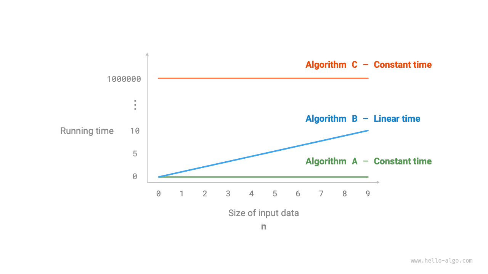
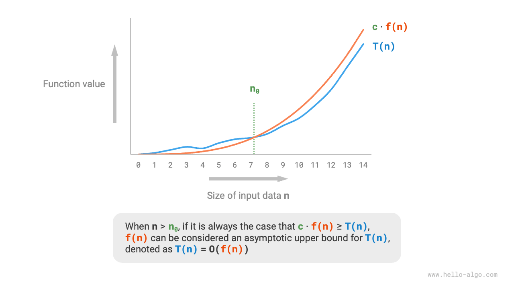
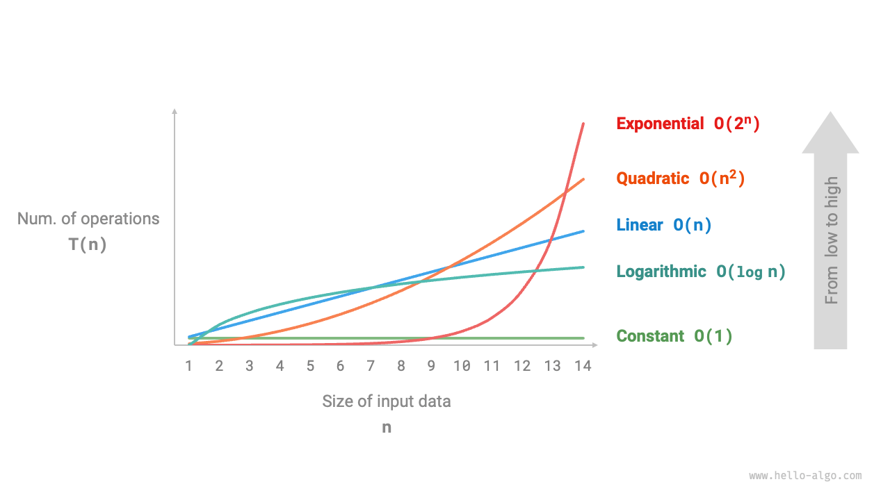
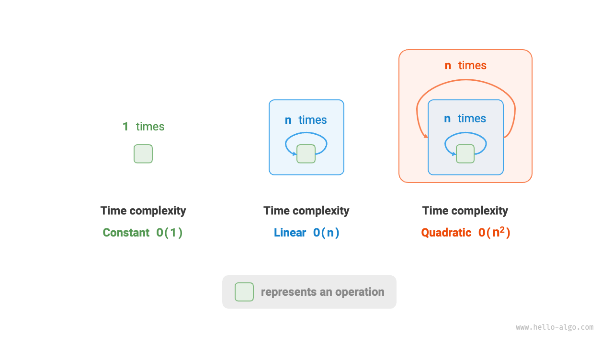
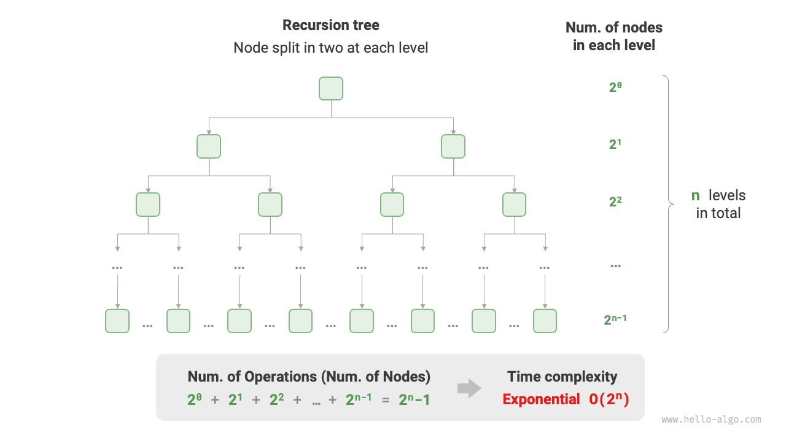
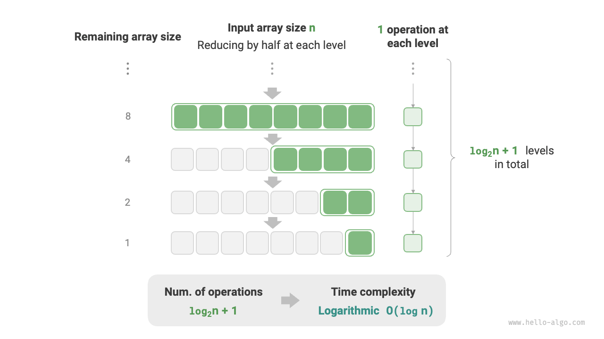
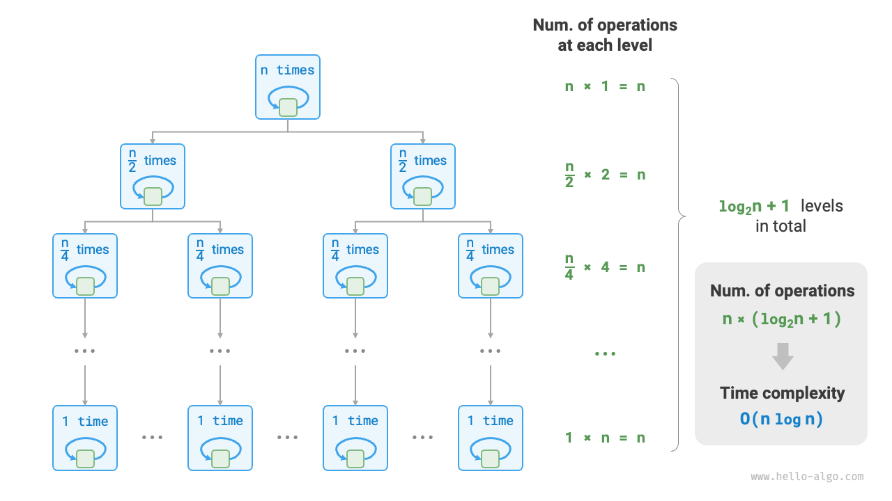
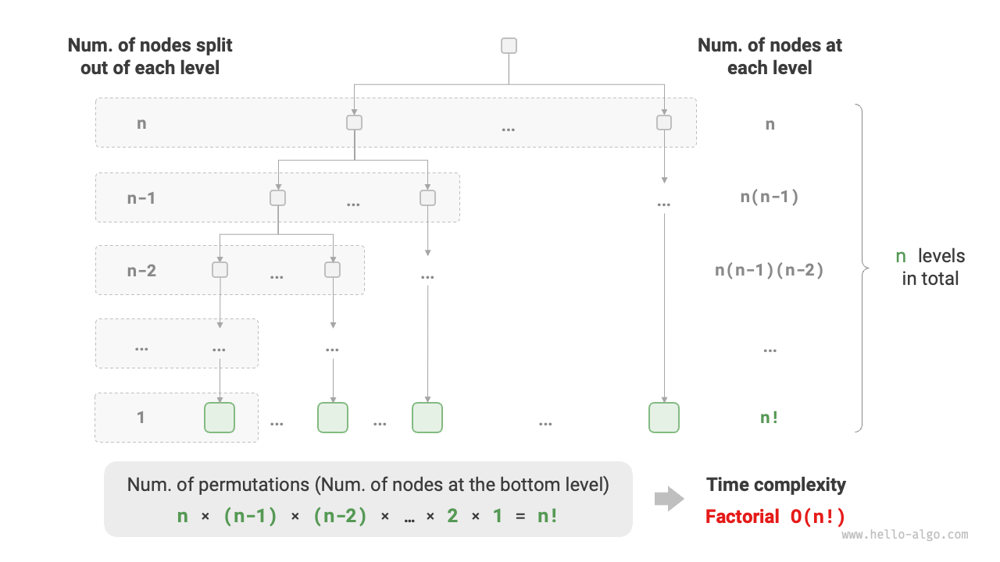

# 2.3 &nbsp; Time Complexity

Time complexity is a concept used to measure how the run time of an algorithm increases with the size of the input data. Understanding time complexity is crucial for accurately assessing the efficiency of an algorithm.

1. **Determining the Running Platform**: This includes hardware configuration, programming language, system environment, etc., all of which can affect the efficiency of code execution.
2. **Evaluating the Run Time for Various Computational Operations**: For instance, an addition operation `+` might take 1 ns, a multiplication operation `*` might take 10 ns, a print operation `print()` might take 5 ns, etc.
3. **Counting All the Computational Operations in the Code**: Summing the execution times of all these operations gives the total run time.

For example, consider the following code with an input size of $n$:

=== "Python"

    ```python title=""
    # Under an operating platform
    def algorithm(n: int):
        a = 2      # 1 ns
        a = a + 1  # 1 ns
        a = a * 2  # 10 ns
        # Cycle n times
        for _ in range(n):  # 1 ns
            print(0)        # 5 ns
    ```

=== "C++"

    ```cpp title=""
    // Under a particular operating platform
    void algorithm(int n) {
        int a = 2;  // 1 ns
        a = a + 1;  // 1 ns
        a = a * 2;  // 10 ns
        // Loop n times
        for (int i = 0; i < n; i++) {  // 1 ns , every round i++ is executed
            cout << 0 << endl;         // 5 ns
        }
    }
    ```

=== "Java"

    ```java title=""
    // Under a particular operating platform
    void algorithm(int n) {
        int a = 2;  // 1 ns
        a = a + 1;  // 1 ns
        a = a * 2;  // 10 ns
        // Loop n times
        for (int i = 0; i < n; i++) {  // 1 ns , every round i++ is executed
            System.out.println(0);     // 5 ns
        }
    }
    ```

=== "C#"

    ```csharp title=""
    // Under a particular operating platform
    void Algorithm(int n) {
        int a = 2;  // 1 ns
        a = a + 1;  // 1 ns
        a = a * 2;  // 10 ns
        // Loop n times
        for (int i = 0; i < n; i++) {  // 1 ns , every round i++ is executed
            Console.WriteLine(0);      // 5 ns
        }
    }
    ```

=== "Go"

    ```go title=""
    // Under a particular operating platform
    func algorithm(n int) {
        a := 2     // 1 ns
        a = a + 1  // 1 ns
        a = a * 2  // 10 ns
        // Loop n times
        for i := 0; i < n; i++ {  // 1 ns
            fmt.Println(a)        // 5 ns
        }
    }
    ```

=== "Swift"

    ```swift title=""
    // Under a particular operating platform
    func algorithm(n: Int) {
        var a = 2 // 1 ns
        a = a + 1 // 1 ns
        a = a * 2 // 10 ns
        // Loop n times
        for _ in 0 ..< n { // 1 ns
            print(0) // 5 ns
        }
    }
    ```

=== "JS"

    ```javascript title=""
    // Under a particular operating platform
    function algorithm(n) {
        var a = 2; // 1 ns
        a = a + 1; // 1 ns
        a = a * 2; // 10 ns
        // Loop n times
        for(let i = 0; i < n; i++) { // 1 ns , every round i++ is executed
            console.log(0); // 5 ns
        }
    }
    ```

=== "TS"

    ```typescript title=""
    // Under a particular operating platform
    function algorithm(n: number): void {
        var a: number = 2; // 1 ns
        a = a + 1; // 1 ns
        a = a * 2; // 10 ns
        // Loop n times
        for(let i = 0; i < n; i++) { // 1 ns , every round i++ is executed
            console.log(0); // 5 ns
        }
    }
    ```

=== "Dart"

    ```dart title=""
    // Under a particular operating platform
    void algorithm(int n) {
      int a = 2; // 1 ns
      a = a + 1; // 1 ns
      a = a * 2; // 10 ns
      // Loop n times
      for (int i = 0; i < n; i++) { // 1 ns , every round i++ is executed
        print(0); // 5 ns
      }
    }
    ```

=== "Rust"

    ```rust title=""
    // Under a particular operating platform
    fn algorithm(n: i32) {
        let mut a = 2;      // 1 ns
        a = a + 1;          // 1 ns
        a = a * 2;          // 10 ns
        // Loop n times
        for _ in 0..n {     // 1 ns for each round i++
            println!("{}", 0);  // 5 ns
        }
    }
    ```

=== "C"

    ```c title=""
    // Under a particular operating platform
    void algorithm(int n) {
        int a = 2;  // 1 ns
        a = a + 1;  // 1 ns
        a = a * 2;  // 10 ns
        // Loop n times
        for (int i = 0; i < n; i++) {   // 1 ns , every round i++ is executed
            printf("%d", 0);            // 5 ns
        }
    }
    ```

=== "Zig"

    ```zig title=""
    // Under a particular operating platform
    fn algorithm(n: usize) void {
        var a: i32 = 2; // 1 ns
        a += 1; // 1 ns
        a *= 2; // 10 ns
        // Loop n times
        for (0..n) |_| { // 1 ns
            std.debug.print("{}\n", .{0}); // 5 ns
        }
    }
    ```

Using the above method, the run time of the algorithm can be calculated as $(6n + 12)$ ns:

$$
1 + 1 + 10 + (1 + 5) \times n = 6n + 12
$$

However, in practice, **counting the run time of an algorithm is neither practical nor reasonable**. First, we don't want to tie the estimated time to the running platform, as algorithms need to run on various platforms. Second, it's challenging to know the run time for each type of operation, making the estimation process difficult.

## 2.3.1 &nbsp; Assessing Time Growth Trend

Time complexity analysis does not count the algorithm's run time, **but rather the growth trend of the run time as the data volume increases**.

Let's understand this concept of "time growth trend" with an example. Assume the input data size is $n$, and consider three algorithms `A`, `B`, and `C`:

=== "Python"

    ```python title=""
    # Time complexity of algorithm A: constant order
    def algorithm_A(n: int):
        print(0)
    # Time complexity of algorithm B: linear order
    def algorithm_B(n: int):
        for _ in range(n):
            print(0)
    # Time complexity of algorithm C: constant order
    def algorithm_C(n: int):
        for _ in range(1000000):
            print(0)
    ```

=== "C++"

    ```cpp title=""
    // Time complexity of algorithm A: constant order
    void algorithm_A(int n) {
        cout << 0 << endl;
    }
    // Time complexity of algorithm B: linear order
    void algorithm_B(int n) {
        for (int i = 0; i < n; i++) {
            cout << 0 << endl;
        }
    }
    // Time complexity of algorithm C: constant order
    void algorithm_C(int n) {
        for (int i = 0; i < 1000000; i++) {
            cout << 0 << endl;
        }
    }
    ```

=== "Java"

    ```java title=""
    // Time complexity of algorithm A: constant order
    void algorithm_A(int n) {
        System.out.println(0);
    }
    // Time complexity of algorithm B: linear order
    void algorithm_B(int n) {
        for (int i = 0; i < n; i++) {
            System.out.println(0);
        }
    }
    // Time complexity of algorithm C: constant order
    void algorithm_C(int n) {
        for (int i = 0; i < 1000000; i++) {
            System.out.println(0);
        }
    }
    ```

=== "C#"

    ```csharp title=""
    // Time complexity of algorithm A: constant order
    void AlgorithmA(int n) {
        Console.WriteLine(0);
    }
    // Time complexity of algorithm B: linear order
    void AlgorithmB(int n) {
        for (int i = 0; i < n; i++) {
            Console.WriteLine(0);
        }
    }
    // Time complexity of algorithm C: constant order
    void AlgorithmC(int n) {
        for (int i = 0; i < 1000000; i++) {
            Console.WriteLine(0);
        }
    }
    ```

=== "Go"

    ```go title=""
    // Time complexity of algorithm A: constant order
    func algorithm_A(n int) {
        fmt.Println(0)
    }
    // Time complexity of algorithm B: linear order
    func algorithm_B(n int) {
        for i := 0; i < n; i++ {
            fmt.Println(0)
        }
    }
    // Time complexity of algorithm C: constant order
    func algorithm_C(n int) {
        for i := 0; i < 1000000; i++ {
            fmt.Println(0)
        }
    }
    ```

=== "Swift"

    ```swift title=""
    // Time complexity of algorithm A: constant order
    func algorithmA(n: Int) {
        print(0)
    }

    // Time complexity of algorithm B: linear order
    func algorithmB(n: Int) {
        for _ in 0 ..< n {
            print(0)
        }
    }

    // Time complexity of algorithm C: constant order
    func algorithmC(n: Int) {
        for _ in 0 ..< 1000000 {
            print(0)
        }
    }
    ```

=== "JS"

    ```javascript title=""
    // Time complexity of algorithm A: constant order
    function algorithm_A(n) {
        console.log(0);
    }
    // Time complexity of algorithm B: linear order
    function algorithm_B(n) {
        for (let i = 0; i < n; i++) {
            console.log(0);
        }
    }
    // Time complexity of algorithm C: constant order
    function algorithm_C(n) {
        for (let i = 0; i < 1000000; i++) {
            console.log(0);
        }
    }

    ```

=== "TS"

    ```typescript title=""
    // Time complexity of algorithm A: constant order
    function algorithm_A(n: number): void {
        console.log(0);
    }
    // Time complexity of algorithm B: linear order
    function algorithm_B(n: number): void {
        for (let i = 0; i < n; i++) {
            console.log(0);
        }
    }
    // Time complexity of algorithm C: constant order
    function algorithm_C(n: number): void {
        for (let i = 0; i < 1000000; i++) {
            console.log(0);
        }
    }
    ```

=== "Dart"

    ```dart title=""
    // Time complexity of algorithm A: constant order
    void algorithmA(int n) {
      print(0);
    }
    // Time complexity of algorithm B: linear order
    void algorithmB(int n) {
      for (int i = 0; i < n; i++) {
        print(0);
      }
    }
    // Time complexity of algorithm C: constant order
    void algorithmC(int n) {
      for (int i = 0; i < 1000000; i++) {
        print(0);
      }
    }
    ```

=== "Rust"

    ```rust title=""
    // Time complexity of algorithm A: constant order
    fn algorithm_A(n: i32) {
        println!("{}", 0);
    }
    // Time complexity of algorithm B: linear order
    fn algorithm_B(n: i32) {
        for _ in 0..n {
            println!("{}", 0);
        }
    }
    // Time complexity of algorithm C: constant order
    fn algorithm_C(n: i32) {
        for _ in 0..1000000 {
            println!("{}", 0);
        }
    }
    ```

=== "C"

    ```c title=""
    // Time complexity of algorithm A: constant order
    void algorithm_A(int n) {
        printf("%d", 0);
    }
    // Time complexity of algorithm B: linear order
    void algorithm_B(int n) {
        for (int i = 0; i < n; i++) {
            printf("%d", 0);
        }
    }
    // Time complexity of algorithm C: constant order
    void algorithm_C(int n) {
        for (int i = 0; i < 1000000; i++) {
            printf("%d", 0);
        }
    }
    ```

=== "Zig"

    ```zig title=""
    // Time complexity of algorithm A: constant order
    fn algorithm_A(n: usize) void {
        _ = n;
        std.debug.print("{}\n", .{0});
    }
    // Time complexity of algorithm B: linear order
    fn algorithm_B(n: i32) void {
        for (0..n) |_| {
            std.debug.print("{}\n", .{0});
        }
    }
    // Time complexity of algorithm C: constant order
    fn algorithm_C(n: i32) void {
        _ = n;
        for (0..1000000) |_| {
            std.debug.print("{}\n", .{0});
        }
    }
    ```

The following figure shows the time complexities of these three algorithms.

- Algorithm `A` has just one print operation, and its run time does not grow with $n$. Its time complexity is considered "constant order."
- Algorithm `B` involves a print operation looping $n$ times, and its run time grows linearly with $n$. Its time complexity is "linear order."
- Algorithm `C` has a print operation looping 1,000,000 times. Although it takes a long time, it is independent of the input data size $n$. Therefore, the time complexity of `C` is the same as `A`, which is "constant order."

{ class="animation-figure" }

<p align="center"> Figure 2-7 &nbsp; Time Growth Trend of Algorithms A, B, and C </p>

Compared to directly counting the run time of an algorithm, what are the characteristics of time complexity analysis?

- **Time complexity effectively assesses algorithm efficiency**. For instance, algorithm `B` has linearly growing run time, which is slower than algorithm `A` when $n > 1$ and slower than `C` when $n > 1,000,000$. In fact, as long as the input data size $n$ is sufficiently large, a "constant order" complexity algorithm will always be better than a "linear order" one, demonstrating the essence of time growth trend.
- **Time complexity analysis is more straightforward**. Obviously, the running platform and the types of computational operations are irrelevant to the trend of run time growth. Therefore, in time complexity analysis, we can simply treat the execution time of all computational operations as the same "unit time," simplifying the "computational operation run time count" to a "computational operation count." This significantly reduces the complexity of estimation.
- **Time complexity has its limitations**. For example, although algorithms `A` and `C` have the same time complexity, their actual run times can be quite different. Similarly, even though algorithm `B` has a higher time complexity than `C`, it is clearly superior when the input data size $n$ is small. In these cases, it's difficult to judge the efficiency of algorithms based solely on time complexity. Nonetheless, despite these issues, complexity analysis remains the most effective and commonly used method for evaluating algorithm efficiency.

## 2.3.2 &nbsp; Asymptotic Upper Bound

Consider a function with an input size of $n$:

=== "Python"

    ```python title=""
    def algorithm(n: int):
        a = 1      # +1
        a = a + 1  # +1
        a = a * 2  # +1
        # Cycle n times
        for i in range(n):  # +1
            print(0)        # +1
    ```

=== "C++"

    ```cpp title=""
    void algorithm(int n) {
        int a = 1;  // +1
        a = a + 1;  // +1
        a = a * 2;  // +1
        // Loop n times
        for (int i = 0; i < n; i++) { // +1 (execute i ++ every round)
            cout << 0 << endl;    // +1
        }
    }
    ```

=== "Java"

    ```java title=""
    void algorithm(int n) {
        int a = 1;  // +1
        a = a + 1;  // +1
        a = a * 2;  // +1
        // Loop n times
        for (int i = 0; i < n; i++) { // +1 (execute i ++ every round)
            System.out.println(0);    // +1
        }
    }
    ```

=== "C#"

    ```csharp title=""
    void Algorithm(int n) {
        int a = 1;  // +1
        a = a + 1;  // +1
        a = a * 2;  // +1
        // Loop n times
        for (int i = 0; i < n; i++) {   // +1 (execute i ++ every round)
            Console.WriteLine(0);   // +1
        }
    }
    ```

=== "Go"

    ```go title=""
    func algorithm(n int) {
        a := 1      // +1
        a = a + 1   // +1
        a = a * 2   // +1
        // Loop n times
        for i := 0; i < n; i++ {   // +1
            fmt.Println(a)         // +1
        }
    }
    ```

=== "Swift"

    ```swift title=""
    func algorithm(n: Int) {
        var a = 1 // +1
        a = a + 1 // +1
        a = a * 2 // +1
        // Loop n times
        for _ in 0 ..< n { // +1
            print(0) // +1
        }
    }
    ```

=== "JS"

    ```javascript title=""
    function algorithm(n) {
        var a = 1; // +1
        a += 1; // +1
        a *= 2; // +1
        // Loop n times
        for(let i = 0; i < n; i++){ // +1 (execute i ++ every round)
            console.log(0); // +1
        }
    }
    ```

=== "TS"

    ```typescript title=""
    function algorithm(n: number): void{
        var a: number = 1; // +1
        a += 1; // +1
        a *= 2; // +1
        // Loop n times
        for(let i = 0; i < n; i++){ // +1 (execute i ++ every round)
            console.log(0); // +1
        }
    }
    ```

=== "Dart"

    ```dart title=""
    void algorithm(int n) {
      int a = 1; // +1
      a = a + 1; // +1
      a = a * 2; // +1
      // Loop n times
      for (int i = 0; i < n; i++) { // +1 (execute i ++ every round)
        print(0); // +1
      }
    }
    ```

=== "Rust"

    ```rust title=""
    fn algorithm(n: i32) {
        let mut a = 1;   // +1
        a = a + 1;      // +1
        a = a * 2;      // +1

        // Loop n times
        for _ in 0..n { // +1 (execute i ++ every round)
            println!("{}", 0); // +1
        }
    }
    ```

=== "C"

    ```c title=""
    void algorithm(int n) {
        int a = 1;  // +1
        a = a + 1;  // +1
        a = a * 2;  // +1
        // Loop n times
        for (int i = 0; i < n; i++) {   // +1 (execute i ++ every round)
            printf("%d", 0);            // +1
        }
    } 
    ```

=== "Zig"

    ```zig title=""
    fn algorithm(n: usize) void {
        var a: i32 = 1; // +1
        a += 1; // +1
        a *= 2; // +1
        // Loop n times
        for (0..n) |_| { // +1 (execute i ++ every round)
            std.debug.print("{}\n", .{0}); // +1
        }
    }
    ```

Given a function that represents the number of operations of an algorithm as a function of the input size $n$, denoted as $T(n)$, consider the following example:

$$
T(n) = 3 + 2n
$$

Since $T(n)$ is a linear function, its growth trend is linear, and therefore, its time complexity is of linear order, denoted as $O(n)$. This mathematical notation, known as "big-O notation," represents the "asymptotic upper bound" of the function $T(n)$.

In essence, time complexity analysis is about finding the asymptotic upper bound of the "number of operations $T(n)$". It has a precise mathematical definition.

!!! abstract "Asymptotic Upper Bound"

    If there exist positive real numbers $c$ and $n_0$ such that for all $n > n_0$, $T(n) \leq c \cdot f(n)$, then $f(n)$ is considered an asymptotic upper bound of $T(n)$, denoted as $T(n) = O(f(n))$.

As illustrated below, calculating the asymptotic upper bound involves finding a function $f(n)$ such that, as $n$ approaches infinity, $T(n)$ and $f(n)$ have the same growth order, differing only by a constant factor $c$.

{ class="animation-figure" }

<p align="center"> Figure 2-8 &nbsp; Asymptotic Upper Bound of a Function </p>

## 2.3.3 &nbsp; Calculation Method

While the concept of asymptotic upper bound might seem mathematically dense, you don't need to fully grasp it right away. Let's first understand the method of calculation, which can be practiced and comprehended over time.

Once $f(n)$ is determined, we obtain the time complexity $O(f(n))$. But how do we determine the asymptotic upper bound $f(n)$? This process generally involves two steps: counting the number of operations and determining the asymptotic upper bound.

### 1. &nbsp; Step 1: Counting the Number of Operations

This step involves going through the code line by line. However, due to the presence of the constant $c$ in $c \cdot f(n)$, **all coefficients and constant terms in $T(n)$ can be ignored**. This principle allows for simplification techniques in counting operations.

1. **Ignore constant terms in $T(n)$**, as they do not affect the time complexity being independent of $n$.
2. **Omit all coefficients**. For example, looping $2n$, $5n + 1$ times, etc., can be simplified to $n$ times since the coefficient before $n$ does not impact the time complexity.
3. **Use multiplication for nested loops**. The total number of operations equals the product of the number of operations in each loop, applying the simplification techniques from points 1 and 2 for each loop level.

Given a function, we can use these techniques to count operations:

=== "Python"

    ```python title=""
    def algorithm(n: int):
        a = 1      # +0 (trick 1)
        a = a + n  # +0 (trick 1)
        # +n (technique 2)
        for i in range(5 * n + 1):
            print(0)
        # +n*n (technique 3)
        for i in range(2 * n):
            for j in range(n + 1):
                print(0)
    ```

=== "C++"

    ```cpp title=""
    void algorithm(int n) {
        int a = 1;  // +0 (trick 1)
        a = a + n;  // +0 (trick 1)
        // +n (technique 2)
        for (int i = 0; i < 5 * n + 1; i++) {
            cout << 0 << endl;
        }
        // +n*n (technique 3)
        for (int i = 0; i < 2 * n; i++) {
            for (int j = 0; j < n + 1; j++) {
                cout << 0 << endl;
            }
        }
    }
    ```

=== "Java"

    ```java title=""
    void algorithm(int n) {
        int a = 1;  // +0 (trick 1)
        a = a + n;  // +0 (trick 1)
        // +n (technique 2)
        for (int i = 0; i < 5 * n + 1; i++) {
            System.out.println(0);
        }
        // +n*n (technique 3)
        for (int i = 0; i < 2 * n; i++) {
            for (int j = 0; j < n + 1; j++) {
                System.out.println(0);
            }
        }
    }
    ```

=== "C#"

    ```csharp title=""
    void Algorithm(int n) {
        int a = 1;  // +0 (trick 1)
        a = a + n;  // +0 (trick 1)
        // +n (technique 2)
        for (int i = 0; i < 5 * n + 1; i++) {
            Console.WriteLine(0);
        }
        // +n*n (technique 3)
        for (int i = 0; i < 2 * n; i++) {
            for (int j = 0; j < n + 1; j++) {
                Console.WriteLine(0);
            }
        }
    }
    ```

=== "Go"

    ```go title=""
    func algorithm(n int) {
        a := 1     // +0 (trick 1)
        a = a + n  // +0 (trick 1)
        // +n (technique 2)
        for i := 0; i < 5 * n + 1; i++ {
            fmt.Println(0)
        }
        // +n*n (technique 3)
        for i := 0; i < 2 * n; i++ {
            for j := 0; j < n + 1; j++ {
                fmt.Println(0)
            }
        }
    }
    ```

=== "Swift"

    ```swift title=""
    func algorithm(n: Int) {
        var a = 1 // +0 (trick 1)
        a = a + n // +0 (trick 1)
        // +n (technique 2)
        for _ in 0 ..< (5 * n + 1) {
            print(0)
        }
        // +n*n (technique 3)
        for _ in 0 ..< (2 * n) {
            for _ in 0 ..< (n + 1) {
                print(0)
            }
        }
    }
    ```

=== "JS"

    ```javascript title=""
    function algorithm(n) {
        let a = 1;  // +0 (trick 1)
        a = a + n;  // +0 (trick 1)
        // +n (technique 2)
        for (let i = 0; i < 5 * n + 1; i++) {
            console.log(0);
        }
        // +n*n (technique 3)
        for (let i = 0; i < 2 * n; i++) {
            for (let j = 0; j < n + 1; j++) {
                console.log(0);
            }
        }
    }
    ```

=== "TS"

    ```typescript title=""
    function algorithm(n: number): void {
        let a = 1;  // +0 (trick 1)
        a = a + n;  // +0 (trick 1)
        // +n (technique 2)
        for (let i = 0; i < 5 * n + 1; i++) {
            console.log(0);
        }
        // +n*n (technique 3)
        for (let i = 0; i < 2 * n; i++) {
            for (let j = 0; j < n + 1; j++) {
                console.log(0);
            }
        }
    }
    ```

=== "Dart"

    ```dart title=""
    void algorithm(int n) {
      int a = 1; // +0 (trick 1)
      a = a + n; // +0 (trick 1)
      // +n (technique 2)
      for (int i = 0; i < 5 * n + 1; i++) {
        print(0);
      }
      // +n*n (technique 3)
      for (int i = 0; i < 2 * n; i++) {
        for (int j = 0; j < n + 1; j++) {
          print(0);
        }
      }
    }
    ```

=== "Rust"

    ```rust title=""
    fn algorithm(n: i32) {
        let mut a = 1;     // +0 (trick 1)
        a = a + n;        // +0 (trick 1)

        // +n (technique 2)
        for i in 0..(5 * n + 1) {
            println!("{}", 0);
        }

        // +n*n (technique 3)
        for i in 0..(2 * n) {
            for j in 0..(n + 1) {
                println!("{}", 0);
            }
        }
    }
    ```

=== "C"

    ```c title=""
    void algorithm(int n) {
        int a = 1;  // +0 (trick 1)
        a = a + n;  // +0 (trick 1)
        // +n (technique 2)
        for (int i = 0; i < 5 * n + 1; i++) {
            printf("%d", 0);
        }
        // +n*n (technique 3)
        for (int i = 0; i < 2 * n; i++) {
            for (int j = 0; j < n + 1; j++) {
                printf("%d", 0);
            }
        }
    }
    ```

=== "Zig"

    ```zig title=""
    fn algorithm(n: usize) void {
        var a: i32 = 1;     // +0 (trick 1)
        a = a + @as(i32, @intCast(n));        // +0 (trick 1)

        // +n (technique 2)
        for(0..(5 * n + 1)) |_| {
            std.debug.print("{}\n", .{0});
        }

        // +n*n (technique 3)
        for(0..(2 * n)) |_| {
            for(0..(n + 1)) |_| {
                std.debug.print("{}\n", .{0});
            }
        }
    }
    ```

The formula below shows the counting results before and after simplification, both leading to a time complexity of $O(n^2)$:

$$
\begin{aligned}
T(n) & = 2n(n + 1) + (5n + 1) + 2 & \text{Complete Count (-.-|||)} \newline
& = 2n^2 + 7n + 3 \newline
T(n) & = n^2 + n & \text{Simplified Count (o.O)}
\end{aligned}
$$

### 2. &nbsp; Step 2: Determining the Asymptotic Upper Bound

**The time complexity is determined by the highest order term in $T(n)$**. This is because, as $n$ approaches infinity, the highest order term dominates, rendering the influence of other terms negligible.

The following table illustrates examples of different operation counts and their corresponding time complexities. Some exaggerated values are used to emphasize that coefficients cannot alter the order of growth. When $n$ becomes very large, these constants become insignificant.

<p align="center"> Table: Time Complexity for Different Operation Counts </p>

<div class="center-table" markdown>

| Operation Count $T(n)$ | Time Complexity $O(f(n))$ |
| ---------------------- | ------------------------- |
| $100000$               | $O(1)$                    |
| $3n + 2$               | $O(n)$                    |
| $2n^2 + 3n + 2$        | $O(n^2)$                  |
| $n^3 + 10000n^2$       | $O(n^3)$                  |
| $2^n + 10000n^{10000}$ | $O(2^n)$                  |

</div>

## 2.3.4 &nbsp; Common Types of Time Complexity

Let's consider the input data size as $n$. The common types of time complexities are illustrated below, arranged from lowest to highest:

$$
\begin{aligned}
O(1) < O(\log n) < O(n) < O(n \log n) < O(n^2) < O(2^n) < O(n!) \newline
\text{Constant Order} < \text{Logarithmic Order} < \text{Linear Order} < \text{Linear-Logarithmic Order} < \text{Quadratic Order} < \text{Exponential Order} < \text{Factorial Order}
\end{aligned}
$$

{ class="animation-figure" }

<p align="center"> Figure 2-9 &nbsp; Common Types of Time Complexity </p>

### 1. &nbsp; Constant Order $O(1)$

Constant order means the number of operations is independent of the input data size $n$. In the following function, although the number of operations `size` might be large, the time complexity remains $O(1)$ as it's unrelated to $n$:

=== "Python"

    ```python title="time_complexity.py"
    def constant(n: int) -> int:
        """常数阶"""
        count = 0
        size = 100000
        for _ in range(size):
            count += 1
        return count
    ```

=== "C++"

    ```cpp title="time_complexity.cpp"
    /* 常数阶 */
    int constant(int n) {
        int count = 0;
        int size = 100000;
        for (int i = 0; i < size; i++)
            count++;
        return count;
    }
    ```

=== "Java"

    ```java title="time_complexity.java"
    /* 常数阶 */
    int constant(int n) {
        int count = 0;
        int size = 100000;
        for (int i = 0; i < size; i++)
            count++;
        return count;
    }
    ```

=== "C#"

    ```csharp title="time_complexity.cs"
    /* 常数阶 */
    int Constant(int n) {
        int count = 0;
        int size = 100000;
        for (int i = 0; i < size; i++)
            count++;
        return count;
    }
    ```

=== "Go"

    ```go title="time_complexity.go"
    /* 常数阶 */
    func constant(n int) int {
        count := 0
        size := 100000
        for i := 0; i < size; i++ {
            count++
        }
        return count
    }
    ```

=== "Swift"

    ```swift title="time_complexity.swift"
    /* 常数阶 */
    func constant(n: Int) -> Int {
        var count = 0
        let size = 100_000
        for _ in 0 ..< size {
            count += 1
        }
        return count
    }
    ```

=== "JS"

    ```javascript title="time_complexity.js"
    /* 常数阶 */
    function constant(n) {
        let count = 0;
        const size = 100000;
        for (let i = 0; i < size; i++) count++;
        return count;
    }
    ```

=== "TS"

    ```typescript title="time_complexity.ts"
    /* 常数阶 */
    function constant(n: number): number {
        let count = 0;
        const size = 100000;
        for (let i = 0; i < size; i++) count++;
        return count;
    }
    ```

=== "Dart"

    ```dart title="time_complexity.dart"
    /* 常数阶 */
    int constant(int n) {
      int count = 0;
      int size = 100000;
      for (var i = 0; i < size; i++) {
        count++;
      }
      return count;
    }
    ```

=== "Rust"

    ```rust title="time_complexity.rs"
    /* 常数阶 */
    fn constant(n: i32) -> i32 {
        _ = n;
        let mut count = 0;
        let size = 100_000;
        for _ in 0..size {
            count += 1;
        }
        count
    }
    ```

=== "C"

    ```c title="time_complexity.c"
    /* 常数阶 */
    int constant(int n) {
        int count = 0;
        int size = 100000;
        int i = 0;
        for (int i = 0; i < size; i++) {
            count++;
        }
        return count;
    }
    ```

=== "Zig"

    ```zig title="time_complexity.zig"
    // 常数阶
    fn constant(n: i32) i32 {
        _ = n;
        var count: i32 = 0;
        const size: i32 = 100_000;
        var i: i32 = 0;
        while(i<size) : (i += 1) {
            count += 1;
        }
        return count;
    }
    ```

??? pythontutor "Visualizing Code"

    <iframe width="800" height="600" frameborder="0" src="https://pythontutor.com/iframe-embed.html#code=def%20constant%28n%3A%20int%29%20-%3E%20int%3A%0A%20%20%20%20%22%22%22%E5%B8%B8%E6%95%B0%E9%98%B6%22%22%22%0A%20%20%20%20count%20%3D%200%0A%20%20%20%20size%20%3D%2010%0A%20%20%20%20for%20_%20in%20range%28size%29%3A%0A%20%20%20%20%20%20%20%20count%20%2B%3D%201%0A%20%20%20%20return%20count%0A%0A%22%22%22Driver%20Code%22%22%22%0Aif%20__name__%20%3D%3D%20%22__main__%22%3A%0A%20%20%20%20n%20%3D%208%0A%20%20%20%20print%28%22%E8%BE%93%E5%85%A5%E6%95%B0%E6%8D%AE%E5%A4%A7%E5%B0%8F%20n%20%3D%22,%20n%29%0A%0A%20%20%20%20count%20%3D%20constant%28n%29%0A%20%20%20%20print%28%22%E5%B8%B8%E6%95%B0%E9%98%B6%E7%9A%84%E6%93%8D%E4%BD%9C%E6%95%B0%E9%87%8F%20%3D%22,%20count%29&codeDivHeight=370&codeDivWidth=300&cumulative=false&curInstr=3&heapPrimitives=nevernest&origin=opt-frontend.js&py=311&rawInputLstJSON=%5B%5D&textReferences=false"> </iframe>
    <a href=https://pythontutor.com/iframe-embed.html#code=def%20constant%28n%3A%20int%29%20-%3E%20int%3A%0A%20%20%20%20%22%22%22%E5%B8%B8%E6%95%B0%E9%98%B6%22%22%22%0A%20%20%20%20count%20%3D%200%0A%20%20%20%20size%20%3D%2010%0A%20%20%20%20for%20_%20in%20range%28size%29%3A%0A%20%20%20%20%20%20%20%20count%20%2B%3D%201%0A%20%20%20%20return%20count%0A%0A%22%22%22Driver%20Code%22%22%22%0Aif%20__name__%20%3D%3D%20%22__main__%22%3A%0A%20%20%20%20n%20%3D%208%0A%20%20%20%20print%28%22%E8%BE%93%E5%85%A5%E6%95%B0%E6%8D%AE%E5%A4%A7%E5%B0%8F%20n%20%3D%22,%20n%29%0A%0A%20%20%20%20count%20%3D%20constant%28n%29%0A%20%20%20%20print%28%22%E5%B8%B8%E6%95%B0%E9%98%B6%E7%9A%84%E6%93%8D%E4%BD%9C%E6%95%B0%E9%87%8F%20%3D%22,%20count%29&codeDivHeight=800&codeDivWidth=600&cumulative=false&curInstr=3&heapPrimitives=nevernest&origin=opt-frontend.js&py=311&rawInputLstJSON=%5B%5D&textReferences=false target="_blank" rel="noopener noreferrer">全屏观看 ></a>

### 2. &nbsp; Linear Order $O(n)$

Linear order indicates the number of operations grows linearly with the input data size $n$. Linear order commonly appears in single-loop structures:

=== "Python"

    ```python title="time_complexity.py"
    def linear(n: int) -> int:
        """线性阶"""
        count = 0
        for _ in range(n):
            count += 1
        return count
    ```

=== "C++"

    ```cpp title="time_complexity.cpp"
    /* 线性阶 */
    int linear(int n) {
        int count = 0;
        for (int i = 0; i < n; i++)
            count++;
        return count;
    }
    ```

=== "Java"

    ```java title="time_complexity.java"
    /* 线性阶 */
    int linear(int n) {
        int count = 0;
        for (int i = 0; i < n; i++)
            count++;
        return count;
    }
    ```

=== "C#"

    ```csharp title="time_complexity.cs"
    /* 线性阶 */
    int Linear(int n) {
        int count = 0;
        for (int i = 0; i < n; i++)
            count++;
        return count;
    }
    ```

=== "Go"

    ```go title="time_complexity.go"
    /* 线性阶 */
    func linear(n int) int {
        count := 0
        for i := 0; i < n; i++ {
            count++
        }
        return count
    }
    ```

=== "Swift"

    ```swift title="time_complexity.swift"
    /* 线性阶 */
    func linear(n: Int) -> Int {
        var count = 0
        for _ in 0 ..< n {
            count += 1
        }
        return count
    }
    ```

=== "JS"

    ```javascript title="time_complexity.js"
    /* 线性阶 */
    function linear(n) {
        let count = 0;
        for (let i = 0; i < n; i++) count++;
        return count;
    }
    ```

=== "TS"

    ```typescript title="time_complexity.ts"
    /* 线性阶 */
    function linear(n: number): number {
        let count = 0;
        for (let i = 0; i < n; i++) count++;
        return count;
    }
    ```

=== "Dart"

    ```dart title="time_complexity.dart"
    /* 线性阶 */
    int linear(int n) {
      int count = 0;
      for (var i = 0; i < n; i++) {
        count++;
      }
      return count;
    }
    ```

=== "Rust"

    ```rust title="time_complexity.rs"
    /* 线性阶 */
    fn linear(n: i32) -> i32 {
        let mut count = 0;
        for _ in 0..n {
            count += 1;
        }
        count
    }
    ```

=== "C"

    ```c title="time_complexity.c"
    /* 线性阶 */
    int linear(int n) {
        int count = 0;
        for (int i = 0; i < n; i++) {
            count++;
        }
        return count;
    }
    ```

=== "Zig"

    ```zig title="time_complexity.zig"
    // 线性阶
    fn linear(n: i32) i32 {
        var count: i32 = 0;
        var i: i32 = 0;
        while (i < n) : (i += 1) {
            count += 1;
        }
        return count;
    }
    ```

??? pythontutor "Visualizing Code"

    <iframe width="800" height="600" frameborder="0" src="https://pythontutor.com/iframe-embed.html#code=def%20linear%28n%29%20-%3E%20int%3A%0A%20%20%20%20%22%22%22%E7%BA%BF%E6%80%A7%E9%98%B6%22%22%22%0A%20%20%20%20count%20%3D%200%0A%20%20%20%20for%20_%20in%20range%28n%29%3A%0A%20%20%20%20%20%20%20%20count%20%2B%3D%201%0A%20%20%20%20return%20count%0A%0A%22%22%22Driver%20Code%22%22%22%0Aif%20__name__%20%3D%3D%20%22__main__%22%3A%0A%20%20%20%20n%20%3D%208%0A%20%20%20%20print%28%22%E8%BE%93%E5%85%A5%E6%95%B0%E6%8D%AE%E5%A4%A7%E5%B0%8F%20n%20%3D%22,%20n%29%0A%0A%20%20%20%20count%20%3D%20linear%28n%29%0A%20%20%20%20print%28%22%E7%BA%BF%E6%80%A7%E9%98%B6%E7%9A%84%E6%93%8D%E4%BD%9C%E6%95%B0%E9%87%8F%20%3D%22,%20count%29&codeDivHeight=370&codeDivWidth=300&cumulative=false&curInstr=3&heapPrimitives=nevernest&origin=opt-frontend.js&py=311&rawInputLstJSON=%5B%5D&textReferences=false"> </iframe>
    <a href=https://pythontutor.com/iframe-embed.html#code=def%20linear%28n%29%20-%3E%20int%3A%0A%20%20%20%20%22%22%22%E7%BA%BF%E6%80%A7%E9%98%B6%22%22%22%0A%20%20%20%20count%20%3D%200%0A%20%20%20%20for%20_%20in%20range%28n%29%3A%0A%20%20%20%20%20%20%20%20count%20%2B%3D%201%0A%20%20%20%20return%20count%0A%0A%22%22%22Driver%20Code%22%22%22%0Aif%20__name__%20%3D%3D%20%22__main__%22%3A%0A%20%20%20%20n%20%3D%208%0A%20%20%20%20print%28%22%E8%BE%93%E5%85%A5%E6%95%B0%E6%8D%AE%E5%A4%A7%E5%B0%8F%20n%20%3D%22,%20n%29%0A%0A%20%20%20%20count%20%3D%20linear%28n%29%0A%20%20%20%20print%28%22%E7%BA%BF%E6%80%A7%E9%98%B6%E7%9A%84%E6%93%8D%E4%BD%9C%E6%95%B0%E9%87%8F%20%3D%22,%20count%29&codeDivHeight=800&codeDivWidth=600&cumulative=false&curInstr=3&heapPrimitives=nevernest&origin=opt-frontend.js&py=311&rawInputLstJSON=%5B%5D&textReferences=false target="_blank" rel="noopener noreferrer">全屏观看 ></a>

Operations like array traversal and linked list traversal have a time complexity of $O(n)$, where $n$ is the length of the array or list:

=== "Python"

    ```python title="time_complexity.py"
    def array_traversal(nums: list[int]) -> int:
        """线性阶（遍历数组）"""
        count = 0
        # 循环次数与数组长度成正比
        for num in nums:
            count += 1
        return count
    ```

=== "C++"

    ```cpp title="time_complexity.cpp"
    /* 线性阶（遍历数组） */
    int arrayTraversal(vector<int> &nums) {
        int count = 0;
        // 循环次数与数组长度成正比
        for (int num : nums) {
            count++;
        }
        return count;
    }
    ```

=== "Java"

    ```java title="time_complexity.java"
    /* 线性阶（遍历数组） */
    int arrayTraversal(int[] nums) {
        int count = 0;
        // 循环次数与数组长度成正比
        for (int num : nums) {
            count++;
        }
        return count;
    }
    ```

=== "C#"

    ```csharp title="time_complexity.cs"
    /* 线性阶（遍历数组） */
    int ArrayTraversal(int[] nums) {
        int count = 0;
        // 循环次数与数组长度成正比
        foreach (int num in nums) {
            count++;
        }
        return count;
    }
    ```

=== "Go"

    ```go title="time_complexity.go"
    /* 线性阶（遍历数组） */
    func arrayTraversal(nums []int) int {
        count := 0
        // 循环次数与数组长度成正比
        for range nums {
            count++
        }
        return count
    }
    ```

=== "Swift"

    ```swift title="time_complexity.swift"
    /* 线性阶（遍历数组） */
    func arrayTraversal(nums: [Int]) -> Int {
        var count = 0
        // 循环次数与数组长度成正比
        for _ in nums {
            count += 1
        }
        return count
    }
    ```

=== "JS"

    ```javascript title="time_complexity.js"
    /* 线性阶（遍历数组） */
    function arrayTraversal(nums) {
        let count = 0;
        // 循环次数与数组长度成正比
        for (let i = 0; i < nums.length; i++) {
            count++;
        }
        return count;
    }
    ```

=== "TS"

    ```typescript title="time_complexity.ts"
    /* 线性阶（遍历数组） */
    function arrayTraversal(nums: number[]): number {
        let count = 0;
        // 循环次数与数组长度成正比
        for (let i = 0; i < nums.length; i++) {
            count++;
        }
        return count;
    }
    ```

=== "Dart"

    ```dart title="time_complexity.dart"
    /* 线性阶（遍历数组） */
    int arrayTraversal(List<int> nums) {
      int count = 0;
      // 循环次数与数组长度成正比
      for (var _num in nums) {
        count++;
      }
      return count;
    }
    ```

=== "Rust"

    ```rust title="time_complexity.rs"
    /* 线性阶（遍历数组） */
    fn array_traversal(nums: &[i32]) -> i32 {
        let mut count = 0;
        // 循环次数与数组长度成正比
        for _ in nums {
            count += 1;
        }
        count
    }
    ```

=== "C"

    ```c title="time_complexity.c"
    /* 线性阶（遍历数组） */
    int arrayTraversal(int *nums, int n) {
        int count = 0;
        // 循环次数与数组长度成正比
        for (int i = 0; i < n; i++) {
            count++;
        }
        return count;
    }
    ```

=== "Zig"

    ```zig title="time_complexity.zig"
    // 线性阶（遍历数组）
    fn arrayTraversal(nums: []i32) i32 {
        var count: i32 = 0;
        // 循环次数与数组长度成正比
        for (nums) |_| {
            count += 1;
        }
        return count;
    }
    ```

??? pythontutor "Visualizing Code"

    <iframe width="800" height="600" frameborder="0" src="https://pythontutor.com/iframe-embed.html#code=def%20array_traversal%28nums%3A%20list%5Bint%5D%29%20-%3E%20int%3A%0A%20%20%20%20%22%22%22%E7%BA%BF%E6%80%A7%E9%98%B6%EF%BC%88%E9%81%8D%E5%8E%86%E6%95%B0%E7%BB%84%EF%BC%89%22%22%22%0A%20%20%20%20count%20%3D%200%0A%20%20%20%20%23%20%E5%BE%AA%E7%8E%AF%E6%AC%A1%E6%95%B0%E4%B8%8E%E6%95%B0%E7%BB%84%E9%95%BF%E5%BA%A6%E6%88%90%E6%AD%A3%E6%AF%94%0A%20%20%20%20for%20num%20in%20nums%3A%0A%20%20%20%20%20%20%20%20count%20%2B%3D%201%0A%20%20%20%20return%20count%0A%0A%22%22%22Driver%20Code%22%22%22%0Aif%20__name__%20%3D%3D%20%22__main__%22%3A%0A%20%20%20%20n%20%3D%208%0A%20%20%20%20print%28%22%E8%BE%93%E5%85%A5%E6%95%B0%E6%8D%AE%E5%A4%A7%E5%B0%8F%20n%20%3D%22,%20n%29%0A%0A%20%20%20%20count%20%3D%20array_traversal%28%5B0%5D%20*%20n%29%0A%20%20%20%20print%28%22%E7%BA%BF%E6%80%A7%E9%98%B6%EF%BC%88%E9%81%8D%E5%8E%86%E6%95%B0%E7%BB%84%EF%BC%89%E7%9A%84%E6%93%8D%E4%BD%9C%E6%95%B0%E9%87%8F%20%3D%22,%20count%29&codeDivHeight=370&codeDivWidth=300&cumulative=false&curInstr=3&heapPrimitives=nevernest&origin=opt-frontend.js&py=311&rawInputLstJSON=%5B%5D&textReferences=false"> </iframe>
    <a href=https://pythontutor.com/iframe-embed.html#code=def%20array_traversal%28nums%3A%20list%5Bint%5D%29%20-%3E%20int%3A%0A%20%20%20%20%22%22%22%E7%BA%BF%E6%80%A7%E9%98%B6%EF%BC%88%E9%81%8D%E5%8E%86%E6%95%B0%E7%BB%84%EF%BC%89%22%22%22%0A%20%20%20%20count%20%3D%200%0A%20%20%20%20%23%20%E5%BE%AA%E7%8E%AF%E6%AC%A1%E6%95%B0%E4%B8%8E%E6%95%B0%E7%BB%84%E9%95%BF%E5%BA%A6%E6%88%90%E6%AD%A3%E6%AF%94%0A%20%20%20%20for%20num%20in%20nums%3A%0A%20%20%20%20%20%20%20%20count%20%2B%3D%201%0A%20%20%20%20return%20count%0A%0A%22%22%22Driver%20Code%22%22%22%0Aif%20__name__%20%3D%3D%20%22__main__%22%3A%0A%20%20%20%20n%20%3D%208%0A%20%20%20%20print%28%22%E8%BE%93%E5%85%A5%E6%95%B0%E6%8D%AE%E5%A4%A7%E5%B0%8F%20n%20%3D%22,%20n%29%0A%0A%20%20%20%20count%20%3D%20array_traversal%28%5B0%5D%20*%20n%29%0A%20%20%20%20print%28%22%E7%BA%BF%E6%80%A7%E9%98%B6%EF%BC%88%E9%81%8D%E5%8E%86%E6%95%B0%E7%BB%84%EF%BC%89%E7%9A%84%E6%93%8D%E4%BD%9C%E6%95%B0%E9%87%8F%20%3D%22,%20count%29&codeDivHeight=800&codeDivWidth=600&cumulative=false&curInstr=3&heapPrimitives=nevernest&origin=opt-frontend.js&py=311&rawInputLstJSON=%5B%5D&textReferences=false target="_blank" rel="noopener noreferrer">全屏观看 ></a>

It's important to note that **the input data size $n$ should be determined based on the type of input data**. For example, in the first example, $n$ represents the input data size, while in the second example, the length of the array $n$ is the data size.

### 3. &nbsp; Quadratic Order $O(n^2)$

Quadratic order means the number of operations grows quadratically with the input data size $n$. Quadratic order typically appears in nested loops, where both the outer and inner loops have a time complexity of $O(n)$, resulting in an overall complexity of $O(n^2)$:

=== "Python"

    ```python title="time_complexity.py"
    def quadratic(n: int) -> int:
        """平方阶"""
        count = 0
        # 循环次数与数组长度成平方关系
        for i in range(n):
            for j in range(n):
                count += 1
        return count
    ```

=== "C++"

    ```cpp title="time_complexity.cpp"
    /* 平方阶 */
    int quadratic(int n) {
        int count = 0;
        // 循环次数与数组长度成平方关系
        for (int i = 0; i < n; i++) {
            for (int j = 0; j < n; j++) {
                count++;
            }
        }
        return count;
    }
    ```

=== "Java"

    ```java title="time_complexity.java"
    /* 平方阶 */
    int quadratic(int n) {
        int count = 0;
        // 循环次数与数组长度成平方关系
        for (int i = 0; i < n; i++) {
            for (int j = 0; j < n; j++) {
                count++;
            }
        }
        return count;
    }
    ```

=== "C#"

    ```csharp title="time_complexity.cs"
    /* 平方阶 */
    int Quadratic(int n) {
        int count = 0;
        // 循环次数与数组长度成平方关系
        for (int i = 0; i < n; i++) {
            for (int j = 0; j < n; j++) {
                count++;
            }
        }
        return count;
    }
    ```

=== "Go"

    ```go title="time_complexity.go"
    /* 平方阶 */
    func quadratic(n int) int {
        count := 0
        // 循环次数与数组长度成平方关系
        for i := 0; i < n; i++ {
            for j := 0; j < n; j++ {
                count++
            }
        }
        return count
    }
    ```

=== "Swift"

    ```swift title="time_complexity.swift"
    /* 平方阶 */
    func quadratic(n: Int) -> Int {
        var count = 0
        // 循环次数与数组长度成平方关系
        for _ in 0 ..< n {
            for _ in 0 ..< n {
                count += 1
            }
        }
        return count
    }
    ```

=== "JS"

    ```javascript title="time_complexity.js"
    /* 平方阶 */
    function quadratic(n) {
        let count = 0;
        // 循环次数与数组长度成平方关系
        for (let i = 0; i < n; i++) {
            for (let j = 0; j < n; j++) {
                count++;
            }
        }
        return count;
    }
    ```

=== "TS"

    ```typescript title="time_complexity.ts"
    /* 平方阶 */
    function quadratic(n: number): number {
        let count = 0;
        // 循环次数与数组长度成平方关系
        for (let i = 0; i < n; i++) {
            for (let j = 0; j < n; j++) {
                count++;
            }
        }
        return count;
    }
    ```

=== "Dart"

    ```dart title="time_complexity.dart"
    /* 平方阶 */
    int quadratic(int n) {
      int count = 0;
      // 循环次数与数组长度成平方关系
      for (int i = 0; i < n; i++) {
        for (int j = 0; j < n; j++) {
          count++;
        }
      }
      return count;
    }
    ```

=== "Rust"

    ```rust title="time_complexity.rs"
    /* 平方阶 */
    fn quadratic(n: i32) -> i32 {
        let mut count = 0;
        // 循环次数与数组长度成平方关系
        for _ in 0..n {
            for _ in 0..n {
                count += 1;
            }
        }
        count
    }
    ```

=== "C"

    ```c title="time_complexity.c"
    /* 平方阶 */
    int quadratic(int n) {
        int count = 0;
        // 循环次数与数组长度成平方关系
        for (int i = 0; i < n; i++) {
            for (int j = 0; j < n; j++) {
                count++;
            }
        }
        return count;
    }
    ```

=== "Zig"

    ```zig title="time_complexity.zig"
    // 平方阶
    fn quadratic(n: i32) i32 {
        var count: i32 = 0;
        var i: i32 = 0;
        // 循环次数与数组长度成平方关系
        while (i < n) : (i += 1) {
            var j: i32 = 0;
            while (j < n) : (j += 1) {
                count += 1;
            }
        }
        return count;
    }
    ```

??? pythontutor "Visualizing Code"

    <iframe width="800" height="600" frameborder="0" src="https://pythontutor.com/iframe-embed.html#code=def%20quadratic%28n%29%20-%3E%20int%3A%0A%20%20%20%20%22%22%22%E5%B9%B3%E6%96%B9%E9%98%B6%22%22%22%0A%20%20%20%20count%20%3D%200%0A%20%20%20%20%23%20%E5%BE%AA%E7%8E%AF%E6%AC%A1%E6%95%B0%E4%B8%8E%E6%95%B0%E7%BB%84%E9%95%BF%E5%BA%A6%E6%88%90%E5%B9%B3%E6%96%B9%E5%85%B3%E7%B3%BB%0A%20%20%20%20for%20i%20in%20range%28n%29%3A%0A%20%20%20%20%20%20%20%20for%20j%20in%20range%28n%29%3A%0A%20%20%20%20%20%20%20%20%20%20%20%20count%20%2B%3D%201%0A%20%20%20%20return%20count%0A%0A%22%22%22Driver%20Code%22%22%22%0Aif%20__name__%20%3D%3D%20%22__main__%22%3A%0A%20%20%20%20n%20%3D%208%0A%20%20%20%20print%28%22%E8%BE%93%E5%85%A5%E6%95%B0%E6%8D%AE%E5%A4%A7%E5%B0%8F%20n%20%3D%22,%20n%29%0A%0A%20%20%20%20count%20%3D%20quadratic%28n%29%0A%20%20%20%20print%28%22%E5%B9%B3%E6%96%B9%E9%98%B6%E7%9A%84%E6%93%8D%E4%BD%9C%E6%95%B0%E9%87%8F%20%3D%22,%20count%29&codeDivHeight=370&codeDivWidth=300&cumulative=false&curInstr=3&heapPrimitives=nevernest&origin=opt-frontend.js&py=311&rawInputLstJSON=%5B%5D&textReferences=false"> </iframe>
    <a href=https://pythontutor.com/iframe-embed.html#code=def%20quadratic%28n%29%20-%3E%20int%3A%0A%20%20%20%20%22%22%22%E5%B9%B3%E6%96%B9%E9%98%B6%22%22%22%0A%20%20%20%20count%20%3D%200%0A%20%20%20%20%23%20%E5%BE%AA%E7%8E%AF%E6%AC%A1%E6%95%B0%E4%B8%8E%E6%95%B0%E7%BB%84%E9%95%BF%E5%BA%A6%E6%88%90%E5%B9%B3%E6%96%B9%E5%85%B3%E7%B3%BB%0A%20%20%20%20for%20i%20in%20range%28n%29%3A%0A%20%20%20%20%20%20%20%20for%20j%20in%20range%28n%29%3A%0A%20%20%20%20%20%20%20%20%20%20%20%20count%20%2B%3D%201%0A%20%20%20%20return%20count%0A%0A%22%22%22Driver%20Code%22%22%22%0Aif%20__name__%20%3D%3D%20%22__main__%22%3A%0A%20%20%20%20n%20%3D%208%0A%20%20%20%20print%28%22%E8%BE%93%E5%85%A5%E6%95%B0%E6%8D%AE%E5%A4%A7%E5%B0%8F%20n%20%3D%22,%20n%29%0A%0A%20%20%20%20count%20%3D%20quadratic%28n%29%0A%20%20%20%20print%28%22%E5%B9%B3%E6%96%B9%E9%98%B6%E7%9A%84%E6%93%8D%E4%BD%9C%E6%95%B0%E9%87%8F%20%3D%22,%20count%29&codeDivHeight=800&codeDivWidth=600&cumulative=false&curInstr=3&heapPrimitives=nevernest&origin=opt-frontend.js&py=311&rawInputLstJSON=%5B%5D&textReferences=false target="_blank" rel="noopener noreferrer">全屏观看 ></a>

The following image compares constant order, linear order, and quadratic order time complexities.

{ class="animation-figure" }

<p align="center"> Figure 2-10 &nbsp; Constant, Linear, and Quadratic Order Time Complexities </p>

For instance, in bubble sort, the outer loop runs $n - 1$ times, and the inner loop runs $n-1$, $n-2$, ..., $2$, $1$ times, averaging $n / 2$ times, resulting in a time complexity of $O((n - 1) n / 2) = O(n^2)$:

=== "Python"

    ```python title="time_complexity.py"
    def bubble_sort(nums: list[int]) -> int:
        """平方阶（冒泡排序）"""
        count = 0  # 计数器
        # 外循环：未排序区间为 [0, i]
        for i in range(len(nums) - 1, 0, -1):
            # 内循环：将未排序区间 [0, i] 中的最大元素交换至该区间的最右端
            for j in range(i):
                if nums[j] > nums[j + 1]:
                    # 交换 nums[j] 与 nums[j + 1]
                    tmp: int = nums[j]
                    nums[j] = nums[j + 1]
                    nums[j + 1] = tmp
                    count += 3  # 元素交换包含 3 个单元操作
        return count
    ```

=== "C++"

    ```cpp title="time_complexity.cpp"
    /* 平方阶（冒泡排序） */
    int bubbleSort(vector<int> &nums) {
        int count = 0; // 计数器
        // 外循环：未排序区间为 [0, i]
        for (int i = nums.size() - 1; i > 0; i--) {
            // 内循环：将未排序区间 [0, i] 中的最大元素交换至该区间的最右端
            for (int j = 0; j < i; j++) {
                if (nums[j] > nums[j + 1]) {
                    // 交换 nums[j] 与 nums[j + 1]
                    int tmp = nums[j];
                    nums[j] = nums[j + 1];
                    nums[j + 1] = tmp;
                    count += 3; // 元素交换包含 3 个单元操作
                }
            }
        }
        return count;
    }
    ```

=== "Java"

    ```java title="time_complexity.java"
    /* 平方阶（冒泡排序） */
    int bubbleSort(int[] nums) {
        int count = 0; // 计数器
        // 外循环：未排序区间为 [0, i]
        for (int i = nums.length - 1; i > 0; i--) {
            // 内循环：将未排序区间 [0, i] 中的最大元素交换至该区间的最右端
            for (int j = 0; j < i; j++) {
                if (nums[j] > nums[j + 1]) {
                    // 交换 nums[j] 与 nums[j + 1]
                    int tmp = nums[j];
                    nums[j] = nums[j + 1];
                    nums[j + 1] = tmp;
                    count += 3; // 元素交换包含 3 个单元操作
                }
            }
        }
        return count;
    }
    ```

=== "C#"

    ```csharp title="time_complexity.cs"
    /* 平方阶（冒泡排序） */
    int BubbleSort(int[] nums) {
        int count = 0;  // 计数器
        // 外循环：未排序区间为 [0, i]
        for (int i = nums.Length - 1; i > 0; i--) {
            // 内循环：将未排序区间 [0, i] 中的最大元素交换至该区间的最右端 
            for (int j = 0; j < i; j++) {
                if (nums[j] > nums[j + 1]) {
                    // 交换 nums[j] 与 nums[j + 1]
                    (nums[j + 1], nums[j]) = (nums[j], nums[j + 1]);
                    count += 3;  // 元素交换包含 3 个单元操作
                }
            }
        }
        return count;
    }
    ```

=== "Go"

    ```go title="time_complexity.go"
    /* 平方阶（冒泡排序） */
    func bubbleSort(nums []int) int {
        count := 0 // 计数器
        // 外循环：未排序区间为 [0, i]
        for i := len(nums) - 1; i > 0; i-- {
            // 内循环：将未排序区间 [0, i] 中的最大元素交换至该区间的最右端
            for j := 0; j < i; j++ {
                if nums[j] > nums[j+1] {
                    // 交换 nums[j] 与 nums[j + 1]
                    tmp := nums[j]
                    nums[j] = nums[j+1]
                    nums[j+1] = tmp
                    count += 3 // 元素交换包含 3 个单元操作
                }
            }
        }
        return count
    }
    ```

=== "Swift"

    ```swift title="time_complexity.swift"
    /* 平方阶（冒泡排序） */
    func bubbleSort(nums: inout [Int]) -> Int {
        var count = 0 // 计数器
        // 外循环：未排序区间为 [0, i]
        for i in stride(from: nums.count - 1, to: 0, by: -1) {
            // 内循环：将未排序区间 [0, i] 中的最大元素交换至该区间的最右端 
            for j in 0 ..< i {
                if nums[j] > nums[j + 1] {
                    // 交换 nums[j] 与 nums[j + 1]
                    let tmp = nums[j]
                    nums[j] = nums[j + 1]
                    nums[j + 1] = tmp
                    count += 3 // 元素交换包含 3 个单元操作
                }
            }
        }
        return count
    }
    ```

=== "JS"

    ```javascript title="time_complexity.js"
    /* 平方阶（冒泡排序） */
    function bubbleSort(nums) {
        let count = 0; // 计数器
        // 外循环：未排序区间为 [0, i]
        for (let i = nums.length - 1; i > 0; i--) {
            // 内循环：将未排序区间 [0, i] 中的最大元素交换至该区间的最右端
            for (let j = 0; j < i; j++) {
                if (nums[j] > nums[j + 1]) {
                    // 交换 nums[j] 与 nums[j + 1]
                    let tmp = nums[j];
                    nums[j] = nums[j + 1];
                    nums[j + 1] = tmp;
                    count += 3; // 元素交换包含 3 个单元操作
                }
            }
        }
        return count;
    }
    ```

=== "TS"

    ```typescript title="time_complexity.ts"
    /* 平方阶（冒泡排序） */
    function bubbleSort(nums: number[]): number {
        let count = 0; // 计数器
        // 外循环：未排序区间为 [0, i]
        for (let i = nums.length - 1; i > 0; i--) {
            // 内循环：将未排序区间 [0, i] 中的最大元素交换至该区间的最右端
            for (let j = 0; j < i; j++) {
                if (nums[j] > nums[j + 1]) {
                    // 交换 nums[j] 与 nums[j + 1]
                    let tmp = nums[j];
                    nums[j] = nums[j + 1];
                    nums[j + 1] = tmp;
                    count += 3; // 元素交换包含 3 个单元操作
                }
            }
        }
        return count;
    }
    ```

=== "Dart"

    ```dart title="time_complexity.dart"
    /* 平方阶（冒泡排序） */
    int bubbleSort(List<int> nums) {
      int count = 0; // 计数器
      // 外循环：未排序区间为 [0, i]
      for (var i = nums.length - 1; i > 0; i--) {
        // 内循环：将未排序区间 [0, i] 中的最大元素交换至该区间的最右端
        for (var j = 0; j < i; j++) {
          if (nums[j] > nums[j + 1]) {
            // 交换 nums[j] 与 nums[j + 1]
            int tmp = nums[j];
            nums[j] = nums[j + 1];
            nums[j + 1] = tmp;
            count += 3; // 元素交换包含 3 个单元操作
          }
        }
      }
      return count;
    }
    ```

=== "Rust"

    ```rust title="time_complexity.rs"
    /* 平方阶（冒泡排序） */
    fn bubble_sort(nums: &mut [i32]) -> i32 {
        let mut count = 0; // 计数器
        // 外循环：未排序区间为 [0, i]
        for i in (1..nums.len()).rev() {
            // 内循环：将未排序区间 [0, i] 中的最大元素交换至该区间的最右端 
            for j in 0..i {
                if nums[j] > nums[j + 1] {
                    // 交换 nums[j] 与 nums[j + 1]
                    let tmp = nums[j];
                    nums[j] = nums[j + 1];
                    nums[j + 1] = tmp;
                    count += 3; // 元素交换包含 3 个单元操作
                }
            }
        }
        count
    }
    ```

=== "C"

    ```c title="time_complexity.c"
    /* 平方阶（冒泡排序） */
    int bubbleSort(int *nums, int n) {
        int count = 0; // 计数器
        // 外循环：未排序区间为 [0, i]
        for (int i = n - 1; i > 0; i--) {
            // 内循环：将未排序区间 [0, i] 中的最大元素交换至该区间的最右端
            for (int j = 0; j < i; j++) {
                if (nums[j] > nums[j + 1]) {
                    // 交换 nums[j] 与 nums[j + 1]
                    int tmp = nums[j];
                    nums[j] = nums[j + 1];
                    nums[j + 1] = tmp;
                    count += 3; // 元素交换包含 3 个单元操作
                }
            }
        }
        return count;
    }
    ```

=== "Zig"

    ```zig title="time_complexity.zig"
    // 平方阶（冒泡排序）
    fn bubbleSort(nums: []i32) i32 {
        var count: i32 = 0;  // 计数器 
        // 外循环：未排序区间为 [0, i]
        var i: i32 = @as(i32, @intCast(nums.len)) - 1;
        while (i > 0) : (i -= 1) {
            var j: usize = 0;
            // 内循环：将未排序区间 [0, i] 中的最大元素交换至该区间的最右端 
            while (j < i) : (j += 1) {
                if (nums[j] > nums[j + 1]) {
                    // 交换 nums[j] 与 nums[j + 1]
                    var tmp = nums[j];
                    nums[j] = nums[j + 1];
                    nums[j + 1] = tmp;
                    count += 3;  // 元素交换包含 3 个单元操作
                }
            }
        }
        return count;
    }
    ```

??? pythontutor "Visualizing Code"

    <iframe width="800" height="600" frameborder="0" src="https://pythontutor.com/iframe-embed.html#code=def%20bubble_sort%28nums%3A%20list%5Bint%5D%29%20-%3E%20int%3A%0A%20%20%20%20%22%22%22%E5%B9%B3%E6%96%B9%E9%98%B6%EF%BC%88%E5%86%92%E6%B3%A1%E6%8E%92%E5%BA%8F%EF%BC%89%22%22%22%0A%20%20%20%20count%20%3D%200%20%20%23%20%E8%AE%A1%E6%95%B0%E5%99%A8%0A%20%20%20%20%23%20%E5%A4%96%E5%BE%AA%E7%8E%AF%EF%BC%9A%E6%9C%AA%E6%8E%92%E5%BA%8F%E5%8C%BA%E9%97%B4%E4%B8%BA%20%5B0,%20i%5D%0A%20%20%20%20for%20i%20in%20range%28len%28nums%29%20-%201,%200,%20-1%29%3A%0A%20%20%20%20%20%20%20%20%23%20%E5%86%85%E5%BE%AA%E7%8E%AF%EF%BC%9A%E5%B0%86%E6%9C%AA%E6%8E%92%E5%BA%8F%E5%8C%BA%E9%97%B4%20%5B0,%20i%5D%20%E4%B8%AD%E7%9A%84%E6%9C%80%E5%A4%A7%E5%85%83%E7%B4%A0%E4%BA%A4%E6%8D%A2%E8%87%B3%E8%AF%A5%E5%8C%BA%E9%97%B4%E7%9A%84%E6%9C%80%E5%8F%B3%E7%AB%AF%0A%20%20%20%20%20%20%20%20for%20j%20in%20range%28i%29%3A%0A%20%20%20%20%20%20%20%20%20%20%20%20if%20nums%5Bj%5D%20%3E%20nums%5Bj%20%2B%201%5D%3A%0A%20%20%20%20%20%20%20%20%20%20%20%20%20%20%20%20%23%20%E4%BA%A4%E6%8D%A2%20nums%5Bj%5D%20%E4%B8%8E%20nums%5Bj%20%2B%201%5D%0A%20%20%20%20%20%20%20%20%20%20%20%20%20%20%20%20tmp%20%3D%20nums%5Bj%5D%0A%20%20%20%20%20%20%20%20%20%20%20%20%20%20%20%20nums%5Bj%5D%20%3D%20nums%5Bj%20%2B%201%5D%0A%20%20%20%20%20%20%20%20%20%20%20%20%20%20%20%20nums%5Bj%20%2B%201%5D%20%3D%20tmp%0A%20%20%20%20%20%20%20%20%20%20%20%20%20%20%20%20count%20%2B%3D%203%20%20%23%20%E5%85%83%E7%B4%A0%E4%BA%A4%E6%8D%A2%E5%8C%85%E5%90%AB%203%20%E4%B8%AA%E5%8D%95%E5%85%83%E6%93%8D%E4%BD%9C%0A%20%20%20%20return%20count%0A%0A%22%22%22Driver%20Code%22%22%22%0Aif%20__name__%20%3D%3D%20%22__main__%22%3A%0A%20%20%20%20n%20%3D%208%0A%20%20%20%20print%28%22%E8%BE%93%E5%85%A5%E6%95%B0%E6%8D%AE%E5%A4%A7%E5%B0%8F%20n%20%3D%22,%20n%29%0A%0A%20%20%20%20nums%20%3D%20%5Bi%20for%20i%20in%20range%28n,%200,%20-1%29%5D%20%20%23%20%5Bn,%20n-1,%20...,%202,%201%5D%0A%20%20%20%20count%20%3D%20bubble_sort%28nums%29%0A%20%20%20%20print%28%22%E5%B9%B3%E6%96%B9%E9%98%B6%EF%BC%88%E5%86%92%E6%B3%A1%E6%8E%92%E5%BA%8F%EF%BC%89%E7%9A%84%E6%93%8D%E4%BD%9C%E6%95%B0%E9%87%8F%20%3D%22,%20count%29&codeDivHeight=370&codeDivWidth=300&cumulative=false&curInstr=3&heapPrimitives=nevernest&origin=opt-frontend.js&py=311&rawInputLstJSON=%5B%5D&textReferences=false"> </iframe>
    <a href=https://pythontutor.com/iframe-embed.html#code=def%20bubble_sort%28nums%3A%20list%5Bint%5D%29%20-%3E%20int%3A%0A%20%20%20%20%22%22%22%E5%B9%B3%E6%96%B9%E9%98%B6%EF%BC%88%E5%86%92%E6%B3%A1%E6%8E%92%E5%BA%8F%EF%BC%89%22%22%22%0A%20%20%20%20count%20%3D%200%20%20%23%20%E8%AE%A1%E6%95%B0%E5%99%A8%0A%20%20%20%20%23%20%E5%A4%96%E5%BE%AA%E7%8E%AF%EF%BC%9A%E6%9C%AA%E6%8E%92%E5%BA%8F%E5%8C%BA%E9%97%B4%E4%B8%BA%20%5B0,%20i%5D%0A%20%20%20%20for%20i%20in%20range%28len%28nums%29%20-%201,%200,%20-1%29%3A%0A%20%20%20%20%20%20%20%20%23%20%E5%86%85%E5%BE%AA%E7%8E%AF%EF%BC%9A%E5%B0%86%E6%9C%AA%E6%8E%92%E5%BA%8F%E5%8C%BA%E9%97%B4%20%5B0,%20i%5D%20%E4%B8%AD%E7%9A%84%E6%9C%80%E5%A4%A7%E5%85%83%E7%B4%A0%E4%BA%A4%E6%8D%A2%E8%87%B3%E8%AF%A5%E5%8C%BA%E9%97%B4%E7%9A%84%E6%9C%80%E5%8F%B3%E7%AB%AF%0A%20%20%20%20%20%20%20%20for%20j%20in%20range%28i%29%3A%0A%20%20%20%20%20%20%20%20%20%20%20%20if%20nums%5Bj%5D%20%3E%20nums%5Bj%20%2B%201%5D%3A%0A%20%20%20%20%20%20%20%20%20%20%20%20%20%20%20%20%23%20%E4%BA%A4%E6%8D%A2%20nums%5Bj%5D%20%E4%B8%8E%20nums%5Bj%20%2B%201%5D%0A%20%20%20%20%20%20%20%20%20%20%20%20%20%20%20%20tmp%20%3D%20nums%5Bj%5D%0A%20%20%20%20%20%20%20%20%20%20%20%20%20%20%20%20nums%5Bj%5D%20%3D%20nums%5Bj%20%2B%201%5D%0A%20%20%20%20%20%20%20%20%20%20%20%20%20%20%20%20nums%5Bj%20%2B%201%5D%20%3D%20tmp%0A%20%20%20%20%20%20%20%20%20%20%20%20%20%20%20%20count%20%2B%3D%203%20%20%23%20%E5%85%83%E7%B4%A0%E4%BA%A4%E6%8D%A2%E5%8C%85%E5%90%AB%203%20%E4%B8%AA%E5%8D%95%E5%85%83%E6%93%8D%E4%BD%9C%0A%20%20%20%20return%20count%0A%0A%22%22%22Driver%20Code%22%22%22%0Aif%20__name__%20%3D%3D%20%22__main__%22%3A%0A%20%20%20%20n%20%3D%208%0A%20%20%20%20print%28%22%E8%BE%93%E5%85%A5%E6%95%B0%E6%8D%AE%E5%A4%A7%E5%B0%8F%20n%20%3D%22,%20n%29%0A%0A%20%20%20%20nums%20%3D%20%5Bi%20for%20i%20in%20range%28n,%200,%20-1%29%5D%20%20%23%20%5Bn,%20n-1,%20...,%202,%201%5D%0A%20%20%20%20count%20%3D%20bubble_sort%28nums%29%0A%20%20%20%20print%28%22%E5%B9%B3%E6%96%B9%E9%98%B6%EF%BC%88%E5%86%92%E6%B3%A1%E6%8E%92%E5%BA%8F%EF%BC%89%E7%9A%84%E6%93%8D%E4%BD%9C%E6%95%B0%E9%87%8F%20%3D%22,%20count%29&codeDivHeight=800&codeDivWidth=600&cumulative=false&curInstr=3&heapPrimitives=nevernest&origin=opt-frontend.js&py=311&rawInputLstJSON=%5B%5D&textReferences=false target="_blank" rel="noopener noreferrer">全屏观看 ></a>

### 4. &nbsp; Exponential Order $O(2^n)$

Biological "cell division" is a classic example of exponential order growth: starting with one cell, it becomes two after one division, four after two divisions, and so on, resulting in $2^n$ cells after $n$ divisions.

The following image and code simulate the cell division process, with a time complexity of $O(2^n)$:

=== "Python"

    ```python title="time_complexity.py"
    def exponential(n: int) -> int:
        """指数阶（循环实现）"""
        count = 0
        base = 1
        # 细胞每轮一分为二，形成数列 1, 2, 4, 8, ..., 2^(n-1)
        for _ in range(n):
            for _ in range(base):
                count += 1
            base *= 2
        # count = 1 + 2 + 4 + 8 + .. + 2^(n-1) = 2^n - 1
        return count
    ```

=== "C++"

    ```cpp title="time_complexity.cpp"
    /* 指数阶（循环实现） */
    int exponential(int n) {
        int count = 0, base = 1;
        // 细胞每轮一分为二，形成数列 1, 2, 4, 8, ..., 2^(n-1)
        for (int i = 0; i < n; i++) {
            for (int j = 0; j < base; j++) {
                count++;
            }
            base *= 2;
        }
        // count = 1 + 2 + 4 + 8 + .. + 2^(n-1) = 2^n - 1
        return count;
    }
    ```

=== "Java"

    ```java title="time_complexity.java"
    /* 指数阶（循环实现） */
    int exponential(int n) {
        int count = 0, base = 1;
        // 细胞每轮一分为二，形成数列 1, 2, 4, 8, ..., 2^(n-1)
        for (int i = 0; i < n; i++) {
            for (int j = 0; j < base; j++) {
                count++;
            }
            base *= 2;
        }
        // count = 1 + 2 + 4 + 8 + .. + 2^(n-1) = 2^n - 1
        return count;
    }
    ```

=== "C#"

    ```csharp title="time_complexity.cs"
    /* 指数阶（循环实现） */
    int Exponential(int n) {
        int count = 0, bas = 1;
        // 细胞每轮一分为二，形成数列 1, 2, 4, 8, ..., 2^(n-1)
        for (int i = 0; i < n; i++) {
            for (int j = 0; j < bas; j++) {
                count++;
            }
            bas *= 2;
        }
        // count = 1 + 2 + 4 + 8 + .. + 2^(n-1) = 2^n - 1
        return count;
    }
    ```

=== "Go"

    ```go title="time_complexity.go"
    /* 指数阶（循环实现）*/
    func exponential(n int) int {
        count, base := 0, 1
        // 细胞每轮一分为二，形成数列 1, 2, 4, 8, ..., 2^(n-1)
        for i := 0; i < n; i++ {
            for j := 0; j < base; j++ {
                count++
            }
            base *= 2
        }
        // count = 1 + 2 + 4 + 8 + .. + 2^(n-1) = 2^n - 1
        return count
    }
    ```

=== "Swift"

    ```swift title="time_complexity.swift"
    /* 指数阶（循环实现） */
    func exponential(n: Int) -> Int {
        var count = 0
        var base = 1
        // 细胞每轮一分为二，形成数列 1, 2, 4, 8, ..., 2^(n-1)
        for _ in 0 ..< n {
            for _ in 0 ..< base {
                count += 1
            }
            base *= 2
        }
        // count = 1 + 2 + 4 + 8 + .. + 2^(n-1) = 2^n - 1
        return count
    }
    ```

=== "JS"

    ```javascript title="time_complexity.js"
    /* 指数阶（循环实现） */
    function exponential(n) {
        let count = 0,
            base = 1;
        // 细胞每轮一分为二，形成数列 1, 2, 4, 8, ..., 2^(n-1)
        for (let i = 0; i < n; i++) {
            for (let j = 0; j < base; j++) {
                count++;
            }
            base *= 2;
        }
        // count = 1 + 2 + 4 + 8 + .. + 2^(n-1) = 2^n - 1
        return count;
    }
    ```

=== "TS"

    ```typescript title="time_complexity.ts"
    /* 指数阶（循环实现） */
    function exponential(n: number): number {
        let count = 0,
            base = 1;
        // 细胞每轮一分为二，形成数列 1, 2, 4, 8, ..., 2^(n-1)
        for (let i = 0; i < n; i++) {
            for (let j = 0; j < base; j++) {
                count++;
            }
            base *= 2;
        }
        // count = 1 + 2 + 4 + 8 + .. + 2^(n-1) = 2^n - 1
        return count;
    }
    ```

=== "Dart"

    ```dart title="time_complexity.dart"
    /* 指数阶（循环实现） */
    int exponential(int n) {
      int count = 0, base = 1;
      // 细胞每轮一分为二，形成数列 1, 2, 4, 8, ..., 2^(n-1)
      for (var i = 0; i < n; i++) {
        for (var j = 0; j < base; j++) {
          count++;
        }
        base *= 2;
      }
      // count = 1 + 2 + 4 + 8 + .. + 2^(n-1) = 2^n - 1
      return count;
    }
    ```

=== "Rust"

    ```rust title="time_complexity.rs"
    /* 指数阶（循环实现） */
    fn exponential(n: i32) -> i32 {
        let mut count = 0;
        let mut base = 1;
        // 细胞每轮一分为二，形成数列 1, 2, 4, 8, ..., 2^(n-1)
        for _ in 0..n {
            for _ in 0..base {
                count += 1
            }
            base *= 2;
        }
        // count = 1 + 2 + 4 + 8 + .. + 2^(n-1) = 2^n - 1
        count
    }
    ```

=== "C"

    ```c title="time_complexity.c"
    /* 指数阶（循环实现） */
    int exponential(int n) {
        int count = 0;
        int bas = 1;
        // 细胞每轮一分为二，形成数列 1, 2, 4, 8, ..., 2^(n-1)
        for (int i = 0; i < n; i++) {
            for (int j = 0; j < bas; j++) {
                count++;
            }
            bas *= 2;
        }
        // count = 1 + 2 + 4 + 8 + .. + 2^(n-1) = 2^n - 1
        return count;
    }
    ```

=== "Zig"

    ```zig title="time_complexity.zig"
    // 指数阶（循环实现）
    fn exponential(n: i32) i32 {
        var count: i32 = 0;
        var bas: i32 = 1;
        var i: i32 = 0;
        // 细胞每轮一分为二，形成数列 1, 2, 4, 8, ..., 2^(n-1)
        while (i < n) : (i += 1) {
            var j: i32 = 0;
            while (j < bas) : (j += 1) {
                count += 1;
            }
            bas *= 2;
        }
        // count = 1 + 2 + 4 + 8 + .. + 2^(n-1) = 2^n - 1
        return count;
    }
    ```

??? pythontutor "Visualizing Code"

    <iframe width="800" height="600" frameborder="0" src="https://pythontutor.com/iframe-embed.html#code=def%20exponential%28n%29%20-%3E%20int%3A%0A%20%20%20%20%22%22%22%E6%8C%87%E6%95%B0%E9%98%B6%EF%BC%88%E5%BE%AA%E7%8E%AF%E5%AE%9E%E7%8E%B0%EF%BC%89%22%22%22%0A%20%20%20%20count%20%3D%200%0A%20%20%20%20base%20%3D%201%0A%20%20%20%20%23%20%E7%BB%86%E8%83%9E%E6%AF%8F%E8%BD%AE%E4%B8%80%E5%88%86%E4%B8%BA%E4%BA%8C%EF%BC%8C%E5%BD%A2%E6%88%90%E6%95%B0%E5%88%97%201,%202,%204,%208,%20...,%202%5E%28n-1%29%0A%20%20%20%20for%20_%20in%20range%28n%29%3A%0A%20%20%20%20%20%20%20%20for%20_%20in%20range%28base%29%3A%0A%20%20%20%20%20%20%20%20%20%20%20%20count%20%2B%3D%201%0A%20%20%20%20%20%20%20%20base%20*%3D%202%0A%20%20%20%20%23%20count%20%3D%201%20%2B%202%20%2B%204%20%2B%208%20%2B%20..%20%2B%202%5E%28n-1%29%20%3D%202%5En%20-%201%0A%20%20%20%20return%20count%0A%0A%22%22%22Driver%20Code%22%22%22%0Aif%20__name__%20%3D%3D%20%22__main__%22%3A%0A%20%20%20%20n%20%3D%208%0A%20%20%20%20print%28%22%E8%BE%93%E5%85%A5%E6%95%B0%E6%8D%AE%E5%A4%A7%E5%B0%8F%20n%20%3D%22,%20n%29%0A%0A%20%20%20%20count%20%3D%20exponential%28n%29%0A%20%20%20%20print%28%22%E6%8C%87%E6%95%B0%E9%98%B6%EF%BC%88%E5%BE%AA%E7%8E%AF%E5%AE%9E%E7%8E%B0%EF%BC%89%E7%9A%84%E6%93%8D%E4%BD%9C%E6%95%B0%E9%87%8F%20%3D%22,%20count%29&codeDivHeight=370&codeDivWidth=300&cumulative=false&curInstr=3&heapPrimitives=nevernest&origin=opt-frontend.js&py=311&rawInputLstJSON=%5B%5D&textReferences=false"> </iframe>
    <a href=https://pythontutor.com/iframe-embed.html#code=def%20exponential%28n%29%20-%3E%20int%3A%0A%20%20%20%20%22%22%22%E6%8C%87%E6%95%B0%E9%98%B6%EF%BC%88%E5%BE%AA%E7%8E%AF%E5%AE%9E%E7%8E%B0%EF%BC%89%22%22%22%0A%20%20%20%20count%20%3D%200%0A%20%20%20%20base%20%3D%201%0A%20%20%20%20%23%20%E7%BB%86%E8%83%9E%E6%AF%8F%E8%BD%AE%E4%B8%80%E5%88%86%E4%B8%BA%E4%BA%8C%EF%BC%8C%E5%BD%A2%E6%88%90%E6%95%B0%E5%88%97%201,%202,%204,%208,%20...,%202%5E%28n-1%29%0A%20%20%20%20for%20_%20in%20range%28n%29%3A%0A%20%20%20%20%20%20%20%20for%20_%20in%20range%28base%29%3A%0A%20%20%20%20%20%20%20%20%20%20%20%20count%20%2B%3D%201%0A%20%20%20%20%20%20%20%20base%20*%3D%202%0A%20%20%20%20%23%20count%20%3D%201%20%2B%202%20%2B%204%20%2B%208%20%2B%20..%20%2B%202%5E%28n-1%29%20%3D%202%5En%20-%201%0A%20%20%20%20return%20count%0A%0A%22%22%22Driver%20Code%22%22%22%0Aif%20__name__%20%3D%3D%20%22__main__%22%3A%0A%20%20%20%20n%20%3D%208%0A%20%20%20%20print%28%22%E8%BE%93%E5%85%A5%E6%95%B0%E6%8D%AE%E5%A4%A7%E5%B0%8F%20n%20%3D%22,%20n%29%0A%0A%20%20%20%20count%20%3D%20exponential%28n%29%0A%20%20%20%20print%28%22%E6%8C%87%E6%95%B0%E9%98%B6%EF%BC%88%E5%BE%AA%E7%8E%AF%E5%AE%9E%E7%8E%B0%EF%BC%89%E7%9A%84%E6%93%8D%E4%BD%9C%E6%95%B0%E9%87%8F%20%3D%22,%20count%29&codeDivHeight=800&codeDivWidth=600&cumulative=false&curInstr=3&heapPrimitives=nevernest&origin=opt-frontend.js&py=311&rawInputLstJSON=%5B%5D&textReferences=false target="_blank" rel="noopener noreferrer">全屏观看 ></a>

{ class="animation-figure" }

<p align="center"> Figure 2-11 &nbsp; Exponential Order Time Complexity </p>

In practice, exponential order often appears in recursive functions. For example, in the code below, it recursively splits into two halves, stopping after $n$ divisions:

=== "Python"

    ```python title="time_complexity.py"
    def exp_recur(n: int) -> int:
        """指数阶（递归实现）"""
        if n == 1:
            return 1
        return exp_recur(n - 1) + exp_recur(n - 1) + 1
    ```

=== "C++"

    ```cpp title="time_complexity.cpp"
    /* 指数阶（递归实现） */
    int expRecur(int n) {
        if (n == 1)
            return 1;
        return expRecur(n - 1) + expRecur(n - 1) + 1;
    }
    ```

=== "Java"

    ```java title="time_complexity.java"
    /* 指数阶（递归实现） */
    int expRecur(int n) {
        if (n == 1)
            return 1;
        return expRecur(n - 1) + expRecur(n - 1) + 1;
    }
    ```

=== "C#"

    ```csharp title="time_complexity.cs"
    /* 指数阶（递归实现） */
    int ExpRecur(int n) {
        if (n == 1) return 1;
        return ExpRecur(n - 1) + ExpRecur(n - 1) + 1;
    }
    ```

=== "Go"

    ```go title="time_complexity.go"
    /* 指数阶（递归实现）*/
    func expRecur(n int) int {
        if n == 1 {
            return 1
        }
        return expRecur(n-1) + expRecur(n-1) + 1
    }
    ```

=== "Swift"

    ```swift title="time_complexity.swift"
    /* 指数阶（递归实现） */
    func expRecur(n: Int) -> Int {
        if n == 1 {
            return 1
        }
        return expRecur(n: n - 1) + expRecur(n: n - 1) + 1
    }
    ```

=== "JS"

    ```javascript title="time_complexity.js"
    /* 指数阶（递归实现） */
    function expRecur(n) {
        if (n === 1) return 1;
        return expRecur(n - 1) + expRecur(n - 1) + 1;
    }
    ```

=== "TS"

    ```typescript title="time_complexity.ts"
    /* 指数阶（递归实现） */
    function expRecur(n: number): number {
        if (n === 1) return 1;
        return expRecur(n - 1) + expRecur(n - 1) + 1;
    }
    ```

=== "Dart"

    ```dart title="time_complexity.dart"
    /* 指数阶（递归实现） */
    int expRecur(int n) {
      if (n == 1) return 1;
      return expRecur(n - 1) + expRecur(n - 1) + 1;
    }
    ```

=== "Rust"

    ```rust title="time_complexity.rs"
    /* 指数阶（递归实现） */
    fn exp_recur(n: i32) -> i32 {
        if n == 1 {
            return 1;
        }
        exp_recur(n - 1) + exp_recur(n - 1) + 1
    }
    ```

=== "C"

    ```c title="time_complexity.c"
    /* 指数阶（递归实现） */
    int expRecur(int n) {
        if (n == 1)
            return 1;
        return expRecur(n - 1) + expRecur(n - 1) + 1;
    }
    ```

=== "Zig"

    ```zig title="time_complexity.zig"
    // 指数阶（递归实现）
    fn expRecur(n: i32) i32 {
        if (n == 1) return 1;
        return expRecur(n - 1) + expRecur(n - 1) + 1;
    }
    ```

??? pythontutor "Visualizing Code"

    <iframe width="800" height="600" frameborder="0" src="https://pythontutor.com/iframe-embed.html#code=def%20exp_recur%28n%29%20-%3E%20int%3A%0A%20%20%20%20%22%22%22%E6%8C%87%E6%95%B0%E9%98%B6%EF%BC%88%E9%80%92%E5%BD%92%E5%AE%9E%E7%8E%B0%EF%BC%89%22%22%22%0A%20%20%20%20if%20n%20%3D%3D%201%3A%0A%20%20%20%20%20%20%20%20return%201%0A%20%20%20%20return%20exp_recur%28n%20-%201%29%20%2B%20exp_recur%28n%20-%201%29%20%2B%201%0A%0A%22%22%22Driver%20Code%22%22%22%0Aif%20__name__%20%3D%3D%20%22__main__%22%3A%0A%20%20%20%20n%20%3D%207%0A%20%20%20%20print%28%22%E8%BE%93%E5%85%A5%E6%95%B0%E6%8D%AE%E5%A4%A7%E5%B0%8F%20n%20%3D%22,%20n%29%0A%0A%20%20%20%20count%20%3D%20exp_recur%28n%29%0A%20%20%20%20print%28%22%E6%8C%87%E6%95%B0%E9%98%B6%EF%BC%88%E9%80%92%E5%BD%92%E5%AE%9E%E7%8E%B0%EF%BC%89%E7%9A%84%E6%93%8D%E4%BD%9C%E6%95%B0%E9%87%8F%20%3D%22,%20count%29&codeDivHeight=370&codeDivWidth=300&cumulative=false&curInstr=3&heapPrimitives=nevernest&origin=opt-frontend.js&py=311&rawInputLstJSON=%5B%5D&textReferences=false"> </iframe>
    <a href=https://pythontutor.com/iframe-embed.html#code=def%20exp_recur%28n%29%20-%3E%20int%3A%0A%20%20%20%20%22%22%22%E6%8C%87%E6%95%B0%E9%98%B6%EF%BC%88%E9%80%92%E5%BD%92%E5%AE%9E%E7%8E%B0%EF%BC%89%22%22%22%0A%20%20%20%20if%20n%20%3D%3D%201%3A%0A%20%20%20%20%20%20%20%20return%201%0A%20%20%20%20return%20exp_recur%28n%20-%201%29%20%2B%20exp_recur%28n%20-%201%29%20%2B%201%0A%0A%22%22%22Driver%20Code%22%22%22%0Aif%20__name__%20%3D%3D%20%22__main__%22%3A%0A%20%20%20%20n%20%3D%207%0A%20%20%20%20print%28%22%E8%BE%93%E5%85%A5%E6%95%B0%E6%8D%AE%E5%A4%A7%E5%B0%8F%20n%20%3D%22,%20n%29%0A%0A%20%20%20%20count%20%3D%20exp_recur%28n%29%0A%20%20%20%20print%28%22%E6%8C%87%E6%95%B0%E9%98%B6%EF%BC%88%E9%80%92%E5%BD%92%E5%AE%9E%E7%8E%B0%EF%BC%89%E7%9A%84%E6%93%8D%E4%BD%9C%E6%95%B0%E9%87%8F%20%3D%22,%20count%29&codeDivHeight=800&codeDivWidth=600&cumulative=false&curInstr=3&heapPrimitives=nevernest&origin=opt-frontend.js&py=311&rawInputLstJSON=%5B%5D&textReferences=false target="_blank" rel="noopener noreferrer">全屏观看 ></a>

Exponential order growth is extremely rapid and is commonly seen in exhaustive search methods (brute force, backtracking, etc.). For large-scale problems, exponential order is unacceptable, often requiring dynamic programming or greedy algorithms as solutions.

### 5. &nbsp; Logarithmic Order $O(\log n)$

In contrast to exponential order, logarithmic order reflects situations where "the size is halved each round." Given an input data size $n$, since the size is halved each round, the number of iterations is $\log_2 n$, the inverse function of $2^n$.

The following image and code simulate the "halving each round" process, with a time complexity of $O(\log_2 n)$, commonly abbreviated as $O(\log n)$:

=== "Python"

    ```python title="time_complexity.py"
    def logarithmic(n: float) -> int:
        """对数阶（循环实现）"""
        count = 0
        while n > 1:
            n = n / 2
            count += 1
        return count
    ```

=== "C++"

    ```cpp title="time_complexity.cpp"
    /* 对数阶（循环实现） */
    int logarithmic(float n) {
        int count = 0;
        while (n > 1) {
            n = n / 2;
            count++;
        }
        return count;
    }
    ```

=== "Java"

    ```java title="time_complexity.java"
    /* 对数阶（循环实现） */
    int logarithmic(float n) {
        int count = 0;
        while (n > 1) {
            n = n / 2;
            count++;
        }
        return count;
    }
    ```

=== "C#"

    ```csharp title="time_complexity.cs"
    /* 对数阶（循环实现） */
    int Logarithmic(float n) {
        int count = 0;
        while (n > 1) {
            n /= 2;
            count++;
        }
        return count;
    }
    ```

=== "Go"

    ```go title="time_complexity.go"
    /* 对数阶（循环实现）*/
    func logarithmic(n float64) int {
        count := 0
        for n > 1 {
            n = n / 2
            count++
        }
        return count
    }
    ```

=== "Swift"

    ```swift title="time_complexity.swift"
    /* 对数阶（循环实现） */
    func logarithmic(n: Double) -> Int {
        var count = 0
        var n = n
        while n > 1 {
            n = n / 2
            count += 1
        }
        return count
    }
    ```

=== "JS"

    ```javascript title="time_complexity.js"
    /* 对数阶（循环实现） */
    function logarithmic(n) {
        let count = 0;
        while (n > 1) {
            n = n / 2;
            count++;
        }
        return count;
    }
    ```

=== "TS"

    ```typescript title="time_complexity.ts"
    /* 对数阶（循环实现） */
    function logarithmic(n: number): number {
        let count = 0;
        while (n > 1) {
            n = n / 2;
            count++;
        }
        return count;
    }
    ```

=== "Dart"

    ```dart title="time_complexity.dart"
    /* 对数阶（循环实现） */
    int logarithmic(num n) {
      int count = 0;
      while (n > 1) {
        n = n / 2;
        count++;
      }
      return count;
    }
    ```

=== "Rust"

    ```rust title="time_complexity.rs"
    /* 对数阶（循环实现） */
    fn logarithmic(mut n: f32) -> i32 {
        let mut count = 0;
        while n > 1.0 {
            n = n / 2.0;
            count += 1;
        }
        count
    }
    ```

=== "C"

    ```c title="time_complexity.c"
    /* 对数阶（循环实现） */
    int logarithmic(float n) {
        int count = 0;
        while (n > 1) {
            n = n / 2;
            count++;
        }
        return count;
    }
    ```

=== "Zig"

    ```zig title="time_complexity.zig"
    // 对数阶（循环实现）
    fn logarithmic(n: f32) i32 {
        var count: i32 = 0;
        var n_var = n;
        while (n_var > 1)
        {
            n_var = n_var / 2;
            count +=1;
        }
        return count;
    }
    ```

??? pythontutor "Visualizing Code"

    <iframe width="800" height="600" frameborder="0" src="https://pythontutor.com/iframe-embed.html#code=def%20logarithmic%28n%3A%20float%29%20-%3E%20int%3A%0A%20%20%20%20%22%22%22%E5%AF%B9%E6%95%B0%E9%98%B6%EF%BC%88%E5%BE%AA%E7%8E%AF%E5%AE%9E%E7%8E%B0%EF%BC%89%22%22%22%0A%20%20%20%20count%20%3D%200%0A%20%20%20%20while%20n%20%3E%201%3A%0A%20%20%20%20%20%20%20%20n%20%3D%20n%20/%202%0A%20%20%20%20%20%20%20%20count%20%2B%3D%201%0A%20%20%20%20return%20count%0A%0A%22%22%22Driver%20Code%22%22%22%0Aif%20__name__%20%3D%3D%20%22__main__%22%3A%0A%20%20%20%20n%20%3D%208%0A%20%20%20%20print%28%22%E8%BE%93%E5%85%A5%E6%95%B0%E6%8D%AE%E5%A4%A7%E5%B0%8F%20n%20%3D%22,%20n%29%0A%0A%20%20%20%20count%20%3D%20logarithmic%28n%29%0A%20%20%20%20print%28%22%E5%AF%B9%E6%95%B0%E9%98%B6%EF%BC%88%E5%BE%AA%E7%8E%AF%E5%AE%9E%E7%8E%B0%EF%BC%89%E7%9A%84%E6%93%8D%E4%BD%9C%E6%95%B0%E9%87%8F%20%3D%22,%20count%29&codeDivHeight=370&codeDivWidth=300&cumulative=false&curInstr=3&heapPrimitives=nevernest&origin=opt-frontend.js&py=311&rawInputLstJSON=%5B%5D&textReferences=false"> </iframe>
    <a href=https://pythontutor.com/iframe-embed.html#code=def%20logarithmic%28n%3A%20float%29%20-%3E%20int%3A%0A%20%20%20%20%22%22%22%E5%AF%B9%E6%95%B0%E9%98%B6%EF%BC%88%E5%BE%AA%E7%8E%AF%E5%AE%9E%E7%8E%B0%EF%BC%89%22%22%22%0A%20%20%20%20count%20%3D%200%0A%20%20%20%20while%20n%20%3E%201%3A%0A%20%20%20%20%20%20%20%20n%20%3D%20n%20/%202%0A%20%20%20%20%20%20%20%20count%20%2B%3D%201%0A%20%20%20%20return%20count%0A%0A%22%22%22Driver%20Code%22%22%22%0Aif%20__name__%20%3D%3D%20%22__main__%22%3A%0A%20%20%20%20n%20%3D%208%0A%20%20%20%20print%28%22%E8%BE%93%E5%85%A5%E6%95%B0%E6%8D%AE%E5%A4%A7%E5%B0%8F%20n%20%3D%22,%20n%29%0A%0A%20%20%20%20count%20%3D%20logarithmic%28n%29%0A%20%20%20%20print%28%22%E5%AF%B9%E6%95%B0%E9%98%B6%EF%BC%88%E5%BE%AA%E7%8E%AF%E5%AE%9E%E7%8E%B0%EF%BC%89%E7%9A%84%E6%93%8D%E4%BD%9C%E6%95%B0%E9%87%8F%20%3D%22,%20count%29&codeDivHeight=800&codeDivWidth=600&cumulative=false&curInstr=3&heapPrimitives=nevernest&origin=opt-frontend.js&py=311&rawInputLstJSON=%5B%5D&textReferences=false target="_blank" rel="noopener noreferrer">全屏观看 ></a>

{ class="animation-figure" }

<p align="center"> Figure 2-12 &nbsp; Logarithmic Order Time Complexity </p>

Like exponential order, logarithmic order also frequently appears in recursive functions. The code below forms a recursive tree of height $\log_2 n$:

=== "Python"

    ```python title="time_complexity.py"
    def log_recur(n: float) -> int:
        """对数阶（递归实现）"""
        if n <= 1:
            return 0
        return log_recur(n / 2) + 1
    ```

=== "C++"

    ```cpp title="time_complexity.cpp"
    /* 对数阶（递归实现） */
    int logRecur(float n) {
        if (n <= 1)
            return 0;
        return logRecur(n / 2) + 1;
    }
    ```

=== "Java"

    ```java title="time_complexity.java"
    /* 对数阶（递归实现） */
    int logRecur(float n) {
        if (n <= 1)
            return 0;
        return logRecur(n / 2) + 1;
    }
    ```

=== "C#"

    ```csharp title="time_complexity.cs"
    /* 对数阶（递归实现） */
    int LogRecur(float n) {
        if (n <= 1) return 0;
        return LogRecur(n / 2) + 1;
    }
    ```

=== "Go"

    ```go title="time_complexity.go"
    /* 对数阶（递归实现）*/
    func logRecur(n float64) int {
        if n <= 1 {
            return 0
        }
        return logRecur(n/2) + 1
    }
    ```

=== "Swift"

    ```swift title="time_complexity.swift"
    /* 对数阶（递归实现） */
    func logRecur(n: Double) -> Int {
        if n <= 1 {
            return 0
        }
        return logRecur(n: n / 2) + 1
    }
    ```

=== "JS"

    ```javascript title="time_complexity.js"
    /* 对数阶（递归实现） */
    function logRecur(n) {
        if (n <= 1) return 0;
        return logRecur(n / 2) + 1;
    }
    ```

=== "TS"

    ```typescript title="time_complexity.ts"
    /* 对数阶（递归实现） */
    function logRecur(n: number): number {
        if (n <= 1) return 0;
        return logRecur(n / 2) + 1;
    }
    ```

=== "Dart"

    ```dart title="time_complexity.dart"
    /* 对数阶（递归实现） */
    int logRecur(num n) {
      if (n <= 1) return 0;
      return logRecur(n / 2) + 1;
    }
    ```

=== "Rust"

    ```rust title="time_complexity.rs"
    /* 对数阶（递归实现） */
    fn log_recur(n: f32) -> i32 {
        if n <= 1.0 {
            return 0;
        }
        log_recur(n / 2.0) + 1
    }
    ```

=== "C"

    ```c title="time_complexity.c"
    /* 对数阶（递归实现） */
    int logRecur(float n) {
        if (n <= 1)
            return 0;
        return logRecur(n / 2) + 1;
    }
    ```

=== "Zig"

    ```zig title="time_complexity.zig"
    // 对数阶（递归实现）
    fn logRecur(n: f32) i32 {
        if (n <= 1) return 0;
        return logRecur(n / 2) + 1;
    }
    ```

??? pythontutor "Visualizing Code"

    <iframe width="800" height="600" frameborder="0" src="https://pythontutor.com/iframe-embed.html#code=def%20log_recur%28n%3A%20float%29%20-%3E%20int%3A%0A%20%20%20%20%22%22%22%E5%AF%B9%E6%95%B0%E9%98%B6%EF%BC%88%E9%80%92%E5%BD%92%E5%AE%9E%E7%8E%B0%EF%BC%89%22%22%22%0A%20%20%20%20if%20n%20%3C%3D%201%3A%0A%20%20%20%20%20%20%20%20return%200%0A%20%20%20%20return%20log_recur%28n%20/%202%29%20%2B%201%0A%0A%22%22%22Driver%20Code%22%22%22%0Aif%20__name__%20%3D%3D%20%22__main__%22%3A%0A%20%20%20%20n%20%3D%208%0A%20%20%20%20print%28%22%E8%BE%93%E5%85%A5%E6%95%B0%E6%8D%AE%E5%A4%A7%E5%B0%8F%20n%20%3D%22,%20n%29%0A%0A%20%20%20%20count%20%3D%20log_recur%28n%29%0A%20%20%20%20print%28%22%E5%AF%B9%E6%95%B0%E9%98%B6%EF%BC%88%E9%80%92%E5%BD%92%E5%AE%9E%E7%8E%B0%EF%BC%89%E7%9A%84%E6%93%8D%E4%BD%9C%E6%95%B0%E9%87%8F%20%3D%22,%20count%29&codeDivHeight=370&codeDivWidth=300&cumulative=false&curInstr=3&heapPrimitives=nevernest&origin=opt-frontend.js&py=311&rawInputLstJSON=%5B%5D&textReferences=false"> </iframe>
    <a href=https://pythontutor.com/iframe-embed.html#code=def%20log_recur%28n%3A%20float%29%20-%3E%20int%3A%0A%20%20%20%20%22%22%22%E5%AF%B9%E6%95%B0%E9%98%B6%EF%BC%88%E9%80%92%E5%BD%92%E5%AE%9E%E7%8E%B0%EF%BC%89%22%22%22%0A%20%20%20%20if%20n%20%3C%3D%201%3A%0A%20%20%20%20%20%20%20%20return%200%0A%20%20%20%20return%20log_recur%28n%20/%202%29%20%2B%201%0A%0A%22%22%22Driver%20Code%22%22%22%0Aif%20__name__%20%3D%3D%20%22__main__%22%3A%0A%20%20%20%20n%20%3D%208%0A%20%20%20%20print%28%22%E8%BE%93%E5%85%A5%E6%95%B0%E6%8D%AE%E5%A4%A7%E5%B0%8F%20n%20%3D%22,%20n%29%0A%0A%20%20%20%20count%20%3D%20log_recur%28n%29%0A%20%20%20%20print%28%22%E5%AF%B9%E6%95%B0%E9%98%B6%EF%BC%88%E9%80%92%E5%BD%92%E5%AE%9E%E7%8E%B0%EF%BC%89%E7%9A%84%E6%93%8D%E4%BD%9C%E6%95%B0%E9%87%8F%20%3D%22,%20count%29&codeDivHeight=800&codeDivWidth=600&cumulative=false&curInstr=3&heapPrimitives=nevernest&origin=opt-frontend.js&py=311&rawInputLstJSON=%5B%5D&textReferences=false target="_blank" rel="noopener noreferrer">全屏观看 ></a>

Logarithmic order is typical in algorithms based on the divide-and-conquer strategy, embodying the "split into many" and "simplify complex problems" approach. It's slow-growing and is the most ideal time complexity after constant order.

!!! tip "What is the base of $O(\log n)$?"

    Technically, "splitting into $m$" corresponds to a time complexity of $O(\log_m n)$. Using the logarithm base change formula, we can equate different logarithmic complexities:

    $$
    O(\log_m n) = O(\log_k n / \log_k m) = O(\log_k n)
    $$

    This means the base $m$ can be changed without affecting the complexity. Therefore, we often omit the base $m$ and simply denote logarithmic order as $O(\log n)$.

### 6. &nbsp; Linear-Logarithmic Order $O(n \log n)$

Linear-logarithmic order often appears in nested loops, with the complexities of the two loops being $O(\log n)$ and $O(n)$ respectively. The related code is as follows:

=== "Python"

    ```python title="time_complexity.py"
    def linear_log_recur(n: float) -> int:
        """线性对数阶"""
        if n <= 1:
            return 1
        count: int = linear_log_recur(n // 2) + linear_log_recur(n // 2)
        for _ in range(n):
            count += 1
        return count
    ```

=== "C++"

    ```cpp title="time_complexity.cpp"
    /* 线性对数阶 */
    int linearLogRecur(float n) {
        if (n <= 1)
            return 1;
        int count = linearLogRecur(n / 2) + linearLogRecur(n / 2);
        for (int i = 0; i < n; i++) {
            count++;
        }
        return count;
    }
    ```

=== "Java"

    ```java title="time_complexity.java"
    /* 线性对数阶 */
    int linearLogRecur(float n) {
        if (n <= 1)
            return 1;
        int count = linearLogRecur(n / 2) + linearLogRecur(n / 2);
        for (int i = 0; i < n; i++) {
            count++;
        }
        return count;
    }
    ```

=== "C#"

    ```csharp title="time_complexity.cs"
    /* 线性对数阶 */
    int LinearLogRecur(float n) {
        if (n <= 1) return 1;
        int count = LinearLogRecur(n / 2) + LinearLogRecur(n / 2);
        for (int i = 0; i < n; i++) {
            count++;
        }
        return count;
    }
    ```

=== "Go"

    ```go title="time_complexity.go"
    /* 线性对数阶 */
    func linearLogRecur(n float64) int {
        if n <= 1 {
            return 1
        }
        count := linearLogRecur(n/2) + linearLogRecur(n/2)
        for i := 0.0; i < n; i++ {
            count++
        }
        return count
    }
    ```

=== "Swift"

    ```swift title="time_complexity.swift"
    /* 线性对数阶 */
    func linearLogRecur(n: Double) -> Int {
        if n <= 1 {
            return 1
        }
        var count = linearLogRecur(n: n / 2) + linearLogRecur(n: n / 2)
        for _ in stride(from: 0, to: n, by: 1) {
            count += 1
        }
        return count
    }
    ```

=== "JS"

    ```javascript title="time_complexity.js"
    /* 线性对数阶 */
    function linearLogRecur(n) {
        if (n <= 1) return 1;
        let count = linearLogRecur(n / 2) + linearLogRecur(n / 2);
        for (let i = 0; i < n; i++) {
            count++;
        }
        return count;
    }
    ```

=== "TS"

    ```typescript title="time_complexity.ts"
    /* 线性对数阶 */
    function linearLogRecur(n: number): number {
        if (n <= 1) return 1;
        let count = linearLogRecur(n / 2) + linearLogRecur(n / 2);
        for (let i = 0; i < n; i++) {
            count++;
        }
        return count;
    }
    ```

=== "Dart"

    ```dart title="time_complexity.dart"
    /* 线性对数阶 */
    int linearLogRecur(num n) {
      if (n <= 1) return 1;
      int count = linearLogRecur(n / 2) + linearLogRecur(n / 2);
      for (var i = 0; i < n; i++) {
        count++;
      }
      return count;
    }
    ```

=== "Rust"

    ```rust title="time_complexity.rs"
    /* 线性对数阶 */
    fn linear_log_recur(n: f32) -> i32 {
        if n <= 1.0 {
            return 1;
        }
        let mut count = linear_log_recur(n / 2.0) + linear_log_recur(n / 2.0);
        for _ in 0 ..n as i32 {
            count += 1;
        }
        return count
    }
    ```

=== "C"

    ```c title="time_complexity.c"
    /* 线性对数阶 */
    int linearLogRecur(float n) {
        if (n <= 1)
            return 1;
        int count = linearLogRecur(n / 2) + linearLogRecur(n / 2);
        for (int i = 0; i < n; i++) {
            count++;
        }
        return count;
    }
    ```

=== "Zig"

    ```zig title="time_complexity.zig"
    // 线性对数阶
    fn linearLogRecur(n: f32) i32 {
        if (n <= 1) return 1;
        var count: i32 = linearLogRecur(n / 2) + linearLogRecur(n / 2);
        var i: f32 = 0;
        while (i < n) : (i += 1) {
            count += 1;
        }
        return count;
    }
    ```

??? pythontutor "Visualizing Code"

    <iframe width="800" height="600" frameborder="0" src="https://pythontutor.com/iframe-embed.html#code=def%20linear_log_recur%28n%3A%20float%29%20-%3E%20int%3A%0A%20%20%20%20%22%22%22%E7%BA%BF%E6%80%A7%E5%AF%B9%E6%95%B0%E9%98%B6%22%22%22%0A%20%20%20%20if%20n%20%3C%3D%201%3A%0A%20%20%20%20%20%20%20%20return%201%0A%20%20%20%20count%20%3D%20linear_log_recur%28n%20//%202%29%20%2B%20linear_log_recur%28n%20//%202%29%0A%20%20%20%20for%20_%20in%20range%28n%29%3A%0A%20%20%20%20%20%20%20%20count%20%2B%3D%201%0A%20%20%20%20return%20count%0A%0A%22%22%22Driver%20Code%22%22%22%0Aif%20__name__%20%3D%3D%20%22__main__%22%3A%0A%20%20%20%20n%20%3D%208%0A%20%20%20%20print%28%22%E8%BE%93%E5%85%A5%E6%95%B0%E6%8D%AE%E5%A4%A7%E5%B0%8F%20n%20%3D%22,%20n%29%0A%0A%20%20%20%20count%20%3D%20linear_log_recur%28n%29%0A%20%20%20%20print%28%22%E7%BA%BF%E6%80%A7%E5%AF%B9%E6%95%B0%E9%98%B6%EF%BC%88%E9%80%92%E5%BD%92%E5%AE%9E%E7%8E%B0%EF%BC%89%E7%9A%84%E6%93%8D%E4%BD%9C%E6%95%B0%E9%87%8F%20%3D%22,%20count%29&codeDivHeight=370&codeDivWidth=300&cumulative=false&curInstr=3&heapPrimitives=nevernest&origin=opt-frontend.js&py=311&rawInputLstJSON=%5B%5D&textReferences=false"> </iframe>
    <a href=https://pythontutor.com/iframe-embed.html#code=def%20linear_log_recur%28n%3A%20float%29%20-%3E%20int%3A%0A%20%20%20%20%22%22%22%E7%BA%BF%E6%80%A7%E5%AF%B9%E6%95%B0%E9%98%B6%22%22%22%0A%20%20%20%20if%20n%20%3C%3D%201%3A%0A%20%20%20%20%20%20%20%20return%201%0A%20%20%20%20count%20%3D%20linear_log_recur%28n%20//%202%29%20%2B%20linear_log_recur%28n%20//%202%29%0A%20%20%20%20for%20_%20in%20range%28n%29%3A%0A%20%20%20%20%20%20%20%20count%20%2B%3D%201%0A%20%20%20%20return%20count%0A%0A%22%22%22Driver%20Code%22%22%22%0Aif%20__name__%20%3D%3D%20%22__main__%22%3A%0A%20%20%20%20n%20%3D%208%0A%20%20%20%20print%28%22%E8%BE%93%E5%85%A5%E6%95%B0%E6%8D%AE%E5%A4%A7%E5%B0%8F%20n%20%3D%22,%20n%29%0A%0A%20%20%20%20count%20%3D%20linear_log_recur%28n%29%0A%20%20%20%20print%28%22%E7%BA%BF%E6%80%A7%E5%AF%B9%E6%95%B0%E9%98%B6%EF%BC%88%E9%80%92%E5%BD%92%E5%AE%9E%E7%8E%B0%EF%BC%89%E7%9A%84%E6%93%8D%E4%BD%9C%E6%95%B0%E9%87%8F%20%3D%22,%20count%29&codeDivHeight=800&codeDivWidth=600&cumulative=false&curInstr=3&heapPrimitives=nevernest&origin=opt-frontend.js&py=311&rawInputLstJSON=%5B%5D&textReferences=false target="_blank" rel="noopener noreferrer">全屏观看 ></a>

The image below demonstrates how linear-logarithmic order is generated. Each level of a binary tree has $n$ operations, and the tree has $\log_2 n + 1$ levels, resulting in a time complexity of $O(n \log n)$.

{ class="animation-figure" }

<p align="center"> Figure 2-13 &nbsp; Linear-Logarithmic Order Time Complexity </p>

Mainstream sorting algorithms typically have a time complexity of $O(n \log n)$, such as quicksort, mergesort, and heapsort.

### 7. &nbsp; Factorial Order $O(n!)$

Factorial order corresponds to the mathematical problem of "full permutation." Given $n$ distinct elements, the total number of possible permutations is:

$$
n! = n \times (n - 1) \times (n - 2) \times \dots \times 2 \times 1
$$

Factorials are typically implemented using recursion. As shown in the image and code below, the first level splits into $n$ branches, the second level into $n - 1$ branches, and so on, stopping after the $n$th level:

=== "Python"

    ```python title="time_complexity.py"
    def factorial_recur(n: int) -> int:
        """阶乘阶（递归实现）"""
        if n == 0:
            return 1
        count = 0
        # 从 1 个分裂出 n 个
        for _ in range(n):
            count += factorial_recur(n - 1)
        return count
    ```

=== "C++"

    ```cpp title="time_complexity.cpp"
    /* 阶乘阶（递归实现） */
    int factorialRecur(int n) {
        if (n == 0)
            return 1;
        int count = 0;
        // 从 1 个分裂出 n 个
        for (int i = 0; i < n; i++) {
            count += factorialRecur(n - 1);
        }
        return count;
    }
    ```

=== "Java"

    ```java title="time_complexity.java"
    /* 阶乘阶（递归实现） */
    int factorialRecur(int n) {
        if (n == 0)
            return 1;
        int count = 0;
        // 从 1 个分裂出 n 个
        for (int i = 0; i < n; i++) {
            count += factorialRecur(n - 1);
        }
        return count;
    }
    ```

=== "C#"

    ```csharp title="time_complexity.cs"
    /* 阶乘阶（递归实现） */
    int FactorialRecur(int n) {
        if (n == 0) return 1;
        int count = 0;
        // 从 1 个分裂出 n 个
        for (int i = 0; i < n; i++) {
            count += FactorialRecur(n - 1);
        }
        return count;
    }
    ```

=== "Go"

    ```go title="time_complexity.go"
    /* 阶乘阶（递归实现） */
    func factorialRecur(n int) int {
        if n == 0 {
            return 1
        }
        count := 0
        // 从 1 个分裂出 n 个
        for i := 0; i < n; i++ {
            count += factorialRecur(n - 1)
        }
        return count
    }
    ```

=== "Swift"

    ```swift title="time_complexity.swift"
    /* 阶乘阶（递归实现） */
    func factorialRecur(n: Int) -> Int {
        if n == 0 {
            return 1
        }
        var count = 0
        // 从 1 个分裂出 n 个
        for _ in 0 ..< n {
            count += factorialRecur(n: n - 1)
        }
        return count
    }
    ```

=== "JS"

    ```javascript title="time_complexity.js"
    /* 阶乘阶（递归实现） */
    function factorialRecur(n) {
        if (n === 0) return 1;
        let count = 0;
        // 从 1 个分裂出 n 个
        for (let i = 0; i < n; i++) {
            count += factorialRecur(n - 1);
        }
        return count;
    }
    ```

=== "TS"

    ```typescript title="time_complexity.ts"
    /* 阶乘阶（递归实现） */
    function factorialRecur(n: number): number {
        if (n === 0) return 1;
        let count = 0;
        // 从 1 个分裂出 n 个
        for (let i = 0; i < n; i++) {
            count += factorialRecur(n - 1);
        }
        return count;
    }
    ```

=== "Dart"

    ```dart title="time_complexity.dart"
    /* 阶乘阶（递归实现） */
    int factorialRecur(int n) {
      if (n == 0) return 1;
      int count = 0;
      // 从 1 个分裂出 n 个
      for (var i = 0; i < n; i++) {
        count += factorialRecur(n - 1);
      }
      return count;
    }
    ```

=== "Rust"

    ```rust title="time_complexity.rs"
    /* 阶乘阶（递归实现） */
    fn factorial_recur(n: i32) -> i32 {
        if n == 0 {
            return 1;
        }
        let mut count = 0;
        // 从 1 个分裂出 n 个
        for _ in 0..n {
            count += factorial_recur(n - 1);
        }
        count
    }
    ```

=== "C"

    ```c title="time_complexity.c"
    /* 阶乘阶（递归实现） */
    int factorialRecur(int n) {
        if (n == 0)
            return 1;
        int count = 0;
        for (int i = 0; i < n; i++) {
            count += factorialRecur(n - 1);
        }
        return count;
    }
    ```

=== "Zig"

    ```zig title="time_complexity.zig"
    // 阶乘阶（递归实现）
    fn factorialRecur(n: i32) i32 {
        if (n == 0) return 1;
        var count: i32 = 0;
        var i: i32 = 0;
        // 从 1 个分裂出 n 个
        while (i < n) : (i += 1) {
            count += factorialRecur(n - 1);
        }
        return count;
    }
    ```

??? pythontutor "Visualizing Code"

    <iframe width="800" height="600" frameborder="0" src="https://pythontutor.com/iframe-embed.html#code=def%20factorial_recur%28n%29%20-%3E%20int%3A%0A%20%20%20%20%22%22%22%E9%98%B6%E4%B9%98%E9%98%B6%EF%BC%88%E9%80%92%E5%BD%92%E5%AE%9E%E7%8E%B0%EF%BC%89%22%22%22%0A%20%20%20%20if%20n%20%3D%3D%200%3A%0A%20%20%20%20%20%20%20%20return%201%0A%20%20%20%20count%20%3D%200%0A%20%20%20%20%23%20%E4%BB%8E%201%20%E4%B8%AA%E5%88%86%E8%A3%82%E5%87%BA%20n%20%E4%B8%AA%0A%20%20%20%20for%20_%20in%20range%28n%29%3A%0A%20%20%20%20%20%20%20%20count%20%2B%3D%20factorial_recur%28n%20-%201%29%0A%20%20%20%20return%20count%0A%0A%22%22%22Driver%20Code%22%22%22%0Aif%20__name__%20%3D%3D%20%22__main__%22%3A%0A%20%20%20%20n%20%3D%204%0A%20%20%20%20print%28%22%E8%BE%93%E5%85%A5%E6%95%B0%E6%8D%AE%E5%A4%A7%E5%B0%8F%20n%20%3D%22,%20n%29%0A%0A%20%20%20%20count%20%3D%20factorial_recur%28n%29%0A%20%20%20%20print%28%22%E9%98%B6%E4%B9%98%E9%98%B6%EF%BC%88%E9%80%92%E5%BD%92%E5%AE%9E%E7%8E%B0%EF%BC%89%E7%9A%84%E6%93%8D%E4%BD%9C%E6%95%B0%E9%87%8F%20%3D%22,%20count%29&codeDivHeight=370&codeDivWidth=300&cumulative=false&curInstr=3&heapPrimitives=nevernest&origin=opt-frontend.js&py=311&rawInputLstJSON=%5B%5D&textReferences=false"> </iframe>
    <a href=https://pythontutor.com/iframe-embed.html#code=def%20factorial_recur%28n%29%20-%3E%20int%3A%0A%20%20%20%20%22%22%22%E9%98%B6%E4%B9%98%E9%98%B6%EF%BC%88%E9%80%92%E5%BD%92%E5%AE%9E%E7%8E%B0%EF%BC%89%22%22%22%0A%20%20%20%20if%20n%20%3D%3D%200%3A%0A%20%20%20%20%20%20%20%20return%201%0A%20%20%20%20count%20%3D%200%0A%20%20%20%20%23%20%E4%BB%8E%201%20%E4%B8%AA%E5%88%86%E8%A3%82%E5%87%BA%20n%20%E4%B8%AA%0A%20%20%20%20for%20_%20in%20range%28n%29%3A%0A%20%20%20%20%20%20%20%20count%20%2B%3D%20factorial_recur%28n%20-%201%29%0A%20%20%20%20return%20count%0A%0A%22%22%22Driver%20Code%22%22%22%0Aif%20__name__%20%3D%3D%20%22__main__%22%3A%0A%20%20%20%20n%20%3D%204%0A%20%20%20%20print%28%22%E8%BE%93%E5%85%A5%E6%95%B0%E6%8D%AE%E5%A4%A7%E5%B0%8F%20n%20%3D%22,%20n%29%0A%0A%20%20%20%20count%20%3D%20factorial_recur%28n%29%0A%20%20%20%20print%28%22%E9%98%B6%E4%B9%98%E9%98%B6%EF%BC%88%E9%80%92%E5%BD%92%E5%AE%9E%E7%8E%B0%EF%BC%89%E7%9A%84%E6%93%8D%E4%BD%9C%E6%95%B0%E9%87%8F%20%3D%22,%20count%29&codeDivHeight=800&codeDivWidth=600&cumulative=false&curInstr=3&heapPrimitives=nevernest&origin=opt-frontend.js&py=311&rawInputLstJSON=%5B%5D&textReferences=false target="_blank" rel="noopener noreferrer">全屏观看 ></a>

{ class="animation-figure" }

<p align="center"> Figure 2-14 &nbsp; Factorial Order Time Complexity </p>

Note that factorial order grows even faster than exponential order; it's unacceptable for larger $n$ values.

## 2.3.5 &nbsp; Worst, Best, and Average Time Complexities

**The time efficiency of an algorithm is often not fixed but depends on the distribution of the input data**. Assume we have an array `nums` of length $n$, consisting of numbers from $1$ to $n$, each appearing only once, but in a randomly shuffled order. The task is to return the index of the element $1$. We can draw the following conclusions:

- When `nums = [?, ?, ..., 1]`, that is, when the last element is $1$, it requires a complete traversal of the array, **achieving the worst-case time complexity of $O(n)$**.
- When `nums = [1, ?, ?, ...]`, that is, when the first element is $1$, no matter the length of the array, no further traversal is needed, **achieving the best-case time complexity of $\Omega(1)$**.

The "worst-case time complexity" corresponds to the asymptotic upper bound, denoted by the big $O$ notation. Correspondingly, the "best-case time complexity" corresponds to the asymptotic lower bound, denoted by $\Omega$:

=== "Python"

    ```python title="worst_best_time_complexity.py"
    def random_numbers(n: int) -> list[int]:
        """生成一个数组，元素为: 1, 2, ..., n ，顺序被打乱"""
        # 生成数组 nums =: 1, 2, 3, ..., n
        nums = [i for i in range(1, n + 1)]
        # 随机打乱数组元素
        random.shuffle(nums)
        return nums

    def find_one(nums: list[int]) -> int:
        """查找数组 nums 中数字 1 所在索引"""
        for i in range(len(nums)):
            # 当元素 1 在数组头部时，达到最佳时间复杂度 O(1)
            # 当元素 1 在数组尾部时，达到最差时间复杂度 O(n)
            if nums[i] == 1:
                return i
        return -1
    ```

=== "C++"

    ```cpp title="worst_best_time_complexity.cpp"
    /* 生成一个数组，元素为 { 1, 2, ..., n }，顺序被打乱 */
    vector<int> randomNumbers(int n) {
        vector<int> nums(n);
        // 生成数组 nums = { 1, 2, 3, ..., n }
        for (int i = 0; i < n; i++) {
            nums[i] = i + 1;
        }
        // 使用系统时间生成随机种子
        unsigned seed = chrono::system_clock::now().time_since_epoch().count();
        // 随机打乱数组元素
        shuffle(nums.begin(), nums.end(), default_random_engine(seed));
        return nums;
    }

    /* 查找数组 nums 中数字 1 所在索引 */
    int findOne(vector<int> &nums) {
        for (int i = 0; i < nums.size(); i++) {
            // 当元素 1 在数组头部时，达到最佳时间复杂度 O(1)
            // 当元素 1 在数组尾部时，达到最差时间复杂度 O(n)
            if (nums[i] == 1)
                return i;
        }
        return -1;
    }
    ```

=== "Java"

    ```java title="worst_best_time_complexity.java"
    /* 生成一个数组，元素为 { 1, 2, ..., n }，顺序被打乱 */
    int[] randomNumbers(int n) {
        Integer[] nums = new Integer[n];
        // 生成数组 nums = { 1, 2, 3, ..., n }
        for (int i = 0; i < n; i++) {
            nums[i] = i + 1;
        }
        // 随机打乱数组元素
        Collections.shuffle(Arrays.asList(nums));
        // Integer[] -> int[]
        int[] res = new int[n];
        for (int i = 0; i < n; i++) {
            res[i] = nums[i];
        }
        return res;
    }

    /* 查找数组 nums 中数字 1 所在索引 */
    int findOne(int[] nums) {
        for (int i = 0; i < nums.length; i++) {
            // 当元素 1 在数组头部时，达到最佳时间复杂度 O(1)
            // 当元素 1 在数组尾部时，达到最差时间复杂度 O(n)
            if (nums[i] == 1)
                return i;
        }
        return -1;
    }
    ```

=== "C#"

    ```csharp title="worst_best_time_complexity.cs"
    /* 生成一个数组，元素为 { 1, 2, ..., n }，顺序被打乱 */
    int[] RandomNumbers(int n) {
        int[] nums = new int[n];
        // 生成数组 nums = { 1, 2, 3, ..., n }
        for (int i = 0; i < n; i++) {
            nums[i] = i + 1;
        }

        // 随机打乱数组元素
        for (int i = 0; i < nums.Length; i++) {
            int index = new Random().Next(i, nums.Length);
            (nums[i], nums[index]) = (nums[index], nums[i]);
        }
        return nums;
    }

    /* 查找数组 nums 中数字 1 所在索引 */
    int FindOne(int[] nums) {
        for (int i = 0; i < nums.Length; i++) {
            // 当元素 1 在数组头部时，达到最佳时间复杂度 O(1)
            // 当元素 1 在数组尾部时，达到最差时间复杂度 O(n)
            if (nums[i] == 1)
                return i;
        }
        return -1;
    }
    ```

=== "Go"

    ```go title="worst_best_time_complexity.go"
    /* 生成一个数组，元素为 { 1, 2, ..., n }，顺序被打乱 */
    func randomNumbers(n int) []int {
        nums := make([]int, n)
        // 生成数组 nums = { 1, 2, 3, ..., n }
        for i := 0; i < n; i++ {
            nums[i] = i + 1
        }
        // 随机打乱数组元素
        rand.Shuffle(len(nums), func(i, j int) {
            nums[i], nums[j] = nums[j], nums[i]
        })
        return nums
    }

    /* 查找数组 nums 中数字 1 所在索引 */
    func findOne(nums []int) int {
        for i := 0; i < len(nums); i++ {
            // 当元素 1 在数组头部时，达到最佳时间复杂度 O(1)
            // 当元素 1 在数组尾部时，达到最差时间复杂度 O(n)
            if nums[i] == 1 {
                return i
            }
        }
        return -1
    }
    ```

=== "Swift"

    ```swift title="worst_best_time_complexity.swift"
    /* 生成一个数组，元素为 { 1, 2, ..., n }，顺序被打乱 */
    func randomNumbers(n: Int) -> [Int] {
        // 生成数组 nums = { 1, 2, 3, ..., n }
        var nums = Array(1 ... n)
        // 随机打乱数组元素
        nums.shuffle()
        return nums
    }

    /* 查找数组 nums 中数字 1 所在索引 */
    func findOne(nums: [Int]) -> Int {
        for i in nums.indices {
            // 当元素 1 在数组头部时，达到最佳时间复杂度 O(1)
            // 当元素 1 在数组尾部时，达到最差时间复杂度 O(n)
            if nums[i] == 1 {
                return i
            }
        }
        return -1
    }
    ```

=== "JS"

    ```javascript title="worst_best_time_complexity.js"
    /* 生成一个数组，元素为 { 1, 2, ..., n }，顺序被打乱 */
    function randomNumbers(n) {
        const nums = Array(n);
        // 生成数组 nums = { 1, 2, 3, ..., n }
        for (let i = 0; i < n; i++) {
            nums[i] = i + 1;
        }
        // 随机打乱数组元素
        for (let i = 0; i < n; i++) {
            const r = Math.floor(Math.random() * (i + 1));
            const temp = nums[i];
            nums[i] = nums[r];
            nums[r] = temp;
        }
        return nums;
    }

    /* 查找数组 nums 中数字 1 所在索引 */
    function findOne(nums) {
        for (let i = 0; i < nums.length; i++) {
            // 当元素 1 在数组头部时，达到最佳时间复杂度 O(1)
            // 当元素 1 在数组尾部时，达到最差时间复杂度 O(n)
            if (nums[i] === 1) {
                return i;
            }
        }
        return -1;
    }
    ```

=== "TS"

    ```typescript title="worst_best_time_complexity.ts"
    /* 生成一个数组，元素为 { 1, 2, ..., n }，顺序被打乱 */
    function randomNumbers(n: number): number[] {
        const nums = Array(n);
        // 生成数组 nums = { 1, 2, 3, ..., n }
        for (let i = 0; i < n; i++) {
            nums[i] = i + 1;
        }
        // 随机打乱数组元素
        for (let i = 0; i < n; i++) {
            const r = Math.floor(Math.random() * (i + 1));
            const temp = nums[i];
            nums[i] = nums[r];
            nums[r] = temp;
        }
        return nums;
    }

    /* 查找数组 nums 中数字 1 所在索引 */
    function findOne(nums: number[]): number {
        for (let i = 0; i < nums.length; i++) {
            // 当元素 1 在数组头部时，达到最佳时间复杂度 O(1)
            // 当元素 1 在数组尾部时，达到最差时间复杂度 O(n)
            if (nums[i] === 1) {
                return i;
            }
        }
        return -1;
    }
    ```

=== "Dart"

    ```dart title="worst_best_time_complexity.dart"
    /* 生成一个数组，元素为 { 1, 2, ..., n }，顺序被打乱 */
    List<int> randomNumbers(int n) {
      final nums = List.filled(n, 0);
      // 生成数组 nums = { 1, 2, 3, ..., n }
      for (var i = 0; i < n; i++) {
        nums[i] = i + 1;
      }
      // 随机打乱数组元素
      nums.shuffle();

      return nums;
    }

    /* 查找数组 nums 中数字 1 所在索引 */
    int findOne(List<int> nums) {
      for (var i = 0; i < nums.length; i++) {
        // 当元素 1 在数组头部时，达到最佳时间复杂度 O(1)
        // 当元素 1 在数组尾部时，达到最差时间复杂度 O(n)
        if (nums[i] == 1) return i;
      }

      return -1;
    }
    ```

=== "Rust"

    ```rust title="worst_best_time_complexity.rs"
    /* 生成一个数组，元素为 { 1, 2, ..., n }，顺序被打乱 */
    fn random_numbers(n: i32) -> Vec<i32> {
        // 生成数组 nums = { 1, 2, 3, ..., n }
        let mut nums = (1..=n).collect::<Vec<i32>>();
        // 随机打乱数组元素
        nums.shuffle(&mut thread_rng());
        nums
    }

    /* 查找数组 nums 中数字 1 所在索引 */
    fn find_one(nums: &[i32]) -> Option<usize> {
        for i in 0..nums.len() {
            // 当元素 1 在数组头部时，达到最佳时间复杂度 O(1)
            // 当元素 1 在数组尾部时，达到最差时间复杂度 O(n)
            if nums[i] == 1 {
                return Some(i);
            }
        }
        None
    }
    ```

=== "C"

    ```c title="worst_best_time_complexity.c"
    /* 生成一个数组，元素为 { 1, 2, ..., n }，顺序被打乱 */
    int *randomNumbers(int n) {
        // 分配堆区内存（创建一维可变长数组：数组中元素数量为 n ，元素类型为 int ）
        int *nums = (int *)malloc(n * sizeof(int));
        // 生成数组 nums = { 1, 2, 3, ..., n }
        for (int i = 0; i < n; i++) {
            nums[i] = i + 1;
        }
        // 随机打乱数组元素
        for (int i = n - 1; i > 0; i--) {
            int j = rand() % (i + 1);
            int temp = nums[i];
            nums[i] = nums[j];
            nums[j] = temp;
        }
        return nums;
    }

    /* 查找数组 nums 中数字 1 所在索引 */
    int findOne(int *nums, int n) {
        for (int i = 0; i < n; i++) {
            // 当元素 1 在数组头部时，达到最佳时间复杂度 O(1)
            // 当元素 1 在数组尾部时，达到最差时间复杂度 O(n)
            if (nums[i] == 1)
                return i;
        }
        return -1;
    }
    ```

=== "Zig"

    ```zig title="worst_best_time_complexity.zig"
    // 生成一个数组，元素为 { 1, 2, ..., n }，顺序被打乱
    fn randomNumbers(comptime n: usize) [n]i32 {
        var nums: [n]i32 = undefined;
        // 生成数组 nums = { 1, 2, 3, ..., n }
        for (&nums, 0..) |*num, i| {
            num.* = @as(i32, @intCast(i)) + 1;
        }
        // 随机打乱数组元素
        const rand = std.crypto.random;
        rand.shuffle(i32, &nums);
        return nums;
    }

    // 查找数组 nums 中数字 1 所在索引
    fn findOne(nums: []i32) i32 {
        for (nums, 0..) |num, i| {
            // 当元素 1 在数组头部时，达到最佳时间复杂度 O(1)
            // 当元素 1 在数组尾部时，达到最差时间复杂度 O(n)
            if (num == 1) return @intCast(i);
        }
        return -1;
    }
    ```

??? pythontutor "Visualizing Code"

    <iframe width="800" height="600" frameborder="0" src="https://pythontutor.com/iframe-embed.html#code=import%20random%0A%0Adef%20random_numbers%28n%3A%20int%29%20-%3E%20list%5Bint%5D%3A%0A%20%20%20%20%22%22%22%E7%94%9F%E6%88%90%E4%B8%80%E4%B8%AA%E6%95%B0%E7%BB%84%EF%BC%8C%E5%85%83%E7%B4%A0%E4%B8%BA%3A%201,%202,%20...,%20n%20%EF%BC%8C%E9%A1%BA%E5%BA%8F%E8%A2%AB%E6%89%93%E4%B9%B1%22%22%22%0A%20%20%20%20%23%20%E7%94%9F%E6%88%90%E6%95%B0%E7%BB%84%20nums%20%3D%3A%201,%202,%203,%20...,%20n%0A%20%20%20%20nums%20%3D%20%5Bi%20for%20i%20in%20range%281,%20n%20%2B%201%29%5D%0A%20%20%20%20%23%20%E9%9A%8F%E6%9C%BA%E6%89%93%E4%B9%B1%E6%95%B0%E7%BB%84%E5%85%83%E7%B4%A0%0A%20%20%20%20random.shuffle%28nums%29%0A%20%20%20%20return%20nums%0A%0Adef%20find_one%28nums%3A%20list%5Bint%5D%29%20-%3E%20int%3A%0A%20%20%20%20%22%22%22%E6%9F%A5%E6%89%BE%E6%95%B0%E7%BB%84%20nums%20%E4%B8%AD%E6%95%B0%E5%AD%97%201%20%E6%89%80%E5%9C%A8%E7%B4%A2%E5%BC%95%22%22%22%0A%20%20%20%20for%20i%20in%20range%28len%28nums%29%29%3A%0A%20%20%20%20%20%20%20%20%23%20%E5%BD%93%E5%85%83%E7%B4%A0%201%20%E5%9C%A8%E6%95%B0%E7%BB%84%E5%A4%B4%E9%83%A8%E6%97%B6%EF%BC%8C%E8%BE%BE%E5%88%B0%E6%9C%80%E4%BD%B3%E6%97%B6%E9%97%B4%E5%A4%8D%E6%9D%82%E5%BA%A6%20O%281%29%0A%20%20%20%20%20%20%20%20%23%20%E5%BD%93%E5%85%83%E7%B4%A0%201%20%E5%9C%A8%E6%95%B0%E7%BB%84%E5%B0%BE%E9%83%A8%E6%97%B6%EF%BC%8C%E8%BE%BE%E5%88%B0%E6%9C%80%E5%B7%AE%E6%97%B6%E9%97%B4%E5%A4%8D%E6%9D%82%E5%BA%A6%20O%28n%29%0A%20%20%20%20%20%20%20%20if%20nums%5Bi%5D%20%3D%3D%201%3A%0A%20%20%20%20%20%20%20%20%20%20%20%20return%20i%0A%20%20%20%20return%20-1%0A%0A%22%22%22Driver%20Code%22%22%22%0Aif%20__name__%20%3D%3D%20%22__main__%22%3A%0A%20%20%20%20n%20%3D%2010%0A%20%20%20%20nums%20%3D%20random_numbers%28n%29%0A%20%20%20%20index%20%3D%20find_one%28nums%29%0A%20%20%20%20print%28%22%5Cn%E6%95%B0%E7%BB%84%20%5B%201,%202,%20...,%20n%20%5D%20%E8%A2%AB%E6%89%93%E4%B9%B1%E5%90%8E%20%3D%22,%20nums%29%0A%20%20%20%20print%28%22%E6%95%B0%E5%AD%97%201%20%E7%9A%84%E7%B4%A2%E5%BC%95%E4%B8%BA%22,%20index%29&codeDivHeight=370&codeDivWidth=300&cumulative=false&curInstr=25&heapPrimitives=nevernest&origin=opt-frontend.js&py=311&rawInputLstJSON=%5B%5D&textReferences=false"> </iframe>
    <a href=https://pythontutor.com/iframe-embed.html#code=import%20random%0A%0Adef%20random_numbers%28n%3A%20int%29%20-%3E%20list%5Bint%5D%3A%0A%20%20%20%20%22%22%22%E7%94%9F%E6%88%90%E4%B8%80%E4%B8%AA%E6%95%B0%E7%BB%84%EF%BC%8C%E5%85%83%E7%B4%A0%E4%B8%BA%3A%201,%202,%20...,%20n%20%EF%BC%8C%E9%A1%BA%E5%BA%8F%E8%A2%AB%E6%89%93%E4%B9%B1%22%22%22%0A%20%20%20%20%23%20%E7%94%9F%E6%88%90%E6%95%B0%E7%BB%84%20nums%20%3D%3A%201,%202,%203,%20...,%20n%0A%20%20%20%20nums%20%3D%20%5Bi%20for%20i%20in%20range%281,%20n%20%2B%201%29%5D%0A%20%20%20%20%23%20%E9%9A%8F%E6%9C%BA%E6%89%93%E4%B9%B1%E6%95%B0%E7%BB%84%E5%85%83%E7%B4%A0%0A%20%20%20%20random.shuffle%28nums%29%0A%20%20%20%20return%20nums%0A%0Adef%20find_one%28nums%3A%20list%5Bint%5D%29%20-%3E%20int%3A%0A%20%20%20%20%22%22%22%E6%9F%A5%E6%89%BE%E6%95%B0%E7%BB%84%20nums%20%E4%B8%AD%E6%95%B0%E5%AD%97%201%20%E6%89%80%E5%9C%A8%E7%B4%A2%E5%BC%95%22%22%22%0A%20%20%20%20for%20i%20in%20range%28len%28nums%29%29%3A%0A%20%20%20%20%20%20%20%20%23%20%E5%BD%93%E5%85%83%E7%B4%A0%201%20%E5%9C%A8%E6%95%B0%E7%BB%84%E5%A4%B4%E9%83%A8%E6%97%B6%EF%BC%8C%E8%BE%BE%E5%88%B0%E6%9C%80%E4%BD%B3%E6%97%B6%E9%97%B4%E5%A4%8D%E6%9D%82%E5%BA%A6%20O%281%29%0A%20%20%20%20%20%20%20%20%23%20%E5%BD%93%E5%85%83%E7%B4%A0%201%20%E5%9C%A8%E6%95%B0%E7%BB%84%E5%B0%BE%E9%83%A8%E6%97%B6%EF%BC%8C%E8%BE%BE%E5%88%B0%E6%9C%80%E5%B7%AE%E6%97%B6%E9%97%B4%E5%A4%8D%E6%9D%82%E5%BA%A6%20O%28n%29%0A%20%20%20%20%20%20%20%20if%20nums%5Bi%5D%20%3D%3D%201%3A%0A%20%20%20%20%20%20%20%20%20%20%20%20return%20i%0A%20%20%20%20return%20-1%0A%0A%22%22%22Driver%20Code%22%22%22%0Aif%20__name__%20%3D%3D%20%22__main__%22%3A%0A%20%20%20%20n%20%3D%2010%0A%20%20%20%20nums%20%3D%20random_numbers%28n%29%0A%20%20%20%20index%20%3D%20find_one%28nums%29%0A%20%20%20%20print%28%22%5Cn%E6%95%B0%E7%BB%84%20%5B%201,%202,%20...,%20n%20%5D%20%E8%A2%AB%E6%89%93%E4%B9%B1%E5%90%8E%20%3D%22,%20nums%29%0A%20%20%20%20print%28%22%E6%95%B0%E5%AD%97%201%20%E7%9A%84%E7%B4%A2%E5%BC%95%E4%B8%BA%22,%20index%29&codeDivHeight=800&codeDivWidth=600&cumulative=false&curInstr=25&heapPrimitives=nevernest&origin=opt-frontend.js&py=311&rawInputLstJSON=%5B%5D&textReferences=false target="_blank" rel="noopener noreferrer">全屏观看 ></a>

It's important to note that the best-case time complexity is rarely used in practice, as it is usually only achievable under very low probabilities and might be misleading. **The worst-case time complexity is more practical as it provides a safety value for efficiency**, allowing us to confidently use the algorithm.

From the above example, it's clear that both the worst-case and best-case time complexities only occur under "special data distributions," which may have a small probability of occurrence and may not accurately reflect the algorithm's run efficiency. In contrast, **the average time complexity can reflect the algorithm's efficiency under random input data**, denoted by the $\Theta$ notation.

For some algorithms, we can simply estimate the average case under a random data distribution. For example, in the aforementioned example, since the input array is shuffled, the probability of element $1$ appearing at any index is equal. Therefore, the average number of loops for the algorithm is half the length of the array $n / 2$, giving an average time complexity of $\Theta(n / 2) = \Theta(n)$.

However, calculating the average time complexity for more complex algorithms can be quite difficult, as it's challenging to analyze the overall mathematical expectation under the data distribution. In such cases, we usually use the worst-case time complexity as the standard for judging the efficiency of the algorithm.

!!! question "Why is the $\Theta$ symbol rarely seen?"

    Possibly because the $O$ notation is more commonly spoken, it is often used to represent the average time complexity. However, strictly speaking, this practice is not accurate. In this book and other materials, if you encounter statements like "average time complexity $O(n)$", please understand it directly as $\Theta(n)$.
