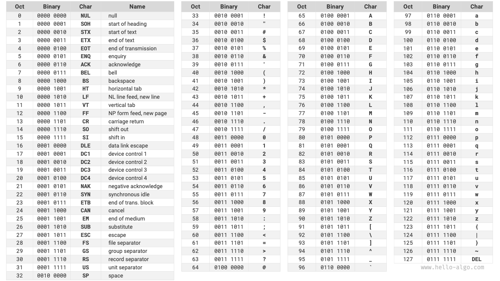
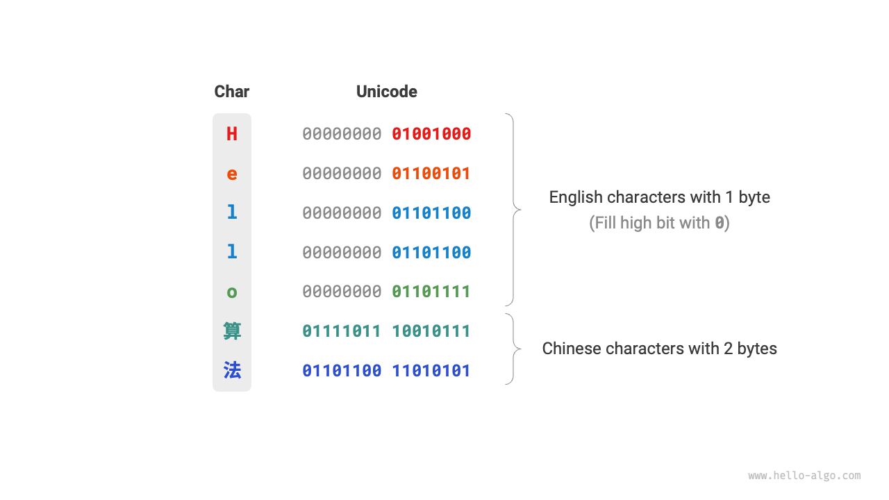
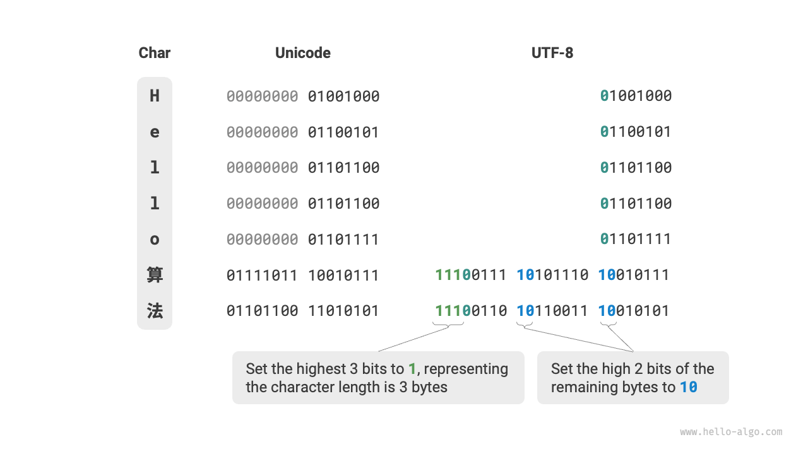

# 3.4 &nbsp; Character Encoding *

In computers, all data is stored in binary form, and the character `char` is no exception. To represent characters, we need to establish a "character set" that defines a one-to-one correspondence between each character and binary numbers. With a character set, computers can convert binary numbers to characters by looking up a table.

## 3.4.1 &nbsp; ASCII Character Set

The "ASCII code" is one of the earliest character sets, officially known as the American Standard Code for Information Interchange. It uses 7 binary digits (the lower 7 bits of a byte) to represent a character, allowing for a maximum of 128 different characters. As shown in the Figure 3-6 , ASCII includes uppercase and lowercase English letters, numbers 0 ~ 9, some punctuation marks, and some control characters (such as newline and tab).

{ class="animation-figure" }

 Figure 3-6 &nbsp; ASCII Code 

However, **ASCII can only represent English characters**. With the globalization of computers, a character set called "EASCII" was developed to represent more languages. It expands on the 7-bit basis of ASCII to 8 bits, enabling the representation of 256 different characters.

Globally, a series of EASCII character sets for different regions emerged. The first 128 characters of these sets are uniformly ASCII, while the remaining 128 characters are defined differently to cater to various language requirements.

## 3.4.2 &nbsp; GBK Character Set

Later, it was found that **EASCII still could not meet the character requirements of many languages**. For instance, there are nearly a hundred thousand Chinese characters, with several thousand used in everyday life. In 1980, China's National Standards Bureau released the "GB2312" character set, which included 6763 Chinese characters, essentially meeting the computer processing needs for Chinese.

However, GB2312 could not handle some rare and traditional characters. The "GBK" character set, an expansion of GB2312, includes a total of 21886 Chinese characters. In the GBK encoding scheme, ASCII characters are represented with one byte, while Chinese characters use two bytes.

## 3.4.3 &nbsp; Unicode Character Set

With the rapid development of computer technology and a plethora of character sets and encoding standards, numerous problems arose. On one hand, these character sets generally only defined characters for specific languages and could not function properly in multilingual environments. On the other hand, the existence of multiple character set standards for the same language caused garbled text when information was exchanged between computers using different encoding standards.

Researchers of that era thought: **What if we introduced a comprehensive character set that included all languages and symbols worldwide, wouldn't that solve the problems of cross-language environments and garbled text?** Driven by this idea, the extensive character set, Unicode, was born.

The Chinese name for "Unicode" is "统一码" (Unified Code), theoretically capable of accommodating over a million characters. It aims to incorporate characters from all over the world into a single set, providing a universal character set for processing and displaying various languages and reducing the issues of garbled text due to different encoding standards.

Since its release in 1991, Unicode has continually expanded to include new languages and characters. As of September 2022, Unicode contains 149,186 characters, including characters, symbols, and even emojis from various languages. In the vast Unicode character set, commonly used characters occupy 2 bytes, while some rare characters take up 3 or even 4 bytes.

Unicode is a universal character set that assigns a number (called a "code point") to each character, **but it does not specify how these character code points should be stored in a computer**. One might ask: When Unicode code points of varying lengths appear in a text, how does the system parse the characters? For example, given a 2-byte code, how does the system determine if it represents a single 2-byte character or two 1-byte characters?

A straightforward solution to this problem is to store all characters as equal-length encodings. As shown in the Figure 3-7 , each character in "Hello" occupies 1 byte, while each character in "算法" (algorithm) occupies 2 bytes. We could encode all characters in "Hello 算法" as 2 bytes by padding the higher bits with zeros. This way, the system can parse a character every 2 bytes, recovering the content of the phrase.

{ class="animation-figure" }

 Figure 3-7 &nbsp; Unicode Encoding Example 

However, as ASCII has shown us, encoding English only requires 1 byte. Using the above approach would double the space occupied by English text compared to ASCII encoding, which is a waste of memory space. Therefore, a more efficient Unicode encoding method is needed.

## 3.4.4 &nbsp; UTF-8 Encoding

Currently, UTF-8 has become the most widely used Unicode encoding method internationally. **It is a variable-length encoding**, using 1 to 4 bytes to represent a character, depending on the complexity of the character. ASCII characters need only 1 byte, Latin and Greek letters require 2 bytes, commonly used Chinese characters need 3 bytes, and some other rare characters need 4 bytes.

The encoding rules for UTF-8 are not complex and can be divided into two cases:

- For 1-byte characters, set the highest bit to $0$, and the remaining 7 bits to the Unicode code point. Notably, ASCII characters occupy the first 128 code points in the Unicode set. This means that **UTF-8 encoding is backward compatible with ASCII**. This implies that UTF-8 can be used to parse ancient ASCII text.
- For characters of length $n$ bytes (where $n > 1$), set the highest $n$ bits of the first byte to $1$, and the $(n + 1)^{\text{th}}$ bit to $0$; starting from the second byte, set the highest 2 bits of each byte to $10$; the rest of the bits are used to fill the Unicode code point.

The Figure 3-8  shows the UTF-8 encoding for "Hello算法". It can be observed that since the highest $n$ bits are set to $1$, the system can determine the length of the character as $n$ by counting the number of highest bits set to $1$.

But why set the highest 2 bits of the remaining bytes to $10$? Actually, this $10$ serves as a kind of checksum. If the system starts parsing text from an incorrect byte, the $10$ at the beginning of the byte can help the system quickly detect an anomaly.

The reason for using $10$ as a checksum is that, under UTF-8 encoding rules, it's impossible for the highest two bits of a character to be $10$. This can be proven by contradiction: If the highest two bits of a character are $10$, it indicates that the character's length is $1$, corresponding to ASCII. However, the highest bit of an ASCII character should be $0$, contradicting the assumption.

{ class="animation-figure" }

 Figure 3-8 &nbsp; UTF-8 Encoding Example 

Apart from UTF-8, other common encoding methods include:

- **UTF-16 Encoding**: Uses 2 or 4 bytes to represent a character. All ASCII characters and commonly used non-English characters are represented with 2 bytes; a few characters require 4 bytes. For 2-byte characters, the UTF-16 encoding is equal to the Unicode code point.
- **UTF-32 Encoding**: Every character uses 4 bytes. This means UTF-32 occupies more space than UTF-8 and UTF-16, especially for texts with a high proportion of ASCII characters.

From the perspective of storage space, UTF-8 is highly efficient for representing English characters, requiring only 1 byte; UTF-16 might be more efficient for encoding some non-English characters (like Chinese), as it requires only 2 bytes, while UTF-8 might need 3 bytes.

From a compatibility standpoint, UTF-8 is the most versatile, with many tools and libraries supporting UTF-8 as a priority.

## 3.4.5 &nbsp; Character Encoding in Programming Languages

In many classic programming languages, strings during program execution are encoded using fixed-length encodings like UTF-16 or UTF-32. This allows strings to be treated as arrays, offering several advantages:

- **Random Access**: Strings encoded in UTF-16 can be accessed randomly with ease. For UTF-8, which is a variable-length encoding, locating the $i^{th}$ character requires traversing the string from the start to the $i^{th}$ position, taking $O(n)$ time.
- **Character Counting**: Similar to random access, counting the number of characters in a UTF-16 encoded string is an $O(1)$ operation. However, counting characters in a UTF-8 encoded string requires traversing the entire string.
- **String Operations**: Many string operations like splitting, concatenating, inserting, and deleting are easier on UTF-16 encoded strings. These operations generally require additional computation on UTF-8 encoded strings to ensure the validity of the UTF-8 encoding.

The design of character encoding schemes in programming languages is an interesting topic involving various factors:

- Java’s `String` type uses UTF-16 encoding, with each character occupying 2 bytes. This was based on the initial belief that 16 bits were sufficient to represent all possible characters, a judgment later proven incorrect. As the Unicode standard expanded beyond 16 bits, characters in Java may now be represented by a pair of 16-bit values, known as “surrogate pairs.”
- JavaScript and TypeScript use UTF-16 encoding for similar reasons as Java. When JavaScript was first introduced by Netscape in 1995, Unicode was still in its early stages, and 16-bit encoding was sufficient to represent all Unicode characters.
- C# uses UTF-16 encoding, largely because the .NET platform, designed by Microsoft, and many Microsoft technologies, including the Windows operating system, extensively use UTF-16 encoding.

Due to the underestimation of character counts, these languages had to resort to using "surrogate pairs" to represent Unicode characters exceeding 16 bits. This approach has its drawbacks: strings containing surrogate pairs may have characters occupying 2 or 4 bytes, losing the advantage of fixed-length encoding, and handling surrogate pairs adds to the complexity and debugging difficulty of programming.

Owing to these reasons, some programming languages have adopted different encoding schemes:

- Python’s `str` type uses Unicode encoding with a flexible representation where the storage length of characters depends on the largest Unicode code point in the string. If all characters are ASCII, each character occupies 1 byte; if characters exceed ASCII but are within the Basic Multilingual Plane (BMP), each occupies 2 bytes; if characters exceed the BMP, each occupies 4 bytes.
- Go’s `string` type internally uses UTF-8 encoding. Go also provides the `rune` type for representing individual Unicode code points.
- Rust’s `str` and `String` types use UTF-8 encoding internally. Rust also offers the `char` type for individual Unicode code points.

It’s important to note that the above discussion pertains to how strings are stored in programming languages, **which is a different issue from how strings are stored in files or transmitted over networks**. For file storage or network transmission, strings are usually encoded in UTF-8 format for optimal compatibility and space efficiency.
