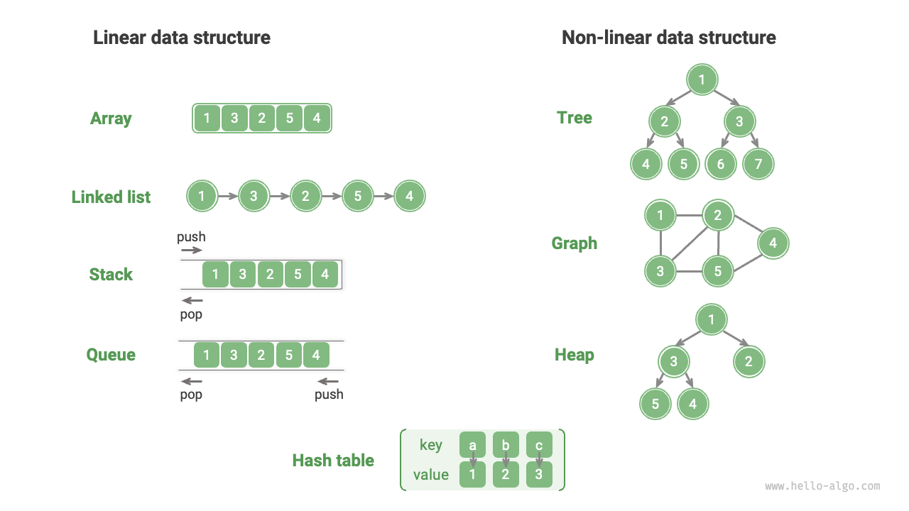
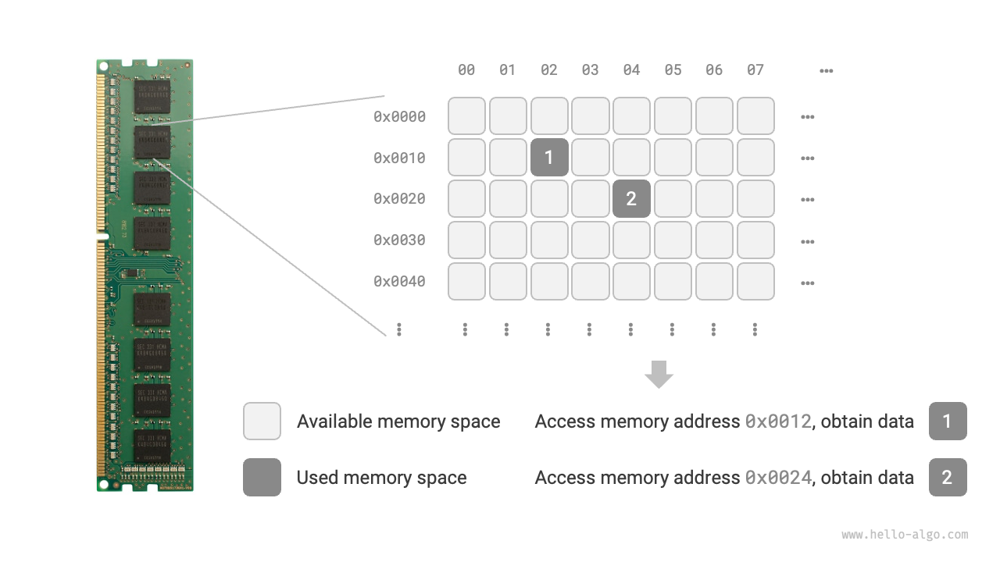
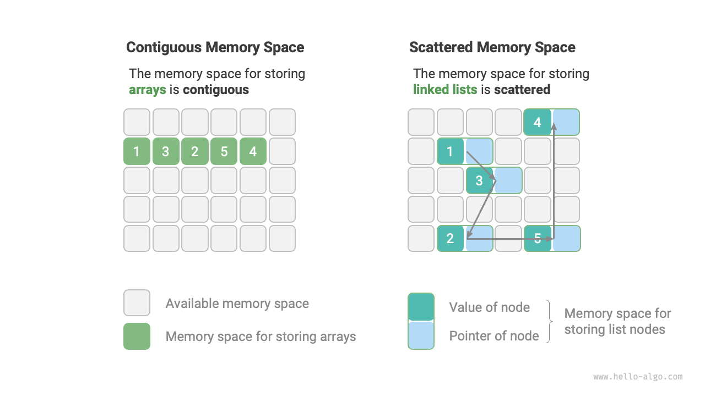

# Classification Of Data Structures

Common data structures include arrays, linked lists, stacks, queues, hash tables, trees, heaps, and graphs, which can be divided into two categories: "logical structure" and "physical structure".

## Logical Structures: Linear And Non-linear

**Logical structures reveal logical relationships between data elements**. In arrays and linked lists, data are arranged in a specific sequence, demonstrating the linear relationship between data; while in trees, data are arranged hierarchically from the top down, showing the derived relationship between "ancestors" and "descendants"; and graphs are composed of nodes and edges, reflecting the intricate network relationship.

As shown in the figure below, logical structures can further be divided into "linear data structure" and "non-linear data structure". Linear data structures are more intuitive, meaning that the data are arranged linearly in terms of logical relationships; non-linear data structures, on the other hand, are arranged non-linearly.

- **Linear data structures**: arrays, linked lists, stacks, queues, hash tables.
- **Nonlinear data structures**: trees, heaps, graphs, hash tables.

Non-linear data structures can be further divided into tree and graph structures.

- **Linear structures**: arrays, linked lists, queues, stacks, hash tables, with one-to-one sequential relationship between elements.
- **Tree structure**: tree, heap, hash table, with one-to-many relationship between elements.
- **Graph**: graph with many-to-many relationship between elements.

## Physical Structure: Continuous vs. Dispersed

**During the execution of an algorithm, the data being processed is stored in memory**. The figure below shows a computer memory module where each black square represents a memory space. We can visualize memory as a vast Excel sheet in which each cell can store data of a specific size.

**The system accesses the data at the target location by means of a memory address**. As shown in the figure below, the computer assigns a unique identifier to each cell in the table according to specific rules, ensuring that each memory space has a unique memory address. With these addresses, the program can access the data stored in memory.

!!! Tip

    It is worth noting that comparing memory to an Excel sheet is a simplified analogy. The actual memory working mechanism is more complex, involving concepts such as address, space, memory management, cache mechanism, virtual and physical memory.

Memory is a shared resource for all programs. When a block of memory is occupied by one program, it cannot be simultaneously used by other programs. **Therefore, considering memory resources is crucial in designing data structures and algorithms**. For instance, the algorithm's peak memory usage should not exceed the remaining free memory of the system; if there is a lack of contiguous memory blocks,  then the data structure chosen must be able to be stored in non-contiguous memory blocks.

As illustrated in the figure below, **the physical structure reflects the way data is stored in computer memory and it can be divided into contiguous space storage (arrays) and non-contiguous space storage (linked lists)**. This physical structure determines how data is accessed, updated, added, deleted, etc. Logical and physical structure complement each other in terms of time efficiency and space efficiency.

**It is worth noting that all data structures are implemented based on arrays, linked lists, or a combination of both**. For example, stacks and queues can be implemented using both arrays and linked lists; and implementations of hash tables may involve both arrays and linked lists.

- **Array-based structures**: stacks, queues, hash tables, trees, heaps, graphs, matrices, tensors (arrays of dimension $\geq 3$), and more.
- **Linked list-based structures**: stacks, queues, hash tables, trees, heaps, graphs, etc.

Data structures based on arrays are also known as "static data structures", which means that such structures' length remains constant after initialization. In contrast, data structures based on linked lists are called "dynamic data structures", meaning that their length can be adjusted during program execution after initialization.

!!! Tip

    If you find it challenging to comprehend the physical structure, it is recommended that you read the next chapter, "Arrays and Linked Lists," before revisiting this section.
