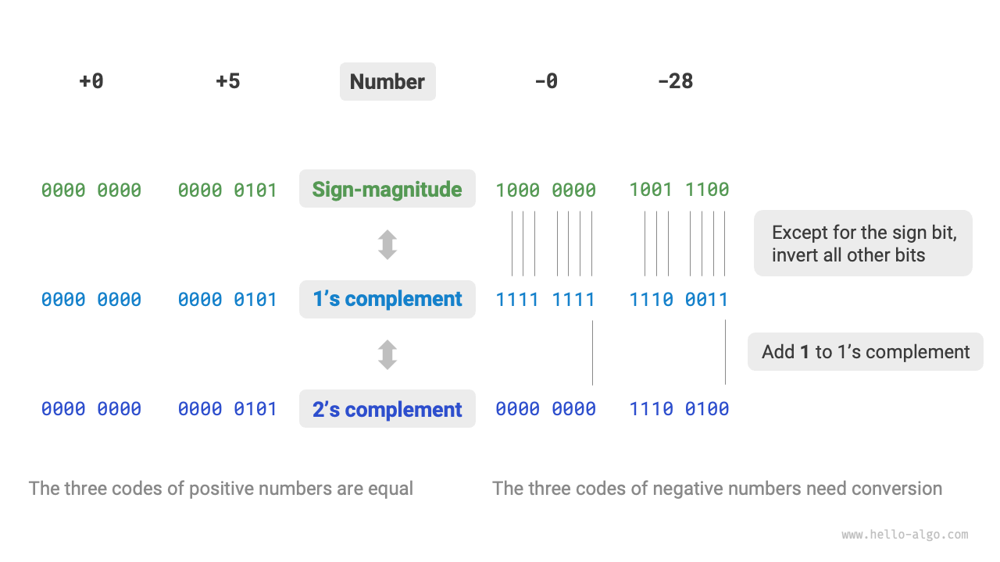
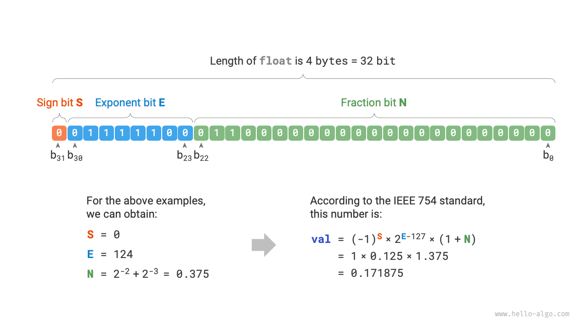

# Numeric Code *

!!! note

    Throughout the book, the chapters with the * symbol in the title are optional. If you have limited time or find it difficult to understand, you can skip them and then attack them individually when you have finished the required chapters.

## Integer Encoding

In the table in the previous section, we found that all integer types are capable of representing negative numbers one more than positive numbers, e.g., the range of values for `byte` is $[-128, 127]$ . This phenomenon is rather counter-intuitive, and its intrinsic cause involves knowledge of true forms, inverse codes, and 2's complement codes.

First of all, **it should be noted that numbers are stored in the computer as in the form of 2's complement code**. Before analyzing the reasons for this, we first give the definitions of the three.

- **True form**: we consider the highest bit of the binary representation of a number as the sign bit, where $0$ denotes a positive number, $1$ denotes a negative number, and the rest of the bits denote the value of the number.
- **Inverse Code**: the inverse code of a positive number is the same as its true form, and the inverse code of a negative number is the inverse of all bits of its true form except the sign bit.
- **Complement code**: The complement code of a positive number is the same as its true form, and the complement code of a negative number is its inverse code plus $1$ .

The figure below shows how to convert between true form, 1's complement code and 2's complement code.

Although "true form" is the most intuitive, it has some limitations. On the one hand, **the true form of negative numbers cannot be used directly in arithmetic**. For example, if you calculate $1 + (-2)$ in true form, the result will be $-3$, which is obviously incorrect.

$$
\begin{aligned}
& 1 + (-2) \newline
& \rightarrow 0000 \; 0001 + 1000 \; 0010 \newline
& = 1000 \; 0011 \newline
& \rightarrow -3
\end{aligned}
$$

In order to solve this problem, computers have introduced "1's complement code". If we first convert the original code to the inverse code, and calculate $1 + (-2)$ under the inverse code, and finally convert the result from the inverse code back to the original code, then we can get the true form $-1$.

$$
\begin{aligned}
& 1 + (-2) \newline
& \rightarrow 0000 \; 0001 \; \text{(true form)} + 1000 \; 0010 \; \text{(true form)} \newline
& = 0000 \; 0001 \; \text{(complement code)} + 1111 \; 1101 \; \text{(complement code)} \newline
& = 1111 \; 1110 \; \text{(1's complement code)} \newline
& = 1000 \; 0001 \; \text{(true form)} \newline
& \rightarrow -1
\end{aligned}
$$

On the other hand, **the true form of the number zero has two representations $0$ and $-0$**. This means that the number zero corresponds to two different binary codes, and its may bring ambiguity. For example, in conditional judgment, if there is no distinction between positive and negative zeros, it may lead to wrong judgment results. If we want to deal with positive and negative zero ambiguities, we need to introduce additional judgment operations, which may reduce the computational efficiency of the computer.

$$
\begin{aligned}
+0 & \rightarrow 0000 \; 0000 \newline
-0 & \rightarrow 1000 \; 0000
\end{aligned}
$$

Like the true form, the inverse code also has the problem of positive and negative zero ambiguity, so the computer further introduces the "complement code 2's complement code". Let's first observe the conversion process of negative-zero true form, 1's complement code, and 2's complement code:

$$
\begin{aligned}
-0 \rightarrow \; & 1000 \; 0000 \; \text{(true form)} \newline
= \; & 1111 \; 1111 \; \text{(complement code)} \newline
= 1 \; & 0000 \; 0000 \; \text{(complement code)} \newline
\end{aligned}
$$

Adding $1$ to the 1's complement code of negative zeros results in a rounding, but the length of the `byte` type is only 8 bits, so the $1$ that overflows to bit 9 is discarded. In other words, **the complement code for negative zeros is $0000 \; 0000$, which is the same as the complement code for positive zeros**. This means that there is only one zero in the 2's complement code representation, and the positive and negative zero ambiguity is thus resolved.

There is one last puzzle: the range of the `byte` type is $[-128, 127]$, how do we get the extra negative number $-128$? We notice that all integers in the range $[-127, +127]$ have their true form, 1's complement code and 2's complement code, and the true form and 2's complement code can be converted to each other.

However, **complement code $1000 \; 0000$ is an exception which does not have a corresponding true form code**. According to the conversion method, we get the true form of this complement code as $0000 \; 0000$ . This is clearly a contradiction, since that true form represents the number $0$ and its 2's complement code should be itself. The computer specifies that this particular 2's complement code $1000 \; 0000$ represents $-128$ . In fact, $(-1) + (-127)$ under the 2's complement code results in $-128$ .

$$
\begin{aligned}
& (-127) + (-1) \newline
& \rightarrow 1111 \; 1111 \; \text{(true form)} + 1000 \; 0001 \; \text{(true form)} \newline
& = 1000 \; 0000 \; \text{(complement code)} + 1111 \; 1110 \; \text{(complement code)} \newline
& = 1000 \; 0001 \; \text{(complement code)} + 1111 \; 1111 \; \text{(complement code)} \newline
& = 1000 \; 0000 \; \text{(complement code)} \newline
& \rightarrow -128
\end{aligned}
$$

You may have noticed that all of the above calculations are additive operations. This implies an important fact:**The hardware circuits inside computers are designed primarily based on addition operations**. This is because addition operations are simpler to implement in hardware, easier to parallelize, and faster to perform compared to other operations such as multiplication, division, and subtraction.

Note that this does not mean that computers can only do addition. **By combining addition with some basic logical operations, computers are able to perform a variety of other mathematical operations**. For example, calculating subtraction $a - b$ can be converted to calculating addition $a + (-b)$; calculating multiplication and division can be converted to calculating multiple additions or subtractions.

We can now summarize the reasons why computers use complement codes: based on the 2's complement code representation, computers can use the same circuits and operations to handle addition of positive and negative numbers, do not need to design special hardware circuits to handle subtraction, and do not have to deal specifically with the ambiguity of positive and negative zeros. This greatly simplifies hardware design and improves arithmetic efficiency.

The design of 2's complement code is very subtle, because of space relations we will introduce here, we recommend interested readers to further depth.

## Floating Point Encoding

You may notice that `int` and `float` are both 4 bytes long, but why is the range of `float` much larger than that of `int`? This is very counter-intuitive, because `float` needs to represent decimals, so its range should be smaller.

In fact, **this is because floating-point numbers `float` use a different representation**. Remember that a 32-bit length binary number is:

$$
b_{31} b_{30} b_{29} \ldots b_2 b_1 b_0
$$

According to the IEEE 754 standard, a 32-bit length `float` consists of the following three parts.

- Symbol bit $\mathrm{S}$ : Occupies 1 bit and corresponds to $b_{31}$.
- Exponential bits $\mathrm{E}$ : occupies 8 bits, corresponding to $b_{30} b_{29} \ldots b_{23}$.
- Fractional bits $\mathrm{N}$ : occupies 23 bits, corresponding to $b_{22} b_{21} \ldots b_0$.

Calculates the value corresponding to a binary number `float`:

$$
\text {val} = (-1)^{b_{31}} \times 2^{\left(b_{30} b_{29} \ldots b_{23}\right)_2-127} \times\left(1 . b_{22} b_{21} \ldots b_0\right)_2
$$

Converts to a formula in decimal:

$$
\text {val}=(-1)^{\mathrm{S}} \times 2^{\mathrm{E} -127} \times (1 + \mathrm{N})
$$

The range of values of each of these:

$$
\begin{aligned}
\mathrm{S} \in & \{ 0, 1\}, \quad \mathrm{E} \in \{ 1, 2, \dots, 254 \} \newline
(1 + \mathrm{N}) = & (1 + \sum_{i=1}^{23} b_{23-i} 2^{-i}) \subset [1, 2 - 2^{-23}]
\end{aligned}
$$

Looking at the figure above, given a sample data $\mathrm{S} = 0$ , $\mathrm{E} = 124$ , $\mathrm{N} = 2^{-2} + 2^{-3} = 0.375$ , we have:

$$
\text { val } = (-1)^0 \times 2^{124 - 127} \times (1 + 0.375) = 0.171875
$$

Now we can answer the original question:**The representation of `float` contains exponent bits, resulting in a much larger range of values than `int`**. Based on the above calculations, the largest positive number that can be represented by `float` is $2^{254 - 127} \times (2 - 2^{-23}) \approx 3.4 \times 10^{38}$ , and switching the sign bit will give us the smallest negative number.

**Although floating-point numbers `float` extend the range of values, they have the side effect of sacrificing precision**. The integer type `int` dedicates all 32 bits to representing numbers, which are evenly distributed; whereas, the larger the value of a floating-point number `float`, the greater the difference between two neighboring numbers tends to be, due to the exponent bit.

As shown in the table below, the exponent bits $E = 0$ and $E = 255$ have special meanings and **are used to denote zero, infinity, $\mathrm{NaN}$ and so on**.

 Table <id> &nbsp; Meaning of Index Bits 

| Exponential E      | Score $\mathrm{N} = 0$ | Score $\mathrm{N} \ne 0$ | Calculation formula                                                    |
| ------------------ | ---------------------- | ------------------------ | ---------------------------------------------------------------------- |
| $0$                | $\pm 0$                | Subregular number        | $(-1)^{\mathrm{S}} \times 2^{-126} \times (0.\mathrm{N})$              |
| $1, 2, \dots, 254$ | Regular number         | Regular number           | $(-1)^{\mathrm{S}} \times 2^{(\mathrm{E} -127)} \times (1.\mathrm{N})$ |
| $255$              | $\pm \infty$           | $\mathrm{NaN}$           |                                                                        |

It is worth stating that the subregular numbers significantly improve the precision of floating point numbers. The smallest positive regular number is $2^{-126}$ and the smallest positive subregular number is $2^{-126} \times 2^{-23}$.

Double-precision `double` also uses a similar representation to `float`, which will not be repeated here.
