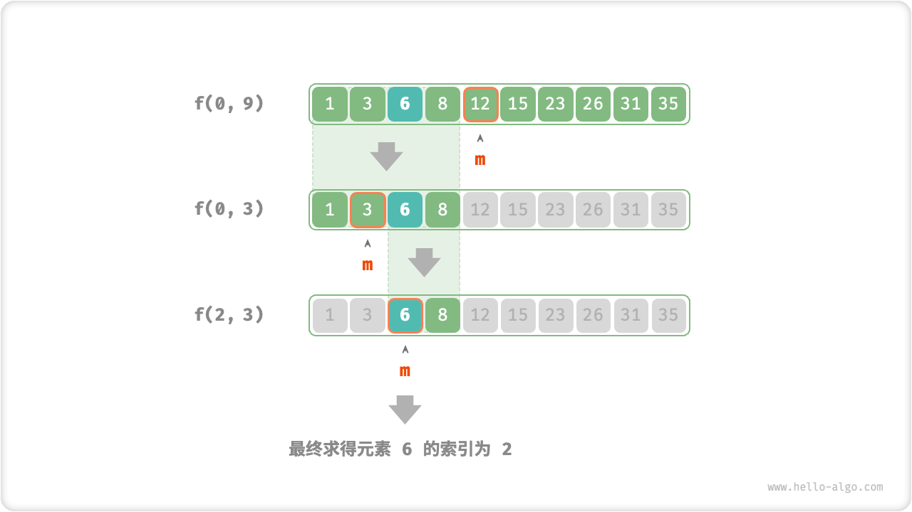

# Divide And Conquer Search Strategies

As we have already learned, searching algorithms are divided into two main categories.

- **Brute-force Search**: it is implemented by traversing the data structure with a time complexity of $O(n)$ .
- **Adaptive Search**: it can achieve a time complexity of $O(\log n)$ or even $O(1)$ by exploiting the characteristic data organization or a priori information.

In fact, **searching algorithms with a time complexity of $O(\log n)$ are usually implemented based on divide and conquer strategies**, such as binary lookup and trees.

- Each step of the binary search breaks the problem (searching for the target element in the array) into a smaller problem (searching for the target element in one half of the array), and the process continues until the array is empty or the target element is found.
- Trees are representative of divide and conquer relationships, and in data structures such as binary search trees, AVL trees, and heaps, the time complexity of various operations is $O(\log n)$ .

The divide and conquer strategy for binary search is shown below.

- **Problems can be decomposed**: binary search recursively decomposes the original problem (searching in an array) into sub-problems (searching in one half of the array), this is done by comparing the middle element with the target element.
- **Subproblems are independent**: in binary search, only one subproblem is processed in each round and it is not affected by another subproblem.
- **Solutions of subproblems need not be merged**: binary search aims to find a specific element, so there is no need to merge the solutions of subproblems. When the subproblem is solved, the original problem is solved at the same time.

Partitioning can improve search efficiency, essentially because brute-force search can only eliminate one option per round, **while partitioned search can eliminate half of the options per round**.

### Realize The Dichotomy Based On The Divide And Conquer

In the previous sections, binary search was implemented based on recursion (iteration). Now we implement it based on divide and conquer (recursion).

!!! question

    Given an ordered array `nums` of length $n$ and all elements in the array are unique, find the element `target`.

From the divide and conquer perspective, we denote the subproblem corresponding to the search interval $[i, j]$ as $f(i, j)$ .

Starting from the original problem $f(0, n-1)$, perform a binary search by the following steps.

1. Calculate the midpoint $m$ of the search interval $[i, j]$ and exclude half of the search interval based on it.
2. The recursion solves the subproblem that halves in size, possibly $f(i, m-1)$ or $f(m+1, j)$ .
3. Loop through steps `1.` and `2.` until `target` is found or the interval is empty.

The figure below shows the process of dividing and conquering a binary search for the element $6$ in an array.



In the implementation code, we declare a recursion function `dfs()` to solve the problem $f(i, j)$ .

```src
[file]{binary_search_recur}-[class]{}-[func]{binary_search}
```
