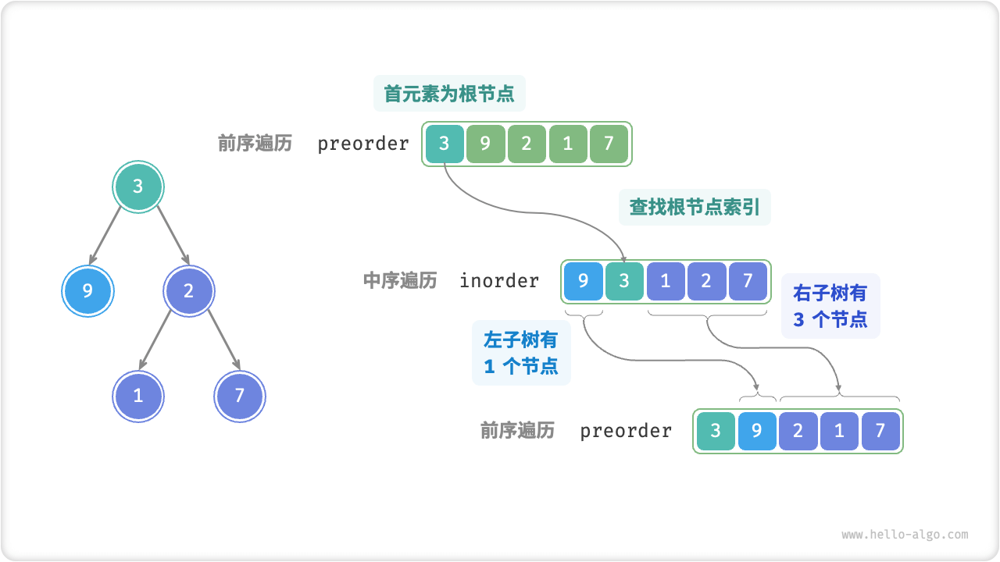
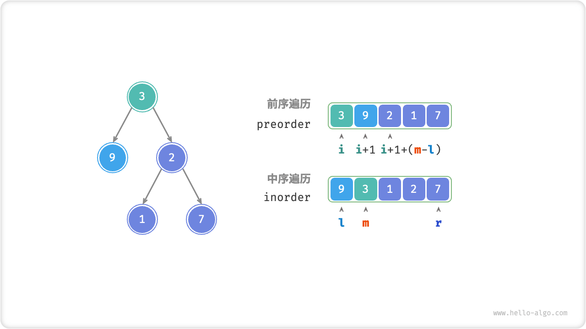
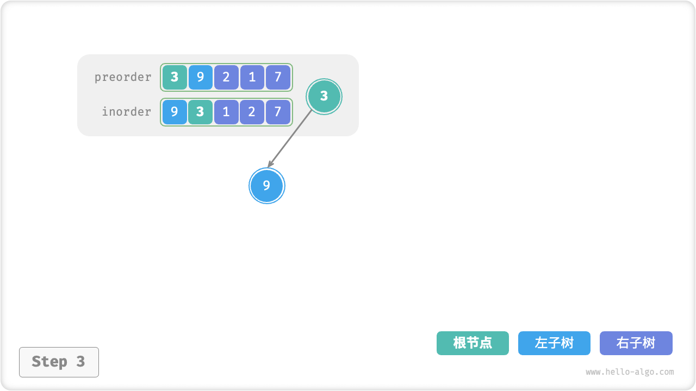
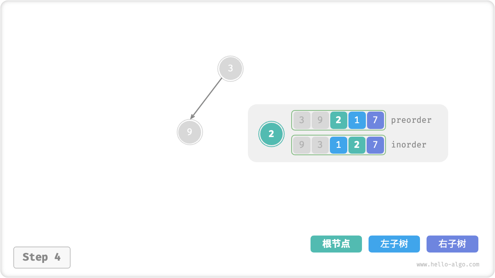
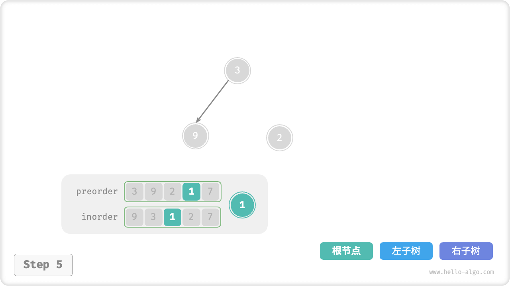
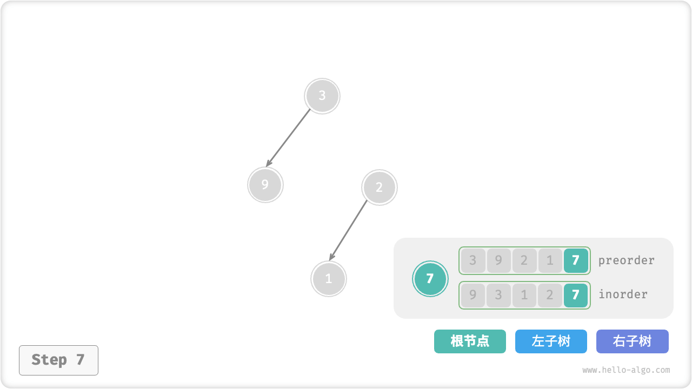
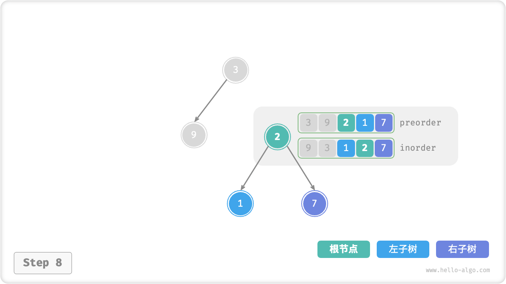

# Constructing Binary Tree Problems

!!! question

    Given a preorder traversal `preorder` and a midorder traversal `inorder` of a binary tree, construct the binary tree from it and return the root node of the binary tree. Assume that there are no nodes with duplicate values in the binary tree.


### Determine If It is A Divide And Conquer Problem

The original problem is defined as constructing a binary tree from `preorder` and `inorder` and its a typical divide and conquer problem.

- The **problem can be decomposed**: cutting from the perspective of partitioning, we can divide the original problem into two subproblems: constructing the left subtree, constructing the right subtree, plus one step of operation: initializing the root node. And for each subtree (subproblem), we can still reuse the above division method to divide it into smaller subtrees (subproblems) until it terminates when it reaches the smallest subproblem (empty subtree).
- The **subproblems are independent**: the left subtree and the right subtree are independent of each other and there is no intersection between them. When constructing the left subtree, we only need to focus on the parts of the middle-order traversal and the preorder traversal that correspond to the left subtree. The same is true for the right subtree.
- **Solutions of subproblems can be merged**: once the left-child node and the right subtree (solutions of the subproblems) have been obtained, we can link them to the root node to obtain the solution of the original problem.

### How To Divide A Subtree

Based on the above analysis, this problem can be solved using partitioning, **but how to divide and conquer the left subtree and right subtree by traversing `preorder` and `inorder` in the preorder**?

By definition, both `preorder` and `inorder` can be divided into three parts.

- Pre-order traversal: `[ root node | left-child node | right subtree ]` , e.g. the tree in the figure above corresponds to `[ 3 | 9 | 2 1 7 ]` .
- Medium order traversal: `[ left-child node | root node | right subtree ]` , e.g. the tree in the figure above corresponds to `[ 9 | 3 | 1 2 7 ]` .

Taking the data in the figure above as an example, we can get the division result by the steps shown in the figure below.

1. The first element 3 of the preorder traversal is the value of the root node.
2. Find the index of root node 3 in `inorder`, and use this index to divide `inorder` into `[ 9 | 3 ｜ 1 2 7 ]`.
3. According to the result of `inorder`, it is easy to get the number of left-child nodes and right-child nodes are 1 and 3 respectively, so that `preorder` can be classified as `[ 3 | 9 | 2 1 7 ]`.



### Describe Subtree Intervals Based On Variables

According to the above division method, **we have got the index intervals of the root node, the left subtree, and the right subtree in `preorder` and `inorder`**. And to describe these index intervals, we need to take the help of several pointer variables.

- Notate the index of the root node of the current tree node in `preorder` as $i$ .
- Notate the index of the root node of the current tree in `inorder` as $m$ .
- Notate the index interval of the current tree in `inorder` as $[l, r]$ .

As shown in the table below, the above variables can be used to indicate the index of the root node in `preorder` and the index interval of the subtree in `inorder`.

<p align="center"> Table <id> &nbsp; Indexes of root nodes and subtrees in preorder and midorder traversals </p>

|               | index of root node in `preorder` | index interval of subtree in `inorder` |
| ------------- | -------------------------------- | -------------------------------------- |
| Current Tree  | $i$                              | $[l, r]$                               |
| left subtree  | $i + 1$                          | $[l, m-1]$                             |
| right subtree | $i + 1 + (m - l)$                | $[m+1, r]$                             |

Please note that $(m-l)$ in the index of the root node of the right-child node means "the number of nodes in the left subtree", and it is recommended to understand it with the figure below.



### Code Implementation

To improve the efficiency of the query $m$, we resort to a hash table `hmap` to store the mapping of the elements of the array `inorder` to the indexes.

```src
[file]{build_tree}-[class]{}-[func]{build_tree}
```

The figure below illustrates the recursion process of building a binary tree, where nodes are built in a downward "recursion" process and edges (i.e., references) are built in an upward "recursion" process.

=== "<1>"
    

=== "<2>"
    

=== "<3>"
    

=== "<4>"
    

=== "<5>"
    

=== "<6>"
    

=== "<7>"
    

=== "<8>"
    

=== "<9>"
    

The result of the division of the preorder traversal `preorder` and the middle order traversal `inorder` within each recursion function is shown in the figure below.


Let the number of nodes in the tree be $n$ , initializing each node (executing a recursion function `dfs()` ) uses $O(1)$ time. **Therefore the overall time complexity is $O(n)$** .

A hash table stores the mapping of `inorder` elements to indexes with a space complexity of $O(n)$ . In the worst case, i.e., when the binary tree degenerates to a linked list, the recursion depth reaches $n$ and uses $O(n)$ of stack frame space. **Thus the overall space complexity is $O(n)$** .
