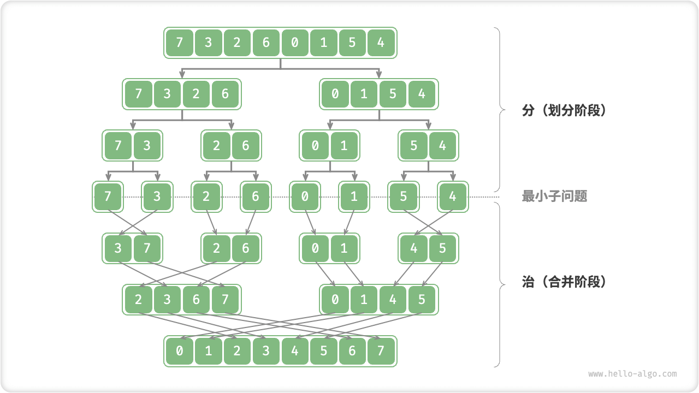
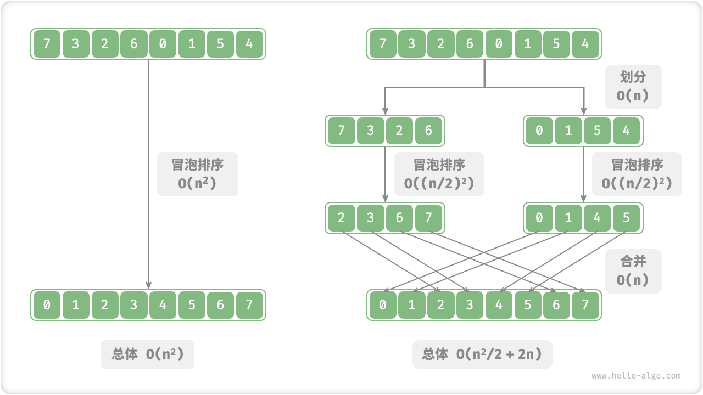
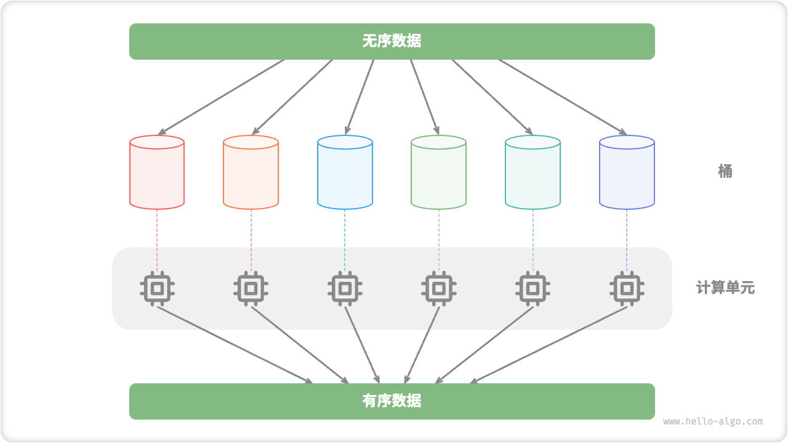

# Divide And Conquer Algorithms

"Divide and conquer" is a very important and common algorithmic strategy. Divide and conquer is usually implemented based on recursion and consists of two steps: "divide" and "conquer".

1. **Division (dividing stage)**: recursionally decomposes the original problem into two or more subproblems until it terminates when it reaches the smallest subproblem.
2. The **cure (merging phase)**: Starting from the smallest subproblem with a known solution, the solutions of the subproblems are merged from the bottom to the top to construct a solution to the original problem.

As shown in the figure below, "merge sort" is one of the typical applications of divide and conquer strategy.

1. **Divide**: recursively divide the original array (original problem) into two subarrays (subproblems) until only one element of the subarray remains (smallest subproblem).
2. **cure**: merge ordered subarrays (solutions to sub-problems) from bottom to top to obtain an ordered original array (solutions to the original problem).

## How To Determine The Divide And Conquer Problem

Whether a problem is suitable for solution using divide and conquer can usually be judged by referring to the following bases.

1. **Problems can be decomposed**: the original problem can be decomposed into smaller, similar sub-problems, as well as being able to be divided recursively in the same way.
2. **Subproblems are independent**: there is no overlap between subproblems, no dependence on each other, and can be solved independently.
3. **The solutions of subproblems can be combined**: the solution of the original problem is obtained by combining the solutions of the subproblems.

Clearly, merge sort is satisfying the above three bases of judgment.

1. The **problem can be decomposed by**: recursively dividing the array (original problem) into two subarrays (subproblems).
2. **Subproblems are independent**: each subarray can be sorted independently (subproblems can be solved independently).
3. **Solutions of subproblems can be merged**: two ordered subarrays (solutions of subproblems) can be merged into one ordered array (solutions of the original problem).

## Enhancing Efficiency Through Divide And Conquer

Not only does divide and conquer effectively solve algorithmic problems, **it often leads to an increase in algorithmic efficiency**. In sorting algorithms, quick sort, merge sort, and heap sort are faster compared to selection, bubble, and insertion sort because they apply a partition strategy.

So, we can't help but ask:**Why does dividing and conquering improve algorithm efficiency, and what is its underlying logic**? In other words, why are the steps of decomposing a large problem into multiple subproblems, solving the subproblems, and combining the solutions of the subproblems into the solution of the original problem more efficient than solving the original problem directly? This question can be discussed in terms of the number of operations and parallel computation.

### Operation Number Optimization

Take "bubble sort" for example, it takes $O(n^2)$ time to process an array of length $n$. Assuming we divide the array into two subarrays from the midpoint as shown in the figure below, it takes $O(n)$ time to divide, $O((n / 2)^2)$ time to sort each subarray, and $O(n)$ time to merge the two subarrays, with an overall time complexity of:

$$
O(n + (\frac{n}{2})^2 \times 2 + n) = O(\frac{n^2}{2} + 2n)
$$

Next, we compute the following inequality, whose left and right edges are the total number of operations before and after division, respectively:

$$
\begin{aligned}
n^2 & > \frac{n^2}{2} + 2n \newline
n^2 - \frac{n^2}{2} - 2n & > 0 \newline
n(n - 4) & > 0
\end{aligned}
$$

**This means that when $n > 4$, the number of operations after division is smaller and the sorting should be more efficient**. Note that the time complexity after division is still of squared order $O(n^2)$ , just that the constant term in the complexity becomes smaller.

Thinking further, **what if we keep dividing the subarray into two more subarrays from the midpoint until there is only one element left in the subarray**? This idea is actually a "merge sort" with a time complexity of $O(n \log n)$ .

On second thought, **what if we set a few more division points and divide the original array into $k$ subarrays evenly**? This situation is very similar to "bucket sort", which is ideal for sorting large amounts of data, and has a theoretical time complexity of $O(n + k)$ .

### Parallel Computing Optimization

We know that the subproblems generated by partitioning are independent of each other, **and thus can usually be solved in parallel**. In other words, divide and conquer not only reduces the time complexity of the algorithm, **but also facilitates the parallel optimization of the operating system**.

Parallel optimization is particularly effective in multi-core or multi-processor environments, as the system can process multiple sub-problems at the same time, making fuller use of computational resources and thus significantly reducing overall runtime.

For example, in the "bucket sort" shown in the figure below, we will distribute the huge amount of data evenly into each bucket, then the sorting task of all the buckets can be distributed to each computing unit, and then merge the results after completion.

## Common Applications Of Divide And Conquer

On the one hand, divide and conquer can be used to solve many classical algorithmic problems.

- **Finding Nearest Point Pairs**: the algorithm first divides the set of points into two parts, then finds the nearest point pairs in each of the two parts, and finally finds the nearest point pairs that span the two parts.
- **Large integer multiplication**: e.g. the Karatsuba algorithm, which is a solution to large integer multiplication by breaking it down into multiplication and addition of several smaller integers.
- **Matrix multiplication**: for example, the Strassen algorithm, which is a solution to multiply a large matrix into multiple multiplications and additions of smaller matrices.
- **Hanota problem**: The Hanota problem can be considered as a typical divide and conquer strategy, solved by recursion.
- **Solving Inverse Pairs**: In a sequence, if the preceding number is greater than the following number, then these two numbers form an inverse pair. The problem of solving inverse order pairs can be solved by the idea of divide and conquer with the help of merge sort.

On the other hand, divide and conquer is widely used in the design of algorithms and data structures.

- **Binary Search**: binary search is to divide an ordered array into two parts from its midpoint index, then decide which half of the interval to exclude based on the result of comparing the target value with the value of the middle element, and then perform the same binary operation on the remaining interval.
- **Merge sort**: introduced at the beginning of the article and will not be repeated.
- **Quick Sort**: Quick sort is the process of picking a base value and then dividing the array into two subarrays, one with elements smaller than the base value and the other with elements larger than the base value, and then performing the same division operation on both parts until there is only one element left in the subarray.
- **Bucket Sort**: The basic idea of bucket sort is to spread the data into multiple buckets, then sort the elements in each bucket, and finally remove the elements from each bucket in turn to get an ordered array.
- **Trees**: e.g., binary search trees, AVL trees, red-black trees, B-trees, B+-trees, etc., whose operations of finding, inserting, and deleting can be considered as applications of divide and conquer.
- **Heap**: A heap is a special kind of complete binary tree whose various operations, such as insertion, deletion, and heapifying, actually imply the idea of partitioning.
- **Hash Tables**: although hash tables come do not directly apply divide and conquer, certain hash collision resolution strategies apply divide and conquer indirectly, e.g., long linked lists in chained addresses are transformed into red-black trees to improve query efficiency.

It can be seen that **divide and conquer is a "silent" algorithmic idea**, implicit in various algorithms and data structures.
