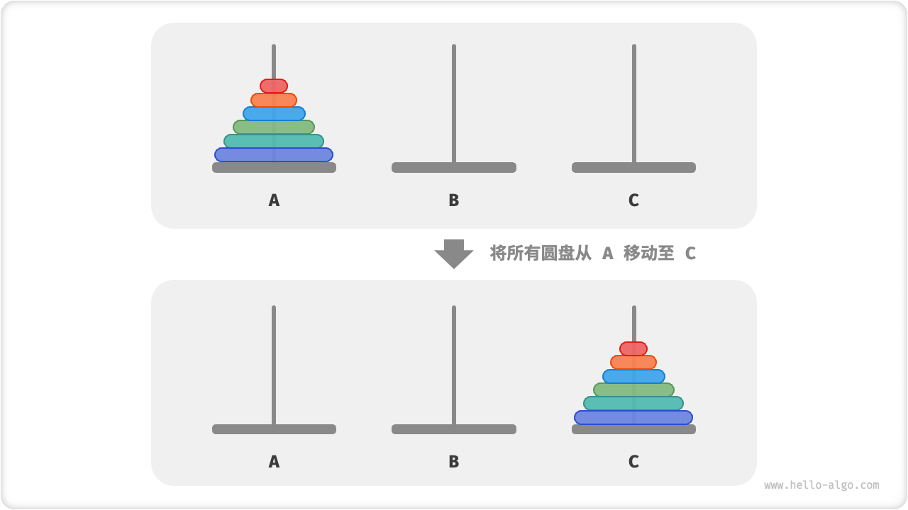
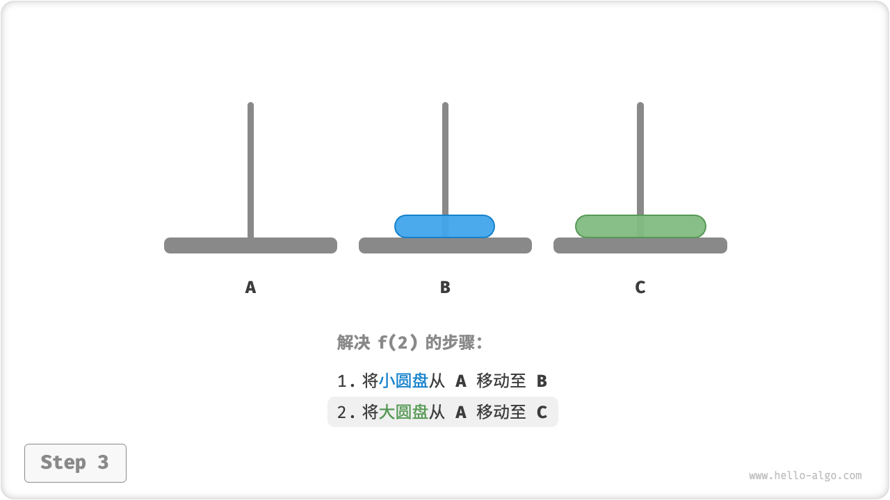
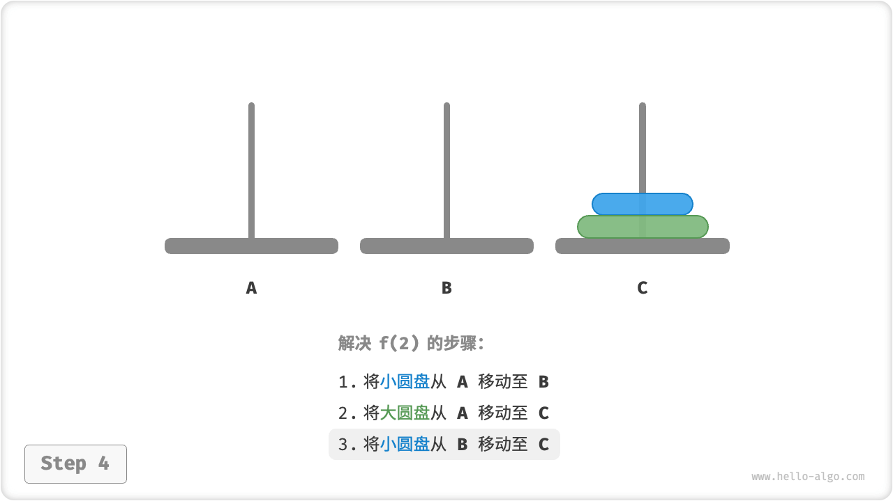
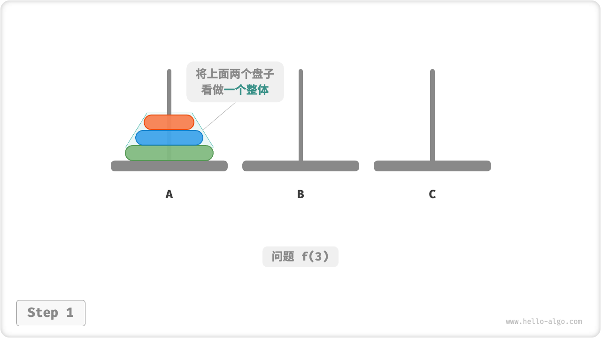
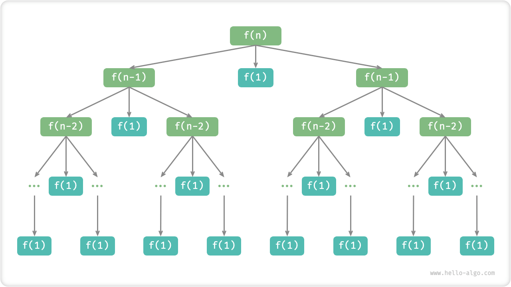

# Hanota Problem

In both merge sort and building binary trees, we decompose the original problem into two subproblems of half the size of the original problem. For the Hanota problem, however, we use a different solution strategy.

!!! question

    Given three columns, denoted `A`, `B` and `C` . In the starting state, column `A` is covered with $n$ disks, which are arranged from top to bottom in the order of smallest to largest. Our task is to move these $n$ disks to the column `C` and keep their original order. The following rules need to be observed while moving the disks.
   
    1. Discs can only be taken out of the top of one post and put in from the top of another.
    2. Only one disk can be moved at a time.
    3. The smaller disk must be located above the larger disk at all times.



**We denote a Hanota problem of size $i$ as $f(i)$** . For example $f(3)$ represents the Hanota problem of moving $3$ disks from `A` to `C` .

### Consider The Basics

As shown in the figure below, for the problem $f(1)$ , i.e., when there is only one disk, we can just move it directly from `A` to `C` .

=== "<1>"
    

=== "<2>"
    

As shown in the figure below, for the problem $f(2)$ , i.e., when there are two discs, **Since it is necessary to satisfy at all times that the smaller disc is on top of the larger disc, the movement of is accomplished with the help of `B`** .

1. First, move the top disk from `A` to `B`.
2. Then move the large disk from `A` to `C` .
3. Finally, move the disk from `B` to `C`.

=== "<1>"
    

=== "<2>"
    

=== "<3>"
    

=== "<4>"
    

The solution $f(2)$ can be summarized as follows:**Move two discs from `A` to `C`** with the help of `B` . Where `C` is called the target column and `B` is called the buffer column.

### Sub-Problem Decomposition

For the problem $f(3)$ , i.e., when there are three discs, the situation becomes slightly more complicated.

Since the solutions of $f(1)$ and $f(2)$ are known, we can think in terms of dividing and conquer, **Consider the two disks at the top of `A` as a whole**. Perform the steps shown in the figure below. Thus the three disks are smoothly moved from `A` to `C`.

1. With `B` as the target column and `C` as the buffer column, move the two disks from `A` to `B`.
2. Move one of the remaining disks in `A` directly from `A` to `C`.
3. With `C` as the target column and `A` as the buffer column, move the two disks from `B` to `C`.

=== "<1>"
    

=== "<2>"
    

=== "<3>"
    

=== "<4>"
    

Essentially, **we divide the problem $f(3)$ into two subproblems $f(2)$ and subproblem $f(1)$** . After solving these three subproblems in order, the original problem is then solved. This shows that the subproblems are independent and that the solutions can be combined.

At this point, we can summarize the solution strategy for the Hanota problem shown in the figure below: divide and conquer the original problem $f(n)$ into two subproblems $f(n-1)$ and one subproblem $f(1)$ and solve these three subproblems in the following order.

1. Move $n-1$ discs from `A` to `B` with the help of `C`.
2. Move the remaining $1$ discs directly from `A` to `C`.
3. Move $n-1$ discs from `B` to `C` with the help of `A`.

For both subproblems $f(n-1)$ , **can be divided recursionally in the same way until the smallest subproblem $f(1)$ is reached**. And the solution of $f(1)$ is known with only one move operation.


### Code Implementation

In the code, we declare a recursion function `dfs(i, src, buf, tar)` that moves the $i$ discs at the top of the column `src` to the target column `tar` with the help of the buffer column `buf` .

```src
[file]{hanota}-[class]{}-[func]{solve_hanota}
```

As shown in the figure below, the Hanota problem forms a recursion tree of height $n$, where each node represents a sub-problem, corresponding to an open `dfs()` function, **and thus has a time complexity of $O(2^n)$ and a space complexity of $O(n)$**.



!!! quote

    The hanota problem stems from an ancient legendary story. In an ancient Indian temple, the monks had three tall diamond pillars and $64$ gold disks of various sizes. The monks were constantly moving the original disks, and they believed that the world would end the moment the last disk was placed correctly.

    However, even if the monks moved once every second, it would take a total of about $2^{64} \approx 1.84×10^{19}$ seconds, a contract of $585$ billion years, which is far more than the current estimate of the age of the universe. So, if this legend is true, we should not need to worry about the end of the world.
