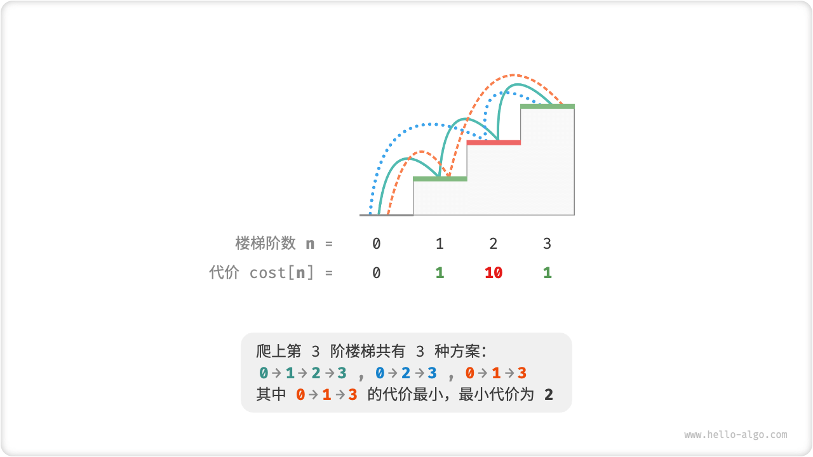
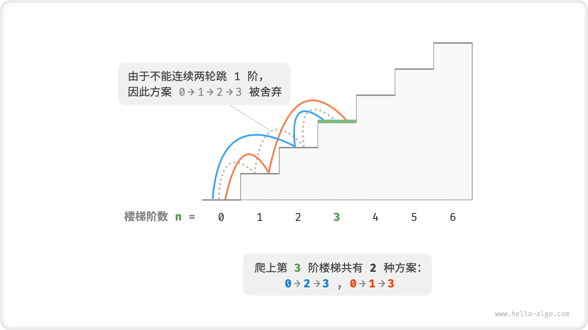
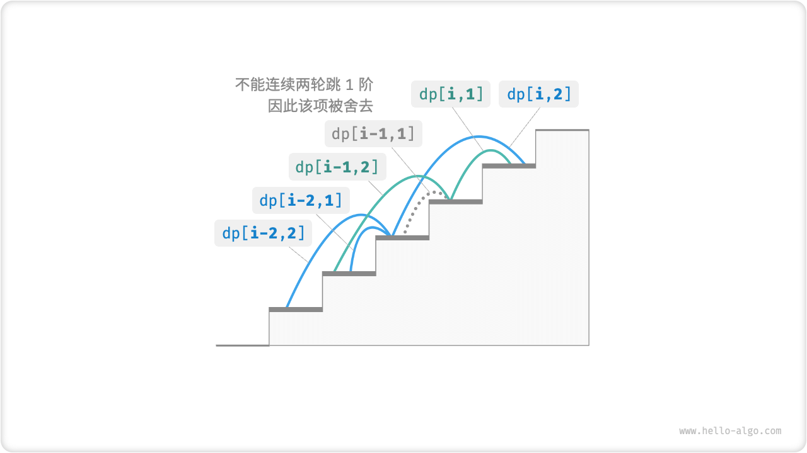

# Characterization Of Dynamic Programming Problems

In the previous section, we learned how dynamic programming solves problems by subproblem decomposition. In fact, subproblem decomposition is a generalized algorithmic idea with a different focus in divide and conquer, dynamic programming, and backtracking algorithm.

- The backtracking algorithm recursively divides and conquers the original problem into a number of mutually independent subproblems up to the smallest subproblem and merges the solutions of the subproblems in backtracking to finally obtain a solution to the original problem.
- Dynamic programming also performs a recursion decomposition of the problem, but the main difference with the divide and conquer algorithm is that the subproblems in dynamic programming are interdependent, and many overlapping subproblems appear during the decomposition process.
- The backtracking algorithm exhausts all possible solutions in try and backtrack and avoids unnecessary search branches by pruning. The solution to the original problem consists of a series of decision steps, and we can view the subsequence preceding each decision step as a subproblem.

In fact, dynamic programming is often used to solve optimization problems, which not only contain overlapping subproblems, but also have two other major properties: optimal substructure, and no posteriority.

## Optimal Substructure

We modify the stair-climbing problem slightly to make it more suitable for demonstrating the optimal substructure concept.

!!! question "Minimal cost of stair climbing"

    Given a staircase where you can go up either $1$ or $2$ steps per step, each step of the staircase is labeled with a non-negative integer indicating the cost you need to pay at that step. Given an array of non-negative integers $cost$ , where $cost[i]$ denotes the cost you need to pay at the $i$th step, and $cost[0]$ is the ground level starting point. Please calculate the minimum cost to reach the top?

As shown in the figure below, if the costs of the $1$, $2$, and $3$ steps are $1$, $10$, and $1$, respectively, then the minimum cost of climbing from the ground to the $3$ step is $2$.



Let $dp[i]$ be the cumulative cost of climbing to the $i$th step. Since the $i$th step can only come from the $i - 1$th step or the $i - 2$th step, $dp[i]$ can only be equal to either $dp[i - 1] + cost[i]$ or $dp[i - 2] + cost[i]$. To minimize the cost, we should choose the smaller of the two:

$$
dp[i] = \min(dp[i-1], dp[i-2]) + cost[i]
$$

This leads to the meaning of optimal substructure:**the optimal solution of the original problem is constructed from the optimal solution of the subproblem**.

This problem clearly has an optimal substructure: we pick the better of the two subproblem optimal solutions $dp[i-1]$ and $dp[i-2]$ and use it to construct an optimal solution to the original problem $dp[i]$.

So, is there an optimal substructure for the stair-climbing problem in the previous section? Its goal is to solve for the number of solutions, which may seem like a counting problem, but if it is asked in a different way, "Solve for the maximum number of solutions." We unexpectedly find that **although the questions are equivalent before and after the modification, the optimal substructure surfaces**: the number of maximal solutions of order $n$ is equal to the sum of the number of maximal solutions of order $n-1$ and order $n-2$. So, the optimal substructure is interpreted in a flexible way and will have different meanings in different problems.

Based on the state-trasition equation, and the initial states $dp[1] = cost[1]$ and $dp[2] = cost[2]$ , we get the dynamic programming code.

```src
[file]{min_cost_climbing_stairs_dp}-[class]{}-[func]{min_cost_climbing_stairs_dp}
```

The figure below shows the dynamic programming process of the above code.


This problem can also be space optimized by compressing one dimension to zero dimension, which makes the space complexity decrease from $O(n)$ to $O(1)$ .

```src
[file]{min_cost_climbing_stairs_dp}-[class]{}-[func]{min_cost_climbing_stairs_dp_comp}
```

## No After-Effects

The absence of posteriority is one of the important properties of dynamic programming that enables effective problem solving and is defined as: **Given a definite state, its future development is related only to the current state and not to all the states that the current state has experienced in the past**.

Taking the stair climbing problem as an example, given the state $i$, it will develop the states $i+1$ and $i+2$, which correspond to jumping $1$ and $2$ steps respectively. When making these two choices, we do not need to consider the states before state $i$, they have no effect on the future of state $i$.

However, if we add a constraint to the stair climbing problem, the situation is different.

!!! question "climbing stairs with constraints"

    Given a staircase with a total of $n$ steps, you can go up either $1$ steps or $2$ steps per step, **but you can't jump $1$ steps in two consecutive rounds**. How many scenarios are there to get to the top of the building.

For example, in the figure below, there are only $2$ feasible solutions left to climb up to the $3$ stage, among which the solution with three consecutive jumps of $1$ stage does not satisfy the constraints, and is therefore discarded.



In that problem, if the previous round came up by jumping $1$ steps, then the next round must jump $2$ steps. **This means that the choice of next step cannot be independently determined by the current state (current stair step), but is also related to the previous state (previous round stair step)**.

It is easy to find that this problem does not satisfy the no-laterality, and the state-trasition equation $dp[i] = dp[i-1] + dp[i-2]$ also fails because $dp[i-1]$ stands for the current round of jumping $1$ steps, but it contains many "previous round of jumping $1$ steps up" scenarios. In order to satisfy the constraint, we cannot directly count $dp[i-1]$ into $dp[i]$.

To do so, we need to extend the state definition:**The state $[i, j]$ denotes that it is at the $i$th order and has jumped the $j$th order in the previous round**, where $j \in \{1, 2\}$ . This state definition effectively distinguishes whether the last round has jumped $1$ or $2$ steps, and we can use it to determine where the current state comes from.

- When $1$ step was jumped in the previous round, the previous round can only choose to jump $2$ step, i.e. $dp[i, 1]$ can only be transferred from $dp[i-1, 2]$.
- When $2$ step is jumped in the previous round, the previous round can choose to jump $1$ step or $2$ step, i.e. $dp[i, 2]$ can be transferred from $dp[i-2, 1]$ or $dp[i-2, 2]$.

As shown in the figure below, under this definition, $dp[i, j]$ denotes the number of programs corresponding to the state $[i, j]$. At this time, the state-transition equation is:

$$
\begin{cases}
dp[i, 1] = dp[i-1, 2] \\
dp[i, 2] = dp[i-2, 1] + dp[i-2, 2]
\end{cases}
$$



In the end, it is enough to return $dp[n, 1] + dp[n, 2]$, the sum of which represents the total number of scenarios that have climbed to the $n$th step.

```src
[file]{climbing_stairs_constraint_dp}-[class]{}-[func]{climbing_stairs_constraint_dp}
```

In the above case, by considering only one more previous state, we can still extend the definition of the state to make the problem satisfy no posteriority again. However, some problems have very serious "consequences".

!!! question "Stair Climbing and Obstacle Generation"

    Given a staircase with a total of $n$ steps, you can go up either $1$ steps or $2$ steps per step. **states that when climbing to the $i$th step, the system will automatically put obstacles on the $2i$th step, and all rounds after that are not allowed to jump to the $2i$th step**. For example, if the first two rounds are jumped to the $2$ and $3$ steps, you are not allowed to jump to the $4$ and $6$ steps after that. Ask how many options there are to climb to the top of the building.

In this problem, the next jump depends on all past states, since each jump puts obstacles on higher rungs of the ladder and affects future jumps. Dynamic programming is often difficult to solve for this type of problem.

In fact, many complex combinatorial optimization problems (e.g., the traveler's problem) do not satisfy no posteriority. For such problems, we usually choose to use other methods, such as heuristic search, genetic algorithms, reinforcement learning, etc., so as to obtain usable local optimal solutions in finite time.
