# Dynamic Programming Solutions

The last two sections introduced the main features of dynamic programming problems, and next we explore two more practical problems together.

1. How can you tell if a problem is a dynamic programming problem?
2. Where to start and what are the complete steps for solving dynamic programming problems?

## Problem Determination

In general, if a problem contains overlapping subproblems, optimal substructures, and satisfies no posteriority, then it is usually suitable for solution by dynamic programming. However, it is difficult to extract these properties directly from the problem description. **Therefore we usually relax the conditions and first observe whether the problem is suitable to be solved using backtracking (exhaustive)**.

**Problems suitable for solution by backtracking usually satisfy the "Decision Tree Model"**, which can be described using a tree structure where each node represents a decision and each path represents a sequence of decisions.

In other words, if the problem contains explicit decision concepts and the solution is generated through a series of decisions, then it satisfies the decision tree model and can usually be solved using backtracking.

On this basis, there are some judgmental "plus points" for dynamic programming problems.

- The problem contains optimization descriptions such as maximum (small) or maximum (small).
- The states of a problem can be represented using a list, a multidimensional matrix, or a tree, and there is a recursive relationship between a state and its surrounding states.

Accordingly, there are some "minuses".

- The goal of the problem is to find all possible solutions, not to find the optimal solution.
- The problem description is characterized by distinct permutations and combinations that need to be returned for specific multiple scenarios.

If a problem satisfies the decision tree model and has more obvious "plus points", we can assume that it is a dynamic programming problem and verify it in the solution process.

## Problem Solving Steps

The solution process for dynamic programming will vary depending on the nature and difficulty of the problem, but usually follows the following steps: describe the decision, define the state, build the $dp$ table, derive the state-transition equation, determine the boundary conditions, etc.

In order to show the solution step by step, we use a classic problem "Minimum Path Sum" as an example.

!!! question

    Given a $n \times m$ two-dimensional grid `grid` , each cell in the grid contains a non-negative integer indicating the cost of that cell. The robot starts at the top-left cell and can only move one step down or to the right at a time until it reaches the bottom-right cell. Please return the minimum path sum from the upper-left corner to the lower-right corner.

The figure below shows an example where the minimum path sum for a given grid is $13$ .


**Step 1: Think about the decisions made in each round and define the state that leads to the $dp$ table**

The decision in each round of this problem is to take one step down or to the right from the current lattice. Let the row and column index of the current lattice be $[i, j]$ , then the index becomes $[i+1, j]$ or $[i, j+1]$ after taking a step down or right. Therefore, the state should contain both row index and column index variables, denoted as $[i, j]$ .

The subproblem corresponding to the state $[i, j]$ is the minimum path sum from the start point $[0, 0]$ to $[i, j]$ and the solution is denoted as $dp[i, j]$ .

At this point, we have the two-dimensional $dp$ matrix shown in the figure below, with the same dimensions as the input grid $grid$.


!!! note

    The dynamic programming and backtracking process can be described as a sequence of decisions, and the state consists of all the decision variables. It should contain all the variables describing the progress of the solution, and it contains enough information that can be used to derive the next state.
   
    Each state corresponds to a subproblem, and we will define a $dp$ table to store the solutions of all the subproblems, with each independent variable of the state being a dimension of the $dp$ table. Essentially, the $dp$ table is a mapping between the states and the solutions of the subproblems.

**Step 2: Identify the optimal substructure and hence derive the state-transition equation**

For the state $[i, j]$ , it can only be transferred from the upper edge lattice $[i-1, j]$ and the left lattice $[i, j-1]$ . Therefore the optimal substructure is: the minimum path sum to reach $[i, j]$ is determined by the smaller of the minimum path sum of $[i, j-1]$ and the minimum path sum of $[i-1, j]$.

Based on the above analysis, the state-transition equation shown in the figure below can be introduced:

$$
dp[i, j] = \min(dp[i-1, j], dp[i, j-1]) + grid[i, j]
$$

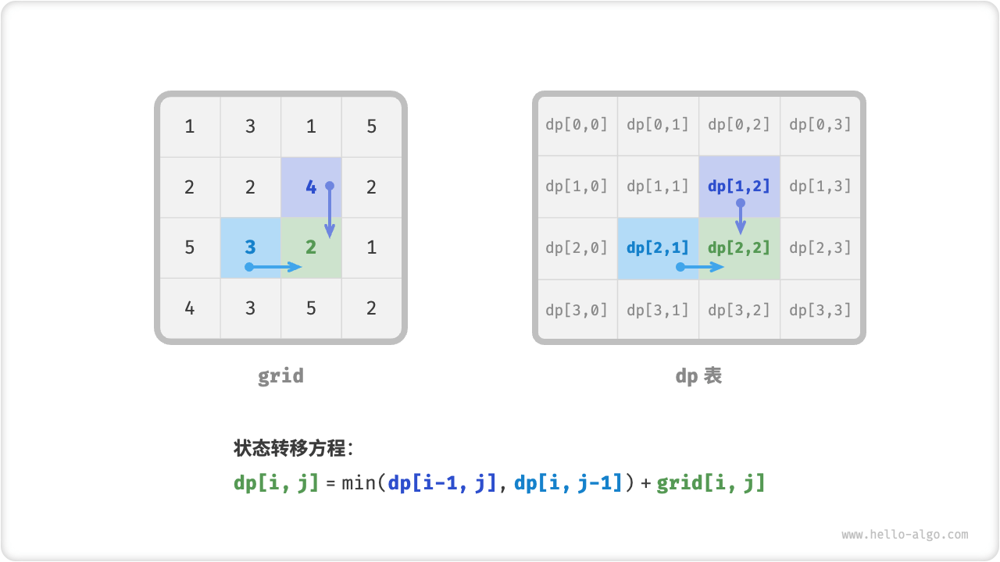

!!! note

    Based on the defined $dp$ table, think about the relationship between the original problem and the subproblems, and find out the way to construct the optimal solution of the original problem through the optimal solution of the subproblems, i.e., the optimal substructure.

    Once we have found the optimal substructure, we can use it to construct the state-transition equation.

**Step 3: Determine boundary conditions and state transfer order**

In this problem, the state of the first row can only be derived from the state to its left, and the state of the first column can only be derived from the state above it, so the first row $i = 0$ and the first column $j = 0$ are boundary conditions.

As shown in the figure below, since each grid is transferred from its left and top grids, we use employ a loop to traverse the matrix, an outer loop to traverse the rows and an inner loop to traverse the columns.


!!! note

    Boundary conditions are used in dynamic programming to initialize $dp$ tables and in search for pruning.
   
    The core of the state transfer order is to ensure that by the time the solution to the current problem is computed, all the solutions to the smaller subproblems on which it depends have already been computed correctly.

Based on the above analysis, we can already write dynamic programming code directly. However, subproblem decomposition is a kind of top-to-bottom idea, so it is more in line with the habit of thinking to implement it in the order of "Brute-force Search $\rightarrow$ Memorized Search $\rightarrow$ Dynamic Programming".

### Method One: Brute Force Search

Starting the search from the state $[i, j]$ and continuously decomposing into smaller states $[i-1, j]$ and $[i, j-1]$ , the recursion function includes the following elements.

- **Recursion parameter**: state $[i, j]$ .
- **Return value**: the minimum path from $[0, 0]$ to $[i, j]$ and $dp[i, j]$ .
- **Termination condition**: return cost $grid[0, 0]$ when $i = 0$ and $j = 0$ .
- **pruning**: index crossing when $i < 0$ or $j < 0$, in which case the cost $+\infty$ is returned, representing infeasibility.

```src
[file]{min_path_sum}-[class]{}-[func]{min_path_sum_dfs}
```

The figure below gives a recursion tree node with $dp[2, 1]$ as the root node, which contains a number of overlapping subproblems, the number of which increases dramatically as the size of the grid `grid` becomes larger.

Essentially, the cause of the overlapping sub-problem is that **there exist multiple paths to reach a cell from the upper left corner**.


Each state has two choices, down and right, and it takes a total of $m + n - 2$ steps to walk from the top left corner to the bottom right corner, so the worst time complexity is $O(2^{m + n})$ . Note that this calculation does not take into account the case of approaching grid boundaries, which leaves only one choice when the network boundary is reached. Therefore the actual number of paths will be less.

### Method 2: Memorized Search

We introduce a memoized list `mem` of the same size as the grid `grid` for recording the solutions of individual subproblems and pruning the overlapping subproblems.

```src
[file]{min_path_sum}-[class]{}-[func]{min_path_sum_dfs_mem}
```

As shown in the figure below, with the introduction of memoization, the solution to all subproblems is computed only once, so the time complexity depends on the total number of states, i.e., the grid size $O(nm)$ .

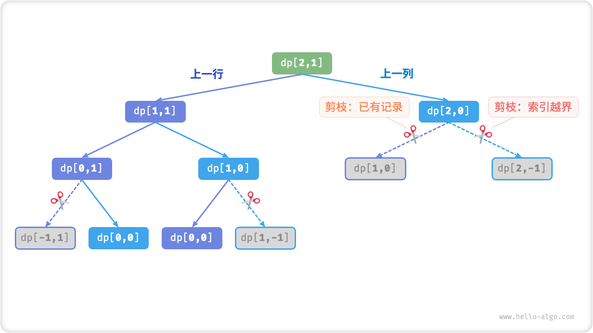

### Method 3: Dynamic Programming

Iteration-based implementation of dynamic programming solutions.

```src
[file]{min_path_sum}-[class]{}-[func]{min_path_sum_dp}
```

The figure below illustrates the state transfer process for the minimum path sum, which traverses the entire lattice, **hence the time complexity is $O(nm)$** .

The size of the array `dp` is $n \times m$ , **hence the space complexity is $O(nm)$** .

=== "<1>"
    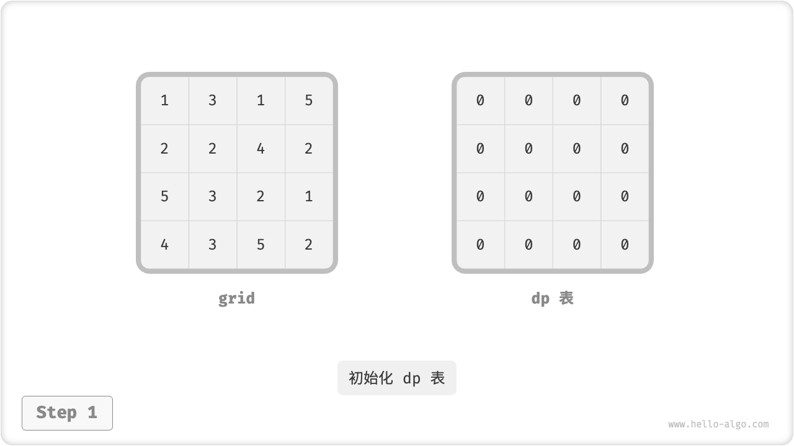

=== "<2>"
    

=== "<3>"
    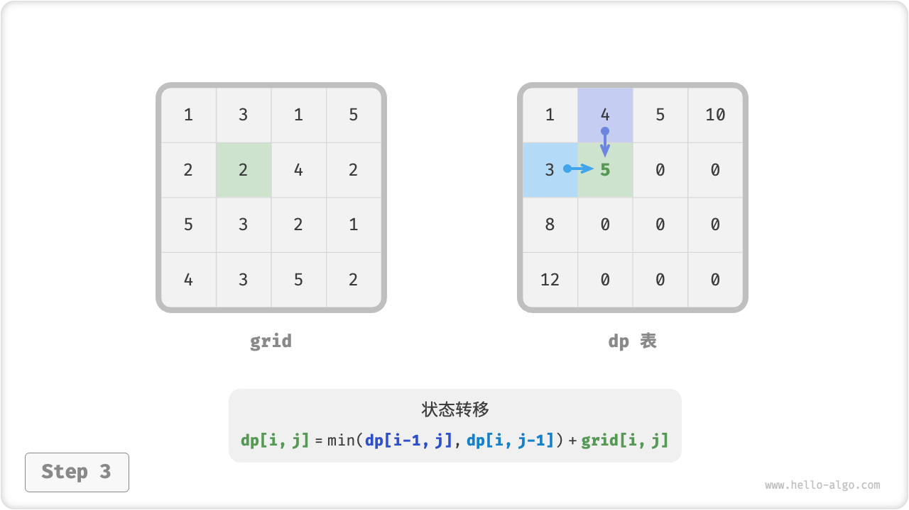

=== "<4>"
    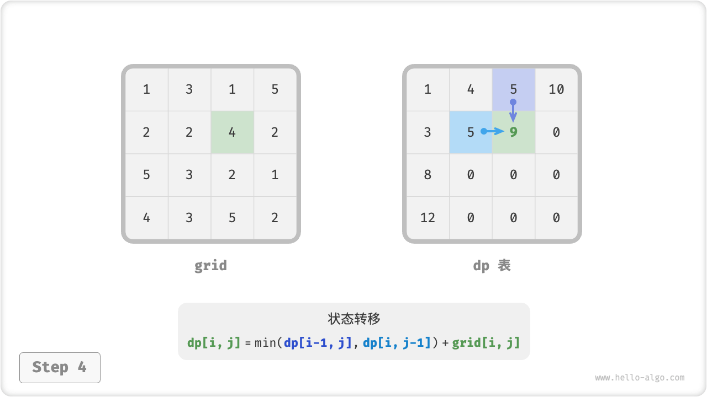

=== "<5>"
    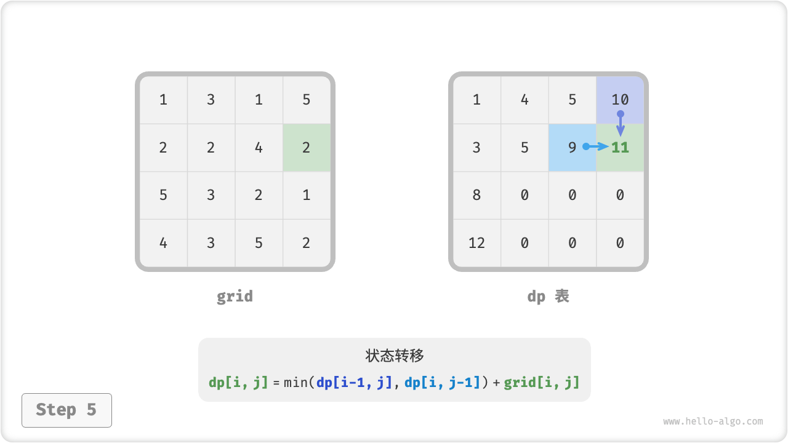

=== "<6>"
    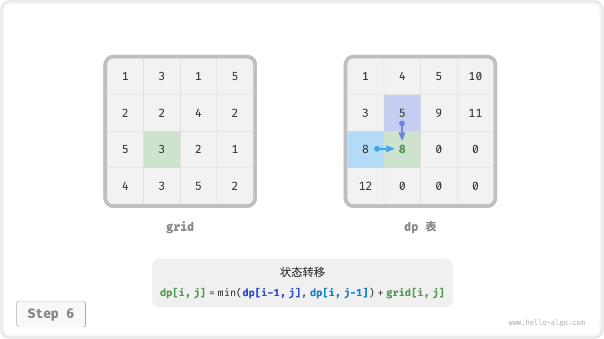

=== "<7>"
    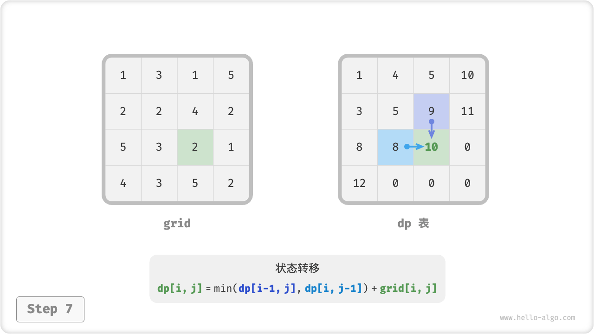

=== "<8>"
    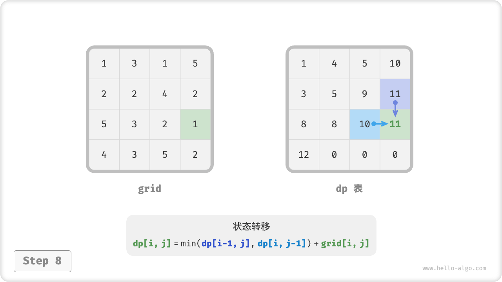

=== "<9>"
    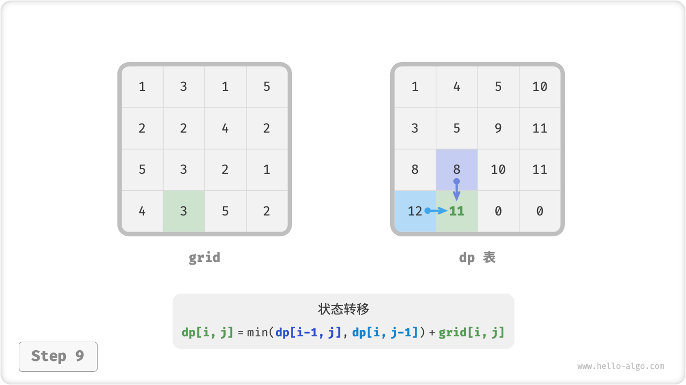

=== "<10>"
    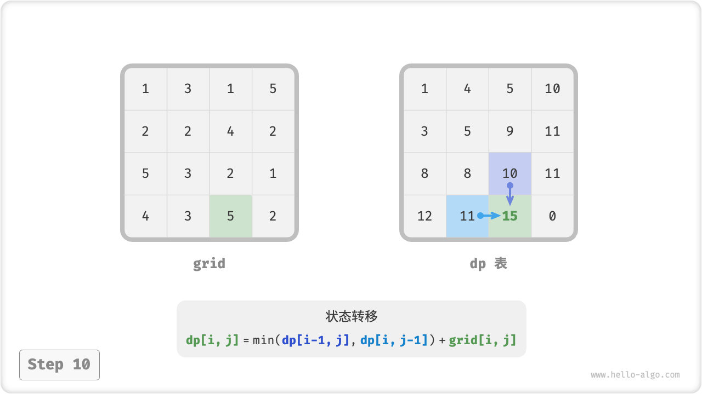

=== "<11>"
    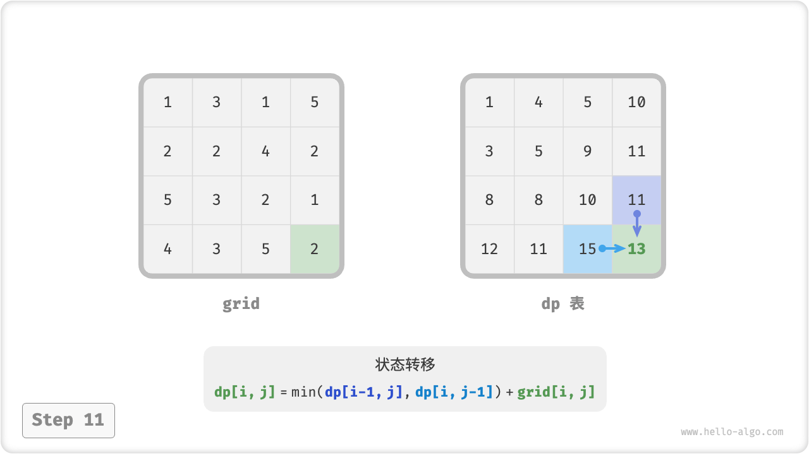

=== "<12>"
    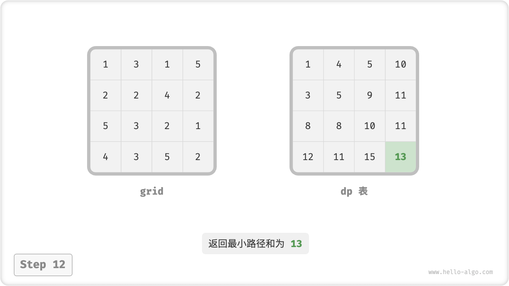

### Space Optimization

Since each grid is only related to the grid to its left and above, we can implement the $dp$ table with only a single row array.

Note that since the array `dp` can only represent the state of one row, we can't initialize the first column's state ahead of time, but instead update it as we traverse each row.

```src
[file]{min_path_sum}-[class]{}-[func]{min_path_sum_dp_comp}
```
