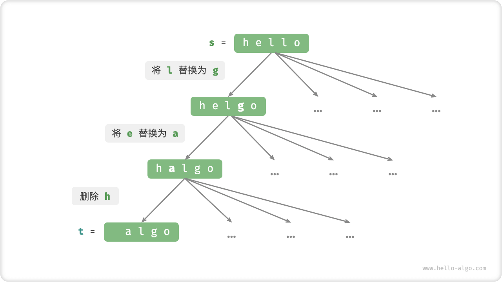
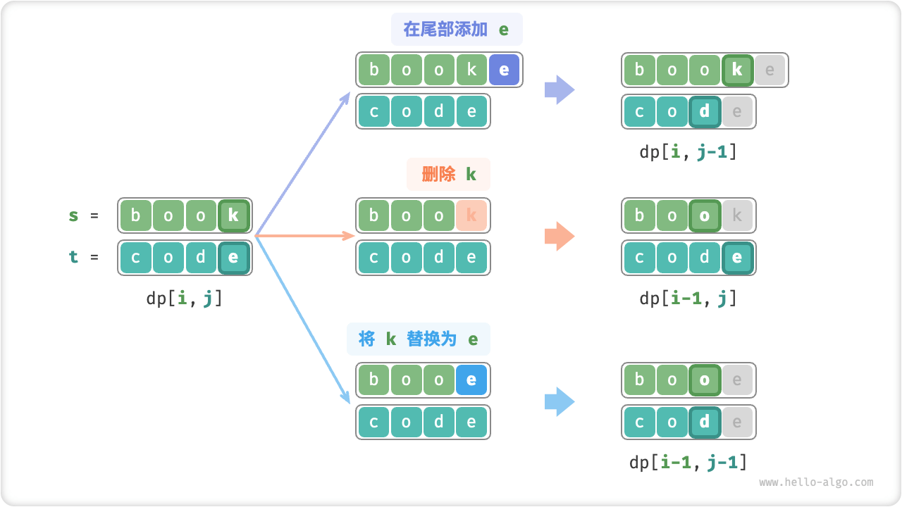
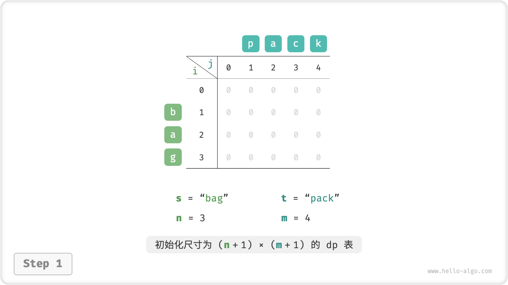
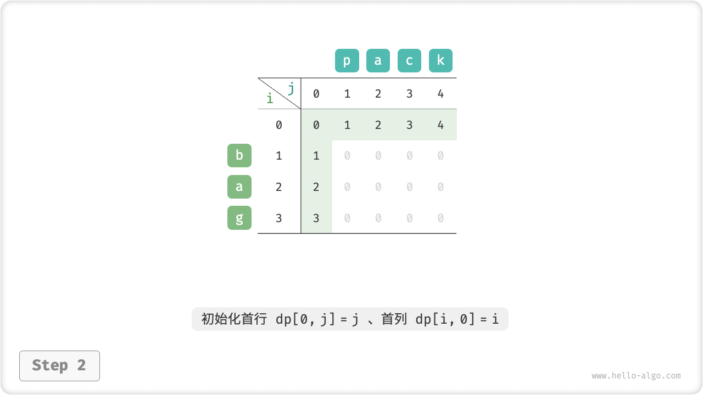
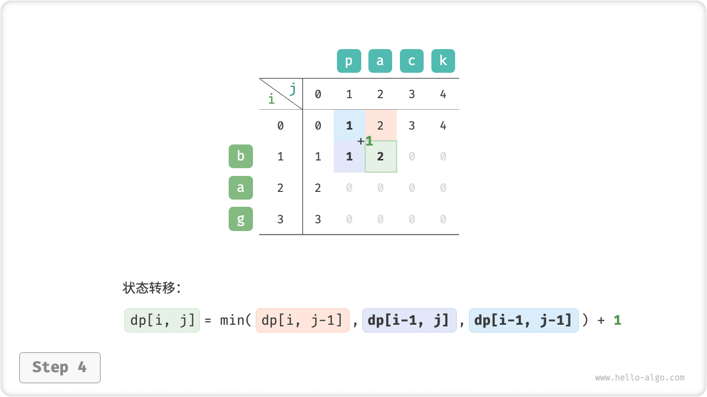
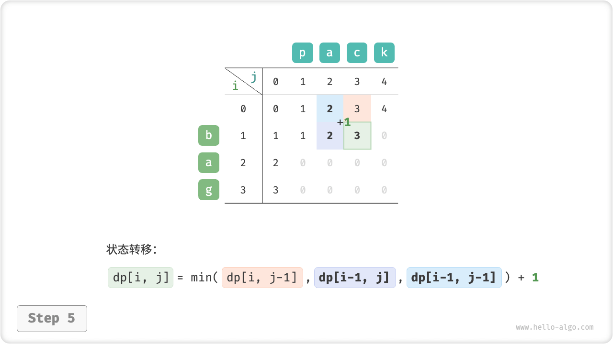
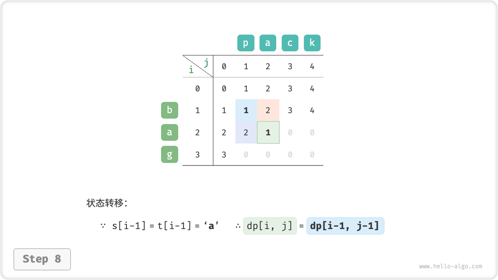
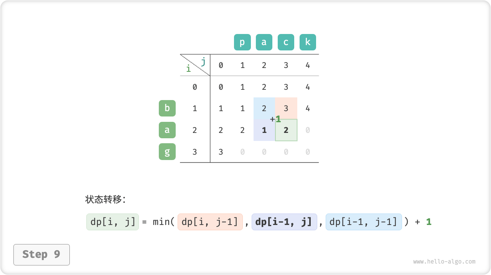
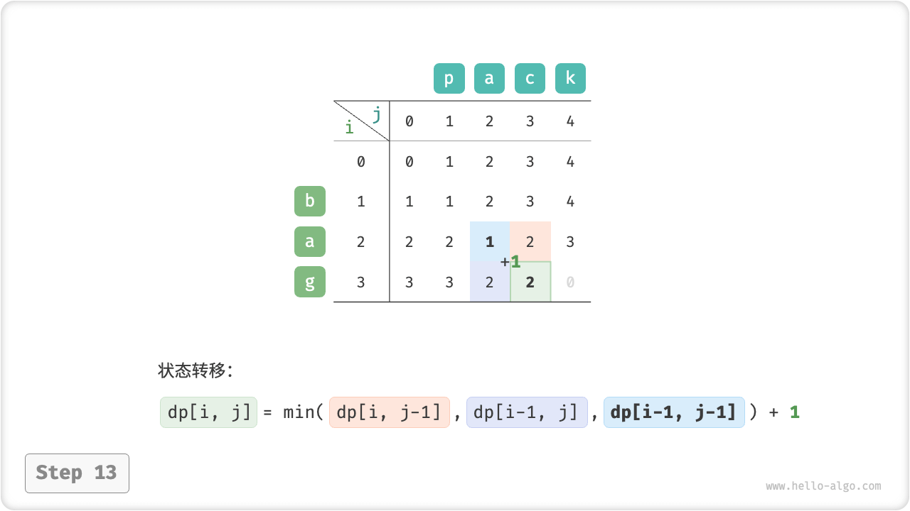

# Edit Distance Problem

The edit distance, also known as the Levenshtein distance, refers to the minimum number of modifications for two strings to be converted to each other, and is commonly used to measure the degree of similarity between two sequences in information retrieval and natural language processing.

!!! question

    Enter two strings $s$ and $t$ and return the minimum number of editing steps required to convert $s$ to $t$.
   
    You can perform three editing operations in a string: inserting a character, deleting a character, and replacing a character with any character.

As shown in the figure below, converting `kitten` to `sitting` requires 3 editing steps, including 2 replacements and 1 addition; converting `hello` to `algo` requires 3 steps, including 2 replacements and 1 deletion.


**The edit distance problem can be naturally explained in terms of the decision tree model**. Strings correspond to tree nodes, and a round of decisions (one edit operation) corresponds to an edge of the tree.

As shown in the figure below, without restricting the operations, each node can derive many edges, each corresponding to one operation, which means that there are many possible paths to convert from `hello` to `algo`.

From a decision tree perspective, the goal of this problem is to solve for the shortest path between node `hello` and node `algo`.



### Ideas For Dynamic Programming

**Step 1: Think about the decisions made in each round and define the state that leads to the $dp$ table**

The decision in each round is to perform an edit operation on the string $s$.

We would like the size of the problem to decrease gradually during the editing operation so that we can construct subproblems. Let the lengths of the strings $s$ and $t$ be $n$ and $m$, respectively, and we start by considering the characters $s[n-1]$ and $t[m-1]$ at the end of the two strings.

- If $s[n-1]$ and $t[m-1]$ are the same, we can skip them and consider $s[n-2]$ and $t[m-2]$ directly.
- If $s[n-1]$ and $t[m-1]$ are different, we need to make one edit (insertion, deletion, substitution) to $s$ so that the characters at the end of both strings are the same, so that we can skip them and consider smaller scale problems.

That is, each round of decision making (editing operation) we perform in the string $s$ causes the remaining characters to be matched in $s$ and $t$ to change. Therefore, the state is the first $i$ and $j$ characters currently considered in $s$ and $t$, denoted as $[i, j]$ .

Subproblem corresponding to state $[i, j]$:**Minimum number of edit steps required to change the first $i$ characters of $s$ to the first $j$ characters of $t$**.

At this point, a 2D $dp$ table with dimensions $(i+1) \times (j+1)$ is obtained.

**Step 2: Identify the optimal substructure and hence derive the state-transition equation**

Consider the subproblem $dp[i, j]$ , which corresponds to two strings with trailing characters $s[i-1]$ and $t[j-1]$ , which can be categorized into the three scenarios shown in the figure below based on different editing operations.

1. Add $t[j-1]$ after $s[i-1]$ , then the remaining subproblem $dp[i, j-1]$ .
2. Delete $s[i-1]$ , then the remaining subproblem $dp[i-1, j]$ .
3. By replacing $s[i-1]$ with $t[j-1]$ , the remaining subproblem $dp[i-1, j-1]$ .



Based on the above analysis, the optimal substructure can be obtained as follows: $dp[i, j]$ The minimum number of editing steps is equal to the minimum number of editing steps among $dp[i, j-1]$, $dp[i-1, j]$, and $dp[i-1, j-1]$, plus the number of editing steps of the current one $1$ . The corresponding state-trasition equation is:

$$
dp[i, j] = \min(dp[i, j-1], dp[i-1, j], dp[i-1, j-1]) + 1
$$

Note that **When $s[i-1]$ and $t[j-1]$ are the same, there is no need to edit the current character**. The state-trasition equation in this case is:

$$
dp[i, j] = dp[i-1, j-1]
$$

**Step 3: Determine boundary conditions and state transfer order**

When both strings are empty, the number of edit steps is $0$, i.e. $dp[0, 0] = 0$. When $s$ is null but $t$ is not null, the minimum number of editing steps is equal to the length of $t$, i.e., the first line $dp[0, j] = j$ . When $s$ is not empty but $t$ is empty, the minimum number of editing steps is equal to the length of $s$, i.e., first row $dp[i, 0] = i$ .

Observing the state-trasition equation, the solution $dp[i, j]$ depends on the left, top, and upper-left solutions, so it is sufficient to traverse the entire $dp$ table in positive order through a two-level loop.

### Code Implementation

```src
[file]{edit_distance}-[class]{}-[func]{edit_distance_dp}
```

As shown in the figure below, the process of transferring states for the edit distance problem is very similar to the knapsack problem in that both can be viewed as the process of filling in a two-dimensional grid.

=== "<1>"
    

=== "<2>"
    

=== "<3>"
    

=== "<4>"
    

=== "<5>"
    

=== "<6>"
    

=== "<7>"
    

=== "<8>"
    

=== "<9>"
    

=== "<10>"
    

=== "<11>"
    

=== "<12>"
    

=== "<13>"
    

=== "<14>"
    

=== "<15>"
    

### Space Optimization

Since $dp[i,j]$ is transferred from the upper $dp[i-1, j]$, the left $dp[i, j-1]$, and the upper-left state $dp[i-1, j-1]$, and the orthogonal traversal loses the upper-left $dp[i-1, j-1]$ , and the inverted traversal can not build $dp[i, j-1]$ in advance, both traversal orders are not desirable.

To do this, we can use a variable `leftup` to temporarily store the top-left solution $dp[i-1, j-1]$ so that only the left and top solutions need to be considered. The situation is the same as the complete knapsack problem, and can be traversed using positive order.

```src
[file]{edit_distance}-[class]{}-[func]{edit_distance_dp_comp}
```
