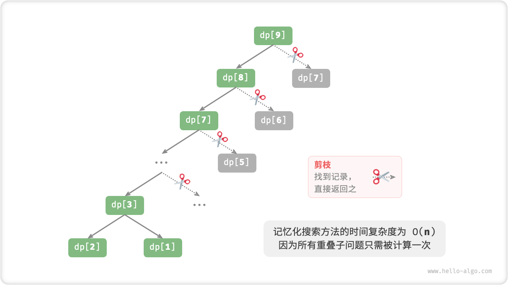

# A First Look At Dynamic Programming

"Dynamic programming dynamic programming" is an important algorithmic paradigm that dramatically improves time efficiency by decomposing a problem into a series of smaller subproblems and avoiding repetitive computations by storing solutions to the subproblems.

In this section, we start with a classical example problem, give its brute-force backtracking solution, observe the overlapping subproblems contained in it, and then gradually derive a more efficient dynamic programming solution.

!!! question "climbing stairs"

    Given a staircase with a total of $n$ steps, and you can go up either $1$ steps or $2$ steps per step, ask how many options there are to get to the top of the building.

As shown in the figure below, for a $3$ step staircase, there are a total of $3$ solutions to climb to the top.


The goal of this problem is to solve for the number of solutions, **We can consider backtracking to exhaust all possibilities**. Specifically, imagine stair climbing as a multi-round selection process: starting from the ground, each round chooses to go up either $1$ steps or $2$ steps, adding $1$ to the number of solutions whenever it reaches the top of the stairs, and pruning it when it crosses the top of the stairs.

```src
[file]{climbing_stairs_backtrack}-[class]{}-[func]{climbing_stairs_backtrack}
```

## Method One: Brute Force Search

Backtracking algorithms usually do not explicitly disassemble the problem, but rather view the problem as a series of decision-making steps, searching for all possible solutions through trial and pruning.

We can try to analyze this problem from the perspective of problem decomposition. Let there are a total of $dp[i]$ solutions to climb to the $i$th degree, then $dp[i]$ is the original problem, and its subproblems include :

$$
dp[i-1], dp[i-2], \dots, dp[2], dp[1]
$$

Since each round can only go up $1$ step or $2$ step, when we stand on the $i$ step of the staircase, the previous round could only have been on the $i - 1$ step or $i - 2$ step. In other words, we can only go from the $i -1$ or $i - 2$ step to the $i$ step.

This leads to an important corollary:**The number of programs that climbed to the $i - 1$ step plus the number of programs that climbed to the $i - 2$ step equals the number of programs that climbed to the $i$ step**. The formula is as follows:

$$
dp[i] = dp[i-1] + dp[i-2]
$$

This means that in the stair climbing problem, there is a recursive relationship between the subproblems, **the solution of the original problem can be constructed from the solutions of the subproblems**. The figure below illustrates that recursive relationship.


We can get the brute-force search solution based on the recursive formula. Taking $dp[n]$ as the starting point, **recursively splits a larger problem into the sum of two smaller problems** until it returns when it reaches the smallest subproblems $dp[1]$ and $dp[2]$. Where the solution of the smallest subproblem is known, i.e., $dp[1] = 1$ and $dp[2] = 2$, indicating that there are $1$ and $2$ solutions for climbing up to the $1$ and $2$ steps, respectively.

Observe the following code, which is a depth-first search as well as the standard backtracking code, but is more concise.

```src
[file]{climbing_stairs_dfs}-[class]{}-[func]{climbing_stairs_dfs}
```

The figure below shows the recursion tree formed by brute-force search. For the problem $dp[n]$ , the depth of the recursion tree is $n$ and the time complexity is $O(2^n)$ . The exponential order is explosive, and if we input a relatively large $n$ , we will be stuck in a long wait.


Observing the figure above, the time complexity of **exponential order is due to the "overlapping subproblems"**. For example, $dp[9]$ is decomposed into $dp[8]$ and $dp[7]$ , and $dp[8]$ is decomposed into $dp[7]$ and $dp[6]$ , both of which contain the subproblem $dp[7]$ .

By analogy, subproblems contain smaller overlapping subproblems, and the children are endless. The vast majority of computational resources are wasted on these overlapping problems.

## Method 2: Memorized Search

To improve the efficiency of the algorithm, **we want all overlapping subproblems to be computed only once**. To this end, we declare an array `mem` to record the solution of each subproblem and prune the overlapping subproblems during the search process.

1. When $dp[i]$ is computed for the first time, we record it to `mem[i]` for later use.
2. When it is time to compute $dp[i]$ again, we can get the result directly from `mem[i]`, thus avoiding repeating the subproblem.

```src
[file]{climbing_stairs_dfs_mem}-[class]{}-[func]{climbing_stairs_dfs_mem}
```

Observing the figure below, **After memoization, all overlapping subproblems are computed only once and the time complexity is optimized to $O(n)$** , which is a huge leap.



## Method 3: Dynamic Programming

**Memorized search is a "top-to-bottom" approach**: we start with the original problem (root node) and recursively decompose the larger subproblems into smaller subproblems up to the smallest known solution (leaf node). After that, the solutions of the subproblems are collected layer by layer by backtracking to construct the solution of the original problem.

In contrast, **dynamic programming is a "bottom-to-top" approach**: starting with the solution to the smallest subproblem, iteration builds solutions to larger subproblems until the solution to the original problem is obtained.

Since dynamic programming does not include a backtracking process, it is implemented using only loop iteration, without the need for recursion. In the following code, we initialize an array `dp` to store the solutions of the subproblems, which acts as the same record as the array `mem` in the memetic search.

```src
[file]{climbing_stairs_dp}-[class]{}-[func]{climbing_stairs_dp}
```

The figure below simulates the execution of the above code.


Like backtracking algorithms, dynamic programming uses the notion of "state" to represent a particular stage of the problem, where each state corresponds to a subproblem and a corresponding local optimal solution. For example, the state of a stair climbing problem is defined as the number of stair steps $i$ .

Based on the above, we can summarize the common terms used in dynamic programming.

- The array `dp` is referred to as the "$dp$ table" and $dp[i]$ denotes the solution of the subproblem corresponding to state $i$.
- The states corresponding to the smallest subproblems (i.e., the $1$ and $2$ stairs) are called "initial states".
- Call the recursive formula $dp[i] = dp[i-1] + dp[i-2]$ the 'state-transition equation'.

## Space Optimization

If you are careful, you may notice that **since $dp[i]$ is only related to $dp[i-1]$ and $dp[i-2]$, we don't need to use an array of `dp` to store all the solutions of the subproblems**, but just two variables to roll forward.

```src
[file]{climbing_stairs_dp}-[class]{}-[func]{climbing_stairs_dp_comp}
```

Observing the above code, the space complexity is reduced from $O(n)$ to $O(1)$ by eliminating the space occupied by the array `dp` .

In dynamic programming problems, the current state is often related to only a finite number of previous states, so we can save memory space by "dimensionality reduction" by keeping only the necessary states. **This space optimization technique is called "rolling variables" or "rolling arrays"**.
