# 0-1 Knapsack Problem

The knapsack problem is a great introductory topic to dynamic programming and is the most common form of the problem in dynamic programming. It has many variants, such as the 0-1 knapsack problem, the complete knapsack problem, and the multiple knapsack problem.

In this section, we start by solving the most common 0-1 knapsack problem.

!!! question

    Given $n$ items, the weight of the first $i$ item is $wgt[i-1]$, the value is $val[i-1]$ , and a backpack with capacity $cap$. Each item can be selected only once, and the maximum value of the item that can be put into the backpack without exceeding its capacity is asked.

Observing the figure below, since the item number $i$ is counted from $1$ and the array index is counted from $0$, the item $i$ corresponds to the weight $wgt[i-1]$ and value $val[i-1]$ .


We can view the 0-1 knapsack problem as a process consisting of $n$ rounds of decisions, with two decisions for each object: not to put it in and to put it in, and thus the problem is satisfying the decision tree model.

The goal of the problem is to solve for the "maximum value given the capacity of the knapsack", so with a high probability it is a dynamic programming problem.

**Step 1: Think about the decisions made in each round and define the state that leads to the $dp$ table**

For each item, if it is not put into the backpack, the backpack capacity remains unchanged; if it is put into the backpack, the backpack capacity decreases. This leads to the state definition: the current item number $i$ and the remaining backpack capacity $c$ , denoted as $[i, c]$ .

**The subproblem corresponding to the state $[i, c]$ is**: The maximum value of the previous $i$ items in the knapsack with remaining capacity $c$, denoted as $dp[i, c]$ .

The solution to be solved is $dp[n, cap]$ , so a two-dimensional $dp$ table of size $(n+1) \times (cap+1)$ is needed.

**Step 2: Find the optimal substructure, and thus derive the state-transition equation**

When we make a decision for item $i$, what remains is the decision for the first $i-1$ items, which can be categorized into the following two cases.

- **Do not put in items $i$** : The backpack capacity remains unchanged and the state changes to $[i-1, c]$ .
- **Put in item $i$** : Backpack capacity decreases $wgt[i-1]$ , value increases $val[i-1]$ , state changes to $[i-1, c-wgt[i-1]]$ .

The above analysis reveals to us the optimal substructure of the problem: **The maximum value $dp[i, c]$ equals the one** that has the greater value of the two alternatives of leaving items out $i$ and putting items in $i$. This leads to the state-trasition equation:

$$
dp[i, c] = \max(dp[i-1, c], dp[i-1, c - wgt[i-1]] + val[i-1])
$$

Note that if the current item weight $wgt[i - 1]$ exceeds the remaining backpack capacity $c$, you can only choose not to put it into the backpack.

**Step 3: Determine boundary conditions and state transfer order**

The maximum value when there are no items or no remaining backpack capacity is $0$ , i.e. the first column $dp[i, 0]$ and the first row $dp[0, c]$ are both equal to $0$ .

The current state $[i, c]$ is transferred from the top state $[i-1, c]$ and the top-left state $[i-1, c-wgt[i-1]]$, so it is sufficient to traverse the entire $dp$ table in positive order with a two-level loop.

Based on the above analysis, we next implement the brute-force search, memorized search, and dynamic programming solutions in order.

### Method One: Brute Force Search

The search code contains the following elements.

- **recursion parameter**: state $[i, c]$ .
- **Return value**: solution to the subproblem $dp[i, c]$ .
- **Termination condition**: when the item number crosses the boundary $i = 0$ or the remaining capacity of the backpack is $0$, the recursion is terminated and the value $0$ is returned.
- **Pruning**: if the weight of the current item exceeds the remaining capacity of the backpack, it can only be left out of the backpack.

```src
[file]{knapsack}-[class]{}-[func]{knapsack_dfs}
```

As shown in the figure below, the time complexity is $O(2^n)$ since each item generates two search branches, unselected and selected.

Observing the recursion tree, it is easy to find that there are overlapping subproblems in it, such as $dp[1, 10]$ and so on. And when there are more items and the knapsack capacity is large, especially when there are more items of the same weight, the number of overlapping subproblems will increase dramatically.


### Method 2: Memorized Search

To ensure that the overlapping subproblems are computed only once, we record the solutions of the subproblems with the help of a memoized list `mem` , where `mem[i][c]` corresponds to $dp[i, c]$ .

With the introduction of memoization, **the time complexity depends on the number of subproblems**, which is $O(n \times cap)$ .

```src
[file]{knapsack}-[class]{}-[func]{knapsack_dfs_mem}
```

The figure below shows the search branches that were clipped in the memorized recursion.

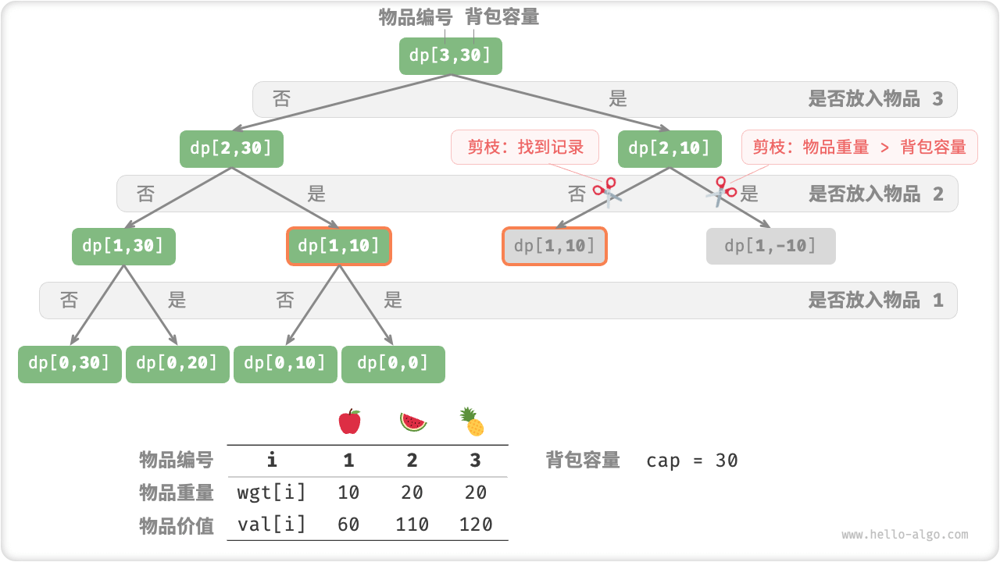

### Method 3: Dynamic Programming

Dynamic programming is essentially the process of populating the $dp$ table in a state transfer, as shown in the code below.

```src
[file]{knapsack}-[class]{}-[func]{knapsack_dp}
```

As shown in the figure below, both time complexity and space complexity are determined by the size of the array `dp` , i.e. $O(n \times cap)$ .

=== "<1>"
    

=== "<2>"
    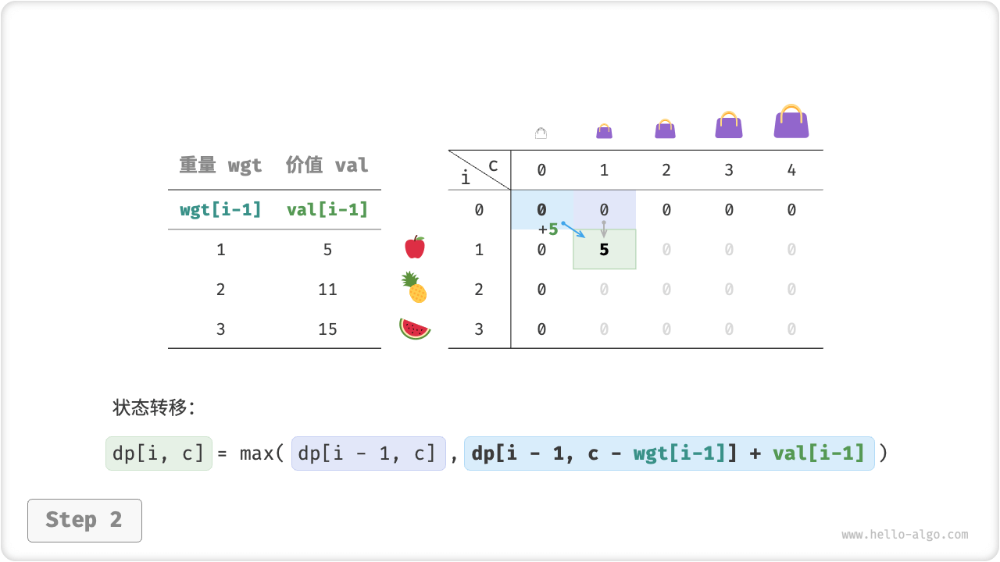

=== "<3>"
    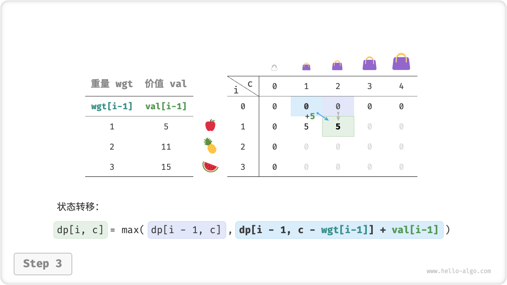

=== "<4>"
    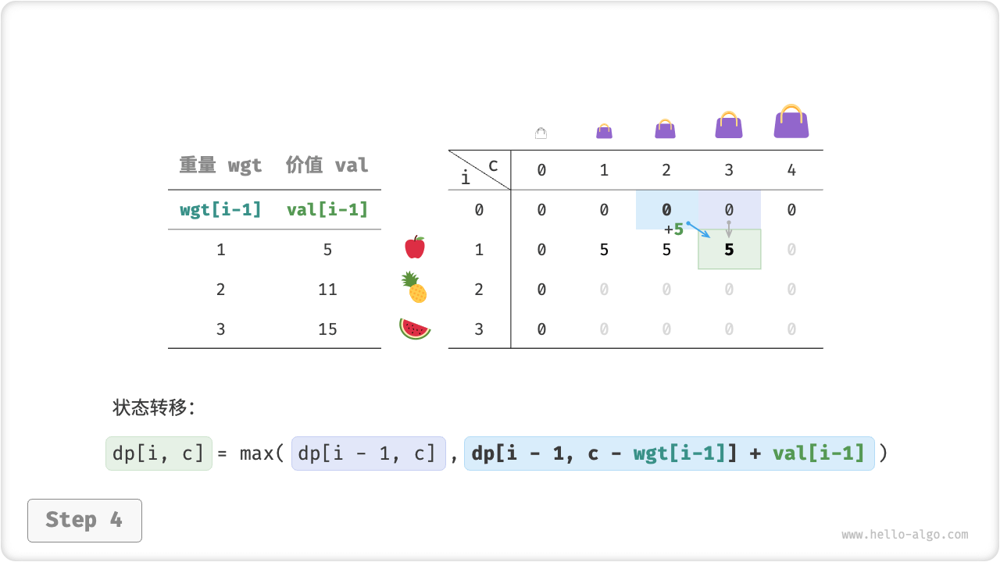

=== "<5>"
    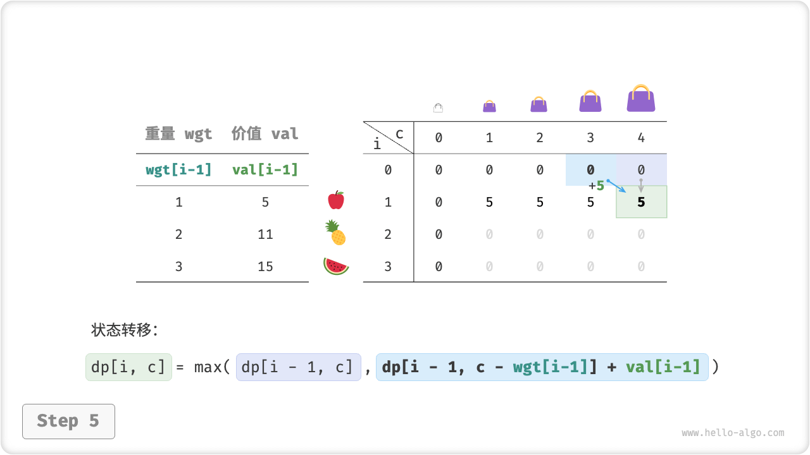

=== "<6>"
    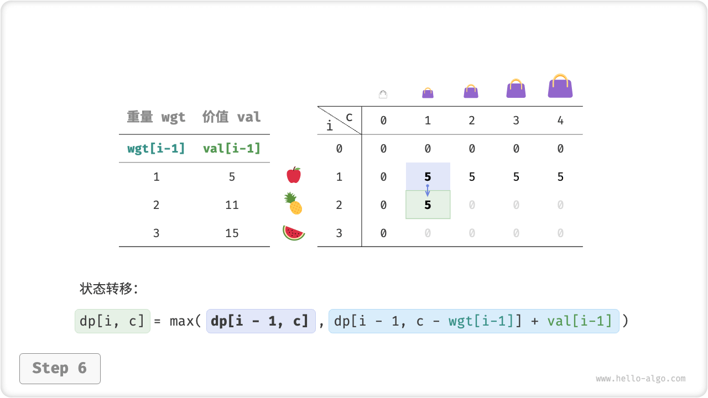

=== "<7>"
    

=== "<8>"
    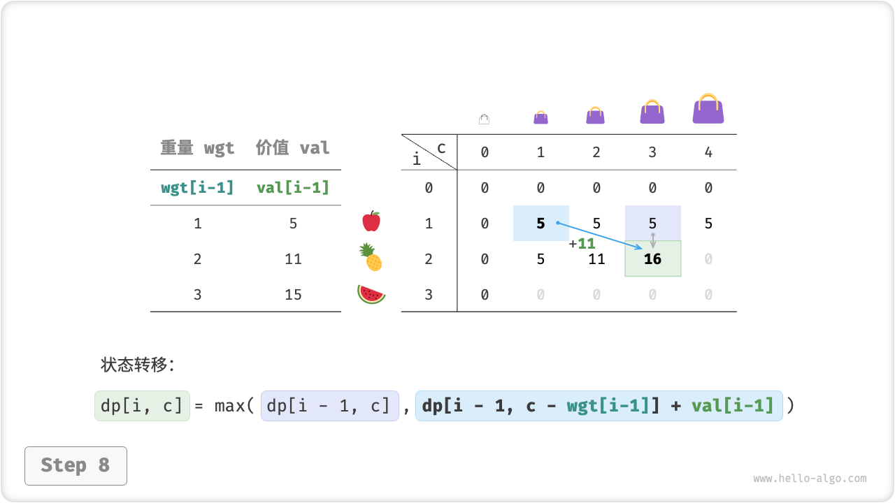

=== "<9>"
    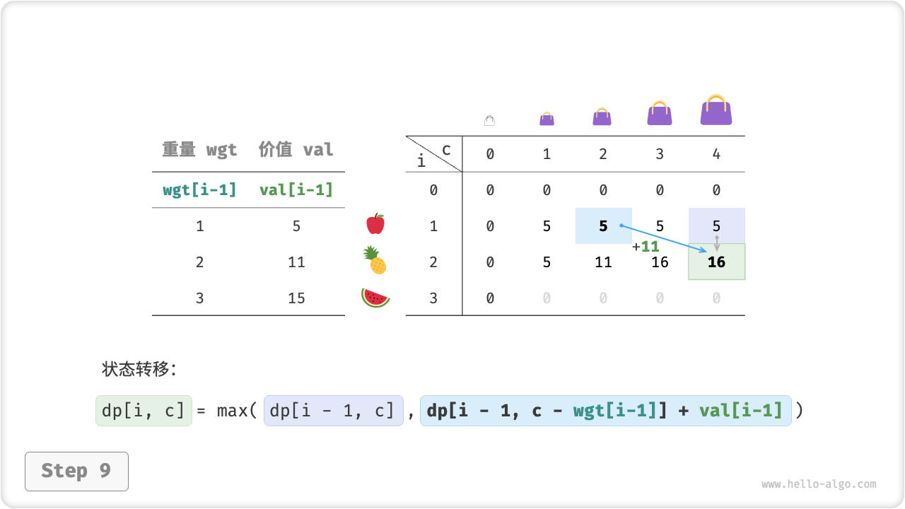

=== "<10>"
    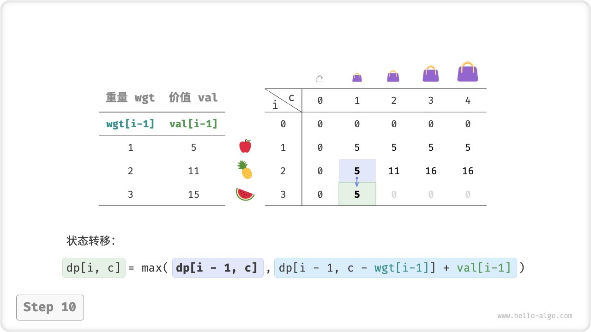

=== "<11>"
    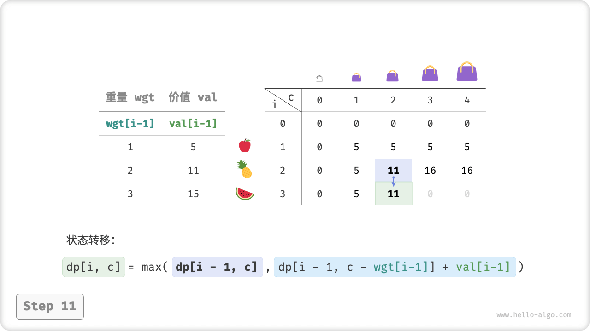

=== "<12>"
    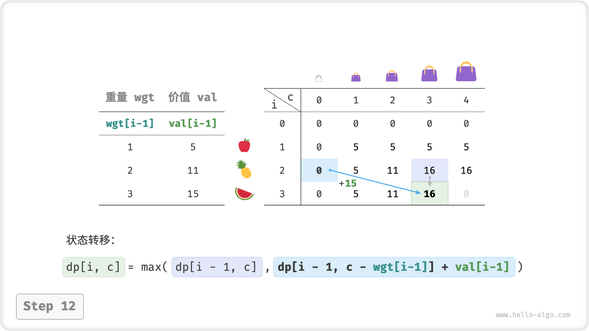

=== "<13>"
    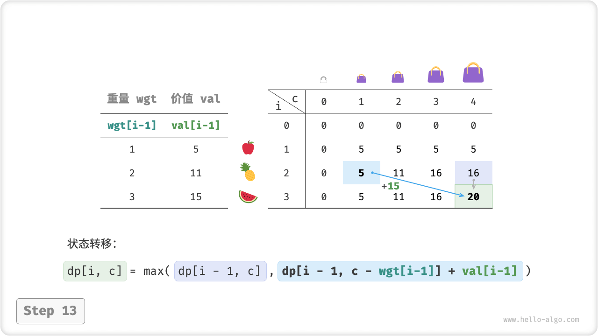

=== "<14>"
    

### Space Optimization

Since each state is only related to the state of its previous row, we can use two arrays to scroll forward, reducing the space complexity from $O(n^2)$ to $O(n)$ .

Thinking further, can we achieve spatial optimization using only an array? Observation shows that each state is transferred from the lattice directly above or to the upper left. Assuming there is only one array, when starting to traverse the $i$th row, the array stores still the state of the $i-1$th row.

- If we take positive order traversal, then when traversing to $dp[i, j]$, the top left $dp[i-1, 1]$ ~ $dp[i-1, j-1]$ values may have been overwritten, and then we cannot get the correct state transfer result.
- If an inverted traversal is taken, the overwrite problem does not occur and the state transfer can be performed correctly.

The figure below shows the conversion from row $i = 1$ to row $i = 2$ under a single array. Consider the difference between an orthogonal traversal and an inverted traversal.

=== "<1>"
    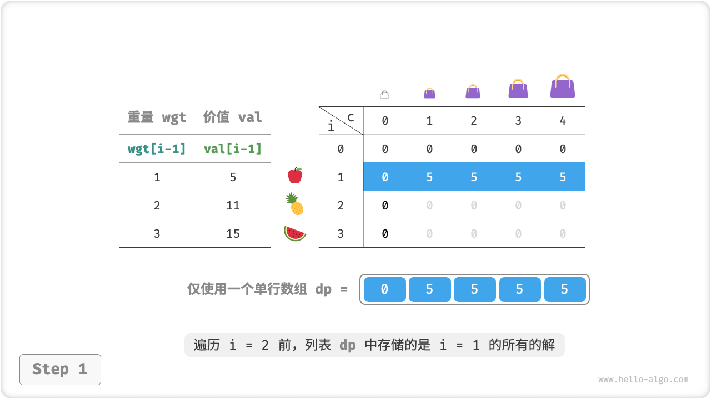

=== "<2>"
    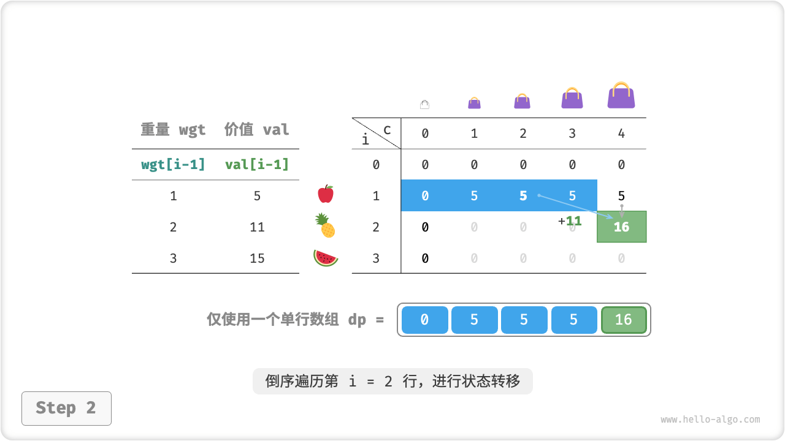

=== "<3>"
    

=== "<4>"
    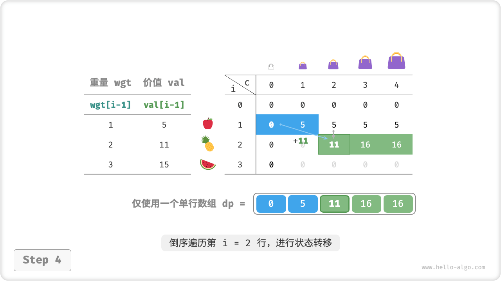

=== "<5>"
    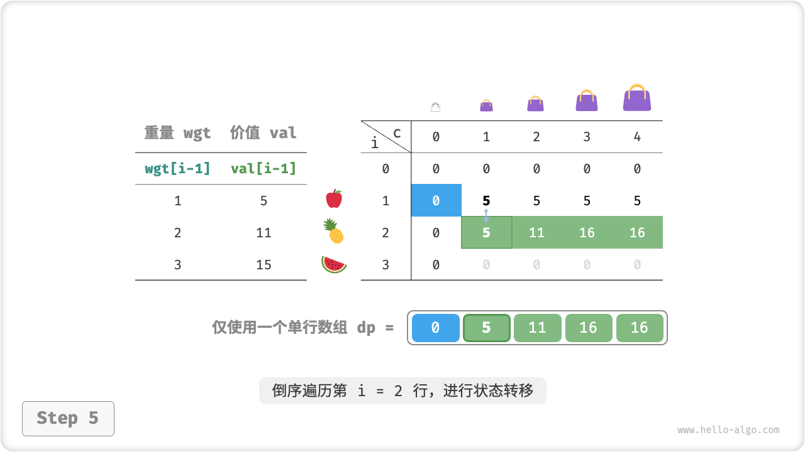

=== "<6>"
    

In the code implementation, we simply remove the first dimension $i$ of the array `dp` and change the inner loop to an inverted traversal.

```src
[file]{knapsack}-[class]{}-[func]{knapsack_dp_comp}
```
