# Complete Knapsack Problem

In this section, we start by solving another common knapsack problem: complete knapsacks, and then learn about a special case of it: change exchange.

## Totally Backpacked

!!! question

    Given $n$ items, the weight of the $i$th item is $wgt[i-1]$, the value is $val[i-1]$ , and a backpack with capacity $cap$. **Each item can be selected repeatedly**. Please return the maximum value of an item that can be put into the backpack without exceeding its capacity.


### Ideas For Dynamic Programming

The full knapsack is very similar to the 0-1 knapsack problem, **differing only in not limiting the number of times an item can be selected**.

- In 0-1 backpacks, there is only one item per backpack, so when you put an item $i$ into your backpack, you can only choose from the first $i-1$ items.
- In a Full Backpack, there are an infinite number of each item, so after placing an item $i$ into the backpack, **can still select from the previous $i$ items**.

Under the full backpacking provision, changes in the state $[i, c]$ are categorized into two cases.

- **Do not put items $i$** : Same as 0-1 backpack, transfer to $[i-1, c]$ .
- **Put in item $i$** : Transfer to $[i, c-wgt[i-1]]$ unlike 0-1 backpack.

Thus the state-trasition equation becomes:

$$
dp[i, c] = \max(dp[i-1, c], dp[i, c - wgt[i-1]] + val[i-1])
$$

### Code Implementation

Comparing the code of the two questions, one of the state transfers changes from $i-1$ to $i$, and the rest are identical.

```src
[file]{unbounded_knapsack}-[class]{}-[func]{unbounded_knapsack_dp}
```

### Space Optimization

Since the current state is transferred from the state on the left and above, **the spatial optimization should take a positive-order traversal of each row in the $dp$ table**.

This traversal order is the opposite of 0-1 backpack. Please take the help of the figure below to understand the difference.

=== "<1>"
    

=== "<2>"
    

=== "<3>"
    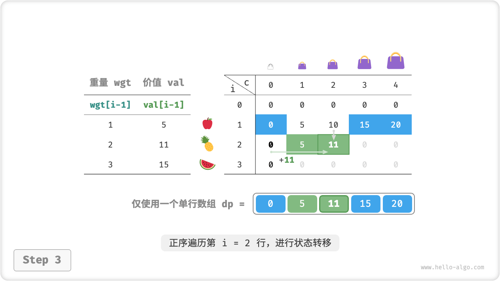

=== "<4>"
    

=== "<5>"
    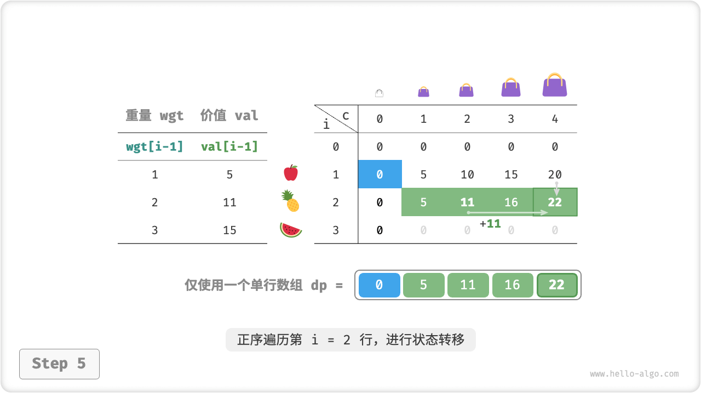

=== "<6>"
    

The code is relatively simple to implement, simply removing the first dimension of the array `dp`.

```src
[file]{unbounded_knapsack}-[class]{}-[func]{unbounded_knapsack_dp_comp}
```

## Change Exchange Problems

The knapsack problem is representative of a large class of dynamic programming problems that have many variants, such as the change exchange problem.

!!! question

    Given $n$ coins, the face value of the first $i$ coin is $coins[i - 1]$ and the target amount is $amt$ , **each coin can be selected repeatedly**, ask the minimum number of coins that can make the target amount. Return $-1$ if the target amount cannot be rounded up.

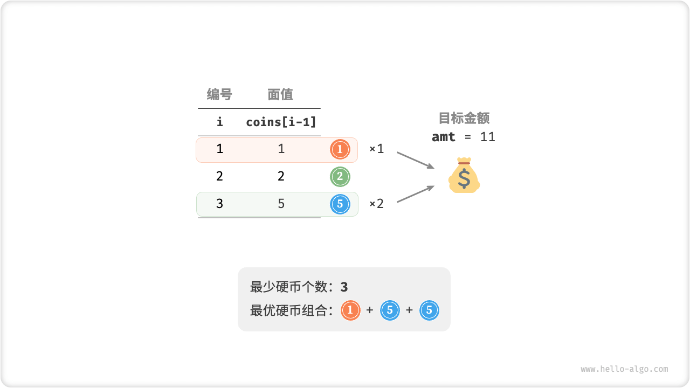

### Ideas For Dynamic Programming

**Change exchange can be seen as a special case of full backpacking**. The two have the following connections and differences.

- The two questions can be interchanged, with "item" corresponding to "coin", "item weight" corresponding to "coin denomination "Item" corresponds to "Coin", "Item Weight" corresponds to "Coin Face Value", and "Backpack Capacity" corresponds to "Target Amount".
- The optimization goals are reversed; the knapsack problem is to maximize the value of items and the change exchange problem is to minimize the number of coins.
- The knapsack problem is to find a solution that "does not exceed" the capacity of the knapsack, and the change exchange is to find a solution that "just happens" to be the target amount.

**Step 1: Think about the decisions made in each round and define the state that leads to the $dp$ table**

The subproblem corresponding to the state $[i, a]$ is: **The minimum number of coins that the first $i$ coins can come up with the amount $a$**, denoted as $dp[i, a]$ .

The dimensions of the 2D $dp$ table are $(n+1) \times (amt+1)$ .

**Step 2: Find the optimal substructure, and hence derive the state-transition equation**

There are two differences between this problem and the state-trasition equation for a complete backpack, as follows.

- This question requires the minimum value, so you need to change the operator $\max()$ to $\min()$.
- The subject of optimization is the number of coins, not the value of the item, so just execute $+1$ when you select the coins.

$$
dp[i, a] = \min(dp[i-1, a], dp[i, a - coins[i-1]] + 1)
$$

**Step 3: Determine boundary conditions and state transfer order**

When the target amount is $0$, the minimum number of coins to make it is $0$, i.e. all $dp[i, 0]$ in the first column are equal to $0$.

When there are no coins, **cannot come up with any $> 0$ target amount**, i.e., it is an invalid solution. In order for the $\min()$ function in the state-transition equation to recognize and filter invalid solutions, we consider using $+ \infty$ to represent them, i.e., making all $dp[0, a]$ in the first row equal to $+ \infty$ .

### Code Implementation

Most programming languages do not provide $+ \infty$ variables, and the maximum value of the integer `int` can be used instead. This, in turn, can lead to large number overruns: the $+ 1$ operation in the state-transition equation can overflow.

For this reason, we use the number $amt + 1$ to denote the null solution, since the maximum number of coins that make up $amt$ is $amt$.

Before the final return, determine if $dp[n, amt]$ is equal to $amt + 1$, if it is, then return $-1$, which means the target amount cannot be reached.

```src
[file]{coin_change}-[class]{}-[func]{coin_change_dp}
```

The figure below shows the dynamic programming process for change exchange, very similar to a full backpack.

=== "<1>"
    

=== "<2>"
    

=== "<3>"
    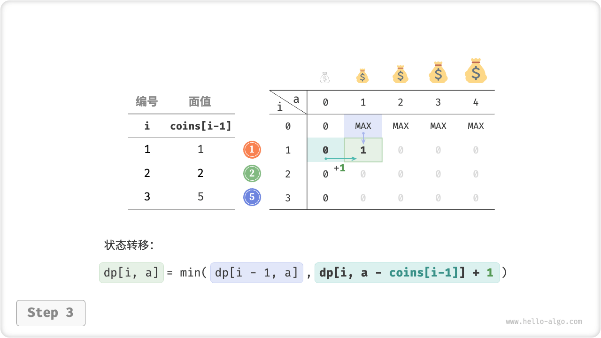

=== "<4>"
    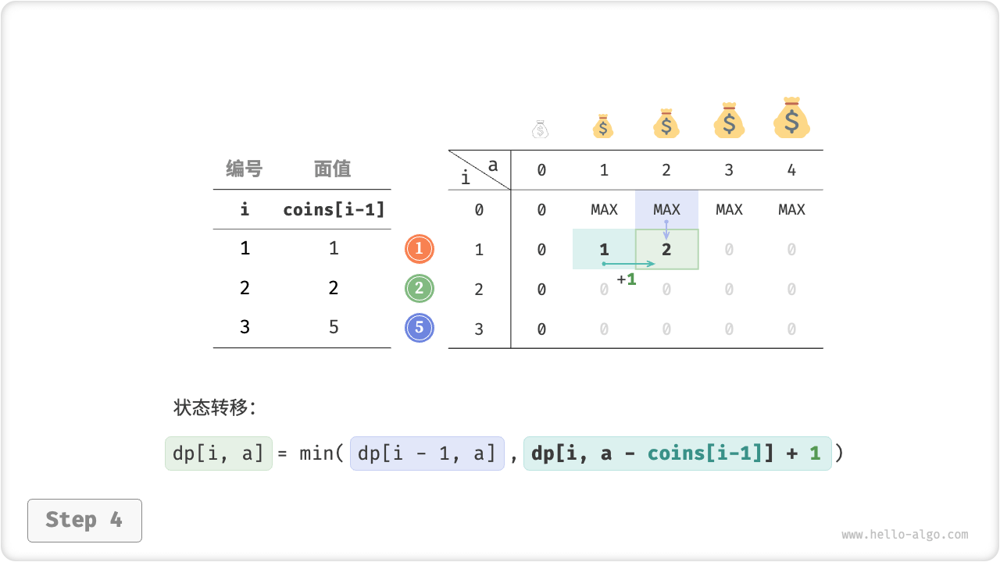

=== "<5>"
    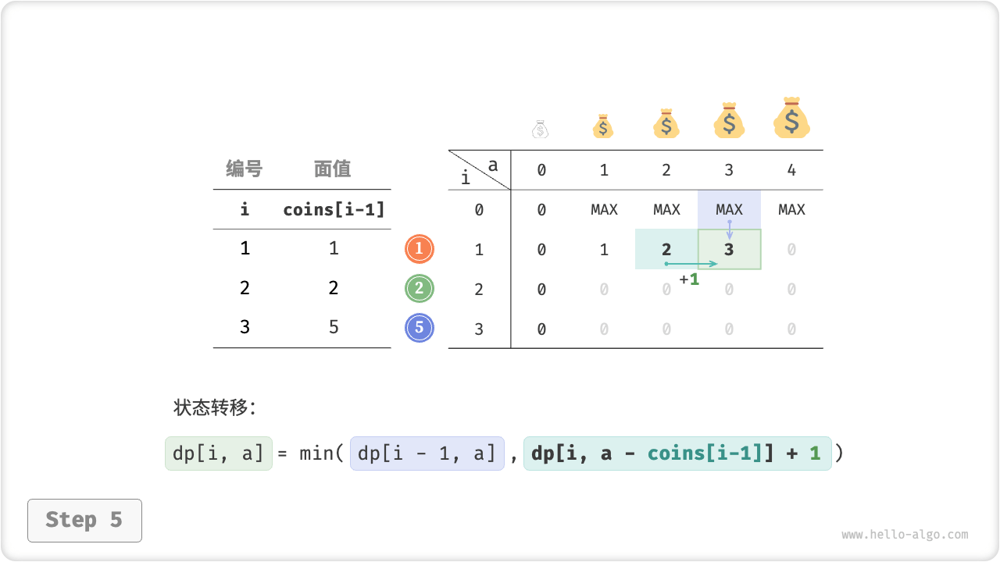

=== "<6>"
    

=== "<7>"
    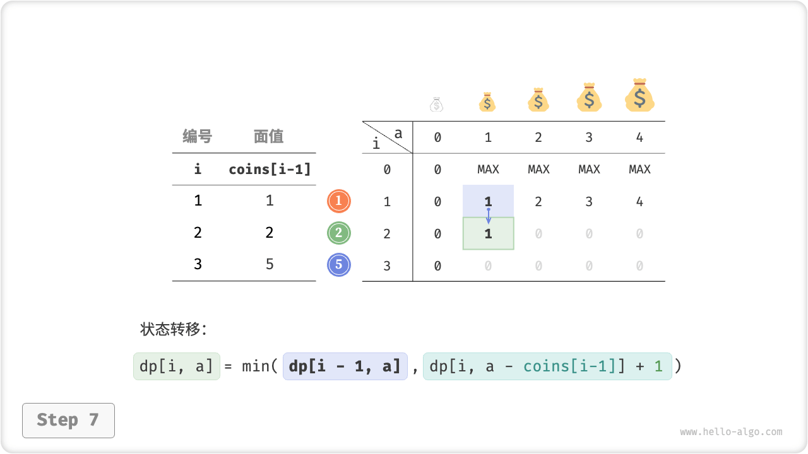

=== "<8>"
    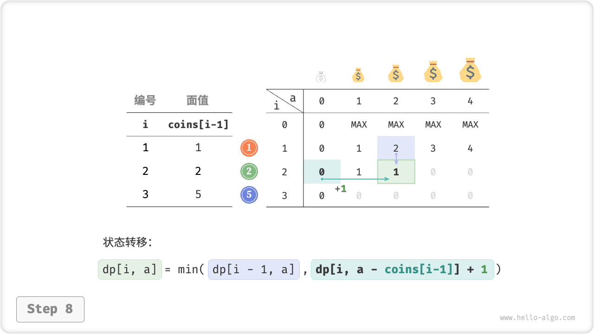

=== "<9>"
    

=== "<10>"
    

=== "<11>"
    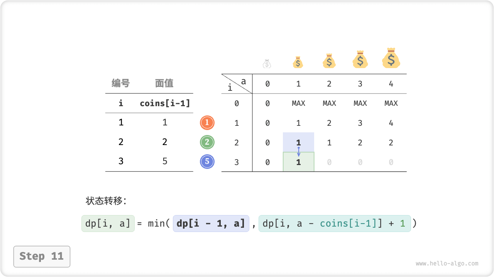

=== "<12>"
    

=== "<13>"
    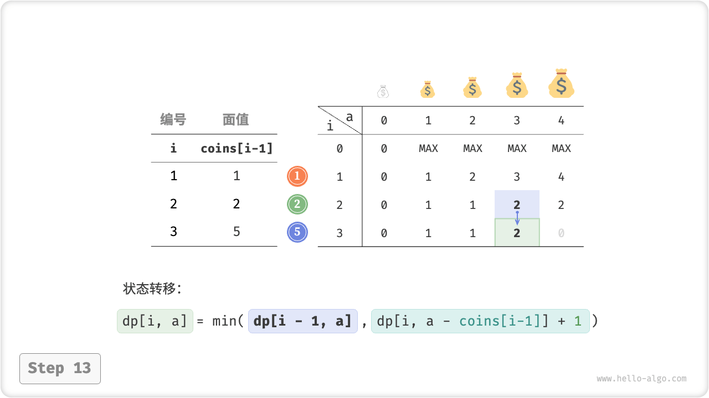

=== "<14>"
    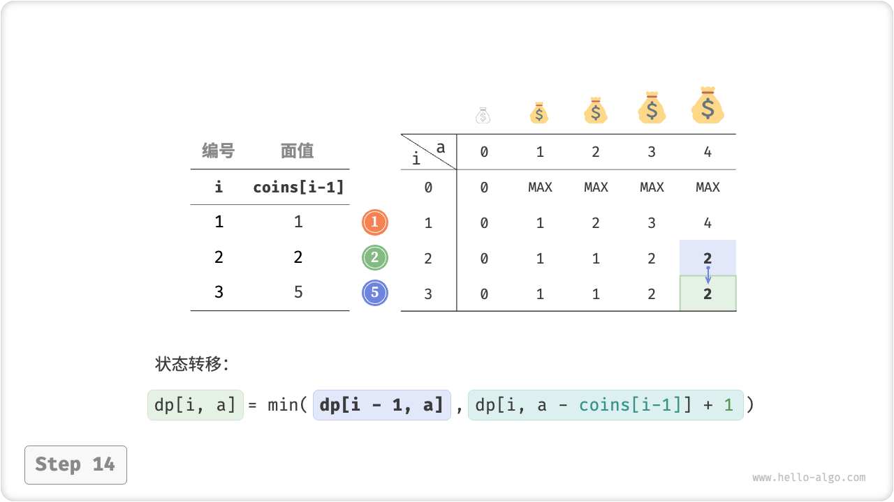

=== "<15>"
    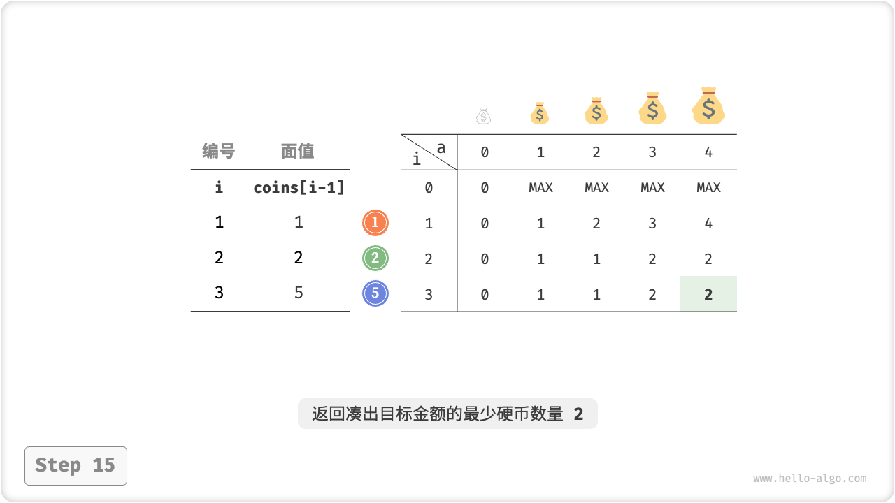

### Space Optimization

The space-optimized handling of change redemption is consistent with a full backpack.

```src
[file]{coin_change}-[class]{}-[func]{coin_change_dp_comp}
```

## Change Exchange Problem II

!!! question

    Given $n$ coins, the face value of the first $i$ coin is $coins[i - 1]$ , and the target amount is $amt$ , and each coin can be selected repeatedly, **Please return the number of coin combinations** that are in the process of rounding up to the target amount.


### Ideas For Dynamic Programming

Compared to the previous question, the goal of this question is the number of combinations, so the sub-problem becomes: **the number of combinations** of the first $i$ coins that can come up with the amount $a$. And the $dp$ table is still a 2D matrix of size $(n+1) \times (amt + 1)$.

The number of combinations of the current state is equal to the sum of the number of combinations of the two decisions of not choosing the current coin and choosing the current coin. The state-transition equation is:

$$
dp[i, a] = dp[i-1, a] + dp[i, a - coins[i-1]]
$$

When the target amount is $0$, no coins need to be selected to get the target amount, so all $dp[i, 0]$ in the first row should be initialized to $1$ . When there are no coins, it is impossible to get any $>0$ target amount, so all $dp[0, a]$ in the first row are equal to $0$.

### Code Implementation

```src
[file]{coin_change_ii}-[class]{}-[func]{coin_change_ii_dp}
```

### Space Optimization

Spatial optimization is handled in the same way, by removing the coin dimension.

```src
[file]{coin_change_ii}-[class]{}-[func]{coin_change_ii_dp_comp}
```
