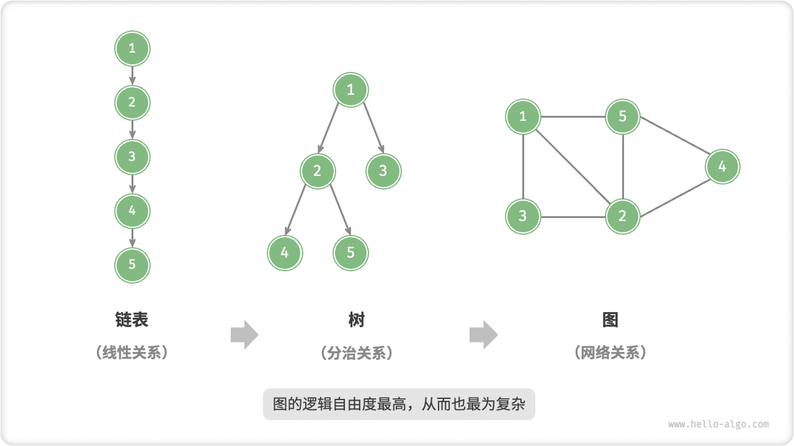
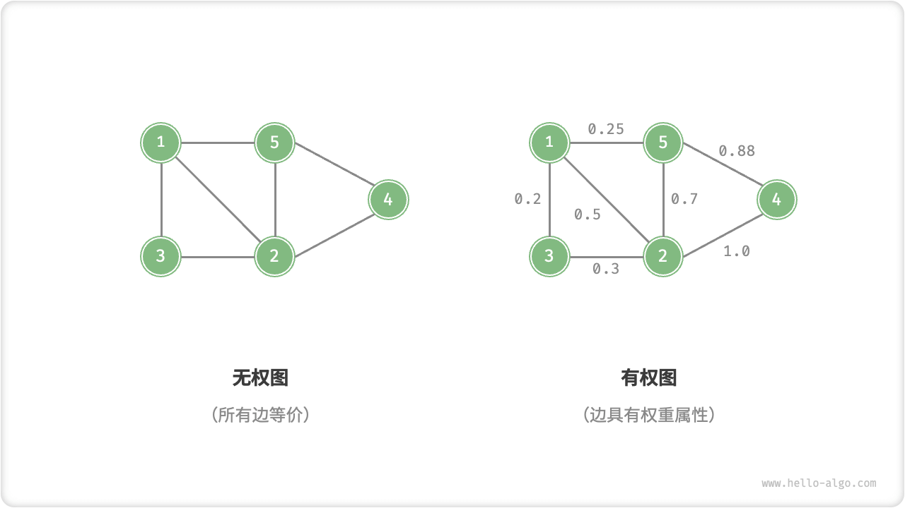

# Graph

"A graph is a non-linear data structure consisting of a vertex and an edge. We can abstractly represent a graph $G$ as a set of vertices $V$ and a set of edges $E$. The following example shows a graph with 5 vertices and 7 edges.

$$
\begin{aligned}
V & = \{ 1, 2, 3, 4, 5 \} \newline
E & = \{ (1,2), (1,3), (1,5), (2,3), (2,4), (2,5), (4,5) \} \newline
G & = \{ V, E \} \newline
\end{aligned}
$$

If we consider the vertices as nodes and the edges as references (pointers) connecting the individual nodes, we can think of a graph as a data structure expanded from a linked list. As shown in the figure below, **compared to linear relationships (linked lists) and divide and conquer relationships (trees), network relationships (graphs) have more degrees of freedom and thus are more complex**.

## Common Types Of Graphs And Terminology

According to whether the edges are directed or not, it can be categorized into "undirected graph" and "directed graph" as shown in the figure below.

- In an undirected graph, edges represent "bi-directional" connections between two vertices, such as "friend relationships" in WeChat or QQ.
- In a directed graph, edges are directional, i.e. $A \rightarrow B$ and $A \leftarrow B$ edges are independent of each other, e.g., the relationship between "following" and "being followed" on Weibo or Jitterbug.

According to whether all the vertices are connected or not, it can be categorized into "connected graph" and "disconnected graph" as shown in the figure below.

- For a connected graph, starting from a vertex, you can reach any of the remaining vertices.
- For a disconnected graph, at least one vertex is unreachable from some vertex.

We can also add "weight" variables to the edges to get a "weighted graph" as shown in the figure below. For example, in handheld games such as Honor of Kings, the system will calculate the "intimacy" between players based on the common playing time, and this kind of intimacy network can be represented by a weighted graph.

The graph data structure contains the following common terms.

- "adjacency adjacency": two vertices are said to be "adjacency" when there are edges connecting them. In the figure above, the adjacency of vertex 1 is vertex 2, 3 and 5.
- "path": The sequence of edges passing from vertex A to vertex B is called a "path" from A to B. In the figure above, the edge sequence 1-5-2-4 is a path from vertex 1 to vertex 4. In the figure above, the edge sequence 1-5-2-4 is a path from vertex 1 to vertex 4.
- "degree": the number of edges a vertex has. For a directed graph, "in-degree" means how many edges are directed to the vertex, and "out-degree" means how many edges are directed away from the vertex.

## Representation Of Graphs

Common representations of graphs include "adjacency matrix" and "adjacency list". The following is an example of an undirected graph.

### Adjacency Matrix

Let the number of vertices of a graph be $n$, the "adjacency matrix" uses a matrix of size $n \times n$ to represent the graph, each row (column) represents a vertex, and the elements of the matrix represent edges, and $1$ or $0$ denotes the existence of an edge between two vertices.

As shown in the figure below, let the adjacency matrix be $M$ and the list of vertices be $V$, then the matrix element $M[i, j] = 1$ means that there exists an edge between the vertex $V[i]$ to the vertex $V[j]$ and vice versa $M[i, j] = 0$ means that there is no edge between the two vertices.

The adjacency matrix has the following properties.

- A vertex cannot be connected to itself, so the main diagonal elements of the adjacency matrix are meaningless.
- For undirected graphs, the edges in both directions are equivalent, when the adjacency matrix is symmetric about the main diagonal.
- By replacing the elements of the adjacency matrix from $1$ and $0$ to weights, the weighted graph can be represented.

When using an adjacency matrix to represent a graph, we can directly access the matrix elements to get the edges, so the addition, deletion, and checking operations are very efficient with a time complexity of $O(1)$ . However, the space complexity of the matrix is $O(n^2)$ , which is more memory intensive.

### Adjacency List

"The adjacency list represents a graph using $n$ linked lists, where the nodes of the linked lists represent the vertices. The $i$th linked list corresponds to vertex $i$, which stores all the adjacency vertices (i.e., vertices connected to that vertex) of that vertex. The figure below shows an example of a graph stored using an adjacency list.

An adjacency list stores only the edges that actually exist, and the total number of edges is usually much less than $n^2$, so it is more space efficient. However, you need to find edges in an adjacency list by traversing the linked list, so it is not as time efficient as an adjacency matrix.

Observing the figure above, **the structure of the adjacency list is very similar to the "separate chaining" of addresses in hash tables, so we can use a similar method to optimize the efficiency**. For example, when the linked list is long, it can be converted into an avl tree or a red-black tree to optimize the time efficiency from $O(n)$ to $O(\log n)$; or it can be converted into a hash table to reduce the time complexity to $O(1)$.

## Graphs Common Applications

As shown in the table below, many realistic systems can be modeled by graphs, and the corresponding problems can be approximated as graph computation problems.

 Table <id> &nbsp; Common Real-Life Graphs 

|                 | Vertices | Edges                                    | Graph computation problems     |
| --------------- | -------- | ---------------------------------------- | ------------------------------ |
| Social Networks | Users    | Friendships                              | Potential Friend Referrals     |
| Subway Lines    | Stations | Connectivity Between Stations            | Shortest Route Recommendations |
| Solar System    | Stars    | Gravitational interactions between stars | Planetary orbit calculations   |
